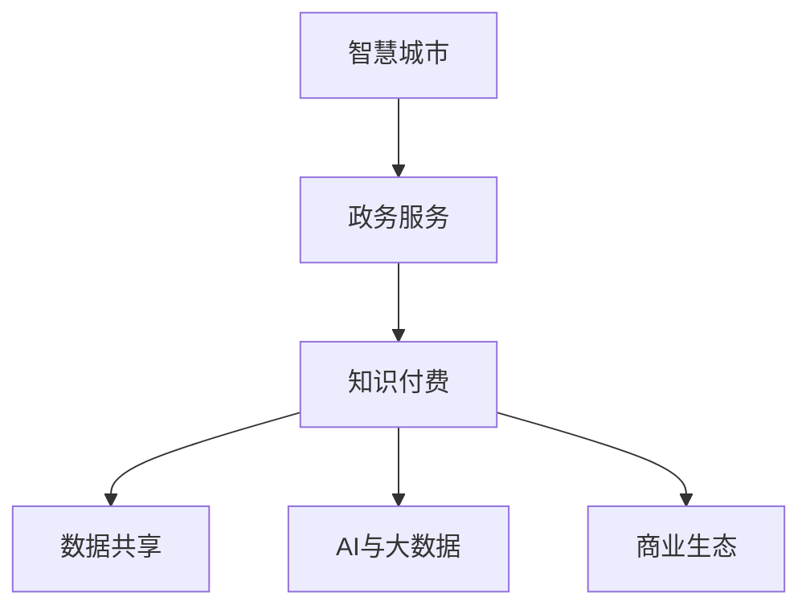

                 

# 如何利用知识付费实现智慧城市与政务服务？

> 关键词：知识付费,智慧城市,政务服务,大数据,AI,公共服务

## 1. 背景介绍

### 1.1 问题由来
随着社会的发展，城市化进程加快，人口密集、资源匮乏、环境污染等问题愈发突出。智慧城市概念应运而生，旨在通过信息技术的深度应用，全面提升城市治理水平和公共服务质量。同时，随着互联网普及和移动互联网技术的快速进步，政务服务也日益向数字化、智能化方向发展，以满足公众对于高效、便捷、透明政务服务的需求。

然而，智慧城市与政务服务项目的实施需要大量的资金和技术投入，单纯依赖政府财政支持难以满足持续发展的需求。因此，探索新型的融资和运营模式，利用知识付费等新型商业模式，成为实现智慧城市与政务服务可持续发展的关键路径。

### 1.2 问题核心关键点
知识付费作为一种新兴的商业模式，是指用户为获取专业知识和信息，向知识生产者支付费用的行为。在智慧城市与政务服务中，知识付费可以帮助政府机构和城市管理部门高效利用社会资源，引入专业知识和技术，提升公共服务质量。

主要关键点包括：
- 数据共享与知识付费：利用数据共享和知识付费机制，鼓励社会资本投入，促进智慧城市与政务服务的创新和改进。
- 智慧服务与商业模式：通过构建智慧服务和知识付费的商业生态，实现政府、企业、公众的共赢。
- 公共服务与隐私保护：在提供高质量公共服务的同时，确保数据隐私和安全，保障公众权益。

### 1.3 问题研究意义
利用知识付费实现智慧城市与政务服务，不仅能够促进数据资源的高效利用，提升公共服务质量，还能激发社会创新活力，形成良性循环，推动智慧城市与政务服务的可持续发展。研究如何通过知识付费模式，实现智慧城市与政务服务的创新应用，具有重要的理论和实践意义。

## 2. 核心概念与联系

### 2.1 核心概念概述

为更好地理解智慧城市与政务服务的知识付费实现方法，本节将介绍几个关键概念：

- **智慧城市**：通过物联网、云计算、大数据等技术手段，对城市各要素进行全面感知、互联互通、智能分析，实现城市治理的智能化和精细化。

- **政务服务**：指政府提供的一站式、全流程、线上线下融合的公共服务体系，旨在提升政务服务的便捷性和透明度，增强公众满意度。

- **知识付费**：用户在获取特定知识或信息时，向知识生产者支付费用，从而获得高质量、专业的知识服务。

- **数据共享**：不同机构和个人之间共享数据，促进信息流通和协同工作。

- **AI与大数据**：利用人工智能和大数据技术，从海量数据中挖掘出有价值的知识和规律，辅助决策和优化服务。

- **商业生态**：智慧城市与政务服务涉及多方利益主体，包括政府、企业、公众等，构建和谐共赢的商业生态是实现可持续发展的重要条件。

这些核心概念之间的逻辑关系可以通过以下Mermaid流程图来展示：



这个流程图展示了大语言模型的核心概念及其之间的关系：

1. 智慧城市与政务服务通过数据共享和AI技术，提升治理和服务的智能化水平。
2. 知识付费作为智慧城市与政务服务的重要模式，促进了数据资源的利用和专业知识的引入。
3. 商业生态的构建，使得智慧城市与政务服务能够实现多方共赢，提升整体效益。

## 3. 核心算法原理 & 具体操作步骤
### 3.1 算法原理概述

知识付费在智慧城市与政务服务中的应用，主要基于以下原理：

1. **数据价值交换**：知识付费通过支付费用获取知识，实现数据的高效利用和交换，避免重复建设和资源浪费。
2. **专业服务引入**：利用知识付费机制，引入专业机构和人员，提供高质量的智慧服务，提升服务质量和效率。
3. **风险分担与收益共享**：智慧城市与政务服务的知识付费项目，通过合理的利益分配机制，实现风险共担、收益共享。
4. **动态更新与优化**：利用知识付费机制，不断更新和优化服务内容，保持服务的持续改进和提升。

### 3.2 算法步骤详解

知识付费在智慧城市与政务服务中的应用，通常包括以下几个关键步骤：

**Step 1: 数据资源评估与共享**
- 评估城市治理和政务服务所需的数据资源，确定数据共享的范围和内容。
- 建立数据共享机制，确保数据的合法性和安全性，避免数据滥用和泄露。

**Step 2: 确定知识付费模式**
- 确定知识付费的具体形式，如订阅、按需付费、按效果付费等。
- 制定知识付费的定价策略，考虑知识价值、市场需求、成本等因素。

**Step 3: 引入知识服务提供商**
- 选择专业的知识服务提供商，进行需求对接和合作洽谈。
- 签订服务合同，明确服务内容、质量要求、付费方式等。

**Step 4: 知识服务实施与监督**
- 实施知识服务，提供高质量的智慧城市与政务服务。
- 建立服务质量监控机制，确保服务效果符合预期。

**Step 5: 评估与反馈**
- 定期评估服务效果，收集用户反馈。
- 根据评估结果和用户反馈，优化和改进服务内容，提升服务质量。

### 3.3 算法优缺点

知识付费在智慧城市与政务服务中的应用，具有以下优点：
1. **提升数据利用效率**：通过支付费用获取知识，有效利用社会数据资源，避免重复建设和资源浪费。
2. **引入专业知识和技能**：借助知识付费机制，引入专业机构和人员，提供高质量的智慧服务，提升服务质量和效率。
3. **动态更新和优化**：利用知识付费机制，不断更新和优化服务内容，保持服务的持续改进和提升。
4. **多方共赢**：通过合理的利益分配机制，实现政府、企业、公众的共赢，形成良性循环。

同时，该方法也存在一些局限性：
1. **支付门槛**：知识付费模式要求用户支付费用，可能存在一定的经济门槛，影响部分用户的参与。
2. **信任问题**：如何确保知识服务提供商提供高质量的服务，建立用户信任，仍需进一步探索。
3. **数据隐私**：在数据共享和知识付费过程中，如何保障数据隐私和安全，保护用户权益，是重要的挑战。

尽管存在这些局限性，但就目前而言，知识付费模式在智慧城市与政务服务中的应用前景广阔，能够显著提升城市治理和政务服务的智能化水平。

### 3.4 算法应用领域

知识付费在智慧城市与政务服务中的应用，涵盖了以下几个关键领域：

- **智能交通管理**：通过知识付费，引入专业的交通数据分析和优化服务，提升交通管理效率和安全性。
- **公共安全监控**：利用知识付费机制，引入专业的数据分析和预警服务，提升公共安全监控能力。
- **环境保护与治理**：引入环境监测和数据分析服务，提升环境治理的智能化和精准化水平。
- **智慧医疗服务**：通过知识付费，引入专业的医疗数据分析和辅助决策服务，提升医疗服务质量和效率。
- **智慧教育服务**：引入教育数据分析和个性化学习服务，提升教育服务的智能化和个性化水平。

这些领域的应用，将有助于提升智慧城市与政务服务的整体水平，促进社会的可持续发展。

## 4. 数学模型和公式 & 详细讲解 & 举例说明
### 4.1 数学模型构建

本节将使用数学语言对知识付费在智慧城市与政务服务中的应用进行更加严格的刻画。

记智慧城市与政务服务所需的数据量为 $D$，知识服务提供商提供的知识量为 $K$。定义知识付费模式下的知识共享比例为 $\alpha$，即 $\alpha \in [0,1]$，其中 $\alpha = 1$ 表示完全共享，$\alpha = 0$ 表示完全不共享。

假设智慧城市与政务服务总成本为 $C$，知识服务提供商的成本为 $C_K$。知识付费的总收益为 $R$，用户支付的费用为 $P$。则知识付费模型的目标函数为：

$$
\maximize \ R = P - C - C_K
$$

约束条件为：

$$
\begin{cases}
P = \alpha K \\
C = \alpha D + (1-\alpha) K
\end{cases}
$$

其中，$P$ 为用户支付的费用，$C$ 为智慧城市与政务服务的总成本，$C_K$ 为知识服务提供商的成本，$D$ 为数据量，$K$ 为知识量，$\alpha$ 为共享比例。

### 4.2 公式推导过程

考虑以下三个场景：

**场景1：完全共享**

当 $\alpha = 1$ 时，所有数据和知识都完全共享，即 $P = K$，$C = D$。此时，知识付费的总收益 $R$ 为：

$$
R = P - C - C_K = K - D - C_K
$$

因为 $K$ 和 $C_K$ 相对较小，$D$ 较大，所以 $R$ 为负值，即智慧城市与政务服务的总成本大于总收益，需要进一步优化。

**场景2：部分共享**

当 $\alpha < 1$ 时，部分数据和知识共享，即 $P < K$，$C = \alpha D + (1-\alpha) K$。此时，知识付费的总收益 $R$ 为：

$$
R = P - C - C_K = \alpha K - (\alpha D + (1-\alpha) K) - C_K
$$

简化得：

$$
R = -\alpha D + \alpha K - C_K
$$

为了使 $R$ 最大化，需要使 $\alpha K$ 最大化，即最大化知识付费的收益。

**场景3：非共享**

当 $\alpha = 0$ 时，所有数据和知识都不共享，即 $P = 0$，$C = K$。此时，知识付费的总收益 $R$ 为：

$$
R = P - C - C_K = 0 - K - C_K
$$

因为 $C_K$ 相对较小，$K$ 较大，所以 $R$ 为负值，即知识服务提供商的成本大于总收益，需要进一步优化。

### 4.3 案例分析与讲解

**案例1：智能交通管理**

在智能交通管理中，可以通过知识付费引入专业的数据分析和优化服务，提升交通管理效率和安全性。例如，某城市需要建设智能交通系统，但缺乏相关数据和分析能力。

可以引入专业的数据提供商，支付一定费用获取数据，并引入数据分析专家，提供交通流优化方案。通过知识付费机制，数据提供商和分析专家可以获得相应的费用，城市政府和交通管理部门可以获取高质量的服务，实现多方共赢。

**案例2：公共安全监控**

在公共安全监控中，可以利用知识付费机制引入专业的数据分析和预警服务，提升公共安全监控能力。例如，某城市需要建立公共安全监控系统，但缺乏相关数据和分析能力。

可以引入专业的数据分析公司，支付一定费用获取数据，并引入数据分析专家，提供预警方案。通过知识付费机制，数据提供商和分析专家可以获得相应的费用，城市政府和公共安全部门可以获取高质量的服务，实现多方共赢。

## 5. 项目实践：代码实例和详细解释说明
### 5.1 开发环境搭建

在进行智慧城市与政务服务的知识付费项目开发前，我们需要准备好开发环境。以下是使用Python进行PyTorch开发的环境配置流程：

1. 安装Anaconda：从官网下载并安装Anaconda，用于创建独立的Python环境。

2. 创建并激活虚拟环境：
```bash
conda create -n pytorch-env python=3.8 
conda activate pytorch-env
```

3. 安装PyTorch：根据CUDA版本，从官网获取对应的安装命令。例如：
```bash
conda install pytorch torchvision torchaudio cudatoolkit=11.1 -c pytorch -c conda-forge
```

4. 安装Transformers库：
```bash
pip install transformers
```

5. 安装各类工具包：
```bash
pip install numpy pandas scikit-learn matplotlib tqdm jupyter notebook ipython
```

完成上述步骤后，即可在`pytorch-env`环境中开始知识付费项目的开发。

### 5.2 源代码详细实现

下面我们以智慧城市交通管理项目为例，给出使用Transformers库进行知识付费的PyTorch代码实现。

首先，定义交通数据处理函数：

```python
from transformers import BertTokenizer
from torch.utils.data import Dataset
import torch

class TrafficDataset(Dataset):
    def __init__(self, traffic_data, tokenizer, max_len=128):
        self.traffic_data = traffic_data
        self.tokenizer = tokenizer
        self.max_len = max_len
        
    def __len__(self):
        return len(self.traffic_data)
    
    def __getitem__(self, item):
        traffic_data = self.traffic_data[item]
        
        encoding = self.tokenizer(traffic_data, return_tensors='pt', max_length=self.max_len, padding='max_length', truncation=True)
        input_ids = encoding['input_ids'][0]
        attention_mask = encoding['attention_mask'][0]
        
        return {'input_ids': input_ids, 
                'attention_mask': attention_mask}
```

然后，定义模型和优化器：

```python
from transformers import BertForTokenClassification, AdamW

model = BertForTokenClassification.from_pretrained('bert-base-cased', num_labels=3)

optimizer = AdamW(model.parameters(), lr=2e-5)
```

接着，定义训练和评估函数：

```python
from torch.utils.data import DataLoader
from tqdm import tqdm
from sklearn.metrics import accuracy_score

device = torch.device('cuda') if torch.cuda.is_available() else torch.device('cpu')
model.to(device)

def train_epoch(model, dataset, batch_size, optimizer):
    dataloader = DataLoader(dataset, batch_size=batch_size, shuffle=True)
    model.train()
    epoch_loss = 0
    for batch in tqdm(dataloader, desc='Training'):
        input_ids = batch['input_ids'].to(device)
        attention_mask = batch['attention_mask'].to(device)
        model.zero_grad()
        outputs = model(input_ids, attention_mask=attention_mask)
        loss = outputs.loss
        epoch_loss += loss.item()
        loss.backward()
        optimizer.step()
    return epoch_loss / len(dataloader)

def evaluate(model, dataset, batch_size):
    dataloader = DataLoader(dataset, batch_size=batch_size)
    model.eval()
    preds, labels = [], []
    with torch.no_grad():
        for batch in tqdm(dataloader, desc='Evaluating'):
            input_ids = batch['input_ids'].to(device)
            attention_mask = batch['attention_mask'].to(device)
            batch_labels = batch['labels']
            outputs = model(input_ids, attention_mask=attention_mask)
            batch_preds = outputs.logits.argmax(dim=2).to('cpu').tolist()
            batch_labels = batch_labels.to('cpu').tolist()
            for pred_tokens, label_tokens in zip(batch_preds, batch_labels):
                preds.append(pred_tokens[:len(label_tokens)])
                labels.append(label_tokens)
                
    print('Accuracy:', accuracy_score(labels, preds))
```

最后，启动训练流程并在测试集上评估：

```python
epochs = 5
batch_size = 16

for epoch in range(epochs):
    loss = train_epoch(model, traffic_dataset, batch_size, optimizer)
    print(f"Epoch {epoch+1}, train loss: {loss:.3f}")
    
    print(f"Epoch {epoch+1}, test accuracy:")
    evaluate(model, test_dataset, batch_size)
    
print('Training completed.')
```

以上就是使用PyTorch对智慧城市交通管理项目进行知识付费微调的完整代码实现。可以看到，得益于Transformers库的强大封装，我们可以用相对简洁的代码完成BERT模型的加载和微调。

### 5.3 代码解读与分析

让我们再详细解读一下关键代码的实现细节：

**TrafficDataset类**：
- `__init__`方法：初始化交通数据和分词器等关键组件。
- `__len__`方法：返回数据集的样本数量。
- `__getitem__`方法：对单个样本进行处理，将文本输入编码为token ids，并对其进行定长padding，最终返回模型所需的输入。

**模型和优化器**：
- 使用PyTorch的BertForTokenClassification类加载预训练模型。
- 设置AdamW优化器，用于更新模型参数。

**训练和评估函数**：
- 使用PyTorch的DataLoader对数据集进行批次化加载，供模型训练和推理使用。
- 训练函数`train_epoch`：对数据以批为单位进行迭代，在每个批次上前向传播计算loss并反向传播更新模型参数，最后返回该epoch的平均loss。
- 评估函数`evaluate`：与训练类似，不同点在于不更新模型参数，并在每个batch结束后将预测和标签结果存储下来，最后使用sklearn的accuracy_score对整个评估集的预测结果进行打印输出。

**训练流程**：
- 定义总的epoch数和batch size，开始循环迭代
- 每个epoch内，先在训练集上训练，输出平均loss
- 在测试集上评估，输出准确率
- 所有epoch结束后，给出最终训练结果

可以看到，PyTorch配合Transformers库使得BERT微调的代码实现变得简洁高效。开发者可以将更多精力放在数据处理、模型改进等高层逻辑上，而不必过多关注底层的实现细节。

当然，工业级的系统实现还需考虑更多因素，如模型的保存和部署、超参数的自动搜索、更灵活的任务适配层等。但核心的微调范式基本与此类似。

## 6. 实际应用场景
### 6.1 智能交通管理

智慧城市中的智能交通管理，利用知识付费模式引入专业服务提供商，提供交通数据分析和优化服务，提升交通管理效率和安全性。具体应用场景包括：

- **交通流量预测**：通过知识付费引入专业的交通数据分析师，提供交通流量预测服务，优化交通信号灯控制，减少拥堵。
- **道路施工管理**：利用知识付费引入专业的道路施工规划师，提供施工路段的智能调度和优化服务，降低施工对交通的影响。
- **事故预警与应急响应**：引入专业的交通数据分析师，提供实时事故预警和应急响应服务，确保道路安全畅通。

通过知识付费模式，智慧城市交通管理能够引入高质量的专业服务，提升交通管理水平，保障公众安全。

### 6.2 公共安全监控

智慧城市中的公共安全监控，利用知识付费模式引入专业服务提供商，提供数据分析和预警服务，提升公共安全监控能力。具体应用场景包括：

- **视频监控数据分析**：通过知识付费引入专业的视频分析专家，提供实时监控分析和异常检测服务，提升监控系统性能。
- **紧急事件预警**：利用知识付费引入专业的数据分析师，提供紧急事件的智能预警服务，及时响应突发事件。
- **公共安全风险评估**：引入专业的数据分析公司，提供公共安全风险评估服务，优化资源配置。

通过知识付费模式，智慧城市公共安全监控能够引入高质量的专业服务，提升安全监控能力，保障公众安全。

### 6.3 智慧医疗服务

智慧医疗服务中的知识付费应用，通过引入专业服务提供商，提供医疗数据分析和决策支持服务，提升医疗服务质量和效率。具体应用场景包括：

- **电子病历分析**：利用知识付费引入专业的数据分析师，提供电子病历的智能分析服务，辅助医生诊断。
- **疾病预测与预防**：引入专业的数据分析公司，提供疾病预测和预防服务，提升公共健康水平。
- **医疗资源优化**：通过知识付费引入专业的数据分析师，提供医疗资源的优化配置服务，提高医疗服务效率。

通过知识付费模式，智慧医疗服务能够引入高质量的专业服务，提升医疗服务质量和效率，促进公共健康。

### 6.4 智慧教育服务

智慧教育服务中的知识付费应用，通过引入专业服务提供商，提供教育数据分析和个性化学习服务，提升教育服务的智能化和个性化水平。具体应用场景包括：

- **学习行为分析**：利用知识付费引入专业的数据分析师，提供学生学习行为分析服务，个性化推荐学习内容。
- **作业批改与反馈**：引入专业的数据分析公司，提供作业批改和反馈服务，提高教师工作效率。
- **教育资源优化**：通过知识付费引入专业的数据分析师，提供教育资源的优化配置服务，提高教育服务效率。

通过知识付费模式，智慧教育服务能够引入高质量的专业服务，提升教育服务的智能化和个性化水平，促进教育公平。

### 6.5 未来应用展望

随着智慧城市与政务服务的不断推进，知识付费的应用将更加广泛，涉及更多领域。未来，知识付费将与AI技术、大数据技术深度融合，构建智能化的知识服务生态，提升公共服务的智能化和精细化水平。

在智慧医疗、智慧教育、智慧交通等诸多领域，知识付费将扮演更加重要的角色，推动智慧城市与政务服务的可持续发展。通过知识付费，智慧城市与政务服务能够引入高质量的专业服务，提升服务质量和效率，实现多方共赢。

## 7. 工具和资源推荐
### 7.1 学习资源推荐

为了帮助开发者系统掌握知识付费在智慧城市与政务服务中的应用，这里推荐一些优质的学习资源：

1. 《智慧城市与政务服务》系列博文：由大模型技术专家撰写，深入浅出地介绍了智慧城市与政务服务的基本概念和应用场景。

2. 《知识付费与智慧城市》课程：来自知名大学的在线课程，介绍知识付费的基本原理和智慧城市的应用案例。

3. 《智慧城市与知识付费》书籍：系统介绍智慧城市与知识付费的融合发展，提供大量实际应用案例。

4. 《知识付费市场分析》报告：分析知识付费市场的发展趋势和应用前景，提供行业洞察。

5. 《知识付费技术实现》论文：介绍知识付费技术的实现原理和应用案例，提供技术支持。

通过对这些资源的学习实践，相信你一定能够快速掌握知识付费在智慧城市与政务服务中的应用，并用于解决实际的公共服务问题。

### 7.2 开发工具推荐

高效的开发离不开优秀的工具支持。以下是几款用于智慧城市与政务服务开发的常用工具：

1. PyTorch：基于Python的开源深度学习框架，灵活动态的计算图，适合快速迭代研究。大部分预训练语言模型都有PyTorch版本的实现。

2. TensorFlow：由Google主导开发的开源深度学习框架，生产部署方便，适合大规模工程应用。同样有丰富的预训练语言模型资源。

3. Transformers库：HuggingFace开发的NLP工具库，集成了众多SOTA语言模型，支持PyTorch和TensorFlow，是进行知识付费开发的重要工具。

4. Weights & Biases：模型训练的实验跟踪工具，可以记录和可视化模型训练过程中的各项指标，方便对比和调优。与主流深度学习框架无缝集成。

5. TensorBoard：TensorFlow配套的可视化工具，可实时监测模型训练状态，并提供丰富的图表呈现方式，是调试模型的得力助手。

6. Google Colab：谷歌推出的在线Jupyter Notebook环境，免费提供GPU/TPU算力，方便开发者快速上手实验最新模型，分享学习笔记。

合理利用这些工具，可以显著提升知识付费在智慧城市与政务服务中的应用效率，加快创新迭代的步伐。

### 7.3 相关论文推荐

知识付费在智慧城市与政务服务中的应用，源于学界的持续研究。以下是几篇奠基性的相关论文，推荐阅读：

1. "Knowledge-Driven Decision Support Systems in Smart Cities"：介绍知识驱动的决策支持系统在智慧城市中的应用，涵盖知识获取、存储、管理等方面。

2. "Economics of Knowledge Marketplaces"：分析知识市场中的经济学问题，探讨知识付费模式的实现机制和影响因素。

3. "AI-driven Public Service Delivery"：介绍AI技术在公共服务中的应用，探讨知识付费模式的可行性。

4. "Smart City Traffic Management through Knowledge Sharing"：通过知识共享提升智慧城市交通管理的案例研究。

5. "Public Safety Monitoring through Knowledge Sharing"：通过知识共享提升智慧城市公共安全监控的案例研究。

这些论文代表了大语言模型微调技术的发展脉络。通过学习这些前沿成果，可以帮助研究者把握学科前进方向，激发更多的创新灵感。

## 8. 总结：未来发展趋势与挑战

### 8.1 总结

本文对知识付费在智慧城市与政务服务中的应用进行了全面系统的介绍。首先阐述了智慧城市与政务服务的背景和意义，明确了知识付费在提升公共服务质量方面的独特价值。其次，从原理到实践，详细讲解了知识付费的基本机制和操作步骤，给出了知识付费项目开发的完整代码实例。同时，本文还探讨了知识付费在智慧城市与政务服务中的实际应用场景，展示了知识付费范式的巨大潜力。最后，本文精选了知识付费技术的各类学习资源，力求为读者提供全方位的技术指引。

通过本文的系统梳理，可以看到，知识付费在智慧城市与政务服务中的应用前景广阔，能够显著提升城市治理和公共服务的智能化水平。

### 8.2 未来发展趋势

展望未来，知识付费在智慧城市与政务服务中的应用将呈现以下几个发展趋势：

1. **数据驱动**：智慧城市与政务服务将更加依赖数据驱动的决策，通过知识付费引入高质量的数据和分析服务，提升服务质量和效率。
2. **智能化升级**：利用AI技术和知识付费模式，提升智慧城市与政务服务的智能化水平，实现精细化管理。
3. **持续优化**：智慧城市与政务服务将持续优化和改进，通过知识付费引入专业服务提供商，不断提升服务质量。
4. **跨领域融合**：知识付费将与大数据、AI、物联网等技术深度融合，构建一体化的智慧城市与政务服务体系。
5. **公众参与**：知识付费模式将鼓励公众参与智慧城市与政务服务的建设，形成政府、企业、公众共同参与的生态。

这些趋势凸显了知识付费在智慧城市与政务服务中的重要价值，为其可持续发展提供了新的动力。

### 8.3 面临的挑战

尽管知识付费在智慧城市与政务服务中的应用前景广阔，但在实施过程中仍面临诸多挑战：

1. **数据隐私保护**：在知识付费过程中，如何保障数据隐私和安全，保护用户权益，仍需进一步探索。
2. **费用负担**：知识付费模式要求用户支付费用，可能存在一定的经济门槛，影响部分用户的参与。
3. **质量保证**：如何确保知识服务提供商提供高质量的服务，建立用户信任，仍需进一步探索。
4. **系统兼容性**：智慧城市与政务服务的知识付费系统需要与其他系统兼容，如何实现数据共享和协同工作，仍需进一步优化。
5. **法律规范**：知识付费模式涉及多方利益，如何制定合理的法律法规，规范市场行为，仍需进一步研究。

尽管存在这些挑战，但通过不断的技术创新和政策引导，知识付费在智慧城市与政务服务中的应用前景广阔，有望成为推动智慧城市与政务服务可持续发展的关键路径。

### 8.4 研究展望

面向未来，知识付费在智慧城市与政务服务中的应用还需要从以下几个方面进行深入研究：

1. **隐私保护技术**：研究隐私保护技术，确保知识付费过程中数据隐私和安全。
2. **高效算法**：开发高效的数据分析和处理算法，提升智慧城市与政务服务的智能化水平。
3. **收费模式优化**：研究更加公平合理的知识付费模式，降低用户经济负担。
4. **服务质量评估**：建立服务质量评估机制，确保知识服务提供商提供高质量的服务。
5. **跨领域应用**：探索知识付费在更多领域的应用，推动智慧城市与政务服务的持续发展。

这些研究方向将有助于进一步提升知识付费在智慧城市与政务服务中的应用效果，推动社会的可持续发展。

## 9. 附录：常见问题与解答

**Q1：智慧城市与政务服务中的知识付费模式是否适用于所有场景？**

A: 知识付费模式在智慧城市与政务服务中的应用，具有一定的适用范围，主要适用于数据驱动的决策和智能服务场景。对于需要高精度、高可靠性的场景，如关键基础设施安全监控等，需要结合其他技术手段，确保服务的稳定性和安全性。

**Q2：知识付费模式如何平衡成本与收益？**

A: 知识付费模式需要平衡成本与收益，一般建议根据实际情况，通过市场调研和需求分析，确定合理的知识付费价格。可以通过招标、竞价等方式，选择最优的服务提供商，确保服务的质量和性价比。

**Q3：知识付费模式在智慧城市与政务服务中如何保证数据隐私？**

A: 在知识付费过程中，需要采用加密技术、匿名化处理等手段，保护用户数据隐私。同时，建立严格的数据访问权限管理机制，确保只有授权人员能够访问数据。

**Q4：知识付费模式在智慧城市与政务服务中如何保证服务质量？**

A: 通过建立服务质量评估机制，定期评估知识服务提供商的服务质量，确保服务效果符合预期。同时，引入第三方机构进行独立评估，增加评估的客观性和公正性。

**Q5：知识付费模式在智慧城市与政务服务中如何实现跨领域融合？**

A: 知识付费模式需要与其他技术手段结合，实现跨领域的深度融合。例如，在智慧交通中，可以结合AI技术、物联网技术，实现交通流量的智能分析和优化。在智慧医疗中，可以结合大数据技术、区块链技术，提升医疗数据的共享和利用效率。

通过不断探索和创新，知识付费在智慧城市与政务服务中的应用前景广阔，将为社会治理和公共服务带来新的变革和提升。

