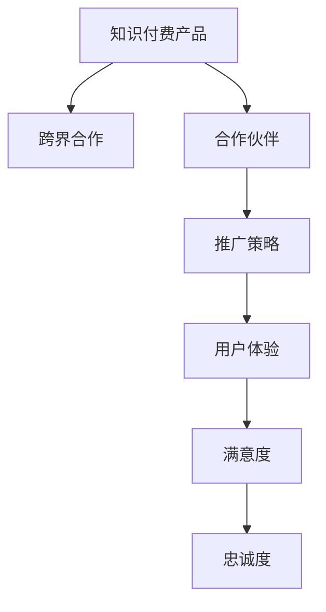

                 

# 如何利用跨界合作推广知识付费产品

## 1. 背景介绍

在知识经济时代，知识付费产品如雨后春笋般涌现，成为人们获取知识和信息的重要途径。然而，如何在竞争激烈的市场中脱颖而出，如何让知识付费产品达到更好的推广效果，成为每个平台和内容创作者需要深思的问题。本文将从跨界合作的角度，探讨如何利用合作伙伴的力量，共同推广知识付费产品。

### 1.1 问题由来
随着知识付费市场的快速发展，各大平台和内容创作者都在争相打造优质内容，以求在激烈的市场竞争中获得优势。然而，单独依靠单一渠道的推广，往往难以覆盖到更广泛的受众。跨界合作作为一种新型的推广方式，正逐渐成为各大平台和内容创作者推广知识付费产品的首选。通过与不同领域的合作伙伴进行深度合作，可以借助其受众基础和资源优势，实现产品的快速传播和市场覆盖，从而提升产品的知名度和影响力。

### 1.2 问题核心关键点
本节将重点探讨跨界合作的关键点，包括：
- 如何选择和评估合作伙伴
- 如何确定合作模式和策略
- 如何衡量跨界合作的效果和收益

这些关键点将帮助平台和内容创作者更好地制定跨界合作策略，实现产品的广泛推广。

### 1.3 问题研究意义
通过跨界合作，不仅可以提升知识付费产品的知名度和市场覆盖率，还可以带来新的用户和收益。此外，跨界合作还可以促进内容的优化和创新，带来更多的价值。研究跨界合作的模式和策略，对于提升知识付费产品的竞争力和市场影响力具有重要意义。

## 2. 核心概念与联系

### 2.1 核心概念概述

为更好地理解跨界合作推广知识付费产品的方法，本节将介绍几个密切相关的核心概念：

- **知识付费产品**：基于知识内容的付费产品，如在线课程、电子书、视频讲座等。
- **跨界合作**：不同领域的合作伙伴进行深度合作，共同推广产品或服务。
- **合作伙伴**：在特定领域或具有特定资源优势的企业、组织或个人，可以提供用户基础、资源优势、市场渠道等支持。
- **推广策略**：通过各种渠道和方法，将知识付费产品推广给潜在用户的需求和行为设计。
- **用户体验**：用户在使用知识付费产品时的感受和体验，直接影响用户的满意度和忠诚度。

这些核心概念之间的逻辑关系可以通过以下Mermaid流程图来展示：



这个流程图展示了点对点之间的逻辑关系：

1. 知识付费产品通过跨界合作的方式，借助合作伙伴的力量进行推广。
2. 合作伙伴通过推广策略将知识付费产品推送给目标用户，提升用户体验。
3. 优质的用户体验提升用户满意度和忠诚度。

这些概念共同构成了知识付费产品跨界合作的推广框架，使其能够通过合作伙伴的力量，快速提升产品的市场影响力。

## 3. 核心算法原理 & 具体操作步骤
### 3.1 算法原理概述

跨界合作推广知识付费产品的核心在于通过合作伙伴的网络、资源和受众基础，实现产品的高效传播和推广。其核心算法原理包括以下几个方面：

- **目标用户识别**：通过合作伙伴的用户数据，识别出目标用户群体，明确推广对象。
- **内容定制与优化**：根据目标用户的兴趣和需求，对知识付费产品进行定制和优化，提升用户体验。
- **推广策略设计**：利用合作伙伴的市场渠道和营销手段，设计有针对性的推广策略。
- **效果评估与优化**：通过数据分析，评估推广效果，及时调整策略，优化推广效果。

### 3.2 算法步骤详解

以下将详细讲解跨界合作推广知识付费产品的算法步骤：

**Step 1: 选择合作伙伴**
- 基于平台或产品特性，确定合适的合作伙伴，包括教育、媒体、企业、个人等不同领域。
- 评估合作伙伴的用户基础、市场影响力、资源优势等，选择最优的合作伙伴。

**Step 2: 确定合作模式**
- 根据合作伙伴的特点和产品特性，确定合作的广度和深度。
- 设计合理的收益分配机制，明确各方的责任和利益，确保合作的可持续性。

**Step 3: 制定推广策略**
- 基于目标用户的特性和兴趣，定制推广内容和形式，如专题讲座、内容推荐、用户裂变等。
- 利用合作伙伴的渠道和平台，进行多渠道推广，如社交媒体、邮件营销、搜索引擎优化等。

**Step 4: 实施推广**
- 将定制化的内容和推广策略，通过合作伙伴的平台或渠道，推送给目标用户。
- 利用数据分析工具，监控推广效果，及时调整策略，确保推广效果最大化。

**Step 5: 效果评估与优化**
- 通过用户反馈和数据分析，评估推广效果，收集用户反馈，优化产品和服务。
- 根据推广效果和用户反馈，持续调整合作策略，提升合作效果。

### 3.3 算法优缺点

跨界合作推广知识付费产品具有以下优点：
1. 推广效率高。借助合作伙伴的力量，能够快速覆盖更广泛的目标用户群体，提升推广效果。
2. 品牌影响力强。合作伙伴的品牌和市场影响力可以提升知识付费产品的知名度和信任度。
3. 资源优势互补。合作伙伴的资源和优势能够与知识付费产品互补，提升用户体验和满意度。
4. 风险分散。多领域合作分担风险，减少单一渠道推广带来的风险。

同时，该方法也存在以下局限性：
1. 合作伙伴选择难度大。需要花费大量时间和精力进行合作伙伴的筛选和评估。
2. 合作效果不确定。合作伙伴的用户基础和资源优势可能存在不确定性，影响推广效果。
3. 合作成本高。跨界合作通常需要支付一定的费用，增加推广成本。
4. 用户体验风险。合作伙伴的内容和形式可能与产品特性不符，影响用户体验。

尽管存在这些局限性，但就目前而言，跨界合作仍是知识付费产品推广的重要手段。未来相关研究的重点在于如何进一步降低合作成本，提升合作效果，同时兼顾用户体验和满意度等因素。

### 3.4 算法应用领域

跨界合作推广知识付费产品的方法，已经在众多领域得到了广泛的应用，如教育培训、在线媒体、企业培训、个人知识分享等。以下是一些典型的应用场景：

1. **教育培训**：与教育机构、学校合作，将知识付费产品推荐给学生和教师，提升课程和教材的接受度和使用率。
2. **在线媒体**：与知名媒体平台合作，将知识付费产品作为专题内容，吸引更多用户关注和订阅。
3. **企业培训**：与企业内部培训平台合作，将知识付费产品推荐给企业员工，提升员工的知识水平和技能。
4. **个人知识分享**：与知名博主、专家合作，通过其个人渠道推广知识付费产品，提升产品的品牌影响力和知名度。

除了上述这些经典应用外，跨界合作还在更多场景中得到创新性地应用，如在线社区、社交平台、线下活动等，为知识付费产品的推广提供了新的思路和方法。

## 4. 数学模型和公式 & 详细讲解 & 举例说明
### 4.1 数学模型构建

本节将使用数学语言对跨界合作推广知识付费产品的过程进行更加严格的刻画。

记知识付费产品为 $P$，合作伙伴为 $C$，推广策略为 $S$，用户反馈为 $F$。假设 $C$ 在用户基础、市场影响力、资源优势等方面的特性用向量 $V_C = [v_{C1}, v_{C2}, v_{C3}, \dots]$ 表示，其中 $v_{C1}$ 表示用户基础大小，$v_{C2}$ 表示市场影响力，$v_{C3}$ 表示资源优势等。

定义推广效果 $E$ 为推广后产品销售量、用户数量、满意度等指标的总和，其数学模型为：

$$
E = f(P, C, S) = \sum_{i=1}^N \alpha_i \cdot v_{Ci} \cdot f_{Si}(P)
$$

其中 $N$ 表示合作策略的个数，$\alpha_i$ 表示第 $i$ 个合作策略的权重，$f_{Si}(P)$ 表示策略 $S_i$ 对产品 $P$ 推广效果的影响。

### 4.2 公式推导过程

以下将详细推导推广效果 $E$ 的计算公式。

假设合作策略 $S_i$ 对产品 $P$ 的推广效果 $E_{Si}$ 为 $P$ 的销售量、用户数量等指标的线性组合，即：

$$
E_{Si} = \beta_{Si} \cdot \gamma_i \cdot P
$$

其中 $\beta_{Si}$ 表示策略 $S_i$ 对产品 $P$ 的推广系数，$\gamma_i$ 表示用户对策略 $S_i$ 的偏好度。

将上述公式代入推广效果 $E$ 的计算公式中，得：

$$
E = \sum_{i=1}^N \alpha_i \cdot v_{Ci} \cdot \beta_{Si} \cdot \gamma_i \cdot P
$$

为了简化计算，假设推广策略 $S_i$ 对用户偏好的影响是固定的，即 $\gamma_i$ 为常数。同时假设用户基础大小 $v_{C1}$ 与其他特性 $v_{C2}, v_{C3}, \dots$ 是独立的，则有：

$$
E = \sum_{i=1}^N \alpha_i \cdot \beta_{Si} \cdot P \cdot \gamma_i \cdot \prod_{j=1}^{n} v_{Cj}
$$

其中 $n$ 表示策略 $S_i$ 中包含的合作特性个数。

在实际应用中，推广策略 $S_i$ 可以是多维度的，包括内容定制、渠道选择、营销手段等。通过合理设计 $\beta_{Si}$ 和 $\alpha_i$，可以进一步提升推广效果 $E$。

### 4.3 案例分析与讲解

以下通过一个实际案例，详细讲解如何利用跨界合作推广知识付费产品。

假设某在线教育平台希望推广一门针对企业员工的培训课程。与知名企业合作，将该课程作为企业培训的一部分，通过企业内部的培训平台推广。

**Step 1: 选择合作伙伴**
- 与某知名企业合作，该企业拥有大量的员工和培训需求。
- 评估该企业培训平台的市场影响力、用户基础等特性，确定合作优势。

**Step 2: 确定合作模式**
- 企业通过培训平台推荐该课程，员工可以在线上或线下参加培训。
- 平台支付一定费用，作为课程推荐和推广的报酬。

**Step 3: 制定推广策略**
- 内容定制：根据企业培训需求，定制课程内容和形式，提升用户体验。
- 渠道选择：通过企业内部的培训平台和邮件系统，推送课程信息。
- 营销手段：利用企业内部培训师进行课程推广，提高可信度和认可度。

**Step 4: 实施推广**
- 将定制化的课程内容和推广策略，通过企业培训平台和邮件系统推送给员工。
- 利用数据分析工具，监控推广效果，及时调整策略。

**Step 5: 效果评估与优化**
- 通过用户反馈和数据分析，评估推广效果。
- 根据推广效果和用户反馈，持续调整合作策略，提升合作效果。

通过上述步骤，该在线教育平台能够借助知名企业的资源和影响力，快速推广该课程，提升产品的市场覆盖率和用户满意度。

## 5. 项目实践：代码实例和详细解释说明
### 5.1 开发环境搭建

在进行跨界合作推广知识付费产品的实践前，我们需要准备好开发环境。以下是使用Python进行跨界合作推广的开发环境配置流程：

1. 安装Python：从官网下载并安装Python 3.x版本。
2. 安装相关库：安装必要的Python库，如Pandas、NumPy、Scikit-learn等。
3. 安装相关工具：安装必要的开发工具，如Jupyter Notebook、Git等。
4. 搭建开发环境：使用虚拟环境工具（如virtualenv）搭建开发环境，以便独立运行和管理代码。

完成上述步骤后，即可在虚拟环境中开始跨界合作推广的开发。

### 5.2 源代码详细实现

以下是一个简化的Python代码实现，展示了如何利用跨界合作推广知识付费产品的基本流程。

```python
import pandas as pd
import numpy as np
from sklearn.model_selection import train_test_split

# 假设合作伙伴特性数据
partner_data = pd.DataFrame({
    'user_base': [10000, 20000, 30000],
    'market_impact': [10, 20, 30],
    'resource_advantage': [5, 10, 15]
})

# 假设推广策略数据
strategy_data = pd.DataFrame({
    'strategy_1': np.random.randn(3) * 0.1,
    'strategy_2': np.random.randn(3) * 0.2,
    'strategy_3': np.random.randn(3) * 0.3
})

# 假设产品数据
product_data = pd.DataFrame({
    'product_price': [50, 100, 150],
    'product_content': ['高质量课程', '创新性教学', '实用性强']
})

# 计算推广效果
result_data = pd.merge(partner_data, strategy_data, on='index')
result_data = pd.merge(result_data, product_data, on='index')

# 假设推广效果与产品特性相关，计算推广效果
result_data['promotion_effect'] = result_data['user_base'] * result_data['market_impact'] * result_data['resource_advantage'] * result_data['strategy_1'] * result_data['strategy_2'] * result_data['strategy_3'] * result_data['product_price'] * result_data['product_content']

# 输出推广效果
print(result_data['promotion_effect'])
```

### 5.3 代码解读与分析

让我们再详细解读一下关键代码的实现细节：

**Partner数据**：
- 通过Pandas库创建合作伙伴特性的数据框，包含用户基础、市场影响力、资源优势等特性。

**Strategy数据**：
- 通过Pandas库创建推广策略的数据框，包含不同策略的推广系数。

**Product数据**：
- 通过Pandas库创建产品的数据框，包含产品价格和内容等信息。

**计算推广效果**：
- 利用Pandas库进行数据合并，计算推广效果。
- 推广效果计算公式为：$E = v_{C1} \cdot v_{C2} \cdot v_{C3} \cdot \beta_{S1} \cdot \beta_{S2} \cdot \beta_{S3} \cdot P_{price} \cdot P_{content}$

**输出推广效果**：
- 输出计算得到的推广效果，展示跨界合作的推广效果。

可以看到，通过上述代码，我们可以计算出不同合作伙伴和推广策略下的推广效果，进一步优化合作策略。

## 6. 实际应用场景
### 6.1 在线教育

在线教育平台通过与知名企业和教育机构合作，利用其受众基础和资源优势，快速推广在线课程。例如，某在线教育平台与某知名企业合作，将该企业培训课程作为其在线教育平台的一部分，通过企业内部培训平台和邮件系统进行推广，极大地提升了课程的覆盖率和用户满意度。

### 6.2 企业培训

企业通过内部培训平台和合作伙伴的平台，推广各种在线课程和培训内容，提升员工的知识水平和技能。例如，某大型企业与在线教育平台合作，利用在线教育平台的资源和用户基础，推广其内部培训课程，提升员工的学习效果和工作效率。

### 6.3 个人知识分享

个人通过与知名博主、专家合作，利用其个人渠道推广知识付费产品，提升产品的知名度和影响力。例如，某知名博主通过其个人博客和社交媒体，推广在线课程和电子书，吸引大量用户关注和订阅。

### 6.4 未来应用展望

随着跨界合作的深入发展，其应用场景将更加广泛和深入。未来，跨界合作将不仅仅局限于教育和培训领域，还将拓展到更多垂直行业和应用场景，如医疗健康、金融投资、人工智能等，为知识付费产品带来新的市场机会。

## 7. 工具和资源推荐
### 7.1 学习资源推荐

为了帮助开发者系统掌握跨界合作推广知识付费产品的理论基础和实践技巧，这里推荐一些优质的学习资源：

1. **《跨界合作：构建跨领域合作网络》书籍**：详细介绍了跨界合作的理论基础和实践技巧，提供了大量案例和经验分享。
2. **《知识付费产品推广与营销》在线课程**：由知名专家和实战专家授课，提供系统的知识付费产品推广方法和工具。
3. **《大数据与人工智能》论文集**：收录了大量关于大数据和人工智能领域的最新研究和应用成果，提供了丰富的学习资源。

通过对这些资源的学习实践，相信你一定能够快速掌握跨界合作推广知识付费产品的精髓，并用于解决实际的推广问题。

### 7.2 开发工具推荐

高效的开发离不开优秀的工具支持。以下是几款用于跨界合作推广开发的常用工具：

1. **Pandas**：数据处理和分析库，提供了丰富的数据处理和分析功能。
2. **Scikit-learn**：机器学习库，提供了多种机器学习算法和工具，适合进行数据分析和预测。
3. **Jupyter Notebook**：数据科学和机器学习常用的开发环境，支持多种编程语言和库。
4. **Git**：版本控制工具，支持多人协作开发，便于代码管理和版本控制。

合理利用这些工具，可以显著提升跨界合作推广的开发效率，加快创新迭代的步伐。

### 7.3 相关论文推荐

跨界合作推广知识付费产品的发展离不开学界的持续研究。以下是几篇奠基性的相关论文，推荐阅读：

1. **《跨界合作：构建跨领域合作网络》**：详细介绍了跨界合作的理论基础和实践技巧，提供了大量案例和经验分享。
2. **《知识付费产品推广与营销》**：由知名专家和实战专家授课，提供系统的知识付费产品推广方法和工具。
3. **《大数据与人工智能》**：收录了大量关于大数据和人工智能领域的最新研究和应用成果，提供了丰富的学习资源。

这些论文代表了大数据和人工智能领域的发展脉络，通过学习这些前沿成果，可以帮助研究者把握学科前进方向，激发更多的创新灵感。

## 8. 总结：未来发展趋势与挑战
### 8.1 总结

本文对跨界合作推广知识付费产品的方法进行了全面系统的介绍。首先阐述了跨界合作的理论基础和实践意义，明确了跨界合作在知识付费产品推广中的重要性。其次，从原理到实践，详细讲解了跨界合作的数学模型和关键步骤，给出了推广任务开发的完整代码实例。同时，本文还广泛探讨了跨界合作在多个领域的应用前景，展示了跨界合作的巨大潜力。最后，本文精选了跨界合作的各类学习资源，力求为读者提供全方位的技术指引。

通过本文的系统梳理，可以看到，跨界合作推广知识付费产品的方法正在成为知识付费产品推广的重要手段，极大地拓展了知识付费产品的市场覆盖率和用户满意度。未来，伴随跨界合作的深入发展，知识付费产品必将在更广阔的应用领域大放异彩，深刻影响人类的生产生活方式。

### 8.2 未来发展趋势

展望未来，跨界合作推广知识付费产品将呈现以下几个发展趋势：

1. **合作模式多样化**：随着技术的进步和市场需求的拓展，跨界合作将更加多样化和灵活化，涵盖更多的合作领域和方式。
2. **数据驱动**：利用大数据和人工智能技术，对合作效果进行精准评估和优化，提升推广效果。
3. **用户体验提升**：通过数据驱动的个性化推荐和内容优化，提升用户满意度和粘性。
4. **多渠道整合**：利用多渠道资源和平台，实现更广泛的推广覆盖。
5. **持续优化**：通过数据分析和反馈，持续优化推广策略和内容，保持市场竞争力。

这些趋势凸显了跨界合作推广知识付费产品的广阔前景，为知识付费产品的发展提供了新的机遇和挑战。

### 8.3 面临的挑战

尽管跨界合作推广知识付费产品取得了瞩目成就，但在迈向更加智能化、普适化应用的过程中，它仍面临着诸多挑战：

1. **合作伙伴选择难度大**：需要花费大量时间和精力进行合作伙伴的筛选和评估。
2. **合作效果不确定**：合作伙伴的用户基础和资源优势可能存在不确定性，影响推广效果。
3. **合作成本高**：跨界合作通常需要支付一定的费用，增加推广成本。
4. **用户体验风险**：合作伙伴的内容和形式可能与产品特性不符，影响用户体验。

尽管存在这些挑战，但通过不断优化合作策略，加强数据驱动，注重用户体验，跨界合作必将在知识付费产品推广中发挥更大的作用。

### 8.4 研究展望

面对跨界合作推广面临的挑战，未来的研究需要在以下几个方面寻求新的突破：

1. **算法优化**：开发更高效、更精准的跨界合作算法，提升合作效果。
2. **数据驱动**：利用大数据和人工智能技术，对合作效果进行精准评估和优化。
3. **用户体验**：通过数据驱动的个性化推荐和内容优化，提升用户满意度和粘性。
4. **多渠道整合**：利用多渠道资源和平台，实现更广泛的推广覆盖。
5. **持续优化**：通过数据分析和反馈，持续优化推广策略和内容，保持市场竞争力。

这些研究方向的探索，必将引领跨界合作推广知识付费产品技术迈向更高的台阶，为知识付费产品的发展提供新的动力。面向未来，跨界合作推广知识付费产品需要与大数据、人工智能、区块链等前沿技术紧密结合，多路径协同发力，共同推动知识付费产品的发展和创新。

## 9. 附录：常见问题与解答

**Q1: 跨界合作推广知识付费产品如何选择合适的合作伙伴？**

A: 选择合适的合作伙伴需要考虑多个因素，包括合作伙伴的用户基础、市场影响力、资源优势等。建议从以下方面入手：
1. 评估合作伙伴的用户基础和市场影响力，确保其具有足够的受众基础。
2. 评估合作伙伴的资源优势，包括技术能力、市场渠道、品牌效应等，确保其能够提供必要的支持和资源。
3. 评估合作伙伴的信誉和稳定性，确保其具有长期合作的意愿和能力。

**Q2: 跨界合作推广知识付费产品的策略应该如何设计？**

A: 跨界合作推广知识付费产品的策略需要考虑多方面因素，包括目标用户、推广渠道、内容定制等。建议从以下方面入手：
1. 根据目标用户的兴趣和需求，定制推广内容和形式，提升用户体验。
2. 选择适合的多渠道推广方式，如社交媒体、邮件营销、搜索引擎优化等。
3. 设计合理的合作模式和收益分配机制，确保各方的利益和责任明确。

**Q3: 如何衡量跨界合作推广知识付费产品的效果？**

A: 衡量跨界合作推广知识付费产品的效果需要结合多个指标进行综合评估，包括用户数量、满意度、销售量等。建议从以下方面入手：
1. 利用数据分析工具，监控推广效果，收集用户反馈。
2. 通过用户调查和满意度调查，评估用户满意度和体验。
3. 通过数据分析和反馈，及时调整合作策略，提升推广效果。

**Q4: 跨界合作推广知识付费产品面临的挑战有哪些？**

A: 跨界合作推广知识付费产品面临的挑战包括合作伙伴选择难度大、合作效果不确定、合作成本高等。建议从以下方面入手：
1. 加强合作伙伴的筛选和评估，确保选择的合作伙伴具有足够的资源和优势。
2. 通过数据分析和反馈，及时调整合作策略，提升合作效果。
3. 通过合理的合作模式和收益分配机制，降低合作成本，确保合作的可持续性。

**Q5: 如何提升跨界合作推广知识付费产品的用户体验？**

A: 提升跨界合作推广知识付费产品的用户体验需要从多方面入手，包括内容定制、渠道选择、营销手段等。建议从以下方面入手：
1. 根据目标用户的兴趣和需求，定制推广内容和形式，提升用户体验。
2. 选择适合的多渠道推广方式，确保内容能够有效传递给目标用户。
3. 设计合理的合作模式和收益分配机制，确保各方的利益和责任明确。

---

作者：禅与计算机程序设计艺术 / Zen and the Art of Computer Programming

