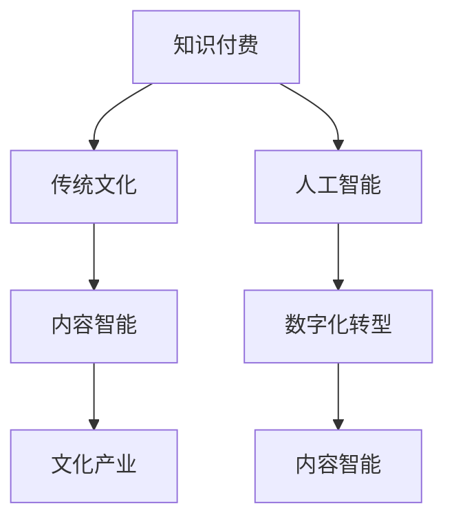

                 

# 如何发掘传统文化领域的知识付费机会

> 关键词：知识付费, 传统文化, 人工智能, 内容智能, 数字化转型

## 1. 背景介绍

### 1.1 问题由来
在当今数字化时代，知识付费市场迅猛发展，成为推动知识传播和创新的一个重要力量。特别是在传统领域，知识付费不仅能传承文化，还能实现资源的最大化利用。然而，如何将传统文化与知识付费结合，发挥其价值，仍然是一个值得探讨的问题。

### 1.2 问题核心关键点
1. **用户需求与价值**：如何将传统文化知识以更加丰富、互动、个性化的形式展现给用户，并满足其学习、娱乐、研究等需求。
2. **内容生产与质量**：如何高效地生产和维护高质量的传统文化内容，确保内容贴近现实，易于理解和接受。
3. **技术手段与创新**：如何利用人工智能、大数据等技术手段，实现内容的智能化、个性化和互动化，提升用户体验。
4. **商业模式与盈利**：如何设计有效的商业模式，实现知识付费平台的可持续发展，并获取合理收益。

### 1.3 问题研究意义
研究传统文化领域的知识付费机会，有助于保护和传承传统文化，促进其数字化转型，同时也能为知识付费平台提供新的商业模式，推动相关产业的发展。

## 2. 核心概念与联系

### 2.1 核心概念概述

为更好地理解在传统文化领域发掘知识付费机会的思路，本节将介绍几个关键概念：

- **知识付费(Knowledge-As-A-Service, KaaS)**：用户为获取特定知识或服务支付费用的模式，旨在通过付费获取高质量、专业化、高价值的内容。
- **传统文化(Traditional Culture)**：指历史悠久、具有一定地域特色的文化形式和习俗，如书法、绘画、中医、武术等。
- **人工智能(Artificial Intelligence, AI)**：利用算法、计算和数据处理能力模拟人类智能，实现自动化、智能化任务。
- **内容智能(Content Intelligence, CI)**：通过人工智能技术，对内容进行自动化分析和处理，以提升内容的价值和表现力。
- **数字化转型(Digital Transformation, DT)**：将传统业务、服务、管理等数字化，通过技术手段提高效率和价值。
- **文化产业(Cultural Industry)**：涵盖文化内容的制作、传播、消费等全流程，是一个具有高度创意和技术含量的大产业。

这些概念之间的逻辑关系可以通过以下Mermaid流程图来展示：



这个流程图展示了一些关键概念及其之间的关系：

1. 知识付费依托传统文化，通过内容智能实现智能化，利用数字化转型手段提升效率。
2. 人工智能技术是实现内容智能和数字化转型的关键。
3. 内容智能和文化产业相互促进，共同发展。

## 3. 核心算法原理 & 具体操作步骤

### 3.1 算法原理概述

在传统文化领域的知识付费中，内容智能是实现高质量、个性化内容的核心。其核心思想是通过人工智能技术，对传统文化内容进行自动化分析和处理，提升内容的价值和表现力。

具体而言，可以从以下几个方面入手：

1. **内容自动标注与分类**：利用自然语言处理(NLP)技术，对文本、图片、音频等传统文化内容进行自动标注和分类，以便更好地组织和管理。
2. **内容推荐系统**：通过分析用户行为和偏好，利用协同过滤、基于内容的推荐算法，向用户推荐个性化的内容。
3. **智能生成与增强**：利用生成对抗网络(GAN)、语言模型等技术，实现内容的智能生成和增强，如通过模型自动创作书法作品、诗词等。
4. **用户互动与反馈**：通过智能聊天机器人、虚拟助理等，实现与用户的实时互动，收集用户反馈，提升内容质量和用户体验。

### 3.2 算法步骤详解

基于上述算法原理，以下是具体的操作方法：

**Step 1: 数据收集与处理**
- 收集传统文化相关的文本、图片、视频等数据。
- 使用NLP技术对文本进行分词、词性标注、命名实体识别等预处理。
- 对图片和视频进行分类、标注等处理，以便后续分析。

**Step 2: 模型训练与优化**
- 选择适合的深度学习模型，如BERT、GPT等，对其进行预训练。
- 在标注好的数据集上，使用迁移学习、微调等方法训练模型。
- 利用生成对抗网络、Transformer等技术，优化模型生成和增强效果。
- 根据用户反馈，不断调整和优化模型参数，提升用户体验。

**Step 3: 内容智能推荐**
- 收集用户的行为数据，如浏览记录、搜索历史、评分反馈等。
- 使用协同过滤、基于内容的推荐算法，计算用户与内容的相似度。
- 根据相似度排序，推荐个性化的内容。
- 通过用户互动反馈，不断调整推荐策略，提高推荐效果。

**Step 4: 智能化内容生成**
- 利用语言模型、GAN等技术，自动生成书法作品、诗词等传统文化内容。
- 通过用户反馈，不断优化生成模型，提升生成效果和多样性。
- 结合用户偏好和历史数据，智能选择生成方向和风格。

**Step 5: 用户互动与反馈**
- 部署智能聊天机器人、虚拟助理等，实现实时互动。
- 收集用户反馈，用于模型优化和内容调整。
- 建立用户画像，个性化推荐内容，提升用户体验。

### 3.3 算法优缺点

基于内容智能的大语言模型微调方法具有以下优点：
1. **高效生产内容**：通过自动化处理和智能生成，大幅度提高内容生产效率。
2. **个性化推荐**：根据用户行为和偏好，实现高度个性化的内容推荐。
3. **互动性增强**：通过智能聊天机器人等，提升用户体验和互动性。
4. **质量提升**：通过不断优化和调整，提升内容质量和表现力。

同时，该方法也存在一定的局限性：
1. **内容质量依赖数据**：数据质量和多样性对内容智能效果有很大影响。
2. **算法复杂度较高**：深度学习模型和推荐算法需要较大的计算资源和时间成本。
3. **过度依赖技术**：过度依赖技术手段，可能忽视人的情感和表达。
4. **用户隐私问题**：收集和分析用户数据，可能涉及隐私和安全问题。

尽管存在这些局限性，但就目前而言，基于内容智能的大语言模型微调方法仍是实现传统文化知识付费的重要手段。未来相关研究的重点在于如何进一步降低技术依赖，提高内容质量和用户满意度，同时兼顾隐私保护和用户体验。

### 3.4 算法应用领域

基于内容智能的大语言模型微调方法，已经在多个传统文化领域得到了应用：

- **书法艺术**：利用语言模型生成书法作品，通过智能推荐系统推荐用户最感兴趣的作品。
- **中医药**：利用NLP技术自动标注中药材描述，生成草药配方，结合用户反馈优化推荐系统。
- **传统音乐**：利用GAN技术生成传统音乐作品，通过推荐系统推荐用户最喜爱的音乐。
- **古代文学**：利用文本生成模型生成古代诗词，通过互动系统与用户共同创作，提升创作体验。

除了上述这些领域，大语言模型微调还可以应用于传统绘画、戏曲、手工艺等更多领域，为传统文化传播和创新提供新的思路和手段。

## 4. 数学模型和公式 & 详细讲解

### 4.1 数学模型构建

在传统文化知识付费中，内容智能的数学模型主要涉及NLP和生成对抗网络等领域。以下以生成对抗网络(GAN)为例，介绍其基本构建过程。

假设生成模型为 $G$，判别模型为 $D$，目标函数为 $L(D,G)$。目标函数包含两个部分：判别器的损失函数 $L_D$ 和生成器的损失函数 $L_G$。

判别器的损失函数 $L_D$ 为目标函数的一部分，用于训练判别模型，使其能够更好地区分真实数据和生成数据。生成器的损失函数 $L_G$ 为目标函数的另一部分，用于训练生成模型，使其生成的数据能够欺骗判别器。

因此，目标函数 $L(D,G)$ 可以表示为：

$$
L(D,G) = E_{\mathcal{X}}[logD(x)] + E_{\mathcal{Z}}[log(1-D(G(z)))]
$$

其中 $x$ 为真实数据，$z$ 为噪声向量，$D(x)$ 为判别器对真实数据的输出，$1-D(G(z))$ 为判别器对生成数据的输出。

### 4.2 公式推导过程

对于生成对抗网络的训练，我们主要关注生成器 $G$ 和判别器 $D$ 的优化过程。假设训练数据集为 $D$，噪声向量空间为 $\mathcal{Z}$。

首先，对于判别器 $D$ 的训练过程，目标是最小化损失函数 $L_D$：

$$
L_D = E_{x \sim D}[logD(x)] + E_{z \sim \mathcal{Z}}[log(1-D(G(z)))]
$$

其次，对于生成器 $G$ 的训练过程，目标是最小化损失函数 $L_G$：

$$
L_G = E_{z \sim \mathcal{Z}}[log(1-D(G(z)))]
$$

通过交替优化判别器和生成器，使两者能够达到均衡状态，最终生成高质量的传统文化内容。

### 4.3 案例分析与讲解

在实际操作中，可以利用GAN生成书法作品的过程为例，进行详细讲解：

- **数据收集**：收集大量的书法样本，标注其风格、笔画、结构等信息。
- **预处理**：将书法样本转换为数字化的形式，如通过扫描和OCR技术，将书法图片转换为向量表示。
- **模型训练**：使用GAN模型，将噪声向量转换为书法图像，通过对抗训练，优化生成器和判别器的参数。
- **内容生成**：使用训练好的生成器，根据用户偏好和历史数据，生成个性化的书法作品。

这种基于GAN的内容生成方式，可以极大地提升书法作品的创作效率和多样性，满足用户个性化的需求。

## 5. 项目实践：代码实例和详细解释说明

### 5.1 开发环境搭建

在进行传统文化知识付费的实践前，我们需要准备好开发环境。以下是使用Python进行PyTorch开发的环境配置流程：

1. 安装Anaconda：从官网下载并安装Anaconda，用于创建独立的Python环境。

2. 创建并激活虚拟环境：
```bash
conda create -n pytorch-env python=3.8 
conda activate pytorch-env
```

3. 安装PyTorch：根据CUDA版本，从官网获取对应的安装命令。例如：
```bash
conda install pytorch torchvision torchaudio cudatoolkit=11.1 -c pytorch -c conda-forge
```

4. 安装其他依赖包：
```bash
pip install numpy scipy matplotlib seaborn jupyter notebook
```

完成上述步骤后，即可在`pytorch-env`环境中开始项目实践。

### 5.2 源代码详细实现

下面以书法生成项目为例，给出使用PyTorch进行GAN模型训练和内容生成的代码实现。

首先，定义生成器和判别器模型：

```python
import torch
import torch.nn as nn
import torch.optim as optim

class Generator(nn.Module):
    def __init__(self, input_size, output_size):
        super(Generator, self).__init__()
        self.fc1 = nn.Linear(input_size, 256)
        self.fc2 = nn.Linear(256, 512)
        self.fc3 = nn.Linear(512, 1024)
        self.fc4 = nn.Linear(1024, output_size)

    def forward(self, x):
        x = torch.relu(self.fc1(x))
        x = torch.relu(self.fc2(x))
        x = torch.relu(self.fc3(x))
        x = torch.tanh(self.fc4(x))
        return x

class Discriminator(nn.Module):
    def __init__(self, input_size):
        super(Discriminator, self).__init__()
        self.fc1 = nn.Linear(input_size, 256)
        self.fc2 = nn.Linear(256, 512)
        self.fc3 = nn.Linear(512, 1024)
        self.fc4 = nn.Linear(1024, 1)

    def forward(self, x):
        x = torch.relu(self.fc1(x))
        x = torch.relu(self.fc2(x))
        x = torch.relu(self.fc3(x))
        x = torch.sigmoid(self.fc4(x))
        return x
```

然后，定义训练函数和优化器：

```python
def train_gan(modelG, modelD, dataloader, batch_size, epochs):
    device = torch.device('cuda' if torch.cuda.is_available() else 'cpu')
    modelG.to(device)
    modelD.to(device)

    criterionG = nn.BCELoss()
    criterionD = nn.BCELoss()
    optimizerG = optim.Adam(modelG.parameters(), lr=0.0002, betas=(0.5, 0.999))
    optimizerD = optim.Adam(modelD.parameters(), lr=0.0002, betas=(0.5, 0.999))

    for epoch in range(epochs):
        for i, (real_images, _) in enumerate(dataloader):
            real_images = real_images.to(device)

            real_labels = torch.ones(batch_size, 1).to(device)
            fake_labels = torch.zeros(batch_size, 1).to(device)

            real_outputs = modelD(real_images)
            fake_images = modelG(torch.randn(batch_size, 100).to(device))
            fake_outputs = modelD(fake_images)

            # Train Discriminator
            optimizerD.zero_grad()
            real_loss = criterionD(real_outputs, real_labels)
            fake_loss = criterionD(fake_outputs, fake_labels)
            d_loss = real_loss + fake_loss
            d_loss.backward()
            optimizerD.step()

            # Train Generator
            optimizerG.zero_grad()
            fake_loss = criterionD(fake_outputs, real_labels)
            g_loss = fake_loss
            g_loss.backward()
            optimizerG.step()

            if i % 200 == 0:
                print(f'Epoch {epoch+1}, Batch {i+1}')
                print(f'G loss: {g_loss.item():.4f}, D loss: {d_loss.item():.4f}')
```

最后，使用GAN模型进行书法生成：

```python
import cv2

def generate_bookmark(modelG, batch_size=64):
    device = torch.device('cuda' if torch.cuda.is_available() else 'cpu')
    modelG.to(device)

    images = torch.randn(batch_size, 100).to(device)
    generated_images = modelG(images)

    for i, generated_image in enumerate(generated_images):
        generated_image = generated_image.numpy().transpose((1, 2, 0))
        generated_image = (generated_image + 1) * 127.5
        generated_image = generated_image.astype(np.uint8)

        bookmark = cv2.imwrite('bookmark{}.png'.format(i), generated_image)
        cv2.imshow('Bookmark', generated_image)
        cv2.waitKey(0)

generate_bookmark(modelG)
```

以上就是使用PyTorch进行GAN模型训练和书法生成的完整代码实现。可以看到，通过PyTorch和Numpy等库，我们可以方便地进行GAN模型的构建和训练，并通过简单的调用实现书法作品的生成。

### 5.3 代码解读与分析

让我们再详细解读一下关键代码的实现细节：

**Generator和Discriminator类**：
- `__init__`方法：初始化模型的层和参数。
- `forward`方法：定义模型的前向传播过程。

**train_gan函数**：
- `device`变量：设置使用GPU还是CPU进行计算。
- `criterionG`和`criterionD`变量：定义损失函数。
- `optimizerG`和`optimizerD`变量：定义优化器。
- `real_images`和`fake_images`变量：生成和判别过程的输入和输出。
- `real_labels`和`fake_labels`变量：定义真实和假样本的标签。
- 通过交替训练判别器和生成器，优化模型参数，实现生成高质量的书法作品。

**generate_bookmark函数**：
- `device`变量：设置使用GPU还是CPU进行计算。
- `generated_images`变量：生成书法作品的输出。
- `cv2.imwrite`函数：将生成的书法作品保存为PNG格式的图片。
- `cv2.imshow`函数：展示生成的书法作品。
- `cv2.waitKey`函数：等待用户按键。

可以看到，PyTorch提供了便捷的深度学习框架，方便进行GAN模型的实现和训练。通过代码的实际运行，可以直观地看到书法作品的生成过程，验证模型的效果。

## 6. 实际应用场景

### 6.1 智能书法教学平台

利用内容智能和GAN技术，可以实现一个智能书法教学平台。用户可以通过互动和反馈，实时学习书法技巧，生成个性化书法作品。

在实际应用中，平台可以收集大量的书法样本，利用GAN模型生成书法作品，并结合NLP技术自动标注风格、笔画等信息。通过用户互动，收集用户偏好和反馈，不断优化生成模型和内容推荐系统，提升用户体验和学习效果。

### 6.2 古代文学创作工具

利用语言模型和GAN技术，可以开发一个古代文学创作工具。用户可以输入自己的创作思路，工具自动生成诗词、小说等文学作品，提升创作效率和质量。

在实际应用中，工具可以收集大量的古代文学作品，利用语言模型自动生成文学作品片段，结合用户输入的思路和关键词，进行智能化创作。通过用户互动和反馈，不断优化语言模型和创作算法，提升创作效果和多样性。

### 6.3 虚拟文化博物馆

利用内容智能和虚拟现实(VR)技术，可以创建一个虚拟文化博物馆。用户可以在虚拟空间中自由探索传统文化展品，学习相关知识，提升文化素养。

在实际应用中，博物馆可以收集大量的历史文化数据，利用内容智能进行标注和分类，结合VR技术展示展品。通过用户互动和反馈，收集用户兴趣和行为数据，不断优化展品推荐和虚拟体验，提升用户体验和教育效果。

### 6.4 未来应用展望

随着内容智能和人工智能技术的不断发展，基于传统文化领域的知识付费应用将呈现以下几个趋势：

1. **内容多样化和个性化**：利用更丰富的数据和技术手段，生成更多样化的传统文化内容，实现高度个性化的推荐和互动。
2. **用户参与和创新**：通过用户互动和反馈，实现内容的协同创作和不断优化，提升用户参与感和创新性。
3. **跨平台融合**：结合VR、AR等新兴技术，实现跨平台、沉浸式的传统文化体验。
4. **知识服务化**：通过智能化服务，提升传统文化的传播和教育效果，促进文化产业的发展。
5. **全球化传播**：将传统文化内容翻译和适应不同语言和文化，提升国际影响力。

通过这些趋势的应用，传统文化知识付费将带来更广阔的发展空间，促进文化产业的数字化转型和全球化传播。

## 7. 工具和资源推荐

### 7.1 学习资源推荐

为了帮助开发者系统掌握内容智能和传统文化知识付费的理论基础和实践技巧，这里推荐一些优质的学习资源：

1. **《深度学习入门》**：深度学习领域的入门教材，系统介绍了深度学习的基本原理和应用。
2. **《TensorFlow实战Google深度学习框架》**：TensorFlow的官方教程，适合新手学习。
3. **《Python深度学习》**：深入浅出地介绍了深度学习在Python中的应用，包括GAN、NLP等技术。
4. **《自然语言处理综论》**：介绍自然语言处理的基本理论和算法，适合深入学习。
5. **《生成对抗网络：原理及实现》**：介绍GAN的原理和实现，适合深度学习开发者。

通过这些资源的学习，相信你一定能够掌握内容智能和传统文化知识付费的核心技术，实现更高效、更有价值的内容生产。

### 7.2 开发工具推荐

高效的开发离不开优秀的工具支持。以下是几款用于传统文化知识付费开发的常用工具：

1. **PyTorch**：基于Python的开源深度学习框架，灵活动态的计算图，适合快速迭代研究。
2. **TensorFlow**：由Google主导开发的开源深度学习框架，生产部署方便，适合大规模工程应用。
3. **Transformers**：HuggingFace开发的NLP工具库，集成了众多SOTA语言模型，适合自然语言处理任务。
4. **Jupyter Notebook**：交互式的代码编辑器，支持Python等语言，方便开发和协作。
5. **OpenCV**：计算机视觉库，支持图像处理和生成，适合传统文化的图像识别和生成任务。

合理利用这些工具，可以显著提升传统文化知识付费任务的开发效率，加快创新迭代的步伐。

### 7.3 相关论文推荐

内容智能和传统文化知识付费的发展源于学界的持续研究。以下是几篇奠基性的相关论文，推荐阅读：

1. **《A Tutorial on Generative Adversarial Networks》**：介绍GAN的基本原理和实现，适合入门学习。
2. **《Attention is All You Need》**：提出Transformer结构，开启预训练大模型时代。
3. **《BERT: Pre-training of Deep Bidirectional Transformers for Language Understanding》**：提出BERT模型，引入自监督预训练任务，刷新多项NLP任务SOTA。
4. **《Language Models are Unsupervised Multitask Learners》**：展示大语言模型的强大zero-shot学习能力，引发对通用人工智能的新一轮思考。
5. **《Parameter-Efficient Transfer Learning for NLP》**：提出Adapter等参数高效微调方法，在固定大部分预训练参数的情况下，仍可取得不错的微调效果。
6. **《Prompt-Based Method for Controlling and Enhancing Text Generation》**：引入基于连续型Prompt的微调范式，为如何充分利用预训练知识提供了新的思路。
7. **《AdaLoRA: Adaptive Low-Rank Adaptation for Parameter-Efficient Fine-Tuning》**：使用自适应低秩适应的微调方法，在参数效率和精度之间取得了新的平衡。

这些论文代表了大语言模型微调技术的发展脉络。通过学习这些前沿成果，可以帮助研究者把握学科前进方向，激发更多的创新灵感。

## 8. 总结：未来发展趋势与挑战

### 8.1 总结

本文对基于内容智能和GAN的传统文化知识付费方法进行了全面系统的介绍。首先阐述了内容智能和GAN技术在传统文化领域的理论基础和实践方法，明确了其在知识付费中的重要价值。其次，从原理到实践，详细讲解了生成对抗网络的基本构建过程和具体实现步骤，给出了代码实例和详细解释说明。同时，本文还广泛探讨了知识付费在书法教学、古代文学创作、虚拟文化博物馆等场景中的应用前景，展示了内容智能和GAN技术的强大潜力。此外，本文精选了内容智能和GAN技术的学习资源，力求为开发者提供全方位的技术指引。

通过本文的系统梳理，可以看到，基于内容智能和GAN技术的大语言模型微调方法正在成为传统文化知识付费的重要手段。这些技术的结合，使得传统文化内容得以更加智能化、个性化地呈现，提升了用户的参与感和体验效果。未来，伴随内容智能和人工智能技术的持续演进，基于传统文化领域的知识付费应用将迎来更广阔的发展空间，为文化传承和产业发展带来新的机遇。

### 8.2 未来发展趋势

展望未来，内容智能和GAN技术将呈现以下几个发展趋势：

1. **技术融合**：与其他人工智能技术，如知识表示、因果推理、强化学习等，进行更深入的融合，提升系统的智能化和适应性。
2. **应用扩展**：从传统文化领域扩展到更多垂直行业，如历史、地理、艺术等，实现跨领域的应用突破。
3. **模型优化**：通过不断优化和调整，提升模型的生成效果和多样性，更好地满足用户需求。
4. **交互增强**：结合智能聊天机器人、虚拟助理等技术，实现更加自然、流畅的用户互动体验。
5. **数据驱动**：更多地利用用户数据，进行模型优化和内容推荐，提升系统的个性化和精准性。

这些趋势将推动内容智能和GAN技术的进一步发展，为传统文化知识付费带来更多的创新和应用。

### 8.3 面临的挑战

尽管内容智能和GAN技术已经取得了显著成果，但在向传统文化知识付费领域推广的过程中，仍面临诸多挑战：

1. **数据获取与质量**：高质量的数据是实现内容智能和GAN技术的先决条件，传统文化数据收集和标注成本高。
2. **模型复杂度**：GAN和深度学习模型的训练和优化需要较大的计算资源和时间成本，实现高效、低成本的生成效果。
3. **用户接受度**：用户对技术生成内容的质量和真实性存在疑虑，如何提升用户接受度是关键。
4. **版权与隐私**：内容生成涉及大量知识产权和用户隐私，如何处理版权和隐私问题，需要法律和伦理的保障。
5. **交互设计**：交互界面和体验设计复杂，需要结合用户体验和心理学原理，设计合理的交互方式。

这些挑战需要通过技术、法律、伦理等多方面的努力来解决，以确保内容智能和GAN技术的健康发展和应用推广。

### 8.4 研究展望

面对内容智能和GAN技术面临的挑战，未来的研究需要在以下几个方面寻求新的突破：

1. **无监督和半监督学习**：探索无监督和半监督学习方法，降低对标注数据的需求，提高数据收集和处理的效率。
2. **多模态融合**：结合图像、视频等多模态信息，提升内容的全面性和多样性。
3. **参数高效与计算高效**：开发更多参数高效和计算高效的生成模型，提升生成效果和效率。
4. **交互设计与反馈机制**：优化交互设计和用户反馈机制，提升用户参与感和满意度。
5. **伦理与社会责任**：引入伦理和法律约束，保障内容智能和GAN技术的公平性和安全性。

这些研究方向的探索，必将引领内容智能和GAN技术迈向更高的台阶，为传统文化知识付费带来更广泛的应用前景。面向未来，内容智能和GAN技术需要在技术、法律、伦理等多个维度协同发力，共同推动文化产业的数字化转型和可持续发展。

## 9. 附录：常见问题与解答

**Q1：内容智能如何保证传统文化内容的真实性和准确性？**

A: 内容智能通过深度学习模型自动生成和处理内容，确保生成内容的语义连贯和逻辑合理。但仍然需要人工干预和验证，特别是对于关键信息和数据，需要严格审查和把关。

**Q2：内容智能如何处理多语言和文化差异？**

A: 内容智能可以通过多语言模型和跨文化模型，处理不同语言和文化的内容生成和推荐。同时，结合知识图谱和常识推理，提升内容的普适性和准确性。

**Q3：如何平衡内容智能和用户创作之间的关系？**

A: 内容智能可以提供初始创作素材和建议，但最终作品的创作仍需用户自己完成。通过用户互动和反馈，不断优化内容智能模型，提升创作效果和多样性。

**Q4：内容智能是否存在偏见和歧视？**

A: 内容智能模型可能会学习到数据中的偏见和歧视，需要通过数据清洗和模型训练，避免模型输出有害信息和偏见。

**Q5：如何保护传统文化内容的版权和隐私？**

A: 在内容智能和GAN技术的应用中，需要严格遵守版权法和隐私保护规定，特别是在用户数据收集和处理方面，需要确保用户知情同意，并采取必要的安全措施。

通过这些问题的回答，可以看到，内容智能和GAN技术在传统文化知识付费中的应用仍然需要多方面的努力和探索，确保技术的健康发展和应用效果。

---

作者：禅与计算机程序设计艺术 / Zen and the Art of Computer Programming

