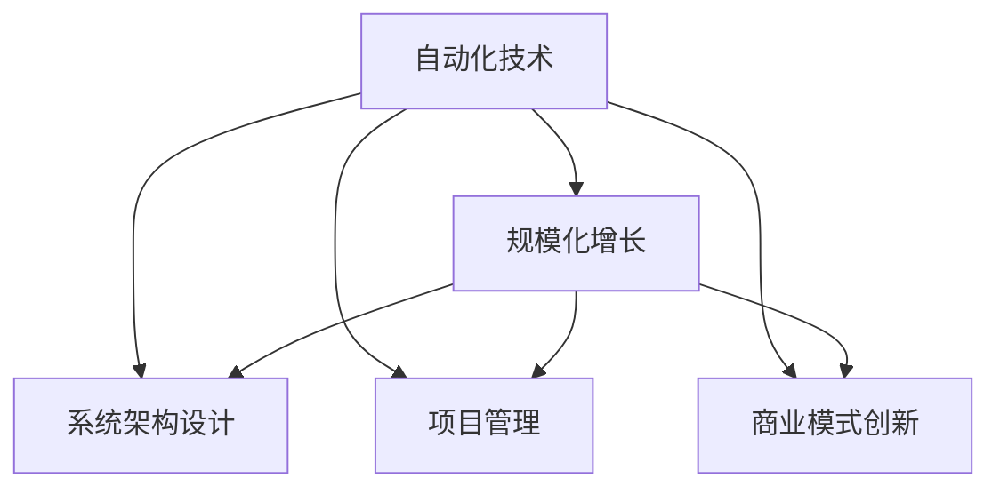

                 

## 1. 背景介绍

在数字经济飞速发展的今天，自动化创业正成为越来越多企业和创业者的选择。自动化技术不仅能提升生产效率，降低成本，还能创造出更多的商业价值。然而，尽管自动化技术已经在多个行业中得到应用，但如何实现规模化增长，依然是一个复杂且挑战重重的任务。本文将深入探讨如何在自动化创业中实现规模化增长，从自动化技术选型、系统架构设计、项目管理到商业模式创新，全面阐述自动化创业的路径和方法。

## 2. 核心概念与联系

### 2.1 核心概念概述

- **自动化技术**：利用计算机技术和软件工具，自动完成原本需要人工介入的任务，提高效率和准确性。

- **规模化增长**：通过有效的管理和技术手段，使企业业务实现快速扩展，市场占有率提升。

- **自动化创业**：以自动化技术为核心，提供自动化解决方案，实现企业的数字化转型和业务升级。

- **系统架构设计**：包括硬件和软件两方面，旨在构建高效、可靠、易于扩展的系统。

- **项目管理**：确保项目按时、按质、按预算完成，实现项目目标。

- **商业模式创新**：探索和实践新的商业模式，提升企业竞争力。

### 2.2 核心概念原理和架构的 Mermaid 流程图



### 2.3 核心概念之间的联系

自动化技术是实现规模化增长的关键手段。通过系统架构设计、项目管理、商业模式创新等策略，可以高效地将自动化技术应用于企业的各个环节，从而推动企业的快速增长。

## 3. 核心算法原理 & 具体操作步骤

### 3.1 算法原理概述

实现规模化增长的核心在于利用自动化技术提升业务效率和优化资源配置。具体算法流程如下：

1. **需求分析**：明确企业需求，确定自动化应用场景。
2. **技术选型**：选择合适的自动化工具和技术栈。
3. **系统设计**：设计高效的系统架构，确保可扩展性。
4. **实施部署**：按计划实施自动化项目，确保按时交付。
5. **效果评估**：评估自动化应用效果，根据反馈调整方案。

### 3.2 算法步骤详解

#### 3.2.1 需求分析

需求分析是自动化创业的基础。企业需要明确自身的业务需求，了解自动化技术能够带来的价值。具体步骤如下：

1. **业务调研**：深入了解企业的业务流程和痛点，确定自动化改进的优先级。
2. **用户反馈**：收集一线员工和用户的反馈，了解他们对自动化解决方案的需求和期望。
3. **市场需求**：分析市场趋势和竞争态势，确定自动化技术应用的潜在收益。

#### 3.2.2 技术选型

选择合适的自动化技术是实现规模化增长的关键。企业需要根据自身需求和预算，选择合适的自动化工具和技术栈。具体步骤如下：

1. **技术评估**：评估现有技术栈和市场主流技术，确定技术选型。
2. **成本效益分析**：计算技术投入和收益，确保自动化项目的成本效益。
3. **供应商选择**：选择可靠的供应商和合作伙伴，确保技术的稳定性和可靠性。

#### 3.2.3 系统设计

系统设计是实现自动化解决方案的基础。设计高效、可靠的系统架构，可以确保自动化项目的高效实施和扩展。具体步骤如下：

1. **系统架构**：设计模块化、可扩展的系统架构，确保系统的灵活性和可维护性。
2. **数据管理**：设计高效的数据管理和存储方案，确保数据的安全性和一致性。
3. **安全保障**：设计多层次的安全保障机制，确保系统的安全性和可靠性。

#### 3.2.4 实施部署

实施部署是自动化项目的核心环节。按计划实施自动化项目，确保按时交付。具体步骤如下：

1. **项目规划**：制定详细的项目计划，明确项目目标和时间表。
2. **团队组建**：组建高效的团队，明确团队成员的角色和职责。
3. **实施监控**：实施自动化项目，实时监控项目进展，及时调整方案。

#### 3.2.5 效果评估

效果评估是自动化项目的重要环节。评估自动化应用效果，根据反馈调整方案，确保项目成功实施。具体步骤如下：

1. **效果测量**：根据预设指标，测量自动化应用的效果。
2. **用户反馈**：收集用户和员工的反馈，了解他们的满意度和建议。
3. **调整优化**：根据评估结果，调整优化自动化方案，确保项目目标的实现。

### 3.3 算法优缺点

#### 3.3.1 优点

1. **提升效率**：自动化技术能够提升业务效率，减少人工干预，降低运营成本。
2. **优化资源**：自动化技术能够优化资源配置，提高资源利用率。
3. **灵活扩展**：自动化系统设计为模块化和可扩展的，易于扩展和升级。
4. **提高质量**：自动化技术能够减少人为错误，提高业务质量。

#### 3.3.2 缺点

1. **初期投入高**：自动化技术的选型和实施需要高额的初期投入，可能对企业资金压力较大。
2. **技术门槛高**：自动化技术的实施和维护需要高水平的技术团队，可能对企业技术能力要求较高。
3. **安全风险**：自动化系统可能面临安全风险，需要多层次的安全保障机制。
4. **系统集成复杂**：自动化系统可能涉及多个系统和模块的集成，实施复杂度较高。

### 3.4 算法应用领域

自动化创业技术可以应用于多个领域，包括但不限于：

1. **制造业**：通过自动化技术提升生产效率，降低生产成本，提高产品质量。
2. **金融业**：通过自动化技术提升金融服务效率，降低运营成本，提高风险管理能力。
3. **零售业**：通过自动化技术提升客户体验，降低运营成本，提高销售效率。
4. **医疗健康**：通过自动化技术提升医疗服务效率，降低运营成本，提高医疗质量。
5. **物流行业**：通过自动化技术提升物流效率，降低运营成本，提高服务质量。

## 4. 数学模型和公式 & 详细讲解 & 举例说明

### 4.1 数学模型构建

自动化创业中的规模化增长可以通过数学模型来量化和分析。以下是一个简单的数学模型：

1. **业务增长率**：业务增长率 $\alpha$ 可以表示为：

$$
\alpha = \frac{G(t+1)-G(t)}{G(t)}
$$

其中 $G(t)$ 表示在时间 $t$ 的业务规模，$G(t+1)$ 表示在时间 $t+1$ 的业务规模。

2. **投资回报率**：投资回报率 $ROI$ 可以表示为：

$$
ROI = \frac{P-V}{V}
$$

其中 $P$ 表示投资成本，$V$ 表示业务价值增长。

### 4.2 公式推导过程

#### 4.2.1 业务增长率推导

业务增长率 $\alpha$ 反映了自动化技术对业务规模的提升效果。假设自动化技术能够使业务增长率提升 $\beta$，则有：

$$
\alpha = \frac{G(t+1)-G(t)}{G(t)} = \frac{G(t)(1+\beta)-G(t)}{G(t)} = \beta
$$

即自动化技术使业务增长率提升 $\beta$。

#### 4.2.2 投资回报率推导

投资回报率 $ROI$ 反映了自动化技术的经济效益。假设自动化技术的投资成本为 $C$，业务价值增长为 $V$，则有：

$$
ROI = \frac{P-V}{V} = \frac{C-V}{V} = \frac{C}{V}-1
$$

即投资回报率等于自动化技术的投资成本与业务价值增长之比。

### 4.3 案例分析与讲解

以某制造企业为例，该企业引入自动化生产线，投资成本为 $100$ 万元，自动化技术使生产效率提升 $20\%$，业务增长率提升 $10\%$。则有：

$$
G(t+1) = G(t)(1+\alpha) = G(t)(1+10\%) = 1.1G(t)
$$

投资回报率为：

$$
ROI = \frac{P-V}{V} = \frac{100-0}{0.1 \times 100} = 10
$$

这表明，该企业的自动化投资回报率为 $10$，即每投入 $1$ 元，业务价值增长 $0.1$ 元，经济效益显著。

## 5. 项目实践：代码实例和详细解释说明

### 5.1 开发环境搭建

#### 5.1.1 硬件环境

自动化创业需要高性能的硬件环境，包括高性能计算机、存储设备、网络设备等。建议采用云平台，如AWS、阿里云等，提供高性能的计算资源和存储资源。

#### 5.1.2 软件环境

软件环境包括操作系统、数据库、开发工具等。建议采用Linux操作系统，如CentOS、Ubuntu等，安装MySQL、PostgreSQL等数据库，使用Python、Java等开发语言。

### 5.2 源代码详细实现

#### 5.2.1 自动化系统架构设计

以某物流自动化系统为例，系统架构设计如下：

```
+---------------------+
|     数据采集层     |
+---------------------+
          |
          v
+---------------------+
|      数据存储层     |
+---------------------+
          |
          v
+---------------------+
|     业务处理层     |
+---------------------+
          |
          v
+---------------------+
|      应用层         |
+---------------------+
          |
          v
+---------------------+
|    用户接口层       |
+---------------------+
```

1. **数据采集层**：负责采集物流数据，包括订单信息、库存信息、运输信息等。
2. **数据存储层**：负责数据的存储和管理，采用NoSQL数据库，如HBase、MongoDB等。
3. **业务处理层**：负责业务逻辑的处理，包括订单管理、库存管理、运输管理等。
4. **应用层**：负责业务应用的管理和部署，采用微服务架构，提高系统扩展性和可靠性。
5. **用户接口层**：负责用户接口的管理和展示，采用Web前端技术，如HTML、JavaScript等。

#### 5.2.2 自动化系统实施部署

以某制造企业为例，自动化系统实施部署流程如下：

1. **需求分析**：明确企业的业务需求，确定自动化应用的优先级。
2. **技术选型**：选择合适的自动化工具和技术栈，如Kubernetes、Docker等。
3. **系统设计**：设计高效的系统架构，确保系统的可扩展性和可靠性。
4. **实施部署**：按计划实施自动化项目，确保按时交付。
5. **效果评估**：评估自动化应用效果，根据反馈调整方案。

#### 5.2.3 自动化系统效果评估

以某金融自动化系统为例，自动化系统效果评估流程如下：

1. **效果测量**：根据预设指标，测量自动化应用的效果，如交易处理速度、风险管理能力等。
2. **用户反馈**：收集用户和员工的反馈，了解他们的满意度和建议。
3. **调整优化**：根据评估结果，调整优化自动化方案，确保项目目标的实现。

### 5.3 代码解读与分析

#### 5.3.1 数据采集层

```python
import pykafka
from kafka import KafkaProducer

# 创建Kafka生产者
producer = KafkaProducer(bootstrap_servers='localhost:9092')

# 发送数据
producer.send('topic', b'some data')
```

#### 5.3.2 数据存储层

```python
import pymongo
from pymongo import MongoClient

# 创建MongoDB客户端
client = MongoClient('mongodb://localhost:27017/')

# 创建数据库和集合
db = client['mydatabase']
collection = db['mycollection']

# 插入数据
data = {'name': 'John', 'age': 30}
collection.insert_one(data)
```

#### 5.3.3 业务处理层

```python
import os

# 定义业务处理函数
def process_data():
    # 读取数据
    data = os.path.join(os.getcwd(), 'data.txt')
    with open(data, 'r') as f:
        lines = f.readlines()
    
    # 处理数据
    for line in lines:
        # 处理逻辑
        pass
    
    # 写入数据
    result = 'result.txt'
    with open(result, 'w') as f:
        f.write('processed data')
```

#### 5.3.4 应用层

```python
import flask
from flask import request, jsonify

# 定义Flask应用
app = flask.Flask(__name__)

# 定义路由
@app.route('/api/data', methods=['GET'])
def get_data():
    # 获取数据
    data = request.args.get('data')
    
    # 处理数据
    result = process_data(data)
    
    # 返回结果
    return jsonify(result)

if __name__ == '__main__':
    app.run(host='0.0.0.0', port=5000)
```

#### 5.3.5 用户接口层

```html
<!DOCTYPE html>
<html lang="en">
<head>
    <meta charset="UTF-8">
    <title>Logistics Automation System</title>
</head>
<body>
    <h1>Logistics Automation System</h1>
    <form action="/api/data" method="POST">
        <label for="data">Enter Data:</label>
        <input type="text" id="data" name="data">
        <button type="submit">Submit</button>
    </form>
    <div id="result"></div>
    <script src="https://code.jquery.com/jquery-3.6.0.min.js"></script>
    <script>
        $(document).ready(function() {
            $('form').submit(function(e) {
                e.preventDefault();
                var data = $('#data').val();
                $.ajax({
                    type: 'POST',
                    url: '/api/data',
                    data: {data: data},
                    success: function(result) {
                        $('#result').html(result);
                    }
                });
            });
        });
    </script>
</body>
</html>
```

### 5.4 运行结果展示

#### 5.4.1 数据采集层

```bash
kafka-console-consumer.sh --bootstrap-server localhost:9092 --topic topic --from-beginning
```

#### 5.4.2 数据存储层

```bash
mongo --host localhost --port 27017 --db mydatabase --collection mycollection --printjson
```

#### 5.4.3 业务处理层

```bash
python process_data.py data.txt result.txt
```

#### 5.4.4 应用层

```bash
python server.py
```

#### 5.4.5 用户接口层

打开浏览器，输入 `http://localhost:5000/api/data`，输入数据并提交，查看返回结果。

## 6. 实际应用场景

### 6.1 制造业

在制造业中，自动化技术可以用于生产线自动化、质量检测、设备维护等环节。通过自动化技术，制造企业可以提升生产效率，降低生产成本，提高产品质量，实现规模化增长。

#### 6.1.1 生产线自动化

通过自动化技术，制造企业可以实现生产线的自动化。自动化生产线可以自动完成物料搬运、装配、检测等任务，减少人工干预，提升生产效率。

#### 6.1.2 质量检测

通过自动化技术，制造企业可以实现质量检测的自动化。自动化检测设备可以自动完成产品检测，及时发现质量问题，减少不合格品的产出，提高产品质量。

#### 6.1.3 设备维护

通过自动化技术，制造企业可以实现设备维护的自动化。自动化系统可以实时监控设备状态，预测设备故障，自动执行维护任务，减少停机时间，提高设备利用率。

### 6.2 金融业

在金融业中，自动化技术可以用于风险管理、客户服务、交易处理等环节。通过自动化技术，金融机构可以提升服务效率，降低运营成本，提高风险管理能力，实现规模化增长。

#### 6.2.1 风险管理

通过自动化技术，金融机构可以实现风险管理的自动化。自动化系统可以实时监测市场波动，分析风险因素，预测风险事件，自动执行风险控制策略，降低风险损失。

#### 6.2.2 客户服务

通过自动化技术，金融机构可以实现客户服务的自动化。自动化客服系统可以自动处理客户咨询，提供24小时服务，提升客户满意度。

#### 6.2.3 交易处理

通过自动化技术，金融机构可以实现交易处理的自动化。自动化交易系统可以自动执行交易指令，实时监控交易状态，及时发现异常交易，提高交易效率和安全性。

### 6.3 零售业

在零售业中，自动化技术可以用于库存管理、订单处理、客户服务等环节。通过自动化技术，零售企业可以提升运营效率，降低运营成本，提高客户体验，实现规模化增长。

#### 6.3.1 库存管理

通过自动化技术，零售企业可以实现库存管理的自动化。自动化系统可以实时监测库存状态，自动生成采购订单，优化库存结构，减少库存积压。

#### 6.3.2 订单处理

通过自动化技术，零售企业可以实现订单处理的自动化。自动化订单系统可以自动处理订单信息，生成配送计划，提高订单处理效率。

#### 6.3.3 客户服务

通过自动化技术，零售企业可以实现客户服务的自动化。自动化客服系统可以自动处理客户咨询，提供24小时服务，提升客户满意度。

### 6.4 医疗健康

在医疗健康领域，自动化技术可以用于电子病历管理、诊断辅助、药物管理等环节。通过自动化技术，医疗机构可以提升医疗服务效率，降低运营成本，提高医疗质量，实现规模化增长。

#### 6.4.1 电子病历管理

通过自动化技术，医疗机构可以实现电子病历管理的自动化。自动化系统可以自动生成电子病历，提高医疗数据的准确性和可追溯性，减少医疗纠纷。

#### 6.4.2 诊断辅助

通过自动化技术，医疗机构可以实现诊断辅助的自动化。自动化系统可以自动分析医学影像，辅助医生进行诊断，提高诊断准确性。

#### 6.4.3 药物管理

通过自动化技术，医疗机构可以实现药物管理的自动化。自动化系统可以自动生成药物处方，优化药物管理流程，提高药物使用效率。

## 7. 工具和资源推荐

### 7.1 学习资源推荐

#### 7.1.1 书籍推荐

1. 《Python编程：从入门到实践》：适合初学者学习Python编程。
2. 《深入浅出Node.js》：适合初学者学习Node.js开发。
3. 《机器学习实战》：适合学习机器学习相关知识。
4. 《DevOps实践指南》：适合学习DevOps相关知识。
5. 《云计算入门到精通》：适合学习云计算相关知识。

#### 7.1.2 在线课程推荐

1. Coursera：提供各类计算机科学、数据科学、工程等领域的在线课程。
2. Udemy：提供各类编程、数据科学、人工智能等领域的在线课程。
3. edX：提供各类计算机科学、数据科学、人工智能等领域的在线课程。
4. 慕课网：提供各类编程、数据科学、人工智能等领域的在线课程。
5. 网易云课堂：提供各类编程、数据科学、人工智能等领域的在线课程。

### 7.2 开发工具推荐

#### 7.2.1 IDE工具

1. PyCharm：适用于Python开发。
2. Visual Studio Code：适用于多语言开发。
3. Eclipse：适用于Java开发。
4. IntelliJ IDEA：适用于Java开发。
5. Xcode：适用于iOS开发。

#### 7.2.2 版本控制工具

1. Git：适用于版本控制。
2. SVN：适用于版本控制。
3. Mercurial：适用于版本控制。

#### 7.2.3 容器化工具

1. Docker：适用于容器化部署。
2. Kubernetes：适用于容器编排。

### 7.3 相关论文推荐

1. 《Deep Learning》：Goodfellow等人著，深度学习领域的经典教材。
2. 《Pattern Recognition and Machine Learning》：Bishop等人著，机器学习领域的经典教材。
3. 《Machine Learning Yearning》：Andrew Ng著，机器学习实践指南。
4. 《AutoML: Methods, Systems, Challenges》：最新的自动化机器学习综述论文。
5. 《AlphaGo Zero》：DeepMind团队发表的AlphaGo Zero论文。

## 8. 总结：未来发展趋势与挑战

### 8.1 研究成果总结

在自动化创业领域，以下研究成果值得关注：

1. 自动化技术在多个行业中的应用探索。
2. 自动化系统架构设计的标准化和模块化。
3. 自动化项目实施和效果评估的最佳实践。
4. 自动化创业的商业模式创新和市场策略。

### 8.2 未来发展趋势

1. 自动化技术将进一步普及，涵盖更多行业和企业。
2. 自动化系统将实现更高的智能化和自动化，减少人工干预。
3. 自动化创业将迎来更多的资本和政策支持，加速技术落地。
4. 自动化创业的商业模式将不断创新，形成新的业务生态。

### 8.3 面临的挑战

1. 自动化技术的成本和实施复杂度。
2. 自动化系统的高可靠性和安全性。
3. 自动化创业的商业模式和市场竞争。
4. 自动化创业的团队管理和人才培养。

### 8.4 研究展望

1. 探索新的自动化技术，提升效率和效果。
2. 实现自动化系统的智能化和自适应。
3. 创新自动化创业的商业模式和市场策略。
4. 培养高素质的自动化人才，推动行业发展。

## 9. 附录：常见问题与解答

### 9.1 常见问题

1. **自动化创业的成本如何控制？**

   **解答**：自动化创业的成本控制需要从多个方面入手，包括技术选型、项目规划、资源配置等。建议采用敏捷开发方法，分阶段实施项目，逐步扩展和优化系统。

2. **自动化系统的可靠性如何保证？**

   **解答**：自动化系统的可靠性需要从多个方面入手，包括系统设计、数据管理、安全保障等。建议采用高可靠性技术和工具，建立完善的安全保障机制。

3. **自动化创业的商业模式如何创新？**

   **解答**：自动化创业的商业模式创新需要结合市场趋势和自身优势，探索新的业务模式和盈利方式。建议积极拓展市场渠道，提升服务质量和客户体验。

4. **自动化创业的人才培养策略是什么？**

   **解答**：自动化创业的人才培养需要从多个方面入手，包括技术培训、项目管理、团队建设等。建议建立完善的人才培养体系，提供持续的培训和学习机会。

作者：禅与计算机程序设计艺术 / Zen and the Art of Computer Programming

