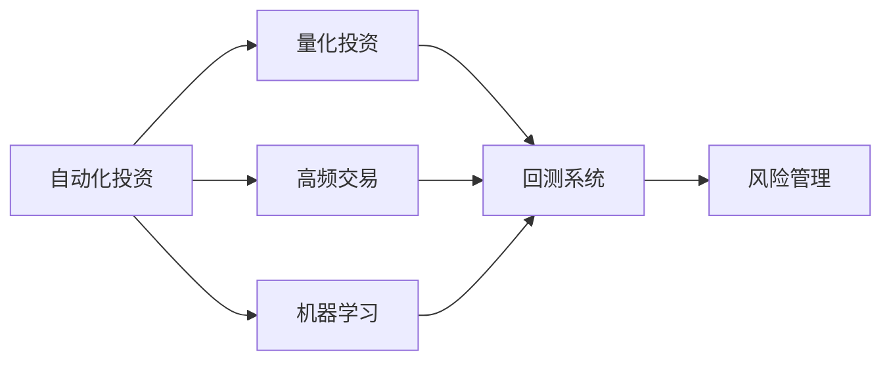

                 

## 1. 背景介绍

### 1.1 问题由来
自动化投资在金融领域越来越受到重视。从高频交易到量化投资，越来越多的金融机构利用算法和机器学习技术进行精准投资决策，以期获取超额收益。然而，传统的投资策略往往依赖于人工分析和大规模的数据处理，周期长、成本高，且难以兼顾全局。自动化投资的出现，为金融行业注入了新的活力，能够及时捕捉市场机会，提升投资效率。

### 1.2 问题核心关键点
将编程技能应用于自动化投资，关键在于构建高效、稳健的算法模型，并结合实时数据，精准制定投资策略。这不仅需要深厚的数学和统计学知识，还需要灵活运用编程语言和框架，高效实现复杂算法。因此，掌握编程技能，尤其是算法设计和优化技巧，成为自动化投资的核心竞争力。

### 1.3 问题研究意义
自动化投资作为现代金融工具，通过编程技术驱动，极大提升了投资决策的效率和精度。一方面，算法能够处理海量数据，快速识别市场趋势，实时调整投资组合，降低人为误判和情感干扰的风险。另一方面，自动化投资还可以根据不同市场环境自动调整策略参数，确保在复杂多变的市场条件下仍能保持稳定收益。

## 2. 核心概念与联系

### 2.1 核心概念概述

为了更好地理解如何将编程技能应用于自动化投资，本节将介绍几个关键的概念：

- 自动化投资：利用计算机编程和算法自动化进行投资决策的过程。
- 量化投资：以数据驱动的方式进行投资决策，结合统计学、金融工程、计算数学等学科。
- 高频交易：通过高频算法，在毫秒级的交易时间内完成买卖操作，以获取微小的价格差异利润。
- 机器学习：通过算法模型从数据中学习，自动提升投资决策的准确性和效率。
- 回测和回测系统：通过历史数据模拟交易过程，检验算法模型的表现。
- 风险管理：对投资组合进行风险评估，优化风险收益比。

这些核心概念之间有着紧密的联系，共同构成了自动化投资的技术基础。

### 2.2 核心概念原理和架构的 Mermaid 流程图



这个流程图展示了这个核心概念之间的逻辑关系：

- 自动化投资依赖于量化投资，量化投资利用统计模型和金融工程方法，为自动化投资提供理论依据。
- 高频交易和机器学习是自动化投资的重要技术手段，高频交易通过算法在毫秒级完成买卖操作，机器学习则从历史数据中学习策略，优化决策过程。
- 回测系统用于验证和优化模型，通过模拟历史数据，评估算法的有效性和稳健性。
- 风险管理作为自动化投资的关键环节，评估投资组合的风险和收益，确保投资策略的健康发展。

## 3. 核心算法原理 & 具体操作步骤
### 3.1 算法原理概述

自动化投资的核心在于构建高效的算法模型，并利用实时数据进行精准的投资决策。其基本思路是将历史数据和实时数据输入到模型中，通过优化算法不断调整模型参数，最大化收益的同时控制风险。常用的算法包括：

- 回归分析：通过历史数据建立价格预测模型，预测未来市场趋势。
- 时间序列分析：利用时间序列模型预测股票价格和市场波动。
- 因子模型：结合财务指标、市场情绪等因素，构建综合投资策略。
- 优化算法：如线性规划、遗传算法等，用于确定最优投资组合。
- 深度学习：利用神经网络模型从大量数据中学习，提升投资决策的准确性。

### 3.2 算法步骤详解

自动化投资的算法步骤大致如下：

1. **数据收集**：收集市场数据、财务报表、新闻资讯等，构建数据集。
2. **数据预处理**：清洗数据，处理缺失值和异常值，将数据转化为模型所需格式。
3. **模型训练**：选择或设计适当的模型，利用历史数据进行训练，优化模型参数。
4. **回测验证**：通过回测系统对模型进行验证，模拟历史交易过程，评估模型表现。
5. **实时交易**：将模型应用于实时数据，根据市场变化实时调整投资策略，执行交易操作。
6. **风险控制**：实时监测投资组合风险，必要时进行调整，确保投资安全。

### 3.3 算法优缺点

自动化投资算法具有以下优点：

- 效率高：自动化算法能够在毫秒级完成交易，大幅提升决策速度。
- 精度高：通过大量历史数据训练，模型具备较强的预测能力和稳健性。
- 泛化能力强：模型可在不同市场条件下表现一致，适应性广。
- 风险控制：实时监测风险，动态调整投资组合，减少市场波动对投资的影响。

然而，这些算法也存在一些缺点：

- 数据依赖：依赖于高质量、完整的历史数据，数据缺失或噪声会影响模型效果。
- 模型复杂：构建和优化复杂模型需要大量计算资源和专业知识。
- 过度拟合：过度依赖历史数据，可能无法捕捉新市场现象。
- 人工干预：在复杂市场条件下，模型仍需人工干预，防止突发事件影响投资决策。

### 3.4 算法应用领域

自动化投资算法广泛应用于各类投资领域，例如：

- 股票投资：通过历史股票价格和财务数据，预测股票走势，制定投资策略。
- 期货和期权：结合市场情绪和波动率，构建套利策略。
- 债券和固定收益：分析利率走势和信用风险，构建固定收益产品投资组合。
- 外汇交易：利用货币对历史汇率数据，预测汇率走势，进行交易操作。
- 商品交易：分析大宗商品价格趋势，构建套利策略。
- 量化对冲：通过多元资产组合，平衡风险和收益，构建对冲基金。

这些应用领域均受益于自动化投资算法的精准和高效。

## 4. 数学模型和公式 & 详细讲解 & 举例说明

### 4.1 数学模型构建

假设历史股票价格序列为 $P_{t-1}, P_{t-2}, \dots, P_{t-m}$，市场情绪指数为 $E_t$，财务指标如市盈率、股息率等。构建回归模型 $y_t = \alpha + \beta_1 P_{t-1} + \beta_2 P_{t-2} + \dots + \beta_m P_{t-m} + \beta_{m+1} E_t + \epsilon_t$，其中 $\alpha$ 为截距，$\beta_i$ 为回归系数，$\epsilon_t$ 为随机误差项。

### 4.2 公式推导过程

通过对回归模型的最小二乘法进行求解，可以得到：

$$
\beta_i = \frac{X_i'X_i^{-1}Y}{X_i'X_i^{-1}X_i'} \quad (i=1,2,\dots,m+1)
$$

其中 $X_i$ 为自变量矩阵，$Y$ 为目标变量向量，$X_i^{-1}$ 为 $X_i$ 的逆矩阵。

在实际应用中，我们通常采用梯度下降法对模型参数进行优化，其更新公式为：

$$
\theta_j \leftarrow \theta_j - \eta \frac{\partial L(\theta)}{\partial \theta_j} \quad (j=1,2,\dots,m+1)
$$

其中 $\eta$ 为学习率，$L(\theta)$ 为目标函数，通常为均方误差损失函数。

### 4.3 案例分析与讲解

以股票价格预测为例，我们可以构建基于时间序列分析的ARIMA模型：

$$
y_t = \alpha + \beta_1 y_{t-1} + \gamma_1 y_{t-2} + \dots + \delta_1 y_{t-p} + \epsilon_t
$$

其中 $y_t$ 为当前价格，$p$ 为滞后阶数。通过训练模型，得到回归系数 $\alpha, \beta_1, \gamma_1, \dots, \delta_1$，可进行股票价格预测。

## 5. 项目实践：代码实例和详细解释说明
### 5.1 开发环境搭建

在开始自动化投资项目前，需要准备好开发环境：

1. **安装Python**：确保安装了Python 3.x版本，建议使用Anaconda或Miniconda。
2. **安装依赖包**：
   - **NumPy**：数学运算库。
   - **Pandas**：数据处理库。
   - **Scikit-learn**：机器学习库。
   - **Matplotlib**：数据可视化库。
   - **TensorFlow或PyTorch**：深度学习库。
3. **安装交易API**：如Alpha Vantage、Quandl等，用于实时获取市场数据。
4. **安装数据库**：如MySQL、PostgreSQL等，用于存储历史数据和交易记录。

### 5.2 源代码详细实现

下面以回归分析为例，展示使用Python实现股票价格预测的代码：

```python
import pandas as pd
from sklearn.linear_model import LinearRegression
import matplotlib.pyplot as plt

# 加载数据
data = pd.read_csv('stock_prices.csv')
data = data.dropna()

# 分割数据集
X = data['P'].iloc[:, :-1].values
y = data['P'].iloc[:, -1].values

# 构建模型
model = LinearRegression()
model.fit(X, y)

# 预测未来价格
future_X = data['P'].iloc[:, -2:].values
future_y = model.predict(future_X)

# 可视化结果
plt.plot(data['P'].values, label='Actual')
plt.plot(future_y, label='Predicted')
plt.legend()
plt.show()
```

### 5.3 代码解读与分析

**数据加载与预处理**：
- 使用Pandas库读取CSV文件，将数据导入数据框（DataFrame）。
- 通过`dropna()`方法删除缺失值，保证数据完整性。

**模型构建与训练**：
- 构建线性回归模型，使用`LinearRegression`类。
- 调用`fit()`方法训练模型，将自变量和因变量输入。

**预测与可视化**：
- 使用模型对未来价格进行预测。
- 使用Matplotlib库可视化实际价格与预测价格的对比。

### 5.4 运行结果展示

通过上述代码，我们得到了股票价格的预测结果，并可视化了实际价格与预测价格的对比。可以看到，模型能够在一定程度上预测股票价格走势。

## 6. 实际应用场景
### 6.1 股票投资策略

自动化投资在股票投资策略中的应用广泛，通过历史价格、财务数据、市场情绪等因素，构建多维度投资组合。以量化交易策略为例，可以设计多种策略：

- 均值回归策略：利用历史价格数据，预测价格偏离均值的情况，当价格低于均值时买入，高于均值时卖出。
- 动量策略：利用价格动量，在价格上涨时买入，价格下跌时卖出。
- 市场情绪策略：利用市场情绪指数，当情绪高涨时买入，情绪低迷时卖出。
- 组合优化策略：结合多种因素，构建综合投资组合，优化风险收益比。

### 6.2 期货期权策略

期货期权交易涉及高杠杆和复杂风险，需要通过量化模型进行精准决策。以期权套利为例，可以使用Black-Scholes模型进行定价和套利策略构建：

- 定价模型：通过历史数据和当前市场数据，计算期权的价格。
- 套利策略：利用期权定价的偏差，设计套利组合，实现无风险收益。

### 6.3 债券投资策略

债券投资策略通常考虑利率变化和信用风险，需要构建多层次模型进行决策：

- 利率模型：利用利率期限结构数据，预测未来利率走势。
- 信用风险模型：通过财务指标和信用评级，评估债券的信用风险。
- 组合优化模型：结合利率和信用风险，构建多资产组合。

### 6.4 未来应用展望

未来的自动化投资技术将更加智能化、普适化。随着算力的提升和数据量的增加，深度学习和大数据技术将被广泛应用于投资决策中：

- 深度学习模型：利用神经网络从大量数据中学习，提升投资决策的准确性和效率。
- 大数据技术：结合多维数据，构建更为全面的投资决策模型。
- 跨领域融合：结合金融工程、计算机科学、心理学等学科，构建更加稳健的自动化投资系统。
- 实时数据处理：通过云计算和大数据平台，实时处理海量数据，提升投资决策速度。

## 7. 工具和资源推荐
### 7.1 学习资源推荐

自动化投资涉及多种技术，以下是一些推荐的学习资源：

- **《Python for Finance》**：介绍Python在金融工程中的应用，包括数据处理、模型构建等。
- **《Quantitative Trading》**：量化交易的经典书籍，涵盖多种量化策略。
- **《Hands-On Machine Learning with Scikit-Learn, Keras, and TensorFlow》**：介绍机器学习与深度学习的实战案例，涵盖自动化投资所需的技术。
- **Coursera和Udacity课程**：提供系统化的金融工程和量化投资课程，涵盖多门经典教材。
- **Kaggle竞赛**：参加自动化投资相关的竞赛，积累实战经验。

### 7.2 开发工具推荐

自动化投资开发需要多种工具支持，以下是一些推荐的工具：

- **Python**：主流的编程语言，功能强大，易于实现复杂算法。
- **Jupyter Notebook**：交互式编程环境，方便代码调试和数据可视化。
- **Scikit-learn**：机器学习库，提供多种经典算法和工具。
- **TensorFlow和PyTorch**：深度学习库，支持多种网络结构。
- **Alpha Vantage和Quandl**：提供金融市场数据API，方便数据获取。
- **MySQL和PostgreSQL**：数据库管理系统，存储和管理数据。

### 7.3 相关论文推荐

自动化投资技术的发展离不开学术界的支持，以下是一些推荐的论文：

- **“High-Frequency Trading: How to Beat the Market at Its Own Game”**：Mazumder和Papanikolis综述了高频交易的研究进展。
- **“Algorithmic Trading and Statistical Arbitrage”**：Vidyamurthy和Bhattacharya详细介绍了算法交易和统计套利的方法。
- **“Deep Learning for Finance”**：Yu和Wang综述了深度学习在金融领域的应用。
- **“Quantitative Trading Strategies and Algorithms”**：Lehalle和Lacour介绍了量化交易策略和算法。

## 8. 总结：未来发展趋势与挑战
### 8.1 研究成果总结

自动化投资技术在金融领域展现了巨大的潜力，通过算法和编程技能，能够显著提升投资决策的效率和精度。当前，自动化投资已广泛应用于股票、期货、期权、债券等各类金融产品。

### 8.2 未来发展趋势

未来自动化投资将呈现以下发展趋势：

- 算力提升：随着算力成本的下降，深度学习和大数据技术将被广泛应用于自动化投资中。
- 数据质量提高：高质量、多维度数据将成为自动化投资的基础，提升模型的预测能力。
- 模型多样化：多种算法和技术手段将结合应用，构建综合投资策略。
- 实时性增强：通过云计算和大数据平台，实现实时数据处理和决策。
- 风险控制：自动化投资将更加重视风险管理，构建稳健的投资策略。

### 8.3 面临的挑战

自动化投资技术在快速发展的同时，也面临诸多挑战：

- 数据获取：高质量、实时、多维度的数据获取成本较高，数据缺失和噪声可能影响模型效果。
- 模型复杂性：构建和优化复杂模型需要大量计算资源和专业知识。
- 过度拟合：模型可能过度依赖历史数据，难以捕捉新市场现象。
- 市场变化：复杂的市场变化可能使模型失效，需要持续监控和调整。
- 伦理和安全：自动化投资涉及大量交易，需要关注伦理和安全问题。

### 8.4 研究展望

面对自动化投资技术的诸多挑战，未来的研究需要在以下几个方面寻求新的突破：

- 数据预处理技术：提升数据质量和多样性，减少数据缺失和噪声的影响。
- 高效算法设计：设计高效、轻量级的算法模型，降低计算资源消耗。
- 实时交易系统：构建实时交易系统，提升投资决策速度和响应速度。
- 风险管理机制：构建多层次的风险管理机制，优化风险收益比。
- 伦理和安全机制：建立伦理和安全机制，确保交易系统的合法性和安全性。

## 9. 附录：常见问题与解答

**Q1: 自动化投资与传统投资策略相比有何优势？**

A: 自动化投资的优势主要体现在以下几个方面：
- 高效性：通过算法和编程技能，能够在毫秒级完成交易，大幅提升决策速度。
- 精确性：利用大数据和深度学习技术，从历史数据中学习，提升预测精度。
- 稳健性：实时监测风险，动态调整投资策略，确保投资安全。

**Q2: 自动化投资过程中需要注意哪些问题？**

A: 自动化投资过程中需要注意以下问题：
- 数据质量：高质量、完整的数据是模型准确性的基础，需要保证数据的完整性和准确性。
- 模型选择：选择合适的模型和算法，避免过度拟合和模型复杂性过高。
- 实时性：实时获取和处理数据，保证投资决策的实时性。
- 风险控制：实时监测风险，动态调整投资组合，确保投资安全。
- 伦理和安全：构建伦理和安全机制，防止恶意行为和数据泄露。

**Q3: 自动化投资的未来趋势是什么？**

A: 自动化投资的未来趋势包括：
- 算力提升：随着算力成本的下降，深度学习和大数据技术将被广泛应用于自动化投资中。
- 数据质量提高：高质量、多维度数据将成为自动化投资的基础，提升模型的预测能力。
- 模型多样化：多种算法和技术手段将结合应用，构建综合投资策略。
- 实时性增强：通过云计算和大数据平台，实现实时数据处理和决策。
- 风险控制：自动化投资将更加重视风险管理，构建稳健的投资策略。

---

作者：禅与计算机程序设计艺术 / Zen and the Art of Computer Programming

