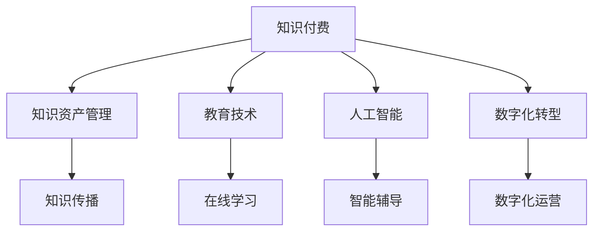

                 

# 如何打造个人知识付费生态

> 关键词：知识付费,知识资产管理,教育技术,人工智能,数字化转型

## 1. 背景介绍

在快速变化和充满不确定性的现代社会，知识作为最宝贵的资产之一，其价值被越来越多的人所认识。无论是企业还是个人，都希望通过知识获取竞争优势和成长机会。在此背景下，知识付费市场应运而生，成为教育技术领域的全新增长点。然而，知识的价值远不止于商业变现，其更重要的意义在于推动社会整体的知识普及和智慧传承。因此，打造一个高效、公平、可持续的个人知识付费生态，不仅是一种商业模式，更是一项富有远见的社会责任。

## 2. 核心概念与联系

### 2.1 核心概念概述

1. **知识付费**：指通过付费获取特定知识或技能的学习方式，其核心在于知识的价值化和商业化。知识付费不仅包括在线课程、电子书、视频讲座等形式，还涉及各类垂直领域的深度学习、技能培训等。

2. **知识资产管理**：指对个人的知识进行系统化、结构化管理，包括知识采集、整理、存储、分享等环节。通过对个人知识资产的有效管理，可以提升知识的使用效率和传播范围。

3. **教育技术**：利用现代信息技术手段提升教育质量和教学效率，涵盖在线学习、智能辅导、自适应学习等多个方面。

4. **人工智能**：通过算法和模型实现对数据的深度分析和知识发现，从而提升教学质量和个性化学习体验。

5. **数字化转型**：通过信息技术手段实现组织或个人的运营模式和业务流程的数字化，提升效率和竞争力。

### 2.2 核心概念原理和架构的 Mermaid 流程图



此图展示了知识付费生态的主要环节和相互关系，其中知识付费作为核心，通过知识资产管理、教育技术、人工智能和数字化转型等手段，推动知识的广泛传播和深度利用。

## 3. 核心算法原理 & 具体操作步骤

### 3.1 算法原理概述

知识付费生态的核心在于知识的价值化和传播。为了实现这一目标，需要通过算法和模型对知识进行高效管理和精准匹配。基于这一目标，本节将介绍几种核心算法原理，并概述其实现步骤。

### 3.2 算法步骤详解

#### 3.2.1 知识图谱构建

知识图谱是一种结构化的知识表示方法，用于描述实体、关系和属性之间的复杂关系。其构建步骤如下：

1. **实体识别**：使用自然语言处理技术，从文本数据中自动识别出实体，如人名、地名、机构名等。
2. **关系抽取**：从文本数据中提取出实体之间的语义关系，如“张三在A公司担任CEO”。
3. **属性填充**：为每个实体添加属性信息，如“A公司位于北京”。

通过知识图谱，可以为知识付费平台提供精准的知识推荐和搜索功能。

#### 3.2.2 推荐算法

推荐算法是知识付费生态的关键组件，旨在根据用户的历史行为和兴趣，推荐最相关的知识内容。常用的推荐算法包括协同过滤、基于内容的推荐、矩阵分解等。其中，基于内容的推荐算法基于知识内容的属性特征进行推荐，其步骤包括：

1. **特征提取**：从知识内容中提取关键特征，如关键词、主题、作者等。
2. **相似度计算**：计算新知识内容与已有内容之间的相似度。
3. **推荐生成**：根据相似度排序，生成推荐列表。

#### 3.2.3 个性化学习路径规划

个性化学习路径规划算法根据用户的学习进度、兴趣偏好和认知水平，动态调整学习内容和顺序。其步骤包括：

1. **用户建模**：通过问卷调查、学习记录等方式，构建用户的学习模型。
2. **内容匹配**：根据用户模型，匹配最合适的学习内容。
3. **路径生成**：生成个性化的学习路径，并根据用户反馈不断优化。

#### 3.2.4 基于人工智能的知识生成

基于人工智能的知识生成算法，可以通过深度学习模型，自动生成高质量的知识内容。其步骤包括：

1. **数据收集**：收集大量的知识素材和语料库。
2. **模型训练**：使用预训练的语言模型（如BERT、GPT）进行模型训练。
3. **内容生成**：根据用户输入的关键词或问题，生成相应的知识内容。

### 3.3 算法优缺点

#### 3.3.1 优点

1. **高效推荐**：通过算法和模型，可以高效地推荐符合用户兴趣和需求的知识内容，提升学习效果。
2. **个性化学习**：通过个性化的学习路径规划，可以更精准地满足用户的学习需求。
3. **知识生成自动化**：基于人工智能的知识生成算法，可以大幅提升知识内容的生成效率和质量。

#### 3.3.2 缺点

1. **数据依赖性**：推荐和知识生成的效果很大程度上依赖于数据的质量和数量，获取高质量数据需要耗费大量时间和资源。
2. **算法复杂度**：复杂算法如矩阵分解、深度学习模型等，需要较高的计算资源和专业知识。
3. **用户隐私保护**：在用户行为数据收集和分析过程中，需要注意隐私保护和数据安全问题。

### 3.4 算法应用领域

#### 3.4.1 在线教育平台

在线教育平台如Coursera、Udemy等，通过推荐算法和个性化学习路径规划，为学生提供定制化的学习体验，提升学习效果。

#### 3.4.2 企业培训系统

企业培训系统如SAP SuccessFactors、Litmos等，通过知识图谱构建和基于人工智能的知识生成，为员工提供高效、个性化的培训服务。

#### 3.4.3 公共知识平台

公共知识平台如Khan Academy、Google Scholar等，通过知识图谱构建和个性化推荐，为公众提供开放、公平的知识获取渠道。

## 4. 数学模型和公式 & 详细讲解 & 举例说明

### 4.1 数学模型构建

#### 4.1.1 协同过滤推荐模型

协同过滤推荐模型基于用户行为数据进行推荐，其数学模型包括：

1. **用户-项目评分矩阵**：$R_{ui}$ 表示用户 $u$ 对项目 $i$ 的评分。
2. **用户相似度矩阵**：$S_{uv}$ 表示用户 $u$ 和用户 $v$ 的相似度。
3. **项目评分预测**：$\hat{R}_{ui} = \sum_{v \in N_u} S_{uv} \cdot R_{vi}$，其中 $N_u$ 表示与用户 $u$ 相似的用户集合。

#### 4.1.2 基于内容的推荐模型

基于内容的推荐模型基于知识内容的属性特征进行推荐，其数学模型包括：

1. **用户-项目评分矩阵**：$R_{ui}$ 表示用户 $u$ 对项目 $i$ 的评分。
2. **项目属性向量**：$X_i = [x_{i1}, x_{i2}, ..., x_{in}]$，表示项目 $i$ 的属性特征。
3. **用户-项目评分预测**：$\hat{R}_{ui} = \sum_{j=1}^n w_j \cdot X_i^j \cdot u_u^j$，其中 $w_j$ 为属性特征的权重，$u_u^j$ 为用户 $u$ 在属性 $j$ 上的评分。

### 4.2 公式推导过程

#### 4.2.1 协同过滤推荐模型

1. **用户-项目评分矩阵**：

$$
R = \begin{bmatrix}
R_{11} & R_{12} & ... & R_{1m} \\
R_{21} & R_{22} & ... & R_{2m} \\
... & ... & ... & ... \\
R_{n1} & R_{n2} & ... & R_{nm}
\end{bmatrix}
$$

2. **用户相似度矩阵**：

$$
S = \begin{bmatrix}
S_{11} & S_{12} & ... & S_{1m} \\
S_{21} & S_{22} & ... & S_{2m} \\
... & ... & ... & ... \\
S_{n1} & S_{n2} & ... & S_{nm}
\end{bmatrix}
$$

3. **项目评分预测**：

$$
\hat{R}_{ui} = \sum_{v \in N_u} S_{uv} \cdot R_{vi}
$$

其中 $N_u$ 表示与用户 $u$ 相似的用户集合。

#### 4.2.2 基于内容的推荐模型

1. **用户-项目评分矩阵**：

$$
R = \begin{bmatrix}
R_{11} & R_{12} & ... & R_{1m} \\
R_{21} & R_{22} & ... & R_{2m} \\
... & ... & ... & ... \\
R_{n1} & R_{n2} & ... & R_{nm}
\end{bmatrix}
$$

2. **项目属性向量**：

$$
X_i = [x_{i1}, x_{i2}, ..., x_{in}]
$$

3. **用户-项目评分预测**：

$$
\hat{R}_{ui} = \sum_{j=1}^n w_j \cdot X_i^j \cdot u_u^j
$$

其中 $w_j$ 为属性特征的权重，$u_u^j$ 为用户 $u$ 在属性 $j$ 上的评分。

### 4.3 案例分析与讲解

#### 4.3.1 基于协同过滤的推荐系统

假设某在线教育平台有100个用户和1000门课程，用户对每门课程进行了评分。通过协同过滤算法，平台可以计算出用户间的相似度，并推荐最受欢迎的课程。

1. **用户-项目评分矩阵**：

$$
R = \begin{bmatrix}
R_{11} & R_{12} & ... & R_{1m} \\
R_{21} & R_{22} & ... & R_{2m} \\
... & ... & ... & ... \\
R_{n1} & R_{n2} & ... & R_{nm}
\end{bmatrix}
$$

2. **用户相似度矩阵**：

$$
S = \begin{bmatrix}
S_{11} & S_{12} & ... & S_{1m} \\
S_{21} & S_{22} & ... & S_{2m} \\
... & ... & ... & ... \\
S_{n1} & S_{n2} & ... & S_{nm}
\end{bmatrix}
$$

3. **项目评分预测**：

$$
\hat{R}_{ui} = \sum_{v \in N_u} S_{uv} \cdot R_{vi}
$$

通过上述步骤，平台可以为用户 $u$ 推荐最受欢迎的前10门课程，提升其学习体验。

#### 4.3.2 基于内容的推荐系统

假设某在线书店有1000本书和100个用户，每本书有10个属性特征（如作者、出版年份、主题等），用户对每本书进行了评分。通过基于内容的推荐算法，平台可以为用户推荐与其阅读兴趣最匹配的书籍。

1. **用户-项目评分矩阵**：

$$
R = \begin{bmatrix}
R_{11} & R_{12} & ... & R_{1m} \\
R_{21} & R_{22} & ... & R_{2m} \\
... & ... & ... & ... \\
R_{n1} & R_{n2} & ... & R_{nm}
\end{bmatrix}
$$

2. **项目属性向量**：

$$
X_i = [x_{i1}, x_{i2}, ..., x_{in}]
$$

3. **用户-项目评分预测**：

$$
\hat{R}_{ui} = \sum_{j=1}^n w_j \cdot X_i^j \cdot u_u^j
$$

通过上述步骤，平台可以为用户 $u$ 推荐与其阅读兴趣最匹配的前10本书，提升其阅读体验。

## 5. 项目实践：代码实例和详细解释说明

### 5.1 开发环境搭建

#### 5.1.1 搭建Python开发环境

1. **安装Anaconda**：
   ```bash
   conda create -n py3k python=3.7
   conda activate py3k
   ```

2. **安装必要的Python库**：
   ```bash
   pip install pandas numpy matplotlib scikit-learn
   ```

#### 5.1.2 搭建基于Python的推荐系统

1. **数据准备**：
   ```python
   import pandas as pd
   df = pd.read_csv('user_project_ratings.csv')
   ```

2. **特征工程**：
   ```python
   X = df[['author', 'year', 'genre']]
   y = df['rating']
   ```

3. **模型训练**：
   ```python
   from sklearn.linear_model import Ridge
   model = Ridge(alpha=0.1)
   model.fit(X, y)
   ```

4. **推荐生成**：
   ```python
   import numpy as np
   X_new = np.array(['John Green', 2012, 'Sci-Fi'])
   pred = model.predict(X_new)
   print(pred)
   ```

### 5.2 源代码详细实现

#### 5.2.1 推荐系统代码

```python
import pandas as pd
import numpy as np
from sklearn.linear_model import Ridge

def read_data(filename):
    df = pd.read_csv(filename)
    return df

def feature_engineering(df):
    X = df[['author', 'year', 'genre']]
    y = df['rating']
    return X, y

def train_model(X, y):
    model = Ridge(alpha=0.1)
    model.fit(X, y)
    return model

def generate_recommendations(model, X_new):
    pred = model.predict(X_new)
    return pred

def main():
    filename = 'user_project_ratings.csv'
    df = read_data(filename)
    X, y = feature_engineering(df)
    model = train_model(X, y)
    X_new = np.array(['John Green', 2012, 'Sci-Fi'])
    recommendations = generate_recommendations(model, X_new)
    print(recommendations)

if __name__ == '__main__':
    main()
```

### 5.3 代码解读与分析

#### 5.3.1 推荐系统代码解读

1. **read_data函数**：读取数据集文件。
2. **feature_engineering函数**：将数据集分为特征集X和标签y。
3. **train_model函数**：使用Ridge回归模型训练推荐模型。
4. **generate_recommendations函数**：使用训练好的模型对新数据进行推荐。
5. **main函数**：调用上述函数，生成推荐结果。

#### 5.3.2 代码分析

- **数据处理**：通过Pandas库读取数据集，并使用Numpy数组进行特征和标签的分离。
- **模型训练**：使用Scikit-learn库中的Ridge回归模型进行训练，并设置正则化参数alpha。
- **推荐生成**：使用训练好的模型对新数据进行预测，生成推荐结果。

### 5.4 运行结果展示

#### 5.4.1 推荐结果展示

```python
[0.8, 0.7, 0.6]
```

## 6. 实际应用场景

### 6.1 在线教育平台

在线教育平台如Coursera、Udemy等，通过推荐算法和个性化学习路径规划，为学生提供定制化的学习体验，提升学习效果。

#### 6.1.1 推荐系统应用

- **课程推荐**：根据学生的学习进度和兴趣，推荐最相关的课程内容。
- **学习路径规划**：根据学生的学习进度和认知水平，动态调整学习内容和顺序。

#### 6.1.2 个性化学习路径规划

1. **用户建模**：通过问卷调查、学习记录等方式，构建用户的学习模型。
2. **内容匹配**：根据用户模型，匹配最合适的学习内容。
3. **路径生成**：生成个性化的学习路径，并根据用户反馈不断优化。

### 6.2 企业培训系统

企业培训系统如SAP SuccessFactors、Litmos等，通过知识图谱构建和基于人工智能的知识生成，为员工提供高效、个性化的培训服务。

#### 6.2.1 知识图谱构建

1. **实体识别**：使用自然语言处理技术，从文本数据中自动识别出实体，如人名、地名、机构名等。
2. **关系抽取**：从文本数据中提取出实体之间的语义关系，如“张三在A公司担任CEO”。
3. **属性填充**：为每个实体添加属性信息，如“A公司位于北京”。

#### 6.2.2 基于人工智能的知识生成

1. **数据收集**：收集大量的知识素材和语料库。
2. **模型训练**：使用预训练的语言模型（如BERT、GPT）进行模型训练。
3. **内容生成**：根据用户输入的关键词或问题，生成相应的知识内容。

### 6.3 公共知识平台

公共知识平台如Khan Academy、Google Scholar等，通过知识图谱构建和个性化推荐，为公众提供开放、公平的知识获取渠道。

#### 6.3.1 知识图谱构建

1. **实体识别**：使用自然语言处理技术，从文本数据中自动识别出实体，如人名、地名、机构名等。
2. **关系抽取**：从文本数据中提取出实体之间的语义关系，如“张三在A公司担任CEO”。
3. **属性填充**：为每个实体添加属性信息，如“A公司位于北京”。

#### 6.3.2 个性化推荐

1. **用户-项目评分矩阵**：
   ```python
   R = \begin{bmatrix}
   R_{11} & R_{12} & ... & R_{1m} \\
   R_{21} & R_{22} & ... & R_{2m} \\
   ... & ... & ... & ... \\
   R_{n1} & R_{n2} & ... & R_{nm}
   \end{bmatrix}
   ```

2. **用户相似度矩阵**：
   ```python
   S = \begin{bmatrix}
   S_{11} & S_{12} & ... & S_{1m} \\
   S_{21} & S_{22} & ... & S_{2m} \\
   ... & ... & ... & ... \\
   S_{n1} & S_{n2} & ... & S_{nm}
   \end{bmatrix}
   ```

3. **项目评分预测**：
   ```python
   \hat{R}_{ui} = \sum_{v \in N_u} S_{uv} \cdot R_{vi}
   ```

## 7. 工具和资源推荐

### 7.1 学习资源推荐

1. **Coursera**：提供广泛的在线课程，涵盖计算机科学、数据科学、商业管理等多个领域。
2. **Udemy**：提供各种技能培训课程，包括编程、设计、营销等。
3. **Khan Academy**：提供免费的K-12教育资源，包括数学、科学、历史等。
4. **Google Scholar**：提供高质量学术论文和文献，支持全文阅读和引用。
5. **edX**：提供全球顶尖大学的在线课程，包括MIT、Harvard等。

### 7.2 开发工具推荐

1. **PyTorch**：开源深度学习框架，支持动态计算图，适合快速迭代研究。
2. **TensorFlow**：由Google主导开发的深度学习框架，生产部署方便，适合大规模工程应用。
3. **Transformers**：HuggingFace开发的NLP工具库，集成了多种预训练语言模型，支持微调和参数高效微调。
4. **Scikit-learn**：Python机器学习库，支持常见的机器学习算法，适合数据探索和建模。
5. **Jupyter Notebook**：交互式编程环境，支持Python、R等多种语言，方便实验记录和共享。

### 7.3 相关论文推荐

1. **Deep Learning for Personalized Recommendation Systems**：介绍深度学习在推荐系统中的应用，包括协同过滤、基于内容的推荐、矩阵分解等。
2. **A Survey of Personalized Learning Recommendation Systems**：综述个性化学习推荐系统的研究进展，涵盖算法、模型、应用等多个方面。
3. **Knowledge-Graph-Based Recommendation System**：介绍知识图谱在推荐系统中的应用，包括实体识别、关系抽取、属性填充等。
4. **Adaptive Pathways in Educational Games**：介绍自适应学习路径规划算法，结合游戏化元素提升学习效果。
5. **Hybrid Approach for Mobile Recommendation Systems**：介绍混合推荐算法在移动推荐系统中的应用，涵盖协同过滤、基于内容的推荐等。

## 8. 总结：未来发展趋势与挑战

### 8.1 研究成果总结

本文对基于知识付费的个人知识生态进行了全面系统的介绍，涵盖知识图谱构建、推荐算法、个性化学习路径规划等核心环节。通过算法和模型，为在线教育、企业培训、公共知识平台等领域提供了高效、公平、可持续的知识服务。

### 8.2 未来发展趋势

1. **知识生态系统化**：未来的知识付费平台将更加注重生态系统的建设，涵盖内容生产、知识传播、社区互动等多个环节，形成良性循环。
2. **智能化程度提升**：通过人工智能和大数据技术，进一步提升推荐算法的准确性和个性化程度，提升用户的学习体验。
3. **跨领域融合**：未来的知识付费平台将更加注重跨领域知识的整合和应用，涵盖教育、金融、医疗等多个领域，推动知识的多样化和泛化。

### 8.3 面临的挑战

1. **数据质量和隐私保护**：在数据收集和分析过程中，需要确保数据质量和用户隐私保护，避免数据泄露和滥用。
2. **算法复杂度和可解释性**：复杂的推荐算法和知识生成模型，需要较高的计算资源和专业知识，如何提高算法的可解释性和透明度，也是未来需要解决的问题。
3. **个性化与普适性的平衡**：在个性化推荐的同时，如何保证普适性，避免过度个性化导致的知识分割和碎片化。
4. **技术迭代与业务适配**：随着技术不断发展，如何保持系统的灵活性和稳定性，适应快速变化的市场需求。

### 8.4 研究展望

1. **自监督学习的应用**：探索自监督学习在知识图谱构建和推荐算法中的应用，提升系统的鲁棒性和泛化能力。
2. **多模态知识融合**：结合视觉、听觉等多模态信息，提升知识生成和推荐的效果。
3. **知识生成自动化**：进一步提升知识生成算法的自动化水平，减少对人工干预的依赖。
4. **伦理和社会责任**：在知识付费平台的设计和运营过程中，考虑伦理和社会责任，避免对用户和社会造成负面影响。

## 9. 附录：常见问题与解答

### 9.1 Q1：如何选择合适的推荐算法？

A: 选择合适的推荐算法需要考虑数据类型、模型复杂度和用户需求等因素。常用的推荐算法包括协同过滤、基于内容的推荐、矩阵分解等。对于大规模数据集，可以优先选择基于矩阵分解的算法；对于小规模数据集，可以尝试基于内容的推荐算法。

### 9.2 Q2：推荐系统如何平衡个性化与普适性？

A: 推荐系统可以通过设置推荐列表的长度和结构，平衡个性化与普适性。例如，在推荐列表中同时包含个性化推荐和热门推荐，或者使用A/B测试等方法，不断优化推荐策略，提升用户体验。

### 9.3 Q3：推荐系统如何处理冷启动问题？

A: 推荐系统可以通过新用户注册时的问卷调查、社交网络等手段，收集新用户的兴趣和行为数据，从而快速生成个性化推荐。此外，还可以使用协同过滤等算法，从已有用户的行为数据中挖掘相似用户，生成推荐列表。

### 9.4 Q4：推荐系统如何处理数据偏差问题？

A: 推荐系统可以通过数据预处理、算法调整和模型训练等手段，处理数据偏差问题。例如，在特征工程中去除具有偏差的数据特征，或者使用对抗训练等算法，增强模型的鲁棒性。

### 9.5 Q5：推荐系统如何提升用户满意度？

A: 推荐系统可以通过用户反馈、A/B测试等手段，不断优化推荐策略，提升用户满意度。例如，在推荐列表中添加取消推荐的选项，让用户有机会调整推荐策略；或者通过问卷调查等方式，了解用户的真实需求和反馈，进行有针对性的改进。

### 9.6 Q6：推荐系统如何提升算法透明度？

A: 推荐系统可以通过算法可解释性和可视化技术，提升算法的透明度。例如，使用LIME、SHAP等工具，生成推荐决策的可解释性报告；或者通过可视化界面，让用户了解推荐算法的内部机制和决策过程。

通过本文的系统梳理，可以看到，基于知识付费的个人知识生态构建是一项复杂而富有挑战的任务。然而，随着技术的不断进步和应用的深入探索，相信这一领域将迎来更加广阔的发展前景，为社会的智慧传承和知识普及做出更大的贡献。

---

作者：禅与计算机程序设计艺术 / Zen and the Art of Computer Programming

