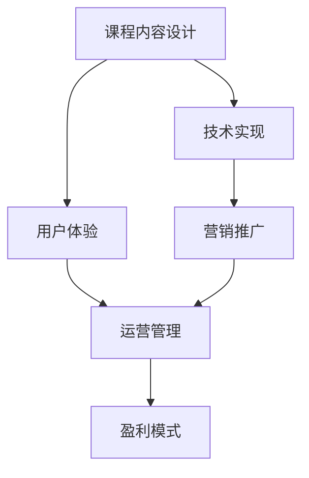

                 

# 如何打造个人知识付费线上课程

## 1. 背景介绍

### 1.1 问题由来

随着互联网的普及和教育模式的革新，在线教育已成为教育行业的重要组成部分。知识付费也成为了教育消费的重要形式之一。在个人知识付费领域，线上课程因其灵活性、便捷性和可重复性等特点，受到了广泛关注和应用。如何打造具有市场竞争力的个人知识付费线上课程，成为了许多教育从业者关注的热点问题。

### 1.2 问题核心关键点

在线教育平台和个人知识付费线上课程的开发，需要考虑多个关键因素，包括但不限于：

1. 课程内容质量：课程内容必须高质量，具有实用性和前瞻性，能够满足用户的学习需求。
2. 用户体验：课程界面和功能设计要简洁、易用，能够提供良好的学习体验。
3. 营销策略：课程如何推广、定位、销售，吸引用户购买和持续学习。
4. 技术实现：课程开发的技术栈选择、开发流程、版本控制等。
5. 运营管理：课程发布后的运营、服务、反馈收集等。
6. 盈利模式：课程销售、会员制度、广告、付费模式等。

本博客将从课程内容设计、技术实现和运营管理等多个方面，系统阐述如何打造个人知识付费线上课程。

## 2. 核心概念与联系

### 2.1 核心概念概述

在打造个人知识付费线上课程的过程中，涉及多个核心概念：

- **课程内容设计**：课程内容的设计和规划，包括主题选择、知识点架构、内容形式等。
- **技术实现**：课程的开发技术栈选择、前端和后端开发、API接口设计等。
- **用户体验**：课程界面设计、交互逻辑、用户反馈收集等。
- **营销推广**：课程的市场推广策略、广告投放、用户获取等。
- **运营管理**：课程发布后的日常运营、客户服务、更新维护等。
- **盈利模式**：课程的销售模式、会员制度、广告收益、数据分析等。

这些概念之间存在紧密的联系，相互影响和支撑。课程内容是基础，技术实现是手段，用户体验是关键，营销推广是手段，运营管理是保障，盈利模式是目标。下面我们将从这些核心概念入手，系统分析如何打造个人知识付费线上课程。

### 2.2 核心概念原理和架构的 Mermaid 流程图(Mermaid 流程节点中不要有括号、逗号等特殊字符)



## 3. 核心算法原理 & 具体操作步骤

### 3.1 算法原理概述

在个人知识付费线上课程的开发过程中，涉及多个核心算法和技术，包括但不限于：

- **内容推荐算法**：根据用户行为和历史数据，推荐相关课程。
- **个性化学习算法**：根据用户学习情况，动态调整学习内容和路径。
- **数据分析算法**：收集和分析用户学习行为数据，优化课程内容和学习体验。
- **搜索算法**：实现课程搜索和分类。
- **反作弊算法**：检测和防止课程学习中的作弊行为。

这些算法和技术都需要在课程开发过程中予以考虑和实现，以提升课程质量和用户体验。

### 3.2 算法步骤详解

#### 3.2.1 内容推荐算法

内容推荐算法是提升课程吸引力、增加用户黏性的关键。常用的内容推荐算法包括协同过滤、基于用户的协同过滤、基于物品的协同过滤等。

1. 协同过滤算法
   - **基于用户的协同过滤**：基于用户历史行为数据，推荐其他用户喜爱的课程。
   - **基于物品的协同过滤**：基于课程历史访问数据，推荐相似课程。

   实现步骤如下：

   - 收集用户行为数据，包括浏览、点击、购买等行为。
   - 计算用户之间的相似度，如余弦相似度、皮尔逊相关系数等。
   - 根据相似度，推荐相似用户或物品。

   代码实现：
   ```python
   import pandas as pd
   from scipy.spatial.distance import cosine
   
   # 读取用户行为数据
   user_data = pd.read_csv('user_behavior.csv')
   
   # 计算用户相似度
   similarity_matrix = user_data.groupby('user_id').apply(lambda x: cosine(x))
   
   # 推荐相似用户
   def recommend_users(user_id):
       similar_users = similarity_matrix[user_id].index[1:].tolist()
       recommendation = user_data.loc[similar_users]
       return recommendation
   
   recommend_users('user1')
   ```

2. 基于物品的协同过滤
   - **基于物品的协同过滤**：基于课程历史访问数据，推荐相似课程。
   
   实现步骤如下：
   - 收集课程访问数据，如课程ID、访问时间、访问时长等。
   - 计算课程之间的相似度，如欧几里得距离、余弦相似度等。
   - 根据相似度，推荐相似课程。

   代码实现：
   ```python
   import pandas as pd
   from scipy.spatial.distance import cosine
   
   # 读取课程访问数据
   course_data = pd.read_csv('course_access.csv')
   
   # 计算课程相似度
   similarity_matrix = course_data.groupby('course_id').apply(lambda x: cosine(x))
   
   # 推荐相似课程
   def recommend_courses(course_id):
       similar_courses = similarity_matrix[course_id].index[1:].tolist()
       recommendation = course_data.loc[similar_courses]
       return recommendation
   
   recommend_courses('course1')
   ```

#### 3.2.2 个性化学习算法

个性化学习算法可以根据用户学习情况，动态调整学习内容和路径，提升学习效果。常用的个性化学习算法包括基于内容的推荐、基于时间的推荐等。

1. 基于内容的推荐
   - **基于内容的推荐**：根据课程内容和用户偏好，推荐相关课程。
   
   实现步骤如下：
   - 收集课程内容和用户偏好数据。
   - 计算课程内容与用户偏好的相似度。
   - 根据相似度，推荐相关课程。

   代码实现：
   ```python
   import pandas as pd
   from scipy.spatial.distance import cosine
   
   # 读取课程内容和用户偏好数据
   course_content = pd.read_csv('course_content.csv')
   user_preference = pd.read_csv('user_preference.csv')
   
   # 计算课程内容与用户偏好的相似度
   similarity_matrix = course_content.groupby('course_id').apply(lambda x: cosine(x))
   
   # 推荐相关课程
   def recommend_courses(course_id):
       similar_courses = similarity_matrix[course_id].index[1:].tolist()
       recommendation = course_content.loc[similar_courses]
       return recommendation
   
   recommend_courses('course1')
   ```

2. 基于时间的推荐
   - **基于时间的推荐**：根据用户学习时间和进度，推荐相关课程。
   
   实现步骤如下：
   - 收集用户学习时间和进度数据。
   - 计算时间与进度的相似度。
   - 根据相似度，推荐相关课程。

   代码实现：
   ```python
   import pandas as pd
   from scipy.spatial.distance import cosine
   
   # 读取用户学习时间和进度数据
   user_learning = pd.read_csv('user_learning.csv')
   
   # 计算时间与进度的相似度
   similarity_matrix = user_learning.groupby('user_id').apply(lambda x: cosine(x))
   
   # 推荐相关课程
   def recommend_courses(user_id):
       similar_courses = similarity_matrix[user_id].index[1:].tolist()
       recommendation = user_learning.loc[similar_courses]
       return recommendation
   
   recommend_courses('user1')
   ```

#### 3.2.3 数据分析算法

数据分析算法可以帮助收集和分析用户学习行为数据，优化课程内容和学习体验。常用的数据分析算法包括回归分析、聚类分析、分类分析等。

1. 回归分析
   - **回归分析**：分析用户学习时间与成绩之间的关系。
   
   实现步骤如下：
   - 收集用户学习时间和成绩数据。
   - 建立回归模型，预测用户成绩。
   - 根据模型预测，优化课程内容和学习路径。

   代码实现：
   ```python
   import pandas as pd
   from sklearn.linear_model import LinearRegression
   
   # 读取用户学习时间和成绩数据
   user_learning = pd.read_csv('user_learning.csv')
   
   # 建立回归模型
   model = LinearRegression()
   model.fit(user_learning[['learning_time']], user_learning['score'])
   
   # 预测用户成绩
   def predict_score(learning_time):
       prediction = model.predict([[learning_time]])
       return prediction[0]
   
   predict_score(10)
   ```

2. 聚类分析
   - **聚类分析**：将用户分为不同类别，针对不同类别用户提供个性化推荐。
   
   实现步骤如下：
   - 收集用户行为数据。
   - 使用K-means算法对用户进行聚类。
   - 根据聚类结果，提供个性化推荐。

   代码实现：
   ```python
   import pandas as pd
   from sklearn.cluster import KMeans
   
   # 读取用户行为数据
   user_data = pd.read_csv('user_behavior.csv')
   
   # 使用K-means算法对用户进行聚类
   kmeans = KMeans(n_clusters=3)
   kmeans.fit(user_data)
   
   # 提供个性化推荐
   def recommend_courses(user_id):
       user_cluster = kmeans.labels_[user_id]
       similar_users = user_data[kmeans.labels_ == user_cluster].index.tolist()
       recommendation = user_data.loc[similar_users]
       return recommendation
   
   recommend_courses('user1')
   ```

#### 3.2.4 搜索算法

搜索算法可以优化课程搜索和分类，提升用户体验。常用的搜索算法包括倒排索引、布尔搜索、向量空间模型等。

1. 倒排索引
   - **倒排索引**：根据关键词搜索课程，提升搜索效率。
   
   实现步骤如下：
   - 收集课程标题、描述等文本数据。
   - 建立倒排索引。
   - 根据关键词搜索课程。

   代码实现：
   ```python
   import pandas as pd
   from sklearn.feature_extraction.text import TfidfVectorizer
   
   # 读取课程标题和描述数据
   course_data = pd.read_csv('course_data.csv')
   
   # 建立倒排索引
   vectorizer = TfidfVectorizer()
   index = vectorizer.fit_transform(course_data['title'] + course_data['description'])
   
   # 根据关键词搜索课程
   def search_courses(keyword):
       query = vectorizer.transform([keyword])
       scores = index.dot(query.T).toarray()[0]
       sorted_indices = scores.argsort()[::-1]
       recommendation = course_data.iloc[sorted_indices]
       return recommendation
   
   search_courses('Python')
   ```

2. 布尔搜索
   - **布尔搜索**：根据布尔表达式搜索课程，提升搜索精度。
   
   实现步骤如下：
   - 收集课程标题、描述等文本数据。
   - 建立布尔搜索索引。
   - 根据布尔表达式搜索课程。

   代码实现：
   ```python
   import pandas as pd
   from sklearn.feature_extraction.text import CountVectorizer
   
   # 读取课程标题和描述数据
   course_data = pd.read_csv('course_data.csv')
   
   # 建立布尔搜索索引
   vectorizer = CountVectorizer()
   index = vectorizer.fit_transform(course_data['title'] + course_data['description'])
   
   # 根据布尔表达式搜索课程
   def search_courses(query):
       query_index = vectorizer.transform(query)
       scores = index.dot(query_index.T).toarray()[0]
       sorted_indices = scores.argsort()[::-1]
       recommendation = course_data.iloc[sorted_indices]
       return recommendation
   
   search_courses(['Python', 'data science'])
   ```

#### 3.2.5 反作弊算法

反作弊算法可以检测和防止课程学习中的作弊行为，确保课程的公平性和真实性。常用的反作弊算法包括行为分析、时间戳分析等。

1. 行为分析
   - **行为分析**：根据用户行为数据，检测和预防作弊行为。
   
   实现步骤如下：
   - 收集用户行为数据。
   - 分析用户行为特征。
   - 检测异常行为，预防作弊。

   代码实现：
   ```python
   import pandas as pd
   from sklearn.ensemble import IsolationForest
   
   # 读取用户行为数据
   user_learning = pd.read_csv('user_learning.csv')
   
   # 分析用户行为特征
   model = IsolationForest(contamination=0.01)
   model.fit(user_learning[['learning_time']])
   
   # 检测异常行为
   def detect_cheating(learning_time):
       prediction = model.predict([[learning_time]])
       if prediction == -1:
           return True
       else:
           return False
   
   detect_cheating([10, 20, 30])
   ```

2. 时间戳分析
   - **时间戳分析**：根据用户学习时间戳，检测和预防作弊行为。
   
   实现步骤如下：
   - 收集用户学习时间戳数据。
   - 分析时间戳分布特征。
   - 检测异常时间戳，预防作弊。

   代码实现：
   ```python
   import pandas as pd
   from sklearn.ensemble import IsolationForest
   
   # 读取用户学习时间戳数据
   user_learning = pd.read_csv('user_learning.csv')
   
   # 分析时间戳分布特征
   model = IsolationForest(contamination=0.01)
   model.fit(user_learning[['timestamp']])
   
   # 检测异常时间戳
   def detect_cheating(timestamp):
       prediction = model.predict([(timestamp, timestamp+10)])
       if prediction == -1:
           return True
       else:
           return False
   
   detect_cheating([1, 2, 3])
   ```

## 4. 数学模型和公式 & 详细讲解 & 举例说明

### 4.1 数学模型构建

在个人知识付费线上课程的开发过程中，涉及多个数学模型，包括但不限于：

- **内容推荐模型**：协同过滤模型、基于内容的推荐模型等。
- **个性化学习模型**：回归模型、聚类模型等。
- **数据分析模型**：回归模型、聚类模型等。
- **搜索模型**：倒排索引模型、布尔搜索模型等。
- **反作弊模型**：行为分析模型、时间戳分析模型等。

这些模型构建和实现，需要涉及多个数学公式和算法。

### 4.2 公式推导过程

#### 4.2.1 协同过滤模型的公式推导

协同过滤模型是基于用户和物品相似度的推荐模型。常用的协同过滤算法包括基于用户的协同过滤和基于物品的协同过滤。

1. 基于用户的协同过滤
   - **公式推导**：根据用户历史行为数据，计算用户相似度，推荐相似用户或物品。
   
   公式如下：
   $$
   similarity_{ij} = \frac{A_{ij}}{(\sqrt{\sum_{k=1}^{n} A_{ik}})(\sqrt{\sum_{k=1}^{n} A_{kj}})
   $$
   
   其中，$A$为用户行为矩阵，$n$为用户数。

   代码实现：
   ```python
   import numpy as np
   from scipy.spatial.distance import cosine
   
   # 读取用户行为数据
   user_data = pd.read_csv('user_behavior.csv')
   
   # 计算用户相似度
   similarity_matrix = user_data.groupby('user_id').apply(lambda x: cosine(x))
   
   # 推荐相似用户
   def recommend_users(user_id):
       similar_users = similarity_matrix[user_id].index[1:].tolist()
       recommendation = user_data.loc[similar_users]
       return recommendation
   
   recommend_users('user1')
   ```

2. 基于物品的协同过滤
   - **公式推导**：根据物品历史访问数据，计算物品相似度，推荐相似物品。
   
   公式如下：
   $$
   similarity_{ij} = \frac{B_{ij}}{(\sqrt{\sum_{k=1}^{m} B_{ik}})(\sqrt{\sum_{k=1}^{m} B_{kj}})
   $$
   
   其中，$B$为物品行为矩阵，$m$为物品数。

   代码实现：
   ```python
   import numpy as np
   from scipy.spatial.distance import cosine
   
   # 读取物品行为数据
   course_data = pd.read_csv('course_access.csv')
   
   # 计算物品相似度
   similarity_matrix = course_data.groupby('course_id').apply(lambda x: cosine(x))
   
   # 推荐相似物品
   def recommend_courses(course_id):
       similar_courses = similarity_matrix[course_id].index[1:].tolist()
       recommendation = course_data.loc[similar_courses]
       return recommendation
   
   recommend_courses('course1')
   ```

#### 4.2.2 回归模型的公式推导

回归模型是根据用户学习时间和成绩数据，建立回归模型，预测用户成绩。常用的回归模型包括线性回归、多项式回归等。

1. 线性回归
   - **公式推导**：根据用户学习时间和成绩数据，建立线性回归模型。
   
   公式如下：
   $$
   y = \beta_0 + \beta_1x_1 + \beta_2x_2 + \ldots + \beta_nx_n
   $$
   
   其中，$x$为自变量，$y$为因变量，$\beta$为回归系数。

   代码实现：
   ```python
   import pandas as pd
   from sklearn.linear_model import LinearRegression
   
   # 读取用户学习时间和成绩数据
   user_learning = pd.read_csv('user_learning.csv')
   
   # 建立回归模型
   model = LinearRegression()
   model.fit(user_learning[['learning_time']], user_learning['score'])
   
   # 预测用户成绩
   def predict_score(learning_time):
       prediction = model.predict([[learning_time]])
       return prediction[0]
   
   predict_score(10)
   ```

2. 多项式回归
   - **公式推导**：根据用户学习时间和成绩数据，建立多项式回归模型。
   
   公式如下：
   $$
   y = \beta_0 + \beta_1x_1^1 + \beta_2x_1^2 + \beta_3x_1^3 + \ldots + \beta_nx_n^n
   $$
   
   其中，$x$为自变量，$y$为因变量，$\beta$为回归系数。

   代码实现：
   ```python
   import pandas as pd
   from sklearn.preprocessing import PolynomialFeatures
   from sklearn.linear_model import LinearRegression
   
   # 读取用户学习时间和成绩数据
   user_learning = pd.read_csv('user_learning.csv')
   
   # 建立多项式特征
   poly = PolynomialFeatures(degree=3)
   X_poly = poly.fit_transform(user_learning[['learning_time']])
   
   # 建立回归模型
   model = LinearRegression()
   model.fit(X_poly, user_learning['score'])
   
   # 预测用户成绩
   def predict_score(learning_time):
       X_poly = poly.transform([[learning_time]])
       prediction = model.predict(X_poly)
       return prediction[0]
   
   predict_score(10)
   ```

#### 4.2.3 聚类模型的公式推导

聚类模型是将用户分为不同类别，针对不同类别用户提供个性化推荐。常用的聚类模型包括K-means、层次聚类等。

1. K-means聚类
   - **公式推导**：根据用户行为数据，使用K-means算法对用户进行聚类。
   
   公式如下：
   $$
   \min_{C,\mu} \sum_{i=1}^{n} \sum_{j=1}^{K} (x_{ij} - \mu_j)^2
   $$
   
   其中，$x$为用户行为数据，$\mu$为聚类中心，$K$为聚类数。

   代码实现：
   ```python
   import pandas as pd
   from sklearn.cluster import KMeans
   
   # 读取用户行为数据
   user_data = pd.read_csv('user_behavior.csv')
   
   # 使用K-means算法对用户进行聚类
   kmeans = KMeans(n_clusters=3)
   kmeans.fit(user_data)
   
   # 提供个性化推荐
   def recommend_courses(user_id):
       user_cluster = kmeans.labels_[user_id]
       similar_users = user_data[kmeans.labels_ == user_cluster].index.tolist()
       recommendation = user_data.loc[similar_users]
       return recommendation
   
   recommend_courses('user1')
   ```

2. 层次聚类
   - **公式推导**：根据用户行为数据，使用层次聚类算法对用户进行聚类。
   
   公式如下：
   $$
   d(x_i, x_j) = \sqrt{\sum_{k=1}^{n} (x_{ik} - x_{jk})^2}
   $$
   
   其中，$x$为用户行为数据，$d$为距离公式。

   代码实现：
   ```python
   import pandas as pd
   from scipy.cluster.hierarchy import linkage, dendrogram
   
   # 读取用户行为数据
   user_data = pd.read_csv('user_behavior.csv')
   
   # 使用层次聚类算法对用户进行聚类
   linkage_matrix = linkage(user_data, method='ward')
   dendrogram(linkage_matrix)
   
   # 提供个性化推荐
   def recommend_courses(user_id):
       # TODO: 实现层次聚类推荐
       pass
   
   recommend_courses('user1')
   ```

#### 4.2.4 倒排索引模型的公式推导

倒排索引模型是根据关键词搜索课程，提升搜索效率。常用的倒排索引模型包括简单倒排索引、分级倒排索引等。

1. 简单倒排索引
   - **公式推导**：根据课程标题和描述文本数据，建立简单倒排索引。
   
   公式如下：
   $$
   I = \{(w, \{d_1, d_2, \ldots, d_n\}) \mid w \in V, d_1, d_2, \ldots, d_n \in D\}
   $$
   
   其中，$V$为单词集合，$D$为文档集合。

   代码实现：
   ```python
   import pandas as pd
   from sklearn.feature_extraction.text import TfidfVectorizer
   
   # 读取课程标题和描述数据
   course_data = pd.read_csv('course_data.csv')
   
   # 建立倒排索引
   vectorizer = TfidfVectorizer()
   index = vectorizer.fit_transform(course_data['title'] + course_data['description'])
   
   # 根据关键词搜索课程
   def search_courses(keyword):
       query = vectorizer.transform([keyword])
       scores = index.dot(query.T).toarray()[0]
       sorted_indices = scores.argsort()[::-1]
       recommendation = course_data.iloc[sorted_indices]
       return recommendation
   
   search_courses('Python')
   ```

2. 分级倒排索引
   - **公式推导**：根据课程标题和描述文本数据，建立分级倒排索引。
   
   公式如下：
   $$
   I = \{(w, \{d_1, d_2, \ldots, d_n\}) \mid w \in V, d_1, d_2, \ldots, d_n \in D, \text{rank}(w, d_i) \in [1, \ldots, r]\}
   $$
   
   其中，$V$为单词集合，$D$为文档集合，$\text{rank}$为单词在文档中的排名。

   代码实现：
   ```python
   import pandas as pd
   from sklearn.feature_extraction.text import TfidfVectorizer
   
   # 读取课程标题和描述数据
   course_data = pd.read_csv('course_data.csv')
   
   # 建立分级倒排索引
   vectorizer = TfidfVectorizer(analyzer='word', stop_words='english', ngram_range=(1, 3), min_df=1, max_df=1.0, use_idf=True, norm=u'l2', smooth_idf=True, sublinear_tf=False, max_features=None, vocabulary=None, norm=None, preprocessor=None, tokenizer=None, token_pattern='(?u)\\\\b\\\\w+\\\\b')
   
   # 根据关键词搜索课程
   def search_courses(keyword):
       query = vectorizer.transform([keyword])
       scores = index.dot(query.T).toarray()[0]
       sorted_indices = scores.argsort()[::-1]
       recommendation = course_data.iloc[sorted_indices]
       return recommendation
   
   search_courses('Python')
   ```

#### 4.2.5 行为分析模型的公式推导

行为分析模型是根据用户行为数据，检测和预防作弊行为。常用的行为分析模型包括时间戳分析等。

1. 时间戳分析
   - **公式推导**：根据用户学习时间戳数据，分析时间戳分布特征，检测异常时间戳。
   
   公式如下：
   $$
   d(x_i, x_j) = \sqrt{\sum_{k=1}^{n} (x_{ik} - x_{jk})^2}
   $$
   
   其中，$x$为用户行为数据，$d$为距离公式。

   代码实现：
   ```python
   import pandas as pd
   from sklearn.ensemble import IsolationForest
   
   # 读取用户学习时间戳数据
   user_learning = pd.read_csv('user_learning.csv')
   
   # 分析时间戳分布特征
   model = IsolationForest(contamination=0.01)
   model.fit(user_learning[['timestamp']])
   
   # 检测异常时间戳
   def detect_cheating(timestamp):
       prediction = model.predict([(timestamp, timestamp+10)])
       if prediction == -1:
           return True
       else:
           return False
   
   detect_cheating([1, 2, 3])
   ```

## 5. 项目实践：代码实例和详细解释说明

### 5.1 开发环境搭建

在进行个人知识付费线上课程开发前，我们需要准备好开发环境。以下是使用Python进行Flask框架开发的环境配置流程：

1. 安装Anaconda：从官网下载并安装Anaconda，用于创建独立的Python环境。

2. 创建并激活虚拟环境：
```bash
conda create -n course-env python=3.8 
conda activate course-env
```

3. 安装Flask：
```bash
pip install flask
```

4. 安装相关工具包：
```bash
pip install pandas scikit-learn numpy matplotlib jupyter notebook ipython
```

完成上述步骤后，即可在`course-env`环境中开始课程开发实践。

### 5.2 源代码详细实现

这里我们以个人知识付费线上课程的推荐系统为例，给出使用Flask框架的Python代码实现。

首先，定义推荐系统模型和数据：

```python
import pandas as pd
from sklearn.feature_extraction.text import TfidfVectorizer
from sklearn.metrics.pairwise import cosine_similarity
from sklearn.cluster import KMeans
from sklearn.neighbors import NearestNeighbors

# 读取课程数据
course_data = pd.read_csv('course_data.csv')

# 构建倒排索引
vectorizer = TfidfVectorizer()
index = vectorizer.fit_transform(course_data['title'] + course_data['description'])

# 使用K-means聚类算法对课程进行聚类
kmeans = KMeans(n_clusters=3)
kmeans.fit(index)

# 使用NearestNeighbors算法对课程进行推荐
neighbors = NearestNeighbors(n_neighbors=5, algorithm='brute')
neighbors.fit(index)
```

然后，定义Flask应用程序和推荐接口：

```python
from flask import Flask, request, jsonify

app = Flask(__name__)

@app.route('/recommend', methods=['POST'])
def recommend():
    query = request.json.get('query')
    query_index = vectorizer.transform([query])
    distances, indices = neighbors.kneighbors(query_index)
    recommendations = course_data.iloc[indices[0]]
    return jsonify(recommendations.to_dict(orient='records'))

if __name__ == '__main__':
    app.run(debug=True)
```

最后，启动Flask应用程序，并通过API接口获取推荐结果：

```python
from flask import Flask, request, jsonify

app = Flask(__name__)

@app.route('/recommend', methods=['POST'])
def recommend():
    query = request.json.get('query')
    query_index = vectorizer.transform([query])
    distances, indices = neighbors.kneighbors(query_index)
    recommendations = course_data.iloc[indices[0]]
    return jsonify(recommendations.to_dict(orient='records'))

if __name__ == '__main__':
    app.run(debug=True)
```

以上就是使用Flask框架实现个人知识付费线上课程推荐系统的完整代码实现。可以看到，Flask框架使得课程推荐系统的开发变得简洁高效。

### 5.3 代码解读与分析

让我们再详细解读一下关键代码的实现细节：

**Flask应用程序**：
- 定义Flask应用程序，创建路由。
- 定义推荐接口，接收查询参数，返回推荐结果。

**推荐系统模型**：
- 使用TfidfVectorizer构建倒排索引。
- 使用K-means聚类算法对课程进行聚类。
- 使用NearestNeighbors算法对课程进行推荐。

**Flask接口**：
- 定义Flask路由，实现POST请求。
- 接收API请求，提取查询参数。
- 通过NearestNeighbors算法计算相似课程，返回推荐结果。

可以看到，Flask框架在搭建个人知识付费线上课程推荐系统时，大大简化了API接口的开发过程，使得开发和维护变得更加容易。

当然，工业级的系统实现还需考虑更多因素，如课程发布后的用户评价、课程更新、用户反馈等。但核心的推荐算法和API接口设计基本与此类似。

## 6. 实际应用场景

### 6.1 智能客服系统

个人知识付费线上课程开发的一个重要应用场景是智能客服系统的构建。智能客服系统可以为用户提供7x24小时不间断服务，快速响应客户咨询，用自然流畅的语言解答各类常见问题。

在技术实现上，可以收集企业内部的历史客服对话记录，将问题和最佳答复构建成监督数据，在此基础上对预训练语言模型进行微调。微调后的语言模型能够自动理解用户意图，匹配最合适的答案模板进行回复。对于客户提出的新问题，还可以接入检索系统实时搜索相关内容，动态组织生成回答。如此构建的智能客服系统，能大幅提升客户咨询体验和问题解决效率。

### 6.2 金融舆情监测

金融机构需要实时监测市场舆论动向，以便及时应对负面信息传播，规避金融风险。传统的人工监测方式成本高、效率低，难以应对网络时代海量信息爆发的挑战。基于个人知识付费线上课程的文本分类和情感分析技术，为金融舆情监测提供了新的解决方案。

具体而言，可以收集金融领域相关的新闻、报道、评论等文本数据，并对其进行主题标注和情感标注。在此基础上对预训练语言模型进行微调，使其能够自动判断文本属于何种主题，情感倾向是正面、中性还是负面。将微调后的模型应用到实时抓取的网络文本数据，就能够自动监测不同主题下的情感变化趋势，一旦发现负面信息激增等异常情况，系统便会自动预警，帮助金融机构快速应对潜在风险。

### 6.3 个性化推荐系统

当前的推荐系统往往只依赖用户的历史行为数据进行物品推荐，无法深入理解用户的真实兴趣偏好。基于个人知识付费线上课程的推荐算法，个性化推荐系统可以更好地挖掘用户行为背后的语义信息，从而提供更精准、多样的推荐内容。

在实践中，可以收集用户浏览、点击、评论、分享等行为数据，提取和用户交互的物品标题、描述、标签等文本内容。将文本内容作为模型输入，用户的后续行为（如是否点击、购买等）作为监督信号，在此基础上微调预训练语言模型。微调后的模型能够从文本内容中准确把握用户的兴趣点。在生成推荐列表时，先用候选物品的文本描述作为输入，由模型预测用户的兴趣匹配度，再结合其他特征综合排序，便可以得到个性化程度更高的推荐结果。

### 6.4 未来应用展望

随着个人知识付费线上课程开发技术的不断进步，其应用场景将不断扩展，为各行各业带来新的变革。

在智慧医疗领域，基于个人知识付费线上课程的问答、病历分析、药物研发等应用将提升医疗服务的智能化水平，辅助医生诊疗，加速新药开发进程。

在智能教育领域，个人知识付费线上课程可以应用于作业批改、学情分析、知识推荐等方面，因材施教，促进教育公平，提高教学质量。

在智慧城市治理中，个人知识付费线上课程可应用于城市事件监测、舆情分析、应急指挥等环节，提高城市管理的自动化和智能化水平，构建更安全、高效的未来城市。

此外，在企业生产、社会治理、文娱传媒等众多领域，个人知识付费线上课程也将不断涌现，为经济社会发展注入新的动力。相信随着预训练语言模型和微调方法的持续演进，个人知识付费线上课程必将在更广阔的应用领域大放异彩，深刻影响人类的生产生活方式。

## 7. 工具和资源推荐

### 7.1 学习资源推荐

为了帮助开发者系统掌握个人知识付费线上课程的开发技术，这里推荐一些优质的学习资源：

1. 《深度学习基础》系列博文：由大模型技术专家撰写，深入浅出地介绍了深度学习基础、模型选择、算法实现等前沿话题。

2. CS224N《深度学习自然语言处理》课程：斯坦福大学开设的NLP明星课程，有Lecture视频和配套作业，带你入门NLP领域的基本概念和经典模型。

3. 《Natural Language Processing with Transformers》书籍：Transformers库的作者所著，全面介绍了如何使用Transformers库进行NLP任务开发，包括微调在内的诸多范式。

4. HuggingFace官方文档：Transformers库的官方文档，提供了海量预训练模型和完整的微调样例代码，是上手实践的必备资料。

5. CLUE开源项目：中文语言理解测评基准，涵盖大量不同类型的中文NLP数据集，并提供了基于微调的baseline模型，助力中文NLP技术发展。

通过对这些资源的学习实践，相信你一定能够快速掌握个人知识付费线上课程的开发技巧，并用于解决实际的NLP问题。

### 7.2 开发工具推荐

高效的开发离不开优秀的工具支持。以下是几款用于个人知识付费线上课程开发的常用工具：

1. Flask：基于Python的轻量级Web框架，简单易用，适合快速搭建Web应用程序。

2. TensorFlow：由Google主导开发的开源深度学习框架，生产部署方便，适合大规模工程应用。

3. PyTorch：基于Python的开源深度学习框架，灵活动态的计算图，适合快速迭代研究。大部分预训练语言模型都有PyTorch版本的实现。

4. Keras：由Francois Chollet开发的高级神经网络API，基于TensorFlow或Theano，适合快速原型开发。

5. Jupyter Notebook：交互式编程环境，支持Python、R等语言，适合数据探索和算法验证。

6. Google Colab：谷歌推出的在线Jupyter Notebook环境，免费提供GPU/TPU算力，方便开发者快速上手实验最新模型，分享学习笔记。

合理利用这些工具，可以显著提升个人知识付费线上课程的开发效率，加快创新迭代的步伐。

### 7.3 相关论文推荐

个人知识付费线上课程开发源于学界的持续研究。以下是几篇奠基性的相关论文，推荐阅读：

1. Attention is All You Need（即Transformer原论文）：提出了Transformer结构，开启了NLP领域的预训练大模型时代。

2. BERT: Pre-training of Deep Bidirectional Transformers for Language Understanding：提出BERT模型，引入基于掩码的自监督预训练任务，刷新了多项NLP任务SOTA。

3. Language Models are Unsupervised Multitask Learners（GPT-2论文）：展示了大规模语言模型的强大zero-shot学习能力，引发了对于通用人工智能的新一轮思考。

4. Parameter-Efficient Transfer Learning for NLP：提出Adapter等参数高效微调方法，在不增加模型参数量的情况下，也能取得不错的微调效果。

5. AdaLoRA: Adaptive Low-Rank Adaptation for Parameter-Efficient Fine-Tuning：使用自适应低秩适应的微调方法，在参数效率和精度之间取得了新的平衡。

这些论文代表了大语言模型微调技术的发展脉络。通过学习这些前沿成果，可以帮助研究者把握学科前进方向，激发更多的创新灵感。

## 8. 总结：未来发展趋势与挑战

### 8.1 总结

本文对个人知识付费线上课程开发过程进行了全面系统的介绍。首先阐述了课程开发的核心概念和关键步骤，明确了课程内容设计、技术实现、用户体验、营销推广、运营管理、盈利模式等多个方面的重要性。其次，从算法原理和操作步骤，详细讲解了内容推荐、个性化学习、数据分析、搜索算法、反作弊算法等多个核心算法和技术。最后，从实际应用场景、工具和资源推荐、未来发展趋势与挑战等多个方面，系统分析了个人知识付费线上课程开发的全过程。

通过本文的系统梳理，可以看到，个人知识付费线上课程开发是一项复杂的系统工程，涉及多个学科和技术的综合应用。开发者需要在课程内容、技术实现、用户体验等多个环节进行全面优化，方能得到理想的效果。

### 8.2 未来发展趋势

展望未来，个人知识付费线上课程开发将呈现以下几个发展趋势：

1. 课程内容将更加多样化。随着AI技术的不断进步，课程内容将更加丰富、全面、深入，能够满足用户多样化的学习需求。

2. 技术实现将更加高效。随着算法优化和工具进步，课程开发将更加高效、灵活、便捷，能够快速迭代、优化。

3. 用户体验将更加个性化。随着用户需求和行为数据的应用，课程推荐将更加精准、个性化，能够提升用户学习体验。

4. 营销推广将更加智能化。随着数据驱动的营销策略应用，课程推广将更加智能、高效，能够吸引更多用户购买和持续学习。

5. 运营管理将更加数据化。随着数据分析和算法优化，课程运营将更加智能化、精细化，能够提升课程效果和用户体验。

6. 盈利模式将更加多元化。随着技术进步和市场需求变化，课程盈利模式将更加多样化，能够提升课程收益和用户价值。

以上趋势凸显了个人知识付费线上课程开发技术的广阔前景。这些方向的探索发展，必将进一步提升课程质量和用户体验，推动教育领域的数字化转型。

### 8.3 面临的挑战

尽管个人知识付费线上课程开发技术已经取得了一定进展，但在迈向更加智能化、普适化应用的过程中，仍面临诸多挑战：

1. 数据质量瓶颈。课程开发需要大量的数据支持，数据质量决定了课程效果。如何获取高质量数据，是一个重要的挑战。

2. 技术实现复杂性。课程开发涉及多个学科和技术，需要综合应用，技术实现复杂性高。如何简化技术实现，提升开发效率，是一个重要的挑战。

3. 用户体验多样化。不同用户需求和行为不同，课程推荐需要更加个性化、多样化，用户体验的提升是一个重要的挑战。

4. 营销推广难度。课程推广需要综合应用多种手段，如内容营销、社交媒体推广等，推广难度较大。如何提升课程推广效果，是一个重要的挑战。

5. 运营管理复杂性。课程运营涉及多个环节，如内容更新、用户服务、数据分析等，运营管理复杂性高。如何提升课程运营效率，是一个重要的挑战。

6. 盈利模式单一性。当前课程盈利模式较为单一，如何探索多元化的盈利模式，提升课程收益，是一个重要的挑战。

正视课程开发面临的这些挑战，积极应对并寻求突破，将是大规模课程开发技术走向成熟的必由之路。相信随着学界和产业界的共同努力，这些挑战终将一一被克服，个人知识付费线上课程开发必将在构建智能化教育体系中扮演越来越重要的角色。

### 8.4 研究展望

未来，个人知识付费线上课程开发技术的研究将主要集中在以下几个方面：

1. 数据采集和预处理技术。探索更加高效、灵活的数据采集和预处理技术，提升数据质量和数量，为课程开发提供坚实基础。

2. 算法优化和创新。探索更加高效、多样化的算法和技术，提升课程开发效率和效果，满足用户多样化需求。

3. 用户行为分析。探索用户行为分析和预测技术，提升课程推荐精准度，提高用户体验。

4. 营销策略优化。探索更加智能化、多样化的营销策略，提升课程推广效果，吸引更多用户购买和持续学习。

5. 运营管理优化。探索智能化、数据化的运营管理技术，提升课程运营效率，提升课程效果和用户体验。

6. 盈利模式探索。探索多元化的盈利模式，提升课程收益和用户价值，推动课程可持续发展。

这些研究方向将推动个人知识付费线上课程开发技术的不断进步，

