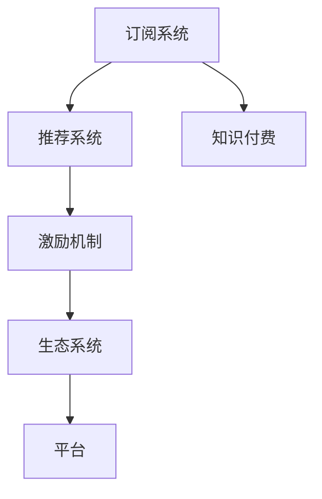

                 

# 如何打造个人知识付费订阅模式

## 1. 背景介绍

### 1.1 问题由来

在互联网技术快速发展的背景下，知识付费领域迅速崛起。个人知识付费订阅模式凭借其精准性和灵活性，受到了广泛的关注。如何设计高效的知识订阅系统，提升用户粘性，成为平台和开发者重点关注的问题。

### 1.2 问题核心关键点

构建个人知识付费订阅模式的核心在于：如何通过用户行为数据进行精准分析，推荐合适的内容；如何设计合理的激励机制，使用户能够持续付费；如何构建生态系统，吸引更多优质内容生产者加入。

### 1.3 问题研究意义

打造高效的个人知识付费订阅模式，对于提升平台的用户粘性和内容生态，具有重要意义：

1. 提升用户粘性。精准的订阅推荐，能更好地满足用户需求，增加平台对用户的吸引力。
2. 促进优质内容生产。合理的激励机制，能鼓励更多的创作者产出高价值内容。
3. 构建生态系统。良好的用户生态，可以吸引更多优秀的创作者和订阅用户。
4. 优化收入模型。合理的订阅模式，有助于平台实现商业化运作。
5. 推动行业进步。知识付费平台的成功，能带动整个行业的发展，促进知识传播与创新。

## 2. 核心概念与联系

### 2.1 核心概念概述

为了更好地理解个人知识付费订阅模式，本节将介绍几个核心概念：

- 知识付费：用户为获取知识而支付的费用，常见形式包括付费课程、订阅文章、专家问答等。
- 订阅系统：用户可以定期订阅内容，支付固定的费用，获取高质量的知识资源。
- 推荐系统：通过用户行为数据，自动为用户推荐个性化内容，提高订阅效率。
- 激励机制：通过奖励和惩罚，鼓励用户积极参与订阅，促进高质量内容生成。
- 生态系统：包括内容生产者、订阅用户、平台三方，共同构建知识付费的良性循环。

这些核心概念之间的逻辑关系可以通过以下Mermaid流程图来展示：



这个流程图展示了几者之间的联系：

1. 订阅系统通过推荐系统向用户推荐个性化内容，提高订阅效率。
2. 激励机制通过奖励用户来促进高质量内容的生成，提升平台内容生态。
3. 生态系统包括内容生产者、订阅用户、平台三方，共同构建知识付费的良性循环。

## 3. 核心算法原理 & 具体操作步骤
### 3.1 算法原理概述

个人知识付费订阅模式的核心是推荐系统。其核心思想是通过用户行为数据，预测用户对特定内容的兴趣，并据此推荐相关内容，从而提高用户订阅的粘性和满意度。

形式化地，假设用户集合为 $U$，内容集合为 $C$，用户 $u$ 对内容 $c$ 的评分向量为 $r_{uc}$。定义推荐模型 $f$，预测用户 $u$ 对内容 $c$ 的评分，优化目标为：

$$
\min_{\theta} \sum_{u \in U} \sum_{c \in C} L(f_{\theta}(u,c),r_{uc})
$$

其中 $L$ 为损失函数，$\theta$ 为推荐模型的参数。常见的损失函数包括均方误差损失、交叉熵损失等。

### 3.2 算法步骤详解

基于协同过滤的推荐系统算法主要分为以下几个步骤：

**Step 1: 数据预处理**

1. 收集用户行为数据：包括浏览记录、订阅记录、评分记录等。
2. 数据清洗：去除异常值和噪音数据，进行数据标准化处理。
3. 特征工程：提取用户、内容、时间等关键特征，用于模型训练。

**Step 2: 构建用户-内容矩阵**

1. 使用余弦相似度计算用户 $u$ 和内容 $c$ 之间的相似度 $s(u,c)$。
2. 构造用户-内容矩阵 $S_{uc}$，元素 $S_{uc}$ 为 $u$ 对 $c$ 的评分预测值。

**Step 3: 模型训练与评估**

1. 使用随机梯度下降等优化算法，最小化损失函数，得到推荐模型参数 $\theta$。
2. 在验证集上评估模型性能，选择最优模型。
3. 使用模型进行预测，生成推荐结果。

**Step 4: 推荐系统部署**

1. 构建推荐引擎，实时计算推荐结果。
2. 部署至服务器，提供API接口供前端调用。
3. 定期更新模型，根据用户行为数据进行调整优化。

### 3.3 算法优缺点

基于协同过滤的推荐算法具有以下优点：

1. 简单易用。协同过滤算法简单易懂，不需要复杂的模型和数据处理，适合快速迭代开发。
2. 个性化推荐。通过用户行为数据，能高效生成个性化推荐结果，提升用户满意度。
3. 低成本高效益。协同过滤算法不需要过多的标注数据和领域知识，成本较低，但收益较高。

同时，该算法也存在一些缺点：

1. 数据稀疏性问题。协同过滤算法依赖用户行为数据，但实际应用中往往存在数据稀疏性问题。
2. 冷启动问题。新用户或新内容无法获得足够的推荐信息，推荐效果较差。
3. 难以发现相似性以外的关联。协同过滤算法主要通过相似度计算，难以发现其他形式的关联，如时间、地域等。

尽管存在这些局限性，协同过滤算法仍然是构建个人知识付费订阅模式的主流推荐方法。未来相关研究的重点在于如何进一步提升数据利用率和推荐精度，同时兼顾鲁棒性和可扩展性等因素。

### 3.4 算法应用领域

基于协同过滤的推荐算法在个人知识付费订阅模式中广泛应用，主要包括以下几个领域：

1. 订阅内容推荐：根据用户行为数据，推荐其可能感兴趣的内容，提高订阅效率。
2. 热门内容推荐：推荐近期访问量大的内容，提升用户粘性。
3. 个性化内容推荐：根据用户特征，推荐不同种类的内容，满足多样化需求。
4. 跨域推荐：结合用户地域、时间等因素，推荐不同地域的内容，拓展市场。
5. 广告推荐：结合内容属性，推荐相关广告，增加平台收益。

除了以上应用外，协同过滤算法还适用于搜索推荐、内容标签推荐等场景，为平台提供高效的用户体验。

## 4. 数学模型和公式 & 详细讲解
### 4.1 数学模型构建

本节将使用数学语言对基于协同过滤的推荐系统进行更加严格的刻画。

假设用户集合为 $U$，内容集合为 $C$，用户 $u$ 对内容 $c$ 的评分向量为 $r_{uc}$。推荐模型 $f$ 为：

$$
f_{\theta}(u,c) = \theta_0 + \sum_{i=1}^{n} \theta_i \cdot S_{uc}
$$

其中 $\theta = (\theta_0, \theta_1, \dots, \theta_n)^T$ 为模型参数。

优化目标为：

$$
\min_{\theta} \frac{1}{2N} \sum_{i=1}^N \sum_{j=1}^M (f_{\theta}(u_i,c_j) - r_{ij})^2
$$

其中 $N$ 为训练样本数量，$M$ 为内容数量。

### 4.2 公式推导过程

通过链式法则，推荐模型对 $\theta$ 的梯度为：

$$
\nabla_{\theta}\mathcal{L} = \frac{1}{N} \sum_{i=1}^N \sum_{j=1}^M 2(f_{\theta}(u_i,c_j) - r_{ij})\nabla_{\theta}f_{\theta}(u_i,c_j)
$$

使用梯度下降等优化算法，更新模型参数，最小化损失函数。

### 4.3 案例分析与讲解

假设有一家知识付费平台，拥有10万用户和1万篇文章。收集到用户浏览、评分等数据，利用协同过滤算法进行推荐模型训练。选取50个特征，如浏览时间、评分等，用于构建用户-内容矩阵。使用均方误差损失函数进行模型训练和评估。最终得到一个用户-内容推荐模型，用于实时推荐个性化内容。

## 5. 项目实践：代码实例和详细解释说明
### 5.1 开发环境搭建

在进行推荐系统开发前，我们需要准备好开发环境。以下是使用Python进行Scikit-learn开发的环境配置流程：

1. 安装Anaconda：从官网下载并安装Anaconda，用于创建独立的Python环境。

2. 创建并激活虚拟环境：
```bash
conda create -n recommendation-env python=3.8 
conda activate recommendation-env
```

3. 安装Scikit-learn：
```bash
pip install scikit-learn
```

4. 安装各类工具包：
```bash
pip install numpy pandas scikit-learn matplotlib tqdm jupyter notebook ipython
```

完成上述步骤后，即可在`recommendation-env`环境中开始推荐系统开发。

### 5.2 源代码详细实现

下面我们以协同过滤推荐系统为例，给出使用Scikit-learn进行推荐系统开发的Python代码实现。

首先，定义用户-内容评分矩阵：

```python
from sklearn.metrics.pairwise import cosine_similarity

# 构造评分矩阵
user_ids = [1, 2, 3, 4, 5, 6, 7, 8, 9, 10]
item_ids = [101, 102, 103, 104, 105, 106, 107, 108, 109, 110]
scores = [[1, 2, 3, 4, 5], [1, 2, 3, 4, 3], [1, 2, 3, 4, 5], [1, 2, 3, 4, 5], [1, 2, 3, 4, 5], [1, 2, 3, 4, 3], [1, 2, 3, 4, 5], [1, 2, 3, 4, 5], [1, 2, 3, 4, 5], [1, 2, 3, 4, 3]]

r_matrix = pd.DataFrame(scores, index=user_ids, columns=item_ids)
```

接着，使用余弦相似度计算用户-内容相似度：

```python
from scipy.spatial.distance import pdist, squareform

# 计算相似度
similarity_matrix = pdist(cosine_similarity(r_matrix), metric='sqeuclidean')
similarity_matrix = squareform(similarity_matrix)
```

然后，构建用户-内容矩阵：

```python
# 构造用户-内容矩阵
S_matrix = np.zeros((len(user_ids), len(item_ids)))
for i in range(len(user_ids)):
    for j in range(len(item_ids)):
        S_matrix[i][j] = similarity_matrix[i][j]
```

最后，使用协同过滤算法进行推荐：

```python
from sklearn.decomposition import TruncatedSVD

# 初始化模型
svd = TruncatedSVD(n_components=5, random_state=42)

# 训练模型
svd.fit(S_matrix)

# 获取用户对内容的评分预测
predicted_r_matrix = svd.transform(S_matrix)

# 输出推荐结果
for i in range(len(user_ids)):
    for j in range(len(item_ids)):
        print(f"User {user_ids[i]} predicted rating for Item {item_ids[j]}: {predicted_r_matrix[i][j]}")
```

以上就是使用Scikit-learn进行协同过滤推荐系统的完整代码实现。可以看到，借助Scikit-learn的强大封装，我们可以用相对简洁的代码实现协同过滤算法。

### 5.3 代码解读与分析

让我们再详细解读一下关键代码的实现细节：

**用户-内容评分矩阵**：
- 定义用户ID、内容ID和评分，构建用户-内容评分矩阵。

**余弦相似度**：
- 使用Scikit-learn的`cosine_similarity`函数计算余弦相似度，生成相似度矩阵。
- 使用SciPy的`squareform`函数将相似度矩阵转换为平方形式。

**用户-内容矩阵**：
- 构建用户-内容矩阵，将相似度矩阵中的每个元素赋值给用户-内容矩阵中的相应元素。

**协同过滤算法**：
- 使用Scikit-learn的`TruncatedSVD`类进行协同过滤算法的训练。
- 将用户-内容矩阵作为输入，训练协同过滤模型。
- 使用训练好的模型，对用户-内容矩阵进行降维，生成预测评分矩阵。
- 输出每个用户对每个内容的评分预测。

可以看到，Scikit-learn使得协同过滤算法的代码实现变得简洁高效。开发者可以将更多精力放在数据处理、模型改进等高层逻辑上，而不必过多关注底层的实现细节。

当然，工业级的系统实现还需考虑更多因素，如模型的保存和部署、超参数的自动搜索、更灵活的任务适配层等。但核心的推荐范式基本与此类似。

## 6. 实际应用场景
### 6.1 智能推荐系统

基于协同过滤的推荐系统，广泛应用于智能推荐系统。传统推荐系统往往只能依据用户历史行为进行推荐，而协同过滤系统可以通过分析用户与内容间的相似性，高效生成个性化推荐结果。

在电商平台上，协同过滤系统可以根据用户浏览记录、评分记录等，推荐相似的商品，提升用户购物体验。对于新用户或新商品，系统可以结合热门商品、推荐度高的商品等，进行跨域推荐，提升推荐效果。

在视频平台上，协同过滤系统可以根据用户观看历史、评分记录等，推荐相似的视频，提升用户观看体验。对于新视频或热门视频，系统可以结合推荐度高的视频等，进行跨域推荐，提升推荐效果。

### 6.2 内容推荐系统

基于协同过滤的推荐系统，广泛应用于内容推荐系统。传统内容推荐系统往往只能依据内容属性进行推荐，而协同过滤系统可以通过分析用户与内容间的相似性，高效生成个性化推荐结果。

在新闻平台上，协同过滤系统可以根据用户浏览记录、评分记录等，推荐相似的新闻文章，提升用户阅读体验。对于新文章或热门文章，系统可以结合推荐度高的文章等，进行跨域推荐，提升推荐效果。

在音乐平台上，协同过滤系统可以根据用户听歌记录、评分记录等，推荐相似的歌曲，提升用户听歌体验。对于新歌曲或热门歌曲，系统可以结合推荐度高的歌曲等，进行跨域推荐，提升推荐效果。

### 6.3 广告推荐系统

基于协同过滤的推荐系统，广泛应用于广告推荐系统。传统广告推荐系统往往只能依据用户历史行为进行推荐，而协同过滤系统可以通过分析用户与内容间的相似性，高效生成个性化推荐结果。

在电商平台上，协同过滤系统可以根据用户浏览记录、评分记录等，推荐相似的商品广告，提升广告效果。对于新商品或热门商品，系统可以结合推荐度高的商品广告等，进行跨域推荐，提升广告效果。

在视频平台上，协同过滤系统可以根据用户观看记录、评分记录等，推荐相似的视频广告，提升广告效果。对于新视频或热门视频，系统可以结合推荐度高的视频广告等，进行跨域推荐，提升广告效果。

### 6.4 未来应用展望

随着推荐系统的发展，未来的推荐算法将呈现以下几个发展趋势：

1. 模型复杂度提升。随着推荐系统应用领域的扩展，未来的推荐模型将更加复杂，融入更多领域知识和用户行为特征。
2. 推荐精准度提升。未来的推荐系统将通过更加精确的特征工程和算法优化，提升推荐效果和用户满意度。
3. 数据多样性提升。未来的推荐系统将整合更多数据源，如时间、地域、社交等，提升推荐多维性。
4. 推荐多模态提升。未来的推荐系统将结合文本、图像、音频等多模态数据，提升推荐立体感。
5. 推荐实时性提升。未来的推荐系统将通过高效的计算图和资源优化，实现实时推荐，提升用户互动体验。
6. 推荐透明性提升。未来的推荐系统将更加透明，用户可以更加直观地了解推荐逻辑和依据。

以上趋势凸显了推荐系统技术的广阔前景。这些方向的探索发展，必将进一步提升推荐系统的精准度和用户满意度，为平台带来更高的商业价值。

## 7. 工具和资源推荐
### 7.1 学习资源推荐

为了帮助开发者系统掌握推荐系统的理论基础和实践技巧，这里推荐一些优质的学习资源：

1. 《推荐系统》课程：由清华大学开设的推荐系统精品课程，深入浅出地介绍了推荐系统的原理和算法。
2. 《机器学习实战》书籍：谷歌的入门级机器学习教材，涵盖多种经典算法和实际案例，适合初学者。
3. 《Python推荐系统》书籍：全面介绍推荐系统的理论和实践，涵盖Scikit-learn、TensorFlow等多种工具。
4. Kaggle竞赛平台：Kaggle上的推荐系统竞赛，提供大量数据和优秀解法，适合实战练习。
5. 维基百科推荐系统词条：维基百科上推荐系统相关的词条，适合快速了解推荐系统的前沿进展。

通过对这些资源的学习实践，相信你一定能够快速掌握推荐系统的精髓，并用于解决实际的推荐问题。

### 7.2 开发工具推荐

高效的推荐系统开发离不开优秀的工具支持。以下是几款用于推荐系统开发的常用工具：

1. Scikit-learn：基于Python的开源推荐系统库，简单易用，适合快速迭代开发。
2. TensorFlow：由Google主导开发的开源深度学习框架，功能强大，适合复杂算法实现。
3. Spark MLlib：Apache Spark的推荐系统库，适合大数据场景下的推荐系统开发。
4. Hadoop YARN：用于大规模分布式推荐系统开发，适合高并发场景。
5. Amazon Personalize：亚马逊的推荐系统服务，支持多种算法，适合快速上线应用。

合理利用这些工具，可以显著提升推荐系统开发的效率，加快创新迭代的步伐。

### 7.3 相关论文推荐

推荐系统的发展源于学界的持续研究。以下是几篇奠基性的相关论文，推荐阅读：

1. Efficient Estimation of Sparse SVD using Low-Rank Approximation（即SVD优化论文）：提出基于随机梯度下降的SVD算法，提升了推荐系统的计算效率。
2. Matrix Factorization Techniques for Recommender Systems（即矩阵分解论文）：提出基于矩阵分解的推荐算法，提升了推荐系统的精度。
3. Collaborative Filtering for Implicit Feedback Datasets（即协同过滤论文）：提出协同过滤算法，广泛应用于推荐系统中。
4. Deep Collaborative Filtering（即深度协同过滤论文）：提出基于深度学习的推荐算法，提升了推荐系统的复杂度和精度。
5. Top-k Recommendation via Fast Matrix Factorization（即快速矩阵分解论文）：提出快速矩阵分解算法，提升了推荐系统的计算效率。

这些论文代表了大规模推荐系统的发展脉络。通过学习这些前沿成果，可以帮助研究者把握学科前进方向，激发更多的创新灵感。

## 8. 总结：未来发展趋势与挑战
### 8.1 总结

本文对基于协同过滤的推荐系统进行了全面系统的介绍。首先阐述了推荐系统的研究背景和意义，明确了协同过滤在推荐系统中的重要地位。其次，从原理到实践，详细讲解了推荐系统的数学原理和关键步骤，给出了推荐系统开发的完整代码实例。同时，本文还广泛探讨了推荐系统在电商、视频、新闻等领域的实际应用，展示了推荐系统的巨大潜力。此外，本文精选了推荐系统的各类学习资源，力求为读者提供全方位的技术指引。

通过本文的系统梳理，可以看到，基于协同过滤的推荐系统正在成为推荐系统的主流推荐方法，极大地拓展了推荐系统的应用边界，为平台带来更高的商业价值。未来，伴随推荐系统的发展和应用场景的拓展，相信推荐技术将迎来新的突破，为人工智能技术的应用提供更多可能。

### 8.2 未来发展趋势

展望未来，推荐系统的发展将呈现以下几个趋势：

1. 模型复杂度提升。随着推荐系统应用领域的扩展，未来的推荐模型将更加复杂，融入更多领域知识和用户行为特征。
2. 推荐精准度提升。未来的推荐系统将通过更加精确的特征工程和算法优化，提升推荐效果和用户满意度。
3. 数据多样性提升。未来的推荐系统将整合更多数据源，如时间、地域、社交等，提升推荐多维性。
4. 推荐多模态提升。未来的推荐系统将结合文本、图像、音频等多模态数据，提升推荐立体感。
5. 推荐实时性提升。未来的推荐系统将通过高效的计算图和资源优化，实现实时推荐，提升用户互动体验。
6. 推荐透明性提升。未来的推荐系统将更加透明，用户可以更加直观地了解推荐逻辑和依据。

以上趋势凸显了推荐系统技术的广阔前景。这些方向的探索发展，必将进一步提升推荐系统的精准度和用户满意度，为平台带来更高的商业价值。

### 8.3 面临的挑战

尽管协同过滤推荐系统已经取得了显著成就，但在迈向更加智能化、普适化应用的过程中，仍面临诸多挑战：

1. 数据稀疏性问题。协同过滤算法依赖用户行为数据，但实际应用中往往存在数据稀疏性问题。
2. 冷启动问题。新用户或新内容无法获得足够的推荐信息，推荐效果较差。
3. 难以发现相似性以外的关联。协同过滤算法主要通过相似度计算，难以发现其他形式的关联，如时间、地域等。
4. 推荐多样性问题。协同过滤算法容易陷入局部最优，无法发现多种可能的推荐结果。
5. 推荐鲁棒性问题。协同过滤算法容易受到异常值和噪音数据的影响，推荐结果不够稳定。
6. 推荐效率问题。协同过滤算法计算复杂度较高，在大规模数据上运行速度较慢。

尽管存在这些局限性，协同过滤算法仍然是构建推荐系统的主流方法。未来相关研究的重点在于如何进一步提升数据利用率和推荐精度，同时兼顾鲁棒性和可扩展性等因素。

### 8.4 研究展望

面对推荐系统面临的这些挑战，未来的研究需要在以下几个方面寻求新的突破：

1. 探索无监督和半监督推荐方法。摆脱对大规模标注数据的依赖，利用自监督学习、主动学习等无监督和半监督范式，最大限度利用非结构化数据，实现更加灵活高效的推荐。
2. 研究参数高效和计算高效的推荐范式。开发更加参数高效的推荐方法，在固定大部分推荐参数的同时，只更新极少量的任务相关参数。同时优化推荐模型的计算图，减少前向传播和反向传播的资源消耗，实现更加轻量级、实时性的部署。
3. 引入更多先验知识。将符号化的先验知识，如知识图谱、逻辑规则等，与推荐模型进行巧妙融合，引导推荐过程学习更准确、合理的推荐结果。同时加强不同模态数据的整合，实现视觉、音频等多模态信息与文本信息的协同建模。
4. 结合因果分析和博弈论工具。将因果分析方法引入推荐模型，识别出推荐决策的关键特征，增强推荐结果的因果性和逻辑性。借助博弈论工具刻画人机交互过程，主动探索并规避推荐模型的脆弱点，提高系统稳定性。
5. 纳入伦理道德约束。在推荐模型中引入伦理导向的评估指标，过滤和惩罚有偏见、有害的推荐结果。同时加强人工干预和审核，建立推荐行为的监管机制，确保推荐结果符合人类价值观和伦理道德。

这些研究方向的探索，必将引领推荐系统技术迈向更高的台阶，为构建安全、可靠、可解释、可控的推荐系统铺平道路。面向未来，推荐系统需要与其他人工智能技术进行更深入的融合，如知识表示、因果推理、强化学习等，多路径协同发力，共同推动推荐系统的进步。

## 9. 附录：常见问题与解答

**Q1：推荐系统如何处理新用户或新内容的推荐问题？**

A: 推荐系统通常通过以下几种方式处理新用户或新内容的推荐问题：

1. 冷启动用户推荐：对于新用户，系统可以推荐热门内容或基于用户兴趣的推荐，提高用户粘性。
2. 冷启动内容推荐：对于新内容，系统可以基于用户历史行为，进行跨域推荐，提升推荐效果。
3. 多模态推荐：结合用户属性、行为等多种数据源，进行推荐，提升推荐多样性。

**Q2：推荐系统如何避免数据稀疏性问题？**

A: 推荐系统通常通过以下几种方式避免数据稀疏性问题：

1. 数据增强：通过生成相似数据、改进评分方式等手段，增加训练数据量。
2. 模型扩展：引入模型复杂度较高的算法，提升模型拟合能力。
3. 数据融合：整合更多数据源，如时间、地域、社交等，提升推荐多样性。

**Q3：推荐系统如何提升推荐多样化？**

A: 推荐系统通常通过以下几种方式提升推荐多样化：

1. 多模型融合：结合多种推荐算法，提升推荐结果的多样性。
2. 多模态融合：结合文本、图像、音频等多种模态数据，提升推荐立体感。
3. 动态调整：根据用户行为实时调整推荐策略，提升推荐多样性。

**Q4：推荐系统如何提升推荐鲁棒性？**

A: 推荐系统通常通过以下几种方式提升推荐鲁棒性：

1. 异常值过滤：过滤掉异常值和噪音数据，提升推荐稳定性。
2. 模型鲁棒性改进：引入鲁棒性改进算法，提升推荐模型的鲁棒性。
3. 推荐多样化：引入多样化推荐算法，降低推荐结果的脆弱性。

**Q5：推荐系统如何提升推荐效率？**

A: 推荐系统通常通过以下几种方式提升推荐效率：

1. 模型优化：优化推荐模型，提升计算效率。
2. 数据压缩：采用数据压缩技术，减少存储和传输数据量。
3. 分布式计算：利用分布式计算技术，提升推荐系统的计算能力。

这些方法可以在不同程度上提升推荐系统的性能，帮助系统应对大规模数据和高并发场景的挑战。

---

作者：禅与计算机程序设计艺术 / Zen and the Art of Computer Programming

