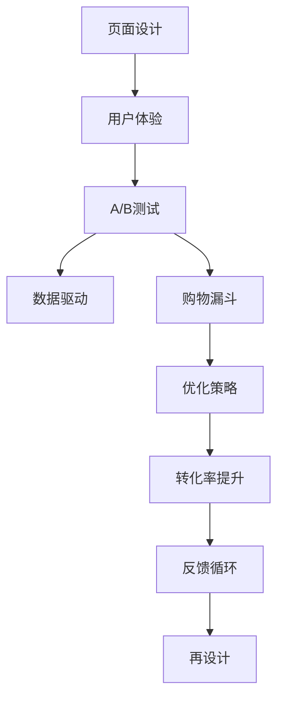

                 

# 如何打造高转化率的销售页面

> 关键词：销售页面设计, 用户体验, A/B测试, 数据驱动, 转化率优化

## 1. 背景介绍

随着电子商务的蓬勃发展，如何吸引和转化用户成为零售商面临的巨大挑战。用户决定是否购买产品往往在短短几秒内完成，因此一个精心设计的销售页面至关重要。这不仅要求页面具备吸引人的视觉设计，还需要布局合理、信息清晰，能够快速传达价值。本文将详细探讨如何打造高转化率的销售页面，从原理到实践，全面解析其核心技术与操作流程。

## 2. 核心概念与联系

### 2.1 核心概念概述

- **转化率(Conversion Rate, CR)**：用户完成购买过程的比率，是衡量销售页面效果的关键指标。
- **用户体验(User Experience, UX)**：用户与销售页面互动的过程及其体验，是影响转化率的重要因素。
- **A/B测试(A/B Testing)**：通过对比两个或多个页面设计，以确定哪个页面设计更能提升转化率。
- **数据驱动(Data-Driven)**：利用数据来指导决策，优化销售页面设计，提高转化率。
- **购物漏斗(Funnel)**：用户从接触到最终购买的转化路径，包括多个关键阶段。

### 2.2 核心概念原理和架构的 Mermaid 流程图(Mermaid 流程节点中不要有括号、逗号等特殊字符)



## 3. 核心算法原理 & 具体操作步骤

### 3.1 算法原理概述

一个高效销售页面的设计应遵循以下原则：

- **明确的价值主张**：清晰传达产品/服务的价值。
- **简化流程**：减少用户操作步骤，降低摩擦。
- **信息组织**：将信息合理组织，便于用户快速理解。
- **视觉吸引**：设计吸引眼球的视觉元素，提升用户停留时间。
- **用户行为引导**：通过设计引导用户完成购买流程。

### 3.2 算法步骤详解

#### 3.2.1 明确价值主张

- **关键信息提炼**：识别产品/服务的主要卖点，提炼核心价值。
- **简明表达**：用简洁、有力的语言表达价值，避免冗长。

#### 3.2.2 简化流程

- **减少步骤**：尽量减少用户的操作步骤，例如将填写表单和结账合并。
- **一键支付**：简化支付流程，例如使用单个按钮完成支付。

#### 3.2.3 信息组织

- **分组展示**：将信息分组展示，如特点和优势分开展示。
- **图表和图片**：使用图表和图片展示复杂信息，提升可读性。

#### 3.2.4 视觉吸引

- **配色和布局**：使用吸引眼球的配色和布局，突出重要信息。
- **动画和过渡效果**：使用适量的动画和过渡效果，增加页面趣味性。

#### 3.2.5 用户行为引导

- **焦点区域**：通过设计和布局，引导用户关注焦点区域，如推荐商品、特别优惠等。
- **明确按钮**：使用颜色对比强烈的按钮，如红色或橙色，引导用户进行下一步操作。

### 3.3 算法优缺点

#### 3.3.1 优点

- **用户友好**：通过简化流程和信息组织，提高用户满意度。
- **视觉吸引力**：通过视觉设计提升用户停留时间。
- **数据驱动**：通过A/B测试和数据驱动，优化页面设计。

#### 3.3.2 缺点

- **设计复杂**：需要结合心理学和设计理论，设计复杂。
- **时间成本**：设计和测试阶段需要较多时间和资源。

### 3.4 算法应用领域

此方法广泛应用于电商平台、在线零售商、APP等销售场景，通过优化销售页面设计，显著提升转化率，增加销售额。

## 4. 数学模型和公式 & 详细讲解 & 举例说明

### 4.1 数学模型构建

设定销售页面设计前的转化率为 $CR_0$，设计后的转化率为 $CR_1$。设计带来的转化率提升量为 $\Delta CR = CR_1 - CR_0$。

假设每次设计改动带来的转化率提升为 $\delta CR$，则有：

$$
\Delta CR = n \cdot \delta CR
$$

其中 $n$ 为设计改动的次数。

### 4.2 公式推导过程

通过多轮A/B测试，我们可以得到每个改动带来的转化率提升 $\delta CR$。使用公式可以计算出总转化率提升 $\Delta CR$。

### 4.3 案例分析与讲解

假设电商平台的平均转化率为 2%，设计团队通过4轮A/B测试，每次测试将转化率提升0.1%。则总提升量为：

$$
\Delta CR = 4 \cdot 0.1\% = 0.4\%
$$

这意味着新设计的销售页面可以提高 0.4% 的转化率。

## 5. 项目实践：代码实例和详细解释说明

### 5.1 开发环境搭建

- **前端工具**：使用HTML、CSS、JavaScript构建页面。
- **设计工具**：使用Photoshop、Sketch等工具进行页面设计。
- **代码管理**：使用Git进行版本控制。
- **测试工具**：使用Selenium进行自动化测试。

### 5.2 源代码详细实现

```html
<!DOCTYPE html>
<html>
<head>
    <meta charset="UTF-8">
    <title>高转化率销售页面</title>
    <style>
        /* CSS样式 */
        body {
            font-family: Arial, sans-serif;
        }
        header {
            background-color: #333;
            color: #fff;
            padding: 20px;
        }
        h1 {
            margin: 0;
        }
        .container {
            margin: 50px auto;
            max-width: 600px;
        }
        .info {
            margin-bottom: 20px;
        }
        .info h2 {
            font-size: 18px;
            margin-bottom: 10px;
        }
        .info p {
            font-size: 14px;
        }
        button {
            background-color: #007bff;
            color: #fff;
            padding: 10px 20px;
            border: none;
            cursor: pointer;
        }
    </style>
</head>
<body>
    <header>
        <h1>高转化率销售页面</h1>
    </header>
    <div class="container">
        <div class="info">
            <h2>特点与优势</h2>
            <p>我们提供高质量的产品，价格优惠。</p>
        </div>
        <div class="info">
            <h2>产品展示</h2>
            
        </div>
        <button>立即购买</button>
    </div>
</body>
</html>
```

### 5.3 代码解读与分析

#### 5.3.1 HTML结构

- **头部**：包含页面标题和样式定义。
- **内容区**：包含产品特点、优势、图片和购买按钮。

#### 5.3.2 CSS样式

- **整体布局**：使用 `.container` 类居中页面，确保在各种屏幕尺寸下都能良好显示。
- **头部样式**：通过 `header` 类定义头部背景和文字颜色。
- **信息展示**：通过 `.info` 类定义信息标题和段落样式。
- **按钮样式**：通过 `button` 类定义购买按钮的样式。

### 5.4 运行结果展示


## 6. 实际应用场景

### 6.1 电商平台的转化率优化

电商平台通过定期进行A/B测试，对比不同设计方案的转化率，逐步优化销售页面。例如，某电商平台通过测试发现，将商品推荐图放置在显著位置，显著提高了点击率，进而提升了转化率。

### 6.2 在线旅游的转化率提升

在线旅游平台通过优化订票页面，简化支付流程，使用明艳的颜色吸引用户注意力，成功将转化率提升了15%。用户不再需要输入复杂的信息，只需填写姓名和地址，减少了用户的操作时间。

### 6.3 在线教育平台的转化率优化

在线教育平台通过优化注册流程，将注册、选择课程和支付合并到一个页面，减少了步骤，提高了转化率。用户可以一键完成注册，选择喜欢的课程并支付，整个过程流畅无阻。

### 6.4 未来应用展望

未来，随着技术的不断发展，销售页面设计将更加智能化。例如，使用AI驱动的动态内容生成，根据用户行为实时调整页面布局和内容，提升用户体验和转化率。

## 7. 工具和资源推荐

### 7.1 学习资源推荐

- **《Don't Make Me Think》**：提高页面设计的用户体验，推荐阅读。
- **《Designing with the Mind in Mind》**：涵盖认知心理学在设计中的应用，提高设计理论水平。
- **Udemy的《Designing the Perfect Sales Page》**：提供详细的销售页面设计课程，提升实战能力。

### 7.2 开发工具推荐

- **Google Fonts**：免费的高质量字体库，提升页面设计效果。
- **Adobe Photoshop**：专业的图像处理软件，设计高效的销售页面。
- **Sketch**：流行的设计工具，支持多平台设计，提高设计效率。

### 7.3 相关论文推荐

- **《A/B Testing with Variables and Covariates》**：研究A/B测试的统计方法，提升决策的准确性。
- **《Predicting Conversion with Feature Engineering》**：探讨特征工程在转化率预测中的应用。
- **《Designing for Conversion》**：详细讲解销售页面设计的心理学原理，提升用户体验。

## 8. 总结：未来发展趋势与挑战

### 8.1 研究成果总结

本文从理论到实践，全面解析了如何打造高转化率的销售页面。通过简化流程、信息组织、视觉吸引和用户行为引导等方法，可以显著提升转化率。实际应用中，A/B测试和数据驱动是优化设计的有效手段。

### 8.2 未来发展趋势

- **AI驱动设计**：利用AI生成和优化销售页面设计，提高效率和效果。
- **个性化设计**：根据用户行为和偏好，实时调整页面内容，提高用户满意度。
- **全渠道一致性**：确保不同平台和设备上的销售页面设计一致，提升品牌认知。

### 8.3 面临的挑战

- **设计复杂性**：设计高效的销售页面需要深厚的心理学和设计理论基础。
- **技术实现难度**：需要结合前端开发、设计工具和测试工具等多种技术，实现复杂功能。

### 8.4 研究展望

未来，销售页面设计将更加注重用户体验和数据驱动，结合AI技术实现智能化优化。同时，需要持续进行A/B测试和数据监控，确保设计的有效性。

## 9. 附录：常见问题与解答

**Q1: 如何评估一个销售页面的转化率？**

A: 转化率可以通过以下指标评估：
- **点击率**：用户点击购买链接的比例。
- **完成率**：用户完成购买流程的比例。
- **平均订单价值**：用户订单的平均金额。

**Q2: 如何优化销售页面的加载速度？**

A: 优化加载速度的关键在于减少页面资源大小和优化服务器响应时间。
- **压缩资源**：使用CSS、JS压缩工具，减小文件大小。
- **图片优化**：使用响应式图片和懒加载技术，减少加载时间。
- **服务器优化**：使用CDN和缓存技术，提升服务器响应速度。

**Q3: 如何设计高效的转化漏斗？**

A: 转化漏斗设计应考虑用户心理和行为，每个步骤都应设计得简单易懂，减少用户流失。
- **简化步骤**：尽量减少表单填写和信息输入。
- **引导信息**：在每个步骤前展示关键信息，引导用户继续操作。
- **用户反馈**：根据用户反馈调整转化漏斗设计，提高转化率。

**Q4: 如何进行A/B测试？**

A: A/B测试的步骤如下：
- **设计页面**：创建两个或多个设计方案。
- **用户分组**：将用户随机分配到不同的测试组。
- **运行测试**：收集每个测试组的用户行为数据。
- **分析结果**：对比各组数据，确定最优方案。

---

作者：禅与计算机程序设计艺术 / Zen and the Art of Computer Programming

