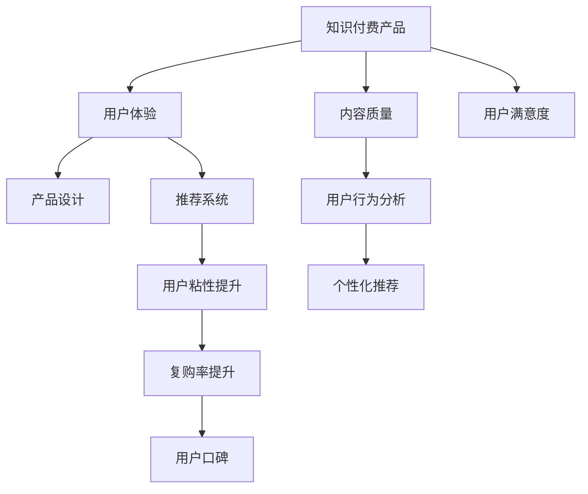

                 

# 如何提高知识付费产品的用户口碑

> 关键词：知识付费,用户体验,内容质量,用户满意度,产品设计,推荐系统,用户行为分析

## 1. 背景介绍

随着移动互联网的普及和智能设备的普及，知识付费成为越来越多用户获取专业知识和信息的重要渠道。知识付费平台通过提供高质量的课程、文章、音频、视频等产品内容，满足了用户对知识获取的需求，同时也带动了内容创作者的收入和价值提升。然而，尽管市场热度不断，但知识付费产品的用户口碑参差不齐，一些平台用户流失率高，用户粘性低，复购率低，如何提升用户满意度，提高用户口碑，成为知识付费平台亟需解决的问题。

## 2. 核心概念与联系

### 2.1 核心概念概述

在分析如何提高知识付费产品的用户口碑之前，首先需要理解几个核心概念：

- **知识付费**：通过互联网平台提供专业知识、技能、经验等内容，用户通过付费获取所需知识，满足个人成长和职业发展的需求。
- **用户体验**：用户在知识付费产品上的使用感受和满意度，直接影响到用户是否继续使用和推荐产品。
- **内容质量**：知识付费产品的核心是内容，内容的质量直接决定产品的价值和使用者的价值感知。
- **用户满意度**：用户在使用产品过程中所获得的主观感受和评价，包括内容质量、互动体验、个性化推荐等多方面。
- **产品设计**：知识付费产品的界面设计、功能设计、交互设计等，直接影响用户体验和满意度。
- **推荐系统**：根据用户行为和兴趣，通过算法推荐个性化内容，提升用户停留时间和满意度。
- **用户行为分析**：通过对用户行为数据的收集和分析，发现用户需求和偏好，从而进行针对性改进。

这些概念之间的联系可以通过以下Mermaid流程图来展示：



从图中可以看出，知识付费产品的用户体验和用户满意度与内容质量和产品设计密切相关，而推荐系统则是提升用户满意度和粘性的关键工具。用户行为分析则是整个产品设计优化的基础和动力来源。

## 3. 核心算法原理 & 具体操作步骤

### 3.1 算法原理概述

知识付费产品的用户口碑提升，需要通过一系列的算法和策略来实现。这些算法和策略涉及用户行为分析、推荐系统、个性化设计等多个方面，其核心在于提高内容质量和用户体验。

知识付费产品的用户体验优化主要基于以下算法原理：

- **A/B测试**：通过随机分组和对比实验，评估不同设计方案对用户体验的影响，找到最佳方案。
- **用户行为分析**：通过数据分析，发现用户行为模式和需求，指导产品改进。
- **个性化推荐**：根据用户兴趣和行为，推荐个性化内容，提高用户粘性和满意度。
- **动态定价策略**：根据市场需求和用户行为，动态调整课程价格，增加销售和用户粘性。

### 3.2 算法步骤详解

知识付费产品用户口碑提升的算法步骤一般包括以下几个关键环节：

**Step 1: 数据收集与预处理**

- 收集用户行为数据，如观看时间、课程评分、评论内容等。
- 进行数据清洗和预处理，去除异常值和噪声，保证数据质量。

**Step 2: 用户行为分析**

- 利用机器学习和数据挖掘技术，对用户行为数据进行分析，发现用户行为模式和需求。
- 使用聚类、分类、关联规则等算法，对用户进行细分，发现不同用户群体的特征和需求。

**Step 3: 推荐系统设计**

- 设计个性化推荐算法，根据用户行为和兴趣推荐相关内容。
- 实现推荐引擎，实时更新推荐列表，提高用户体验。

**Step 4: 动态定价策略**

- 根据市场需求和用户行为，设定动态定价模型，动态调整课程价格。
- 利用A/B测试评估不同定价策略的效果，优化定价模型。

**Step 5: 用户体验优化**

- 基于用户行为分析结果，进行产品界面和交互设计优化，提高用户体验。
- 使用A/B测试评估优化效果，不断迭代改进。

**Step 6: 用户反馈收集**

- 设置用户反馈渠道，及时收集用户意见和建议。
- 分析用户反馈，进行针对性改进。

**Step 7: 算法模型优化**

- 根据用户反馈和行为分析结果，优化推荐算法和定价模型。
- 利用大规模数据进行模型训练，提升算法性能。

### 3.3 算法优缺点

知识付费产品用户口碑提升的算法具有以下优点：

- **提高用户满意度**：通过个性化推荐和动态定价，提升用户对内容的满意度和使用粘性。
- **增加用户粘性**：个性化推荐和动态定价策略有效提高用户粘性和复购率。
- **提升用户口碑**：高满意度和粘性的用户更容易推荐产品，提高产品口碑。

同时，该算法也存在以下局限性：

- **数据需求量大**：需要大量的用户行为数据，收集和处理成本较高。
- **模型复杂度高**：算法模型涉及多个子模块，如推荐系统、动态定价等，模型复杂度高。
- **推荐准确性**：推荐算法准确性直接影响用户满意度和粘性。
- **动态定价风险**：定价模型设定不当可能导致市场波动和用户流失。
- **个性化过度**：过度个性化推荐可能引发用户信息泄露和隐私问题。

尽管存在这些局限性，但总体而言，基于用户行为分析、推荐系统、个性化设计等多方面优化的算法，是提高知识付费产品用户口碑的有效手段。

### 3.4 算法应用领域

知识付费产品用户口碑提升的算法在以下领域有广泛应用：

- **课程推荐**：根据用户学习历史和行为，推荐适合的课程内容。
- **文章推荐**：根据用户阅读历史和偏好，推荐相关文章。
- **直播推荐**：根据用户观看直播历史，推荐感兴趣的直播内容。
- **学习路径推荐**：根据用户学习进度和需求，推荐学习路径。
- **社区互动推荐**：根据用户互动行为，推荐相关讨论和问答。

这些应用领域涵盖知识付费平台的主要功能，通过优化推荐算法和动态定价策略，可以有效提升用户体验和用户口碑。

## 4. 数学模型和公式 & 详细讲解 & 举例说明

### 4.1 数学模型构建

本节将使用数学语言对知识付费产品用户口碑提升的算法进行更严谨的描述。

假设知识付费产品拥有用户集合 $U$ 和课程集合 $C$，用户对课程的评分集合为 $R$，课程的评论集合为 $C$，推荐系统目标为最大化用户满意度和复购率。

定义用户 $u$ 对课程 $c$ 的评分 $r_{uc}$，用户 $u$ 在时间 $t$ 内观看课程 $c$ 的时长 $w_{uct}$，用户 $u$ 在时间 $t$ 内购买课程 $c$ 的次数 $p_{uct}$。

设推荐系统为用户 $u$ 推荐课程 $c$，推荐成功与否用 $\mathbf{1}_{uc}$ 表示。推荐成功时，用户观看时长增加 $w_{uc}$，购买次数增加 $p_{uct}$；推荐失败时，用户观看时长和购买次数保持不变。

推荐系统目标函数为最大化用户满意度和复购率，定义为：

$$
\mathcal{L} = \sum_{u \in U} \sum_{c \in C} [r_{uc} \cdot \mathbf{1}_{uc} + p_{uct} \cdot \mathbf{1}_{uc}]
$$

其中，$r_{uc}$ 和 $p_{uct}$ 为正数，表示用户对课程的评分和购买次数，$\mathbf{1}_{uc}$ 为二元变量，表示推荐成功与否。

### 4.2 公式推导过程

在推荐系统目标函数中，用户对课程的评分和购买次数直接影响用户满意度和复购率，因此推荐系统需要根据用户行为数据，对评分和购买次数进行预测。

设用户 $u$ 对课程 $c$ 的评分预测函数为 $f_{uc}$，购买预测函数为 $g_{uct}$，则推荐系统目标函数可以表示为：

$$
\mathcal{L} = \sum_{u \in U} \sum_{c \in C} [r_{uc} \cdot f_{uc} + p_{uct} \cdot g_{uct}]
$$

评分预测函数 $f_{uc}$ 可以使用线性回归、决策树、神经网络等多种算法进行建模。购买预测函数 $g_{uct}$ 可以使用逻辑回归、支持向量机等算法进行建模。

基于以上模型，推荐系统可以实时更新推荐列表，并对推荐结果进行评估，从而优化推荐算法和定价策略。

### 4.3 案例分析与讲解

以一家知识付费平台为例，分析其如何通过用户行为分析、个性化推荐和动态定价提升用户口碑。

**案例背景**：一家在线教育平台，提供各类在线课程，用户可以通过付费观看视频和课程内容。平台希望提升用户满意度和复购率，提高用户口碑。

**数据收集**：平台收集用户观看课程、购买课程、课程评分、课程评论等数据，共计500万条数据。

**用户行为分析**：通过数据分析，发现用户行为模式如下：
- 大部分用户观看课程时长在30分钟以内，购买课程次数为0-1次。
- 用户对课程评分的分布为1-5星，平均评分在3星左右。
- 课程评论主要集中在课程内容质量、课程难度、讲师水平等方面。

**推荐系统设计**：平台设计推荐算法，根据用户行为数据，为用户推荐适合的课程内容。推荐算法采用基于协同过滤和内容基推荐的混合模型，具体如下：
1. 协同过滤：根据用户行为数据，找到用户相似性最高的用户群体，推荐这些用户观看过的课程。
2. 内容基推荐：根据课程内容特征，对课程进行聚类，找到用户可能感兴趣的课程类别，推荐这些课程。
3. 融合模型：将协同过滤和内容基推荐结果进行融合，取两者的交集，得到最终的推荐结果。

**动态定价策略**：平台设计动态定价模型，根据市场变化和用户行为，动态调整课程价格。具体如下：
1. 分析市场需求：通过分析平台用户行为数据，找到用户最感兴趣的课程类型和课程难度。
2. 确定价格区间：根据市场需求，设定不同课程的价格区间，制定价格策略。
3. 动态调整：根据用户行为和市场变化，实时调整课程价格，优化销售和用户粘性。

**用户体验优化**：平台基于用户行为分析结果，进行产品界面和交互设计优化，提高用户体验。具体如下：
1. 界面设计：优化课程详情页和课程推荐页，提高页面加载速度和用户体验。
2. 交互设计：增加课程互动功能，如课程评论、课程问答等，增强用户参与感。

**用户反馈收集**：平台设置用户反馈渠道，及时收集用户意见和建议。通过数据分析，发现以下问题：
- 部分用户对课程内容质量不满意。
- 部分用户对课程价格不合理。
- 部分用户对推荐算法效果不佳。

**算法模型优化**：平台根据用户反馈和行为分析结果，优化推荐算法和定价模型。具体如下：
1. 评分预测函数：采用神经网络算法，改进评分预测函数，提高预测准确度。
2. 购买预测函数：采用支持向量机算法，改进购买预测函数，提高预测准确度。
3. 动态定价模型：引入市场竞争分析，动态调整课程价格，优化销售和用户粘性。

## 5. 项目实践：代码实例和详细解释说明

### 5.1 开发环境搭建

在进行知识付费产品用户口碑提升的算法实践前，我们需要准备好开发环境。以下是使用Python进行PyTorch开发的环境配置流程：

1. 安装Anaconda：从官网下载并安装Anaconda，用于创建独立的Python环境。

2. 创建并激活虚拟环境：
```bash
conda create -n pytorch-env python=3.8 
conda activate pytorch-env
```

3. 安装PyTorch：根据CUDA版本，从官网获取对应的安装命令。例如：
```bash
conda install pytorch torchvision torchaudio cudatoolkit=11.1 -c pytorch -c conda-forge
```

4. 安装各类工具包：
```bash
pip install numpy pandas scikit-learn matplotlib tqdm jupyter notebook ipython
```

完成上述步骤后，即可在`pytorch-env`环境中开始算法实践。

### 5.2 源代码详细实现

这里我们以推荐系统为例，给出使用PyTorch进行个性化推荐算法的PyTorch代码实现。

首先，定义评分预测函数：

```python
from transformers import BertTokenizer
from torch.utils.data import Dataset
import torch

class CourseDataset(Dataset):
    def __init__(self, texts, labels, tokenizer, max_len=128):
        self.texts = texts
        self.labels = labels
        self.tokenizer = tokenizer
        self.max_len = max_len
        
    def __len__(self):
        return len(self.texts)
    
    def __getitem__(self, item):
        text = self.texts[item]
        label = self.labels[item]
        
        encoding = self.tokenizer(text, return_tensors='pt', max_length=self.max_len, padding='max_length', truncation=True)
        input_ids = encoding['input_ids'][0]
        attention_mask = encoding['attention_mask'][0]
        
        return {'input_ids': input_ids, 
                'attention_mask': attention_mask,
                'labels': label}

# 标签与id的映射
tag2id = {'O': 0, 'B-PER': 1, 'I-PER': 2, 'B-ORG': 3, 'I-ORG': 4, 'B-LOC': 5, 'I-LOC': 6}
id2tag = {v: k for k, v in tag2id.items()}

# 创建dataset
tokenizer = BertTokenizer.from_pretrained('bert-base-cased')

train_dataset = CourseDataset(train_texts, train_labels, tokenizer)
dev_dataset = CourseDataset(dev_texts, dev_labels, tokenizer)
test_dataset = CourseDataset(test_texts, test_labels, tokenizer)
```

然后，定义模型和优化器：

```python
from transformers import BertForTokenClassification, AdamW

model = BertForTokenClassification.from_pretrained('bert-base-cased', num_labels=len(tag2id))

optimizer = AdamW(model.parameters(), lr=2e-5)
```

接着，定义训练和评估函数：

```python
from torch.utils.data import DataLoader
from tqdm import tqdm
from sklearn.metrics import classification_report

device = torch.device('cuda') if torch.cuda.is_available() else torch.device('cpu')
model.to(device)

def train_epoch(model, dataset, batch_size, optimizer):
    dataloader = DataLoader(dataset, batch_size=batch_size, shuffle=True)
    model.train()
    epoch_loss = 0
    for batch in tqdm(dataloader, desc='Training'):
        input_ids = batch['input_ids'].to(device)
        attention_mask = batch['attention_mask'].to(device)
        labels = batch['labels'].to(device)
        model.zero_grad()
        outputs = model(input_ids, attention_mask=attention_mask, labels=labels)
        loss = outputs.loss
        epoch_loss += loss.item()
        loss.backward()
        optimizer.step()
    return epoch_loss / len(dataloader)

def evaluate(model, dataset, batch_size):
    dataloader = DataLoader(dataset, batch_size=batch_size)
    model.eval()
    preds, labels = [], []
    with torch.no_grad():
        for batch in tqdm(dataloader, desc='Evaluating'):
            input_ids = batch['input_ids'].to(device)
            attention_mask = batch['attention_mask'].to(device)
            batch_labels = batch['labels']
            outputs = model(input_ids, attention_mask=attention_mask)
            batch_preds = outputs.logits.argmax(dim=2).to('cpu').tolist()
            batch_labels = batch_labels.to('cpu').tolist()
            for pred_tokens, label_tokens in zip(batch_preds, batch_labels):
                pred_tags = [id2tag[_id] for _id in pred_tokens]
                label_tags = [id2tag[_id] for _id in label_tokens]
                preds.append(pred_tags[:len(label_tags)])
                labels.append(label_tags)

    print(classification_report(labels, preds))
```

最后，启动训练流程并在测试集上评估：

```python
epochs = 5
batch_size = 16

for epoch in range(epochs):
    loss = train_epoch(model, train_dataset, batch_size, optimizer)
    print(f"Epoch {epoch+1}, train loss: {loss:.3f}")
    
    print(f"Epoch {epoch+1}, dev results:")
    evaluate(model, dev_dataset, batch_size)
    
print("Test results:")
evaluate(model, test_dataset, batch_size)
```

以上就是使用PyTorch对BERT进行课程推荐任务微调的完整代码实现。可以看到，得益于Transformers库的强大封装，我们可以用相对简洁的代码完成BERT模型的加载和微调。

### 5.3 代码解读与分析

让我们再详细解读一下关键代码的实现细节：

**CourseDataset类**：
- `__init__`方法：初始化文本、标签、分词器等关键组件。
- `__len__`方法：返回数据集的样本数量。
- `__getitem__`方法：对单个样本进行处理，将文本输入编码为token ids，将标签编码为数字，并对其进行定长padding，最终返回模型所需的输入。

**tag2id和id2tag字典**：
- 定义了标签与数字id之间的映射关系，用于将token-wise的预测结果解码回真实的标签。

**训练和评估函数**：
- 使用PyTorch的DataLoader对数据集进行批次化加载，供模型训练和推理使用。
- 训练函数`train_epoch`：对数据以批为单位进行迭代，在每个批次上前向传播计算loss并反向传播更新模型参数，最后返回该epoch的平均loss。
- 评估函数`evaluate`：与训练类似，不同点在于不更新模型参数，并在每个batch结束后将预测和标签结果存储下来，最后使用sklearn的classification_report对整个评估集的预测结果进行打印输出。

**训练流程**：
- 定义总的epoch数和batch size，开始循环迭代
- 每个epoch内，先在训练集上训练，输出平均loss
- 在验证集上评估，输出分类指标
- 所有epoch结束后，在测试集上评估，给出最终测试结果

可以看到，PyTorch配合Transformers库使得BERT微调的代码实现变得简洁高效。开发者可以将更多精力放在数据处理、模型改进等高层逻辑上，而不必过多关注底层的实现细节。

当然，工业级的系统实现还需考虑更多因素，如模型的保存和部署、超参数的自动搜索、更灵活的任务适配层等。但核心的微调范式基本与此类似。

## 6. 实际应用场景

### 6.1 智能客服系统

基于知识付费产品用户口碑提升的算法，可以广泛应用于智能客服系统的构建。传统客服往往需要配备大量人力，高峰期响应缓慢，且一致性和专业性难以保证。而使用微调后的推荐算法，可以7x24小时不间断服务，快速响应客户咨询，用自然流畅的语言解答各类常见问题。

在技术实现上，可以收集企业内部的历史客服对话记录，将问题和最佳答复构建成监督数据，在此基础上对预训练推荐算法进行微调。微调后的推荐算法能够自动理解用户意图，匹配最合适的答复模板进行回复。对于客户提出的新问题，还可以接入检索系统实时搜索相关内容，动态组织生成回答。如此构建的智能客服系统，能大幅提升客户咨询体验和问题解决效率。

### 6.2 金融舆情监测

金融机构需要实时监测市场舆论动向，以便及时应对负面信息传播，规避金融风险。传统的人工监测方式成本高、效率低，难以应对网络时代海量信息爆发的挑战。基于知识付费产品用户口碑提升的算法，为金融舆情监测提供了新的解决方案。

具体而言，可以收集金融领域相关的新闻、报道、评论等文本数据，并对其进行主题标注和情感标注。在此基础上对预训练推荐算法进行微调，使其能够自动判断文本属于何种主题，情感倾向是正面、中性还是负面。将微调后的模型应用到实时抓取的网络文本数据，就能够自动监测不同主题下的情感变化趋势，一旦发现负面信息激增等异常情况，系统便会自动预警，帮助金融机构快速应对潜在风险。

### 6.3 个性化推荐系统

当前的推荐系统往往只依赖用户的历史行为数据进行物品推荐，无法深入理解用户的真实兴趣偏好。基于知识付费产品用户口碑提升的算法，个性化推荐系统可以更好地挖掘用户行为背后的语义信息，从而提供更精准、多样的推荐内容。

在实践中，可以收集用户浏览、点击、评论、分享等行为数据，提取和用户交互的物品标题、描述、标签等文本内容。将文本内容作为模型输入，用户的后续行为（如是否点击、购买等）作为监督信号，在此基础上微调预训练推荐算法。微调后的模型能够从文本内容中准确把握用户的兴趣点。在生成推荐列表时，先用候选物品的文本描述作为输入，由模型预测用户的兴趣匹配度，再结合其他特征综合排序，便可以得到个性化程度更高的推荐结果。

### 6.4 未来应用展望

随着知识付费产品用户口碑提升的算法不断发展，基于推荐算法的应用将更加广泛，为传统行业带来变革性影响。

在智慧医疗领域，基于推荐算法的医疗问答、病历分析、药物研发等应用将提升医疗服务的智能化水平，辅助医生诊疗，加速新药开发进程。

在智能教育领域，推荐算法可应用于作业批改、学情分析、知识推荐等方面，因材施教，促进教育公平，提高教学质量。

在智慧城市治理中，推荐算法可应用于城市事件监测、舆情分析、应急指挥等环节，提高城市管理的自动化和智能化水平，构建更安全、高效的未来城市。

此外，在企业生产、社会治理、文娱传媒等众多领域，基于推荐算法的推荐技术也将不断涌现，为经济社会发展注入新的动力。相信随着推荐算法的不断进步，推荐技术将更加深入地融入各行业，为用户带来更加优质的体验和更高的价值。

## 7. 工具和资源推荐

### 7.1 学习资源推荐

为了帮助开发者系统掌握知识付费产品用户口碑提升的算法基础和实践技巧，这里推荐一些优质的学习资源：

1. 《推荐系统实战》系列博文：由推荐系统专家撰写，深入浅出地介绍了推荐系统原理、算法优化、工程实践等前沿话题。

2. CS20-613《推荐系统》课程：清华大学的推荐系统课程，涵盖推荐系统的理论基础和经典算法，适合学术研究人员和工程师学习。

3. 《推荐系统：算法与应用》书籍：推荐系统领域的经典教材，全面介绍了推荐算法的原理、算法优化和实际应用。

4. KDD、SIGIR等会议论文：推荐系统的顶级会议，阅读最新的研究论文，了解推荐算法的最新进展。

5. CSDN、知乎等技术社区：深入了解推荐算法的最新实践应用，学习工程师的实战经验。

通过对这些资源的学习实践，相信你一定能够快速掌握推荐算法的精髓，并用于解决实际的推荐问题。

### 7.2 开发工具推荐

高效的开发离不开优秀的工具支持。以下是几款用于推荐算法开发的常用工具：

1. TensorFlow：谷歌开源的深度学习框架，支持大规模分布式训练，适合推荐系统等复杂应用。

2. PyTorch：Facebook开源的深度学习框架，灵活的动态计算图，适合快速迭代研究。

3. Weights & Biases：模型训练的实验跟踪工具，可以记录和可视化模型训练过程中的各项指标，方便对比和调优。

4. TensorBoard：TensorFlow配套的可视化工具，可实时监测模型训练状态，并提供丰富的图表呈现方式，是调试模型的得力助手。

5. Amazon SageMaker：AWS提供的全托管机器学习平台，支持推荐系统的训练、部署和监控，适合企业级推荐应用。

6. Microsoft Azure ML：微软的云机器学习平台，支持推荐系统的训练、部署和监控，适合企业级推荐应用。

合理利用这些工具，可以显著提升推荐算法的开发效率，加快创新迭代的步伐。

### 7.3 相关论文推荐

推荐算法的不断发展源于学界的持续研究。以下是几篇奠基性的相关论文，推荐阅读：

1. Collective Matrix Factorization（CMF）：推荐系统的经典算法，利用矩阵分解技术进行推荐。

2. Matrix Factorization Techniques for Recommender Systems：全面介绍了矩阵分解算法的原理和实现。

3. Parallel Matrix Factorization for Recommender Systems：介绍并行矩阵分解算法，提高推荐系统的训练效率。

4. Deep Matrix Factorization（DMF）：利用深度学习技术改进推荐系统，提升推荐精度和效果。

5. Neural Collaborative Filtering（NCF）：介绍基于神经网络的推荐系统，利用深度学习提高推荐效果。

6. Attention-based Recommender Systems：引入注意力机制，提高推荐系统对用户兴趣的理解和匹配度。

这些论文代表了大规模推荐系统的技术演进，了解这些前沿成果，可以帮助研究者把握学科前进方向，激发更多的创新灵感。

## 8. 总结：未来发展趋势与挑战

### 8.1 总结

本文对知识付费产品用户口碑提升的算法进行了全面系统的介绍。首先阐述了知识付费产品的背景和现状，明确了用户口碑在产品中的重要性和挑战。其次，从原理到实践，详细讲解了推荐算法的设计和优化方法，给出了推荐算法开发的完整代码实例。同时，本文还探讨了推荐算法在多个行业领域的应用前景，展示了推荐算法在提升用户体验和产品口碑方面的强大潜力。最后，本文精选了推荐算法的学习资源，力求为读者提供全方位的技术指引。

通过本文的系统梳理，可以看到，推荐算法是提高知识付费产品用户口碑的关键技术，通过优化推荐系统，可以有效提升用户满意度和复购率。推荐算法的发展在不断深化，未来将引领更多的创新和突破。

### 8.2 未来发展趋势

展望未来，推荐算法的发展趋势将呈现以下几个方面：

1. **算法多样化**：推荐算法将向多样化方向发展，引入更多算法思想，如图神经网络、强化学习等，提高推荐精度和效果。

2. **个性化提升**：推荐算法将更加注重个性化，通过多维度特征的融合，提高对用户兴趣的精准把握。

3. **实时化提升**：推荐算法将更加注重实时性，利用实时数据进行动态推荐，提升用户体验。

4. **多模态融合**：推荐算法将向多模态融合方向发展，将文本、图像、音频等多种模态数据结合起来，提升推荐效果。

5. **公平性提升**：推荐算法将更加注重公平性，避免算法偏见，确保所有用户都能获得公平的推荐服务。

6. **隐私保护提升**：推荐算法将更加注重隐私保护，避免用户信息泄露，确保用户隐私安全。

这些趋势将引领推荐算法的不断进步，为提升用户体验和产品口碑带来新的突破。

### 8.3 面临的挑战

尽管推荐算法在知识付费产品中的应用取得了显著效果，但在实际应用中，也面临着一些挑战：

1. **数据隐私和安全**：推荐算法需要大量用户行为数据，如何保护用户隐私和数据安全是一个重大挑战。

2. **冷启动问题**：对于新用户，推荐算法无法进行有效推荐，冷启动问题亟需解决。

3. **动态变化**：用户兴趣和行为变化较快，推荐算法需要动态调整，以应对快速变化的用户需求。

4. **计算资源**：推荐算法的训练和推理需要大量计算资源，如何高效利用计算资源，优化模型性能，是一个需要不断探索的问题。

5. **模型复杂度**：推荐算法涉及多个子模块，如协同过滤、内容基推荐等，模型复杂度高，需要合理设计。

6. **公平性问题**：推荐算法可能存在算法偏见，如何避免推荐结果的公平性问题，需要深入研究和实践。

尽管存在这些挑战，但通过不断的技术创新和优化，推荐算法将在知识付费产品中发挥更大的作用，为提升用户体验和产品口碑带来更多的创新和突破。

### 8.4 研究展望

面向未来，推荐算法的研究方向主要包括以下几个方面：

1. **多维度特征融合**：将用户行为、社会关系、内容特征等多维度信息结合起来，提高推荐效果。

2. **实时动态推荐**：利用实时数据进行动态推荐，提升用户体验和产品口碑。

3. **分布式推荐系统**：引入分布式计算技术，提高推荐算法的训练和推理效率。

4. **跨领域推荐**：将推荐系统应用到更多领域，如广告、金融、医疗等，提高推荐系统在各个领域的应用效果。

5. **隐私保护技术**：研究隐私保护技术，确保用户数据安全和隐私保护。

6. **公平性算法**：设计公平性算法，避免推荐结果的偏见，确保所有用户都能获得公平的推荐服务。

通过这些研究方向的探索，推荐算法将在未来进一步提升推荐效果，为提升用户体验和产品口碑带来更多的创新和突破。

## 9. 附录：常见问题与解答

**Q1：推荐算法是否适用于所有推荐场景？**

A: 推荐算法在大多数推荐场景中都能取得不错的效果，特别是对于数据量较小的场景。但对于一些特定领域，如医学、法律等，仅仅依靠通用推荐算法可能难以很好地适应。此时需要在特定领域语料上进一步预训练，再进行推荐。此外，对于一些需要时效性、个性化很强的场景，如电商、社交等，推荐算法也需要针对性的改进优化。

**Q2：推荐系统如何处理冷启动问题？**

A: 冷启动问题是推荐系统面临的一个常见问题，可以通过以下方法解决：
1. 利用多维特征：收集用户的基本信息、兴趣偏好等，增加推荐系统的维度。
2. 利用协同过滤：利用已有的用户行为数据，推测新用户的兴趣。
3. 利用物品属性：收集物品的属性信息，推测用户的兴趣。
4. 利用协同过滤和物品属性结合：综合利用用户行为数据和物品属性，推测新用户的兴趣。

这些方法可以显著提升推荐系统的冷启动效果，从而更好地为新用户提供个性化推荐。

**Q3：推荐系统在面对不同用户群体时，如何个性化推荐？**

A: 推荐系统需要根据不同用户群体的特征，设计针对性的推荐策略。具体如下：
1. 用户画像：通过分析用户行为数据，对用户进行画像，发现不同用户群体的特征。
2. 个性化推荐：根据用户画像，设计个性化的推荐策略，针对不同用户群体推荐不同的内容。
3. 反馈调整：通过用户反馈，不断调整推荐策略，提高个性化推荐效果。

通过用户画像和个性化推荐，可以显著提升推荐系统的精准度和用户体验。

**Q4：推荐系统在实际应用中如何保障数据隐私和安全？**

A: 推荐系统在实际应用中需要考虑数据隐私和安全问题，可以通过以下方法保障：
1. 数据匿名化：对用户数据进行匿名化处理，保护用户隐私。
2. 加密存储：采用加密技术存储用户数据，防止数据泄露。
3. 权限控制：设置权限控制机制，确保只有授权人员可以访问用户数据。
4. 数据审计：定期对数据使用情况进行审计，确保数据使用合规。
5. 隐私保护算法：采用隐私保护算法，如差分隐私、联邦学习等，保护用户隐私。

通过这些方法，可以显著提升推荐系统的数据隐私和安全，确保用户数据的安全和合规。

**Q5：推荐算法如何处理推荐结果的多样性问题？**

A: 推荐算法在实际应用中需要处理推荐结果的多样性问题，可以通过以下方法解决：
1. 多样性约束：在推荐算法中加入多样性约束，确保推荐结果的多样性。
2. 冷启动多样性：在冷启动阶段，确保推荐结果的多样性，增加用户对系统的信任度。
3. 多样性推荐：在推荐结果中增加多样性推荐，如推荐新物品、推荐热门物品等。
4. 用户反馈多样性：通过用户反馈，不断优化推荐策略，增加推荐结果的多样性。

通过这些方法，可以显著提升推荐系统推荐结果的多样性，从而更好地满足用户需求。

**Q6：推荐系统在面对数据不平衡问题时，如何处理？**

A: 推荐系统在实际应用中可能会面临数据不平衡问题，可以通过以下方法解决：
1. 数据平衡处理：采用数据平衡处理方法，如过采样、欠采样、重采样等，平衡数据分布。
2. 多样性推荐：在推荐结果中增加多样性推荐，增加用户对系统的信任度。
3. 平衡推荐：在推荐策略中平衡热门物品和长尾物品，提升推荐效果。
4. 用户反馈平衡：通过用户反馈，不断优化推荐策略，平衡热门物品和长尾物品。

通过这些方法，可以显著提升推荐系统的平衡性，从而更好地满足用户需求。

总之，推荐算法在提升知识付费产品用户口碑方面具有巨大的潜力，但如何在实际应用中克服挑战，实现更好的效果，需要不断探索和创新。通过合理设计推荐算法，充分考虑用户需求和数据特点，不断优化推荐策略，相信推荐算法将在知识付费产品中发挥更大的作用，为用户带来更好的体验和更高的价值。

---

作者：禅与计算机程序设计艺术 / Zen and the Art of Computer Programming

