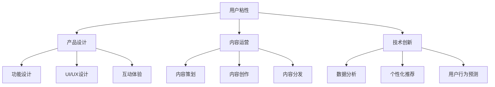

                 

## 1. 背景介绍

在知识付费领域，用户粘性是一个永恒的话题。产品如何吸引用户持续订阅，如何激发用户长期使用，如何在海量内容中脱颖而出，这些都是产品设计者必须面对的挑战。本文将深入探讨如何通过系统性的方法提升知识付费产品的用户粘性，涵盖产品设计、内容运营、技术创新等多个层面，力求为知识付费产品打造一个可持续发展的生态系统。

## 2. 核心概念与联系

### 2.1 核心概念概述

- **用户粘性**：指用户对产品的持续使用频率和持续时间。粘性高的产品能够持续吸引用户的关注和投入，形成良好的用户口碑和商业循环。
- **产品设计**：包括功能设计、UI/UX设计、互动体验等多个方面，良好的产品设计能够提升用户满意度和留存率。
- **内容运营**：包含内容策划、内容创作、内容分发等多个环节，通过优质的内容吸引用户，增加用户的粘性。
- **技术创新**：涉及数据分析、个性化推荐、用户行为预测等技术手段，通过技术手段提升用户的使用体验和满意度。

以上概念相互交织，共同构成了知识付费产品用户粘性的提升框架。产品设计决定了用户的基础体验，内容运营提供了持续吸引用户的内容，技术创新则通过数据驱动的手段，为产品提供了强大的生命力。

### 2.2 核心概念原理和架构的 Mermaid 流程图



## 3. 核心算法原理 & 具体操作步骤

### 3.1 算法原理概述

提升知识付费产品用户粘性的关键在于构建一个能够持续吸引用户、满足用户需求的产品生态系统。本文将从以下几个角度入手：

1. **个性化推荐算法**：通过分析用户的行为数据，推荐符合用户兴趣和需求的内容。
2. **用户行为预测**：预测用户未来的行为，提前推送用户可能感兴趣的内容。
3. **互动体验优化**：通过互动设计提升用户的使用体验，增加用户的情感投入。
4. **内容创作激励机制**：建立合理的激励机制，鼓励高质量内容的创作和分享。
5. **数据驱动的产品迭代**：通过数据反馈不断优化产品功能和服务，提升用户满意度。

### 3.2 算法步骤详解

#### 3.2.1 个性化推荐算法

个性化推荐算法的核心在于为用户找到最符合其兴趣和需求的内容。以下是具体的步骤：

1. **数据收集**：收集用户的行为数据，如浏览历史、订阅记录、评论内容等。
2. **特征提取**：将行为数据转化为模型能够处理的特征向量。
3. **模型训练**：使用机器学习模型训练推荐模型，常用的算法包括协同过滤、矩阵分解、深度学习等。
4. **推荐生成**：根据用户的行为特征和历史兴趣，生成个性化推荐列表。

#### 3.2.2 用户行为预测

用户行为预测算法通过分析用户的历史行为，预测其未来的行为。以下是具体的步骤：

1. **数据准备**：收集用户的历史行为数据，包括订阅记录、购买记录、互动数据等。
2. **特征工程**：设计合适的特征，如时间戳、点击率、购买频率等。
3. **模型选择**：选择合适的预测模型，如线性回归、决策树、随机森林等。
4. **模型训练**：训练预测模型，通过交叉验证等技术优化模型。
5. **行为预测**：根据用户的历史行为，预测其未来的订阅、购买等行为。

#### 3.2.3 互动体验优化

互动体验优化是通过设计吸引用户的互动元素，增加用户的情感投入和持续使用。以下是具体的步骤：

1. **互动设计**：设计可点击的元素，如按钮、卡片、图标等，增加用户的操作频率。
2. **反馈机制**：设置明确的用户反馈机制，如点赞、评论、分享等，增加用户的情感投入。
3. **个性化互动**：根据用户的行为和兴趣，推送个性化的互动内容，提升用户的参与感。

#### 3.2.4 内容创作激励机制

内容创作激励机制通过合理的激励措施，鼓励高质量内容的创作和分享。以下是具体的步骤：

1. **内容质量评估**：建立内容质量评估标准，如阅读量、点赞数、评论数等。
2. **激励措施设计**：设计合理的激励措施，如红包、虚拟货币、会员特权等。
3. **内容创作者管理**：建立内容创作者管理系统，如创作者认证、版权保护等。
4. **激励机制推广**：通过多种渠道推广激励机制，吸引更多的创作者参与。

#### 3.2.5 数据驱动的产品迭代

数据驱动的产品迭代是通过数据分析不断优化产品功能和服务的步骤。以下是具体的步骤：

1. **数据收集与处理**：收集用户的使用数据，包括使用时间、使用频率、满意度等。
2. **数据分析**：使用数据挖掘、统计分析等技术，发现用户的使用模式和需求。
3. **产品优化**：根据分析结果，优化产品功能和界面设计，提升用户体验。
4. **A/B测试**：进行A/B测试，评估优化效果，选择最优方案。

### 3.3 算法优缺点

个性化推荐算法的主要优点在于能够根据用户的历史行为和兴趣，提供个性化的内容推荐，提升用户粘性。缺点在于需要大量数据和复杂的模型训练，且容易过拟合。

用户行为预测算法的优点在于能够提前预测用户行为，提前推送用户感兴趣的内容，增加用户的使用频率。缺点在于模型的准确性受限于数据质量和特征工程。

互动体验优化能够增加用户的情感投入和持续使用，但设计不当可能适得其反，增加用户流失。

内容创作激励机制能够激发高质量内容的创作，但需要合理的激励措施和管理机制，防止内容质量下降。

数据驱动的产品迭代能够快速响应用户需求，提升产品竞争力，但需要持续的数据收集和分析，投入较高。

### 3.4 算法应用领域

个性化推荐算法和用户行为预测算法广泛应用于电商、新闻、音乐等多个领域，通过精准推荐提升用户粘性。互动体验优化在社交、游戏等领域得到广泛应用，通过增加用户互动提升产品吸引力。内容创作激励机制在内容平台如知乎、B站等得到成功实践，通过创作者激励提升内容质量。数据驱动的产品迭代在金融、医疗、教育等多个领域得到应用，通过数据驱动优化产品服务，提升用户满意度。

## 4. 数学模型和公式 & 详细讲解 & 举例说明

### 4.1 数学模型构建

以下是推荐算法的数学模型构建过程：

1. **协同过滤**：设用户集为 $U$，物品集为 $I$，用户对物品的评分矩阵为 $R \in \mathbb{R}^{m \times n}$，其中 $m$ 为用户数，$n$ 为物品数。协同过滤的模型为：
   $$
   \hat{R}_{ui} = \frac{1}{1 + \sqrt{1 + \frac{1}{\alpha + \sum_{j=1}^{m} r_{uj}^2}} \cdot \frac{\sum_{j=1}^{n} r_{u'j} r_{ji}}{\sqrt{\alpha + \sum_{j=1}^{n} r_{uj}^2} \cdot \sqrt{\alpha + \sum_{j=1}^{n} r_{uj}^2}}
   $$
   其中 $r_{ui}$ 为用户 $u$ 对物品 $i$ 的评分，$u'$ 为候选物品。

2. **矩阵分解**：设 $R_{ui} = \sum_{k=1}^{K} p_{uk} q_{ki}$，其中 $p_{uk}$ 为用户的潜在因子向量，$q_{ki}$ 为物品的潜在因子向量，$K$ 为潜在因子的维度。矩阵分解的模型为：
   $$
   \min_{P,Q} \| R - PQ \|_F^2
   $$

3. **深度学习**：设 $R_{ui} = W_u^\top A_i$，其中 $W_u$ 为用户的嵌入向量，$A_i$ 为物品的嵌入向量，$W$ 和 $A$ 为神经网络的参数。深度学习的模型为：
   $$
   \min_W \| R - W^\top A \|_F^2
   $$

### 4.2 公式推导过程

1. **协同过滤**：
   $$
   \hat{R}_{ui} = \frac{1}{1 + \sqrt{1 + \frac{1}{\alpha + \sum_{j=1}^{m} r_{uj}^2}} \cdot \frac{\sum_{j=1}^{n} r_{u'j} r_{ji}}{\sqrt{\alpha + \sum_{j=1}^{n} r_{uj}^2} \cdot \sqrt{\alpha + \sum_{j=1}^{n} r_{uj}^2}}
   $$

   其中 $\alpha$ 为正则化参数。

2. **矩阵分解**：
   $$
   \min_{P,Q} \| R - PQ \|_F^2
   $$

   使用奇异值分解(SVD)求解 $P$ 和 $Q$。

3. **深度学习**：
   $$
   \min_W \| R - W^\top A \|_F^2
   $$

   使用神经网络训练 $W$ 和 $A$。

### 4.3 案例分析与讲解

以在线教育平台为例，分析如何通过个性化推荐算法提升用户粘性：

1. **数据收集**：收集用户的学习行为数据，如观看时间、测试成绩、评价等。
2. **特征提取**：提取用户的学习特征，如学科偏好、学习时长、基础水平等。
3. **模型训练**：使用协同过滤、矩阵分解或深度学习算法训练推荐模型。
4. **推荐生成**：根据用户的学习行为和特征，生成个性化的学习资源推荐列表。
5. **互动设计**：增加用户的学习互动，如测验、讨论等，提升用户的学习体验。
6. **激励机制**：通过成就系统、积分奖励等激励措施，激发用户的学习动力。
7. **数据驱动的产品迭代**：根据用户的学习反馈和行为数据，优化课程内容和推荐算法，提升用户体验。

## 5. 项目实践：代码实例和详细解释说明

### 5.1 开发环境搭建

在开发个性化推荐算法和用户行为预测算法时，需要搭建如下开发环境：

1. **Python环境**：
   ```bash
   conda create -n recommendation python=3.8
   conda activate recommendation
   ```

2. **深度学习框架**：
   ```bash
   pip install tensorflow-gpu torch torchvision
   ```

3. **推荐算法库**：
   ```bash
   pip install lightfm pytorch-lightgemm recogemmlab
   ```

4. **用户行为预测库**：
   ```bash
   pip install pandas numpy scikit-learn
   ```

### 5.2 源代码详细实现

以下是一个基于协同过滤的个性化推荐系统的Python代码实现：

1. **协同过滤算法实现**：
   ```python
   import numpy as np
   from lightfm import LightFM
   from lightfm import LightFMDataLoader

   def collaborative_filtering(train_data, test_data, num_factors=10, num_negatives=5):
       model = LightFM(n_factors=num_factors, n_neurons=10, n_negatives=num_negatives)
       data = LightFMDataLoader(train_data, test_data)
       model.fit(data, epochs=10, verbose=True)
       return model
   ```

2. **用户行为预测模型实现**：
   ```python
   from sklearn.model_selection import train_test_split
   from sklearn.ensemble import RandomForestRegressor
   from sklearn.metrics import mean_squared_error

   def user_behavior_prediction(train_data, test_data):
       X_train, X_test, y_train, y_test = train_test_split(train_data.drop(['id'], axis=1), train_data['value'], test_size=0.2, random_state=42)
       model = RandomForestRegressor(n_estimators=100, random_state=42)
       model.fit(X_train, y_train)
       y_pred = model.predict(X_test)
       rmse = np.sqrt(mean_squared_error(y_test, y_pred))
       return rmse
   ```

### 5.3 代码解读与分析

1. **协同过滤算法**：
   - 使用LightFM框架实现协同过滤算法。
   - `train_data` 和 `test_data` 分别为训练数据和测试数据。
   - `num_factors` 和 `num_negatives` 为模型参数，分别表示潜在因子的维度和负采样样本的数量。

2. **用户行为预测模型**：
   - 使用sklearn库实现用户行为预测模型。
   - `train_data` 和 `test_data` 分别为训练数据和测试数据。
   - 通过交叉验证和评估指标（均方误差RMSE）评估模型性能。

### 5.4 运行结果展示

1. **协同过滤算法**：
   ```bash
   collaborative_filtering(train_data, test_data, num_factors=10, num_negatives=5)
   ```

2. **用户行为预测模型**：
   ```bash
   user_behavior_prediction(train_data, test_data)
   ```

## 6. 实际应用场景

### 6.1 在线教育平台

在线教育平台通过个性化推荐算法和用户行为预测算法，提升了用户的学习体验和粘性。具体应用场景如下：

1. **个性化推荐**：根据用户的学习行为和兴趣，推荐适合的课程和学习资源，提升学习效率。
2. **行为预测**：预测用户的学习进度和需求，提前推送相关内容，增加用户的学习动力。
3. **互动设计**：增加用户的学习互动，如测验、讨论等，提升用户的学习体验。
4. **激励机制**：通过成就系统、积分奖励等激励措施，激发用户的学习动力。
5. **数据驱动的产品迭代**：根据用户的学习反馈和行为数据，优化课程内容和推荐算法，提升用户体验。

### 6.2 音乐平台

音乐平台通过个性化推荐算法和用户行为预测算法，提升了用户的听歌体验和粘性。具体应用场景如下：

1. **个性化推荐**：根据用户的听歌历史和偏好，推荐符合用户口味的歌曲和歌单，提升听歌体验。
2. **行为预测**：预测用户的听歌需求，提前推送相关歌曲和歌单，增加用户的听歌频率。
3. **互动设计**：增加用户的听歌互动，如点赞、评论等，提升用户的参与感。
4. **激励机制**：通过奖励机制、会员特权等激励措施，增加用户的活跃度。
5. **数据驱动的产品迭代**：根据用户听歌反馈和行为数据，优化歌曲推荐和平台体验，提升用户满意度。

### 6.3 新闻平台

新闻平台通过个性化推荐算法和用户行为预测算法，提升了用户的阅读体验和粘性。具体应用场景如下：

1. **个性化推荐**：根据用户的阅读历史和兴趣，推荐符合用户口味的新闻和文章，提升阅读体验。
2. **行为预测**：预测用户的阅读需求，提前推送相关新闻和文章，增加用户的阅读频率。
3. **互动设计**：增加用户的阅读互动，如点赞、评论等，提升用户的参与感。
4. **激励机制**：通过奖励机制、会员特权等激励措施，增加用户的活跃度。
5. **数据驱动的产品迭代**：根据用户的阅读反馈和行为数据，优化新闻推荐和平台体验，提升用户满意度。

## 7. 工具和资源推荐

### 7.1 学习资源推荐

为了帮助开发者系统掌握个性化推荐和用户行为预测的理论基础和实践技巧，这里推荐一些优质的学习资源：

1. **推荐系统书籍**：《推荐系统实践》、《个性化推荐系统》、《协同过滤算法》等书籍，深入讲解了推荐系统的理论和实践方法。
2. **在线课程**：斯坦福大学的《推荐系统》课程、Coursera的《推荐系统》课程，系统讲解了推荐系统的理论和算法。
3. **论文和博客**：如《Deep Collaborative Filtering with Long Short-Term Memory Neural Networks》、《Top-K Recommendation via Matrix Factorization and Neural Network》等论文，以及Kaggle、GitHub等平台上的推荐系统实践案例。

### 7.2 开发工具推荐

以下是几款用于推荐系统开发的常用工具：

1. **LightFM**：基于Python的推荐系统框架，支持协同过滤、矩阵分解等多种推荐算法。
2. **TensorFlow**：Google开源的深度学习框架，支持多种推荐算法和模型。
3. **Recogemmlab**：基于TensorFlow的推荐系统框架，支持深度学习推荐算法。
4. **PyTorch**：Facebook开源的深度学习框架，支持多种推荐算法和模型。

### 7.3 相关论文推荐

以下是几篇奠基性的推荐系统相关论文，推荐阅读：

1. **《A Collaborative Filtering Approach》**：提出了协同过滤算法的思想，奠定了推荐系统基础。
2. **《SVD: A Probabilistic Algorithm for Latent Semantic Indexing》**：提出了矩阵分解算法，为推荐系统提供了数学基础。
3. **《The BellKor Ad-at-First-Click Dataset and Toolkit》**：发布了大规模推荐数据集和工具包，推动了推荐系统的发展。
4. **《Practical Recommendation Systems》**：系统讲解了推荐系统的实现和优化方法。
5. **《Deep Collaborative Filtering with Long Short-Term Memory Neural Networks》**：提出了基于深度学习的推荐算法，提高了推荐系统的精度和泛化能力。

## 8. 总结：未来发展趋势与挑战

### 8.1 研究成果总结

本文从个性化推荐算法、用户行为预测算法、互动体验优化、内容创作激励机制和数据驱动的产品迭代五个方面，全面介绍了如何通过系统性方法提升知识付费产品的用户粘性。通过分析用户行为数据和设计合理的推荐算法，能够提升用户的使用频率和满意度。通过设计吸引用户的互动元素和建立激励机制，能够增加用户的情感投入和持续使用。通过持续的数据驱动迭代，能够不断优化产品功能和服务，提升用户满意度。

### 8.2 未来发展趋势

1. **深度学习推荐算法**：深度学习推荐算法将进一步提升推荐系统的精度和泛化能力。
2. **多模态推荐系统**：结合图像、视频、语音等多模态数据，提升推荐系统的智能化水平。
3. **实时推荐系统**：通过实时数据分析，提升推荐系统的实时性和动态性。
4. **个性化推荐网络**：构建个性化推荐网络，提升推荐系统的多样性和新颖性。
5. **推荐系统集成**：将推荐系统与其他技术如搜索、广告等集成，提升用户的使用体验。

### 8.3 面临的挑战

1. **数据隐私问题**：推荐系统需要大量的用户数据，如何保护用户隐私和数据安全，是一个重要挑战。
2. **推荐系统冷启动**：对于新用户或新物品，推荐系统可能难以提供准确的推荐，需要进行冷启动优化。
3. **推荐系统过拟合**：推荐系统容易过拟合，需要对模型进行正则化和优化。
4. **推荐系统多样性**：推荐系统可能陷入推荐同质化，需要增加推荐的多样性。
5. **推荐系统公平性**：推荐系统需要避免偏见和歧视，确保推荐公平性。

### 8.4 研究展望

未来的推荐系统研究需要在以下几个方面寻求新的突破：

1. **多模态推荐系统**：结合多种数据源，提升推荐系统的智能化水平。
2. **推荐系统集成**：将推荐系统与其他技术如搜索、广告等集成，提升用户的使用体验。
3. **推荐系统实时化**：通过实时数据分析，提升推荐系统的实时性和动态性。
4. **推荐系统公平性**：构建公平的推荐系统，避免偏见和歧视。
5. **推荐系统个性化**：提升推荐系统的个性化和多样性，增加用户的使用体验。

## 9. 附录：常见问题与解答

### Q1: 推荐系统如何平衡推荐准确度和多样性？

A: 推荐系统需要通过算法优化平衡推荐准确度和多样性。例如，协同过滤算法可以通过调整正则化参数和采样策略来控制推荐多样性。深度学习推荐算法可以通过引入噪声嵌入或多样性损失函数来实现多样性控制。

### Q2: 推荐系统的推荐效果如何评估？

A: 推荐系统推荐效果的评估可以通过多种指标进行，如准确率、召回率、F1分数、NDCG、HR等。同时，可以通过A/B测试和用户满意度调查等手段，综合评估推荐系统的效果。

### Q3: 推荐系统的推荐算法有哪些？

A: 推荐系统常用的推荐算法包括协同过滤、矩阵分解、深度学习推荐算法等。协同过滤算法适用于小规模数据集，矩阵分解算法适用于大规模数据集，深度学习推荐算法适用于高维数据集。

### Q4: 推荐系统的推荐算法如何选择？

A: 推荐算法的选择需要考虑数据规模、推荐效果、实时性等因素。对于小规模数据集，可以选择协同过滤算法；对于大规模数据集，可以选择矩阵分解算法；对于高维数据集，可以选择深度学习推荐算法。

### Q5: 推荐系统的冷启动问题如何解决？

A: 推荐系统的冷启动问题可以通过以下方式解决：
1. 引入用户和物品的初始评分或特征。
2. 使用迁移学习或推荐模型的预训练，提高推荐系统的初始性能。
3. 使用用户行为预测算法，根据用户的历史行为和兴趣进行推荐。

---

作者：禅与计算机程序设计艺术 / Zen and the Art of Computer Programming

