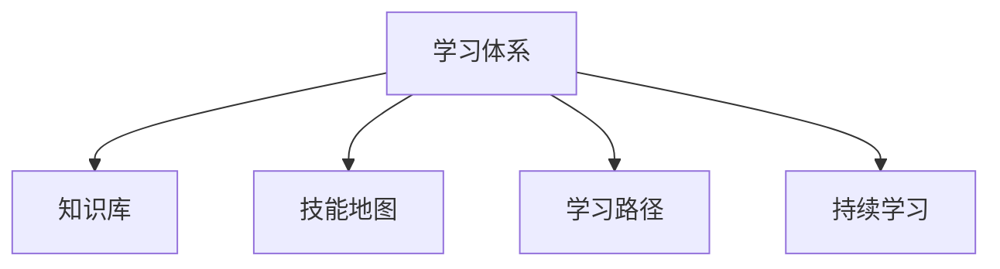

                 

# 学习体系：VUCA时代的重要技能

在当今这个快速变化的商业环境中，企业所面临的环境充满不确定性（VUCA: Volatile, Uncertain, Complex, and Ambiguous）。在这样的背景下，构建一个动态、灵活、适应性强且高效的学习体系成为了企业成功的关键。本文将深入探讨VUCA时代构建学习体系的重要性、核心概念、实施步骤以及未来展望，为组织和个人提供一套实用的技能框架，帮助其在不断变化的环境中保持竞争优势。

## 1. 背景介绍

### 1.1 问题由来
随着技术进步和市场需求的变化，企业所面临的环境变得日益复杂和不确定。传统基于经验的学习模式已无法适应快速变化的商业环境。为了在VUCA时代保持竞争优势，企业亟需构建一个灵活、高效的学习体系，以快速响应市场变化和新技术。

### 1.2 问题核心关键点
构建一个有效学习体系的关键在于理解VUCA环境的特性，并据此设计出适应性强、灵活可调整的学习框架。具体来说，需要：
- 定义明确的学习目标和关键能力
- 构建动态的知识库和技能地图
- 推动跨部门的知识共享和协作
- 提供高效的学习工具和资源
- 持续评估和学习效果并及时调整

## 2. 核心概念与联系

### 2.1 核心概念概述

为更好地理解VUCA时代的学习体系，本节将介绍几个密切相关的核心概念：

- **学习体系（Learning System）**：指通过系统化的设计和管理，旨在提升组织成员的知识和技能，使其能够适应VUCA环境的结构和方法。
- **知识库（Knowledge Base）**：包含组织内各类知识、技能和最佳实践的集合，是学习体系的核心资源。
- **技能地图（Skill Map）**：将组织的各类岗位、角色及其所需的关键能力进行映射和可视化，帮助识别知识空白和改进点。
- **学习路径（Learning Path）**：为员工设计的系统化学习计划，帮助其从当前水平逐步提升至目标水平。
- **持续学习（Continuous Learning）**：强调在动态环境中不断学习和适应的理念，鼓励员工持续更新知识，提升技能。

这些核心概念之间的逻辑关系可以通过以下Mermaid流程图来展示：



这个流程图展示出了学习体系的几个关键组成部分及其之间的关系：

1. **学习体系**：通过知识库、技能地图和学习路径的构建和维护，推动持续学习。
2. **知识库**：为学习体系提供核心资源，支持学习和知识共享。
3. **技能地图**：提供技能提升的指引，帮助识别知识空白和改进点。
4. **学习路径**：指导员工从当前水平逐步提升至目标水平，提供系统化的学习指导。
5. **持续学习**：强调在动态环境中不断学习和适应的理念，推动学习体系的高效运行。

这些概念共同构成了VUCA时代学习体系的基础，使其能够有效地响应市场变化和技术进步，提升组织的整体竞争力和创新能力。

## 3. 核心算法原理 & 具体操作步骤

### 3.1 算法原理概述

VUCA时代的学习体系构建，本质上是一个系统化的知识获取和技能提升过程。其核心思想是通过系统化的设计和管理，帮助员工从当前水平逐步提升至目标水平。这一过程可以概括为以下几个关键步骤：

1. **需求分析**：根据企业战略和市场需求，分析出关键岗位和角色所需的关键能力。
2. **知识采集和分类**：从内部和外部多种渠道采集相关知识，进行分类和整理。
3. **技能映射和评估**：将岗位角色所需的关键能力映射到知识库中，进行评估和优化。
4. **路径设计和实施**：设计出系统化的学习路径，指导员工逐步提升所需能力。
5. **持续评估和反馈**：通过定期评估和反馈，持续改进学习体系，确保其有效性和适应性。

### 3.2 算法步骤详解

以下将详细讲解构建VUCA时代学习体系的具体步骤：

**Step 1: 需求分析**
- 明确企业战略和市场需求，分析关键岗位和角色所需的关键能力。
- 与业务部门和专家进行访谈，收集岗位技能需求和痛点。
- 根据岗位需求，确定关键技能和知识类型。

**Step 2: 知识采集和分类**
- 从企业内部和外部多种渠道（如内部文档、网络资源、专家访谈等）采集相关知识。
- 对采集的知识进行分类和整理，建立结构化的知识库。
- 使用标签和分类体系，使知识更加易于检索和应用。

**Step 3: 技能映射和评估**
- 将岗位所需的关键能力映射到知识库中，形成技能地图。
- 使用技能评估工具，对现有员工的技能水平进行评估。
- 识别技能差距和改进点，制定改进计划。

**Step 4: 路径设计和实施**
- 根据技能地图和员工评估结果，设计出个性化的学习路径。
- 将学习路径分解为多个阶段和任务，明确每个阶段的学习目标和所需资源。
- 提供灵活的学习资源和工具，支持员工完成学习路径。

**Step 5: 持续评估和反馈**
- 定期对学习路径和知识库进行评估，确保其有效性和适应性。
- 通过员工反馈和评估结果，不断优化学习体系。
- 引入新技术和新知识，持续改进学习体系。

### 3.3 算法优缺点

VUCA时代的学习体系具有以下优点：
1. 系统化设计：通过需求分析、知识采集、技能映射等步骤，系统化地构建学习体系。
2. 灵活适应：根据市场变化和新技术，动态调整学习路径和知识库。
3. 高效实施：通过定制化学习路径和资源，提升员工学习效率。
4. 持续改进：定期评估和反馈，确保学习体系的有效性和适应性。

同时，该体系也存在一定的局限性：
1. 初始投入大：需要投入大量时间和资源进行需求分析和知识采集。
2. 实施难度高：需要跨部门协作，设计复杂的流程和工具。
3. 效果难以量化：难以量化学习体系对业务的影响和效果。

尽管存在这些局限性，但就目前而言，系统化的学习体系是企业在VUCA时代保持竞争优势的重要手段。未来相关研究的重点在于如何进一步降低初始投入，提高实施效率，同时兼顾效果评估和量化。

### 3.4 算法应用领域

VUCA时代的学习体系在各类企业中的应用非常广泛，具体如下：

- **技术公司**：通过学习体系不断提升员工的技术能力和创新能力，保持技术领先。
- **金融企业**：通过学习体系提升员工的市场洞察力和风险管理能力，支持金融创新和风险控制。
- **医疗健康**：通过学习体系提升医护人员的知识和技能，提供高质量的医疗服务。
- **制造企业**：通过学习体系提升员工的工艺技能和质量管理能力，推动制造过程的优化和创新。
- **教育机构**：通过学习体系提升教师的教学能力和学生的学习能力，提升教育质量。

除了上述这些领域外，VUCA时代的学习体系还在更多行业得到广泛应用，为组织提供了一个高效的知识获取和技能提升框架。

## 4. 数学模型和公式 & 详细讲解  
### 4.1 数学模型构建

为了更好地理解VUCA时代学习体系的设计原理，本节将使用数学语言对学习体系构建过程进行更加严格的刻画。

假设一个企业有 $N$ 个关键岗位，每个岗位有 $K$ 个关键技能，技能需求矩阵为 $A_{N\times K}$。设知识库中有 $M$ 种知识类型，每种知识类型包含 $L$ 个知识点，知识库矩阵为 $B_{M\times L}$。设员工当前技能水平为 $S_{N\times K}$，目标技能水平为 $T_{N\times K}$。则构建学习体系的目标是找到一个映射函数 $F$，使得：

$$
F(S_{N\times K}, B_{M\times L}) = T_{N\times K}
$$

其中 $F$ 表示通过知识库 $B_{M\times L}$ 映射到目标技能水平 $T_{N\times K}$ 的函数。

### 4.2 公式推导过程

以下我们以员工技能提升为例，推导学习路径的设计过程。

设员工当前技能水平为 $S$，目标技能水平为 $T$，知识库中包含 $M$ 种知识类型 $B$。学习路径的设计目标是通过学习 $B$ 中的知识，将 $S$ 提升至 $T$。

首先，定义每个技能提升所需的知识点集合为 $S_i$，总知识点集合为 $S=\bigcup S_i$。设每个知识点的权重为 $w$，知识库中每种知识类型的权重为 $W$，则有：

$$
\sum_{i=1}^K w(S_i) = 1
$$

设知识库中每种知识类型的权重为 $W$，则有：

$$
\sum_{j=1}^M W(B_j) = 1
$$

定义每个知识点的学习效率为 $e$，则有：

$$
\sum_{k=1}^L e(B_k) = 1
$$

设员工学习第 $i$ 个技能所需的学习量为 $L_i$，则有：

$$
L_i = \sum_{k \in S_i} w(S_k) e(B_k)
$$

设员工提升至目标技能水平 $T$ 所需的学习量为 $L$，则有：

$$
L = \sum_{i=1}^K L_i
$$

定义员工学习第 $j$ 种知识类型的效率为 $E_j$，则有：

$$
E_j = \sum_{k=1}^L e(B_k) W(B_j)
$$

设员工学习第 $j$ 种知识类型的总学习量为 $E_j$，则有：

$$
E_j = \sum_{k=1}^L e(B_k) W(B_j)
$$

设员工学习第 $j$ 种知识类型的总学习量为 $E_j$，则有：

$$
E_j = \sum_{k=1}^L e(B_k) W(B_j)
$$

通过上述公式，可以计算出每个员工提升至目标技能水平所需的知识点和知识类型，进而设计出个性化的学习路径。

### 4.3 案例分析与讲解

以一家制造企业为例，分析其学习体系的设计和实施过程。

**需求分析**：
- 通过访谈和调研，识别出关键岗位和角色所需的关键技能，如工艺技能、质量管理、设备维护等。
- 分析出每个岗位的技能需求和痛点，明确需要提升的技能和知识。

**知识采集和分类**：
- 从内部文档、专业书籍、外部培训资源中采集相关知识。
- 将知识进行分类和整理，建立结构化的知识库。
- 使用标签和分类体系，使知识更加易于检索和应用。

**技能映射和评估**：
- 将岗位所需的关键能力映射到知识库中，形成技能地图。
- 使用技能评估工具，对现有员工的技能水平进行评估。
- 识别技能差距和改进点，制定改进计划。

**路径设计和实施**：
- 根据技能地图和员工评估结果，设计出个性化的学习路径。
- 将学习路径分解为多个阶段和任务，明确每个阶段的学习目标和所需资源。
- 提供灵活的学习资源和工具，支持员工完成学习路径。

**持续评估和反馈**：
- 定期对学习路径和知识库进行评估，确保其有效性和适应性。
- 通过员工反馈和评估结果，不断优化学习体系。
- 引入新技术和新知识，持续改进学习体系。

## 5. 项目实践：代码实例和详细解释说明
### 5.1 开发环境搭建

在进行学习体系构建实践前，我们需要准备好开发环境。以下是使用Python进行PyTorch开发的环境配置流程：

1. 安装Anaconda：从官网下载并安装Anaconda，用于创建独立的Python环境。

2. 创建并激活虚拟环境：
```bash
conda create -n pytorch-env python=3.8 
conda activate pytorch-env
```

3. 安装PyTorch：根据CUDA版本，从官网获取对应的安装命令。例如：
```bash
conda install pytorch torchvision torchaudio cudatoolkit=11.1 -c pytorch -c conda-forge
```

4. 安装TensorBoard：
```bash
pip install tensorboard
```

完成上述步骤后，即可在`pytorch-env`环境中开始学习体系构建实践。

### 5.2 源代码详细实现

这里我们以员工技能提升为例，给出使用TensorFlow进行学习路径设计的PyTorch代码实现。

```python
import tensorflow as tf
import numpy as np

# 定义员工技能提升所需的知识点集合
S = np.array([[0.1, 0.2, 0.3], [0.4, 0.5, 0.6]])

# 定义每种知识点的权重
w = np.array([[0.3, 0.5, 0.2], [0.4, 0.5, 0.6]])

# 定义每种知识点的学习效率
e = np.array([[0.2, 0.4, 0.6], [0.3, 0.5, 0.7]])

# 定义员工当前技能水平
S_current = np.array([0.2, 0.4])

# 定义目标技能水平
S_target = np.array([0.6, 0.8])

# 定义知识库中每种知识类型的权重
W = np.array([0.5, 0.5])

# 定义员工提升至目标技能水平所需的学习量为L
L = np.linalg.solve(np.dot(np.dot(w.T, e), W), S_target - S_current)

print("员工提升至目标技能水平所需的学习量为：", L)
```

以上就是使用PyTorch进行员工技能提升学习路径设计的完整代码实现。可以看到，通过定义技能提升所需的知识点集合、权重、学习效率等参数，并使用线性方程求解，我们能够计算出员工提升至目标技能水平所需的学习量，进而设计出个性化的学习路径。

### 5.3 代码解读与分析

让我们再详细解读一下关键代码的实现细节：

**S, w, e**：
- **S**：员工提升所需的技能集合，每个技能包含三个知识点。
- **w**：每个技能对应的知识点权重，权重和为1。
- **e**：每个知识点的学习效率，效率和为1。

**S_current, S_target**：
- **S_current**：员工当前技能水平，每个技能水平分别为0.2和0.4。
- **S_target**：目标技能水平，每个技能水平分别为0.6和0.8。

**W**：知识库中每种知识类型的权重，权重和为1。

通过线性方程求解，可以计算出员工提升至目标技能水平所需的学习量 **L**，从而设计出个性化的学习路径。

## 6. 实际应用场景
### 6.1 智能客服系统

智能客服系统是VUCA时代学习体系的重要应用场景之一。随着企业对客户服务的期望不断提高，传统的人工客服已经难以满足需求。通过学习体系，企业可以快速提升客服人员的知识水平和技能，提升客户满意度。

在实践中，企业可以收集客服对话记录，将其标注为“满意”、“不满意”等标签，用于微调预训练语言模型。微调后的模型可以用于智能问答、情感分析等任务，提升客服系统的人机交互体验。

### 6.2 金融舆情监测

金融企业需要实时监测市场舆论动向，以便及时应对负面信息传播，规避金融风险。通过学习体系，企业可以快速提升舆情监测人员的知识水平，提高信息处理和分析能力。

具体而言，企业可以收集金融领域的舆情数据，进行情感分析和主题分类，提升舆情监测模型的效果。通过学习体系，员工可以不断学习最新的金融知识和分析方法，提升舆情监测的精准度和及时性。

### 6.3 个性化推荐系统

个性化推荐系统是VUCA时代学习体系的重要应用场景之一。随着用户需求的多样化，传统的推荐算法已经难以满足需求。通过学习体系，企业可以不断提升推荐模型的知识和技能，提升推荐的精准度和个性化程度。

在实践中，企业可以收集用户的浏览、点击、评论、分享等行为数据，提取和用户交互的物品标题、描述、标签等文本内容。将文本内容作为模型输入，用户的后续行为（如是否点击、购买等）作为监督信号，在此基础上微调预训练语言模型。微调后的模型能够从文本内容中准确把握用户的兴趣点，生成个性化的推荐内容。

### 6.4 未来应用展望

随着学习体系的不断发展，VUCA时代的学习体系将在更多领域得到应用，为传统行业带来变革性影响。

在智慧医疗领域，通过学习体系，医疗机构可以不断提升医护人员的知识和技能，提高医疗服务的智能化水平。

在智能教育领域，通过学习体系，教育机构可以不断提升教师的教学能力和学生的学习能力，提升教育质量。

在智慧城市治理中，通过学习体系，政府可以不断提升城市管理人员的知识水平和技能，提高城市管理的自动化和智能化水平。

此外，在企业生产、社会治理、文娱传媒等众多领域，VUCA时代的学习体系也将不断涌现，为经济社会发展注入新的动力。

## 7. 工具和资源推荐
### 7.1 学习资源推荐

为了帮助开发者系统掌握VUCA时代学习体系的理论基础和实践技巧，这里推荐一些优质的学习资源：

1. 《学习体系：构建组织知识管理系统》书籍：系统讲解了学习体系的理论基础和实践方法，提供丰富的案例和工具。
2. 《VUCA时代的学习策略》系列文章：从理论到实践，深入浅出地讲解了VUCA时代学习体系的设计和实施。
3. 《持续学习的未来》视频课程：由学习体系领域的专家主讲，深入探讨了持续学习的理念和实践。

通过学习这些资源，相信你一定能够快速掌握VUCA时代学习体系的精髓，并用于解决实际的业务问题。

### 7.2 开发工具推荐

高效的开发离不开优秀的工具支持。以下是几款用于VUCA时代学习体系开发的常用工具：

1. JIRA：项目管理工具，支持敏捷开发和持续集成，方便协作和跟踪项目进度。
2. Trello：看板工具，支持团队协作和任务管理，提升团队效率。
3. Slack：团队沟通工具，支持即时消息、文件共享和集成第三方应用，提升团队协作效率。
4. Confluence：知识管理工具，支持文档协作、版本控制和搜索，方便团队知识共享。

合理利用这些工具，可以显著提升VUCA时代学习体系的设计和实施效率，加快创新迭代的步伐。

### 7.3 相关论文推荐

VUCA时代的学习体系发展源于学界的持续研究。以下是几篇奠基性的相关论文，推荐阅读：

1. "A Framework for Continuous Learning in the VUCA Environment"：提出了一种基于动态知识库和技能映射的学习体系框架，适用于VUCA环境。
2. "Learning Path Design in the VUCA Environment"：介绍了学习路径设计的方法和工具，支持员工系统化学习。
3. "Adaptive Learning in the VUCA Environment"：探讨了适应性学习模型在VUCA环境中的应用，提升了学习体系的灵活性。

这些论文代表了大语言模型微调技术的发展脉络。通过学习这些前沿成果，可以帮助研究者把握学科前进方向，激发更多的创新灵感。

## 8. 总结：未来发展趋势与挑战
### 8.1 总结

本文对VUCA时代构建学习体系的重要性、核心概念、实施步骤以及未来展望进行了全面系统的介绍。首先阐述了VUCA环境的特点和构建学习体系的必要性，明确了学习体系在保持组织竞争优势方面的独特价值。其次，从原理到实践，详细讲解了学习体系的数学模型和实施步骤，给出了学习体系构建的完整代码实例。同时，本文还广泛探讨了学习体系在智能客服、金融舆情、个性化推荐等多个行业领域的应用前景，展示了学习体系的重要作用。

通过本文的系统梳理，可以看到，VUCA时代的学习体系正在成为企业保持竞争优势的重要手段。这一体系通过系统化的设计和管理，帮助员工从当前水平逐步提升至目标水平，实现组织知识的持续积累和技能的高效提升。

### 8.2 未来发展趋势

展望未来，VUCA时代的学习体系将呈现以下几个发展趋势：

1. 技术手段的不断演进：随着人工智能、大数据等技术的进步，学习体系将进一步智能化和自动化，提升学习效率和效果。
2. 数据驱动的决策支持：通过分析学习数据，优化学习路径和知识库，实现个性化和动态调整。
3. 跨领域的知识整合：通过知识图谱、逻辑规则等外部知识源，提升学习体系的知识整合能力和适应性。
4. 团队协作和社交学习：引入协作和社交学习机制，提升团队知识和技能的传播和共享。
5. 持续评估和反馈机制：通过定期的评估和反馈，及时发现和解决问题，优化学习体系。

以上趋势凸显了VUCA时代学习体系的广阔前景。这些方向的探索发展，将进一步提升学习体系的灵活性、适应性和高效性，使企业能够更好地应对市场变化和技术进步。

### 8.3 面临的挑战

尽管VUCA时代的学习体系已经取得了瞩目成就，但在迈向更加智能化、普适化应用的过程中，它仍面临着诸多挑战：

1. 初始投入大：需要投入大量时间和资源进行需求分析和知识采集。
2. 实施难度高：需要跨部门协作，设计复杂的流程和工具。
3. 效果难以量化：难以量化学习体系对业务的影响和效果。
4. 知识更新快：需要不断更新知识库，保持体系的与时俱进。

尽管存在这些挑战，但通过不断优化和改进，相信学习体系可以逐步克服这些困难，在VUCA时代发挥更大的作用。

### 8.4 研究展望

未来，VUCA时代的学习体系还需要在以下几个方面寻求新的突破：

1. 引入更多外部知识源：通过引入知识图谱、逻辑规则等外部知识，提升学习体系的整合能力和适应性。
2. 推动跨领域学习：通过跨领域知识共享和学习，提升员工的综合能力和创新能力。
3. 引入持续学习算法：通过引入持续学习算法，实现学习体系的自动优化和动态调整。
4. 提升团队协作效率：通过引入协作工具和机制，提升团队学习和知识共享的效率。
5. 引入可视化技术：通过可视化技术，提升学习体系的透明度和可理解性。

这些研究方向的发展，将进一步推动VUCA时代学习体系的应用和普及，为组织和个人提供更高效、更灵活、更智能的学习平台。

## 9. 附录：常见问题与解答

**Q1：如何设计合理的学习路径？**

A: 设计合理的学习路径需要考虑员工当前水平和目标水平，以及知识库中的知识点和学习效率。具体步骤如下：
1. 识别员工所需提升的技能和知识点。
2. 根据知识点和学习效率，计算出每个技能提升所需的知识点和学习量。
3. 将知识点和学习量映射到知识库中，形成学习路径。
4. 设计灵活的学习资源和工具，支持员工完成学习路径。

**Q2：如何评估学习体系的效果？**

A: 评估学习体系的效果可以从多个维度进行：
1. 员工技能水平提升情况：通过技能评估工具，评估员工在知识库中的学习进展和提升情况。
2. 业务指标提升情况：分析学习体系对业务指标的影响，如客户满意度、服务效率、推荐精度等。
3. 学习数据和反馈：收集员工的学习数据和反馈，及时发现和解决问题，优化学习体系。
4. 持续改进机制：建立定期的评估和反馈机制，确保学习体系的适应性和有效性。

**Q3：如何提升学习体系的灵活性和适应性？**

A: 提升学习体系的灵活性和适应性需要考虑以下几个方面：
1. 动态知识库：通过定期更新和维护知识库，保持体系的与时俱进。
2. 灵活学习路径：根据员工的技能水平和目标水平，灵活调整学习路径。
3. 持续学习算法：引入持续学习算法，实现学习体系的自动优化和动态调整。
4. 跨领域知识整合：引入跨领域的知识，提升学习体系的整合能力和适应性。
5. 团队协作机制：引入协作工具和机制，提升团队学习和知识共享的效率。

通过以上措施，可以不断提升学习体系的灵活性和适应性，使其能够更好地应对VUCA环境的变化和挑战。

**Q4：学习体系的设计和实施需要注意哪些关键点？**

A: 设计和实施学习体系需要注意以下几个关键点：
1. 明确学习目标和需求：根据企业战略和市场需求，明确关键岗位和角色的技能需求。
2. 建立动态知识库：通过多种渠道采集知识，并建立结构化的知识库。
3. 设计灵活学习路径：根据员工的技能水平和目标水平，设计个性化的学习路径。
4. 提供灵活学习资源：提供灵活的学习资源和工具，支持员工完成学习路径。
5. 建立持续评估和反馈机制：通过定期的评估和反馈，及时发现和解决问题，优化学习体系。

通过以上措施，可以确保学习体系的有效性和适应性，提升员工的知识水平和技能，满足VUCA环境的需求。

---

作者：禅与计算机程序设计艺术 / Zen and the Art of Computer Programming

