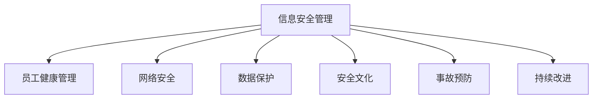

                 

# 安全管理：创造安全健康的工作环境

> 关键词：信息安全管理, 员工健康管理, 网络安全, 数据保护, 安全文化, 事故预防, 持续改进

## 1. 背景介绍

### 1.1 问题由来
随着信息技术的迅猛发展，企业的数据安全和员工健康问题日益凸显。一方面，互联网时代的数据泄露、黑客攻击事件频发，给企业带来了巨大的损失。另一方面，长时间高强度的劳动，不合理的办公环境，也是企业员工健康状况堪忧的重要原因。

为了应对这些挑战，越来越多的企业开始重视信息安全管理和员工健康管理，将两者整合在一个统一的平台中进行综合管理，以期通过系统的安全策略和健康监控，创造一个安全、健康、高效的工作环境。

### 1.2 问题核心关键点
- 数据安全：保护企业的核心数据免受黑客攻击和非法访问。
- 员工健康：监控员工的身体状态和工作压力，提供健康建议和心理辅导。
- 安全文化：培养员工的安全意识和健康意识，形成积极的安全文化。
- 事故预防：通过数据分析和实时监控，提前识别潜在风险，预防事故发生。
- 持续改进：通过定期的安全审查和健康评估，不断优化安全健康策略。

## 2. 核心概念与联系

### 2.1 核心概念概述

为了更好地理解如何通过安全管理创建安全健康的工作环境，本节将介绍几个密切相关的核心概念：

- **信息安全管理**：指企业为保护其信息资源和信息系统的安全，制定并实施一系列的管理措施和策略，确保数据的保密性、完整性和可用性。

- **员工健康管理**：指企业通过监测员工的身体状态和心理状态，提供相应的健康干预，改善工作环境，确保员工身心健康。

- **网络安全**：指保护企业信息系统免受网络攻击和数据泄露等威胁，保证数据的保密性和完整性。

- **数据保护**：指对企业的重要数据进行加密、备份等措施，防止数据丢失或被非法访问。

- **安全文化**：指通过教育和培训，培养员工的安全意识和责任感，形成重视安全的工作氛围。

- **事故预防**：指通过数据分析和监控技术，提前识别潜在的安全隐患和健康问题，及时采取措施，预防事故发生。

- **持续改进**：指通过定期的安全健康评估和反馈机制，不断优化和提升安全健康管理策略，保持系统的持续改进。

这些核心概念之间的逻辑关系可以通过以下Mermaid流程图来展示：



这个流程图展示了几项核心概念及其之间的关系：

1. 信息安全管理是企业安全管理的基石，保护信息资源不被非法访问和泄露。
2. 员工健康管理是企业安全管理的补充，关注员工的身体和心理健康。
3. 网络安全是信息安全管理的重要组成部分，防止网络攻击和数据泄露。
4. 数据保护是信息安全管理的具体措施，确保数据的保密性和完整性。
5. 安全文化是信息安全管理的重要保障，通过员工教育培养安全意识。
6. 事故预防是信息安全管理的延伸，通过监控和数据分析，提前识别和预防潜在风险。
7. 持续改进是信息安全管理的长效机制，通过定期评估和反馈，不断优化安全健康策略。

这些概念共同构成了企业安全管理的核心框架，旨在通过系统的策略和措施，创造一个安全、健康、高效的工作环境。

## 3. 核心算法原理 & 具体操作步骤
### 3.1 算法原理概述

企业安全管理的核心在于制定和执行一系列的安全策略，确保数据的保密性、完整性和可用性，同时关注员工的身体健康和心理健康。这些策略的制定和执行，通常依赖于先进的技术手段，如安全监控、健康监测、数据分析和实时响应等。

### 3.2 算法步骤详解

以下介绍企业安全管理的详细操作步骤：

**Step 1: 需求分析与目标设定**
- 分析企业的业务需求和安全健康问题，明确安全管理的目标和要求。
- 制定安全健康管理政策，包括数据安全策略、员工健康管理措施等。

**Step 2: 系统设计和架构规划**
- 设计符合企业需求的系统架构，包括网络架构、数据架构和安全架构等。
- 规划系统的技术栈，选择合适的技术工具和平台，如网络安全设备、健康监测设备等。

**Step 3: 安全策略和技术实施**
- 根据需求分析结果，实施网络安全策略，部署防火墙、入侵检测系统等。
- 实施数据保护措施，如数据加密、备份、访问控制等。
- 实施员工健康管理措施，如健康监测、员工心理评估等。

**Step 4: 实时监控和数据分析**
- 部署实时监控系统，监测网络流量、数据访问、设备状态等。
- 通过数据分析工具，提取和分析安全健康数据，识别潜在风险和健康问题。
- 建立异常检测和告警机制，及时响应异常事件。

**Step 5: 响应与改进**
- 根据实时监控和数据分析结果，采取应急响应措施，如隔离异常设备、恢复数据等。
- 通过反馈和总结，不断优化和改进安全健康策略，保持系统的持续改进。

### 3.3 算法优缺点

企业安全管理的优势包括：

- 提高信息安全性：通过系统化的安全策略和技术手段，有效保护企业数据不被非法访问和泄露。
- 提升员工健康水平：通过健康监测和管理，改善工作环境，减轻员工压力，提高工作满意度。
- 预防事故发生：通过实时监控和数据分析，提前识别潜在风险，及时采取措施，预防事故发生。
- 降低企业风险：通过全面的安全健康管理，降低企业面临的安全健康风险。

同时，该方法也存在一定的局限性：

- 系统建设成本高：需要大量的人力和物力投入，建设复杂的安全健康管理平台。
- 技术实现难度大：需要掌握先进的安全技术和管理经验，才能有效实施。
- 动态变化适应性差：一旦外部环境发生变化，需要快速调整和优化安全健康策略，确保系统适应性。

尽管存在这些局限性，但就目前而言，企业安全管理的系统化手段仍然是保障信息安全和员工健康的重要方法。未来相关研究将集中在如何降低系统建设成本、提高技术实现效率和系统适应性等方面。

### 3.4 算法应用领域

企业安全管理的系统化手段已经在多个行业得到应用，例如：

- **金融行业**：金融机构的数据安全和员工健康管理至关重要，通过系统化手段可以防止数据泄露和金融欺诈，提高员工健康水平和工作效率。

- **医疗行业**：医疗行业的敏感数据和隐私保护要求极高，通过系统化手段可以保障患者数据安全和医疗数据完整性，同时监控医务人员的工作压力和健康状况。

- **制造业**：制造业的生产设备和员工健康管理至关重要，通过系统化手段可以保障设备安全运行，预防事故发生，同时监测员工健康状况，提升员工幸福感。

- **政府部门**：政府部门的信息安全和员工健康管理同样重要，通过系统化手段可以保护政府数据安全和员工健康，提高政府工作效率和公信力。

除了上述这些经典应用外，企业安全管理的系统化手段还将被创新性地应用到更多场景中，如教育、能源、交通等行业，为企业的数字化转型和智能化升级提供新的技术路径。

## 4. 数学模型和公式 & 详细讲解 & 举例说明
### 4.1 数学模型构建

本节将使用数学语言对企业安全管理的数学模型进行更加严格的刻画。

设企业的数据数量为 $D$，安全事件数量为 $S$，员工健康状态数量为 $H$，实时监控数据数量为 $R$。则企业安全健康管理的目标函数可以表示为：

$$
\min_{\theta} f(\theta; D, S, H, R)
$$

其中 $\theta$ 为安全健康管理的策略参数，$f$ 为安全健康管理的目标函数。

### 4.2 公式推导过程

以下以数据保护为例，推导加密算法中常用的RSA算法的加密和解密过程。

设待加密的明文为 $M$，加密算法为 $E$，解密算法为 $D$，公钥为 $e$，私钥为 $d$。则RSA算法的加密和解密公式分别为：

$$
C = E(M; e) = M^e \mod N
$$

$$
M' = D(C; d) = C^d \mod N
$$

其中 $N = p \times q$，$p$ 和 $q$ 为两个大质数，$e$ 和 $d$ 为满足 $e \times d \equiv 1 \mod (p-1)(q-1)$ 的整数。

在得到加密和解密公式后，即可利用这些公式对数据进行加密和解密，保障数据的安全性。

### 4.3 案例分析与讲解

**案例一：数据加密与解密**

某企业的核心数据 $D$ 需要传输给合作伙伴，为保障数据的安全性，企业采用了RSA算法进行加密。具体步骤如下：

1. 选择两个大质数 $p=23$ 和 $q=17$，计算 $N = p \times q = 391$。
2. 选择公钥 $e=5$，满足 $e \times d \equiv 1 \mod (p-1)(q-1) = 840$。
3. 计算私钥 $d = 215$。
4. 将明文 $M=123$ 进行加密：$C = M^e \mod N = 123^5 \mod 391 = 152$。
5. 将密文 $C$ 传输给合作伙伴，解密过程如下：$M' = C^d \mod N = 152^{215} \mod 391 = 123$。

通过以上步骤，企业可以确保数据在传输过程中的安全性，防止数据泄露。

**案例二：员工健康监测**

某企业需要对员工的健康状态 $H$ 进行实时监测。企业采用了智能手环和健康监测软件，实时采集员工的心率、血压、运动量等健康数据，并通过数据分析工具，提取和分析健康数据，生成健康报告。

具体步骤如下：

1. 为每个员工配备智能手环，实时采集健康数据 $H = \{h_1, h_2, ..., h_n\}$。
2. 利用数据分析工具，计算健康指标，如心率异常数 $S_1$、血压异常数 $S_2$、运动量不足数 $S_3$。
3. 根据健康指标 $S_1, S_2, S_3$，生成健康报告，提出健康建议。
4. 根据健康报告，调整员工的工作安排，改善工作环境，提高员工健康水平。

通过以上步骤，企业可以实时监控员工的健康状态，及时采取健康干预措施，提高员工健康水平。

## 5. 项目实践：代码实例和详细解释说明
### 5.1 开发环境搭建

在进行安全健康管理系统开发前，我们需要准备好开发环境。以下是使用Python进行Flask开发的环境配置流程：

1. 安装Anaconda：从官网下载并安装Anaconda，用于创建独立的Python环境。

2. 创建并激活虚拟环境：
```bash
conda create -n sa-env python=3.8 
conda activate sa-env
```

3. 安装Flask：
```bash
pip install Flask
```

4. 安装SQLite：
```bash
pip install sqlite3
```

5. 安装PyMySQL：
```bash
pip install pymysql
```

6. 安装Flask-SQLAlchemy和Flask-RESTful：
```bash
pip install flask-sqlalchemy flask-restful
```

完成上述步骤后，即可在`sa-env`环境中开始安全健康管理系统开发。

### 5.2 源代码详细实现

下面我们以员工健康管理系统为例，给出使用Flask和SQLite实现健康监测功能的代码实现。

首先，定义员工健康信息的SQLite数据库：

```python
from flask_sqlalchemy import SQLAlchemy

db = SQLAlchemy()

class Employee(db.Model):
    id = db.Column(db.Integer, primary_key=True)
    name = db.Column(db.String(50))
    heart_rate = db.Column(db.Integer)
    blood_pressure = db.Column(db.Integer)
    activity_level = db.Column(db.Integer)
```

然后，定义健康监测和数据统计的Flask API：

```python
from flask import Flask, jsonify, request

app = Flask(__name__)

@app.route('/employee', methods=['POST'])
def add_employee():
    data = request.get_json()
    employee = Employee(name=data['name'], heart_rate=data['heart_rate'], blood_pressure=data['blood_pressure'], activity_level=data['activity_level'])
    db.session.add(employee)
    db.session.commit()
    return jsonify({'message': 'Employee added successfully'})

@app.route('/employee/health', methods=['GET'])
def get_employee_health():
    employees = Employee.query.all()
    data = []
    for employee in employees:
        data.append({
            'name': employee.name,
            'heart_rate': employee.heart_rate,
            'blood_pressure': employee.blood_pressure,
            'activity_level': employee.activity_level
        })
    return jsonify(data)
```

最后，启动Flask服务：

```python
if __name__ == '__main__':
    app.run(debug=True)
```

在以上代码中，我们使用了Flask框架和SQLite数据库，实现了员工健康信息的存储和查询功能。开发者可以根据具体需求，进一步扩展健康监测和数据分析的功能，实现全面的健康管理。

### 5.3 代码解读与分析

让我们再详细解读一下关键代码的实现细节：

**Employee类**：
- `__init__`方法：定义员工的健康信息，包括心率、血压、活动量等。

**add_employee函数**：
- 通过API接口，接收员工健康信息，并存储到SQLite数据库中。

**get_employee_health函数**：
- 通过API接口，查询数据库中所有员工的健康信息，并返回JSON格式的数据。

通过以上步骤，开发者可以根据具体需求，灵活定制健康监测和管理系统的功能，同时确保数据的安全性和系统的稳定性。

## 6. 实际应用场景
### 6.1 智能监控系统

智能监控系统可以将实时监控数据与员工健康管理进行整合，实现全面的安全健康管理。智能监控系统通常包括视频监控、网络监控、设备监控等，通过数据分析和实时告警，及时发现和处理异常事件，保障企业安全。

例如，某大型制造企业采用了智能监控系统，实时监测生产设备和员工状态，通过数据分析发现设备故障和员工健康问题，及时采取措施，保障生产安全和员工健康。

### 6.2 数据加密系统

数据加密系统是企业安全管理的重要组成部分，通过加密算法保护数据的安全性。目前常用的加密算法包括RSA、AES等，可以应用于数据传输、存储和处理等环节。

例如，某金融企业采用了RSA加密算法，保护用户数据的安全性，防止数据泄露和金融欺诈。通过加密算法，企业可以确保数据在传输和存储过程中的安全性，保障企业核心数据不被非法访问和泄露。

### 6.3 安全意识培训系统

安全意识培训系统通过教育和培训，提升员工的安全意识和责任感，形成重视安全的工作氛围。系统通常包括在线培训、模拟演练、案例分析等功能。

例如，某电力企业采用了安全意识培训系统，通过在线培训和模拟演练，提升员工的安全意识和应急响应能力，降低事故发生的概率。通过安全意识培训，企业可以培养员工的安全意识和责任感，形成积极的安全文化。

### 6.4 未来应用展望

随着信息技术的不断进步，企业安全健康管理系统将不断拓展其应用范围，为企业带来更大的安全保障和员工福利。

在智慧城市治理中，企业安全健康管理系统可以与城市应急管理、公共安全等领域结合，构建更加全面、高效的安全体系，提升城市治理的智能化水平。

在企业内部，安全健康管理系统可以与人力资源管理、员工福利等领域结合，提供更为全面的员工关怀和福利方案，提升员工满意度和工作效率。

在医疗行业，安全健康管理系统可以与患者数据安全、医务人员健康监测等领域结合，保障医疗数据的安全性和医务人员的健康，提高医疗服务的质量和效率。

此外，在教育、能源、交通等多个领域，企业安全健康管理系统也将被创新性地应用，为各行业的数字化转型和智能化升级提供新的技术路径。

## 7. 工具和资源推荐
### 7.1 学习资源推荐

为了帮助开发者系统掌握企业安全健康管理的技术基础和实践技巧，这里推荐一些优质的学习资源：

1. 《网络安全基础》课程：网络安全领域的入门级课程，涵盖网络攻击、加密算法、数据保护等基础知识。

2. 《健康管理基础》课程：健康管理领域的入门级课程，涵盖健康监测、健康干预、健康评估等基础知识。

3. 《安全意识培训》课程：培训员工的安全意识和应急响应能力，提升企业安全文化。

4. 《数据保护法规》课程：讲解数据保护法规和隐私保护的重要性，提高企业的合规意识。

5. 《安全事件响应》课程：介绍安全事件响应流程和措施，保障企业数据和员工安全。

通过对这些资源的学习实践，相信你一定能够快速掌握企业安全健康管理的精髓，并用于解决实际的业务问题。
###  7.2 开发工具推荐

高效的开发离不开优秀的工具支持。以下是几款用于企业安全健康管理系统开发的常用工具：

1. Flask：基于Python的开源Web框架，轻量级、易扩展，适合开发轻量级Web应用。

2. SQLite：轻量级嵌入式数据库，适合小规模数据存储和处理。

3. PyMySQL：Python语言的数据库访问库，支持MySQL数据库，方便数据操作。

4. Kibana：开源数据可视化工具，提供丰富的图表和分析功能，适合监控系统数据展示。

5. Apache Kafka：开源流处理平台，适合实时数据采集和处理，适合监控系统数据采集。

6. Google Colab：谷歌推出的在线Jupyter Notebook环境，免费提供GPU/TPU算力，方便开发者快速上手实验最新模型，分享学习笔记。

合理利用这些工具，可以显著提升企业安全健康管理系统的开发效率，加快创新迭代的步伐。

### 7.3 相关论文推荐

企业安全健康管理的研究源于学界的持续研究。以下是几篇奠基性的相关论文，推荐阅读：

1. Data Security and Privacy: Principles and Practice（数据安全与隐私：原则与实践）：介绍了数据安全的基本原则和实践，涵盖加密算法、数据备份等技术。

2. Security of Medical Data in the Cloud: Challenges and Solutions（医疗数据云存储的安全性：挑战与解决方案）：讨论了医疗数据在云存储中的安全性问题，提出了多种解决方案。

3. Social Engineering: The First Order of Defense（社交工程：防御的第一要务）：探讨了社交工程攻击的危害和防御措施，强调了安全意识培训的重要性。

4. Cybersecurity Training Program Design（网络安全培训项目设计）：介绍了网络安全培训项目的设计原则和方法，讨论了如何通过培训提升员工安全意识。

5. Cybersecurity Awareness and Employee Training Programs: Lessons Learned and Recommendations for the Future（网络安全意识和员工培训计划：经验教训和未来建议）：总结了网络安全培训项目的经验教训，提出了未来建议。

这些论文代表了大规模语言模型微调技术的发展脉络。通过学习这些前沿成果，可以帮助研究者把握学科前进方向，激发更多的创新灵感。

## 8. 总结：未来发展趋势与挑战
### 8.1 总结

本文对企业安全健康管理的核心概念和实施方法进行了全面系统的介绍。首先阐述了企业安全健康管理的研究背景和意义，明确了数据安全、员工健康管理的重要性。其次，从原理到实践，详细讲解了安全健康管理的数学模型和关键操作步骤，给出了安全健康管理系统开发的完整代码实例。同时，本文还广泛探讨了安全健康管理系统在多个行业领域的应用前景，展示了安全健康管理系统的广阔潜力。此外，本文精选了安全健康管理系统的各类学习资源，力求为读者提供全方位的技术指引。

通过本文的系统梳理，可以看到，企业安全健康管理系统正在成为企业数字化转型的重要支撑，极大地提高了企业的安全性、效率性和员工福利水平。未来，伴随技术的不断发展，企业安全健康管理系统将在更多领域得到应用，为企业的数字化转型和智能化升级提供新的技术路径。

### 8.2 未来发展趋势

展望未来，企业安全健康管理系统将呈现以下几个发展趋势：

1. 集成化程度提升。随着技术的不断进步，安全健康管理系统将集成更多的功能模块，如安全监控、健康监测、数据分析等，形成一个全面、统一的平台。

2. 智能化水平提高。通过人工智能和大数据分析技术，安全健康管理系统将更加智能化，能够实时识别潜在风险和健康问题，并及时采取措施。

3. 个性化定制增强。系统将根据企业的具体需求，提供个性化的安全健康管理方案，提升系统的适用性和满意度。

4. 数据驱动决策。系统将通过数据驱动的方式，不断优化和改进安全健康策略，保持系统的持续改进。

5. 跨部门协作加强。安全健康管理系统将打破部门界限，实现跨部门协作，提升整体安全健康管理水平。

以上趋势凸显了企业安全健康管理系统的广阔前景。这些方向的探索发展，必将进一步提升企业的安全性、效率性和员工福利水平，推动企业数字化转型和智能化升级。

### 8.3 面临的挑战

尽管企业安全健康管理系统已经取得了瞩目成就，但在迈向更加智能化、普适化应用的过程中，它仍面临着诸多挑战：

1. 系统建设成本高。建设复杂的安全健康管理系统需要大量的人力和物力投入，建设成本较高。

2. 技术实现难度大。需要掌握先进的技术手段和管理经验，才能有效实施。

3. 系统动态变化适应性差。一旦外部环境发生变化，需要快速调整和优化安全健康策略，确保系统适应性。

4. 数据隐私和安全问题。企业需要平衡数据隐私和安全之间的关系，避免数据泄露和滥用。

5. 员工接受度低。部分员工对新技术的接受度较低，需要加强培训和引导。

尽管存在这些挑战，但随着技术的不断进步和管理的不断优化，企业安全健康管理系统必将逐步克服这些难题，成为企业数字化转型的重要支撑。

### 8.4 未来突破

面对企业安全健康管理系统所面临的种种挑战，未来的研究需要在以下几个方面寻求新的突破：

1. 降低系统建设成本。采用开源技术、云计算等手段，降低系统建设成本，提升系统的可扩展性和灵活性。

2. 提高技术实现效率。引入自动化、智能化技术，提高系统实施的效率和效果。

3. 增强系统动态适应性。通过数据分析和实时监控，及时识别潜在风险和健康问题，实现动态调整和优化。

4. 加强数据隐私保护。采用数据加密、访问控制等手段，保障数据隐私和安全。

5. 提升员工接受度。通过培训和引导，提升员工对新技术的接受度，形成积极的安全健康文化。

这些研究方向将推动企业安全健康管理系统的不断进步，提升企业的数字化转型和智能化升级水平。

## 9. 附录：常见问题与解答

**Q1：如何构建企业安全健康管理系统？**

A: 构建企业安全健康管理系统需要以下步骤：

1. 需求分析：明确企业的业务需求和安全健康问题，制定安全健康管理目标。
2. 系统设计：设计系统的架构和功能模块，选择合适的技术工具和平台。
3. 实施部署：部署网络安全、数据保护、健康监测等模块，进行系统集成和测试。
4. 实时监控：部署实时监控系统，监测企业数据和员工健康状态。
5. 数据分析：通过数据分析工具，提取和分析安全健康数据，生成健康报告和预警。
6. 应急响应：根据异常告警，及时采取应急响应措施，保障企业安全健康。

**Q2：如何保护企业数据的安全性？**

A: 保护企业数据的安全性需要以下措施：

1. 数据加密：对重要数据进行加密，防止数据泄露。
2. 数据备份：定期备份数据，防止数据丢失。
3. 访问控制：对数据访问进行严格控制，防止非法访问。
4. 安全监控：实时监控数据访问和使用情况，及时发现和处理异常事件。

**Q3：如何监控员工的健康状态？**

A: 监控员工的健康状态需要以下措施：

1. 智能手环：为员工配备智能手环，实时采集健康数据。
2. 健康监测软件：使用健康监测软件，提取和分析健康数据。
3. 健康报告：生成健康报告，提出健康建议。
4. 健康干预：根据健康报告，调整员工的工作安排，改善工作环境。

**Q4：如何预防企业安全事故？**

A: 预防企业安全事故需要以下措施：

1. 安全监控：实时监控企业数据和设备状态，及时发现和处理异常事件。
2. 数据分析：通过数据分析工具，提取和分析安全数据，识别潜在风险。
3. 应急响应：根据异常告警，及时采取应急响应措施，保障企业安全。
4. 培训教育：通过安全意识培训，提升员工的安全意识和应急响应能力。

通过以上步骤，企业可以全面保障信息安全和员工健康，构建一个安全、健康、高效的工作环境。

---

作者：禅与计算机程序设计艺术 / Zen and the Art of Computer Programming

