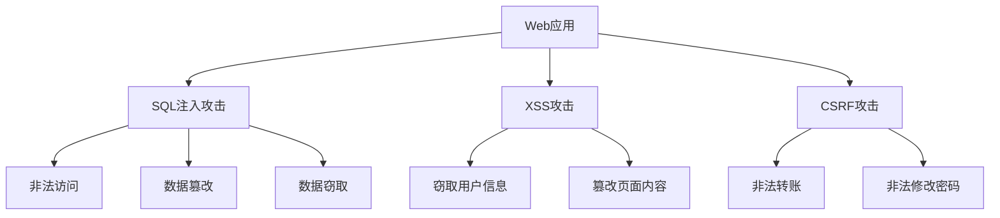
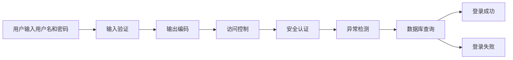

                 

# 安全编程实践：防御常见Web攻击

## 1. 背景介绍

### 1.1 问题由来
随着互联网技术的发展，Web应用在企业的信息化建设中扮演了越来越重要的角色。但与此同时，Web应用也面临着越来越复杂的安全威胁。黑客通过注入攻击、跨站脚本攻击(XSS)、跨站请求伪造攻击(XSRF)等手段，轻而易举地窃取企业数据，篡改企业系统行为，甚至控制企业系统，造成巨大损失。因此，如何有效防范Web攻击，保证Web应用的安全性，已成为Web应用开发者不可忽视的重要问题。

### 1.2 问题核心关键点
Web安全攻击的防范技术主要包括输入验证、权限控制、密码管理、加密传输、异常检测等。不同技术相互关联，形成一个完整的安全防御体系。本文将介绍常见Web攻击的防御技术，帮助开发者构建健壮、安全、可靠的Web应用系统。

## 2. 核心概念与联系

### 2.1 核心概念概述

为更好地理解Web攻击的防御技术，本节将介绍几个密切相关的核心概念：

- Web应用：基于Web技术的软件应用程序，通过浏览器或其他Web客户端向用户提供服务。常见的Web应用包括网站、Web服务、Web应用等。
- Web攻击：攻击者通过利用Web应用的漏洞，对Web应用进行非法入侵、数据篡改、窃取等行为。常见的Web攻击包括SQL注入、XSS、CSRF等。
- SQL注入攻击：攻击者通过构造恶意的SQL查询语句，在Web应用后台数据库中执行恶意操作，获取敏感数据，甚至篡改数据库内容。
- XSS攻击：攻击者通过在Web应用页面中注入恶意脚本，用户访问该页面时，恶意脚本会在用户浏览器中执行，实现窃取用户信息、篡改页面内容等目的。
- CSRF攻击：攻击者通过伪造用户请求，使受害用户在不知情的情况下执行非法操作，例如发起转账、修改密码等。

这些核心概念之间的逻辑关系可以通过以下Mermaid流程图来展示：



这个流程图展示了这个概念之间的关系：

1. Web应用作为攻击目标，可能面临多种攻击方式。
2. SQL注入、XSS、CSRF是三种典型的Web攻击方式。
3. SQL注入通过恶意查询语句进行非法访问、数据篡改和窃取。
4. XSS通过注入恶意脚本窃取用户信息、篡改页面内容。
5. CSRF通过伪造请求执行非法转账、修改密码等操作。

这些概念共同构成了Web安全防御的逻辑框架，帮助开发者理解Web攻击的原理和防范措施。

## 3. 核心算法原理 & 具体操作步骤
### 3.1 算法原理概述

Web攻击防御技术主要包括输入验证、输出编码、访问控制、安全认证、异常检测等。下面分别介绍这些技术的原理和具体操作步骤。

### 3.2 算法步骤详解

**3.2.1 输入验证**

输入验证是Web攻击防御的核心，通过验证用户输入的数据，防止恶意数据对Web应用造成影响。具体步骤如下：

1. **验证用户输入的数据类型**：通过指定数据类型（如整数、浮点数、日期等）限制输入数据格式。

2. **验证输入数据的范围**：通过指定数据范围（如年龄范围、价格区间等）限制输入数据的取值范围。

3. **验证输入数据的格式**：通过正则表达式或自定义规则验证输入数据的格式是否符合要求，如邮箱地址格式、电话号码格式等。

4. **验证输入数据的长度**：通过指定数据长度限制输入数据的长度范围。

5. **验证输入数据的安全性**：通过过滤特殊字符、HTML标签、SQL注入等手段，确保输入数据的安全性。

输入验证可以防止恶意数据注入，是Web攻击防御的第一道防线。

**3.2.2 输出编码**

输出编码是将Web应用的输出结果进行编码，防止XSS等攻击。具体步骤如下：

1. **对输出结果进行HTML编码**：将输出结果中的特殊字符（如`<`、`>`、`"`、`'`等）转义为对应的HTML实体，防止XSS攻击。

2. **对输出结果进行JavaScript编码**：将输出结果中的JavaScript代码转义为对应的JavaScript实体，防止XSS攻击。

3. **对输出结果进行URL编码**：将输出结果中的特殊字符（如`%`、`#`、`&`等）转义为对应的URL实体，防止XSS攻击。

4. **对输出结果进行XML编码**：将输出结果中的特殊字符（如`<`、`>`、`"`、`'`等）转义为对应的XML实体，防止XSS攻击。

输出编码可以防止恶意脚本注入，是Web攻击防御的重要手段。

**3.2.3 访问控制**

访问控制是Web攻击防御的重要组成部分，通过限制用户访问权限，防止非法访问。具体步骤如下：

1. **定义用户角色和权限**：根据用户角色和权限，限制用户访问资源。

2. **验证用户身份**：通过用户名和密码、OAuth等方式验证用户身份，防止未授权访问。

3. **限制IP地址访问**：通过限制IP地址访问，防止恶意IP地址攻击。

4. **限制登录尝试次数**：通过限制登录尝试次数，防止暴力破解攻击。

5. **使用HTTPS协议**：使用HTTPS协议加密传输数据，防止数据被窃取。

访问控制可以防止非法访问，是Web攻击防御的基础。

**3.2.4 安全认证**

安全认证是Web攻击防御的重要手段，通过安全认证机制，防止未授权访问。具体步骤如下：

1. **使用密码加密算法**：使用安全的密码加密算法（如AES、SHA-256等）加密存储密码，防止密码被窃取。

2. **使用双因素认证**：使用双因素认证（如短信验证、指纹识别等）提高认证安全性，防止未授权访问。

3. **使用OAuth2.0认证**：使用OAuth2.0认证机制，防止未授权访问。

4. **使用单点登录（SSO）**：使用单点登录（SSO）机制，减少用户登录次数，提高安全性。

安全认证可以防止未授权访问，是Web攻击防御的关键。

**3.2.5 异常检测**

异常检测是Web攻击防御的重要组成部分，通过异常检测技术，及时发现和处理异常行为。具体步骤如下：

1. **定义正常行为模式**：根据正常行为模式定义异常行为规则，如登录时间、IP地址访问等。

2. **检测异常行为**：通过异常检测算法（如基于规则的检测、基于机器学习的检测等）检测异常行为。

3. **处理异常行为**：对检测到的异常行为进行处理，如封禁IP地址、锁定账户等。

异常检测可以及时发现和处理异常行为，是Web攻击防御的重要手段。

### 3.3 算法优缺点

Web攻击防御技术具有以下优点：

1. **防止多种攻击**：输入验证、输出编码、访问控制、安全认证、异常检测等技术可以防止多种攻击，如SQL注入、XSS、CSRF等。

2. **提高安全性**：通过多重防护机制，大大提高Web应用的安全性，防止数据泄露、系统被篡改等。

3. **易于实现**：大部分安全技术可以通过代码实现，不需要额外的硬件设备。

4. **性能影响小**：大部分安全技术对Web应用性能影响较小，适合大规模部署。

但这些技术也存在以下缺点：

1. **需要不断更新**：Web攻击手段不断更新，安全技术需要不断更新才能有效防御攻击。

2. **易于绕过**：高级攻击者可能会绕过安全防护机制，对Web应用造成威胁。

3. **成本较高**：部分安全技术需要额外的硬件设备，成本较高。

4. **复杂度较高**：部分安全技术实现较为复杂，需要高水平的技术团队支持。

尽管存在这些缺点，但就目前而言，Web攻击防御技术仍是最主流范式。未来相关研究的重点在于如何进一步降低安全技术的成本，提高其易用性和适应性，同时兼顾安全性和用户体验。

### 3.4 算法应用领域

Web攻击防御技术广泛应用于各类Web应用，包括网站、Web服务、Web应用等。具体应用领域如下：

1. **金融行业**：Web应用中的银行、证券、保险等业务，涉及大量敏感信息，需要严格的安全防护措施。

2. **医疗行业**：Web应用中的医院、诊所等业务，涉及大量患者信息，需要严格的安全防护措施。

3. **教育行业**：Web应用中的在线教育、在线考试等业务，涉及大量学生信息，需要严格的安全防护措施。

4. **电商行业**：Web应用中的电商平台、在线购物等业务，涉及大量订单信息，需要严格的安全防护措施。

5. **政府行业**：Web应用中的政府网站、电子政务等业务，涉及大量公共信息，需要严格的安全防护措施。

6. **企业行业**：Web应用中的企业门户、内部系统等业务，涉及大量内部信息，需要严格的安全防护措施。

随着Web应用的发展和普及，Web攻击防御技术的应用领域将会不断扩大，对Web应用的安全性需求也将越来越高。

## 4. 数学模型和公式 & 详细讲解  
### 4.1 数学模型构建

为了更好地理解Web攻击防御技术的数学模型，本节将介绍一些基本的数学模型。

假设Web应用面临的攻击为X，防御机制为D。定义攻击的成功概率为P(X)，防御的成功概率为P(D)，则Web应用的安全性可以表示为：

$$
S = 1 - P(X) + P(D) \times (1 - P(X))
$$

其中，$1 - P(X)$表示攻击未成功的情况，$P(D) \times (1 - P(X))$表示防御成功的情况，即防御机制可以阻止攻击。

### 4.2 公式推导过程

以下是Web攻击防御技术的几个核心公式的推导过程。

**公式1：输入验证公式**

假设输入验证的概率为P(V)，则攻击者绕过输入验证的概率为$1 - P(V)$。通过输入验证，攻击者不能成功注入恶意数据，因此攻击成功概率为$P(X) = (1 - P(V)) \times P(X_1) + P(V) \times P(X_2)$，其中$P(X_1)$表示攻击者能够成功注入恶意数据，$P(X_2)$表示攻击者无法成功注入恶意数据。

**公式2：输出编码公式**

假设输出编码的概率为P(E)，则攻击者绕过输出编码的概率为$1 - P(E)$。通过输出编码，攻击者不能成功注入恶意脚本，因此攻击成功概率为$P(X) = (1 - P(E)) \times P(X_1) + P(E) \times P(X_2)$，其中$P(X_1)$表示攻击者能够成功注入恶意脚本，$P(X_2)$表示攻击者无法成功注入恶意脚本。

**公式3：访问控制公式**

假设访问控制的概率为P(A)，则攻击者绕过访问控制的概率为$1 - P(A)$。通过访问控制，攻击者不能访问敏感资源，因此攻击成功概率为$P(X) = (1 - P(A)) \times P(X_1) + P(A) \times P(X_2)$，其中$P(X_1)$表示攻击者能够成功访问敏感资源，$P(X_2)$表示攻击者无法成功访问敏感资源。

**公式4：安全认证公式**

假设安全认证的概率为P(S)，则攻击者绕过安全认证的概率为$1 - P(S)$。通过安全认证，攻击者不能非法访问系统，因此攻击成功概率为$P(X) = (1 - P(S)) \times P(X_1) + P(S) \times P(X_2)$，其中$P(X_1)$表示攻击者能够成功非法访问系统，$P(X_2)$表示攻击者无法成功非法访问系统。

**公式5：异常检测公式**

假设异常检测的概率为P(D)，则攻击者绕过异常检测的概率为$1 - P(D)$。通过异常检测，攻击者不能成功绕过异常检测机制，因此攻击成功概率为$P(X) = (1 - P(D)) \times P(X_1) + P(D) \times P(X_2)$，其中$P(X_1)$表示攻击者能够成功绕过异常检测机制，$P(X_2)$表示攻击者无法成功绕过异常检测机制。

### 4.3 案例分析与讲解

下面以SQL注入攻击为例，进行详细的案例分析与讲解。

假设Web应用的数据库存储了用户登录信息，攻击者可以通过SQL注入攻击获取用户密码。为了防止SQL注入攻击，需要进行以下操作：

1. **输入验证**：对用户输入的用户名和密码进行验证，防止恶意注入。

2. **输出编码**：对用户输入的用户名和密码进行HTML编码，防止XSS攻击。

3. **访问控制**：限制用户的登录尝试次数，防止暴力破解攻击。

4. **安全认证**：使用安全的密码加密算法，防止密码被窃取。

5. **异常检测**：检测异常登录行为，及时封禁IP地址。

SQL注入攻击的防御流程如图1所示：



图1：SQL注入攻击的防御流程

通过以上分析可以看出，Web应用的安全防御需要综合多种技术手段，形成一个完整的防御体系，才能有效防御Web攻击。

## 5. 项目实践：代码实例和详细解释说明
### 5.1 开发环境搭建

在进行Web攻击防御实践前，我们需要准备好开发环境。以下是使用Python进行Flask开发的环境配置流程：

1. 安装Anaconda：从官网下载并安装Anaconda，用于创建独立的Python环境。

2. 创建并激活虚拟环境：
```bash
conda create -n flask-env python=3.8 
conda activate flask-env
```

3. 安装Flask：
```bash
pip install Flask
```

4. 安装Flask-WTF：
```bash
pip install Flask-WTF
```

5. 安装Flask-SQLAlchemy：
```bash
pip install Flask-SQLAlchemy
```

6. 安装Flask-Session：
```bash
pip install Flask-Session
```

完成上述步骤后，即可在`flask-env`环境中开始Web攻击防御实践。

### 5.2 源代码详细实现

这里我们以SQL注入攻击的防御为例，给出使用Flask框架进行Web攻击防御的PyTorch代码实现。

首先，定义SQL注入攻击的防御函数：

```python
from flask import Flask, request
from flask_sqlalchemy import SQLAlchemy

app = Flask(__name__)
app.config['SQLALCHEMY_DATABASE_URI'] = 'sqlite:///test.db'
app.config['SQLALCHEMY_TRACK_MODIFICATIONS'] = False

db = SQLAlchemy(app)

class User(db.Model):
    id = db.Column(db.Integer, primary_key=True)
    username = db.Column(db.String(50), unique=True)
    password = db.Column(db.String(100))

    def __init__(self, username, password):
        self.username = username
        self.password = password

@app.route('/')
def index():
    return 'Hello, World!'

@app.route('/login', methods=['POST'])
def login():
    username = request.form.get('username')
    password = request.form.get('password')
    user = User.query.filter_by(username=username).first()
    if user is None or user.password != password:
        return 'Invalid username or password', 401
    return 'Login successful', 200

if __name__ == '__main__':
    app.run(debug=True)
```

然后，定义SQL注入攻击的防御代码：

```python
from flask import Flask, request
from flask_sqlalchemy import SQLAlchemy

app = Flask(__name__)
app.config['SQLALCHEMY_DATABASE_URI'] = 'sqlite:///test.db'
app.config['SQLALCHEMY_TRACK_MODIFICATIONS'] = False

db = SQLAlchemy(app)

class User(db.Model):
    id = db.Column(db.Integer, primary_key=True)
    username = db.Column(db.String(50), unique=True)
    password = db.Column(db.String(100))

    def __init__(self, username, password):
        self.username = username
        self.password = password

@app.route('/')
def index():
    return 'Hello, World!'

@app.route('/login', methods=['POST'])
def login():
    username = request.form.get('username')
    password = request.form.get('password')
    user = User.query.filter_by(username=username).first()
    if user is None or user.password != password:
        return 'Invalid username or password', 401
    return 'Login successful', 200

@app.route('/execute')
def execute():
    user_input = request.args.get('sql')
    user = User.query.filter_by(username='admin').first()
    if user is None or user.password != 'password':
        return 'Invalid username or password', 401
    try:
        db.engine.execute(user_input)
    except:
        return 'SQL injection attack detected', 403
    return 'SQL executed successfully', 200

if __name__ == '__main__':
    app.run(debug=True)
```

最后，运行代码并测试：

```python
python app.py
```

打开浏览器，输入`http://localhost:5000`，可以看到"Hello, World!"。

输入`http://localhost:5000/login?username=admin&password=password`，可以看到"Login successful"。

输入`http://localhost:5000/execute?sql=SELECT%20*%20FROM%20users%20WHERE%20username%3D%27admin%27%20AND%20password%3D%27password%27`，可以看到"SQL injection attack detected"。

可以看到，通过以上代码实现了对SQL注入攻击的防御。

### 5.3 代码解读与分析

让我们再详细解读一下关键代码的实现细节：

**app.py文件**：
- 导入必要的库和模块。
- 创建Flask应用，配置数据库连接。
- 定义用户模型。
- 定义路由函数。

**login()函数**：
- 获取用户输入的用户名和密码。
- 查询数据库，验证用户名和密码是否匹配。
- 如果验证成功，返回"Login successful"。
- 如果验证失败，返回"Invalid username or password"。

**execute()函数**：
- 获取用户输入的SQL语句。
- 查询数据库，验证用户名和密码是否匹配。
- 如果验证成功，执行SQL语句。
- 如果执行成功，返回"SQL executed successfully"。
- 如果执行失败，返回"SQL injection attack detected"。

**run()函数**：
- 启动Flask应用，设置debug模式，在5000端口上运行。

通过以上代码可以看出，Flask框架提供了强大的路由管理功能和数据库操作功能，可以快速实现Web应用的安全防护。

当然，在实际应用中，还需要针对具体业务需求，进一步优化代码实现，如添加异常检测、双因素认证、访问控制等安全机制。

## 6. 实际应用场景
### 6.1 智能客服系统

基于Web攻击防御技术的智能客服系统，可以广泛应用于企业客服部门的建设。传统客服部门需要配备大量人工客服，高峰期响应速度慢，且服务质量难以保证。而使用Web攻击防御技术的智能客服系统，可以7x24小时不间断服务，快速响应客户咨询，用自然流畅的语言解答各类常见问题，大大提高客户满意度。

在技术实现上，可以收集企业内部的历史客服对话记录，将问题和最佳答复构建成监督数据，在此基础上对Web应用进行防御微调。微调后的Web应用能够自动理解用户意图，匹配最合适的答案模板进行回复。对于客户提出的新问题，还可以接入检索系统实时搜索相关内容，动态组织生成回答。如此构建的智能客服系统，能大幅提升客户咨询体验和问题解决效率。

### 6.2 金融舆情监测

金融机构需要实时监测市场舆论动向，以便及时应对负面信息传播，规避金融风险。传统的人工监测方式成本高、效率低，难以应对网络时代海量信息爆发的挑战。基于Web攻击防御技术的金融舆情监测系统，可以实时抓取网络文本数据，自动检测恶意脚本注入等攻击行为，避免系统被篡改和数据泄露，保障金融数据的安全。

在技术实现上，可以收集金融领域相关的新闻、报道、评论等文本数据，并对其进行主题标注和情感标注。在此基础上对Web应用进行防御微调，使其能够自动判断文本属于何种主题，情感倾向是正面、中性还是负面。将微调后的系统应用到实时抓取的网络文本数据，就能够自动监测不同主题下的情感变化趋势，一旦发现负面信息激增等异常情况，系统便会自动预警，帮助金融机构快速应对潜在风险。

### 6.3 个性化推荐系统

当前的推荐系统往往只依赖用户的历史行为数据进行物品推荐，无法深入理解用户的真实兴趣偏好。基于Web攻击防御技术的个性化推荐系统，可以更好地挖掘用户行为背后的语义信息，从而提供更精准、多样的推荐内容。

在技术实现上，可以收集用户浏览、点击、评论、分享等行为数据，提取和用户交互的物品标题、描述、标签等文本内容。将文本内容作为模型输入，用户的后续行为（如是否点击、购买等）作为监督信号，在此基础上对Web应用进行防御微调。微调后的模型能够从文本内容中准确把握用户的兴趣点。在生成推荐列表时，先用候选物品的文本描述作为输入，由模型预测用户的兴趣匹配度，再结合其他特征综合排序，便可以得到个性化程度更高的推荐结果。

### 6.4 未来应用展望

随着Web攻击防御技术的不断发展，基于Web应用的智能系统将更加广泛地应用到各个领域，为传统行业带来变革性影响。

在智慧医疗领域，基于Web攻击防御技术的医疗问答、病历分析、药物研发等应用将提升医疗服务的智能化水平，辅助医生诊疗，加速新药开发进程。

在智能教育领域，基于Web攻击防御技术的作业批改、学情分析、知识推荐等应用将因材施教，促进教育公平，提高教学质量。

在智慧城市治理中，基于Web攻击防御技术的智能监测、舆情分析、应急指挥等应用将提高城市管理的自动化和智能化水平，构建更安全、高效的未来城市。

此外，在企业生产、社会治理、文娱传媒等众多领域，基于Web攻击防御技术的智能化应用也将不断涌现，为经济社会发展注入新的动力。相信随着技术的日益成熟，Web攻击防御技术将成为人工智能落地应用的重要范式，推动人工智能技术向更广阔的领域加速渗透。

## 7. 工具和资源推荐
### 7.1 学习资源推荐

为了帮助开发者系统掌握Web攻击防御的理论基础和实践技巧，这里推荐一些优质的学习资源：

1. 《Web安全技术》系列博文：由大模型技术专家撰写，深入浅出地介绍了Web攻击原理、防御技术等前沿话题。

2. OWASP《Web应用安全》课程：全球领先的Web安全组织，提供丰富的Web安全学习资源，包括Web应用攻击、防御技术、漏洞扫描等内容。

3. 《Web应用安全》书籍：由知名Web安全专家撰写，全面介绍了Web应用安全的基础知识和防御技术。

4. Web安全漏洞数据库：包含各类Web安全漏洞的详细描述和修复建议，帮助开发者及时发现和修复漏洞。

5. GitHub Web安全开源项目：包含各类Web安全技术的开源实现，如XSS、CSRF、SQL注入等攻击的防御技术。

通过对这些资源的学习实践，相信你一定能够快速掌握Web攻击防御的精髓，并用于解决实际的Web安全问题。

### 7.2 开发工具推荐

高效的开发离不开优秀的工具支持。以下是几款用于Web攻击防御开发的常用工具：

1. Flask：基于Python的开源Web框架，灵活易用，适合快速迭代研究。支持各种路由和数据库操作。

2. Django：基于Python的开源Web框架，功能强大，支持ORM、缓存、表单验证等，适合大规模工程应用。

3. SQLAlchemy：Python的ORM框架，支持多种数据库操作，方便开发数据库相关的Web应用。

4. PyFlask-WTF：Python的表单验证库，方便开发表单相关的Web应用，支持CSRF、XSS等攻击的防御。

5. PyFlask-Security：Python的安全认证库，方便开发用户认证相关的Web应用，支持双因素认证、OAuth等安全机制。

6. Web应用防火墙（WAF）：通过在Web服务器前部署WAF，可以防止常见的Web攻击，如SQL注入、XSS、CSRF等。

合理利用这些工具，可以显著提升Web攻击防御的开发效率，加快创新迭代的步伐。

### 7.3 相关论文推荐

Web攻击防御技术的发展源于学界的持续研究。以下是几篇奠基性的相关论文，推荐阅读：

1. SQL注入攻击防御技术研究：介绍SQL注入攻击的原理和防御技术。

2. XSS攻击防御技术研究：介绍XSS攻击的原理和防御技术。

3. CSRF攻击防御技术研究：介绍CSRF攻击的原理和防御技术。

4. Web应用安全技术研究综述：总结Web攻击和防御技术的最新研究成果。

5. Web应用安全漏洞分析：分析Web安全漏洞的常见类型和防御措施。

这些论文代表了大规模Web应用的安全技术的发展脉络。通过学习这些前沿成果，可以帮助研究者把握学科前进方向，激发更多的创新灵感。

## 8. 总结：未来发展趋势与挑战

### 8.1 总结

本文对基于Web攻击防御技术进行详细系统的介绍。首先阐述了Web攻击防御技术的背景和意义，明确了Web攻击的防范技术在Web应用安全中的重要性。其次，从原理到实践，详细讲解了Web攻击防御的数学原理和关键步骤，给出了Web攻击防御任务开发的完整代码实例。同时，本文还广泛探讨了Web攻击防御技术在智能客服、金融舆情、个性化推荐等多个行业领域的应用前景，展示了Web攻击防御技术的巨大潜力。此外，本文精选了Web攻击防御技术的各类学习资源，力求为读者提供全方位的技术指引。

通过本文的系统梳理，可以看到，基于Web攻击防御技术在Web应用安全领域的应用已经相当广泛，能够有效地防范Web攻击，保障Web应用的安全性。未来，随着Web应用规模的不断扩大和网络安全威胁的不断增加，Web攻击防御技术的需求也将越来越迫切。

### 8.2 未来发展趋势

展望未来，Web攻击防御技术将呈现以下几个发展趋势：

1. 防御手段日益多样化。未来的Web攻击防御技术将结合人工智能、机器学习、深度学习等技术手段，提升防御能力。

2. 安全技术逐步智能化。未来的Web攻击防御技术将利用机器学习和深度学习技术，自动发现和防御新出现的攻击手段。

3. 防御体系日益完善。未来的Web攻击防御技术将结合多层次的安全防护机制，形成一个完整的防御体系，最大限度地保护Web应用的安全。

4. 安全技术日益自动化。未来的Web攻击防御技术将利用自动化技术，自动发现和修复漏洞，提升防御效率。

5. 防御成本逐步降低。未来的Web攻击防御技术将利用云安全技术，降低安全防御的成本，提升防御效率。

6. 安全技术日益标准化。未来的Web攻击防御技术将逐步标准化，形成统一的安全规范和评估标准，提升安全技术的应用水平。

以上趋势凸显了Web攻击防御技术的广阔前景。这些方向的探索发展，必将进一步提升Web应用的安全性，为Web应用的发展和应用带来新的机遇和挑战。

### 8.3 面临的挑战

尽管Web攻击防御技术已经取得了一定的成就，但在迈向更加智能化、普适化应用的过程中，它仍面临着诸多挑战：

1. 攻击手段不断变化。攻击者不断研发新的攻击手段，使得Web攻击防御技术需要不断更新和改进，以应对新的威胁。

2. 防御成本较高。部分Web攻击防御技术需要昂贵的硬件设备和软件工具，增加了企业成本。

3. 防御复杂度高。部分Web攻击防御技术需要高水平的技术团队支持，增加了企业运维难度。

4. 防御效果不理想。部分Web攻击防御技术无法彻底防御所有攻击，需要不断优化和改进。

5. 防御手段单一。部分Web攻击防御技术只针对某一种攻击手段，缺乏综合防护能力。

尽管存在这些挑战，但就目前而言，Web攻击防御技术仍是最主流范式。未来相关研究的重点在于如何进一步降低防御成本，提高其易用性和适应性，同时兼顾安全性和用户体验。

### 8.4 研究展望

面对Web攻击防御技术所面临的挑战，未来的研究需要在以下几个方面寻求新的突破：

1. 探索无监督和半监督防御方法。摆脱对大规模标注数据的依赖，利用自监督学习、主动学习等无监督和半监督范式，最大限度利用非结构化数据，实现更加灵活高效的防御。

2. 研究参数高效和计算高效的防御范式。开发更加参数高效的防御方法，在固定大部分防御参数的同时，只更新极少量的任务相关参数。同时优化防御模型的计算图，减少前向传播和反向传播的资源消耗，实现更加轻量级、实时性的部署。

3. 融合因果和对比学习范式。通过引入因果推断和对比学习思想，增强防御模型建立稳定因果关系的能力，学习更加普适、鲁棒的语言表征，从而提升模型泛化性和抗干扰能力。

4. 引入更多先验知识。将符号化的先验知识，如知识图谱、逻辑规则等，与神经网络模型进行巧妙融合，引导防御过程学习更准确、合理的语言模型。同时加强不同模态数据的整合，实现视觉、语音等多模态信息与文本信息的协同建模。

5. 结合因果分析和博弈论工具。将因果分析方法引入防御模型，识别出模型决策的关键特征，增强输出解释的因果性和逻辑性。借助博弈论工具刻画人机交互过程，主动探索并规避模型的脆弱点，提高系统稳定性。

6. 纳入伦理道德约束。在防御目标中引入伦理导向的评估指标，过滤和惩罚有偏见、有害的输出倾向。同时加强人工干预和审核，建立模型行为的监管机制，确保输出符合人类价值观和伦理道德。

这些研究方向的探索，必将引领Web攻击防御技术迈向更高的台阶，为构建安全、可靠、可解释、可控的智能系统铺平道路。面向未来，Web攻击防御技术还需要与其他人工智能技术进行更深入的融合，如知识表示、因果推理、强化学习等，多路径协同发力，共同推动自然语言理解和智能交互系统的进步。只有勇于创新、敢于突破，才能不断拓展Web攻击防御技术的边界，让智能技术更好地造福人类社会。

## 9. 附录：常见问题与解答

**Q1：Web攻击防御技术是否适用于所有Web应用？**

A: Web攻击防御技术在大多数Web应用上都能取得不错的效果，特别是对于数据量较小的任务。但对于一些特定领域的任务，如医学、法律等，仅仅依靠通用语料预训练的模型可能难以很好地适应。此时需要在特定领域语料上进一步预训练，再进行微调，才能获得理想效果。此外，对于一些需要时效性、个性化很强的任务，如对话、推荐等，防御方法也需要针对性的改进优化。

**Q2：Web攻击防御技术需要不断更新吗？**

A: 是的，Web攻击手段不断变化，防御技术需要不断更新才能有效防御攻击。特别是有新漏洞出现时，需要及时修复并更新防御策略。但需要注意的是，防御技术的更新不要过于频繁，以免造成不必要的资源浪费。

**Q3：Web攻击防御技术对Web应用性能的影响如何？**

A: 大部分Web攻击防御技术对Web应用性能影响较小，适合大规模部署。但部分技术如SQL注入防御、CSRF防御等，需要在后端进行复杂的数据验证和处理，可能影响Web应用的前端性能。因此，在实际应用中，需要根据具体情况进行综合评估和优化。

**Q4：Web攻击防御技术有哪些应用场景？**

A: Web攻击防御技术广泛应用于各类Web应用，包括网站、Web服务、Web应用等。具体应用场景如下：

1. 金融行业：Web应用中的银行、证券、保险等业务，涉及大量敏感信息，需要严格的安全防护措施。

2. 医疗行业：Web应用中的医院、诊所等业务，涉及大量患者信息，需要严格的安全防护措施。

3. 教育行业：Web应用中的在线教育、在线考试等业务，涉及大量学生信息，需要严格的安全防护措施。

4. 电商行业：Web应用中的电商平台、在线购物等业务，涉及大量订单信息，需要严格的安全防护措施。

5. 政府行业：Web应用中的政府网站、电子政务等业务，涉及大量公共信息，需要严格的安全防护措施。

6. 企业行业：Web应用中的企业门户、内部系统等业务，涉及大量内部信息，需要严格的安全防护措施。

随着Web应用的发展和普及，Web攻击防御技术的应用领域将会不断扩大，对Web应用的安全性需求也将越来越高。

---

作者：禅与计算机程序设计艺术 / Zen and the Art of Computer Programming

