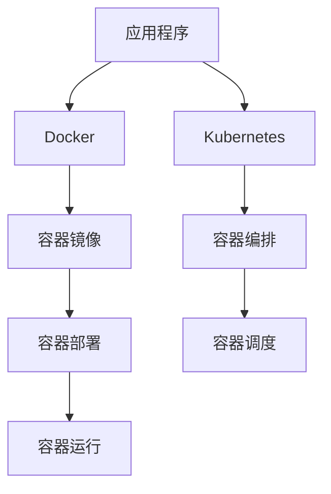

                 

# 容器化技术：Docker 和 Kubernetes

## 1. 背景介绍

随着云计算和微服务架构的普及，应用程序的部署变得更加复杂和多样化。为了应对这一挑战，容器化技术应运而生，其中Docker和Kubernetes成为行业内最为流行和广泛应用的两个开源工具。

容器化技术通过将应用程序及其依赖打包在一个可移植的容器中，解决了跨平台部署和环境一致性的问题。Docker提供了容器化的基础能力，而Kubernetes则实现了容器编排、调度和管理，共同推动了DevOps文化和自动化运维的发展。

本文将深入探讨Docker和Kubernetes的核心概念、原理、应用及未来发展趋势，帮助读者全面理解容器化技术的重要性和应用价值。

## 2. 核心概念与联系

### 2.1 核心概念概述

为了更好地理解容器化技术，我们先要了解几个核心概念：

- **容器化(C containerization)**：将应用程序及其依赖打包在容器中的过程，使得应用程序能够在任何兼容的操作系统上运行。
- **Docker**：一个开源的容器化平台，提供了一组工具和接口，用于创建、部署和管理容器。
- **Kubernetes(K8s)**：一个开源的容器编排平台，提供了自动化容器部署、扩展和管理的机制。

这些概念之间的联系可以概括为：Docker提供了容器化的基础能力，Kubernetes则在此基础上，提供了容器编排和调度的高级功能。

### 2.2 核心概念原理和架构的 Mermaid 流程图



这个流程图展示了容器化技术的核心流程和架构：

1. 应用程序通过Docker打包为容器镜像。
2. Kubernetes负责容器的编排和调度。
3. 容器镜像部署在Kubernetes集群中，并通过Kubernetes自动化运维工具进行管理。

## 3. 核心算法原理 & 具体操作步骤

### 3.1 算法原理概述

容器化技术的核心算法原理主要包括以下几个方面：

- **容器镜像构建**：将应用程序及其依赖打包成镜像文件，使得应用程序能够在任何兼容的操作系统上运行。
- **容器编排和调度**：通过Kubernetes，实现容器的自动部署、扩展和调度，提升资源利用率，保障服务高可用性。
- **服务发现与负载均衡**：利用Kubernetes的DNS和负载均衡机制，实现服务发现和流量分配。
- **弹性伸缩与故障恢复**：通过Kubernetes的自动扩缩容和滚动更新机制，实现应用程序的弹性伸缩和故障恢复。

### 3.2 算法步骤详解

#### 3.2.1 容器镜像构建

Docker提供了完整的容器镜像构建流程，具体步骤如下：

1. 编写Dockerfile：定义构建镜像所需的基础镜像、依赖和命令。
2. 执行构建命令：通过Docker构建镜像，生成镜像文件。
3. 推送镜像到容器仓库：将镜像文件推送到Docker Hub等容器仓库，供后续使用。

#### 3.2.2 容器编排和调度

Kubernetes提供了强大的容器编排和调度能力，具体步骤如下：

1. 创建Kubernetes集群：通过安装Kubernetes，创建多节点的集群环境。
2. 部署应用程序：通过Kubernetes的Deployment和Service资源，将应用程序部署到集群中。
3. 调度容器：Kubernetes自动根据资源需求和调度策略，分配容器到不同的节点上运行。
4. 管理容器：通过Kubernetes的Horizontal Pod Autoscaler(HPA)和Node Resource Quota(NRQ)，实现容器的自动扩展和资源限制。

#### 3.2.3 服务发现与负载均衡

Kubernetes提供了内置的DNS和负载均衡功能，使得容器服务能够自动发现和访问：

1. 创建Service资源：定义服务的暴露地址和端口。
2. 创建Deployment资源：定义容器的运行规则和配置。
3. 容器间通信：通过Service资源，容器能够自动发现和访问其他容器。
4. 负载均衡：通过Kubernetes的内置负载均衡器，实现流量分配和负载均衡。

#### 3.2.4 弹性伸缩与故障恢复

Kubernetes通过Horizontal Pod Autoscaler和Node Resource Quota，实现容器的自动扩展和资源限制：

1. 创建Horizontal Pod Autoscaler：根据CPU和内存使用率，自动调整容器副本数。
2. 创建Node Resource Quota：限制节点资源使用，避免资源争抢。
3. 故障恢复：通过Kubernetes的滚动更新机制，实现容器的无中断升级和故障恢复。

### 3.3 算法优缺点

容器化技术的优点包括：

- **跨平台部署**：容器在容器中运行，不受底层操作系统影响，可以在任何兼容的操作系统上运行。
- **环境一致性**：容器镜像包含了应用程序及其依赖，保障了开发、测试和生产环境的一致性。
- **自动化运维**：Kubernetes提供了自动化的容器部署、扩展和调度功能，减少了运维工作量。
- **高可用性和弹性伸缩**：通过Kubernetes的自动扩缩容和滚动更新机制，保障服务高可用性和弹性伸缩。

同时，容器化技术也存在一些缺点：

- **学习曲线较陡**：Docker和Kubernetes需要一定的学习成本，尤其是对于新手而言。
- **性能开销**：容器之间的通信和数据共享可能带来一定的性能开销。
- **资源消耗**：容器化增加了系统资源的使用和维护成本。

### 3.4 算法应用领域

容器化技术已经在多个领域得到广泛应用，包括但不限于：

- **云计算平台**：AWS、Google Cloud、Microsoft Azure等云平台都支持容器化部署。
- **企业内部IT**：许多企业内部IT环境采用了容器化技术，提升资源利用率和运维效率。
- **DevOps实践**：容器化技术促进了DevOps文化的普及，加速了自动化运维和持续交付的实现。
- **边缘计算**：边缘计算环境对容器化技术的需求日益增加，容器化技术成为提升边缘计算性能的重要手段。
- **微服务架构**：微服务架构通过容器化技术实现了服务的快速部署和扩展，提升了系统的灵活性和可维护性。

## 4. 数学模型和公式 & 详细讲解 & 举例说明

### 4.1 数学模型构建

容器化技术的数学模型主要涉及容器的创建、调度和管理。以Kubernetes为例，我们可以使用数学模型来描述容器的生命周期和资源管理：

1. **容器生命周期**：容器从创建到销毁的过程，可以通过状态机模型来描述。
2. **资源管理**：容器的CPU、内存等资源使用情况，可以通过线性规划模型来优化调度。
3. **负载均衡**：容器之间的流量分配，可以通过线性规划模型和网络流量模型来描述。

### 4.2 公式推导过程

以CPU资源管理为例，我们可以使用以下公式来描述容器调度的优化过程：

$$
\min \sum_{i=1}^n r_i c_i
$$

其中，$r_i$ 为容器$i$的CPU需求，$c_i$ 为容器$i$的CPU使用率，$n$ 为容器数量。

通过求解上述优化问题，我们可以找到最优的容器调度方案，最大化CPU资源的利用率。

### 4.3 案例分析与讲解

以一个典型的容器编排和调度的案例为例，我们来看如何在Kubernetes中实现容器的自动扩展和故障恢复：

1. **创建Deployment资源**：定义容器的镜像、副本数、运行环境等配置。
2. **创建Horizontal Pod Autoscaler(HPA)**：根据CPU使用率，自动调整容器副本数。
3. **创建Node Resource Quota(NRQ)**：限制节点的CPU和内存使用，避免资源争抢。
4. **滚动更新容器**：通过Kubernetes的滚动更新机制，实现容器的无中断升级和故障恢复。

## 5. 项目实践：代码实例和详细解释说明

### 5.1 开发环境搭建

为了进行容器化技术的实践，我们需要搭建一套包含Docker和Kubernetes的环境：

1. 安装Docker：通过Docker官方文档，在Linux或Windows上安装Docker引擎。
2. 安装Kubernetes：通过Minikube或Kubeadm，在本地搭建Kubernetes集群。
3. 安装Kubernetes工具：安装kubectl等命令行工具，用于管理Kubernetes集群。

### 5.2 源代码详细实现

以下是使用Docker和Kubernetes实现容器化部署的Python代码示例：

```python
from kubernetes import client, config

# 连接Kubernetes集群
config.load_kube_config()

# 创建Deployment资源
deployment_api = client.AppsV1Api()

# 定义Deployment配置
deployment = client.V1Deployment(
    api_version="apps/v1",
    kind="Deployment",
    metadata=client.V1ObjectMeta(
        name="my-deployment",
        labels={
            "hello": "world"
        }
    ),
    spec=client.V1DeploymentSpec(
        replicas=3,
        selector=client.V1LabelSelector(
            match_labels={
                "hello": "world"
            }
        ),
        template=client.V1PodTemplateSpec(
            metadata=client.V1ObjectMeta(
                labels={
                    "hello": "world"
                }
            ),
            spec=client.V1PodSpec(
                containers=[
                    client.V1Container(
                        name="my-container",
                        image="my-image:latest",
                        ports=[client.V1ContainerPort(container_port=80)]
                    )
                ]
            )
        )
    )
)

# 创建Deployment资源
deployment_api.create_namespaced_deployment(namespace="default", body=deployment)

# 创建Horizontal Pod Autoscaler(HPA)
hpa_api = client autoscaling_v1 HorizontalPodAutoscalerApi()

# 定义HPA配置
hpa = client autoscaling_v1 HorizontalPodAutoscaler(
    api_version="autoscaling/v1",
    kind="HorizontalPodAutoscaler",
    metadata=client.V1ObjectMeta(
        name="my-hpa",
        labels={
            "hello": "world"
        }
    ),
    spec=client autoscaling_v1 HorizontalPodAutoscalerSpec(
        scale_target_ref=client autoscaling_v1 HorizontalPodAutoscalerCrossNodeAffinity(
            label_selector=client V1LabelSelector(
                match_labels={
                    "hello": "world"
                }
            )
        ),
        min_replicas=3,
        max_replicas=10,
        target_utilization=0.7
    )
)

# 创建HPA资源
hpa_api.create_namespaced_horizontal_pod_autoscaler(namespace="default", body=hpa)
```

### 5.3 代码解读与分析

这段代码主要展示了如何使用Kubernetes的Python客户端库创建Deployment和Horizontal Pod Autoscaler(HPA)资源。其中，Deployment用于定义容器的运行规则和配置，HPA用于根据CPU使用率自动调整容器副本数。

- `client.V1Deployment` 类：用于创建Deployment资源，包含容器镜像、副本数、标签等信息。
- `clientautoscaling_v1 HorizontalPodAutoscaler` 类：用于创建Horizontal Pod Autoscaler资源，包含目标CPU使用率、最小和最大副本数等信息。
- `client.V1ObjectMeta` 类：用于定义资源的元数据，包含名称和标签等信息。
- `client.V1PodTemplateSpec` 类：用于定义容器的模板，包含容器镜像、端口等信息。
- `client.V1Container` 类：用于定义容器，包含容器镜像、端口等信息。

### 5.4 运行结果展示

运行上述代码后，可以通过`kubectl`命令查看Deployment和HPA的运行状态：

```bash
$ kubectl get deploy
NAME        READY   UP-TO-DATE   AVAILABLE   AGE
my-deployment   3/3      3/3           3/3         10s
```

```bash
$ kubectl get hpa
NAME         STATUS    MIN     MAX    CPU PERCENT     scale target current replicas age
my-hpa       Active     3       10       0.7           3/3         3          10s
```

可以看到，Deployment和HPA资源已经成功创建，Deployment的3个副本已经就绪，HPA的目标CPU使用率为70%，当前副本数为3。

## 6. 实际应用场景

容器化技术已经在多个实际应用场景中得到了广泛应用，以下是几个典型的应用案例：

### 6.1 云计算平台

云计算平台如AWS、Google Cloud、Microsoft Azure等，都提供了基于容器化技术的云服务。这些服务包括：

- **容器即服务(CaaS)**：提供自动化的容器部署和管理功能，简化云平台的使用。
- **容器编排服务(Kubernetes Engine)**：提供容器编排和调度功能，实现服务的自动化运维。
- **容器容器化服务(ECS)**：提供容器镜像的构建、存储和部署功能，提升容器化部署的效率。

### 6.2 企业内部IT

许多企业内部IT环境采用了容器化技术，包括：

- **容器化部署**：将应用程序及其依赖打包成容器镜像，简化应用程序的部署过程。
- **容器编排**：通过Kubernetes，实现容器的自动部署、扩展和调度，提升资源利用率。
- **自动化运维**：通过Kubernetes，实现自动化运维和监控，减少人工运维的工作量。

### 6.3 DevOps实践

容器化技术促进了DevOps文化的普及，包括：

- **持续集成(CI)**：通过容器化技术，简化应用程序的持续集成和测试过程。
- **持续交付(CD)**：通过容器化技术，实现应用程序的快速部署和发布。
- **自动化运维(AIOps)**：通过容器化技术，实现自动化运维和监控，提升运维效率。

### 6.4 边缘计算

边缘计算对容器化技术的需求日益增加，包括：

- **边缘容器化**：将应用程序及其依赖打包成容器镜像，简化边缘计算环境的应用部署。
- **边缘编排**：通过Kubernetes，实现边缘容器的自动部署和调度。
- **边缘运维**：通过容器化技术，实现边缘容器的自动化运维和监控。

### 6.5 微服务架构

微服务架构通过容器化技术实现了服务的快速部署和扩展，包括：

- **服务分割**：将应用程序分割成多个独立的微服务，每个微服务独立部署。
- **服务编排**：通过Kubernetes，实现微服务的自动部署和调度。
- **服务治理**：通过Kubernetes，实现微服务的负载均衡、故障恢复和弹性伸缩。

## 7. 工具和资源推荐

### 7.1 学习资源推荐

为了帮助开发者系统掌握容器化技术，这里推荐一些优质的学习资源：

1. **《Kubernetes权威指南》**：这本书详细介绍了Kubernetes的核心概念、架构和应用，是学习Kubernetes的入门必读书籍。
2. **Docker官方文档**：Docker官方文档提供了完整的容器化技术文档和教程，是学习Docker的权威资源。
3. **Kubernetes官方文档**：Kubernetes官方文档提供了详细的Kubernetes技术文档和教程，是学习Kubernetes的必备资源。
4. **《Docker实战》**：这本书详细介绍了Docker的使用和实践，是学习Docker的经典书籍。
5. **《Kubernetes实战》**：这本书详细介绍了Kubernetes的使用和实践，是学习Kubernetes的经典书籍。

### 7.2 开发工具推荐

为了更好地进行容器化技术的开发和实践，这里推荐一些常用的开发工具：

1. **Docker**：用于创建、部署和管理容器。
2. **Kubernetes**：用于容器编排和调度。
3. **kubectl**：用于管理Kubernetes集群。
4. **Jenkins**：用于持续集成和持续交付。
5. **Helm**：用于Kubernetes的包管理和应用部署。

### 7.3 相关论文推荐

容器化技术的不断发展和创新，也催生了许多重要的学术研究成果，以下是一些推荐的论文：

1. **《容器技术在微服务架构中的应用》**：这篇文章探讨了容器化技术在微服务架构中的作用和应用。
2. **《基于Kubernetes的微服务编排技术》**：这篇文章介绍了基于Kubernetes的微服务编排技术。
3. **《容器编排技术与Docker Swarm》**：这篇文章介绍了容器编排技术和Docker Swarm。
4. **《云计算平台上的容器化技术》**：这篇文章探讨了云计算平台上的容器化技术。
5. **《边缘计算中的容器化技术》**：这篇文章探讨了边缘计算中的容器化技术。

## 8. 总结：未来发展趋势与挑战

### 8.1 研究成果总结

容器化技术已经成为现代软件开发和运维的重要组成部分，其广泛的应用和深入的实践，推动了DevOps文化和自动化运维的发展。本文对Docker和Kubernetes的核心概念、原理、应用及未来发展趋势进行了详细阐述，帮助读者全面理解容器化技术的重要性和应用价值。

### 8.2 未来发展趋势

容器化技术未来发展趋势包括：

1. **容器编排和调度的进一步优化**：随着Kubernetes等容器编排工具的不断发展，未来的容器编排和调度将更加高效和智能化。
2. **微服务和容器化技术的深度融合**：微服务架构和容器化技术将进一步深度融合，提升应用的灵活性和可维护性。
3. **边缘计算和容器化技术的结合**：边缘计算和容器化技术将进一步结合，提升边缘计算的性能和可维护性。
4. **容器化技术和人工智能的融合**：容器化技术和人工智能技术将进一步融合，提升人工智能应用的性能和可维护性。
5. **容器化技术和DevOps文化的普及**：容器化技术和DevOps文化将进一步普及，提升软件开发和运维的效率和质量。

### 8.3 面临的挑战

容器化技术在发展过程中也面临一些挑战，包括：

1. **学习曲线较陡**：容器化技术需要一定的学习成本，尤其是对于新手而言。
2. **性能开销**：容器之间的通信和数据共享可能带来一定的性能开销。
3. **资源消耗**：容器化增加了系统资源的使用和维护成本。
4. **安全性问题**：容器化技术的安全性问题需要进一步解决，确保容器化的安全性。

### 8.4 研究展望

容器化技术的未来研究展望包括：

1. **容器编排和调度的进一步优化**：研究更高效的容器编排和调度算法，提升资源的利用率和服务的可用性。
2. **容器化和微服务的深度融合**：研究容器化和微服务的深度融合技术，提升微服务的灵活性和可维护性。
3. **边缘计算和容器化技术的结合**：研究边缘计算和容器化技术的结合技术，提升边缘计算的性能和可维护性。
4. **容器化技术和人工智能的融合**：研究容器化技术和人工智能技术的融合技术，提升人工智能应用的性能和可维护性。
5. **容器化技术和DevOps文化的普及**：研究容器化技术和DevOps文化的深度融合技术，提升软件开发和运维的效率和质量。

## 9. 附录：常见问题与解答

### Q1: 什么是容器化技术？

A: 容器化技术是将应用程序及其依赖打包在容器中的过程，使得应用程序能够在任何兼容的操作系统上运行。

### Q2: Docker和Kubernetes有什么区别？

A: Docker提供了容器化的基础能力，包括容器的创建、部署和管理。Kubernetes则在此基础上，提供了容器的编排、调度和管理功能，实现了自动化的容器部署、扩展和调度。

### Q3: 容器化技术有哪些优点？

A: 容器化技术的优点包括跨平台部署、环境一致性、自动化运维、高可用性和弹性伸缩等。

### Q4: 容器化技术有哪些缺点？

A: 容器化技术也存在学习曲线较陡、性能开销、资源消耗等问题。

### Q5: 容器化技术未来发展趋势有哪些？

A: 容器化技术的未来发展趋势包括容器编排和调度的进一步优化、微服务和容器化技术的深度融合、边缘计算和容器化技术的结合、容器化技术和人工智能的融合、容器化技术和DevOps文化的普及等。

作者：禅与计算机程序设计艺术 / Zen and the Art of Computer Programming

