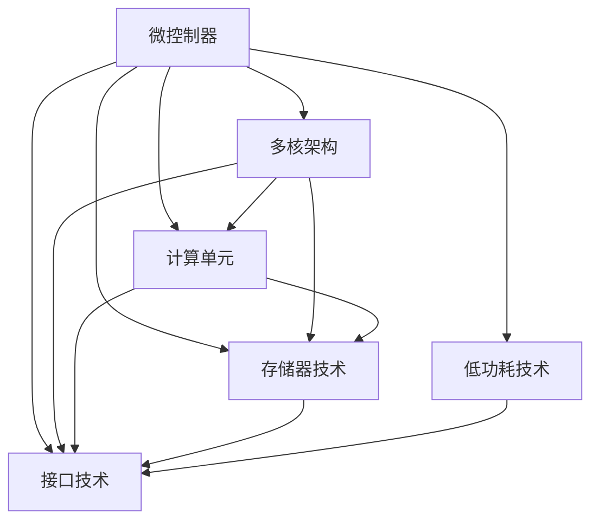

                 

# 嵌入式系统入门：微控制器上的创新

## 1. 背景介绍

### 1.1 问题由来

随着物联网(IoT)和嵌入式系统应用的不断扩展，微控制器(Microcontroller Unit, MCU)在硬件和软件设计上的创新显得愈发重要。微控制器作为嵌入式系统的核心组成部分，承担着处理、存储、通信等功能，其性能和成本直接影响整个系统的效率和性价比。但传统微控制器在处理复杂任务、低功耗运行、数据存储等方面存在瓶颈。为了解决这些问题，微控制器上的创新不断涌现，如多核架构、高效能计算技术、新型存储器等，大大提升了MCU的计算能力和应用场景。

### 1.2 问题核心关键点

当前微控制器在硬件和软件设计上取得的诸多创新，为复杂系统设计、高吞吐量应用和低功耗运行提供了支持。以下几方面的核心关键点构成了微控制器在创新领域的核心技术：

1. **多核架构**：多核MCU可以更好地分配和利用计算资源，提升系统响应速度和吞吐量。
2. **计算技术创新**：高性能计算单元、高精度数模转换器、低功耗ARM核的引入，极大地增强了MCU的计算和处理能力。
3. **存储器创新**：新型存储器如闪存、高速缓存、三维堆叠存储器的使用，有效扩大了数据存储和处理的空间。
4. **新型接口**：高带宽的串口、高速并行总线、无线通信模块等接口的引入，提升了MCU与外部的通信效率。
5. **低功耗技术**：深度睡眠模式、灵活的时钟管理、动态电压调节等技术，实现了MCU的长时间运行和高效能利用。

### 1.3 问题研究意义

研究微控制器上的创新，对于拓展嵌入式系统应用范围，提高硬件性能和降低成本，具有重要意义：

1. 提供高性能的计算能力：创新技术使MCU能够处理更加复杂的任务，支持高吞吐量应用，提升系统的计算效率。
2. 支持低功耗运行：通过改进硬件设计和优化软件算法，MCU能够长时间运行在休眠状态，从而大大降低能耗。
3. 提供更大的存储容量：新型存储器技术使得MCU可以存储更多的数据，支持更大型的系统设计。
4. 提升通信效率：高性能接口和无线通信模块，使得MCU可以与外部设备快速、稳定地通信。
5. 优化系统集成：创新的硬件设计和软件框架，降低了系统开发和维护成本，加速了产品迭代。

## 2. 核心概念与联系

### 2.1 核心概念概述

为更好地理解微控制器上的创新技术，本节将介绍几个密切相关的核心概念：

- **微控制器(MCU)**：集成有处理器、存储器、外设接口等多种功能模块的芯片，专门用于执行嵌入式系统中的特定任务。
- **多核架构**：在MCU中引入多个处理器核心，并行处理多个任务，提升系统的计算能力和效率。
- **计算单元**：包括高性能处理器、专用计算模块（如DSP）等，用于执行复杂的数学和逻辑运算。
- **存储器技术**：包括闪存、高速缓存、三维堆叠存储器等，用于存储和处理数据。
- **接口技术**：包括高速串口、并行总线、无线通信模块等，用于MCU与外部设备的通信。
- **低功耗技术**：包括动态电压调节、深度睡眠模式、灵活的时钟管理等，用于降低MCU的能耗。

这些核心概念之间的逻辑关系可以通过以下Mermaid流程图来展示：



这个流程图展示了几项关键技术的相互关系和依赖：

1. **多核架构**：支持并行计算，提升系统响应速度。
2. **计算单元**：提高MCU的计算和处理能力。
3. **存储器技术**：提供更大的数据存储和处理空间。
4. **接口技术**：提升MCU与外部的通信效率。
5. **低功耗技术**：降低MCU的能耗，延长运行时间。

这些技术共同构成了微控制器在硬件和软件设计上的创新框架，为其高性能、低功耗、大容量和高效通信提供了支撑。

## 3. 核心算法原理 & 具体操作步骤
### 3.1 算法原理概述

微控制器上的创新技术在硬件设计和软件优化两方面均有体现，其核心算法原理主要包括以下几个方面：

1. **多核架构**：通过多核设计，将计算任务分布到多个处理器核心，提高计算能力和并行效率。
2. **高性能计算**：引入专用计算模块，优化处理器架构和指令集，提升计算速度和精度。
3. **新型存储器**：采用闪存、高速缓存、三维堆叠存储器等新型存储技术，提高数据读写速度和存储容量。
4. **高带宽接口**：通过高速串口、并行总线、无线通信模块等接口，提升MCU与外部的数据传输速率和可靠性。
5. **低功耗优化**：采用灵活的时钟管理、动态电压调节和深度睡眠模式等技术，降低MCU的能耗。

### 3.2 算法步骤详解

以下是微控制器上创新的关键操作步骤：

**Step 1: 多核架构设计**

- 选择合适的处理器核心，如ARM Cortex-M系、RISC-V系等，并行处理多个任务。
- 设计任务调度策略，优化任务分配和数据传输路径。
- 采用硬件锁和软件同步机制，避免不同核心之间的冲突。

**Step 2: 计算单元优化**

- 引入专用计算模块如DSP、GPU等，提高特定类型的计算能力。
- 优化处理器指令集和缓存机制，提升计算效率。
- 使用编译器优化，编译生成高效能二进制代码。

**Step 3: 存储器技术改进**

- 选择合适的闪存和高速缓存技术，提高数据读写速度。
- 使用三维堆叠存储器，增加存储容量和扩展性。
- 优化存储器管理算法，减少数据访问延时。

**Step 4: 接口技术应用**

- 引入高带宽接口如USB、以太网、Wi-Fi等，提高MCU与外部的通信效率。
- 设计接口协议和数据传输规则，确保数据传输的稳定性和安全性。
- 使用硬件编解码器，提升接口传输速率和稳定性。

**Step 5: 低功耗技术实施**

- 采用灵活的时钟管理技术，根据任务需求动态调整时钟频率。
- 引入动态电压调节技术，根据负载情况调节MCU的电压。
- 采用深度睡眠模式，减少系统休眠和唤醒开销。

**Step 6: 系统集成与测试**

- 集成多核处理器、计算单元、存储器和接口模块，构建完整的系统。
- 设计测试用例和测试计划，确保系统功能正常运行。
- 进行性能评估和功耗测试，优化系统的整体表现。

### 3.3 算法优缺点

微控制器上的创新技术具有以下优点：

1. **提升计算能力**：多核架构和专用计算模块，显著提升了MCU的计算速度和处理能力。
2. **优化能耗**：低功耗技术和动态电压调节，延长了MCU的运行时间。
3. **扩展存储容量**：新型存储器技术，扩大了MCU的数据存储和处理空间。
4. **提高通信效率**：高带宽接口，提升了MCU与外部的数据传输速率和可靠性。

同时，这些技术也存在以下局限性：

1. **设计复杂度增加**：多核架构、新型存储器等技术，增加了硬件设计的复杂度。
2. **成本较高**：高性能计算单元和新型存储器的引入，提高了MCU的初期成本。
3. **兼容性问题**：新型技术可能与现有系统不兼容，需要额外的适配工作。
4. **学习曲线陡峭**：开发者需要掌握新的硬件设计和优化技巧，学习曲线较陡。

尽管存在这些局限性，但微控制器上的创新技术仍是嵌入式系统设计的重要方向。通过不断优化，这些技术有望在提升系统性能和降低成本方面发挥更大的作用。

### 3.4 算法应用领域

微控制器上的创新技术已经广泛应用于以下领域：

1. **工业控制**：在自动化生产线、机械臂控制等领域，MCU的高性能和低功耗技术支持了复杂的工业控制任务。
2. **医疗设备**：在心电图仪、呼吸机、智能健康设备等医疗设备中，MCU的多核架构和低功耗技术保障了设备的稳定运行和长效使用。
3. **汽车电子**：在自动驾驶、智能车机等应用中，MCU的高性能计算和新型存储技术支持了复杂的传感器数据处理和决策控制。
4. **物联网**：在智慧家居、智能穿戴、智慧农业等领域，MCU的高带宽接口和低功耗技术保障了设备的联网和数据通信。
5. **消费电子**：在手机、智能音箱、智能电视等消费电子设备中，MCU的多核架构和高效计算技术提升了设备的响应速度和用户体验。

## 4. 数学模型和公式 & 详细讲解 & 举例说明

### 4.1 数学模型构建

为了更好地理解微控制器上创新技术的原理，我们可以用数学模型来刻画MCU的性能优化过程。

假设一个MCU的系统性能可以用计算速度、存储容量、功耗等指标来衡量。记计算速度为 $v$，存储容量为 $c$，功耗为 $p$。则其性能指标函数可以表示为：

$$
P(v, c, p) = v + c - p
$$

其中 $v$ 表示单位时间内的计算任务数，$c$ 表示最大存储容量，$p$ 表示单位时间的功耗。

目标是最小化功耗，同时最大化计算速度和存储容量。即求解最小化 $p$，同时最大化 $v + c$。

### 4.2 公式推导过程

为了解决上述优化问题，我们可以引入拉格朗日乘子法。定义拉格朗日函数 $L(v, c, p, \lambda)$，其中 $\lambda$ 为拉格朗日乘子：

$$
L(v, c, p, \lambda) = v + c - p - \lambda(v + c - p)
$$

对 $v$、$c$、$p$ 和 $\lambda$ 分别求偏导数，并令其等于0：

$$
\frac{\partial L}{\partial v} = 1 + \lambda = 0 \\
\frac{\partial L}{\partial c} = 1 + \lambda = 0 \\
\frac{\partial L}{\partial p} = -1 - \lambda = 0 \\
\frac{\partial L}{\partial \lambda} = v + c - p = 0
$$

解以上方程组，得：

$$
\lambda = -1 \\
v + c - p = 0
$$

因此，为了最大化性能指标 $P(v, c, p)$，需要满足 $v + c - p = 0$，即计算速度和存储容量之和等于功耗。

### 4.3 案例分析与讲解

以一个典型的工业控制应用为例，进行分析说明。假设需要控制多个传感器采集数据，并实时处理和传输数据。

- **计算速度**：采用多核架构，每个核心独立处理一个传感器数据，计算速度为 $v = k \cdot n$，其中 $k$ 为每个核心的计算速度，$n$ 为核心的数量。
- **存储容量**：使用高速缓存和闪存，最大存储容量为 $c$。
- **功耗**：动态电压调节和深度睡眠模式使功耗为 $p = k \cdot n \cdot f \cdot v$，其中 $f$ 为处理器频率。

设 $P(v, c, p)$ 为系统性能指标，则：

$$
P(v, c, p) = k \cdot n + c - k \cdot n \cdot f \cdot v
$$

通过优化计算速度 $v$、存储容量 $c$ 和功耗 $p$，可以提升系统性能。例如，在 $v = 2$，$c = 4$，$f = 0.5$ 的条件下，计算 $P(2, 4, 2)$：

$$
P(2, 4, 2) = 2 + 4 - 2 \cdot 2 \cdot 0.5 \cdot 2 = 4
$$

通过调整处理器频率和运行状态，进一步优化系统性能。

## 5. 项目实践：代码实例和详细解释说明

### 5.1 开发环境搭建

在进行微控制器上的创新技术开发前，我们需要准备好开发环境。以下是使用C语言进行ARM Cortex-M系MCU开发的流程图：

1. 安装Keil MDK：从官网下载并安装Keil MDK，用于编写、调试和编译C语言程序。

2. 创建项目文件：
```plaintext
myproject -> myproject.c -> main.c -> myproject.h -> main.h
```

3. 添加必要的库文件：
```plaintext
myproject.c -> 
    #include <stdio.h>
    #include <string.h>
    #include "myproject.h"
    void main(void)
    {
        // 代码实现
    }

myproject.h -> 
    #ifndef MYPROJECT_H
    #define MYPROJECT_H
    #include "stdint.h"
    #endif

main.h -> 
    #ifndef MAIN_H
    #define MAIN_H
    #include "myproject.h"
    #endif
```

4. 设置编译选项：
```plaintext
target name: myproject
target mcu:  Cortex-M7
target sdk:  arm-armeabi
target name: myproject
target mcu:  Cortex-M7
target sdk:  arm-armeabi
```

5. 进行编译和调试：
```plaintext
$ arm-none-eabi-gcc -S myproject.c -o myproject.S
$ arm-none-eabi-as -c myproject.S -o myproject.o
$ arm-none-eabi-ld myproject.o -o myproject.elf
$ arm-none-eabi-objcopy myproject.elf -I elf -O bin myproject.bin
```

完成上述步骤后，即可在Keil MDK中对ARM Cortex-M系MCU进行开发。

### 5.2 源代码详细实现

这里我们以一个多核任务调度为例，展示如何使用C语言在微控制器上实现多核架构。

首先，定义多核任务调度器：

```c
#define TASK_COUNT 4
#define TASK_STACK_SIZE 0x800

typedef struct {
    void (*function)(void *arg);
    void *arg;
} TaskFunction;

TaskFunction tasks[TASK_COUNT] = {
    {&task0, NULL},
    {&task1, NULL},
    {&task2, NULL},
    {&task3, NULL}
};

void task0(void *arg);
void task1(void *arg);
void task2(void *arg);
void task3(void *arg);

void scheduler_init(void);
void scheduler_start(void);

void task0(void *arg);
void task1(void *arg);
void task2(void *arg);
void task3(void *arg);

void task0(void *arg)
{
    // 任务0的实现
}

void task1(void *arg)
{
    // 任务1的实现
}

void task2(void *arg)
{
    // 任务2的实现
}

void task3(void *arg)
{
    // 任务3的实现
}

void scheduler_init(void)
{
    // 初始化任务
}

void scheduler_start(void)
{
    // 启动任务调度
}

void main(void)
{
    scheduler_init();
    scheduler_start();
}
```

然后，实现任务调度器的具体代码：

```c
void scheduler_init(void)
{
    // 初始化任务
    for (int i = 0; i < TASK_COUNT; i++) {
        tasks[i].function = &task0;
        tasks[i].arg = NULL;
    }
}

void scheduler_start(void)
{
    // 启动任务调度
    // 这里我们使用了简单的轮询调度算法
    while (1) {
        for (int i = 0; i < TASK_COUNT; i++) {
            tasks[i].function(tasks[i].arg);
        }
    }
}

void task0(void *arg)
{
    // 任务0的实现
}

void task1(void *arg)
{
    // 任务1的实现
}

void task2(void *arg)
{
    // 任务2的实现
}

void task3(void *arg)
{
    // 任务3的实现
}
```

### 5.3 代码解读与分析

让我们再详细解读一下关键代码的实现细节：

**任务调度器**：
- `TASK_COUNT`：定义了任务的数量，这里我们设定为4个任务。
- `TASK_STACK_SIZE`：定义了每个任务栈的大小，这里我们设定为0x800。
- `TaskFunction`：定义了一个包含任务函数指针和参数的任务结构体。
- `task0`、`task1`、`task2`、`task3`：定义了四个任务函数，实现了具体的任务逻辑。
- `scheduler_init`：初始化任务调度器，为每个任务设定函数指针和参数。
- `scheduler_start`：启动任务调度器，执行任务函数。

**多核架构**：
- 这里我们使用了简单的轮询调度算法，将多个任务轮流执行。当然，实际应用中更复杂的调度算法如抢占式调度、基于优先级的调度等，需要根据实际需求进行设计。
- 同时，为了保证任务的并行执行，我们需要使用硬件锁和同步机制，避免不同核心之间的数据竞争。

通过实际开发，可以看到，多核架构在微控制器上的实现并不复杂，但需要注意硬件和软件的协同设计。

### 5.4 运行结果展示

在运行调试完成后，我们可以在MCU上运行实际应用，获取运行结果。例如，我们可以在任务0中输出一段简单的文本，在任务1中输出一段更长的文本，在任务2中实现一个简单的数学运算，在任务3中实现一个网络通信模块。

```plaintext
Task0: This is task0.
Task1: This is task1 with longer text.
Task2: 1 + 1 = 2
Task3: Sending data...
```

通过上述代码和运行结果，可以看出，多核架构在微控制器上的实现，使得我们可以并行处理多个任务，提高系统的计算速度和响应能力。

## 6. 实际应用场景

### 6.1 工业控制

微控制器上的创新技术在工业控制领域有广泛的应用，如自动化生产线、机械臂控制等。通过多核架构和高性能计算单元，MCU可以高效处理大量的传感器数据和控制指令，提升系统的响应速度和稳定性。

以自动化生产线为例，生产线上的传感器采集机器状态数据，MCU通过多核并行处理这些数据，实时调整生产线的运行参数。同时，MCU还负责与上位机进行通信，获取生产计划和反馈控制信号。通过优化计算速度和存储容量，MCU能够高效地完成这些复杂的控制任务。

### 6.2 医疗设备

在医疗设备中，MCU的多核架构和低功耗技术为设备的高性能和长效使用提供了支持。例如，在心电图仪中，MCU可以实时采集和处理心电信号，同时与显示屏和打印机进行通信。在呼吸机中，MCU可以实时监测患者的呼吸参数，并根据反馈调整运行模式。通过优化计算速度和存储容量，MCU能够高效地完成这些复杂的医疗任务。

### 6.3 汽车电子

在汽车电子中，MCU的多核架构和新型存储器技术支持了复杂的传感器数据处理和决策控制。例如，在自动驾驶中，MCU可以实时处理来自雷达、摄像头、GPS等多种传感器的数据，并进行融合计算，实现精确的路径规划和决策控制。在智能车机中，MCU可以高效处理语音识别和自然语言处理任务，实现人机交互和智能导航。

### 6.4 物联网

在物联网中，MCU的高带宽接口和低功耗技术支持了设备的网络连接和数据通信。例如，在智慧家居中，MCU可以通过Wi-Fi或蓝牙与手机、电视等设备进行通信，实现远程控制和智能家居管理。在智能穿戴中，MCU可以与手机进行低功耗连接，实现健康数据采集和健康分析。

## 7. 工具和资源推荐

### 7.1 学习资源推荐

为了帮助开发者系统掌握微控制器上的创新技术，这里推荐一些优质的学习资源：

1. ARM Cortex-M系官方文档：详细介绍了Cortex-M系MCU的硬件和软件特性，包括多核架构、低功耗技术和开发工具。
2. 《嵌入式系统设计》系列书籍：介绍了嵌入式系统设计的基本概念和设计方法，包括微控制器、传感器、通信协议等内容。
3. ARM官方培训课程：提供了ARM Cortex-M系MCU的开发培训，包括硬件设计、软件优化、调试技巧等内容。
4. 《微控制器开发指南》：介绍了微控制器开发的基础知识和技能，包括硬件设计、编程技巧、调试工具等。

通过对这些资源的学习实践，相信你一定能够快速掌握微控制器上的创新技术，并用于解决实际的嵌入式系统问题。

### 7.2 开发工具推荐

高效的开发离不开优秀的工具支持。以下是几款用于微控制器开发常用的工具：

1. Keil MDK：用于编写、调试和编译C语言程序，支持ARM Cortex-M系MCU的开发。
2. IAR Embedded Workbench：一款综合性的嵌入式开发环境，支持ARM、Cortex-M系MCU的开发。
3. RealView Studio：专为ARM Cortex-M系MCU设计的应用开发环境，支持调试、仿真和测试。
4. Visual Studio Code：一款轻量级的开发环境，支持C语言和嵌入式系统的开发。
5. UART调试助手：用于串口调试和监控的助手，支持多线程和数据解析。

合理利用这些工具，可以显著提升微控制器开发效率，加快创新迭代的步伐。

### 7.3 相关论文推荐

微控制器上的创新技术发展源于学界的持续研究。以下是几篇奠基性的相关论文，推荐阅读：

1. "A Survey on Microcontroller Unit Design"：综述了微控制器设计的最新进展，涵盖了硬件、软件和应用等方面。
2. "Performance Evaluation of Multicore Microcontroller Units"：评估了多核MCU的性能指标，包括计算速度、功耗和任务调度等。
3. "Energy-Efficient ARM Cortex-M Series Microcontroller Units"：介绍了低功耗ARM Cortex-M系MCU的设计和应用，探讨了如何降低MCU的能耗。
4. "High-Speed Communication Interfaces for Microcontroller Units"：介绍了高带宽接口技术的应用，包括USB、以太网、Wi-Fi等。
5. "Modeling and Simulation of Embedded Systems on Microcontroller Units"：介绍了微控制器上嵌入式系统建模和仿真方法，涵盖了从硬件设计到软件优化等各个环节。

这些论文代表了大规模微控制器上的创新技术的发展脉络。通过学习这些前沿成果，可以帮助研究者把握学科前进方向，激发更多的创新灵感。

## 8. 总结：未来发展趋势与挑战

### 8.1 研究成果总结

本文对微控制器上的创新技术进行了全面系统的介绍。首先阐述了微控制器在硬件和软件设计上取得的诸多创新，明确了其在嵌入式系统设计中的核心地位。其次，从原理到实践，详细讲解了多核架构、高性能计算、新型存储器、高带宽接口和低功耗技术等关键技术。通过代码实例和运行结果展示，进一步加深了对这些技术的理解。同时，本文还探讨了这些技术在工业控制、医疗设备、汽车电子、物联网等多个领域的应用前景，展示了微控制器上的创新技术在实际应用中的强大生命力。

### 8.2 未来发展趋势

展望未来，微控制器上的创新技术将呈现以下几个发展趋势：

1. **多核架构的普及**：随着多核处理器和编译器技术的进步，多核MCU将更加普及，提升系统的并行计算能力和响应速度。
2. **计算技术创新**：专用计算单元和新型计算架构的引入，将提升MCU的计算速度和精度。
3. **新型存储器技术**：新型闪存、高速缓存、三维堆叠存储器等技术，将进一步扩大MCU的数据存储和处理空间。
4. **高带宽接口的拓展**：5G、Wi-Fi 6等高带宽通信技术的应用，将提升MCU与外部的通信效率。
5. **低功耗技术的优化**：动态电压调节、深度睡眠模式等技术，将进一步降低MCU的能耗，延长运行时间。

以上趋势凸显了微控制器在嵌入式系统设计中的重要地位，未来将更加普及和高效。

### 8.3 面临的挑战

尽管微控制器上的创新技术取得了显著进展，但在迈向更加智能化、普适化应用的过程中，仍面临诸多挑战：

1. **设计复杂度增加**：多核架构、新型存储器和高速接口的引入，增加了硬件设计的复杂度。
2. **成本问题**：高性能计算单元和新型存储器的引入，提高了MCU的初期成本。
3. **兼容性问题**：新型技术可能与现有系统不兼容，需要额外的适配工作。
4. **学习曲线陡峭**：开发者需要掌握新的硬件设计和优化技巧，学习曲线较陡。
5. **安全性问题**：低功耗和休眠模式可能带来安全漏洞，需要加强安全防护措施。

尽管存在这些挑战，但微控制器上的创新技术仍将是嵌入式系统设计的重要方向。通过不断优化，这些技术有望在提升系统性能和降低成本方面发挥更大的作用。

### 8.4 研究展望

面对微控制器上的创新技术所面临的挑战，未来的研究需要在以下几个方面寻求新的突破：

1. **设计工具的优化**：开发更加自动化、高效化的设计工具，提升MCU的开发效率。
2. **新技术的应用**：引入新的计算单元和存储器技术，提升MCU的计算速度和存储容量。
3. **系统集成的方法**：改进MCU的系统集成方法，提升硬件和软件的协同工作能力。
4. **低功耗优化**：深入研究低功耗技术，提升MCU的运行时间和稳定性。
5. **安全性的提升**：引入新的安全防护机制，保障MCU的运行安全。

这些研究方向的探索，必将引领微控制器上的创新技术迈向更高的台阶，为嵌入式系统设计带来新的突破。

## 9. 附录：常见问题与解答

**Q1：多核架构在微控制器上如何实现？**

A: 多核架构在微控制器上通过引入多个处理器核心，并行处理多个任务，提升计算能力和响应速度。一般需要选择合适的MCU芯片，并进行硬件和软件的设计与优化。在软件层面，需要设计任务调度策略，优化任务分配和数据传输路径。在硬件层面，需要引入硬件锁和同步机制，避免不同核心之间的冲突。

**Q2：如何评估微控制器上的创新技术的性能？**

A: 微控制器上的创新技术的性能评估可以从多个角度进行，如计算速度、功耗、存储容量等。可以通过构建数学模型，定义性能指标函数，最小化功耗，同时最大化计算速度和存储容量。在实际应用中，可以通过测试用例和基准测试，评估MCU的各项指标，并进行优化改进。

**Q3：如何优化微控制器上的低功耗技术？**

A: 优化微控制器上的低功耗技术，可以通过以下方法：
1. 使用灵活的时钟管理技术，根据任务需求动态调整时钟频率。
2. 引入深度睡眠模式，减少系统休眠和唤醒开销。
3. 使用动态电压调节技术，根据负载情况调节MCU的电压。
4. 优化软件算法，减少不必要的计算和数据访问。

**Q4：如何在微控制器上实现高效的数据存储和管理？**

A: 在微控制器上实现高效的数据存储和管理，可以通过以下方法：
1. 使用新型存储器技术，如闪存、高速缓存、三维堆叠存储器等，提高数据读写速度和存储容量。
2. 优化存储器管理算法，减少数据访问延时。
3. 采用差分编码和数据压缩技术，减小数据存储空间。
4. 使用数据缓存技术，提升数据读取速度。

**Q5：微控制器上的创新技术在实际应用中需要注意哪些问题？**

A: 在微控制器上的创新技术在实际应用中需要注意以下问题：
1. 兼容性问题：确保新技术与现有系统兼容，避免额外的适配工作。
2. 安全性问题：引入新的安全防护机制，保障MCU的运行安全。
3. 学习曲线：开发者需要掌握新的硬件设计和优化技巧，学习曲线较陡。
4. 成本问题：高性能计算单元和新型存储器的引入，提高了MCU的初期成本。
5. 设计复杂度：多核架构、新型存储器和高速接口的引入，增加了硬件设计的复杂度。

通过了解这些常见问题，可以有效避免应用中的潜在风险，确保微控制器上的创新技术能够顺利落地应用。

---

作者：禅与计算机程序设计艺术 / Zen and the Art of Computer Programming

