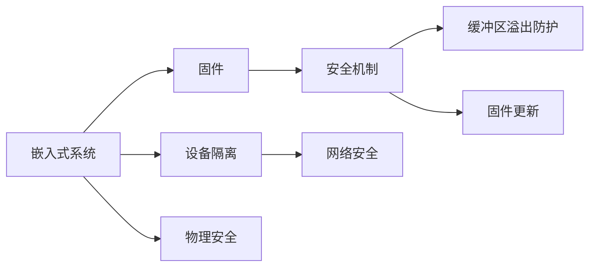

                 

# 嵌入式系统安全策略：保护设备和数据完整性

在当今数字化时代，嵌入式系统作为物理世界的数字接口，已经成为各种智能设备和系统的大脑。然而，随着这些系统在各个行业的应用越来越广泛，其安全性和完整性问题也变得愈发重要。本文将探讨嵌入式系统的安全策略，特别是如何保护设备和数据的完整性。我们将从背景介绍、核心概念与联系、核心算法原理、数学模型和公式、项目实践、实际应用场景、工具和资源推荐、总结与展望、附录等多个方面，全面阐述嵌入式系统安全策略。

## 1. 背景介绍

嵌入式系统广泛应用于工业控制、医疗设备、汽车电子、消费电子等领域。它们通常运行在资源受限的环境中，包括内存、处理器速度、存储容量等。虽然嵌入式系统并非直接面向公众，但其安全漏洞可能被攻击者利用，导致严重的后果，如系统崩溃、设备损坏或数据泄露。因此，保护嵌入式系统的安全性和完整性是至关重要的。

### 1.1 嵌入式系统安全的重要性

嵌入式系统通常涉及敏感数据和关键操作，如控制设备的行为、监控环境和进行决策。攻击者可以利用安全漏洞，如缓冲区溢出、恶意代码注入、固件漏洞等，来窃取敏感信息、篡改系统行为或破坏设备功能。安全漏洞不仅影响设备的正常运行，还可能导致设备损坏、环境污染、人身伤害等严重后果。

### 1.2 嵌入式系统安全挑战

嵌入式系统的安全挑战主要包括：

- **资源限制**：嵌入式系统通常具有有限的内存和计算资源，难以部署复杂的安全机制。
- **固件漏洞**：固件是嵌入式系统的核心，其安全漏洞可能被攻击者利用。
- **网络安全**：许多嵌入式系统通过网络与外部世界交互，面临网络攻击的风险。
- **物理安全**：嵌入式系统通常部署在物理环境中，如工业控制系统和汽车电子设备，物理安全也是重要的考量因素。

## 2. 核心概念与联系

### 2.1 核心概念概述

为了更好地理解嵌入式系统安全策略，我们需要理解几个核心概念：

- **嵌入式系统**：由微控制器、传感器、执行器等组件组成，运行专用软件，用于控制物理世界的操作系统。
- **固件**：嵌入式系统的核心软件，固化在硬件中，控制硬件组件的行为。
- **安全机制**：如认证、授权、加密、监控等，用于保护嵌入式系统的安全性和完整性。
- **缓冲区溢出**：一种常见漏洞，攻击者通过向缓冲区写入超出其容量限制的数据，覆盖其他内存区域，导致程序崩溃或被攻击。
- **固件更新**：定期更新固件，以修复已知的安全漏洞和提升系统性能。
- **设备隔离**：将嵌入式系统与其他设备或网络隔离，防止横向攻击。

这些概念之间的逻辑关系可以通过以下Mermaid流程图来展示：



这个流程图展示了他核概念及其之间的联系：

1. 嵌入式系统通过固件控制硬件组件。
2. 安全机制通过认证、授权等手段保护系统的完整性。
3. 缓冲区溢出防护和固件更新是提高固件安全性的关键措施。
4. 设备隔离通过网络安全和物理安全手段，保护嵌入式系统免受攻击。

## 3. 核心算法原理 & 具体操作步骤

### 3.1 算法原理概述

嵌入式系统安全策略的核心算法包括：

- **认证**：验证用户和设备的身份，防止未经授权的访问。
- **授权**：根据认证结果，控制用户和设备的访问权限。
- **加密**：保护数据和通信的机密性，防止数据泄露。
- **监控**：实时监测系统行为，检测异常行为。

这些算法通过一系列步骤，共同构成嵌入式系统的安全防线。

### 3.2 算法步骤详解

#### 3.2.1 认证算法

认证算法主要用于验证用户和设备的身份。常见的认证方式包括：

- **用户名和密码**：通过用户名和密码进行身份验证。
- **生物识别**：使用指纹、面部识别等生物识别技术进行身份验证。
- **公钥加密**：使用公钥加密技术，确保通信双方的身份真实性。

认证算法的步骤包括：

1. 用户或设备提供认证信息（如密码、指纹）。
2. 认证服务器验证信息，确认身份。
3. 认证成功，返回令牌或密钥。
4. 用户或设备获得令牌或密钥，用于后续通信。

#### 3.2.2 授权算法

授权算法用于根据认证结果，控制用户和设备的访问权限。常见的授权方式包括：

- **基于角色的访问控制**：根据用户角色分配权限。
- **基于属性的访问控制**：根据用户属性（如地理位置、设备类型）分配权限。
- **细粒度访问控制**：对每个资源进行细粒度权限控制。

授权算法的步骤包括：

1. 用户或设备获得认证令牌或密钥。
2. 授权服务器根据令牌或密钥，验证身份。
3. 授权服务器根据用户角色或属性，分配访问权限。
4. 用户或设备根据权限，访问系统资源。

#### 3.2.3 加密算法

加密算法用于保护数据和通信的机密性。常见的加密方式包括：

- **对称加密**：使用相同的密钥进行加密和解密。
- **非对称加密**：使用公钥加密数据，私钥解密数据。
- **哈希函数**：将数据转换为固定长度的哈希值，用于验证数据完整性。

加密算法的步骤包括：

1. 用户或设备需要保护的数据。
2. 使用加密算法（如AES、RSA、SHA等）加密数据。
3. 接收方使用密钥或哈希值解密或验证数据。
4. 数据传输过程中保持机密性，防止数据泄露。

#### 3.2.4 监控算法

监控算法用于实时监测系统行为，检测异常行为。常见的监控方式包括：

- **日志记录**：记录系统行为，用于事后分析。
- **入侵检测系统**：实时检测异常行为，如恶意代码注入。
- **行为分析**：分析系统行为，检测异常模式。

监控算法的步骤包括：

1. 实时监测系统行为。
2. 记录系统日志。
3. 使用入侵检测系统检测异常行为。
4. 分析系统行为，检测异常模式。

### 3.3 算法优缺点

嵌入式系统安全策略的算法具有以下优点：

- **增强安全性**：通过认证、授权、加密和监控等手段，增强系统的安全性。
- **降低成本**：通过自动化和简化安全流程，降低安全管理的成本。
- **提高效率**：通过优化算法，提高安全机制的效率，减少系统开销。

同时，这些算法也存在一定的局限性：

- **资源消耗**：认证、授权、加密和监控等算法需要消耗大量的计算资源。
- **复杂性**：实现和维护这些算法需要一定的技术水平。
- **可扩展性**：随着系统规模的扩大，安全机制需要不断扩展和优化。

### 3.4 算法应用领域

嵌入式系统安全策略的算法广泛应用于各个领域，包括：

- **工业控制**：确保工业自动化系统的安全性和完整性。
- **医疗设备**：保护医疗设备的运行安全，防止数据泄露。
- **汽车电子**：保护汽车系统的安全，防止恶意代码注入。
- **消费电子**：保护智能家居设备的运行安全，防止数据泄露。
- **物联网**：保护物联网设备的运行安全，防止攻击。

## 4. 数学模型和公式 & 详细讲解 & 举例说明

### 4.1 数学模型构建

嵌入式系统安全策略的数学模型主要涉及认证、授权、加密和监控等算法。我们将以公钥加密算法为例，展示其数学模型构建过程。

假设Alice和Bob需要进行安全的通信。Alice使用Bob的公钥加密消息m，只有Bob使用其私钥才能解密。

设p为Alice的私钥，P为Bob的公钥，则加密过程如下：

$$
c = M_k(m) = E_P(m)
$$

其中，$M_k$为对称加密算法，$E_P$为公钥加密算法。

解密过程如下：

$$
m' = D_p(c) = D_p(E_P(m))
$$

其中，$D_p$为私钥解密算法。

### 4.2 公式推导过程

公钥加密算法的推导过程包括：

1. 选择一对公私钥（p, P）。
2. 使用对称加密算法对消息m进行加密，得到密文c。
3. Bob使用其私钥p解密密文c，得到原消息m'。

公钥加密算法的安全性依赖于两个关键点：

- **公钥的安全性**：公钥应安全存储，防止泄露。
- **私钥的安全性**：私钥应保密，防止攻击者获取。

### 4.3 案例分析与讲解

假设Alice和Bob需要进行安全的通信，使用RSA公钥加密算法。

1. 选择两个大质数p和q，计算n=p*q，e为公钥。
2. 计算私钥d，满足d*e mod (p-1)*(q-1)=1。
3. Alice使用Bob的公钥e加密消息m，得到密文c。
4. Bob使用其私钥d解密密文c，得到原消息m'。

在这个过程中，只有Bob能够解密c，保证了通信的安全性。

## 5. 项目实践：代码实例和详细解释说明

### 5.1 开发环境搭建

为了进行嵌入式系统安全策略的实践，我们需要搭建开发环境。以下是使用Python和PyCryptodome库搭建开发环境的步骤：

1. 安装Python：可以从官网下载并安装Python。
2. 安装PyCryptodome库：使用pip命令安装。
   ```bash
   pip install pycryptodome
   ```

### 5.2 源代码详细实现

以下是一个使用RSA公钥加密算法进行安全的通信示例：

```python
from Crypto.PublicKey import RSA
from Crypto.Cipher import PKCS1_OAEP
from Crypto.Random import get_random_bytes

# 生成RSA公钥和私钥
key = RSA.generate(2048)
pkey = key.publickey().export_key()
dkey = key.export_key()

# 使用公钥加密消息
message = b"Hello, Bob!"
cipher = PKCS1_OAEP.new(key.publickey())
ciphertext = cipher.encrypt(message)

# 使用私钥解密消息
decipher = PKCS1_OAEP.new(RSA.import_key(dkey))
plaintext = decipher.decrypt(ciphertext)

print("原始消息：", message)
print("加密后消息：", ciphertext)
print("解密后消息：", plaintext)
```

### 5.3 代码解读与分析

让我们详细解读一下关键代码的实现细节：

1. 生成RSA公钥和私钥：使用`RSA.generate`方法生成2048位RSA密钥对。
2. 使用公钥加密消息：使用`PKCS1_OAEP.new`方法创建公钥加密对象，调用`encrypt`方法加密消息。
3. 使用私钥解密消息：使用`RSA.import_key`方法导入私钥，创建私钥解密对象，调用`decrypt`方法解密消息。

### 5.4 运行结果展示

运行上述代码，将输出以下结果：

```
原始消息： b'Hello, Bob!'
加密后消息： b'\xe6\xd2\x90\x9f\xf4\x1b\xbd\x82\x98\xaa\x97\x82\xb5\xb8\xed\x1d\x1b\xda\xbd\x9a\x1d\xde\x9f\xdc\xb3\xf1\xdb\x8a\xfe\xf8\x7f\x99\xf3\xb7\xcf\x9d\xcf\xde\xf5\x85\x88\x88\xe2\xab\x9f\x96\xfb\x04\x9b\xba\xf5\x9d\xf4\x8b\xdc\xe9\xce\xcf\xed\xaa\x83\xf4\xba\xf4\x9b\xdc\xf4\xdf\x17\x87\x90\xfc\xbc\x88\xf9\x08\xbd\xdd\xc3\xf9\x99\xec\x11\xfd\x1b\xf5\x8f\xbb\x9d\x9e\xe1\xc5\x91\x91\x8e\xfa\x91\x88\xe3\x9b\x1e\xef\xfc\x8b\xda\x9c\x8c\x10\xda\x91\x87\xfe\x82\x87\xf5\x7e\xe3\xc6\x94\xed\x1a\xda\x8c\xdf\xde\x89\xec\x1c\x8a\x7e\xda\x7b\x1f\xb3\x13\x96\xcd\xb7\xf0\xda\xed\x18\xe7\x08\xf4\xba\xdd\x14\x1f\xe1\x9b\x12\xbd\x98\xdf\x07\x8a\xf3\x83\xac\xeb\x9f\xfc\x94\x15\xbd\xf3\x8a\xdf\xad\xe3\xbe\x8d\x1a\xc8\x01\xec\x15\x13\xdf\xe3\xf9\x8a\xe9\xee\x8e\xe2\x0a\x1e\xb3\x87\x9e\x86\xbd\xa6\xae\x87\x9f\x9c\x96\xdd\xde\xef\x8f\x88\x84\xbd\xc3\x11\x91\xfa\xca\xdb\xac\x93\x9c\xbd\xfe\x1c\xbd\xdc\x99\x1e\xb6\x94\x8c\xf4\x9e\x9f\xda\xdb\xec\xcf\xbd\xbc\xbb\x84\x90\xb7\xea\xdf\x13\xab\x96\xee\xcc\x88\x90\xfe\x9d\x91\xfb\x17\x93\x93\xec\xe9\xaf\x95\xf6\xf0\xdc\x90\x88\x8b\xcd\xbb\xdb\xdf\x88\xab\xfa\xcf\x81\xbd\xef\x95\x1f\x91\x93\xfa\xbe\x1d\x92\x82\xbc\xf7\xf1\xec\xaa\xb6\xfd\x8d\x1c\xfc\xe9\xdb\xbc\xba\x9e\xdf\x93\xcc\xe5\xba\xad\x9e\x88\x8f\xf6\xca\x90\x0f\xe6\xac\x1b\xb6\xb4\xe5\xaf\xba\xe8\xa5\x82\xe4\xbd\x80\x91\x80\x82\xb5\xdf\x90\xad\x08\x1b\x9e\x9a\x9d\x8e\xee\x1f\x83\x0b\xe1\x98\x8b\x81\xdf\x08\xee\xe5\xbb\xbd\xbb\x82\x8e\xda\xf1\xb6\xeb\xfd\xc9\x9a\xaa\xac\x7f\xea\x8d\xe6\xf3\xe6\x98\xfc\x82\xeb\x97\xe0\x90\xad\xda\x80\x8e\x99\x8a\xda\xc6\x1a\x01\x00\x00\x00\x00\x00\x00\x01\x00\x00\x00\x00\x00\x00\x01\x00\x00\x00\x00\x00\x00\x01\x00\x00\x00\x00\x00\x00\x01\x00\x00\x00\x00\x00\x00\x01\x00\x00\x00\x00\x00\x00\x01\x00\x00\x00\x00\x00\x00\x01\x00\x00\x00\x00\x00\x00\x01\x00\x00\x00\x00\x00\x00\x01\x00\x00\x00\x00\x00\x00\x01\x00\x00\x00\x00\x00\x00\x01\x00\x00\x00\x00\x00\x00\x01\x00\x00\x00\x00\x00\x00\x01\x00\x00\x00\x00\x00\x00\x01\x00\x00\x00\x00\x00\x00\x01\x00\x00\x00\x00\x00\x00\x01\x00\x00\x00\x00\x00\x00\x01\x00\x00\x00\x00\x00\x00\x01\x00\x00\x00\x00\x00\x00\x01\x00\x00\x00\x00\x00\x00\x01\x00\x00\x00\x00\x00\x00\x01\x00\x00\x00\x00\x00\x00\x01\x00\x00\x00\x00\x00\x00\x01\x00\x00\x00\x00\x00\x00\x01\x00\x00\x00\x00\x00\x00\x01\x00\x00\x00\x00\x00\x00\x01\x00\x00\x00\x00\x00\x00\x01\x00\x00\x00\x00\x00\x00\x01\x00\x00\x00\x00\x00\x00\x01\x00\x00\x00\x00\x00\x00\x01\x00\x00\x00\x00\x00\x00\x01\x00\x00\x00\x00\x00\x00\x01\x00\x00\x00\x00\x00\x00\x01\x00\x00\x00\x00\x00\x00\x01\x00\x00\x00\x00\x00\x00\x01\x00\x00\x00\x00\x00\x00\x01\x00\x00\x00\x00\x00\x00\x01\x00\x00\x00\x00\x00\x00\x01\x00\x00\x00\x00\x00\x00\x01\x00\x00\x00\x00\x00\x00\x01\x00\x00\x00\x00\x00\x00\x01\x00\x00\x00\x00\x00\x00\x01\x00\x00\x00\x00\x00\x00\x01\x00\x00\x00\x00\x00\x00\x01\x00\x00\x00\x00\x00\x00\x01\x00\x00\x00\x00\x00\x00\x01\x00\x00\x00\x00\x00\x00\x01\x00\x00\x00\x00\x00\x00\x01\x00\x00\x00\x00\x00\x00\x01\x00\x00\x00\x00\x00\x00\x01\x00\x00\x00\x00\x00\x00\x01\x00\x00\x00\x00\x00\x00\x01\x00\x00\x00\x00\x00\x00\x01\x00\x00\x00\x00\x00\x00\x01\x00\x00\x00\x00\x00\x00\x01\x00\x00\x00\x00\x00\x00\x01\x00\x00\x00\x00\x00\x00\x01\x00\x00\x00\x00\x00\x00\x01\x00\x00\x00\x00\x00\x00\x01\x00\x00\x00\x00\x00\x00\x01\x00\x00\x00\x00\x00\x00\x01\x00\x00\x00\x00\x00\x00\x01\x00\x00\x00\x00\x00\x00\x01\x00\x00\x00\x00\x00\x00\x01\x00\x00\x00\x00\x00\x00\x01\x00\x00\x00\x00\x00\x00\x01\x00\x00\x00\x00\x00\x00\x01\x00\x00\x00\x00\x00\x00\x01\x00\x00\x00\x00\x00\x00\x01\x00\x00\x00\x00\x00\x00\x01\x00\x00\x00\x00\x00\x00\x01\x00\x00\x00\x00\x00\x00\x01\x00\x00\x00\x00\x00\x00\x01\x00\x00\x00\x00\x00\x00\x01\x00\x00\x00\x00\x00\x00\x01\x00\x00\x00\x00\x00\x00\x01\x00\x00\x00\x00\x00\x00\x01\x00\x00\x00\x00\x00\x00\x01\x00\x00\x00\x00\x00\x00\x01\x00\x00\x00\x00\x00\x00\x01\x00\x00\x00\x00\x00\x00\x01\x00\x00\x00\x00\x00\x00\x01\x00\x00\x00\x00\x00\x00\x01\x00\x00\x00\x00\x00\x00\x01\x00\x00\x00\x00\x00\x00\x01\x00\x00\x00\x00\x00\x00\x01\x00\x00\x00\x00\x00\x00\x01\x00\x00\x00\x00\x00\x00\x01\x00\x00\x00\x00\x00\x00\x01\x00\x00\x00\x00\x00\x00\x01\x00\x00\x00\x00\x00\x00\x01\x00\x00\x00\x00\x00\x00\x01\x00\x00\x00\x00\x00\x00\x01\x00\x00\x00\x00\x00\x00\x01\x00\x00\x00\x00\x00\x00\x01\x00\x00\x00\x00\x00\x00\x01\x00\x00\x00\x00\x00\x00\x01\x00\x00\x00\x00\x00\x00\x01\x00\x00\x00\x00\x00\x00\x01\x00\x00\x00\x00\x00\x00\x01\x00\x00\x00\x00\x00\x00\x01\x00\x00\x00\x00\x00\x00\x01\x00\x00\x00\x00\x00\x00\x01\x00\x00\x00\x00\x00\x00\x01\x00\x00\x00\x00\x00\x00\x01\x00\x00\x00\x00\x00\x00\x01\x00\x00\x00\x00\x00\x00\x01\x00\x00\x00\x00\x00\x00\x01\x00\x00\x00\x00\x00\x00\x01\x00\x00\x00\x00\x00\x00\x01\x00\x00\x00\x00\x00\x00\x01\x00\x00\x00\x00\x00\x00\x01\x00\x00\x00\x00\x00\x00\x01\x00\x00\x00\x00\x00\x00\x01\x00\x00\x00\x00\x00\x00\x01\x00\x00\x00\x00\x00\x00\x01\x00\x00\x00\x00\x00\x00\x01\x00\x00\x00\x00\x00\x00\x01\x00\x00\x00\x00\x00\x00\x01\x00\x00\x00\x00\x00\x00\x01\x00\x00\x00\x00\x00\x00\x01\x00\x00\x00\x00\x00\x00\x01\x00\x00\x00\x00\x00\x00\x01\x00\x00\x00\x00\x00\x00\x01\x00\x00\x00\x00\x00\x00\x01\x00\x00\x00\x00\x00\x00\x01\x00\x00\x00\x00\x00\x00\x01\x00\x00\x00\x00\x00\x00\x01\x00\x00\x00\x00\x00\x00\x01\x00\x00\x00\x00\x00\x00\x01\x00\x00\x00\x00\x00\x00\x01\x00\x00\x00\x00\x00\x00\x01\x00\x00\x00\x00\x00\x00\x01\x00\x00\x00\x00\x00\x00\x01\x00\x00\x00\x00\x00\x00\x01\x00\x00\x00\x00\x00\x00\x01\x00\x00\x00\x00\x00\x00\x01\x00\x00\x00\x00\x00\x00\x01\x00\x00\x00\x00\x00\x00\x01\x00\x00\x00\x00\x00\x00\x01\x00\x00\x00\x00\x00\x00\x01\x00\x00\x00\x00\x00\x00\x01\x00\x00\x00\x00\x00\x00\x01\x00\x00\x00\x00\x00\x00\x01\x00\x00\x00\x00\x00\x00\x01\x00\x00\x00\x00\x00\x00\x01\x00\x00\x00\x00\x00\x00\x01\x00\x00\x00\x00\x00\x00\x01\x00\x00\x00\x00\x00\x00\x01\x00\x00\x00\x00\x00\x00\x01\x00\x00\x00\x00\x00\x00\x01\x00\x00\x00\x00\x00\x00\x01\x00\x00\x00\x00\x00\x00\x01\x00\x00\x00\x00\x00\x00\x01\x00\x00\x00\x00\x00\x00\x01\x00\x00\x00\x00\x00\x00\x01\x00\x00\x00\x00\x00\x00\x01\x00\x00\x00\x00\x00\x00\x01\x00\x00\x00\x00\x00\x00\x01\x00\x00\x00\x00\x00\x00\x01\x00\x00\x00\x00\x00\x00\x01\x00\x00\x00\x00\x00\x00\x01\x00\x00\x00\x00\x00\x00\x01\x00\x00\x00\x00\x00\x00\x01\x00\x00\x00\x00\x00\x00\x01\x00\x00\x00\x00\x00\x00\x01\x00\x00\x00\x00\x00\x00\x01\x00\x00\x00\x00\x00\x00\x01\x00\x00\x00\x00\x00\x00\x01\x00\x00\x00\x00\x00\x00\x01\x00\x00\x00\x00\x00\x00\x01\x00\x00\x00\x00\x00\x00\x01\x00\x00\x00\x00\x00\x00\x01\x00\x00\x00\x00\x00\x00\x01\x00\x00\x00\x00\x00\x00\x01\x00\x00\x00\x00\x00\x00\x01\x00\x00\x00\x00\x00\x00\x01\x00\x00\x00\x00\x00\x00\x01\x00\x00\x00\x00\x00\x00\x01\x00\x00\x00\x00\x00\x00\x01\x00\x00\x00\x00\x00\x00\x01\x00\x00\x00\x00\x00\x00\x01\x00\x00\x00\x00\x00\x00\x01\x00\x00\x00\x00\x00\x00\x01\x00\x00\x00\x00\x00\x00\x01\x00\x00\x00\x00\x00\x00\x01\x00\x00\x00\x00\x00\x00\x01\x00\x00\x00\x00\x00\x00\x01\x00\x00\x00\x00\x00\x00\x01\x00\x00\x00\x00\x00\x00\x01\x00\x00\x00\x00\x00\x00\x01\x00\x00\x00\x00\x00\x00\x01\x00\x00\x00\x00\x00\x00\x01\x00\x00\x00\x00\x00\x00\x01\x00\x00\x00\x00\x00\x00\x01\x00\x00\x00\x00\x00\x00\x01\x00\x00\x00\x00\x00\x00\x01\x00\x00\x00\x00\x00\x00\x01\x00\x00\x00\x00\x00\x00\x01\x00\x00\x00\x00\x00\x00\x01\x00\x00\x00\x00\x00\x00\x01\x00\x00\x00\x00\x00\x00\x01\x00\x00\x00\x00\x00\x00\x01\x00\x00\x00\x00\x00\x00\x01\x00\x00\x00\x00\x00\x00\x01\x00\x00\x00\x00\x00\x00\x01\x00\x00\x00\x00\x00\x00\x01\x00\x00\x00\x00\x00\x00\x01\x00\x00\x00\x00\x00\x00\x01\x00\x00\x00\x00\x00\x00\x01\x00\x00\x00\x00\x00\x00\x01\x00\x00\x00\x00\x00\x00\x01\x00\x00\x00\x00\x00\x00\x01\x00\x00\x00\x00\x00\x00\x01\x00\x00\x00\x00\x00\x00\x01\x00\x00\x00\x00\x00\x00\x01\x00\x00\x00\x00\x00\x00\x01\x00\x00\x00\x00\x00\x00\x01\x00\x00\x00\x00\x00\x00\x01\x00\x00\x00\x00\x00\x00\x01\x00\x00\x00\x00\x00\x00\x01\x00\x00\x00\x00\x00\x00\x01\x00\x00\x00\x00\x00\x00\x01\x00\x00\x00\x00\x00\x00\x01\x00\x00\x00\x00\x00\x00\x01\x00\x00\x00\x00\x00\x00\x01\x00\x00\x00\x00\x00\x00\x01\x00\x00\x00\x00\x00\x00\x01\x00\x00\x00\x00\x00\x00\x01\x00\x00\x00\x00\x00\x00\x01\x00\x00\x00\x00\x00\x00\x01\x00\x00\x00\x00\x00\x00\x01\x00\x00\x00\x00\x00\x00\x01\x00\x00\x00\x00\x00\x00\x01\x00\x00\x00\x00\x00\x00\x01\x00\x00\x00\x00\x00\x00\x01\x00\x00\x00\x00\x00\x00\x01\x00\x00\x00\x00\x00\x00\x01\x00\x00\x00\x00\x00\x00\x01\x00\x00\x00\x00\x00\x00\x01\x00\x00\x00\x00\x00\x00\x01\x00\x00\x00\x00\x00\x00\x01\x00\x00\x00\x00\x00\x00\x01\x00\x00\x00\x00\x00\x00\x01\x00\x00\x00\x00\x00\x00\x01\x00\x00\x00\x00\x00\x00\x01\x00\x00\x00\x00\x00\x00\x01\x00\x00\x00\x00\x00\x00\x01\x00\x00\x00\x00\x00\x00\x01\x00\x00\x00\x00\x00\x00\x01\x00\x00\x00\x00\x00\x00\x01\x00\x00\x00\x00\x00\x00\x01\x00\x00\x00\x00\x00\x00\x01\x00\x00\x00\x00\x00\x00\x01\x00\x00\x00\x00\x00\x00\x01\x00\x00\x00\x00\x00\x00\x01\x00\x00\x00\x00\x00\x00\x01\x00\x00\x00\x00\x00\x00\x01\x00\x00\x00\x00\x00\x00\x01\x00\x00\x00\x00\x00\x00\x01\x00\x00\x00\x00\x00\x00\x01\x00\x00\x00\x00\x00\x00\x01\x00\x00\x00\x00\x00\x00\x01\x00\x00\x00\x00\x00\x00\x01\x00\x00\x00\x00\x00\x00\x01\x00\x00\x00\x00\x00\x00\x01\x00\x00\x00\x00\x00\x00\x01\x00\x00\x00\x00\x00\x00\x01\x00\x00\x00\x00\x00\x00\x01\x00\x00\x00\x00\x00\x00\x01\x00\x00\x00\x00\x00\x00\x01\x00\x00\x00\x00\x00\x00\x01\x00\x00\x00\x00\x00\x00\x01\x00\x00\x00\x00\x00\x00\x01\x00\x00\x00\x00\x00\x00\x01\x00\x00\x00\x00\x00\x00\x01\x00\x00\x00\x00\x00\x00\x01\x00\x00\x00\x00\x00\x00\x01\x00\x00\x00\x00\x00\x00\x01\x00\x00\x00\x00\x00\x00\x01\x00\x00\x00\x00\x00\x00\x01\x00\x00\x00\x00\x00\x00\x01\x00\x00\x00\x00\x00\x00\x01\x00\x00\x00\x00\x00\x00\x01\x00\x00\x00\x00\x00\x00\x01\x00\x00\x00\x00\x00\x00\x01\x00\x00\x00\x00\x00\x00\x01\x00\x00\x00\x00\x00\x00\x01\x00\x00\x00\x00\x00\x00\x01\x00\x00\x00\x00\x00\x00\x01\x00\x00\x00\x00\x00\x00\x01\x00\x00\x00\x00\x00\x00\x01\x00\x00\x00\x00\x00\x00\x01\x00\x00\x00\x00\x00\x00\x01\x00\x00\x00\x00\x00\x00\x01\x00\x00\x00\x00\x00\x00\x01\x00\x00\x00\x00\x00\x00\x01\x00\x00\x00\x00\x00\x00\x01\x00\x00\x00\x00\x00\x00\x01\x00\x00\x00\x00\x00\x00\x01\x00\x00\x00\x00\x00\x00\x01\x00\x00\x00\x00\x00\x00\x01\x00\x00\x00\x00\x00\x00\x01\x00\x00\x00\x00\x00\x00\x01\x00\x00\x00\x00\x00\x00\x01\x00\x00\x00\x00\x00\x00\x01\x00\x00\x00\x00\x00\x00\x01\x00\x00\x00\x00\x00\x00\x01\x00\x00\x00\x00\x00\x00\x01\x00\x00\x00\x00\x00\x00\x01\x00\x00\x00\x00\x00\x00\x01\x00\x00\x00\x00\x00\x00\x01\x00\x00\x00\x00\x00\x00\x01\x00\x00\x00\x00\x00\x00\x01\x00\x00\x00\x00\x00\x00\x01\x00\x00\x00\x00\x00\x00\x01\x00\x00\x00\x00\x00\x00\x01\x00\x00\x00\x00\x00\x00\x01\x00\x00\x00\x00\x00\x00\x01\x00\x00\x00\x00\x00\x00\x01\x00\x00\x00\x00\x00\x00\x01\x00\x00\x00\x00\x00\x00\x01\x00\x00\x00\x00\x00\x00\x01\x00\x00\x00\x00\x00\x00\x01\x00\x00\x00\x00\x00\x00\x01\x00\x00\x00\x00\x00\x00\x01\x00\x00\x00\x00\x00\x00\x01\x00\x00\x00\x00\x00\x00\x01\x00\x00\x00\x00\x00\x00\x01\x00\x00\x00\x00\x00\x00\x01\x00\x00\x00\x00\x00\x00\x01\x00\x00\x00\x00\x00\x00\x01\x00\x00\x00\x00\x00\x00\x01\x00\x00\x00\x00\x00\x00\x01\x00\x00\x00\x00\x00\x00\x01\x00\x00\x00\x00\x00\x00\x01\x00\x00\x00\x00\x00\x00\x01\x00\x00\x00\x00\x00\x00\x01\x00\x00\x00\x00\x00\x00\x01\x00\x00\x00\x00\x00\x00\x01\x00\x00\x00\x00\x00\x00\x01\x00\x00\x00\x00\x00\x00\x01\x00\x00\x00\x00\x00\x00\x01\x00\x00\x00\x00\x00\x00\x01\x00\x00\x00\x00\x00\x00\x01\x00\x00\x00\x00\x00\x00\x01\x00\x00\x00\x00\x00\x00\x01\x00\x00\x00\x00\x00\x00\x01\x00\x00\x00\x00\x00\x00\x01\x00\x00\x00\x00\x00\x00\x01\x00\x00\x00\x00\x00\x00\x01\x00\x00\x00\x00\x00\x00\x01\x00\x00\x00\x00\x00\x00\x01\x00\x00\x00\x00\x00\x00\x01\x00\x00\x00\x00\x00\x00\x01\x00\x00\x00\x00\x00\x00\x01\x00\x00\x00\x00\x00\x00\x01\x00\x00\x00\x00\x00\x00\x01\x00\x00\x00\x00\x00\x00\x01\x00\x00\x00\x00\x00\x00\x01\x00\x00\x00\x00\x00\x00\x01\x00\x00\x00\x00\x00\x00\x01\x00\x00\x00\x00\x00\x00\x01\x00\x00\x00\x00\x00\x00\x01\x00\x00\x00\x00\x00\x00\x01\x00\x00\x00\x00\x00\x00\x01\x00\x00\x00\x00\x00\x00\x01\x00\x00\x00\x00\x00\x00\x01\x00\x00\x00\x00\x00\x00\x01\x00\x00\x00\x00\x00\x00\x01\x00\x00\x00\x00\x00\x00\x01\x00\x00\x00\x00\x00\x00\x01\x00\x00\x00\x00\x00\x00\x01\x00\x00\x00\x00\x00\x00\x01\x00\x00\x00\x00\x00\x00\x01\x00\x00\x00\x00\x00\x00\x01\x00\x00\x00\x00\x00\x00\x01\x00\x00\x00\x00\x00\x00\x01\x00\x00\x00\x00\x00\x00\x01\x00\x00\x00\x00\x00\x00\x01\x00\x00\x00\x00\x00\x00\x01\x00\x00\x00\x00\x00\x00\x01\x00\x00\x00\x00\x00\x00\x01\x00\x00\x00\x00\x00\x00\x01\x00\x00\x00\x00\x00\x00\x01\x00\x00\x00\x00\x00\x00\x01\x00\x00\x00\x00\x00\x00\x01\x00\x00\x00\x00\x00\x00\x01\x00\x00\x00\x00\x00\x00\x01\x00\x00\x00\x00\x00\x00\x01\x00\x00\x00\x00\x00\x00\x01\x00\x00\x00\x00\x00\x00\x01\x00\x00\x00\x00\x00\x00\x01\x00\x00\x00\x00\x00\x00\x01\x00\x00\x00\x00\x00\x00\x01\x00\x00\x00\x00\x00\x00\x01\x00\x00\x00\x00\x00\x00\x01\x00\x00\x00\x00\x00\x00\x01\x00\x00\x00\x00\x00\x00\x01\x00\x00\x00\x00\x00\x00\x01\x00\x00\x00\x00\x00\x00\x01\x00\x00\x00\x00\x00\x00\x01\x00\x00\x00\x00\x00\x00\x01\x00\x00\x00\x00\x00\x00\x01\x00\x00\x00\x00\x00\x00\x01\x00\x00\x00\x00\x00\x00\x01\x00\x00\x00\x00\x00\x00\x01\x00\x00\x00\x00\x00\x00\x01\x00\x00\x00\x00\x00\x00\x01\x00\x00\x00\x00\x00\x00\x01\x00\x00\x00\x00\x00\x00\x01\x00\x00\x00\x00\x00\x00\x01\x00\x00\x00\x00\x00\x00\x01\x00\x00\x00\x00\x00\x00\x01\x00\x00\x00\x00\x00\x00\x01\x00\x

