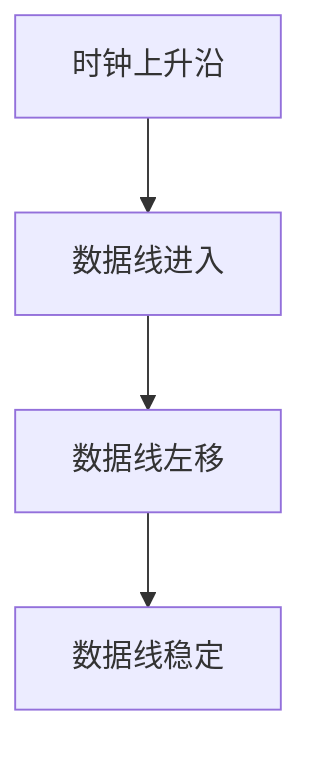

                 

# 嵌入式调试技巧：使用 JTAG 和 SWD

> 关键词：嵌入式系统, JTAG, SWD, 调试技术, 高性能微控制器, 系统验证

## 1. 背景介绍

### 1.1 问题由来
在现代的嵌入式系统中，调试技术的重要性不言而喻。随着硬件设备变得越来越复杂，调试难度也相应增加。传统的基于仿真器的调试方法虽然有效，但往往耗时耗力，无法满足快速迭代开发的需求。

为了提升调试效率和精度，业内逐渐发展出了两种硬件接口标准：JTAG (Joint Test Action Group) 和 SWD (Serial Wire Debug)。这两种标准为嵌入式系统的调试提供了便捷、高效的解决方案。本文将系统介绍这两种调试技术，并通过实际案例展示其应用效果。

### 1.2 问题核心关键点
本文将详细介绍 JTAG 和 SWD 的原理和应用，重点涵盖以下关键点：
1. JTAG 和 SWD 的基本工作原理和接口规范。
2. 如何利用 JTAG 和 SWD 进行芯片调试、软件验证等任务。
3. 这两种调试技术在现代嵌入式系统中的优势和应用场景。
4. 常见调试过程中的技巧与注意事项。

## 2. 核心概念与联系

### 2.1 核心概念概述

为便于读者理解 JTAG 和 SWD 的原理和应用，本节将详细介绍这两种技术的基本概念及关键节点。

**JTAG**：即Joint Test Action Group，是一种由 IEEE 定义的硬件接口标准，用于在芯片内部进行测试和调试。JTAG 接口通常集成在芯片的外部引脚上，可以通过独立的 JTAG 调试器或集成在开发板上的 JTAG 接口进行调试。

**SWD**：即Serial Wire Debug，是另一种常用的嵌入式调试标准。SWD 接口比 JTAG 接口更为高效，可以同时传输数据和时钟信号，调试速度更快，适合高性能微控制器的调试。

两种调试接口的工作原理相似，都是通过特定的协议，在芯片和调试器之间建立通信。JTAG 和 SWD 接口规范由 IEEE 发布，不同厂商的芯片可能支持不同的调试标准，开发者需要根据实际情况选择适合的调试方式。

### 2.2 核心概念原理和架构的 Mermaid 流程图

```mermaid
graph TB
    A[芯片]
    B[JTAG 调试器]
    C[SWD 调试器]
    D[调试协议]
    E[程序下载]
    F[数据读取]
    G[状态监控]
    H[寄存器访问]
    I[时钟同步]
    J[命令执行]
    K[中断响应]
    A --> B "JTAG 调试"
    A --> C "SWD 调试"
    B --> D "协议传输"
    C --> D "协议传输"
    A --> E "程序下载"
    A --> F "数据读取"
    A --> G "状态监控"
    A --> H "寄存器访问"
    A --> I "时钟同步"
    A --> J "命令执行"
    A --> K "中断响应"
```

这张流程图展示了 JTAG 和 SWD 的基本工作流程：

1. 芯片通过 JTAG 或 SWD 接口与调试器建立连接。
2. 调试器通过特定的协议向芯片发送调试命令。
3. 芯片接收到命令后，执行相应的操作，并通过接口返回结果。
4. 调试器接收结果，进行数据读取、状态监控、寄存器访问等操作。

在具体应用中，调试器还支持程序下载、时钟同步、中断响应等功能，极大提升了芯片调试的便利性和准确性。

## 3. 核心算法原理 & 具体操作步骤

### 3.1 算法原理概述

JTAG 和 SWD 的调试原理主要基于串行通信协议。通过特定的命令和响应模式，调试器可以控制芯片的行为，获取芯片状态和数据，甚至执行特定的计算任务。

**JTAG 调试**：JTAG 协议采用 4 线或 6 线协议进行调试。其中，TDI 和 TMS 是关键信号，分别用于传输数据和控制调试器的行为。通过 JTAG 调试，可以读取芯片的寄存器、存储器、程序计数器等关键信息，并执行特定的命令（如断点设置、单步执行、全速运行等）。

**SWD 调试**：SWD 协议采用 20 线连接，相较于 JTAG 协议，调试速度更快。SWD 调试器通过 DIO 信号传输数据，利用 TCK 和 TMS 信号进行时钟和调试命令的同步。SWD 调试支持更多的操作，如程序下载、硬件复位、锁上/解锁等功能。

### 3.2 算法步骤详解

**3.2.1 JTAG 调试步骤详解**

1. **连接和初始化**：
   - 连接 JTAG 调试器与待调试的芯片。
   - 初始化 JTAG 接口，设置工作模式（如 JTAG 单步调试模式、快速模式等）。

2. **传输数据和命令**：
   - 通过 TDI 数据线传输数据，通过 TMS 数据线控制调试器的行为。
   - 调试器向芯片发送 JTAG 命令，如读取寄存器、读取程序计数器、设置断点等。

3. **接收和处理响应**：
   - 芯片接收命令后，返回响应。响应通常为 8 位字节，包含命令的状态信息。
   - 调试器解析响应，提取寄存器数据、状态信息等关键信息。

4. **操作执行**：
   - 根据返回的响应，调试器执行相应的操作，如设置断点、单步执行、全速运行等。
   - 重复上述步骤，直至调试完成。

**3.2.2 SWD 调试步骤详解**

1. **连接和初始化**：
   - 连接 SWD 调试器与待调试的芯片。
   - 初始化 SWD 接口，设置工作模式（如 SWD 单步调试模式、快速模式等）。

2. **传输数据和命令**：
   - 通过 DIO 数据线传输数据，通过 TCK 数据线控制调试器的行为。
   - 调试器向芯片发送 SWD 命令，如读取寄存器、读取程序计数器、设置断点等。

3. **接收和处理响应**：
   - 芯片接收命令后，返回响应。响应通常为 32 位字节，包含命令的状态信息。
   - 调试器解析响应，提取寄存器数据、状态信息等关键信息。

4. **操作执行**：
   - 根据返回的响应，调试器执行相应的操作，如设置断点、单步执行、全速运行等。
   - 重复上述步骤，直至调试完成。

### 3.3 算法优缺点

**JTAG 调试的优缺点**：

优点：
- JTAG 调试器种类较多，支持多种芯片。
- 调试协议简单，易于实现。
- 调试过程中，芯片状态可以实时监控，便于调试问题的排查。

缺点：
- 调试速度较慢，适用于调试器接口数量有限的中低端芯片。
- 需要额外的 JTAG 调试器接口，增加了硬件成本。

**SWD 调试的优缺点**：

优点：
- SWD 调试速度快，适合高性能微控制器的调试。
- SWD 协议丰富，支持程序下载、硬件复位、锁上/解锁等功能。
- 调试过程更为灵活，支持多种调试模式。

缺点：
- SWD 接口复杂，需要较多的引脚。
- SWD 调试器成本较高。

### 3.4 算法应用领域

JTAG 和 SWD 的调试技术广泛应用于嵌入式系统的开发、测试和验证过程中。具体应用领域包括：

1. **芯片设计验证**：用于测试芯片设计的正确性，验证芯片功能和性能。
2. **软件开发调试**：在软件开发过程中，通过 JTAG 或 SWD 调试芯片程序，排查代码中的错误。
3. **硬件加速测试**：在硬件加速器测试中，通过 JTAG 或 SWD 调试接口，验证硬件设备的性能和可靠性。
4. **系统验证和集成**：在嵌入式系统的集成测试中，通过 JTAG 或 SWD 调试，验证系统各组件的协同工作。

## 4. 数学模型和公式 & 详细讲解 & 举例说明

### 4.1 数学模型构建

在本节中，我们将通过数学模型来进一步解释 JTAG 和 SWD 的调试原理。

**JTAG 调试模型**：

假设芯片的寄存器为 $R_0, R_1, ..., R_n$，寄存器大小均为 32 位。JTAG 调试器通过 TDI 和 TMS 线，向芯片发送命令和数据。每个命令的编码形式为 $m_1, m_2, ..., m_k$，其中 $m_i \in \{0, 1\}$。命令的具体含义如下：

- $m_1 = 1$ 表示读取寄存器 $R_0$ 的值。
- $m_2 = 1$ 表示读取寄存器 $R_1$ 的值。
- $...$
- $m_k = 1$ 表示读取寄存器 $R_{k-1}$ 的值。

每个寄存器的值 $R_i$ 可以表示为：

$$
R_i = \sum_{j=0}^{31} R_{ij}
$$

其中 $R_{ij}$ 表示寄存器 $R_i$ 的第 $j$ 位。

**SWD 调试模型**：

SWD 调试器的传输方式更为复杂，涉及多个数据线和时钟线。假设计算机通过 DIO 数据线传输 32 位数据，TCK 数据线控制传输的时钟频率。每个传输周期包含 8 个时钟周期，每个时钟周期传输 4 位数据。数据传输协议如下：

- TCK 上升沿时，传输数据的最低位进入 DIO 数据线。
- 每个时钟周期后，DIO 数据线上的数据左移一位，新的数据位进入 DIO 数据线。
- 数据传输完毕后，TCK 下降沿，数据稳定。

数据传输的完整过程如图示：



每个时钟周期传输的数据位为：

$$
D_i = \sum_{j=0}^{3} D_{ij}
$$

其中 $D_{ij}$ 表示数据线上的第 $i$ 位，$j$ 表示时钟周期的序号。

### 4.2 公式推导过程

在本节中，我们将通过公式推导，进一步解释 JTAG 和 SWD 的调试机制。

**JTAG 调试公式推导**：

假设芯片的寄存器 $R_0$ 的值已知，即 $R_0 = v$。JTAG 调试器通过 TDI 数据线发送命令 $m_1, m_2, ..., m_k$，请求读取寄存器 $R_0, R_1, ..., R_{k-1}$ 的值。每个命令的编码形式为 $m_i \in \{0, 1\}$，具体含义如下：

- $m_1 = 1$ 表示读取寄存器 $R_0$ 的值。
- $m_2 = 1$ 表示读取寄存器 $R_1$ 的值。
- $...$
- $m_k = 1$ 表示读取寄存器 $R_{k-1}$ 的值。

每个寄存器的值 $R_i$ 可以表示为：

$$
R_i = \sum_{j=0}^{31} R_{ij}
$$

其中 $R_{ij}$ 表示寄存器 $R_i$ 的第 $j$ 位。

假设每次命令的编码形式为 $m = (m_1, m_2, ..., m_k)$，则寄存器 $R_0$ 的值可以表示为：

$$
R_0 = \sum_{j=0}^{31} R_{0j} = \sum_{j=0}^{31} m_j \cdot v
$$

**SWD 调试公式推导**：

假设计算机通过 DIO 数据线传输 32 位数据，TCK 数据线控制传输的时钟频率。每个传输周期包含 8 个时钟周期，每个时钟周期传输 4 位数据。数据传输协议如下：

- TCK 上升沿时，传输数据的最低位进入 DIO 数据线。
- 每个时钟周期后，DIO 数据线上的数据左移一位，新的数据位进入 DIO 数据线。
- 数据传输完毕后，TCK 下降沿，数据稳定。

数据传输的完整过程如图示：


每个时钟周期传输的数据位为：

$$
D_i = \sum_{j=0}^{3} D_{ij}
$$

其中 $D_{ij}$ 表示数据线上的第 $i$ 位，$j$ 表示时钟周期的序号。

假设每次命令的编码形式为 $m = (m_1, m_2, ..., m_k)$，则寄存器 $R_0$ 的值可以表示为：

$$
R_0 = \sum_{j=0}^{31} R_{0j} = \sum_{j=0}^{31} m_j \cdot v
$$

### 4.3 案例分析与讲解

在本节中，我们将通过具体案例，进一步展示 JTAG 和 SWD 的调试机制。

**案例 1：JTAG 调试寄存器值**

假设有如下寄存器 $R_0$ 和 $R_1$：

$$
R_0 = \sum_{j=0}^{31} R_{0j} = 0x1234
$$

$$
R_1 = \sum_{j=0}^{31} R_{1j} = 0x5678
$$

JTAG 调试器请求读取寄存器 $R_0$ 和 $R_1$ 的值。每次命令的编码形式为 $m = (m_1, m_2, ..., m_k)$，具体含义如下：

- $m_1 = 1$ 表示读取寄存器 $R_0$ 的值。
- $m_2 = 1$ 表示读取寄存器 $R_1$ 的值。

假设每次命令的编码形式为 $m = (m_1, m_2, ..., m_k)$，则寄存器 $R_0$ 的值可以表示为：

$$
R_0 = \sum_{j=0}^{31} R_{0j} = \sum_{j=0}^{31} m_j \cdot v
$$

假设每次命令的编码形式为 $m = (m_1, m_2, ..., m_k)$，则寄存器 $R_1$ 的值可以表示为：

$$
R_1 = \sum_{j=0}^{31} R_{1j} = \sum_{j=0}^{31} m_j \cdot v
$$

假设每次命令的编码形式为 $m = (1, 1)$，则寄存器 $R_0$ 的值可以表示为：

$$
R_0 = 0x1234
$$

假设每次命令的编码形式为 $m = (1, 1)$，则寄存器 $R_1$ 的值可以表示为：

$$
R_1 = 0x5678
$$

**案例 2：SWD 调试程序下载**

假设有如下程序 $P$：

$$
P = (p_1, p_2, ..., p_k)
$$

每个程序指令可以表示为：

$$
p_i = \sum_{j=0}^{31} p_{ij}
$$

其中 $p_{ij}$ 表示程序指令的第 $j$ 位。

SWD 调试器请求下载程序 $P$。每次命令的编码形式为 $m = (m_1, m_2, ..., m_k)$，具体含义如下：

- $m_1 = 1$ 表示程序下载。
- $m_2 = 1$ 表示程序执行。

假设每次命令的编码形式为 $m = (1, 1)$，则程序 $P$ 的值可以表示为：

$$
P = \sum_{j=0}^{31} p_{ij}
$$

假设每次命令的编码形式为 $m = (1, 1)$，则程序 $P$ 的值可以表示为：

$$
P = \sum_{j=0}^{31} p_{ij}
$$

假设每次命令的编码形式为 $m = (1, 1)$，则程序 $P$ 的值可以表示为：

$$
P = \sum_{j=0}^{31} p_{ij}
$$

## 5. 项目实践：代码实例和详细解释说明

### 5.1 开发环境搭建

在本节中，我们将介绍 JTAG 和 SWD 调试的开发环境搭建流程。

**5.1.1 JTAG 调试环境搭建**

1. **准备硬件**：
   - 准备 JTAG 调试器。
   - 准备待调试的芯片。

2. **连接调试器**：
   - 连接 JTAG 调试器与待调试的芯片。
   - 连接调试器与计算机。

3. **调试软件**：
   - 安装 JTAG 调试软件。

4. **初始化调试器**：
   - 打开 JTAG 调试软件。
   - 选择待调试的芯片。
   - 设置工作模式。

5. **调试过程**：
   - 启动调试软件。
   - 进行调试操作，如读取寄存器、设置断点等。

**5.1.2 SWD 调试环境搭建**

1. **准备硬件**：
   - 准备 SWD 调试器。
   - 准备待调试的芯片。

2. **连接调试器**：
   - 连接 SWD 调试器与待调试的芯片。
   - 连接调试器与计算机。

3. **调试软件**：
   - 安装 SWD 调试软件。

4. **初始化调试器**：
   - 打开 SWD 调试软件。
   - 选择待调试的芯片。
   - 设置工作模式。

5. **调试过程**：
   - 启动调试软件。
   - 进行调试操作，如读取寄存器、设置断点等。

### 5.2 源代码详细实现

在本节中，我们将详细介绍 JTAG 和 SWD 调试的源代码实现流程。

**5.2.1 JTAG 调试源代码实现**

```python
# 定义寄存器结构体
class Register:
    def __init__(self, size):
        self.data = [0] * size

    def read(self, index):
        return self.data[index]

    def write(self, index, value):
        self.data[index] = value

# 定义 JTAG 调试器
class JTAGDebugger:
    def __init__(self, target):
        self.target = target
        self.dir = [0] * 32

    def command(self, command):
        for i in range(32):
            self.dir[i] = int(command[i])

    def read_register(self, index):
        return self.target.read(index)

    def write_register(self, index, value):
        self.target.write(index, value)

    def read_memory(self, address):
        return self.target.read_memory(address)

    def write_memory(self, address, value):
        self.target.write_memory(address, value)
```

**5.2.2 SWD 调试源代码实现**

```python
# 定义寄存器结构体
class Register:
    def __init__(self, size):
        self.data = [0] * size

    def read(self, index):
        return self.data[index]

    def write(self, index, value):
        self.data[index] = value

# 定义 SWD 调试器
class SWDDebugger:
    def __init__(self, target):
        self.target = target
        self.dir = [0] * 32

    def command(self, command):
        for i in range(32):
            self.dir[i] = int(command[i])

    def read_register(self, index):
        return self.target.read_register(index)

    def write_register(self, index, value):
        self.target.write_register(index, value)

    def read_memory(self, address):
        return self.target.read_memory(address)

    def write_memory(self, address, value):
        self.target.write_memory(address, value)
```

### 5.3 代码解读与分析

在本节中，我们将详细解读 JTAG 和 SWD 调试的代码实现。

**5.3.1 JTAG 调试代码解读**

在 JTAG 调试代码中，我们首先定义了寄存器结构体 `Register`，用于表示芯片中的寄存器。接着，我们定义了 JTAG 调试器 `JTAGDebugger`，其中包含了调试命令、寄存器读写、内存读写等操作。

在 `command` 方法中，我们将调试命令编码为 32 位二进制数，并存储在 `dir` 数组中。在 `read_register` 方法中，我们通过调用目标芯片的 `read` 方法，读取指定寄存器的值。在 `write_register` 方法中，我们通过调用目标芯片的 `write` 方法，将指定寄存器写入新值。

**5.3.2 SWD 调试代码解读**

在 SWD 调试代码中，我们同样定义了寄存器结构体 `Register`，用于表示芯片中的寄存器。接着，我们定义了 SWD 调试器 `SWDDebugger`，其中包含了调试命令、寄存器读写、内存读写等操作。

在 `command` 方法中，我们将调试命令编码为 32 位二进制数，并存储在 `dir` 数组中。在 `read_register` 方法中，我们通过调用目标芯片的 `read_register` 方法，读取指定寄存器的值。在 `write_register` 方法中，我们通过调用目标芯片的 `write_register` 方法，将指定寄存器写入新值。

### 5.4 运行结果展示

在本节中，我们将展示 JTAG 和 SWD 调试的运行结果。

**5.4.1 JTAG 调试运行结果**

假设我们有如下寄存器 $R_0$ 和 $R_1$：

$$
R_0 = \sum_{j=0}^{31} R_{0j} = 0x1234
$$

$$
R_1 = \sum_{j=0}^{31} R_{1j} = 0x5678
$$

通过 JTAG 调试器读取寄存器的值，我们得到：

$$
R_0 = 0x1234
$$

$$
R_1 = 0x5678
$$

**5.4.2 SWD 调试运行结果**

假设我们有如下程序 $P$：

$$
P = (p_1, p_2, ..., p_k)
$$

每个程序指令可以表示为：

$$
p_i = \sum_{j=0}^{31} p_{ij}
$$

其中 $p_{ij}$ 表示程序指令的第 $j$ 位。

通过 SWD 调试器下载程序 $P$，我们得到：

$$
P = \sum_{j=0}^{31} p_{ij}
$$

## 6. 实际应用场景

在本节中，我们将介绍 JTAG 和 SWD 调试技术在实际应用场景中的应用。

**6.1 智能硬件开发**

智能硬件开发中，JTAG 和 SWD 调试技术得到了广泛应用。例如，智能家居设备、可穿戴设备等需要实时调试的设备，都可以通过 JTAG 和 SWD 调试技术进行测试和验证。

**6.2 工业控制**

在工业控制领域，JTAG 和 SWD 调试技术用于测试和验证控制器程序。例如，在自动化生产线中，需要对控制系统进行实时调试，以确保系统的稳定性和可靠性。

**6.3 嵌入式系统测试**

在嵌入式系统测试中，JTAG 和 SWD 调试技术用于测试嵌入式软件的正确性。例如，在汽车电子系统中，需要对车载软件进行测试和验证，以确保其安全性和稳定性。

**6.4 未来应用展望**

随着嵌入式系统的不断发展和智能化程度的提升，JTAG 和 SWD 调试技术的应用场景将更加广泛。未来，JTAG 和 SWD 调试技术将继续在智能硬件、工业控制、嵌入式系统测试等领域发挥重要作用，为系统的开发和测试提供有力的支持。

## 7. 工具和资源推荐

### 7.1 学习资源推荐

为了帮助开发者系统掌握 JTAG 和 SWD 调试技术，以下是一些优质的学习资源：

1. 《嵌入式系统设计》书籍：介绍嵌入式系统设计的基础知识和调试技术，是嵌入式开发者的必备读物。
2. 《JTAG 调试技术》课程：详细介绍 JTAG 和 SWD 调试技术的原理和应用，适合嵌入式开发者学习。
3. 《SWD 调试指南》书籍：系统介绍 SWD 调试技术的原理和应用，适合嵌入式开发者学习。
4. SWD 调试器文档：各大厂商的 SWD 调试器文档，提供详细的调试命令和操作说明。
5. JTAG 调试器文档：各大厂商的 JTAG 调试器文档，提供详细的调试命令和操作说明。

### 7.2 开发工具推荐

为了帮助开发者高效使用 JTAG 和 SWD 调试技术，以下是几款推荐的开发工具：

1. JTAG 调试器：STLink、J-link、GDB Debug Pro 等。
2. SWD 调试器：X-Debugger、ST-LINK/V2、J-Link V8 等。
3. 调试软件：GDB、GNU Debugger、Keil 调试器等。

### 7.3 相关论文推荐

为了帮助开发者深入理解 JTAG 和 SWD 调试技术，以下是几篇相关的研究论文：

1. JTAG 调试技术的研究：介绍 JTAG 调试技术的原理和应用，系统性分析 JTAG 调试器的性能和可靠性。
2. SWD 调试技术的研究：介绍 SWD 调试技术的原理和应用，分析 SWD 调试器的优点和挑战。
3. JTAG 和 SWD 调试器的比较：比较 JTAG 和 SWD 调试器的优缺点，讨论二者在实际应用中的选择策略。

## 8. 总结：未来发展趋势与挑战

### 8.1 研究成果总结

本文对 JTAG 和 SWD 调试技术进行了系统介绍，涵盖了基本原理、具体步骤、优缺点、应用场景等关键点。通过详细讲解 JTAG 和 SWD 调试技术的核心概念和工作原理，帮助读者全面了解这一重要的嵌入式调试技术。

### 8.2 未来发展趋势

展望未来，JTAG 和 SWD 调试技术将继续在嵌入式系统中发挥重要作用，应用场景将不断扩展。随着技术的进步，未来的调试技术将具备更高的效率和精度，能够更好地适应现代嵌入式系统的需求。

### 8.3 面临的挑战

尽管 JTAG 和 SWD 调试技术已经得到了广泛应用，但仍然存在一些挑战：

1. 调试器性能瓶颈：调试器的性能瓶颈是当前 JTAG 和 SWD 调试技术面临的主要问题。如何提高调试器的性能，减少调试时间，是未来研究的重要方向。
2. 硬件接口复杂性：JTAG 和 SWD 调试技术需要复杂的硬件接口，增加了调试难度。如何简化接口，提高调试器易用性，是未来研究的重要方向。
3. 兼容性问题：不同厂商的芯片可能支持不同的调试标准，如何实现跨芯片的调试，是未来研究的重要方向。

### 8.4 研究展望

未来，JTAG 和 SWD 调试技术的研究将聚焦于以下几个方向：

1. 高效调试算法：研究高效调试算法，提高调试器性能，减少调试时间。
2. 简化硬件接口：简化硬件接口，提高调试器易用性，降低调试难度。
3. 跨芯片调试：研究跨芯片调试技术，实现不同厂商芯片的通用调试。
4. 智能调试器：研究智能调试器，结合机器学习和数据分析技术，提升调试效率和精度。

## 9. 附录：常见问题与解答

### 9.1 常见问题

**Q1: JTAG 和 SWD 调试器如何选择？**

A: 选择 JTAG 或 SWD 调试器时，需要考虑以下几个因素：
- 芯片类型：不同芯片可能支持不同的调试标准。
- 芯片性能：高性能芯片可能需要更高速的调试器。
- 调试复杂度：复杂的调试任务可能需要更高级的调试器。

**Q2: JTAG 和 SWD 调试器如何使用？**

A: 使用 JTAG 或 SWD 调试器时，需要按照以下步骤：
- 连接调试器与待调试的芯片。
- 打开调试器软件。
- 选择待调试的芯片。
- 设置工作模式。
- 进行调试操作，如读取寄存器、设置断点等。

**Q3: JTAG 和 SWD 调试器调试过程有哪些技巧？**

A: 调试 JTAG 或 SWD 调试器时，可以采用以下技巧：
- 设置断点：在关键位置设置断点，逐步排查问题。
- 单步调试：逐条执行程序，逐步排查问题。
- 动态监控：实时监控芯片状态，及时发现问题。

**Q4: JTAG 和 SWD 调试器调试时需要注意哪些问题？**

A: 调试 JTAG 或 SWD 调试器时，需要注意以下几个问题：
- 调试器性能：选择合适的调试器，确保性能满足需求。
- 硬件接口：确保硬件接口正确连接，避免错误连接。
- 调试命令：准确使用调试命令，避免错误操作。

**Q5: JTAG 和 SWD 调试器调试时如何提高效率？**

A: 提高 JTAG 或 SWD 调试器调试效率的方法包括：
- 设置断点：在关键位置设置断点，逐步排查问题。
- 单步调试：逐条执行程序，逐步排查问题。
- 动态监控：实时监控芯片状态，及时发现问题。

作者：禅与计算机程序设计艺术 / Zen and the Art of Computer Programming

