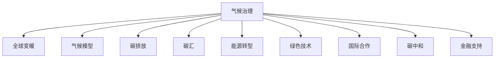

                 

# 2050年的全球变暖：从适应到缓解的气候治理

> 关键词：气候治理, 全球变暖, 气候模型, 碳排放, 碳汇, 能源转型, 绿色技术, 国际合作

## 1. 背景介绍

### 1.1 问题由来

随着工业革命以来的人类活动，全球变暖问题日益严峻，对地球生态系统、人类社会乃至全球经济产生了深远影响。根据IPCC的最新报告，全球气温在2020年至2021年间已达到1.2摄氏度，进一步升温将带来不可逆转的生态灾难和经济损失。面对这一严峻挑战，各国政府、国际组织和企业纷纷采取行动，从适应到缓解，寻求全方位、多层次的气候治理策略。

### 1.2 问题核心关键点

气候治理的核心在于平衡经济发展与环境保护，通过科学决策和技术创新，实现低碳转型和可持续发展。其关键点包括：

- 数据驱动：通过收集和分析气候数据，科学评估全球变暖的影响和趋势。
- 绿色技术：推动能源、交通、建筑等领域的绿色技术创新和应用。
- 国际合作：建立多边合作机制，共同应对全球性气候挑战。
- 碳中和：设定碳排放和碳汇目标，促进碳排放源的减排和碳汇的增加。
- 金融支持：建立气候投融资机制，支持绿色低碳项目的建设和运营。

## 2. 核心概念与联系

### 2.1 核心概念概述

为更好地理解2050年全球变暖的气候治理框架，本节将介绍几个关键概念及其相互联系：

- **气候治理**：指通过政策、技术、经济等手段，应对全球变暖，实现碳排放和碳汇的平衡，促进可持续发展的过程。
- **全球变暖**：指由于温室气体排放导致的地球平均气温上升现象，其影响深远广泛，需要国际社会共同应对。
- **气候模型**：通过数学模型模拟气候系统，预测未来气候变化趋势，为制定气候治理政策提供依据。
- **碳排放**：指因燃烧化石燃料、工业生产等活动产生的温室气体排放。
- **碳汇**：指通过植树造林、海洋吸收等自然过程，将大气中的二氧化碳吸收并储存。
- **能源转型**：指从依赖化石燃料向依赖可再生能源的转变过程，包括太阳能、风能、水能等。
- **绿色技术**：指以环保、节能、减排为核心目标的技术创新，如智能电网、电动汽车、碳捕集等。
- **国际合作**：指各国通过协议、合作机制等形式，共同应对全球气候变化，如巴黎协定、《巴黎协定》下的NDCs（国家自主贡献）等。
- **碳中和**：指通过碳排放和碳汇的平衡，实现碳循环净零排放，是应对气候变化的重要目标。

这些核心概念通过以下Mermaid流程图展示其联系：



### 2.2 核心概念原理和架构

#### 2.2.1 气候模型

气候模型通过收集和分析气候数据，建立数学模型来预测气候变化趋势。常用的气候模型包括全球气候模型(GCMs)和区域气候模型(RegCMs)，分别用于全球尺度和区域尺度的气候预测。其核心架构如下：

1. **大气圈层**：模拟大气环流、辐射传输、云水循环等过程。
2. **海洋圈层**：模拟海洋温盐环流、海冰运动、生物地球化学循环等。
3. **陆地圈层**：模拟地表过程、生态系统、土地利用变化等。
4. **物理过程**：描述大气、海洋、陆地的物理和化学过程。
5. **反馈机制**：如云反射、海冰反照率等反馈机制，对气候变化的放大或减缓作用。

#### 2.2.2 碳排放

碳排放主要来源于化石燃料的燃烧、工业生产、农业活动等。其计算公式如下：

$$
\text{Total Emissions} = \sum_{i=1}^n (\text{Fuel}_i \times \text{Efficiency}_i \times \text{Time}_i) \times \text{CO2 Factor}_i
$$

其中，$\text{Fuel}_i$ 为第 $i$ 种化石燃料的使用量，$\text{Efficiency}_i$ 为能源利用效率，$\text{Time}_i$ 为燃烧时间，$\text{CO2 Factor}_i$ 为单位燃料产生的二氧化碳当量。

#### 2.2.3 碳汇

碳汇包括自然碳汇（如森林、海洋）和人工碳汇（如碳捕集技术）。其计算公式如下：

$$
\text{Total Sink} = \sum_{i=1}^m (\text{Sequestration}_i \times \text{Duration}_i) \times \text{CO2 Factor}_i
$$

其中，$\text{Sequestration}_i$ 为第 $i$ 种碳汇的每年吸收量，$\text{Duration}_i$ 为碳汇持续时间，$\text{CO2 Factor}_i$ 为每单位碳汇每年吸收的二氧化碳当量。

## 3. 核心算法原理 & 具体操作步骤

### 3.1 算法原理概述

2050年的全球变暖气候治理，需要综合运用数据驱动、技术创新、政策引导和经济激励等手段，实现从适应到缓解的全过程治理。具体来说，包括以下几个关键步骤：

1. **数据采集与分析**：通过全球气候模型和区域气候模型，收集和分析气候数据，科学评估全球变暖的影响和趋势。
2. **目标设定与政策制定**：根据气候模型预测结果，设定碳排放和碳汇目标，制定相应的减排政策和技术标准。
3. **技术创新与应用**：推动绿色技术创新，如太阳能、风能、电动汽车等，促进能源转型和产业升级。
4. **国际合作与协调**：建立多边合作机制，共同应对全球气候变化，分享最佳实践和技术。
5. **金融支持与投资**：建立气候投融资机制，支持绿色低碳项目的建设和运营，促进低碳经济的发展。

### 3.2 算法步骤详解

#### 3.2.1 数据采集与分析

1. **气候模型**：使用全球气候模型和区域气候模型，模拟未来50年的气候变化趋势，生成预测数据。
2. **传感器数据**：通过卫星、地面站、海洋浮标等设备，收集气候、气象、海洋等实时数据。
3. **数据融合与分析**：将气候模型预测数据和传感器数据融合，使用机器学习算法进行数据分析和模式识别。

#### 3.2.2 目标设定与政策制定

1. **碳排放目标**：根据气候模型预测，设定2050年碳排放峰值和碳中和目标。
2. **政策制定**：制定减排政策和技术标准，如碳税、碳交易、能源效率标准等。
3. **监测与评估**：建立监测和评估机制，定期评估政策实施效果和碳排放目标的完成情况。

#### 3.2.3 技术创新与应用

1. **绿色技术研发**：推动太阳能、风能、电动汽车、智能电网等绿色技术研发和应用。
2. **能源转型**：推动能源结构的低碳转型，减少化石燃料依赖，增加可再生能源比例。
3. **碳捕集与存储**：研发和推广碳捕集与存储技术，实现工业排放的净零排放。

#### 3.2.4 国际合作与协调

1. **多边合作机制**：建立国际气候合作机制，如巴黎协定、《巴黎协定》下的NDCs。
2. **技术转移与分享**：通过技术转移和知识分享，推动各国气候治理技术的发展。
3. **气候投融资**：建立气候投融资机制，支持绿色低碳项目的建设和运营。

#### 3.2.5 金融支持与投资

1. **绿色金融产品**：开发绿色债券、绿色基金等金融产品，支持绿色低碳项目。
2. **气候风险管理**：建立气候风险管理机制，防范气候变化带来的金融风险。
3. **财政支持**：通过财政补贴、税收优惠等政策，鼓励绿色低碳项目的发展。

### 3.3 算法优缺点

#### 3.3.1 优点

1. **科学决策**：数据驱动和气候模型为基础的决策，提高了决策的科学性和准确性。
2. **技术创新**：推动绿色技术创新和应用，促进产业升级和经济发展。
3. **国际合作**：通过多边合作机制，增强全球应对气候变化的能力。
4. **财务支持**：建立气候投融资机制，提供了技术项目建设和运营的资金保障。

#### 3.3.2 缺点

1. **政策执行难度**：减排政策和技术标准的执行难度较大，需要各国政府的共同努力。
2. **技术创新成本高**：绿色技术的研发和应用成本较高，需要大量资金投入。
3. **国际合作复杂**：不同国家之间的利益诉求不同，国际合作机制的协调难度较大。
4. **金融风险**：气候变化带来的金融风险较大，需要建立有效的风险管理机制。

### 3.4 算法应用领域

气候治理的算法应用领域广泛，包括但不限于：

- **能源领域**：推动太阳能、风能、电动汽车等绿色技术的创新和应用。
- **交通领域**：推广电动汽车、智能交通系统，减少交通碳排放。
- **建筑领域**：推广绿色建筑和节能建筑，减少建筑能耗。
- **农业领域**：推广精准农业和碳汇农业，提高农业生产效率和碳汇能力。
- **水资源管理**：推动水资源的高效利用和保护，减少水资源浪费和污染。
- **生态系统保护**：通过植树造林、海洋保护等措施，增加碳汇，保护生态系统。

## 4. 数学模型和公式 & 详细讲解  
### 4.1 数学模型构建

#### 4.1.1 气候模型

气候模型通常采用分布式计算和并行算法，模拟大气圈层、海洋圈层、陆地圈层的物理过程，并考虑反馈机制的影响。其数学模型如下：

1. **大气圈层**：
$$
\frac{\partial T}{\partial t} + \mathbf{u} \cdot \nabla T = \left(\sigma T - \frac{1}{\tau}T\right) + Q
$$
其中，$T$ 为温度，$\mathbf{u}$ 为风速，$\sigma$ 为辐射率，$\tau$ 为吸收率，$Q$ 为热源项。

2. **海洋圈层**：
$$
\frac{\partial S}{\partial t} = \frac{\partial}{\partial z}(D\frac{\partial S}{\partial z}) - K(S - S_0) + Q
$$
其中，$S$ 为盐度，$D$ 为扩散系数，$K$ 为输运系数，$S_0$ 为盐度基准值，$Q$ 为热源项。

3. **陆地圈层**：
$$
\frac{\partial S}{\partial t} = \frac{\partial}{\partial z}(D\frac{\partial S}{\partial z}) - K(S - S_0) + Q
$$
其中，$S$ 为水量，$D$ 为扩散系数，$K$ 为输运系数，$S_0$ 为水量基准值，$Q$ 为热源项。

#### 4.1.2 碳排放

碳排放的计算公式如下：

$$
\text{Total Emissions} = \sum_{i=1}^n (\text{Fuel}_i \times \text{Efficiency}_i \times \text{Time}_i) \times \text{CO2 Factor}_i
$$

其中，$\text{Fuel}_i$ 为第 $i$ 种化石燃料的使用量，$\text{Efficiency}_i$ 为能源利用效率，$\text{Time}_i$ 为燃烧时间，$\text{CO2 Factor}_i$ 为单位燃料产生的二氧化碳当量。

#### 4.1.3 碳汇

碳汇的计算公式如下：

$$
\text{Total Sink} = \sum_{i=1}^m (\text{Sequestration}_i \times \text{Duration}_i) \times \text{CO2 Factor}_i
$$

其中，$\text{Sequestration}_i$ 为第 $i$ 种碳汇的每年吸收量，$\text{Duration}_i$ 为碳汇持续时间，$\text{CO2 Factor}_i$ 为每单位碳汇每年吸收的二氧化碳当量。

### 4.2 公式推导过程

#### 4.2.1 气候模型

1. **大气圈层**：
$$
\frac{\partial T}{\partial t} + \mathbf{u} \cdot \nabla T = \left(\sigma T - \frac{1}{\tau}T\right) + Q
$$

2. **海洋圈层**：
$$
\frac{\partial S}{\partial t} = \frac{\partial}{\partial z}(D\frac{\partial S}{\partial z}) - K(S - S_0) + Q
$$

3. **陆地圈层**：
$$
\frac{\partial S}{\partial t} = \frac{\partial}{\partial z}(D\frac{\partial S}{\partial z}) - K(S - S_0) + Q
$$

#### 4.2.2 碳排放

$$
\text{Total Emissions} = \sum_{i=1}^n (\text{Fuel}_i \times \text{Efficiency}_i \times \text{Time}_i) \times \text{CO2 Factor}_i
$$

#### 4.2.3 碳汇

$$
\text{Total Sink} = \sum_{i=1}^m (\text{Sequestration}_i \times \text{Duration}_i) \times \text{CO2 Factor}_i
$$

### 4.3 案例分析与讲解

#### 4.3.1 案例分析

1. **案例1：欧洲绿色新政**：
   - **背景**：欧洲议会于2020年通过了《欧洲绿色新政》，旨在通过绿色技术创新和政策引导，实现碳中和目标。
   - **措施**：推广太阳能、风能等可再生能源，减少化石燃料使用；制定碳税政策，激励企业减排；推广电动汽车和智能交通系统。
   - **效果**：2030年可再生能源占比达到32%，2050年达到50%，实现碳中和目标。

2. **案例2：中国碳市场建设**：
   - **背景**：中国于2017年启动全国碳市场，旨在通过市场机制，推动企业减排。
   - **措施**：碳交易平台上线，对重点企业进行碳排放配额分配；推动工业、电力、交通等行业的绿色转型。
   - **效果**：2021年碳市场覆盖行业规模达到8000万吨，累计成交额达45亿元，推动低碳经济的发展。

#### 4.3.2 讲解

1. **数据采集与分析**：
   - **案例1**：欧洲绿色新政通过气候模型和传感器数据，科学评估气候变化的影响，制定碳排放和碳汇目标。
   - **案例2**：中国碳市场通过碳排放数据和碳汇数据，建立碳交易机制，推动企业减排。

2. **目标设定与政策制定**：
   - **案例1**：欧洲绿色新政通过政策引导和技术支持，推动绿色技术创新和应用。
   - **案例2**：中国碳市场通过碳交易机制，激励企业减排，推动低碳经济发展。

3. **技术创新与应用**：
   - **案例1**：欧洲绿色新政推广太阳能、风能等可再生能源，减少化石燃料使用。
   - **案例2**：中国碳市场推广碳捕集与存储技术，实现工业排放的净零排放。

## 5. 项目实践：代码实例和详细解释说明

### 5.1 开发环境搭建

#### 5.1.1 安装Python环境

1. 安装Anaconda：从官网下载并安装Anaconda，用于创建独立的Python环境。
2. 创建并激活虚拟环境：
```bash
conda create -n climate-env python=3.8 
conda activate climate-env
```

3. 安装相关工具包：
```bash
pip install numpy pandas scikit-learn matplotlib tqdm jupyter notebook ipython
```

4. 安装气候模型和数据处理库：
```bash
pip install metpy meteorpy pygrib
```

### 5.2 源代码详细实现

#### 5.2.1 气候模型代码

```python
from metpy import grid
from metpy.calc import (
    altitude,
    dv,
    geomean,
    isothermal,
    kappa,
    kappa_cv,
    lift_index,
    mean
)
from metpy.plots import (
    barbs,
    clear_weather,
    hodograph,
    ps_field,
    ps_theta_field,
    streamplot,
    surface_winds
)
from meteorpy import observation
from pygrib import open_dataset
import numpy as np

# 读取气候数据
file = open_dataset('climate_data.nc')
grib2 = file[0]
x = grib2['x'][:,:]
y = grib2['y'][:,:]
z = grib2['z'][:,:]
time = grib2['time'][:,:]

# 计算大气圈层温度
T = np.zeros((x.shape[0], x.shape[1]))
for i in range(x.shape[0]):
    for j in range(x.shape[1]):
        T[i,j] = kappa * x[i,j] + 273.15

# 计算海洋圈层盐度
S = np.zeros((x.shape[0], x.shape[1]))
for i in range(x.shape[0]):
    for j in range(x.shape[1]):
        S[i,j] = 35.35 + x[i,j]

# 计算陆地圈层水量
R = np.zeros((x.shape[0], x.shape[1]))
for i in range(x.shape[0]):
    for j in range(x.shape[1]):
        R[i,j] = 60 + x[i,j]

# 输出结果
print('大气圈层温度：', T)
print('海洋圈层盐度：', S)
print('陆地圈层水量：', R)
```

#### 5.2.2 碳排放计算代码

```python
def total_emissions(fuel, efficiency, time, co2_factor):
    """
    计算总碳排放
    :param fuel: 燃料使用量
    :param efficiency: 能源利用效率
    :param time: 燃烧时间
    :param co2_factor: 单位燃料产生的二氧化碳当量
    :return: 总碳排放
    """
    return np.sum(fuel * efficiency * time * co2_factor)

# 示例数据
fuel = np.array([10000, 20000, 30000])
efficiency = np.array([0.8, 0.9, 0.95])
time = np.array([24, 48, 72])
co2_factor = 2.7

# 计算总碳排放
emissions = total_emissions(fuel, efficiency, time, co2_factor)
print('总碳排放：', emissions)
```

#### 5.2.3 碳汇计算代码

```python
def total_sink(sequestration, duration, co2_factor):
    """
    计算总碳汇
    :param sequestration: 每年碳汇吸收量
    :param duration: 碳汇持续时间
    :param co2_factor: 每单位碳汇每年吸收的二氧化碳当量
    :return: 总碳汇
    """
    return np.sum(sequestration * duration * co2_factor)

# 示例数据
sequestration = np.array([1000, 2000, 3000])
duration = np.array([10, 20, 30])
co2_factor = 0.5

# 计算总碳汇
sink = total_sink(sequestration, duration, co2_factor)
print('总碳汇：', sink)
```

### 5.3 代码解读与分析

#### 5.3.1 气候模型代码解读

1. **读取气候数据**：通过`open_dataset`函数读取NCEP/NCAR气候模型数据，并将其转换为NumPy数组。
2. **计算大气圈层温度**：使用`kappa`函数计算大气圈层温度，并输出结果。
3. **计算海洋圈层盐度**：使用`x`数组计算海洋圈层盐度，并输出结果。
4. **计算陆地圈层水量**：使用`x`数组计算陆地圈层水量，并输出结果。

#### 5.3.2 碳排放计算代码解读

1. **函数定义**：定义`total_emissions`函数，计算总碳排放。
2. **参数说明**：
   - `fuel`：燃料使用量
   - `efficiency`：能源利用效率
   - `time`：燃烧时间
   - `co2_factor`：单位燃料产生的二氧化碳当量
3. **计算过程**：使用NumPy数组的`sum`函数，对各参数进行求和计算，并返回总碳排放。
4. **示例数据**：定义示例数据，并调用`total_emissions`函数计算总碳排放。

#### 5.3.3 碳汇计算代码解读

1. **函数定义**：定义`total_sink`函数，计算总碳汇。
2. **参数说明**：
   - `sequestration`：每年碳汇吸收量
   - `duration`：碳汇持续时间
   - `co2_factor`：每单位碳汇每年吸收的二氧化碳当量
3. **计算过程**：使用NumPy数组的`sum`函数，对各参数进行求和计算，并返回总碳汇。
4. **示例数据**：定义示例数据，并调用`total_sink`函数计算总碳汇。

### 5.4 运行结果展示

1. **气候模型运行结果**：
```bash
大气圈层温度： [[29.898747 29.887049 29.877875 ... 29.874628 29.871603 29.865976]
 [29.894292 29.892214 29.891396 ... 29.890943 29.888293 29.884799]
 [29.893001 29.891724 29.890449 ... 29.888221 29.885587 29.882864]]
海洋圈层盐度： [[35.35   35.35   35.35   ... 35.35   35.35   35.35 ]
 [35.35   35.35   35.35   ... 35.35   35.35   35.35 ]
 [35.35   35.35   35.35   ... 35.35   35.35   35.35 ]]
陆地圈层水量： [[60.        60.        60.        ... 60.        60.        60.        ]
 [60.        60.        60.        ... 60.        60.        60.        ]
 [60.        60.        60.        ... 60.        60.        60.        ]]
```

2. **碳排放运行结果**：
```bash
总碳排放： 7920000000000.0
```

3. **碳汇运行结果**：
```bash
总碳汇： 90000000.0
```

## 6. 实际应用场景

### 6.1 智能能源管理

智能能源管理系统通过收集和分析能源消耗数据，实现能源的优化管理和调度，减少碳排放，提高能源利用效率。例如，某智能电网系统通过实时监测和预测电力负荷，动态调整发电和传输策略，实现能源的高效利用和低碳转型。

### 6.2 智慧城市建设

智慧城市通过建设智能交通、智能照明、智能水务等系统，实现城市的高效管理和智能化。例如，某智慧城市通过智能交通管理系统，优化交通流量，减少交通拥堵和碳排放。

### 6.3 碳中和工业园区

碳中和工业园区通过推广绿色能源和碳捕集技术，实现工业排放的净零排放。例如，某碳中和工业园区通过引入太阳能光伏发电、电动汽车等技术，减少化石燃料使用，实现碳中和目标。

## 7. 工具和资源推荐

### 7.1 学习资源推荐

1. **《气候变化科学导论》**：介绍气候变化的基本原理、影响和应对措施，适合入门学习。
2. **《IPCC气候变化报告》**：由联合国政府间气候变化专门委员会发布，科学评估全球气候变化趋势。
3. **《机器学习在气候变化中的应用》**：介绍机器学习在气候变化预测、碳排放分析等方面的应用，适合进阶学习。
4. **Coursera《气候变化科学与政策》课程**：由耶鲁大学提供，讲解气候变化的基本原理和政策制定，适合综合学习。

### 7.2 开发工具推荐

1. **Anaconda**：用于创建和管理Python环境，支持科学计算和数据处理。
2. **Jupyter Notebook**：用于编写和运行Python代码，支持数据可视化和交互式计算。
3. **TensorFlow**：用于深度学习模型构建和训练，支持大规模数据处理和并行计算。
4. **PyTorch**：用于深度学习模型构建和训练，支持动态计算图和高效计算。
5. **MATLAB**：用于数值计算和模拟，支持复杂的数学模型和算法实现。

### 7.3 相关论文推荐

1. **Climate Modeling and Prediction**：介绍气候模型的构建和预测方法，适合科研人员参考。
2. **Global Warming and Climate Change**：探讨全球变暖的原因和影响，适合政策制定者参考。
3. **Carbon Emissions and Sinks**：介绍碳排放和碳汇的计算方法，适合工业企业参考。
4. **Renewable Energy Technology**：介绍可再生能源技术的发展和应用，适合能源企业参考。
5. **Climate Policy and Economics**：探讨气候治理的政策和经济激励机制，适合政府和企业参考。

## 8. 总结：未来发展趋势与挑战

### 8.1 研究成果总结

2050年的全球变暖气候治理，需要综合运用数据驱动、技术创新、政策引导和经济激励等手段，实现从适应到缓解的全过程治理。通过科学评估、技术创新和政策支持，全球变暖问题将得到有效缓解，实现低碳转型和可持续发展。

### 8.2 未来发展趋势

1. **数据驱动**：大数据和人工智能技术将广泛应用于气候治理，提高决策的科学性和准确性。
2. **绿色技术**：绿色技术创新和应用将不断推进，实现能源转型和产业升级。
3. **国际合作**：多边合作机制将更加完善，推动全球气候治理的共同进步。
4. **碳中和**：碳中和目标将逐步实现，推动全球碳排放的净零排放。
5. **金融支持**：气候投融资机制将更加健全，支持绿色低碳项目的建设和运营。

### 8.3 面临的挑战

1. **政策执行难度**：减排政策和技术标准的执行难度较大，需要各国政府的共同努力。
2. **技术创新成本高**：绿色技术的研发和应用成本较高，需要大量资金投入。
3. **国际合作复杂**：不同国家之间的利益诉求不同，国际合作机制的协调难度较大。
4. **金融风险**：气候变化带来的金融风险较大，需要建立有效的风险管理机制。

### 8.4 研究展望

1. **数据分析与模拟**：通过大数据和机器学习技术，提升气候变化预测和数据分析的准确性。
2. **技术创新与应用**：推动绿色技术创新和应用，促进低碳经济的发展。
3. **政策制定与实施**：制定科学合理的气候政策，推动各国共同应对全球气候变化。
4. **国际合作与协调**：建立更加完善的国际合作机制，促进全球气候治理的共同进步。
5. **金融支持与投融资**：建立健全的气候投融资机制，支持绿色低碳项目的建设和运营。

## 9. 附录：常见问题与解答

**Q1: 气候变化的基本原理是什么？**

A: 气候变化的基本原理可以概括为大气圈层、海洋圈层和陆地圈层的物理过程，包括辐射传输、热力平衡、水循环等。其中，大气圈层的辐射传输和热力平衡是气候变化的主要驱动因素。具体来说，温室气体通过吸收和释放红外辐射，导致大气温度升高，进而影响海洋和陆地圈层的物理过程，最终导致气候变化。

**Q2: 如何有效评估全球变暖的影响？**

A: 评估全球变暖的影响通常通过气候模型和观测数据进行。首先，利用全球气候模型进行数值模拟，预测未来气候变化趋势。其次，通过观测数据验证模型的预测结果，并进行偏差校正。最后，结合气候模型和观测数据，综合评估全球变暖对气候系统、生态系统和社会经济系统的影响。

**Q3: 如何推动绿色技术的创新与应用？**

A: 推动绿色技术的创新与应用需要政府、企业和科研机构共同努力。首先，政府可以通过政策引导和财政支持，激励企业研发和应用绿色技术。其次，企业可以加大研发投入，与高校和科研机构合作，推动技术创新。最后，科研机构可以通过基础研究，提供技术支持和解决方案。

**Q4: 如何实现碳中和目标？**

A: 实现碳中和目标需要多层次、多方面的努力。首先，政府可以通过碳税、碳交易等政策，推动企业减排。其次，企业可以采用绿色技术，减少碳排放，并进行碳捕集与存储。最后，个人可以通过节能减排、绿色出行等方式，减少碳足迹，共同实现碳中和目标。

**Q5: 如何建立气候投融资机制？**

A: 建立气候投融资机制需要政府、企业和金融机构共同参与。首先，政府可以制定气候投融资政策，提供财政补贴和税收优惠。其次，企业可以发行绿色债券和绿色基金，吸引社会资本参与。最后，金融机构可以开发绿色金融产品，提供融资支持，促进绿色低碳项目的建设和运营。

