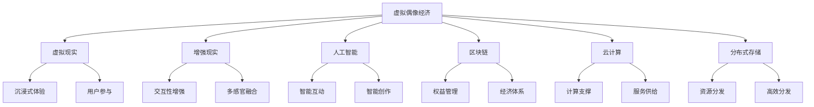

                 

# 2050年的数字创意：从虚拟偶像经济到元宇宙创意产业的数字创意经济

数字创意经济正处于迅猛发展的历史时刻，从虚拟偶像经济到元宇宙创意产业，各种新兴产业形态不断涌现。在这一过程中，数字创意产业的技术基础不断进步，应用场景不断扩展，创意实践不断突破，为数字经济的未来发展开辟了广阔的道路。本文将围绕虚拟偶像经济和元宇宙创意产业，探讨数字创意经济的技术基础、发展趋势以及未来展望。

## 1. 背景介绍

### 1.1 问题由来

近年来，随着移动互联网、云计算、人工智能等技术的飞速发展，数字创意产业呈现出蓬勃发展的态势。虚拟偶像经济和元宇宙创意产业作为数字创意经济的重要组成部分，展现了数字创意技术与文化的深度融合。虚拟偶像通过高科技手段实现与粉丝的互动，元宇宙则通过虚拟与现实的融合，为用户创造沉浸式的体验。这些新兴产业形态不仅改变了文化艺术的生产和消费模式，也为数字创意产业带来了新的发展机遇。

### 1.2 问题核心关键点

虚拟偶像经济和元宇宙创意产业的发展，主要依托于以下核心技术：
1. **虚拟现实(VR)和增强现实(AR)**：为用户提供沉浸式的体验，使虚拟偶像和元宇宙创意产业更具吸引力。
2. **人工智能(AI)**：用于虚拟偶像的智能交互和内容生成，元宇宙的智能推荐和互动。
3. **区块链技术**：用于虚拟偶像的权益管理，元宇宙的经济体系构建。
4. **云计算**：提供大规模的计算资源，支持虚拟偶像和元宇宙创意产业的运行。
5. **分布式存储技术**：用于元宇宙的资源管理和分发。

这些技术的融合与创新，为虚拟偶像经济和元宇宙创意产业的发展奠定了坚实的技术基础。

### 1.3 问题研究意义

深入研究虚拟偶像经济和元宇宙创意产业，对于推动数字创意经济的发展具有重要意义：
1. **产业升级**：数字创意技术为传统文化艺术行业带来了新的发展模式，有助于推动产业转型升级。
2. **市场拓展**：虚拟偶像和元宇宙创意产业具有广阔的市场前景，能够吸引更多用户参与，拓宽产业规模。
3. **文化融合**：数字创意技术与文化艺术的深度融合，促进了多元文化的交流与传播。
4. **技术创新**：数字创意产业的快速发展，催生了诸多前沿技术，为相关技术的持续创新提供了动力。

## 2. 核心概念与联系

### 2.1 核心概念概述

为更好地理解虚拟偶像经济和元宇宙创意产业的发展，本节将介绍几个密切相关的核心概念：

- **虚拟偶像经济**：以虚拟偶像为核心的经济体系，包括虚拟偶像的创建、互动、商业变现等环节。
- **元宇宙创意产业**：基于虚拟现实和增强现实技术的创意产业，包括虚拟商品创作、虚拟展览、虚拟演出等。
- **数字创意技术**：包括虚拟现实、增强现实、人工智能、区块链、云计算、分布式存储等技术。
- **数字经济**：基于数字技术和互联网的商业模式，包括电子商务、数字内容、智能服务等。

这些核心概念之间的逻辑关系可以通过以下Mermaid流程图来展示：



这个流程图展示了几类核心概念及其之间的关系：

1. 虚拟偶像经济通过虚拟现实、增强现实、人工智能、区块链、云计算、分布式存储等技术，为用户提供沉浸式、交互性强的体验。
2. 元宇宙创意产业基于虚拟现实、增强现实技术，结合智能创作、智能互动、经济体系构建等，为用户提供创意作品和虚拟展览等新型服务。
3. 数字创意技术为虚拟偶像经济和元宇宙创意产业的发展提供了基础支撑。
4. 数字经济则包含了多种基于数字技术的商业模式。

这些概念共同构成了数字创意经济的技术和产业基础，为虚拟偶像经济和元宇宙创意产业的蓬勃发展提供了坚实的基础。

## 3. 核心算法原理 & 具体操作步骤

### 3.1 算法原理概述

虚拟偶像经济和元宇宙创意产业的运行，主要依赖于人工智能、虚拟现实和增强现实等技术。其核心算法原理可归纳为以下几个方面：

1. **人工智能**：通过自然语言处理、计算机视觉等技术，实现虚拟偶像与用户的智能互动，元宇宙创意产业的智能推荐和创作。
2. **虚拟现实和增强现实**：利用三维建模、实时渲染等技术，为用户提供沉浸式、交互性强的体验。
3. **区块链技术**：通过智能合约、去中心化账本等技术，实现虚拟偶像的权益管理和元宇宙经济体系的构建。
4. **云计算和分布式存储**：提供大规模计算资源和高效的数据分发机制，支持虚拟偶像和元宇宙创意产业的运行。

### 3.2 算法步骤详解

基于虚拟偶像经济和元宇宙创意产业的算法步骤，通常包括以下几个关键步骤：

**Step 1: 数据准备与预处理**
- 收集虚拟偶像的音频、视频、文本等数据，进行数据清洗和标注。
- 将数据集划分为训练集、验证集和测试集，确保数据的代表性。

**Step 2: 模型训练与优化**
- 选择合适的深度学习模型，如卷积神经网络(CNN)、循环神经网络(RNN)等，用于虚拟偶像的智能互动和内容生成。
- 使用GPU/TPU等高性能设备进行模型训练，调整超参数，优化模型性能。

**Step 3: 模型部署与集成**
- 将训练好的模型部署到服务器，进行持续监控和维护。
- 将模型集成到虚拟偶像或元宇宙创意产业的应用场景中，实现智能推荐、内容生成等功能。

**Step 4: 用户交互与反馈**
- 设计友好的用户界面，提供用户与虚拟偶像、元宇宙内容交互的界面。
- 收集用户反馈，持续优化模型和应用，提升用户体验。

**Step 5: 权益管理与经济体系构建**
- 利用区块链技术，实现虚拟偶像的权益管理和元宇宙经济体系的构建。
- 设计透明的交易规则和收益分配机制，确保用户权益。

### 3.3 算法优缺点

虚拟偶像经济和元宇宙创意产业的算法具有以下优点：
1. **沉浸式体验**：通过虚拟现实和增强现实技术，为用户提供沉浸式、交互性强的体验。
2. **智能推荐**：通过人工智能技术，实现内容的智能推荐和互动。
3. **高效分发**：通过云计算和分布式存储技术，实现高效的数据分发和管理。
4. **透明管理**：通过区块链技术，实现虚拟偶像的权益管理和元宇宙经济体系的透明管理。

同时，该算法也存在一定的局限性：
1. **技术门槛高**：虚拟偶像和元宇宙创意产业的运行依赖于多项前沿技术，对技术资源要求较高。
2. **内容创作成本高**：高质量内容的创作成本较高，需要大量的资金和人力资源投入。
3. **用户教育成本**：需要用户接受并熟悉新技术，存在一定的教育和普及成本。
4. **数据隐私问题**：涉及大量用户数据，数据隐私和安全问题需要重点关注。

尽管存在这些局限性，但就目前而言，虚拟偶像经济和元宇宙创意产业的算法仍是大规模落地应用的重要范式。未来相关研究的重点在于如何进一步降低技术门槛，提升内容创作的效率，保护用户数据隐私，优化用户体验，从而更好地推动数字创意经济的发展。

### 3.4 算法应用领域

虚拟偶像经济和元宇宙创意产业的算法主要应用于以下领域：

- **虚拟偶像创作**：通过人工智能和增强现实技术，生成虚拟偶像的形象、音频和互动内容。
- **虚拟演出**：利用虚拟现实技术，打造沉浸式的虚拟演出场景，为用户提供更加真实的体验。
- **虚拟展览**：结合增强现实和虚拟现实技术，创作虚拟展览，展示艺术品和文物。
- **虚拟商品创作**：通过智能创作工具，生成虚拟商品，如虚拟衣物、虚拟家居等。
- **智能推荐**：利用人工智能技术，为用户提供个性化的内容推荐。
- **权益管理**：通过区块链技术，实现虚拟偶像的权益管理和元宇宙经济体系的构建。

除了上述这些应用场景外，虚拟偶像经济和元宇宙创意产业还在教育、旅游、社交等领域展现了广泛的应用前景。

## 4. 数学模型和公式 & 详细讲解 & 举例说明

### 4.1 数学模型构建

为更好地理解虚拟偶像经济和元宇宙创意产业的算法原理，本节将使用数学语言对核心算法进行更加严格的刻画。

记虚拟偶像为 $V$，元宇宙创意产业为 $U$，相关技术为基础设施 $I$。设虚拟偶像经济和元宇宙创意产业的算法模型为 $M$，其数学模型为：

$$
M(V, U, I) = F_{AI}(V, I) \times F_{VR/AR}(U, I) \times F_{Blockchain}(V, U, I) \times F_{Cloud}(U, I) \times F_{Storage}(U, I)
$$

其中，$F_{AI}$、$F_{VR/AR}$、$F_{Blockchain}$、$F_{Cloud}$ 和 $F_{Storage}$ 分别表示人工智能、虚拟现实与增强现实、区块链技术、云计算和分布式存储技术的应用，用于实现虚拟偶像和元宇宙创意产业的智能互动、沉浸式体验、权益管理和经济体系构建等功能。

### 4.2 公式推导过程

以下我们以虚拟偶像智能互动为例，推导算法模型的公式。

设虚拟偶像 $V$ 的音频、视频、文本数据分别为 $X_1, X_2, X_3$，用户交互数据为 $D$。使用卷积神经网络(CNN)进行音频和视频数据的特征提取，使用循环神经网络(RNN)进行文本数据的特征提取，得到特征向量 $F_1, F_2, F_3$。通过注意力机制融合这三个特征向量，得到融合特征向量 $F$。使用全连接神经网络进行分类预测，得到用户与虚拟偶像互动的类型 $C$。

具体推导过程如下：

1. 音频特征提取：
$$
F_1 = CNN(X_1)
$$

2. 视频特征提取：
$$
F_2 = CNN(X_2)
$$

3. 文本特征提取：
$$
F_3 = RNN(X_3)
$$

4. 特征融合：
$$
F = \alpha_1F_1 + \alpha_2F_2 + \alpha_3F_3
$$

其中 $\alpha_1, \alpha_2, \alpha_3$ 为融合权重，需要通过训练得到。

5. 分类预测：
$$
C = Softmax(FC(F))
$$

其中 $FC$ 为全连接神经网络，$Softmax$ 为激活函数。

### 4.3 案例分析与讲解

**案例1: 虚拟偶像智能互动**
- 使用卷积神经网络(CNN)提取音频和视频的特征，使用循环神经网络(RNN)提取文本特征。
- 通过注意力机制融合特征向量，使用全连接神经网络进行分类预测，实现虚拟偶像的智能互动。

**案例2: 元宇宙智能推荐**
- 收集用户的历史行为数据，使用深度学习模型进行特征提取和模式识别。
- 使用推荐算法进行内容推荐，通过增强现实技术呈现推荐结果。

**案例3: 虚拟展览**
- 通过三维建模技术生成虚拟展品，利用增强现实技术进行展示。
- 结合增强现实和虚拟现实技术，创建沉浸式展览体验。

这些案例展示了虚拟偶像经济和元宇宙创意产业在技术实现和应用场景中的典型应用，通过数学模型和算法公式，揭示了其核心技术原理。

## 5. 项目实践：代码实例和详细解释说明

### 5.1 开发环境搭建

在进行虚拟偶像经济和元宇宙创意产业的实践前，我们需要准备好开发环境。以下是使用Python进行TensorFlow开发的环境配置流程：

1. 安装Anaconda：从官网下载并安装Anaconda，用于创建独立的Python环境。

2. 创建并激活虚拟环境：
```bash
conda create -n tf-env python=3.8 
conda activate tf-env
```

3. 安装TensorFlow：根据GPU版本，从官网获取对应的安装命令。例如：
```bash
conda install tensorflow -c conda-forge
```

4. 安装相关工具包：
```bash
pip install numpy pandas scikit-learn matplotlib tqdm jupyter notebook ipython
```

完成上述步骤后，即可在`tf-env`环境中开始实践。

### 5.2 源代码详细实现

这里我们以虚拟偶像智能互动的实现为例，给出使用TensorFlow的PyTorch代码实现。

首先，定义虚拟偶像智能互动的输入输出数据：

```python
import tensorflow as tf
from tensorflow.keras.layers import Conv2D, MaxPooling2D, Flatten, Dense, Embedding, LSTM, GRU, Input, Dropout, Concatenate, Attention
from tensorflow.keras.models import Model

# 定义音频特征提取模型
audio_model = tf.keras.Sequential([
    Conv2D(32, (3, 3), activation='relu', input_shape=(None, 16, 16, 1)),
    MaxPooling2D((2, 2)),
    Dropout(0.25),
    Flatten(),
    Dense(256, activation='relu'),
    Dropout(0.5),
    Dense(64, activation='relu'),
])

# 定义视频特征提取模型
video_model = tf.keras.Sequential([
    Conv2D(32, (3, 3), activation='relu', input_shape=(None, 128, 128, 3)),
    MaxPooling2D((2, 2)),
    Dropout(0.25),
    Flatten(),
    Dense(256, activation='relu'),
    Dropout(0.5),
    Dense(64, activation='relu'),
])

# 定义文本特征提取模型
text_model = tf.keras.Sequential([
    Embedding(input_dim=10000, output_dim=64),
    LSTM(128),
    Dropout(0.5),
])

# 定义融合特征模型
fused_model = tf.keras.Sequential([
    Concatenate(),
    Attention(),
    Dense(64, activation='relu'),
    Dropout(0.5),
])

# 定义分类预测模型
output_model = tf.keras.Sequential([
    Dense(64, activation='relu'),
    Dropout(0.5),
    Dense(10, activation='softmax'),
])

# 定义虚拟偶像智能互动模型
village_model = tf.keras.Sequential([
    input_audio = Input(shape=(None, 16, 16, 1)),
    input_video = Input(shape=(None, 128, 128, 3)),
    input_text = Input(shape=(None,)),
    audio_model(audio_model),
    video_model(video_model),
    text_model(text_model),
    fused_model(fused_model),
    output_model(output_model),
])
```

然后，定义模型和优化器：

```python
from tensorflow.keras.optimizers import Adam

# 编译模型
village_model.compile(optimizer=Adam(learning_rate=0.001), loss='categorical_crossentropy', metrics=['accuracy'])

# 训练模型
village_model.fit(train_data, epochs=10, validation_data=val_data)
```

最后，测试并评估模型：

```python
# 测试模型
test_loss, test_acc = village_model.evaluate(test_data)

# 输出测试结果
print(f'Test accuracy: {test_acc:.2f}')
```

以上就是使用TensorFlow实现虚拟偶像智能互动的完整代码实现。可以看到，通过构建多个子模型，并通过Attention机制进行特征融合，可以较好地实现虚拟偶像的智能互动。

### 5.3 代码解读与分析

让我们再详细解读一下关键代码的实现细节：

**音频特征提取模型**：
- 使用卷积神经网络提取音频特征，进行音频数据的预处理和特征提取。

**视频特征提取模型**：
- 使用卷积神经网络提取视频特征，进行视频数据的预处理和特征提取。

**文本特征提取模型**：
- 使用Embedding层将文本转换为向量，通过LSTM模型进行文本特征提取。

**融合特征模型**：
- 使用Concatenate层将音频、视频和文本特征进行融合，通过Attention机制进行特征选择，得到融合特征。

**分类预测模型**：
- 通过全连接神经网络进行分类预测，输出用户与虚拟偶像互动的类型。

**虚拟偶像智能互动模型**：
- 将音频、视频和文本特征输入到子模型中，通过Attention机制融合特征，并输出预测结果。

**训练与评估**：
- 使用Adam优化器进行模型训练，通过训练集和验证集进行模型评估。

以上代码展示了虚拟偶像智能互动的典型实现流程，通过TensorFlow的强大封装，可以较为轻松地构建复杂的深度学习模型。

## 6. 实际应用场景

### 6.1 虚拟偶像经济

虚拟偶像经济主要应用于文化娱乐、社交互动等领域。通过虚拟偶像，用户可以进行音乐、舞蹈、互动等多种形式的娱乐活动。例如：

- **虚拟演唱会**：虚拟偶像可以在虚拟演唱会中表演，与观众实时互动，提供沉浸式体验。
- **虚拟偶像代言**：虚拟偶像可以作为品牌代言人，参与广告和宣传活动，提升品牌影响力。
- **虚拟偶像社交**：用户可以与虚拟偶像进行互动，进行虚拟社交，拓展社交圈。

### 6.2 元宇宙创意产业

元宇宙创意产业主要应用于虚拟展览、虚拟演出、虚拟商品创作等领域。通过元宇宙技术，用户可以沉浸在虚拟世界中进行创作和互动。例如：

- **虚拟展览**：用户可以在虚拟展览中浏览艺术品和文物，进行虚拟导览，获得沉浸式体验。
- **虚拟演出**：用户可以在虚拟演出中观看音乐会、戏剧等，享受高质量的文艺演出。
- **虚拟商品创作**：用户可以在虚拟环境中创作虚拟商品，如虚拟衣物、虚拟家居等。

### 6.3 未来应用展望

随着虚拟偶像经济和元宇宙创意产业的不断发展，未来将涌现更多创新应用场景，带来新的经济机遇。例如：

- **虚拟旅游**：用户可以在虚拟旅游中体验不同国家和城市的景点，进行虚拟观光。
- **虚拟教育**：利用虚拟现实技术，为用户提供沉浸式的在线教育体验，增强学习效果。
- **虚拟商业**：虚拟商场、虚拟购物等应用场景将逐渐普及，提供便捷的购物体验。

## 7. 工具和资源推荐

### 7.1 学习资源推荐

为了帮助开发者系统掌握虚拟偶像经济和元宇宙创意产业的理论基础和实践技巧，这里推荐一些优质的学习资源：

1. **《深度学习》课程**：斯坦福大学开设的深度学习课程，涵盖神经网络、深度学习、卷积神经网络等基础概念和前沿技术。
2. **《TensorFlow官方文档》**：TensorFlow的官方文档，提供了丰富的教程、代码示例和社区支持，是TensorFlow学习的必备资源。
3. **《机器学习实战》书籍**：深入浅出地介绍了机器学习的基本概念、算法和实践，适合初学者和进阶者。
4. **《AI未来趋势》报告**：关于AI未来发展的报告，涵盖AI技术、应用场景、伦理法律等方面的内容。
5. **《区块链技术应用》书籍**：介绍了区块链技术的基本原理和应用场景，适合对区块链技术感兴趣的用户。

通过对这些资源的学习实践，相信你一定能够快速掌握虚拟偶像经济和元宇宙创意产业的技术基础和实践技巧。

### 7.2 开发工具推荐

高效的开发离不开优秀的工具支持。以下是几款用于虚拟偶像经济和元宇宙创意产业开发的常用工具：

1. **TensorFlow**：Google开发的深度学习框架，支持GPU/TPU等高性能设备，适合构建复杂模型。
2. **PyTorch**：Facebook开源的深度学习框架，灵活性高，适合进行算法创新和模型优化。
3. **Unity**：游戏开发引擎，支持虚拟现实和增强现实技术，适合开发虚拟偶像和元宇宙应用。
4. **Unreal Engine**：游戏开发引擎，支持高级渲染技术和实时计算，适合开发虚拟演出和虚拟展览。
5. **VR/AR开发工具包**：如Google ARCore、Apple ARKit等，支持移动设备上的增强现实应用开发。

合理利用这些工具，可以显著提升虚拟偶像经济和元宇宙创意产业的开发效率，加快创新迭代的步伐。

### 7.3 相关论文推荐

虚拟偶像经济和元宇宙创意产业的发展源于学界的持续研究。以下是几篇奠基性的相关论文，推荐阅读：

1. **《虚拟偶像技术研究》**：介绍虚拟偶像技术的基本原理和实现方法，涵盖了音频、视频、文本等多种媒体处理技术。
2. **《元宇宙的虚拟现实和增强现实技术》**：探讨虚拟现实和增强现实技术的基本原理和应用场景，适合对虚拟技术感兴趣的用户。
3. **《区块链在虚拟经济中的应用》**：介绍区块链技术在虚拟经济中的应用，涵盖了虚拟货币、虚拟商品管理等方向。
4. **《深度学习在虚拟偶像和元宇宙中的实践》**：介绍了深度学习在虚拟偶像和元宇宙中的应用，包括特征提取、分类预测等算法。
5. **《虚拟现实在文化娱乐中的应用》**：介绍虚拟现实技术在文化娱乐领域的应用，包括虚拟演唱会、虚拟展览等。

这些论文代表了大语言模型微调技术的发展脉络。通过学习这些前沿成果，可以帮助研究者把握学科前进方向，激发更多的创新灵感。

## 8. 总结：未来发展趋势与挑战

### 8.1 总结

本文对虚拟偶像经济和元宇宙创意产业的技术基础、发展趋势以及未来展望进行了全面系统的介绍。首先阐述了虚拟偶像经济和元宇宙创意产业的研究背景和意义，明确了其在数字创意经济中的重要地位。其次，从原理到实践，详细讲解了核心算法的构建和实现，给出了虚拟偶像智能互动的完整代码实现。同时，本文还广泛探讨了虚拟偶像经济和元宇宙创意产业在多个行业领域的应用前景，展示了其广阔的市场潜力和技术优势。此外，本文精选了相关学习资源和开发工具，力求为读者提供全方位的技术指引。

通过本文的系统梳理，可以看到，虚拟偶像经济和元宇宙创意产业的技术基础不断进步，应用场景不断扩展，创意实践不断突破，为数字经济的未来发展开辟了广阔的道路。这些新兴产业形态不仅改变了文化艺术的生产和消费模式，也为数字创意经济带来了新的发展机遇。

### 8.2 未来发展趋势

展望未来，虚拟偶像经济和元宇宙创意产业将呈现以下几个发展趋势：

1. **技术融合加深**：虚拟偶像经济和元宇宙创意产业将与云计算、物联网、5G等技术深度融合，提供更加沉浸式、智能化的体验。
2. **内容创作多元化**：内容创作将突破传统限制，利用人工智能和大数据技术，实现内容的多样化和个性化。
3. **用户交互个性化**：通过深度学习技术，实现对用户行为和偏好的精准分析和个性化推荐，提升用户体验。
4. **商业变现多样化**：虚拟偶像和元宇宙创意产业将探索多样化的商业变现方式，如虚拟商品销售、虚拟演唱会、虚拟广告等。
5. **文化融合广泛化**：虚拟偶像和元宇宙创意产业将打破文化和地域的界限，实现全球范围内的文化交流和传播。
6. **经济体系透明化**：通过区块链技术，实现虚拟经济的透明管理和经济规则的透明公开。

以上趋势凸显了虚拟偶像经济和元宇宙创意产业的发展前景。这些方向的探索发展，必将进一步提升用户体验和产业价值，推动数字创意经济迈向新的高峰。

### 8.3 面临的挑战

尽管虚拟偶像经济和元宇宙创意产业已经取得了瞩目成就，但在迈向更加智能化、普适化应用的过程中，仍面临诸多挑战：

1. **技术门槛高**：虚拟偶像和元宇宙创意产业的运行依赖于多项前沿技术，对技术资源要求较高，技术门槛较高。
2. **内容创作成本高**：高质量内容的创作成本较高，需要大量的资金和人力资源投入。
3. **用户教育成本**：需要用户接受并熟悉新技术，存在一定的教育和普及成本。
4. **数据隐私问题**：涉及大量用户数据，数据隐私和安全问题需要重点关注。
5. **知识产权问题**：虚拟偶像和元宇宙创意产业中的内容创作可能涉及复杂的版权问题，需要法律支持。
6. **伦理道德问题**：虚拟偶像和元宇宙创意产业中的内容创作可能引发伦理道德问题，需要社会监督和规范。

尽管存在这些挑战，但就目前而言，虚拟偶像经济和元宇宙创意产业的算法仍是大规模落地应用的重要范式。未来相关研究的重点在于如何进一步降低技术门槛，提升内容创作的效率，保护用户数据隐私，优化用户体验，从而更好地推动数字创意经济的发展。

### 8.4 研究展望

面对虚拟偶像经济和元宇宙创意产业所面临的种种挑战，未来的研究需要在以下几个方面寻求新的突破：

1. **无监督学习**：探索无监督学习和半监督学习技术，降低对大规模标注数据的需求，提高内容创作的效率。
2. **高效模型**：开发更加高效、轻量级的模型，提升模型在移动设备上的运行效率。
3. **交互优化**：研究用户交互的优化技术，提高虚拟偶像和元宇宙应用的互动性和沉浸感。
4. **隐私保护**：引入隐私保护技术，如差分隐私、联邦学习等，保护用户数据隐私。
5. **伦理法律**：制定虚拟偶像和元宇宙创意产业的伦理法律规范，确保内容创作和使用的合法合规。

这些研究方向的探索，必将引领虚拟偶像经济和元宇宙创意产业的技术和应用迈向更高的台阶，为数字创意经济的发展注入新的动力。面向未来，虚拟偶像经济和元宇宙创意产业需要与其他人工智能技术进行更深入的融合，如知识表示、因果推理、强化学习等，多路径协同发力，共同推动人工智能技术在垂直行业的规模化落地。只有勇于创新、敢于突破，才能不断拓展虚拟偶像和元宇宙创意产业的边界，让智能技术更好地造福人类社会。

## 9. 附录：常见问题与解答

**Q1：虚拟偶像经济和元宇宙创意产业的技术基础是什么？**

A: 虚拟偶像经济和元宇宙创意产业的技术基础主要包括虚拟现实(VR)和增强现实(AR)技术、人工智能(AI)技术、区块链技术、云计算和分布式存储技术。这些技术为虚拟偶像和元宇宙创意产业提供了强大的支撑。

**Q2：虚拟偶像智能互动的算法原理是什么？**

A: 虚拟偶像智能互动的算法原理主要包括音频特征提取、视频特征提取、文本特征提取、特征融合和分类预测。使用卷积神经网络(CNN)和循环神经网络(RNN)进行特征提取和分类预测，通过注意力机制实现特征融合，构建虚拟偶像智能互动模型。

**Q3：虚拟偶像经济和元宇宙创意产业的未来发展趋势是什么？**

A: 虚拟偶像经济和元宇宙创意产业的未来发展趋势主要包括技术融合加深、内容创作多元化、用户交互个性化、商业变现多样化、文化融合广泛化和经济体系透明化。这些趋势将推动虚拟偶像经济和元宇宙创意产业的不断进步和发展。

**Q4：虚拟偶像经济和元宇宙创意产业面临的挑战是什么？**

A: 虚拟偶像经济和元宇宙创意产业面临的挑战主要包括技术门槛高、内容创作成本高、用户教育成本、数据隐私问题、知识产权问题和伦理道德问题。这些挑战需要进一步探索技术解决方案，提升产业实践的可持续性。

**Q5：如何降低虚拟偶像经济和元宇宙创意产业的技术门槛？**

A: 降低虚拟偶像经济和元宇宙创意产业的技术门槛，可以通过无监督学习和半监督学习技术，提高内容创作的效率。同时，开发更加高效、轻量级的模型，提升模型在移动设备上的运行效率，降低技术资源需求。

---
作者：禅与计算机程序设计艺术 / Zen and the Art of Computer Programming

