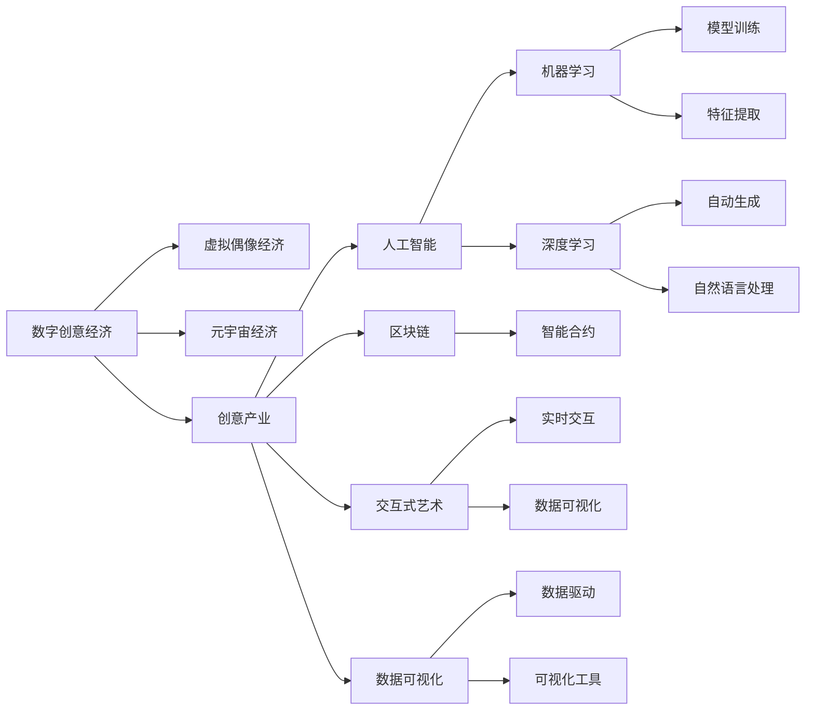

                 

# 2050年的数字创意：从虚拟偶像经济到元宇宙创意产业的数字创意经济

> 关键词：数字创意经济, 虚拟偶像, 元宇宙, 创意产业, 人工智能, 区块链, 交互式艺术, 数据可视化

## 1. 背景介绍

### 1.1 问题由来

随着数字技术的飞速发展，数字创意经济正在成为全球经济增长的新引擎。2050年，数字创意产业已经全面渗透到各个领域，成为推动社会发展的重要力量。虚拟偶像、元宇宙、交互式艺术等新型数字创意形式正在重新定义创意产业的边界和内涵。

### 1.2 问题核心关键点

- 数字创意经济：利用数字技术创造的新型经济形态，包括但不限于数字娱乐、虚拟设计、数字艺术、数字出版等。
- 虚拟偶像：基于人工智能、虚拟现实等技术创造的虚拟人物形象，作为文化娱乐和社交媒体的重要内容。
- 元宇宙：一种基于虚拟现实、区块链、云计算等技术构建的虚拟世界，实现数字身份、数字资产的深度融合。
- 创意产业：以创新为核心，将创意转换为商业价值的产业体系，涵盖广告、传媒、游戏、影视等多个领域。
- 人工智能：包括机器学习、深度学习、自然语言处理等技术，为数字创意提供强大的技术支撑。
- 区块链：用于安全记录、传输和管理数字资产的技术平台，保证数据透明度和可信度。
- 交互式艺术：利用数据可视化、实时交互等技术，创造可参与、可互动的视觉艺术作品。
- 数据可视化：通过图表、动画等形式，将数据转换为直观易懂的视觉表达，助力决策分析。

这些概念之间相互交织，共同构成了2050年数字创意经济的独特景观。

### 1.3 问题研究意义

研究数字创意经济及其发展趋势，对于理解未来经济形态、把握数字化转型机遇具有重要意义。数字创意不仅能够催生新的商业模式，还能够推动文化创新、技术进步和社会融合，是实现可持续发展的重要驱动力。

## 2. 核心概念与联系

### 2.1 核心概念概述

为更好地理解数字创意经济的本质和应用，本节将介绍几个核心概念及其相互之间的联系：

- 数字创意经济：基于数字技术创造的各类创意产品和服务的经济形态，具有高附加值、高创新性、高文化含量等特点。
- 虚拟偶像：利用人工智能、虚拟现实技术创造的虚拟人物形象，具备表演、互动、创作等多重功能，是数字创意经济的重要组成部分。
- 元宇宙：基于虚拟现实、区块链等技术构建的虚拟空间，为用户提供沉浸式体验和全新社交方式。
- 创意产业：通过创新将创意转换为商业价值的产业，涵盖创意设计、内容制作、媒介传播等多个环节。
- 人工智能：包括机器学习、深度学习等技术，为创意过程提供数据驱动、智能化的支持。
- 区块链：用于记录和传输数字资产，保证数据安全和透明度。
- 交互式艺术：通过数据可视化、实时交互等技术，提供全新的艺术创作和观赏体验。
- 数据可视化：将数据转换为视觉表达，提供直观、易于理解的信息展示，助力决策分析。

这些概念之间相互联系，共同构成了数字创意经济的完整生态。

### 2.2 核心概念原理和架构的 Mermaid 流程图



这张流程图展示了数字创意经济中各个概念之间的联系和相互作用。数字创意经济通过虚拟偶像、元宇宙、创意产业等多元化形式，融合人工智能、区块链、交互式艺术、数据可视化等技术，形成了一个复杂而动态的生态系统。

## 3. 核心算法原理 & 具体操作步骤

### 3.1 算法原理概述

数字创意经济的核心在于利用数字技术创造新的价值，其算法原理可以归纳为以下几个方面：

- **数字创意生成**：通过机器学习和深度学习技术，自动生成创意内容，如音乐、绘画、小说等。
- **虚拟现实与交互式艺术**：利用虚拟现实技术构建沉浸式体验，结合实时交互技术，提供动态化的艺术作品。
- **智能合约与区块链**：通过智能合约技术实现创意产权的自动化管理，区块链确保数据的安全和透明。
- **数据可视化与决策支持**：将复杂数据转换为直观易懂的视觉形式，辅助决策分析。

这些算法原理共同支撑了数字创意经济的多样化应用。

### 3.2 算法步骤详解

#### 3.2.1 数字创意生成

数字创意生成的核心是利用机器学习算法自动生成创意内容。以下是一个简单的图像生成模型的算法步骤：

1. 数据准备：收集大量训练数据，如图片、音乐、文字等。
2. 模型选择：选择适合的生成模型，如GANs、VAEs等。
3. 模型训练：在训练数据上对模型进行优化，使其能够生成高质量的创意内容。
4. 评估与优化：对生成结果进行评估，优化模型参数，提升生成效果。
5. 应用部署：将训练好的模型应用于实际场景，生成新的创意内容。

#### 3.2.2 虚拟现实与交互式艺术

虚拟现实和交互式艺术需要结合多种技术实现，以下是一个简单的交互式艺术项目的算法步骤：

1. 场景设计：设计虚拟现实场景，定义交互元素和交互逻辑。
2. 模型构建：利用三维建模技术创建虚拟场景，设置光照、材质等属性。
3. 实时渲染：使用实时渲染技术，实现虚拟场景的动态展示。
4. 交互控制：实现用户与虚拟场景的交互控制，如手势、语音等。
5. 反馈优化：根据用户反馈，优化交互体验和渲染效果。

#### 3.2.3 智能合约与区块链

智能合约与区块链的应用步骤如下：

1. 合约设计：定义智能合约的逻辑和功能，如版权交易、内容发布等。
2. 代码编写：编写智能合约的代码，并部署到区块链平台。
3. 数据上传：将创意内容上传到区块链，实现去中心化的记录和管理。
4. 合约执行：触发智能合约，自动执行创意产权的转移和交易。
5. 系统监控：监控智能合约的执行情况，确保系统安全稳定。

#### 3.2.4 数据可视化与决策支持

数据可视化的算法步骤如下：

1. 数据收集：收集相关数据，如用户行为、市场趋势等。
2. 数据清洗：对数据进行清洗，去除噪声和异常值。
3. 数据可视化：利用可视化工具，将数据转换为图表、地图等形式。
4. 数据分析：对可视化结果进行分析和解读，发现数据背后的规律和趋势。
5. 决策支持：将分析结果应用于决策支持，指导业务策略的制定。

### 3.3 算法优缺点

#### 3.3.1 数字创意生成

**优点**：
- 自动生成创意内容，大幅提高创作效率。
- 生成内容多样化，能够满足不同用户的个性化需求。

**缺点**：
- 可能缺乏创意的原创性和独特性。
- 需要大量的训练数据，对数据质量要求较高。

#### 3.3.2 虚拟现实与交互式艺术

**优点**：
- 提供沉浸式体验，增强用户参与感。
- 结合实时交互技术，实现动态内容更新。

**缺点**：
- 硬件成本较高，设备普及率有限。
- 开发复杂，技术门槛较高。

#### 3.3.3 智能合约与区块链

**优点**：
- 确保数据透明和安全，保护创意产权。
- 自动执行合约，减少人为干预，提升效率。

**缺点**：
- 开发成本较高，需要技术人才支持。
- 智能合约的安全性依赖于编程水平，存在潜在风险。

#### 3.3.4 数据可视化与决策支持

**优点**：
- 直观展示数据，辅助决策分析。
- 提供实时数据，支持动态决策。

**缺点**：
- 数据质量影响可视化效果。
- 对技术和工具的要求较高，需要专业人才支持。

### 3.4 算法应用领域

数字创意生成的算法可以应用于多种领域，如：

- **音乐创作**：利用机器学习自动生成音乐，提升创作效率。
- **图像生成**：通过深度学习生成艺术作品，探索新的视觉风格。
- **文本创作**：自动生成小说、新闻等文本内容，丰富内容创作。

虚拟现实与交互式艺术的算法可以应用于：

- **虚拟旅游**：提供沉浸式的旅游体验，增强用户参与感。
- **虚拟会议**：实现远程虚拟会议，提升沟通效率。
- **虚拟展览**：展示数字艺术作品，提供全新的观赏方式。

智能合约与区块链的算法可以应用于：

- **版权保护**：自动记录和管理创意产权，确保数据安全。
- **内容发布**：智能合约自动执行内容发布和交易，提升交易效率。
- **数字身份**：利用区块链记录和验证用户身份，提升安全性。

数据可视化与决策支持的算法可以应用于：

- **市场分析**：通过数据可视化，发现市场趋势和机会。
- **用户行为分析**：分析用户行为数据，优化产品设计。
- **运营管理**：通过实时数据，优化业务运营，提升管理效率。

## 4. 数学模型和公式 & 详细讲解 & 举例说明

### 4.1 数学模型构建

本节将使用数学语言对数字创意经济的算法原理进行更加严格的刻画。

**数字创意生成**：
假设输入为$x$，生成模型为$F$，输出为$y$，目标函数为$L$，则生成的概率分布$p(y|x)$可以表示为：
$$
p(y|x) = \frac{1}{Z}e^{-L(y|x)}
$$
其中$Z$为归一化因子，确保概率分布的总和为1。

**虚拟现实与交互式艺术**：
假设虚拟现实场景为$V$，交互元素为$I$，用户交互为$U$，则场景的交互效果$E$可以表示为：
$$
E = f(V, I, U)
$$
其中$f$为交互效果函数，$V$、$I$、$U$分别为虚拟现实场景、交互元素和用户交互。

**智能合约与区块链**：
假设智能合约逻辑为$C$，区块链平台为$B$，交易数据为$D$，则智能合约的执行效果$E'$可以表示为：
$$
E' = g(C, B, D)
$$
其中$g$为执行效果函数，$C$、$B$、$D$分别为智能合约逻辑、区块链平台和交易数据。

**数据可视化与决策支持**：
假设原始数据为$D'$，可视化工具为$T$，分析结果为$A$，则可视化的效果$E''$可以表示为：
$$
E'' = h(D', T, A)
$$
其中$h$为可视化效果函数，$D'$、$T$、$A$分别为原始数据、可视化工具和分析结果。

### 4.2 公式推导过程

#### 4.2.1 数字创意生成

对于GANs模型，其生成概率分布可以表示为：
$$
p(y|x) = \frac{1}{Z}e^{-L(y|x)} = \frac{1}{Z}e^{-||y - F(x)||^2}
$$
其中$L(y|x)$为损失函数，$||y - F(x)||$为生成样本与真实样本之间的距离。

#### 4.2.2 虚拟现实与交互式艺术

对于虚拟现实场景，其交互效果可以表示为：
$$
E = f(V, I, U) = \sum_{i=1}^{N}w_i\cdot f_i(V, I, U)
$$
其中$N$为交互元素的数量，$w_i$为权重，$f_i$为每个交互元素的函数。

#### 4.2.3 智能合约与区块链

对于智能合约，其执行效果可以表示为：
$$
E' = g(C, B, D) = \sum_{i=1}^{M}w_i\cdot g_i(C, B, D)
$$
其中$M$为交易类型数量，$w_i$为权重，$g_i$为每个交易类型的函数。

#### 4.2.4 数据可视化与决策支持

对于数据可视化，其效果可以表示为：
$$
E'' = h(D', T, A) = \sum_{i=1}^{K}w_i\cdot h_i(D', T, A)
$$
其中$K$为可视化类型数量，$w_i$为权重，$h_i$为每个可视化类型的函数。

### 4.3 案例分析与讲解

#### 4.3.1 数字创意生成

以音乐自动生成为例，假设输入为一段旋律$x$，输出为一段新的旋律$y$。利用GANs模型，可以将输入$x$映射到高维空间，通过生成器$G$生成新的旋律$y$，再通过判别器$D$对生成的旋律进行评估。训练过程中，不断优化生成器和判别器的参数，使得生成器能够生成高质量的旋律$y$，同时判别器能够准确区分真实旋律和生成旋律。

#### 4.3.2 虚拟现实与交互式艺术

以虚拟展览为例，假设输入为展品描述$x$，输出为虚拟展览场景$y$。利用虚拟现实技术，将展品描述转换为3D模型，设置光照、材质等属性，实现虚拟展览场景的动态展示。结合实时交互技术，用户可以通过手势、语音等控制虚拟展览中的展品，实现互动体验。

#### 4.3.3 智能合约与区块链

以版权保护为例，假设输入为原创作品$x$，输出为版权证明$y$。利用智能合约技术，将原创作品的版权信息自动记录在区块链上，实现去中心化的版权管理。用户可以通过区块链查询版权信息，验证作品的真伪，确保版权权益。

#### 4.3.4 数据可视化与决策支持

以市场分析为例，假设输入为市场数据$x$，输出为市场趋势分析$y$。利用数据可视化工具，将市场数据转换为图表、地图等形式，直观展示市场变化趋势。结合决策支持系统，帮助企业制定市场策略，提升决策效率。

## 5. 项目实践：代码实例和详细解释说明

### 5.1 开发环境搭建

在进行数字创意项目的开发前，我们需要准备好开发环境。以下是使用Python进行TensorFlow和PyTorch开发的环境配置流程：

1. 安装Anaconda：从官网下载并安装Anaconda，用于创建独立的Python环境。
2. 创建并激活虚拟环境：
```bash
conda create -n tf-env python=3.8 
conda activate tf-env
```

3. 安装TensorFlow和PyTorch：根据CUDA版本，从官网获取对应的安装命令。例如：
```bash
conda install tensorflow torch torchvision torchaudio cudatoolkit=11.1 -c pytorch -c conda-forge
```

4. 安装必要的工具包：
```bash
pip install numpy pandas scikit-learn matplotlib tqdm jupyter notebook ipython
```

完成上述步骤后，即可在`tf-env`环境中开始项目开发。

### 5.2 源代码详细实现

我们以音乐自动生成为例，给出使用TensorFlow对GANs模型进行训练的代码实现。

首先，定义GANs模型的结构：

```python
import tensorflow as tf

class GAN(tf.keras.Model):
    def __init__(self, input_dim):
        super(GAN, self).__init__()
        self.dense1 = tf.keras.layers.Dense(256, activation='relu')
        self.dense2 = tf.keras.layers.Dense(256, activation='relu')
        self.dense3 = tf.keras.layers.Dense(input_dim, activation='sigmoid')

    def call(self, inputs):
        x = self.dense1(inputs)
        x = self.dense2(x)
        x = self.dense3(x)
        return x
```

然后，定义GANs模型的训练函数：

```python
@tf.function
def train_gan(batch_size):
    real_images = tf.random.normal(shape=(batch_size, 784))
    noise = tf.random.normal(shape=(batch_size, 128))
    with tf.GradientTape() as t:
        generated_images = generator(noise, training=True)
        fake_labels = tf.zeros_like(generated_images)
        real_labels = tf.ones_like(generated_images)
        real_images_with_labels = tf.concat([real_images, real_labels], axis=1)
        fake_images_with_labels = tf.concat([generated_images, fake_labels], axis=1)
        fake_loss = discriminator(fake_images_with_labels, training=True)
        real_loss = discriminator(real_images_with_labels, training=True)
        discriminator_loss = real_loss + fake_loss
        discriminator_loss = tf.reduce_mean(discriminator_loss)
        generator_loss = discriminator(generated_images_with_labels, training=True)
        generator_loss = tf.reduce_mean(generator_loss)
    discriminator_grads = t.gradient(discriminator_loss, discriminator.trainable_variables)
    generator_grads = t.gradient(generator_loss, generator.trainable_variables)
    discriminator_optimizer.apply_gradients(zip(discriminator_grads, discriminator.trainable_variables))
    generator_optimizer.apply_gradients(zip(generator_grads, generator.trainable_variables))
```

最后，启动训练流程：

```python
epochs = 100
batch_size = 128

generator = GAN(input_dim=784)
discriminator = GAN(input_dim=784)
discriminator.trainable = False

generator_optimizer = tf.keras.optimizers.Adam(learning_rate=0.0002)
discriminator_optimizer = tf.keras.optimizers.Adam(learning_rate=0.0002)

for epoch in range(epochs):
    train_gan(batch_size)
    print(f"Epoch {epoch+1}/{epochs}")
```

以上就是使用TensorFlow对GANs模型进行音乐自动生成的代码实现。可以看到，利用TensorFlow的高级API，能够简洁高效地实现GANs模型的训练过程。

### 5.3 代码解读与分析

让我们再详细解读一下关键代码的实现细节：

**GANs模型结构**：
- 定义了一个三层的全连接神经网络，包括输入层、隐藏层和输出层。
- 输入层接收128维的随机噪声，隐藏层和输出层的激活函数分别为ReLU和Sigmoid。

**训练函数**：
- 定义了真实图像和噪声样本的生成，使用Adam优化器更新模型参数。
- 定义了生成器和判别器的损失函数，分别为真实样本的损失和生成样本的损失。
- 使用梯度反向传播算法计算生成器和判别器的梯度，更新模型参数。
- 循环迭代训练，输出当前epoch的进度。

**训练流程**：
- 定义总的训练轮数和批大小，开始循环迭代。
- 每次迭代中，生成真实图像和噪声样本，计算生成样本和真实样本的损失。
- 更新生成器和判别器的参数，确保生成样本逼近真实样本。
- 输出当前epoch的进度，不断迭代直至收敛。

通过以上代码实现，展示了TensorFlow在数字创意项目开发中的应用。TensorFlow的高级API使得模型开发和训练过程更加简洁高效，适合进行复杂的神经网络设计。

## 6. 实际应用场景

### 6.1 虚拟偶像经济

虚拟偶像经济是数字创意经济的重要组成部分，通过虚拟偶像的创作、推广和互动，形成新的商业模式。虚拟偶像不仅具备表演、互动、创作等多重功能，还能够跨越文化、地域等限制，吸引全球粉丝群体。

在实际应用中，可以通过微调大模型，自动生成虚拟偶像的音乐、舞蹈、对话等内容，实现个性化创作。结合虚拟现实技术，用户可以在虚拟偶像的虚拟空间中与其互动，进行虚拟演唱会、虚拟直播等活动。通过区块链技术，记录和验证虚拟偶像的创作和互动记录，确保数据的安全和透明。

### 6.2 元宇宙创意产业

元宇宙创意产业是数字创意经济的新兴领域，通过虚拟现实、区块链等技术构建虚拟世界，实现数字身份、数字资产的深度融合。元宇宙不仅提供沉浸式体验，还能够创造新的社交、娱乐、商业应用。

在实际应用中，可以利用数据可视化技术，展示元宇宙中的虚拟场景和用户行为。结合智能合约和区块链技术，实现创意产权的自动管理和交易。通过用户互动和创作，持续更新元宇宙内容，提升用户体验和粘性。

### 6.3 交互式艺术

交互式艺术是数字创意经济的创新形式，通过数据可视化、实时交互等技术，提供全新的艺术创作和观赏体验。交互式艺术不仅提供动态化的艺术作品，还能够结合用户反馈，实时调整艺术内容，提供个性化的创作体验。

在实际应用中，可以利用数据可视化工具，将艺术作品转换为互动形式，让用户参与到创作过程中。结合实时交互技术，提供动态化的艺术展示，增强用户参与感和体验感。通过区块链技术，记录和验证用户的创作过程和结果，确保数据的安全和透明。

## 7. 工具和资源推荐

### 7.1 学习资源推荐

为了帮助开发者系统掌握数字创意经济的相关知识，这里推荐一些优质的学习资源：

1. 《数字创意经济概论》书籍：介绍数字创意经济的基本概念和应用场景。
2. 《虚拟现实技术与应用》课程：介绍虚拟现实技术的基本原理和应用案例。
3. 《区块链技术与应用》课程：介绍区块链技术的基本原理和应用场景。
4. 《数据可视化技术》课程：介绍数据可视化工具和应用案例。
5. 《机器学习与深度学习》课程：介绍机器学习和深度学习的基本原理和应用场景。

通过对这些资源的学习实践，相信你一定能够系统掌握数字创意经济的核心知识，并用于解决实际的创意项目。

### 7.2 开发工具推荐

高效的开发离不开优秀的工具支持。以下是几款用于数字创意项目开发的常用工具：

1. TensorFlow：基于Python的开源深度学习框架，灵活动态的计算图，适合快速迭代研究。

2. PyTorch：基于Python的开源深度学习框架，动态计算图，适合复杂模型的开发和研究。

3. TensorBoard：TensorFlow配套的可视化工具，可实时监测模型训练状态，并提供丰富的图表呈现方式。

4. Weights & Biases：模型训练的实验跟踪工具，可以记录和可视化模型训练过程中的各项指标，方便对比和调优。

5. Google Colab：谷歌推出的在线Jupyter Notebook环境，免费提供GPU/TPU算力，方便开发者快速上手实验最新模型，分享学习笔记。

合理利用这些工具，可以显著提升数字创意项目的开发效率，加快创新迭代的步伐。

### 7.3 相关论文推荐

数字创意经济及其相关技术的研究源于学界的持续研究。以下是几篇奠基性的相关论文，推荐阅读：

1. 《数字创意经济：概念、发展和未来展望》：概述数字创意经济的基本概念和未来发展方向。
2. 《虚拟现实技术在数字创意中的应用》：介绍虚拟现实技术在数字创意中的应用案例和前沿技术。
3. 《区块链技术在创意产业中的应用》：介绍区块链技术在创意产业中的应用案例和未来展望。
4. 《数据可视化在创意设计中的应用》：介绍数据可视化技术在创意设计中的应用案例和前沿技术。
5. 《机器学习和深度学习在创意生成中的应用》：介绍机器学习和深度学习在创意生成中的应用案例和前沿技术。

这些论文代表了大创意技术的发展脉络。通过学习这些前沿成果，可以帮助研究者把握学科前进方向，激发更多的创新灵感。

## 8. 总结：未来发展趋势与挑战

### 8.1 总结

本文对数字创意经济及其发展趋势进行了全面系统的介绍。首先阐述了数字创意经济的基本概念和应用场景，明确了数字创意经济对未来经济形态和社会发展的重要意义。其次，从原理到实践，详细讲解了数字创意经济的核心算法和技术方法，展示了其在虚拟偶像、元宇宙、交互式艺术等多个领域的应用。最后，本文还提供了详细的代码实现和实际应用场景，帮助开发者深入理解数字创意经济的技术实现细节。

通过本文的系统梳理，可以看到，数字创意经济正在成为未来经济发展的关键动力，为社会带来深远的变革。数字创意不仅能够推动技术进步，还能够促进文化创新、社会融合，成为实现可持续发展的重要力量。

### 8.2 未来发展趋势

展望未来，数字创意经济将呈现以下几个发展趋势：

1. **技术融合**：数字创意经济将与物联网、人工智能、大数据等技术深度融合，形成新的产业生态。
2. **全球化**：数字创意产业将突破地域限制，形成全球化的市场和供应链体系。
3. **个性化**：数字创意产品将更加注重个性化和定制化，满足用户的多样化需求。
4. **可持续发展**：数字创意经济将更加注重环境保护和资源利用，实现可持续发展。
5. **跨领域融合**：数字创意将与医疗、教育、旅游等领域深度融合，推动各行业创新。
6. **创意产业化**：数字创意将进一步产业化，形成新的商业模式和价值链条。

这些趋势展示了数字创意经济的广阔前景，为未来的技术创新和产业升级提供了新的方向。

### 8.3 面临的挑战

尽管数字创意经济具有广阔的前景，但在发展过程中仍面临诸多挑战：

1. **技术门槛高**：数字创意技术涉及多种复杂的技术手段，对技术人才的需求较高。
2. **版权保护难**：数字创意作品容易受到盗版和侵权，保护版权权益具有较大难度。
3. **用户隐私**：数字创意项目涉及大量用户数据，需要严格保护用户隐私和数据安全。
4. **市场竞争**：数字创意市场竞争激烈，需要不断创新和优化，才能保持竞争优势。
5. **伦理问题**：数字创意作品可能存在伦理和道德问题，需要制定相关规范和标准。
6. **投资风险**：数字创意项目具有较高的不确定性，投资风险较大。

正视这些挑战，积极应对并寻求突破，将是数字创意经济走向成熟的关键。

### 8.4 研究展望

面对数字创意经济所面临的挑战，未来的研究需要在以下几个方面寻求新的突破：

1. **技术创新**：开发更加高效、易用的创意生成工具和技术平台，降低技术门槛，提高创作效率。
2. **版权保护**：利用区块链等技术，实现创意作品的自动记录和版权保护，确保权益安全。
3. **数据安全**：制定严格的数据隐私和安全保护措施，保护用户隐私和数据安全。
4. **市场竞争**：通过创新和优化，提升数字创意产品的质量和竞争力，保持市场领先地位。
5. **伦理规范**：制定数字创意作品的伦理规范和标准，确保作品内容的健康和正面。
6. **风险管理**：建立完善的投资风险管理机制，降低数字创意项目的投资风险。

这些研究方向的探索，必将引领数字创意经济走向更高的台阶，为社会带来更多的创新和价值。

## 9. 附录：常见问题与解答

**Q1：数字创意经济有哪些具体的应用场景？**

A: 数字创意经济涵盖了多种应用场景，包括但不限于：

1. **虚拟偶像**：基于人工智能和虚拟现实技术，创造虚拟偶像形象，进行音乐、舞蹈、互动等活动。
2. **元宇宙**：通过虚拟现实、区块链等技术构建虚拟世界，实现数字身份和数字资产的深度融合。
3. **交互式艺术**：利用数据可视化和实时交互技术，提供可参与、可互动的艺术作品。
4. **数字出版**：利用数字技术，实现内容的自动生成、分发和个性化推荐。
5. **游戏设计**：利用虚拟现实、增强现实等技术，创造沉浸式游戏体验。
6. **广告设计**：利用数据可视化和大数据分析，进行广告创意和效果评估。

这些应用场景展示了数字创意经济的广泛应用，为未来的创意产业提供了新的方向和机遇。

**Q2：数字创意经济中，如何保护创意作品的版权？**

A: 数字创意作品的版权保护可以通过以下方式实现：

1. **数字水印**：在作品中加入不可见的数字水印，用于版权标识和追踪。
2. **区块链技术**：利用区块链技术，记录创意作品的创作和传播过程，确保数据的透明和不可篡改。
3. **智能合约**：通过智能合约，实现创意产权的自动化管理和交易，保护作者权益。
4. **版权注册**：通过版权局注册创意作品，获得法律保护。
5. **版权标记**：在作品的元数据中加入版权标记，用于版权声明和维权。

通过这些方法，可以有效保护数字创意作品的版权权益，确保作品的合法使用和传播。

**Q3：数字创意经济对社会有何影响？**

A: 数字创意经济对社会的影响主要体现在以下几个方面：

1. **经济发展**：数字创意经济推动了新的经济形态和就业机会，成为经济发展的新引擎。
2. **文化创新**：数字创意技术促进了文化的创新和传播，丰富了文化产业的多样性。
3. **社会融合**：数字创意产品促进了跨文化、跨地域的交流和融合，提升了社会包容性。
4. **技术进步**：数字创意技术推动了人工智能、虚拟现实等新兴技术的发展。
5. **环境保护**：数字创意经济注重资源利用和环境保护，推动可持续发展。
6. **伦理规范**：数字创意作品需要遵循伦理规范，确保内容的健康和正面。

数字创意经济为社会的创新和进步提供了新的动力，具有深远的社会影响。

---

作者：禅与计算机程序设计艺术 / Zen and the Art of Computer Programming

