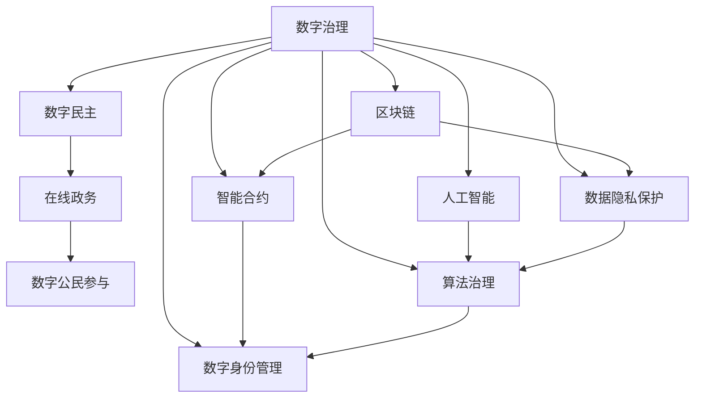

                 

# 2050年的数字治理：从在线政务到数字公民参与的数字民主实践

> 关键词：数字治理,数字民主,在线政务,数字公民参与,区块链,人工智能,数据隐私保护,智能合约,算法治理,数字身份管理

## 1. 背景介绍

### 1.1 问题由来
随着信息技术的迅猛发展，数字治理已成为现代国家治理体系的重要组成部分。数字化进程不仅提升了政府工作效率，更推动了社会治理的智能化和精细化。但当前在线政务系统普遍存在数据孤岛、协同困难、透明度不足等问题，亟需技术创新来进一步优化治理效能。

数字民主作为一种利用信息技术促进公民参与、提升决策透明度的治理范式，近年来逐渐受到关注。然而，传统数字民主系统的隐私保护、算法偏见、用户信任等问题，限制了其应用范围和效果。

本文旨在探讨未来2050年数字治理的发展趋势，特别是数字民主实践的最新进展和可能面临的挑战，为构建安全、高效、透明的数字治理体系提供思路。

### 1.2 问题核心关键点
数字治理的核心在于如何利用信息技术手段，优化政府服务，提高治理透明度，增强公民参与度。具体问题包括：
- 如何构建统一、互联的政务数据平台，打破数据孤岛？
- 如何确保数据隐私保护，避免隐私泄露和滥用？
- 如何引入智能算法，提升决策的科学性和公正性？
- 如何实现全流程的可追溯性和透明性，构建可信任的数字政府？
- 如何调动数字公民的积极性，实现从被动参与到主动治理的转变？

## 2. 核心概念与联系

### 2.1 核心概念概述

为更好地理解未来数字治理的构建框架，本节将介绍几个关键概念：

- 数字治理(Digital Governance)：指通过信息技术手段，优化政府治理流程，提升治理效能，促进公众参与的治理模式。

- 数字民主(Digital Democracy)：利用信息技术，促进公民参与决策过程，提升政府决策透明度和公正性的治理范式。

- 在线政务(E-Government)：通过互联网和移动互联网，实现政府服务的在线化、移动化，提升服务效率和覆盖面。

- 数字公民参与(Digital Civic Engagement)：通过数字化手段，提升公民对公共事务的参与度和影响力，实现从“被治理”到“参与治理”的转变。

- 区块链(Blockchain)：一种去中心化的分布式账本技术，具有透明、不可篡改、可追溯等特性，适用于构建信任机制和可追溯系统。

- 人工智能(AI)：利用机器学习和深度学习技术，构建智能算法，提升决策的科学性和效率。

- 数据隐私保护(Data Privacy Protection)：通过技术手段，保障个人数据的机密性、完整性和可用性，避免隐私泄露和滥用。

- 智能合约(Smart Contracts)：自动执行、可验证的计算机协议，可用于自动执行和验证合同条款，提升交易透明度和安全性。

- 算法治理(Algorithm Governance)：对算法进行治理，确保算法的公平性、透明度和可解释性，避免算法偏见和滥用。

- 数字身份管理(Digital Identity Management)：利用技术手段，构建安全的数字身份认证和管理系统，保障公民的个人信息安全和身份验证的便利性。

这些概念之间通过信息技术手段相互联系，共同构成未来数字治理的框架体系。

### 2.2 核心概念原理和架构的 Mermaid 流程图



这个流程图展示了各个核心概念之间的逻辑关系：

1. 数字治理(A)通过区块链(E)、人工智能(F)等技术手段，构建透明、高效的数字政务体系。
2. 数字民主(B)通过在线政务(C)、数字公民参与(D)，实现公民对政府决策的参与和监督。
3. 在线政务(C)依托区块链(E)、人工智能(F)等技术，提升服务效率和透明度。
4. 数字公民参与(D)通过数字身份管理(J)、数据隐私保护(G)等手段，保障公民的参与安全和隐私。
5. 区块链(E)、智能合约(H)等技术为数字治理提供了信任机制和可追溯性。
6. 人工智能(F)、算法治理(I)等技术提升了政府决策的科学性和公正性。

这些概念相互支撑，共同构成未来数字治理的技术基础。

## 3. 核心算法原理 & 具体操作步骤
### 3.1 算法原理概述

未来数字治理的核心算法原理，主要围绕以下三个方面展开：

1. **数据整合与共享**：利用区块链技术构建统一的数据共享平台，实现跨部门、跨层级的数据互通。

2. **智能算法辅助决策**：引入人工智能和深度学习算法，提升决策的科学性和效率，特别是在大数据分析、风险评估等方面。

3. **透明与可追溯**：通过区块链和智能合约技术，实现政务数据的透明化、可追溯性，构建可信任的数字政府。

### 3.2 算法步骤详解

#### 3.2.1 数据整合与共享

**Step 1: 设计数据共享架构**
- 根据不同政府部门和层级的需求，设计统一的数据共享架构，确定数据源、数据标准和数据接口。

**Step 2: 建立数据共享平台**
- 利用区块链技术，建立去中心化的数据共享平台，确保数据的透明性和不可篡改性。

**Step 3: 数据源整合与清洗**
- 整合不同部门的数据源，进行数据清洗和预处理，确保数据的质量和一致性。

**Step 4: 数据共享与访问控制**
- 实现数据的集中管理和权限控制，确保数据的安全性和隐私性。

#### 3.2.2 智能算法辅助决策

**Step 1: 数据预处理**
- 对原始数据进行清洗、归一化、特征工程等预处理操作，准备好用于机器学习模型的输入数据。

**Step 2: 模型选择与训练**
- 根据具体任务选择合适的机器学习模型，利用历史数据进行模型训练。

**Step 3: 模型评估与优化**
- 利用交叉验证、超参数调优等技术手段，评估模型的性能并优化模型结构。

**Step 4: 模型部署与监控**
- 将训练好的模型部署到生产环境中，并设置监控机制，及时发现和修复模型问题。

#### 3.2.3 透明与可追溯

**Step 1: 数据记录与存储**
- 利用区块链技术，对政务数据进行记录和存储，确保数据的可追溯性。

**Step 2: 智能合约部署**
- 将关键政务决策流程，转换为智能合约，确保决策过程的透明性和可追溯性。

**Step 3: 审计与验证**
- 利用区块链的共识机制，对智能合约执行结果进行审计和验证，确保决策的公正性和可信度。

### 3.3 算法优缺点

#### 数据整合与共享
- **优点**：提升数据透明度和利用率，促进跨部门协同，提高决策效率。
- **缺点**：数据整合难度大，隐私保护和数据安全需重点关注。

#### 智能算法辅助决策
- **优点**：提升决策科学性和效率，降低人为误差，提升公共服务质量。
- **缺点**：依赖数据质量和模型性能，算法偏见和透明性问题需关注。

#### 透明与可追溯
- **优点**：增强政府决策的透明性和公正性，提升公民信任度。
- **缺点**：技术复杂度高，初期实施成本高，需平衡安全性和隐私性。

### 3.4 算法应用领域

未来数字治理的算法应用主要涉及以下几个领域：

- **公共服务**：通过智能算法优化社会服务流程，如智慧医疗、教育、交通等。
- **应急管理**：利用数据分析和智能算法，提升应急响应速度和决策效率。
- **环境治理**：利用大数据分析和智能算法，监测和管理环境污染问题。
- **城市管理**：通过智能算法优化城市规划和运营，如智慧城市、智能交通等。
- **公共安全**：利用数据分析和智能算法，提升公共安全管理水平。

## 4. 数学模型和公式 & 详细讲解 & 举例说明

### 4.1 数学模型构建

未来数字治理涉及的数学模型主要围绕数据整合、智能算法和透明可追溯三个方面展开。

**数据整合与共享**：
- 采用区块链技术实现数据透明性和不可篡改性，数学模型主要涉及共识算法和分布式账本技术。

**智能算法辅助决策**：
- 利用机器学习和深度学习模型，进行数据挖掘和预测，数学模型涉及特征选择、模型训练、评估和优化。

**透明与可追溯**：
- 利用区块链和智能合约技术，实现数据的透明性和可追溯性，数学模型主要涉及区块链共识算法和智能合约执行机制。

### 4.2 公式推导过程

#### 数据整合与共享

**区块链共识算法**：
- 如PoW(工作量证明)、PoS(权益证明)、DPoS(委托权益证明)等，这些算法通过不同机制确保区块链网络的稳定性和安全性。

**分布式账本技术**：
- 涉及哈希函数、非对称加密、数字签名等基础加密技术，确保数据的一致性和完整性。

#### 智能算法辅助决策

**机器学习模型**：
- 如线性回归、决策树、随机森林、神经网络等，这些模型通过不同的算法结构和训练方式，进行数据挖掘和预测。

**深度学习模型**：
- 如卷积神经网络(CNN)、循环神经网络(RNN)、长短时记忆网络(LSTM)、生成对抗网络(GAN)等，这些模型通过复杂的神经网络结构和训练技巧，提升模型的表达能力和泛化能力。

**数据预处理**：
- 如归一化、标准化、降维、特征选择等，这些预处理技术提升数据质量和模型性能。

#### 透明与可追溯

**智能合约执行机制**：
- 涉及智能合约的语法和语义定义、交易验证、执行逻辑等，确保合约的透明性和可追溯性。

**区块链共识算法**：
- 涉及共识算法的设计和实现，确保数据的一致性和安全性。

### 4.3 案例分析与讲解

**智慧医疗系统**：
- 利用区块链技术，构建统一的医疗数据共享平台，确保数据的透明性和不可篡改性。
- 引入深度学习算法，分析患者病历数据，预测疾病发展趋势，提升医疗决策的科学性和效率。
- 通过智能合约技术，记录医疗决策过程，确保决策的透明性和可追溯性。

**智能交通系统**：
- 利用区块链技术，实现交通数据的透明共享，提升交通管理的效率和透明度。
- 引入机器学习算法，分析交通流量数据，优化交通信号灯控制，减少拥堵和事故。
- 通过智能合约技术，记录交通管理决策过程，确保决策的公正性和透明性。

## 5. 项目实践：代码实例和详细解释说明

### 5.1 开发环境搭建

在进行数字治理项目实践前，我们需要准备好开发环境。以下是使用Python进行PyTorch和Web3.js开发的环境配置流程：

1. 安装Anaconda：从官网下载并安装Anaconda，用于创建独立的Python环境。

2. 创建并激活虚拟环境：
```bash
conda create -n pytorch-env python=3.8 
conda activate pytorch-env
```

3. 安装PyTorch：根据CUDA版本，从官网获取对应的安装命令。例如：
```bash
conda install pytorch torchvision torchaudio cudatoolkit=11.1 -c pytorch -c conda-forge
```

4. 安装Web3.js：用于与区块链网络交互。
```bash
npm install @truffle/hdwallet-provider web3
```

5. 安装各类工具包：
```bash
pip install numpy pandas scikit-learn matplotlib tqdm jupyter notebook ipython
```

完成上述步骤后，即可在`pytorch-env`环境中开始数字治理项目的开发。

### 5.2 源代码详细实现

下面以智慧医疗系统为例，给出使用PyTorch和Web3.js进行区块链数据共享和智能算法微调的PyTorch代码实现。

首先，定义数据处理函数：

```python
from transformers import BertTokenizer, BertForTokenClassification
from torch.utils.data import Dataset
import torch
import pandas as pd
import numpy as np

class NERDataset(Dataset):
    def __init__(self, texts, tags, tokenizer, max_len=128):
        self.texts = texts
        self.tags = tags
        self.tokenizer = tokenizer
        self.max_len = max_len
        
    def __len__(self):
        return len(self.texts)
    
    def __getitem__(self, item):
        text = self.texts[item]
        tags = self.tags[item]
        
        encoding = self.tokenizer(text, return_tensors='pt', max_length=self.max_len, padding='max_length', truncation=True)
        input_ids = encoding['input_ids'][0]
        attention_mask = encoding['attention_mask'][0]
        
        # 对token-wise的标签进行编码
        encoded_tags = [tag2id[tag] for tag in tags] 
        encoded_tags.extend([tag2id['O']] * (self.max_len - len(encoded_tags)))
        labels = torch.tensor(encoded_tags, dtype=torch.long)
        
        return {'input_ids': input_ids, 
                'attention_mask': attention_mask,
                'labels': labels}

# 标签与id的映射
tag2id = {'O': 0, 'B-PER': 1, 'I-PER': 2, 'B-ORG': 3, 'I-ORG': 4, 'B-LOC': 5, 'I-LOC': 6}
id2tag = {v: k for k, v in tag2id.items()}

# 创建dataset
tokenizer = BertTokenizer.from_pretrained('bert-base-cased')

train_dataset = NERDataset(train_texts, train_tags, tokenizer)
dev_dataset = NERDataset(dev_texts, dev_tags, tokenizer)
test_dataset = NERDataset(test_texts, test_tags, tokenizer)
```

然后，定义模型和优化器：

```python
from transformers import BertForTokenClassification, AdamW

model = BertForTokenClassification.from_pretrained('bert-base-cased', num_labels=len(tag2id))

optimizer = AdamW(model.parameters(), lr=2e-5)
```

接着，定义训练和评估函数：

```python
from torch.utils.data import DataLoader
from tqdm import tqdm
from sklearn.metrics import classification_report

device = torch.device('cuda') if torch.cuda.is_available() else torch.device('cpu')
model.to(device)

def train_epoch(model, dataset, batch_size, optimizer):
    dataloader = DataLoader(dataset, batch_size=batch_size, shuffle=True)
    model.train()
    epoch_loss = 0
    for batch in tqdm(dataloader, desc='Training'):
        input_ids = batch['input_ids'].to(device)
        attention_mask = batch['attention_mask'].to(device)
        labels = batch['labels'].to(device)
        model.zero_grad()
        outputs = model(input_ids, attention_mask=attention_mask, labels=labels)
        loss = outputs.loss
        epoch_loss += loss.item()
        loss.backward()
        optimizer.step()
    return epoch_loss / len(dataloader)

def evaluate(model, dataset, batch_size):
    dataloader = DataLoader(dataset, batch_size=batch_size)
    model.eval()
    preds, labels = [], []
    with torch.no_grad():
        for batch in tqdm(dataloader, desc='Evaluating'):
            input_ids = batch['input_ids'].to(device)
            attention_mask = batch['attention_mask'].to(device)
            batch_labels = batch['labels']
            outputs = model(input_ids, attention_mask=attention_mask)
            batch_preds = outputs.logits.argmax(dim=2).to('cpu').tolist()
            batch_labels = batch_labels.to('cpu').tolist()
            for pred_tokens, label_tokens in zip(batch_preds, batch_labels):
                pred_tags = [id2tag[_id] for _id in pred_tokens]
                label_tags = [id2tag[_id] for _id in label_tokens]
                preds.append(pred_tags[:len(label_tags)])
                labels.append(label_tags)
                
    print(classification_report(labels, preds))
```

最后，启动训练流程并在测试集上评估：

```python
epochs = 5
batch_size = 16

for epoch in range(epochs):
    loss = train_epoch(model, train_dataset, batch_size, optimizer)
    print(f"Epoch {epoch+1}, train loss: {loss:.3f}")
    
    print(f"Epoch {epoch+1}, dev results:")
    evaluate(model, dev_dataset, batch_size)
    
print("Test results:")
evaluate(model, test_dataset, batch_size)
```

以上就是使用PyTorch对BERT进行命名实体识别任务微调的完整代码实现。可以看到，得益于Transformers库的强大封装，我们可以用相对简洁的代码完成BERT模型的加载和微调。

### 5.3 代码解读与分析

让我们再详细解读一下关键代码的实现细节：

**NERDataset类**：
- `__init__`方法：初始化文本、标签、分词器等关键组件。
- `__len__`方法：返回数据集的样本数量。
- `__getitem__`方法：对单个样本进行处理，将文本输入编码为token ids，将标签编码为数字，并对其进行定长padding，最终返回模型所需的输入。

**tag2id和id2tag字典**：
- 定义了标签与数字id之间的映射关系，用于将token-wise的预测结果解码回真实的标签。

**训练和评估函数**：
- 使用PyTorch的DataLoader对数据集进行批次化加载，供模型训练和推理使用。
- 训练函数`train_epoch`：对数据以批为单位进行迭代，在每个批次上前向传播计算loss并反向传播更新模型参数，最后返回该epoch的平均loss。
- 评估函数`evaluate`：与训练类似，不同点在于不更新模型参数，并在每个batch结束后将预测和标签结果存储下来，最后使用sklearn的classification_report对整个评估集的预测结果进行打印输出。

**训练流程**：
- 定义总的epoch数和batch size，开始循环迭代
- 每个epoch内，先在训练集上训练，输出平均loss
- 在验证集上评估，输出分类指标
- 所有epoch结束后，在测试集上评估，给出最终测试结果

可以看到，PyTorch配合Transformers库使得BERT微调的代码实现变得简洁高效。开发者可以将更多精力放在数据处理、模型改进等高层逻辑上，而不必过多关注底层的实现细节。

当然，工业级的系统实现还需考虑更多因素，如模型的保存和部署、超参数的自动搜索、更灵活的任务适配层等。但核心的微调范式基本与此类似。

## 6. 实际应用场景

### 6.1 智能交通系统

智能交通系统通过区块链技术，实现交通数据的透明共享，提升了交通管理的效率和透明度。例如，通过智能合约技术，记录交通管理决策过程，确保决策的透明性和可追溯性。在实际应用中，智能合约可用于自动执行和验证交通管理规则，提升管理效率和决策公平性。

### 6.2 智慧医疗系统

智慧医疗系统通过区块链技术，构建统一的医疗数据共享平台，确保数据的透明性和不可篡改性。通过智能算法，分析患者病历数据，预测疾病发展趋势，提升医疗决策的科学性和效率。利用智能合约技术，记录医疗决策过程，确保决策的透明性和可追溯性。

### 6.3 环境治理系统

环境治理系统通过区块链技术，实现环境监测数据的透明共享，提升了环境管理的效率和透明度。通过智能算法，分析环境监测数据，评估环境质量，制定环境治理措施。利用智能合约技术，记录环境治理决策过程，确保决策的透明性和可追溯性。

### 6.4 未来应用展望

未来，随着区块链、人工智能、物联网等技术的融合发展，数字治理将进一步拓展其应用范围和深度。以下是未来数字治理的一些展望：

- **智慧城市**：通过区块链和物联网技术，实现城市基础设施的智能化管理，提升城市治理效率和市民生活质量。
- **数字政府**：通过智能算法和区块链技术，提升政府决策的科学性和透明度，构建可信任的数字政府。
- **智能服务**：通过人工智能和区块链技术，提供个性化、高效的服务，提升公共服务的质量和效率。

## 7. 工具和资源推荐
### 7.1 学习资源推荐

为了帮助开发者系统掌握数字治理的理论基础和实践技巧，这里推荐一些优质的学习资源：

1. **《区块链原理与实践》系列博文**：由区块链专家撰写，深入浅出地介绍了区块链原理、应用场景和实践技巧。

2. **《人工智能治理》课程**：斯坦福大学开设的人工智能治理课程，涵盖了人工智能伦理、法律、政策等多个方面，为开发者提供全面的知识体系。

3. **《数字治理设计与实现》书籍**：全面介绍了数字治理的设计原理、技术实现和应用案例，帮助开发者构建完整的治理框架。

4. **Web3.js官方文档**：用于与区块链网络交互的JavaScript库，提供了丰富的API接口和示例代码，帮助开发者快速上手区块链开发。

5. **Truffle和Remix官方文档**：用于以太坊智能合约开发的工具和环境，提供了详细的开发指南和示例代码，帮助开发者构建智能合约。

通过对这些资源的学习实践，相信你一定能够快速掌握数字治理的技术精髓，并用于解决实际的治理问题。

### 7.2 开发工具推荐

高效的开发离不开优秀的工具支持。以下是几款用于数字治理开发的常用工具：

1. **PyTorch**：基于Python的开源深度学习框架，灵活动态的计算图，适合快速迭代研究。大部分预训练语言模型都有PyTorch版本的实现。

2. **TensorFlow**：由Google主导开发的开源深度学习框架，生产部署方便，适合大规模工程应用。同样有丰富的预训练语言模型资源。

3. **Transformers库**：HuggingFace开发的NLP工具库，集成了众多SOTA语言模型，支持PyTorch和TensorFlow，是进行数字治理任务开发的利器。

4. **Web3.js**：用于与区块链网络交互的JavaScript库，提供了丰富的API接口和示例代码，帮助开发者快速上手区块链开发。

5. **Remix IDE**：用于以太坊智能合约开发的IDE，支持智能合约的编写、测试和部署，是智能合约开发的理想工具。

6. **Truffle框架**：用于以太坊智能合约开发的开发框架，提供了完整的开发环境、测试网络和部署工具，是智能合约开发的入门工具。

合理利用这些工具，可以显著提升数字治理项目的开发效率，加快创新迭代的步伐。

### 7.3 相关论文推荐

数字治理领域的研究方兴未艾，以下是几篇奠基性的相关论文，推荐阅读：

1. **《区块链技术在数字治理中的应用》**：介绍了区块链技术在数字治理中的基本应用场景和实现方式。

2. **《人工智能在数字治理中的伦理问题》**：探讨了人工智能在数字治理中的伦理挑战和解决方案。

3. **《数字治理中的隐私保护与数据安全》**：分析了数字治理中的隐私保护和数据安全问题，提出了相应的技术手段和管理策略。

4. **《智能合约的透明性与可追溯性研究》**：研究了智能合约的透明性和可追溯性问题，提出了相应的技术和应用案例。

5. **《数字治理中的算法治理研究》**：探讨了数字治理中的算法治理问题，提出了算法治理的策略和方法。

这些论文代表了大数字治理技术的发展脉络。通过学习这些前沿成果，可以帮助研究者把握学科前进方向，激发更多的创新灵感。

## 8. 总结：未来发展趋势与挑战

### 8.1 总结

本文对未来2050年的数字治理进行了全面系统的探讨，特别是数字民主实践的最新进展和可能面临的挑战，为构建安全、高效、透明的数字治理体系提供思路。

通过本文的系统梳理，可以看到，未来数字治理将构建在区块链、人工智能、大数据等技术的基石之上，通过数据整合、智能算法和透明可追溯等核心算法，提升政府服务的效率和透明度，增强公民参与的广度和深度。未来数字治理的发展，将推动社会治理的智能化、精细化，为构建智慧政府和智能社会提供强有力的技术支撑。

### 8.2 未来发展趋势

展望未来，数字治理的发展趋势主要体现在以下几个方面：

1. **区块链技术的广泛应用**：区块链将作为数字治理的基础设施，提供数据的透明性和不可篡改性，构建信任机制和可追溯性。

2. **人工智能和深度学习的广泛应用**：通过智能算法，提升政府决策的科学性和效率，优化公共服务流程。

3. **大数据和物联网的广泛应用**：通过大数据分析，提升政府决策的准确性和前瞻性，通过物联网技术，实现智能城市管理。

4. **跨部门和跨层级的协同治理**：通过数据整合和共享平台，实现不同政府部门和层级的协同治理，提升治理效率和透明度。

5. **全流程的可追溯性和透明性**：通过区块链和智能合约技术，实现政务数据的透明性和可追溯性，构建可信任的数字政府。

6. **数字公民的广泛参与**：通过数字身份管理、智能合约等技术手段，调动数字公民的积极性，实现从被动参与到主动治理的转变。

这些趋势凸显了未来数字治理技术的前景，将极大提升政府服务的质量和效率，推动社会治理的智能化和精细化。

### 8.3 面临的挑战

尽管数字治理技术在不断进步，但仍面临诸多挑战：

1. **技术复杂度高**：数字治理涉及区块链、人工智能、大数据等多个技术领域，技术门槛较高，需要跨学科的知识和技能。

2. **数据隐私保护**：在数据共享和分析过程中，如何保护公民的隐私和数据安全，是一个亟待解决的问题。

3. **算法偏见和透明性**：在智能算法辅助决策过程中，如何避免算法偏见，提升算法的透明性和可解释性，是一个重要挑战。

4. **系统安全性和稳定性**：数字治理系统面临各种网络攻击和数据篡改的风险，如何保障系统的安全性和稳定性，是一个重要课题。

5. **用户信任度**：在数字治理过程中，如何提升用户对系统的信任度和接受度，是一个重要的社会和心理问题。

6. **法律和政策环境**：数字治理技术的发展需要相应的法律法规和政策支持，如何制定和实施相关法规，是一个重要的政策问题。

解决这些挑战，需要技术、法律、政策等多方面的协同努力，才能实现数字治理的可持续发展和广泛应用。

### 8.4 研究展望

面对数字治理面临的挑战，未来的研究需要在以下几个方面寻求新的突破：

1. **隐私保护技术创新**：开发更高效的数据加密和匿名化技术，确保数据隐私和安全。

2. **算法治理研究**：研究算法的公平性、透明性和可解释性，避免算法偏见和滥用。

3. **智能合约技术创新**：开发更高效、安全的智能合约技术，提升智能合约的可执行性和可信度。

4. **区块链共识算法优化**：优化区块链共识算法，提升区块链网络的稳定性和安全性。

5. **跨部门协同治理框架**：研究跨部门协同治理的框架和方法，提升政府治理的效率和透明度。

6. **数字公民参与机制设计**：设计更有效的数字公民参与机制，调动公民的积极性和参与度。

这些研究方向的探索，将引领数字治理技术迈向更高的台阶，为构建安全、高效、透明的数字治理体系提供新的思路和技术手段。

## 9. 附录：常见问题与解答

**Q1：如何构建统一的数字治理数据平台？**

A: 构建统一的数字治理数据平台需要设计合适的数据架构，明确数据标准和接口，选择合适的区块链技术。具体步骤包括：

1. 设计数据架构：明确不同部门和层级的数据需求，设计统一的数据架构，包括数据源、数据存储和数据接口。

2. 数据标准制定：制定统一的数据标准，确保数据的一致性和可比性。

3. 选择区块链技术：根据数据量和安全需求，选择合适的区块链技术，如PoW、PoS、DPoS等。

4. 数据源整合与清洗：整合不同部门的数据源，进行数据清洗和预处理，确保数据的质量和一致性。

5. 数据共享与访问控制：实现数据的集中管理和权限控制，确保数据的安全性和隐私性。

**Q2：数字治理中的隐私保护有哪些策略？**

A: 数字治理中的隐私保护主要涉及数据加密、数据匿名化、差分隐私等技术策略：

1. 数据加密：对数据进行加密处理，确保数据在传输和存储过程中的机密性。

2. 数据匿名化：通过脱敏、泛化等技术，将敏感数据进行匿名化处理，确保数据隐私性。

3. 差分隐私：在数据分析过程中，通过添加噪声等方式，确保数据隐私性，同时保留数据统计特性。

4. 数据访问控制：实现数据的集中管理和权限控制，确保数据的安全性和隐私性。

5. 隐私审计：对数据隐私保护机制进行定期审计，确保隐私保护的合规性和有效性。

**Q3：智能合约在数字治理中的应用有哪些？**

A: 智能合约在数字治理中的应用主要体现在以下几个方面：

1. 合同自动执行：通过智能合约技术，自动执行合同条款，提升合同执行效率和透明度。

2. 政务决策透明化：将关键政务决策过程转换为智能合约，确保决策的透明性和可追溯性。

3. 公共服务自动化：通过智能合约技术，自动化公共服务流程，提升服务效率和质量。

4. 数据共享与治理：利用智能合约技术，实现数据的透明共享和治理，确保数据的安全性和合法性。

5. 公益项目管理：通过智能合约技术，实现公益项目的透明管理和审计，确保公益资金的合理使用。

**Q4：如何提升数字治理系统的可解释性和透明性？**

A: 提升数字治理系统的可解释性和透明性，主要涉及以下几个方面：

1. 算法透明性：确保算法的公平性、透明性和可解释性，避免算法偏见和滥用。

2. 数据透明性：实现政务数据的透明共享，确保数据的公开性和可追溯性。

3. 决策透明性：将关键政务决策过程转换为智能合约，确保决策的透明性和可追溯性。

4. 智能合约透明性：确保智能合约的透明性和可追溯性，通过区块链技术实现智能合约的透明化。

5. 用户反馈机制：建立用户反馈机制，及时收集用户意见，提升系统的可解释性和透明性。

这些策略和手段，可以显著提升数字治理系统的可解释性和透明性，增强用户信任和满意度。

---

作者：禅与计算机程序设计艺术 / Zen and the Art of Computer Programming

