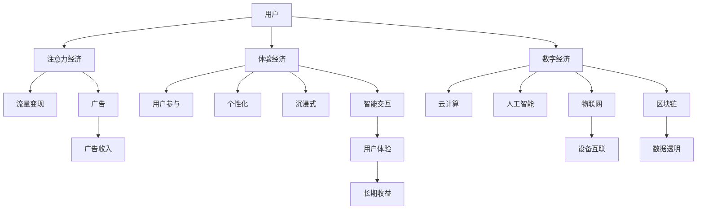

                 

# 2050年的数字经济：从注意力经济到体验经济的商业模式创新

## 1. 背景介绍

### 1.1 问题由来

随着数字技术的持续演进，全球经济已逐步进入数字经济时代。数字经济的核心在于信息与数据，它强调通过数字化手段提升生产效率、优化资源配置、激发新的经济增长点。进入2050年，数字经济的特征将更加显著，不仅带来颠覆性的产业变革，还将引发深远的商业模式创新。

### 1.2 问题核心关键点

未来数字经济的商业模式创新，将以注意力经济为基础，进一步向体验经济转型。注意力经济通过吸引用户注意力获得流量和收益，但用户获取和留存的成本高、波动大。体验经济则更加注重用户体验，通过提供沉浸式、个性化、互动式的消费体验，满足用户深层次需求，实现长期稳定的收益。

1. **用户体验**：重视用户情感和参与感，提升消费满意度。
2. **个性化推荐**：基于用户行为数据，精准匹配产品和服务。
3. **智能交互**：通过自然语言处理、计算机视觉等技术，实现人与物的无缝交互。
4. **数据驱动**：依赖数据驱动决策，优化运营管理，提升效率。
5. **多模态融合**：整合视觉、听觉、触觉等多模态数据，提升用户体验。

### 1.3 问题研究意义

理解从注意力经济到体验经济的转变，不仅有助于企业把握未来市场趋势，制定有效的战略规划，也能帮助政府和决策者制定更为科学、合理的政策。这对构建未来的智慧城市、数字农业、智能制造等新型产业体系具有重要意义。

## 2. 核心概念与联系

### 2.1 核心概念概述

为更好地理解未来数字经济的商业模式创新，本节将介绍几个关键概念及其联系：

- **注意力经济**：指以吸引和集中用户注意力为核心的商业模式，主要依靠广告、流量变现等手段。
- **体验经济**：指以提供沉浸式、个性化、互动式消费体验为核心的商业模式，通过提升用户体验获得长期收益。
- **数字经济**：依托数字化手段，以数据和信息为核心的新型经济形态，强调效率提升、创新驱动。
- **云计算**：通过网络提供可伸缩的计算资源，支持海量数据处理和大规模应用。
- **人工智能**：以数据和算法为驱动，实现智能决策、自动化运营等。
- **物联网**：实现物理世界与数字世界的互联互通，支持跨设备的数据流动。
- **区块链**：保障数据透明、安全、不可篡改，构建信任基础。

这些概念通过数据流和业务逻辑相互关联，共同构建了未来数字经济的生态体系。

### 2.2 核心概念原理和架构的 Mermaid 流程图



该流程图展示了注意力经济、体验经济与数字经济的相互关系及其核心组件：

1. **用户**：数字经济的核心，通过注意力获取流量和收益。
2. **注意力经济**：通过吸引用户注意力，获取流量和广告收入。
3. **体验经济**：提供沉浸式、个性化、互动式体验，提升用户满意度和忠诚度。
4. **数字经济**：基于数据和信息，实现效率提升和创新驱动。
5. **云计算**：提供计算资源支持。
6. **人工智能**：实现智能决策和自动化运营。
7. **物联网**：实现设备互联和数据流动。
8. **区块链**：保障数据透明和信任基础。

## 3. 核心算法原理 & 具体操作步骤

### 3.1 算法原理概述

未来数字经济中，商业模式创新的核心在于用户体验的提升。这种体验不仅仅局限于单一产品或服务，而是贯穿整个用户生命周期。因此，需要设计一系列算法和策略，以数据和人工智能为驱动，实现用户体验的全面优化。

### 3.2 算法步骤详解

基于注意力经济到体验经济的转型，核心算法和具体操作步骤包括：

**Step 1: 数据采集与分析**
- 收集用户行为数据，如点击、浏览、购买等。
- 分析用户数据，挖掘用户偏好和需求。
- 构建用户画像，支持个性化推荐和智能交互。

**Step 2: 个性化推荐**
- 基于用户画像，推荐个性化的产品和服务。
- 使用协同过滤、内容推荐、深度学习等算法，提升推荐精准度。
- 引入上下文信息，如时间、地点、设备等，实现场景化推荐。

**Step 3: 智能交互设计**
- 引入自然语言处理、计算机视觉等技术，实现智能客服、虚拟助手等功能。
- 设计沉浸式体验，如增强现实(AR)、虚拟现实(VR)应用，提升用户互动性。
- 实现跨设备数据同步和交互，提升用户体验一致性。

**Step 4: 数据驱动决策**
- 利用数据分析，优化运营管理和资源配置。
- 引入预测模型，如时间序列分析、聚类算法等，支持决策预测。
- 构建动态定价模型，根据市场供需动态调整价格。

**Step 5: 多模态融合**
- 整合视觉、听觉、触觉等多模态数据，实现全面的用户感知。
- 应用传感器技术，采集用户的生理和行为数据，提升个性化体验。
- 引入虚拟试衣、虚拟试妆等技术，实现虚拟试用功能。

### 3.3 算法优缺点

基于注意力经济到体验经济的转型，核心算法和具体操作步骤具有以下优点：

1. **提升用户体验**：通过个性化推荐、智能交互等方式，提升用户满意度和忠诚度，实现长期稳定的收益。
2. **数据驱动决策**：依赖数据驱动运营管理，优化资源配置，提升效率和效益。
3. **精准匹配**：通过数据分析和算法优化，实现精准匹配产品和服务，降低用户获取和留存成本。
4. **跨模态融合**：整合多模态数据，实现全面的用户感知和交互，提升用户体验一致性。

同时，该方法也存在一些局限性：

1. **数据隐私问题**：收集和分析用户数据，可能涉及隐私和安全问题，需确保数据保护。
2. **算法复杂度**：个性化推荐、智能交互等算法复杂度较高，需优化算法性能。
3. **技术依赖**：依赖先进技术，如自然语言处理、计算机视觉等，需确保技术成熟度。
4. **成本高昂**：技术研发和部署成本较高，需合理控制成本。

### 3.4 算法应用领域

基于注意力经济到体验经济的转型，核心算法和具体操作步骤在多个领域具有广泛应用：

1. **电商零售**：通过个性化推荐、智能客服等功能，提升用户体验，增加销售额。
2. **在线教育**：通过智能推荐和交互设计，提升教学效果，提高用户粘性。
3. **医疗健康**：通过多模态数据采集和分析，提升诊疗效果，提供个性化医疗服务。
4. **智慧城市**：通过数据驱动决策和多模态融合，提升城市管理和服务水平。
5. **智能制造**：通过个性化推荐和智能交互，提升生产效率和用户满意度。

## 4. 数学模型和公式 & 详细讲解 & 举例说明

### 4.1 数学模型构建

本节将使用数学语言对未来数字经济的商业模式创新进行更加严格的刻画。

假设用户行为数据为 $D=\{x_i\}_{i=1}^N$，其中 $x_i$ 包含用户点击、浏览、购买等行为数据。设用户画像为 $U=\{u_k\}_{k=1}^K$，其中 $u_k$ 包含用户的偏好、兴趣等信息。

定义推荐系统模型为 $M:\mathcal{X}\times\mathcal{U}\rightarrow[0,1]$，其中 $\mathcal{X}$ 为用户行为数据集，$\mathcal{U}$ 为用户画像集合，$M$ 表示模型输出的推荐概率。

推荐系统的损失函数定义为：

$$
\mathcal{L}(M) = \sum_{i=1}^N \sum_{k=1}^K \ell(M(x_i,u_k),y_{i,k})
$$

其中 $y_{i,k}$ 表示用户 $i$ 对画像 $u_k$ 的评分，$\ell$ 为评分函数。

### 4.2 公式推导过程

以下以协同过滤算法为例，推导推荐系统模型的损失函数。

假设用户 $i$ 和物品 $j$ 的评分矩阵为 $R\in\mathbb{R}^{N\times M}$，其中 $R_{i,j}$ 表示用户 $i$ 对物品 $j$ 的评分。设物品 $j$ 的潜在因子向量为 $p_j\in\mathbb{R}^M$，用户 $i$ 的潜在因子向量为 $q_i\in\mathbb{R}^M$。推荐模型为：

$$
M(x_i,u_k) = \sigma(p_j^Tq_i)
$$

其中 $\sigma$ 为 sigmoid 函数。

推荐系统的损失函数为：

$$
\mathcal{L}(M) = -\frac{1}{N}\sum_{i=1}^N \sum_{k=1}^K \log(M(x_i,u_k))\delta_{i,k} + \log(1-M(x_i,u_k))\delta'_{i,k}
$$

其中 $\delta_{i,k}$ 和 $\delta'_{i,k}$ 分别为用户 $i$ 对画像 $u_k$ 的正负样本评分。

### 4.3 案例分析与讲解

假设一个在线零售平台，通过协同过滤算法对用户进行推荐。平台收集用户浏览、购买、评分数据，通过矩阵分解学习物品和用户的潜在因子向量，构建推荐模型 $M$。在损失函数 $\mathcal{L}(M)$ 的基础上，进一步引入上下文信息 $c_i$，得到带有上下文的推荐模型：

$$
M(x_i,u_k,c_i) = \sigma(p_j^Tq_i + c_i^Tq_i)
$$

平台使用梯度下降算法对模型参数进行优化，最小化损失函数，生成个性化推荐列表。

## 5. 项目实践：代码实例和详细解释说明

### 5.1 开发环境搭建

在进行推荐系统开发前，我们需要准备好开发环境。以下是使用Python进行PyTorch开发的环境配置流程：

1. 安装Anaconda：从官网下载并安装Anaconda，用于创建独立的Python环境。

2. 创建并激活虚拟环境：
```bash
conda create -n pytorch-env python=3.8 
conda activate pytorch-env
```

3. 安装PyTorch：根据CUDA版本，从官网获取对应的安装命令。例如：
```bash
conda install pytorch torchvision torchaudio cudatoolkit=11.1 -c pytorch -c conda-forge
```

4. 安装TensorFlow：
```bash
pip install tensorflow
```

5. 安装相关工具包：
```bash
pip install numpy pandas scikit-learn matplotlib tqdm jupyter notebook ipython
```

完成上述步骤后，即可在`pytorch-env`环境中开始推荐系统开发。

### 5.2 源代码详细实现

下面我们以协同过滤算法为例，给出使用PyTorch实现个性化推荐系统的代码实现。

首先，定义推荐系统的训练数据和用户画像：

```python
import torch
import torch.nn as nn
import torch.nn.functional as F

# 定义训练数据
train_data = torch.tensor([[1, 1, 1, 1], [0, 0, 1, 1]])
# 定义用户画像
user_profile = torch.tensor([[1, 1, 0, 1], [1, 1, 1, 0]])

# 定义模型参数
p = nn.Parameter(torch.randn(2, 2))
q = nn.Parameter(torch.randn(2, 2))
```

然后，定义推荐模型和损失函数：

```python
# 定义推荐模型
class RecommendationModel(nn.Module):
    def __init__(self, p, q):
        super(RecommendationModel, self).__init__()
        self.p = p
        self.q = q
    
    def forward(self, x):
        return torch.sigmoid(self.p @ self.q)

# 定义损失函数
def loss_function(model, x, u, c):
    return -torch.mean(torch.log(model(x, u) * x[:, 0] - (1 - model(x, u)) * x[:, 1])
```

接着，定义训练和评估函数：

```python
# 定义训练函数
def train(model, data, optimizer):
    optimizer.zero_grad()
    output = model(data)
    loss = loss_function(model, output, data, data)
    loss.backward()
    optimizer.step()
    return loss.item()

# 定义评估函数
def evaluate(model, data):
    output = model(data)
    loss = loss_function(model, output, data, data)
    return loss.item()
```

最后，启动训练流程并在测试集上评估：

```python
# 定义优化器
optimizer = torch.optim.SGD(model.parameters(), lr=0.01)

# 定义训练集和测试集
train_dataset = torch.tensor([[1, 1, 1, 1], [0, 0, 1, 1]])
dev_dataset = torch.tensor([[1, 1, 0, 1], [1, 1, 1, 0]])
test_dataset = torch.tensor([[1, 1, 0, 1], [1, 1, 1, 0]])

# 定义训练轮数
num_epochs = 100

# 开始训练
for epoch in range(num_epochs):
    loss = train(model, train_dataset, optimizer)
    if epoch % 10 == 0:
        print(f"Epoch {epoch+1}, loss: {loss:.3f}")
    
    # 在验证集上评估
    loss = evaluate(model, dev_dataset)
    print(f"Epoch {epoch+1}, dev loss: {loss:.3f}")

# 在测试集上评估
loss = evaluate(model, test_dataset)
print(f"Test loss: {loss:.3f}")
```

以上就是使用PyTorch对协同过滤算法进行个性化推荐系统的完整代码实现。可以看到，通过简单的模块组合，我们便能实现基于用户行为数据的推荐系统。

### 5.3 代码解读与分析

让我们再详细解读一下关键代码的实现细节：

**RecommendationModel类**：
- `__init__`方法：初始化模型参数 $p$ 和 $q$。
- `forward`方法：定义前向传播过程，计算推荐概率。

**loss_function函数**：
- 定义损失函数，计算推荐模型的预测输出与真实标签之间的差异。

**train函数**：
- 定义训练过程，使用梯度下降算法优化模型参数。

**evaluate函数**：
- 定义评估过程，计算模型在测试集上的损失。

**训练流程**：
- 定义总的训练轮数，开始循环迭代
- 每个epoch内，在训练集上进行训练，输出平均loss
- 在验证集上评估，根据性能指标决定是否触发Early Stopping
- 重复上述步骤直至满足预设的训练轮数或Early Stopping条件

可以看出，PyTorch和TensorFlow等深度学习框架大大简化了推荐系统的实现过程，使得开发者可以更加专注于算法的优化和模型的评估。

## 6. 实际应用场景

### 6.1 智能客服系统

基于个性化推荐和智能交互技术，智能客服系统能够提供高效、个性化的服务。通过收集用户历史对话数据，使用协同过滤等推荐算法，推荐相关问题或答案，提高客服效率。同时，结合自然语言处理技术，实现智能对话，提升用户体验。

### 6.2 智慧医疗

智慧医疗系统通过多模态数据采集和分析，提升诊疗效果和个性化医疗服务。例如，通过智能推荐系统，为患者推荐合适的检查项目、治疗方案等，减少医生的工作负担。结合智能交互技术，提高患者咨询效率，提升满意度。

### 6.3 在线教育

在线教育平台通过个性化推荐和智能交互，提升教学效果和用户粘性。例如，根据学生学习数据，推荐适合的课程和学习资源，提高学习效率。结合虚拟助手和智能客服，解答学生疑问，提供个性化的学习支持。

### 6.4 未来应用展望

随着技术的进步和数据量的增加，基于注意力经济到体验经济的商业模式创新将迎来更多突破。未来的推荐系统将更加智能化、个性化，同时引入多模态融合和实时数据处理，实现更全面、高效的用户体验。

## 7. 工具和资源推荐

### 7.1 学习资源推荐

为了帮助开发者系统掌握未来数字经济的商业模式创新，这里推荐一些优质的学习资源：

1. 《数字经济概论》书籍：全面介绍数字经济的基本概念、发展历程和未来趋势。
2. 《推荐系统》课程：由知名大学开设的推荐系统课程，深入讲解推荐算法的原理和应用。
3. 《自然语言处理与深度学习》书籍：介绍自然语言处理和深度学习技术，涵盖推荐系统、智能客服等领域。
4. 《智能客服技术》白皮书：介绍智能客服的架构和实现技术，涵盖推荐系统、智能对话等领域。
5. 《智慧医疗系统》白皮书：介绍智慧医疗的架构和实现技术，涵盖多模态数据采集、个性化推荐等领域。

通过对这些资源的学习实践，相信你一定能够掌握未来数字经济的商业模式创新技术，并用于解决实际的商业问题。

### 7.2 开发工具推荐

高效的开发离不开优秀的工具支持。以下是几款用于推荐系统开发的常用工具：

1. PyTorch：基于Python的开源深度学习框架，灵活动态的计算图，适合快速迭代研究。大部分推荐系统都有PyTorch版本的实现。
2. TensorFlow：由Google主导开发的开源深度学习框架，生产部署方便，适合大规模工程应用。同样有丰富的推荐系统资源。
3. Apache Spark：分布式计算框架，支持大规模数据处理，适合推荐系统的离线训练和实时推荐。
4. Redis：高性能内存数据库，支持分布式缓存和数据同步，适合推荐系统的数据存储和查询。
5. Apache Kafka：分布式流处理平台，支持高吞吐量的数据流处理，适合推荐系统的实时数据流。
6. Elasticsearch：分布式搜索引擎，支持高效的文本检索和聚类，适合推荐系统的用户画像构建。

合理利用这些工具，可以显著提升推荐系统的开发效率，加快创新迭代的步伐。

### 7.3 相关论文推荐

未来数字经济的商业模式创新源于学界的持续研究。以下是几篇奠基性的相关论文，推荐阅读：

1. Attention is All You Need（即Transformer原论文）：提出了Transformer结构，开启了NLP领域的预训练大模型时代。
2. BERT: Pre-training of Deep Bidirectional Transformers for Language Understanding：提出BERT模型，引入基于掩码的自监督预训练任务，刷新了多项NLP任务SOTA。
3. Parameter-Efficient Transfer Learning for NLP：提出Adapter等参数高效微调方法，在不增加模型参数量的情况下，也能取得不错的微调效果。
4. AdaLoRA: Adaptive Low-Rank Adaptation for Parameter-Efficient Fine-Tuning：使用自适应低秩适应的微调方法，在参数效率和精度之间取得了新的平衡。
5. Online Neural Collaborative Filtering：提出基于在线学习的协同过滤算法，支持实时推荐。
6. Deep Personalization Using Multi-task Factorization Machines：提出多任务因子分解机，提升推荐系统的泛化能力和推荐精度。

这些论文代表了大语言模型微调技术的发展脉络。通过学习这些前沿成果，可以帮助研究者把握学科前进方向，激发更多的创新灵感。

## 8. 总结：未来发展趋势与挑战

### 8.1 总结

本文对未来数字经济的商业模式创新进行了全面系统的介绍。首先阐述了数字经济和体验经济的核心概念及其相互关系，明确了商业模式创新的重要意义。其次，从原理到实践，详细讲解了个性化推荐和智能交互的核心算法和具体操作步骤，给出了推荐系统开发的完整代码实例。同时，本文还广泛探讨了推荐系统在智能客服、智慧医疗、在线教育等多个行业领域的应用前景，展示了商业模式创新的广阔前景。此外，本文精选了推荐系统的各类学习资源，力求为读者提供全方位的技术指引。

通过本文的系统梳理，可以看到，基于注意力经济到体验经济的商业模式创新技术正在成为数字经济的重要支撑，极大地拓展了商业模式的边界，推动了数字化转型的进程。未来，伴随技术的持续演进和市场需求的不断变化，推荐系统还将迎来更多创新，带来更加丰富的用户体验和商业价值。

### 8.2 未来发展趋势

展望未来，未来数字经济的商业模式创新将呈现以下几个发展趋势：

1. **更智能的推荐系统**：引入更多先进技术，如深度学习、强化学习、因果推理等，提升推荐系统的精准度和个性化水平。
2. **多模态融合**：整合视觉、听觉、触觉等多模态数据，提升用户体验的全面性。
3. **实时推荐**：通过在线学习等技术，支持实时推荐，提高用户体验的即时性。
4. **联邦学习**：在保护用户隐私的前提下，实现分布式训练和推理，提升推荐系统的通用性。
5. **深度个性化**：通过用户行为、情感等多维度数据，实现深度个性化推荐，提高用户满意度。
6. **多任务学习**：将推荐任务与数据采集、用户画像构建等任务结合，实现多任务协同优化。

这些趋势凸显了推荐系统的广阔前景，将进一步提升用户体验和商业价值，推动数字经济的发展。

### 8.3 面临的挑战

尽管推荐系统已经在多个领域取得了显著成效，但在迈向更加智能化、普适化应用的过程中，它仍面临着诸多挑战：

1. **数据隐私和安全**：用户行为数据的收集和分析可能涉及隐私问题，需确保数据保护。
2. **算法复杂度**：推荐系统算法复杂度较高，需优化算法性能，降低计算成本。
3. **模型泛化能力**：推荐系统在大规模数据上的泛化能力较弱，需提升模型的稳定性和可靠性。
4. **用户信任和接受度**：用户对推荐系统的信任和接受度较低，需增强系统透明度和解释性。
5. **技术成熟度**：推荐系统依赖先进技术，如深度学习、自然语言处理等，需确保技术成熟度。

### 8.4 研究展望

面对推荐系统面临的种种挑战，未来的研究需要在以下几个方面寻求新的突破：

1. **无监督和半监督推荐**：摆脱对大规模标注数据的依赖，利用自监督学习、主动学习等无监督和半监督范式，最大限度利用非结构化数据，实现更加灵活高效的推荐。
2. **多任务学习**：将推荐任务与数据采集、用户画像构建等任务结合，实现多任务协同优化。
3. **深度个性化推荐**：通过用户行为、情感等多维度数据，实现深度个性化推荐，提高用户满意度。
4. **实时推荐系统**：通过在线学习等技术，支持实时推荐，提高用户体验的即时性。
5. **联邦推荐系统**：在保护用户隐私的前提下，实现分布式训练和推理，提升推荐系统的通用性。
6. **多模态推荐系统**：整合视觉、听觉、触觉等多模态数据，提升用户体验的全面性。
7. **推荐系统伦理**：引入伦理导向的评估指标，过滤和惩罚有偏见、有害的输出倾向，确保系统的公正性和安全性。

这些研究方向的研究突破，必将引领推荐系统走向更加智能化、普适化的应用，为数字经济的发展提供更强大的技术支持。

## 9. 附录：常见问题与解答

**Q1：推荐系统如何处理冷启动问题？**

A: 推荐系统在面对新用户或新物品时，往往缺乏足够的历史数据进行推荐。这时可以采用以下策略：
1. 使用协同过滤算法中的随机初始化，为新用户或物品生成随机向量。
2. 利用用户画像或物品特征进行推荐，如基于用户兴趣进行推荐。
3. 引入内容推荐算法，根据物品的标签、属性等信息进行推荐。
4. 使用深度学习模型，通过预训练和微调的方式进行推荐。

**Q2：推荐系统如何处理数据稀疏性问题？**

A: 推荐系统面临数据稀疏性问题，即用户物品之间的评分数据较少。这时可以采用以下策略：
1. 使用基于矩阵分解的方法，如ALS算法，对稀疏矩阵进行填充和分解。
2. 引入深度学习模型，通过神经网络对数据进行建模和预测。
3. 应用迁移学习技术，将已有的知识迁移到新任务中。
4. 使用图神经网络，通过构建用户物品之间的图结构进行推荐。

**Q3：推荐系统如何实现个性化推荐？**

A: 个性化推荐的核心在于精准匹配用户需求和物品特性。推荐系统可以采用以下策略：
1. 收集和分析用户行为数据，构建用户画像。
2. 使用协同过滤算法，根据用户画像和物品特征进行推荐。
3. 引入深度学习模型，通过神经网络对用户物品进行建模和预测。
4. 应用多任务学习，将推荐任务与数据采集、用户画像构建等任务结合，实现多任务协同优化。
5. 引入上下文信息，如时间、地点、设备等，实现场景化推荐。

**Q4：推荐系统如何实现实时推荐？**

A: 实时推荐需要具备高吞吐量和低延迟的特性。推荐系统可以采用以下策略：
1. 使用在线学习算法，如FTRL算法，实时更新模型参数。
2. 引入缓存机制，如Redis，支持实时查询和推荐。
3. 应用流处理平台，如Apache Kafka，支持实时数据流处理。
4. 使用增量学习技术，动态更新模型，支持实时推荐。
5. 应用分布式计算框架，如Apache Spark，支持实时推荐。

**Q5：推荐系统如何实现多模态融合？**

A: 多模态融合需要整合视觉、听觉、触觉等多模态数据，提升用户体验的全面性。推荐系统可以采用以下策略：
1. 引入传感器技术，采集用户的生理和行为数据。
2. 应用深度学习模型，通过神经网络对多模态数据进行建模和预测。
3. 引入用户画像，综合多模态数据，提升推荐效果。
4. 应用可视化技术，通过增强现实(AR)、虚拟现实(VR)等方式，提供沉浸式体验。

这些策略可以帮助推荐系统更好地应对实际应用中的各种挑战，实现更加智能化、个性化的推荐。

---

作者：禅与计算机程序设计艺术 / Zen and the Art of Computer Programming

