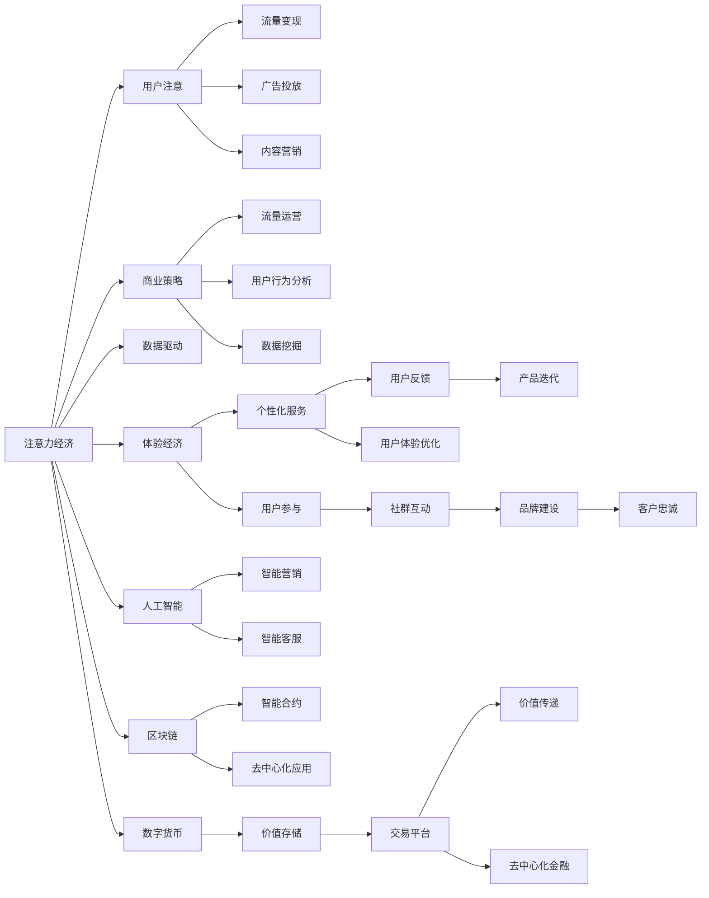

                 

## 1. 背景介绍

### 1.1 问题由来
随着数字经济的蓬勃发展，商业模式也正在经历深刻的变革。传统的基于注意力和流量的商业模式正逐渐失效，取而代之的是基于体验和价值的商业模式。这些变化不仅影响着各行各业的企业，也塑造着未来的经济生态。

### 1.2 问题核心关键点
当前，数字经济的核心特征是从注意力经济转向体验经济。用户关注的不再是产品的价格或功能，而是体验的价值。为了抓住这一机遇，企业需要创新商业模式，从重视流量的策略转向重视用户体验和价值创造。

### 1.3 问题研究意义
研究数字经济从注意力经济到体验经济的演变，对于企业洞察市场变化、优化产品策略、提升用户体验具有重要意义。此外，理解这种演变也有助于政策制定者更好地规划数字经济发展方向，促进经济社会的可持续发展。

## 2. 核心概念与联系

### 2.1 核心概念概述

- **注意力经济**：基于用户注意力的商业模式，通过吸引用户注意力获取商业价值。传统的搜索引擎、社交媒体等平台都是注意力经济的典型代表。
- **体验经济**：基于用户体验的商业模式，强调提供独特的、个性化的体验，以满足用户深层次的需求和期望。体验经济的核心在于创新和定制，通过提供超出用户预期的体验，实现商业价值的最大化。
- **数字货币**：基于区块链技术的货币形式，如比特币、以太坊等，为数字经济提供了新的价值传递和交易方式。
- **人工智能**：通过机器学习和深度学习技术，模拟人类智能行为，提升数据处理和决策能力。
- **区块链**：通过去中心化、加密、共识等技术，构建安全、透明、可追溯的交易记录和应用系统。

这些核心概念之间通过一系列技术和经济机制相互作用，共同推动数字经济的演化。通过理解这些概念及其联系，可以更好地把握数字经济的未来趋势。

### 2.2 核心概念原理和架构的 Mermaid 流程图



这个流程图展示了注意力经济和体验经济的基本架构以及它们与人工智能、区块链、数字货币等技术的关系。通过这些技术和机制的协同作用，企业能够实现从流量变现到价值创造的转变。

## 3. 核心算法原理 & 具体操作步骤

### 3.1 算法原理概述

从注意力经济到体验经济的转变，涉及从数据驱动到体验驱动的算法创新。具体来说，以下算法原理是实现这种转变的关键：

1. **用户行为分析**：通过大数据分析，识别用户行为模式和需求，预测用户行为和趋势。
2. **个性化推荐系统**：基于用户画像和行为数据，推荐个性化的产品和服务，提升用户体验。
3. **智能交互技术**：利用自然语言处理和机器学习技术，实现智能客服、智能助手等，提升用户互动体验。
4. **区块链技术**：通过智能合约和去中心化应用，实现信任机制和价值传递，保障交易安全性和透明度。
5. **数字货币和加密技术**：通过加密货币和智能合约，实现去中心化金融（DeFi），提升交易效率和安全性。

这些算法原理共同构成了从注意力经济到体验经济转变的技术基础。通过理解和应用这些算法，企业可以更好地实现商业模式的创新和升级。

### 3.2 算法步骤详解

以下是实现从注意力经济到体验经济转变的具体步骤：

**Step 1: 用户行为分析**
- 收集用户的行为数据，包括浏览、点击、购买、评价等。
- 使用机器学习算法对数据进行分析，识别用户兴趣和行为模式。
- 通过用户画像模型，生成详细的用户画像，用于个性化推荐和智能交互。

**Step 2: 个性化推荐系统**
- 基于用户画像，构建推荐模型，如协同过滤、深度学习推荐系统等。
- 实时更新推荐模型，根据用户最新的行为数据进行调整。
- 提供个性化的推荐服务，提升用户体验和满意度。

**Step 3: 智能交互技术**
- 开发智能客服系统，利用自然语言处理技术，实现自动对话和问题解答。
- 设计智能助手，提供个性化的服务，如智能日程安排、智能提醒等。
- 利用聊天机器人等技术，增强用户互动和参与感。

**Step 4: 区块链技术应用**
- 开发去中心化应用（DApp），利用智能合约实现自动化和信任机制。
- 利用区块链技术进行去中心化金融（DeFi），提供更加安全、高效的金融服务。
- 通过区块链技术实现数据的透明和可追溯，增强用户信任。

**Step 5: 数字货币和加密技术**
- 开发数字货币钱包和交易平台，实现加密货币的交易和管理。
- 利用智能合约技术，实现自动化交易和智能合约，提升交易效率。
- 通过去中心化金融（DeFi），提供更广泛的金融服务，降低交易成本。

### 3.3 算法优缺点

**优点**：
1. **提升用户体验**：通过个性化推荐和智能交互，提升用户体验和满意度。
2. **增加用户粘性**：利用用户行为分析和智能交互技术，增强用户参与度和粘性。
3. **保障交易安全**：通过区块链技术和智能合约，实现交易的透明和安全性。
4. **提高效率和成本效益**：利用数字货币和智能合约，提高交易效率，降低交易成本。

**缺点**：
1. **技术复杂度高**：涉及多个技术和机制的协同，实现难度较大。
2. **数据隐私和安全风险**：用户数据和交易信息的安全需要严格保障，防止数据泄露和隐私侵害。
3. **用户接受度**：智能交互和去中心化技术对部分用户来说可能不熟悉或难以接受。

### 3.4 算法应用领域

从注意力经济到体验经济的转变，涉及多个行业和领域，具体包括：

- **零售行业**：通过个性化推荐和智能客服，提升用户购物体验和满意度。
- **金融行业**：利用区块链和智能合约技术，实现去中心化金融，提供更加安全和透明的金融服务。
- **教育行业**：利用智能互动技术，提供个性化的学习体验和智能辅导。
- **医疗行业**：利用智能交互和区块链技术，提供安全和透明的医疗数据管理。
- **娱乐行业**：利用数字货币和智能合约技术，提供新的娱乐体验和价值传递方式。

这些行业领域都是数字经济转型的重要战场，通过应用这些算法原理，企业可以提升竞争力，实现商业模式的创新和升级。

## 4. 数学模型和公式 & 详细讲解 & 举例说明

### 4.1 数学模型构建

为更好地理解数字经济从注意力经济到体验经济的转变，我们可以建立如下数学模型：

- **用户行为模型**：设用户行为数据为 $X=\{x_1, x_2, ..., x_n\}$，其中 $x_i$ 表示用户行为记录。设用户画像为 $P=\{p_1, p_2, ..., p_m\}$，其中 $p_j$ 表示用户画像中的特征。设行为预测模型为 $f$，则用户行为预测公式为：
  $$
  \hat{p}_i = f(x_i)
  $$
- **个性化推荐模型**：设推荐系统接受用户画像 $P$ 和历史行为 $X$，推荐物品为 $I$，则推荐模型为 $R$，推荐公式为：
  $$
  \hat{I} = R(P, X)
  $$
- **智能交互模型**：设智能客服系统接收用户输入 $U$，输出回答 $A$，则智能交互模型为 $I$，模型公式为：
  $$
  \hat{A} = I(U)
  $$
- **区块链交易模型**：设区块链交易记录为 $T$，智能合约为 $C$，交易金额为 $M$，则交易模型为 $T$，交易公式为：
  $$
  \hat{M} = T(P, C)
  $$

### 4.2 公式推导过程

以下是这些数学模型的推导过程：

**用户行为模型推导**：
- 利用机器学习算法（如决策树、随机森林、神经网络等）对用户行为数据 $X$ 进行分析，构建用户画像 $P$。
- 通过用户画像 $P$ 和行为数据 $X$，利用回归或分类模型 $f$ 预测用户行为 $p_i$。

**个性化推荐模型推导**：
- 利用协同过滤、基于内容的推荐算法等，构建推荐模型 $R$。
- 根据用户画像 $P$ 和历史行为 $X$，利用推荐模型 $R$ 生成个性化推荐物品 $I$。

**智能交互模型推导**：
- 利用自然语言处理技术，构建智能交互模型 $I$，包括语言模型、对话模型等。
- 根据用户输入 $U$，利用智能交互模型 $I$ 生成回答 $A$。

**区块链交易模型推导**：
- 利用智能合约技术，构建交易模型 $T$，包括智能合约语言、交易规则等。
- 根据用户行为数据 $P$ 和智能合约 $C$，利用交易模型 $T$ 生成交易金额 $M$。

### 4.3 案例分析与讲解

假设一个电商平台希望从注意力经济转向体验经济，提升用户体验和满意度。具体步骤如下：

1. **用户行为分析**：
   - 收集用户在平台上的浏览、购买、评价等行为数据，构建用户画像模型。
   - 利用机器学习算法，分析用户行为数据，预测用户兴趣和需求。

2. **个性化推荐系统**：
   - 基于用户画像和行为数据，利用协同过滤或深度学习推荐算法，构建个性化推荐模型。
   - 实时更新推荐模型，根据用户最新的行为数据进行调整。
   - 提供个性化的商品推荐服务，提升用户体验和满意度。

3. **智能交互技术**：
   - 开发智能客服系统，利用自然语言处理技术，实现自动对话和问题解答。
   - 设计智能助手，提供个性化的服务，如智能日程安排、智能提醒等。
   - 利用聊天机器人等技术，增强用户互动和参与感。

4. **区块链技术应用**：
   - 开发去中心化应用（DApp），利用智能合约实现自动化和信任机制。
   - 利用区块链技术进行去中心化金融（DeFi），提供更加安全、高效的金融服务。
   - 通过区块链技术实现数据的透明和可追溯，增强用户信任。

## 5. 项目实践：代码实例和详细解释说明

### 5.1 开发环境搭建

在进行数字经济相关项目实践前，我们需要准备好开发环境。以下是使用Python进行项目开发的详细环境配置流程：

1. 安装Anaconda：从官网下载并安装Anaconda，用于创建独立的Python环境。
2. 创建并激活虚拟环境：
```bash
conda create -n pyenv python=3.8
conda activate pyenv
```

3. 安装Python和各种工具包，如Pandas、Numpy、Scikit-learn等，用于数据处理和机器学习。
4. 安装机器学习框架，如TensorFlow、PyTorch等，用于构建推荐系统和智能交互模型。
5. 安装Web框架，如Flask、Django等，用于构建Web应用和服务。
6. 安装加密库，如PyCryptodome、bcrypt等，用于区块链和数字货币相关功能。

完成上述步骤后，即可在`pyenv`环境中开始项目实践。

### 5.2 源代码详细实现

以下是使用Python实现个性化推荐系统的详细代码实现：

```python
import pandas as pd
import numpy as np
from sklearn.model_selection import train_test_split
from sklearn.ensemble import RandomForestRegressor
from sklearn.metrics import mean_absolute_error

# 读取用户行为数据
data = pd.read_csv('user_behavior.csv')

# 数据预处理
X = data[['feature1', 'feature2', 'feature3']]  # 用户行为特征
y = data['purchase']  # 用户购买行为
X_train, X_test, y_train, y_test = train_test_split(X, y, test_size=0.2, random_state=42)

# 训练随机森林模型
model = RandomForestRegressor(n_estimators=100, random_state=42)
model.fit(X_train, y_train)

# 预测用户行为
y_pred = model.predict(X_test)

# 计算MAE
mae = mean_absolute_error(y_test, y_pred)
print('Mean Absolute Error:', mae)
```

以上代码实现了基于随机森林的用户行为预测，通过分析用户的行为特征，预测其购买行为。

### 5.3 代码解读与分析

**代码解读**：
1. 首先读取用户行为数据，并进行数据预处理，构建训练集和测试集。
2. 使用随机森林模型进行训练和预测，计算模型在测试集上的MAE。
3. 通过调整模型参数，如树的数量和随机种子，可以进一步优化模型性能。

**分析**：
1. 用户行为数据是预测用户行为的关键，需要充分挖掘和利用。
2. 模型选择和参数调整对预测精度有重要影响，需要根据具体数据集进行优化。
3. 预测结果可以通过多个指标进行评估，如MAE、R2等。

## 6. 实际应用场景

### 6.1 智能客服系统

智能客服系统是体验经济的重要组成部分。通过智能客服，用户可以实时获得个性化的解答和服务，提升用户体验和满意度。

具体应用场景包括：
- **自动回答常见问题**：利用自然语言处理技术，自动回答用户常见问题，提升响应速度。
- **智能对话和问题解答**：通过智能对话模型，理解用户需求并提供个性化解答，提升用户互动体验。
- **实时数据分析和反馈**：利用用户交互数据，进行实时分析，优化智能客服系统，提升服务质量。

### 6.2 去中心化金融（DeFi）

去中心化金融（DeFi）是数字经济的重要应用，通过区块链和智能合约，实现金融服务的去中心化和智能化。

具体应用场景包括：
- **去中心化借贷**：通过智能合约，实现点对点的借贷服务，降低借贷成本和风险。
- **去中心化交易**：利用智能合约和区块链技术，实现自动化的交易和清算，提升交易效率和透明度。
- **去中心化保险**：通过智能合约，实现去中心化的保险服务和理赔，降低保险成本和风险。

### 6.3 个性化推荐系统

个性化推荐系统是体验经济的核心技术之一，通过分析用户行为和偏好，提供个性化的商品和服务。

具体应用场景包括：
- **电商推荐**：利用用户行为数据，提供个性化的商品推荐，提升用户体验和购买率。
- **内容推荐**：根据用户阅读和观看行为，推荐个性化的内容，提升用户参与度和满意度。
- **广告推荐**：利用用户行为数据，推荐个性化的广告，提升广告投放效果和转化率。

### 6.4 未来应用展望

未来，随着技术的发展，数字经济将进一步从注意力经济向体验经济转变，带来更多创新应用。

- **虚拟现实（VR）和增强现实（AR）**：通过VR和AR技术，提供沉浸式的用户体验，增强互动和参与感。
- **人工智能和机器学习**：利用人工智能和大数据技术，实现更加个性化和智能化的服务。
- **区块链和数字货币**：通过区块链和智能合约，实现去中心化和安全的交易和服务。
- **物联网（IoT）**：通过物联网技术，实现设备和服务的智能化和互联互通，提升用户体验。

## 7. 工具和资源推荐

### 7.1 学习资源推荐

为帮助开发者系统掌握数字经济相关技术，以下是推荐的资源：

1. **《数字货币技术与应用》**：介绍区块链和数字货币的基础知识和应用场景，适合初学者入门。
2. **《人工智能与机器学习》**：介绍人工智能和机器学习的基本原理和算法，涵盖深度学习、自然语言处理等内容。
3. **《智能客服系统设计与实现》**：介绍智能客服系统的基础知识和实现方法，涵盖自然语言处理、对话系统等内容。
4. **《区块链技术入门》**：介绍区块链的基本原理和应用场景，适合对区块链感兴趣的开发者。
5. **《去中心化金融（DeFi）》**：介绍DeFi的基本原理和应用场景，涵盖智能合约、去中心化交易等内容。

这些资源能够帮助开发者全面掌握数字经济相关技术，提升开发能力和竞争力。

### 7.2 开发工具推荐

以下是推荐的开发工具，帮助开发者快速构建数字经济相关应用：

1. **Python**：通用编程语言，广泛用于数据处理、机器学习、Web开发等。
2. **TensorFlow**：开源机器学习框架，支持深度学习和自然语言处理等。
3. **PyTorch**：开源深度学习框架，支持动态图和静态图计算。
4. **Flask**：轻量级Web框架，适合快速开发Web应用。
5. **Django**：全功能Web框架，适合构建复杂Web应用。
6. **bcrypt**：加密库，支持密码哈希和加盐处理，保障用户数据安全。
7. **PyCryptodome**：加密库，支持对称加密、非对称加密等。

这些工具能够帮助开发者快速构建和部署数字经济相关应用，提升开发效率和质量。

### 7.3 相关论文推荐

以下是推荐的数字经济相关论文，帮助开发者深入理解相关技术：

1. **《区块链技术的现状与展望》**：介绍区块链技术的现状和未来发展趋势，适合了解区块链基础知识的读者。
2. **《智能合约在DeFi中的应用》**：介绍智能合约在DeFi中的应用场景和实现方法，适合了解DeFi相关知识的读者。
3. **《个性化推荐系统综述》**：介绍个性化推荐系统的发展历程和实现方法，适合了解推荐系统基础知识的读者。
4. **《虚拟现实（VR）和增强现实（AR）技术综述》**：介绍VR和AR技术的基础知识和应用场景，适合对虚拟现实和增强现实感兴趣的读者。
5. **《数字货币技术与应用》**：介绍数字货币的基本原理和应用场景，适合了解数字货币基础知识的读者。

这些论文能够帮助开发者深入理解数字经济相关技术，提升技术水平和研究能力。

## 8. 总结：未来发展趋势与挑战

### 8.1 总结

本文对数字经济从注意力经济到体验经济的演变进行了系统介绍。从注意力经济到体验经济，不仅仅是商业模式的变化，更是技术驱动的全面升级。通过分析用户行为、提供个性化推荐、增强智能交互，企业可以更好地满足用户需求，提升用户体验和满意度。

通过理解和应用这些技术和方法，企业可以抓住数字经济的新机遇，实现商业模式的创新和升级，保持竞争优势。

### 8.2 未来发展趋势

展望未来，数字经济将继续从注意力经济向体验经济转变，带来更多创新应用。以下是未来可能的趋势：

1. **人工智能和机器学习**：随着技术的不断进步，人工智能和机器学习将在更多领域得到应用，提升用户体验和价值创造。
2. **区块链和数字货币**：区块链和数字货币将继续发展，提升交易效率和安全性，实现去中心化和智能化。
3. **虚拟现实（VR）和增强现实（AR）**：VR和AR技术将带来更加沉浸式的用户体验，增强互动和参与感。
4. **物联网（IoT）**：物联网技术将实现设备和服务的智能化和互联互通，提升用户体验和生产效率。
5. **智能交互和个性化推荐**：智能交互和个性化推荐将继续发展，提升用户体验和满意度。

这些趋势将深刻影响未来的经济生态，带来新的商业机遇和挑战。

### 8.3 面临的挑战

尽管数字经济带来了新的机遇，但面临的挑战也不容忽视：

1. **技术复杂度高**：数字经济涉及多个技术和机制的协同，实现难度较大。
2. **数据隐私和安全风险**：用户数据和交易信息的安全需要严格保障，防止数据泄露和隐私侵害。
3. **用户接受度**：智能交互和去中心化技术对部分用户来说可能不熟悉或难以接受。
4. **技术成本高**：数字经济的技术实现需要较高的投入，包括技术研发、基础设施建设等。

### 8.4 研究展望

未来，数字经济将继续从注意力经济向体验经济转变，带来更多创新应用。为了应对这些挑战，研究者需要在以下方面进行深入探索：

1. **技术优化和简化**：进一步优化技术实现，降低技术复杂度和成本，提高技术可接受度。
2. **数据隐私和安全**：开发更加安全、可靠的数据管理和交易机制，保障用户隐私和数据安全。
3. **用户接受度**：提高用户对数字经济技术的接受度和使用习惯，通过教育和推广，增强用户参与度。
4. **去中心化与集中化平衡**：在去中心化和集中化之间找到平衡点，确保系统稳定性和安全性。

这些研究方向将推动数字经济的健康发展，为经济社会的可持续发展提供动力。

## 9. 附录：常见问题与解答

**Q1: 数字经济从注意力经济到体验经济的核心是什么？**

A: 数字经济从注意力经济到体验经济的核心是用户体验的提升和价值创造。通过个性化推荐、智能交互等技术，企业可以更好地理解用户需求，提供更加个性化的服务和产品，从而提升用户满意度和忠诚度，实现商业价值的最大化。

**Q2: 数字经济的核心驱动力是什么？**

A: 数字经济的核心驱动力是技术创新和数据驱动。通过机器学习、人工智能、区块链等技术，企业可以更好地处理和利用数据，提升产品和服务质量，实现商业模式的创新和升级。

**Q3: 数字经济对传统经济有哪些影响？**

A: 数字经济对传统经济有以下影响：
1. 改变商业模式：从流量变现转向价值创造，提升用户体验和满意度。
2. 提高效率和降低成本：通过智能化和自动化，提升生产效率，降低运营成本。
3. 推动创新和创业：数字经济提供了更多创业机会和创新空间，促进经济活力。
4. 改变就业结构：数字经济对人才需求发生变化，推动就业结构调整和升级。

**Q4: 数字经济未来的发展方向是什么？**

A: 数字经济未来的发展方向包括：
1. 人工智能和机器学习：提升智能化水平，实现更加个性化的服务和产品。
2. 区块链和数字货币：提升交易效率和安全性，实现去中心化和智能化。
3. 虚拟现实（VR）和增强现实（AR）：带来更加沉浸式的用户体验，增强互动和参与感。
4. 物联网（IoT）：实现设备和服务的智能化和互联互通，提升用户体验和生产效率。
5. 智能交互和个性化推荐：提升用户体验和满意度，增强用户参与度和忠诚度。

**Q5: 数字经济的应用场景有哪些？**

A: 数字经济的应用场景包括：
1. 智能客服系统：利用自然语言处理技术，提供自动对话和问题解答。
2. 去中心化金融（DeFi）：利用智能合约和区块链技术，实现去中心化和安全的交易和服务。
3. 个性化推荐系统：利用用户行为数据，提供个性化的商品和内容推荐。
4. 虚拟现实（VR）和增强现实（AR）应用：提供沉浸式的用户体验，增强互动和参与感。
5. 物联网（IoT）应用：实现设备和服务的智能化和互联互通，提升用户体验和生产效率。

通过理解数字经济从注意力经济到体验经济的演变，企业可以更好地把握未来趋势，实现商业模式的创新和升级，提升竞争力。

---

作者：禅与计算机程序设计艺术 / Zen and the Art of Computer Programming

