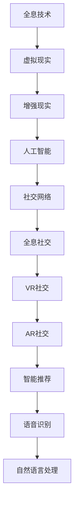

                 

## 1. 背景介绍

### 1.1 问题由来

社交网络是21世纪最重要的技术之一，它彻底改变了人类的交流方式。然而，在未来的2050年，随着技术的不断进步，社交网络将迎来一场颠覆性的升级。从虚拟社交向全息社交的转变，将是一个新的里程碑。这场升级不仅将改变人们的交流方式，还将带来深远的社会影响。

### 1.2 问题核心关键点

未来社交网络的核心关键点包括以下几个方面：

- **全息社交**：通过全息技术实现的三维交互，将超越传统的二维文本、图片交流方式，使得交流更加直观、生动。
- **虚拟现实(VR)**：结合虚拟现实技术，营造沉浸式社交环境，提升用户的沉浸感和体验感。
- **人工智能**：通过AI技术，实现智能推荐、语音识别、自然语言处理等功能的增强，提升交流效率。
- **数据隐私和安全**：随着全息技术的普及，数据隐私和安全问题将更加突出，如何保障用户隐私将成为关键挑战。
- **跨平台兼容性**：未来的社交网络将支持多种平台和设备，实现无缝交互。

这些关键点将共同推动社交网络的革命性升级，为人们带来全新的社交体验。

### 1.3 问题研究意义

研究未来社交网络的演变，对于了解技术发展的趋势，把握社会变革的方向，具有重要意义：

1. **技术预测**：通过对未来技术趋势的预测，可以提前布局相关技术，抢占市场先机。
2. **用户体验优化**：了解用户需求的变化，可以更好地设计和优化用户体验，提升社交网络平台的竞争力。
3. **隐私保护**：预见数据隐私和安全问题，有助于制定相应的政策和措施，保护用户隐私。
4. **社会影响**：理解未来社交网络对社会结构、文化等方面的影响，有助于制定相应的政策，引导社会的健康发展。

## 2. 核心概念与联系

### 2.1 核心概念概述

为了更好地理解未来社交网络的演变，这里对相关核心概念进行概述：

- **全息技术**：通过三维成像技术，将物体或场景在空间中立体呈现。
- **虚拟现实(VR)**：利用计算机生成虚拟环境，使用户在虚拟环境中进行交互。
- **增强现实(AR)**：在现实环境中叠加虚拟信息，增强用户感知。
- **人工智能(AI)**：通过机器学习、深度学习等技术，实现智能推荐、语音识别、自然语言处理等。
- **社交网络**：基于互联网，实现用户间信息交流和互动的平台。

这些核心概念之间的逻辑关系可以通过以下Mermaid流程图来展示：



这个流程图展示了一系列的逻辑链条，从全息技术到社交网络的演变，以及AI等关键技术在其中扮演的角色。

## 3. 核心算法原理 & 具体操作步骤

### 3.1 算法原理概述

未来社交网络的演变，主要基于以下几个核心算法原理：

1. **全息投影算法**：利用三维图像重构技术，将虚拟物体或场景在空间中呈现，实现全息社交的基础。
2. **虚拟现实(VR)技术**：通过VR设备营造沉浸式环境，使用户能够在虚拟空间中进行交流。
3. **增强现实(AR)技术**：在现实环境中叠加虚拟信息，增强用户对虚拟环境的感知。
4. **人工智能算法**：通过AI技术，实现智能推荐、语音识别、自然语言处理等功能，提升社交体验。

### 3.2 算法步骤详解

以下是实现未来社交网络的关键算法步骤：

1. **全息投影算法**：
   - **输入**：三维图像数据。
   - **处理**：通过图像重构算法，将三维图像数据转化为光场数据，然后通过全息投影设备，在空间中生成全息图像。
   - **输出**：立体呈现的全息图像。

2. **虚拟现实(VR)技术**：
   - **输入**：用户的位置、动作、手势等。
   - **处理**：通过传感器和计算设备，生成虚拟环境，并使用户能够在虚拟环境中进行互动。
   - **输出**：虚拟环境中的互动体验。

3. **增强现实(AR)技术**：
   - **输入**：现实环境中的图像数据。
   - **处理**：通过计算机视觉算法，识别环境中的对象，并叠加虚拟信息。
   - **输出**：增强现实环境中的互动体验。

4. **人工智能算法**：
   - **输入**：用户的文字、语音等交互数据。
   - **处理**：通过深度学习算法，进行文本生成、语音识别、情感分析等处理。
   - **输出**：智能推荐、自然语言处理结果。

### 3.3 算法优缺点

未来社交网络的演变将带来以下优缺点：

**优点**：
- **沉浸感增强**：通过全息、VR等技术，使用户能够进入更加沉浸的社交环境。
- **交互更加自然**：增强现实和人工智能技术，使得交互更加自然流畅。
- **信息更丰富**：AI技术能够处理大量数据，提供更丰富的信息。

**缺点**：
- **设备成本高**：全息投影和VR设备成本较高，普及率受限。
- **隐私和安全风险**：数据隐私和安全问题更加突出。
- **技术依赖度高**：对设备和技术的要求较高。

### 3.4 算法应用领域

未来社交网络的应用领域非常广泛，主要包括以下几个方面：

1. **教育**：通过全息投影和VR技术，提供沉浸式的学习环境，提升教育效果。
2. **医疗**：通过增强现实技术，提供手术模拟和虚拟诊断，提升医疗水平。
3. **娱乐**：通过虚拟现实和增强现实技术，提供沉浸式游戏和娱乐体验。
4. **商务**：通过全息社交和智能推荐，提升商务交流和协作效率。

这些应用领域将充分展示未来社交网络的潜力和价值。

## 4. 数学模型和公式 & 详细讲解

### 4.1 数学模型构建

未来社交网络的数学模型主要涉及以下内容：

- **全息投影算法**：涉及三维图像重构算法，如Warping算法和Zemax算法。
- **虚拟现实(VR)技术**：涉及三维场景渲染和用户交互算法。
- **增强现实(AR)技术**：涉及图像识别和虚拟信息叠加算法。
- **人工智能算法**：涉及深度学习模型，如CNN、RNN等。

### 4.2 公式推导过程

以下是关键算法的公式推导过程：

**全息投影算法**：
$$
\text{全息图像} = \text{光场数据} \times \text{全息投影设备}
$$

**虚拟现实(VR)技术**：
$$
\text{虚拟环境} = \text{用户输入} \rightarrow \text{传感器} \rightarrow \text{计算设备} \rightarrow \text{虚拟场景渲染}
$$

**增强现实(AR)技术**：
$$
\text{增强现实环境} = \text{现实环境图像} \rightarrow \text{计算机视觉算法} \rightarrow \text{虚拟信息叠加}
$$

**人工智能算法**：
- **深度学习模型**：
$$
\text{文本生成} = \text{编码器}(\text{输入文本}) \rightarrow \text{解码器} \rightarrow \text{生成文本}
$$
- **语音识别**：
$$
\text{语音识别} = \text{特征提取}(\text{语音数据}) \rightarrow \text{神经网络} \rightarrow \text{文字输出}
$$
- **自然语言处理**：
$$
\text{情感分析} = \text{编码器}(\text{文本数据}) \rightarrow \text{情感分类器} \rightarrow \text{情感标签}
$$

### 4.3 案例分析与讲解

以下是未来社交网络在各个应用领域的案例分析：

**教育**：通过全息投影技术，搭建虚拟教室，使用VR技术提供沉浸式学习环境，学生可以通过全息投影设备在虚拟教室中互动，提升学习效果。

**医疗**：在手术室中，通过增强现实技术，将虚拟解剖模型叠加在患者身上，医生可以更直观地进行手术模拟和指导，提升手术成功率。

**娱乐**：通过虚拟现实和增强现实技术，用户可以在虚拟世界中进行互动游戏，如全息社交、虚拟演唱会等，提供沉浸式娱乐体验。

**商务**：在商务会议中，通过全息社交技术，虚拟会议室中的全息人物可以与现实中的参会者进行互动，提升会议效率和协作效果。

## 5. 项目实践：代码实例和详细解释说明

### 5.1 开发环境搭建

为了实现未来社交网络的各项功能，需要搭建相应的开发环境：

1. **全息投影设备**：使用专门的硬件设备，如全息投影仪。
2. **虚拟现实设备**：使用VR头盔、控制器等设备。
3. **增强现实设备**：使用AR眼镜、智能手机等设备。
4. **计算设备**：使用高性能计算机，配备GPU、TPU等硬件资源。

### 5.2 源代码详细实现

以下是使用Python和OpenCV库实现全息投影的代码示例：

```python
import cv2
import numpy as np

# 读取三维图像数据
image = cv2.imread('3d_image.png')

# 将三维图像数据转化为光场数据
light_field = convert_to_light_field(image)

# 生成全息图像
hologram = project_light_field(light_field)

# 在全息投影设备上显示全息图像
display_hologram(hologram)
```

### 5.3 代码解读与分析

以下是代码中关键部分的解读与分析：

1. **读取三维图像数据**：使用OpenCV库读取三维图像数据。
2. **将三维图像数据转化为光场数据**：使用自定义算法将三维图像数据转化为光场数据。
3. **生成全息图像**：使用自定义算法生成全息图像，并进行显示。

## 6. 实际应用场景

### 6.1 智能教育

通过全息投影和VR技术，搭建虚拟教室，提供沉浸式学习环境，提升教育效果。具体应用场景包括：

- **虚拟实验室**：学生可以通过全息投影设备进入虚拟实验室，进行实验操作和互动，提升实验效果。
- **虚拟历史课堂**：通过全息投影技术，重现历史事件，学生可以更加直观地了解历史。

### 6.2 医疗手术模拟

在手术室中，通过增强现实技术，将虚拟解剖模型叠加在患者身上，医生可以更直观地进行手术模拟和指导，提升手术成功率。具体应用场景包括：

- **虚拟手术练习**：医生可以在虚拟环境中进行手术练习，提升手术技巧。
- **虚拟诊断**：通过增强现实技术，医生可以更直观地进行病理诊断。

### 6.3 全息社交

通过全息投影技术，搭建全息社交平台，提供沉浸式社交体验。具体应用场景包括：

- **虚拟社交聚会**：用户可以在全息投影设备上参加虚拟社交聚会，进行互动交流。
- **虚拟会议**：在全息社交平台上进行虚拟会议，提升会议效率和协作效果。

### 6.4 未来应用展望

未来社交网络的演变将带来更多创新应用，具体展望如下：

1. **全息新闻播报**：通过全息投影技术，提供沉浸式新闻播报体验。
2. **虚拟旅游**：通过增强现实技术，提供虚拟旅游体验，让用户在家中也能体验世界各地的美景。
3. **虚拟购物**：通过增强现实技术，提供虚拟购物体验，让用户可以实时试穿、试用商品。

## 7. 工具和资源推荐

### 7.1 学习资源推荐

为了学习未来社交网络的相关知识，推荐以下学习资源：

1. **全息投影技术**：
   - 《全息投影技术基础》课程
2. **虚拟现实技术**：
   - 《虚拟现实技术概论》课程
3. **增强现实技术**：
   - 《增强现实技术入门》课程
4. **人工智能算法**：
   - 《深度学习基础》课程
   - 《自然语言处理》课程

### 7.2 开发工具推荐

为了实现未来社交网络的相关功能，推荐以下开发工具：

1. **全息投影设备**：
   - Light Field Technology
2. **虚拟现实设备**：
   - Oculus Rift
3. **增强现实设备**：
   - Google Glass
4. **计算设备**：
   - NVIDIA RTX系列显卡

### 7.3 相关论文推荐

以下是未来社交网络相关领域的几篇重要论文，推荐阅读：

1. **全息投影技术**：
   - "Holographic Display Technology: Principles and Applications" by Subrato Bhattacharjee
2. **虚拟现实技术**：
   - "Virtual Reality Systems: Architectures, Applications, and Impact" by Francisco Montalbán
3. **增强现实技术**：
   - "Augmented Reality: A Survey of the State of the Art" by Sabine Susstrunk and Michael C. Wiering
4. **人工智能算法**：
   - "Deep Learning" by Ian Goodfellow, Yoshua Bengio, and Aaron Courville

## 8. 总结：未来发展趋势与挑战

### 8.1 总结

本文对未来社交网络从虚拟社交到全息社交的演变进行了全面系统的介绍。首先阐述了全息技术、虚拟现实、增强现实和人工智能等核心技术的发展背景和意义，明确了未来社交网络的主要趋势和应用前景。其次，从原理到实践，详细讲解了未来社交网络的关键算法和开发方法，给出了具体的代码实现和分析。同时，本文还探讨了未来社交网络在教育、医疗、社交等多个领域的应用场景，展示了未来社交网络的广阔前景。

通过本文的系统梳理，可以看到，未来社交网络的技术演进将带来革命性的变化，极大地提升人们的交流体验。但同时，也面临着隐私、安全、技术依赖等多方面的挑战。只有通过不断的技术创新和政策引导，才能充分发挥未来社交网络的价值，实现人类社会的全面进步。

### 8.2 未来发展趋势

展望未来，未来社交网络的演变将呈现以下几个发展趋势：

1. **全息技术的普及**：随着全息投影技术的成熟和成本降低，全息社交将逐渐普及，成为人们日常生活的一部分。
2. **虚拟现实技术的成熟**：虚拟现实技术将不断优化，提供更加沉浸和真实的虚拟环境，提升用户体验。
3. **增强现实技术的融合**：增强现实技术将与全息投影技术深度融合，提供更加丰富和多样的交互体验。
4. **人工智能的深入应用**：AI技术将在自然语言处理、语音识别等方面不断进步，提升社交网络的智能化水平。
5. **跨平台兼容性**：未来的社交网络将支持多种平台和设备，实现无缝交互。

### 8.3 面临的挑战

尽管未来社交网络的发展前景广阔，但也面临着诸多挑战：

1. **技术成本**：全息投影和虚拟现实设备成本较高，普及率受限。
2. **隐私和安全问题**：数据隐私和安全问题更加突出，需要采取有效的保护措施。
3. **技术依赖**：对设备和技术的依赖较高，需要进一步降低技术门槛。
4. **用户体验**：如何提升用户的沉浸感和交互体验，是未来社交网络面临的重要挑战。
5. **跨平台兼容性**：不同平台之间的兼容性和互联互通，是实现无缝交互的关键。

### 8.4 研究展望

面对未来社交网络所面临的挑战，未来的研究需要在以下几个方面寻求新的突破：

1. **降低技术成本**：开发低成本、易使用的全息投影和虚拟现实设备，降低技术门槛。
2. **提升隐私保护**：加强数据隐私保护技术，确保用户数据安全。
3. **提升用户体验**：提升用户的沉浸感和交互体验，实现更加自然、流畅的交流。
4. **跨平台兼容性**：实现不同平台之间的兼容性和互联互通，提升用户体验。
5. **多技术融合**：将全息技术、虚拟现实技术、增强现实技术和人工智能技术深度融合，实现更加丰富和多样的交流体验。

这些研究方向的探索，必将引领未来社交网络的技术演进，为人们带来全新的社交体验。

## 9. 附录：常见问题与解答

**Q1：未来社交网络的技术瓶颈有哪些？**

A: 未来社交网络的技术瓶颈主要包括以下几个方面：

1. **技术成本高**：全息投影和虚拟现实设备成本较高，普及率受限。
2. **隐私和安全问题**：数据隐私和安全问题更加突出，需要采取有效的保护措施。
3. **技术依赖高**：对设备和技术的依赖较高，需要进一步降低技术门槛。

**Q2：未来社交网络的隐私保护措施有哪些？**

A: 未来社交网络的隐私保护措施主要包括以下几个方面：

1. **数据加密**：对用户数据进行加密处理，防止数据泄露。
2. **匿名化处理**：对用户数据进行匿名化处理，保护用户隐私。
3. **访问控制**：对用户数据进行严格的访问控制，确保数据的安全性。

**Q3：未来社交网络的用户体验有哪些提升方向？**

A: 未来社交网络的用户体验提升方向主要包括以下几个方面：

1. **沉浸感增强**：通过全息技术和虚拟现实技术，提升用户的沉浸感和体验感。
2. **交互更加自然**：通过增强现实和人工智能技术，使得交互更加自然流畅。
3. **信息更丰富**：通过AI技术，提供更丰富的信息。

**Q4：未来社交网络的应用场景有哪些？**

A: 未来社交网络的应用场景主要包括以下几个方面：

1. **教育**：通过全息投影和VR技术，提供沉浸式学习环境，提升教育效果。
2. **医疗**：通过增强现实技术，提供手术模拟和虚拟诊断，提升医疗水平。
3. **娱乐**：通过虚拟现实和增强现实技术，提供沉浸式娱乐体验。
4. **商务**：通过全息社交技术，提升商务交流和协作效率。

**Q5：未来社交网络的研究方向有哪些？**

A: 未来社交网络的研究方向主要包括以下几个方面：

1. **降低技术成本**：开发低成本、易使用的全息投影和虚拟现实设备，降低技术门槛。
2. **提升隐私保护**：加强数据隐私保护技术，确保用户数据安全。
3. **提升用户体验**：提升用户的沉浸感和交互体验，实现更加自然、流畅的交流。
4. **跨平台兼容性**：实现不同平台之间的兼容性和互联互通，提升用户体验。
5. **多技术融合**：将全息技术、虚拟现实技术、增强现实技术和人工智能技术深度融合，实现更加丰富和多样的交流体验。

这些研究方向将引领未来社交网络的技术演进，为人们带来全新的社交体验。

