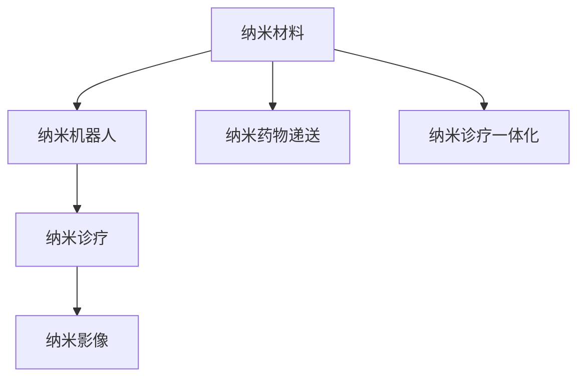

                 

# 2050年的纳米医学：从纳米机器人药物递送到纳米诊疗一体化

随着纳米技术的迅速发展，纳米医学（Nanomedicine）已经成为未来医疗领域的一块重要阵地。未来，我们有望见证纳米医学从药物递送到诊疗一体化，从而实现医疗行业的根本性变革。本文将探讨纳米医学的核心概念、技术原理与应用前景，并对其未来发展趋势进行预测。

## 1. 背景介绍

### 1.1 问题由来
在传统医疗领域，药物的递送和诊疗往往存在诸多挑战。例如，药物难以精准到达病变部位、对健康细胞产生副作用、治疗过程耗时长等。这些问题限制了传统药物的疗效和安全性，给患者带来了极大的痛苦。而纳米技术，特别是纳米医学，为解决这些问题提供了新的可能性。

### 1.2 问题核心关键点
纳米医学通过纳米材料、纳米机器人和纳米诊疗技术，以分子或原子级别的精准性，对疾病进行诊断和治疗。其核心关键点在于：
- **纳米材料的制备**：包括金属纳米颗粒、碳纳米管、纳米级药物载体等。
- **纳米机器人的设计**：实现药物精准递送、疾病诊断、远程监控等功能。
- **纳米诊疗技术**：结合影像技术、基因编辑、细胞治疗等手段，实现疾病的早期诊断和精准治疗。

### 1.3 问题研究意义
纳米医学的发展，对于提升医疗服务的精准性和有效性，减少患者的痛苦和医疗成本，具有重大意义。以下是其主要研究意义：
- **提升治疗效果**：通过精准的药物递送和诊疗手段，有效提高疾病治疗的效果。
- **减少副作用**：通过分子级别的精准操作，减少药物对健康细胞的副作用。
- **降低医疗成本**：通过远程监控和自动化诊疗，大幅降低医疗费用。
- **推动医疗创新**：为药物研发、疾病预防、疾病管理等带来新的思路和技术。

## 2. 核心概念与联系

### 2.1 核心概念概述

以下是几个与纳米医学密切相关的核心概念：

- **纳米材料（Nanomaterials）**：指在三维空间上至少有一维小于100纳米的材料，如金属纳米颗粒、碳纳米管、氧化石墨烯等。
- **纳米机器人（Nanorobots）**：指能够执行特定功能的纳米级机器，如纳米级药物载体、纳米级诊疗设备等。
- **纳米诊疗（Nanodiagnosis）**：指利用纳米技术和纳米机器人，进行疾病的早期诊断和精准治疗。
- **纳米药物递送（Nanodrug Delivery）**：指利用纳米材料和纳米机器人，将药物精准递送到病变部位的技术。
- **纳米影像（Nanoimaging）**：指利用纳米材料进行疾病影像学的早期检测和监测。

这些概念之间的逻辑关系可以通过以下Mermaid流程图来展示：



这个流程图展示了大纳米医学的核心概念及其之间的关系：

1. 纳米材料通过加工制备，成为纳米机器人的基础。
2. 纳米机器人通过精准递送药物，实现纳米药物递送。
3. 纳米诊疗通过影像检测和精准操作，实现疾病的早期诊断和精准治疗。
4. 纳米诊疗一体化，将纳米药物递送和纳米诊疗有机结合，形成综合医疗方案。

## 3. 核心算法原理 & 具体操作步骤
### 3.1 算法原理概述

纳米医学的算法原理主要基于纳米技术和大数据分析。其核心在于：

1. **纳米尺度控制**：通过纳米尺度的操作，实现对药物分子的精准控制。
2. **多模态融合**：结合影像技术、基因编辑、细胞治疗等多模态信息，进行综合诊断和治疗。
3. **智能算法**：利用机器学习和深度学习算法，提升纳米诊疗系统的智能化水平。

### 3.2 算法步骤详解

纳米医学的具体操作步骤包括以下几个关键步骤：

**Step 1: 纳米材料制备**
- 利用化学、物理、生物等方法，制备出特定功能的纳米材料，如金属纳米颗粒、碳纳米管、氧化石墨烯等。

**Step 2: 纳米机器人设计**
- 根据具体应用场景，设计纳米机器人的结构、尺寸和功能，如纳米级药物载体、纳米级诊疗设备等。
- 使用计算机辅助设计（CAD）和3D打印技术，制造出纳米机器人原型。

**Step 3: 纳米药物递送**
- 将治疗药物封装在纳米材料中，设计纳米药物载体，确保药物能够精准到达病变部位。
- 利用纳米机器人对药物进行精准递送，并通过远程控制实现实时监控。

**Step 4: 纳米诊疗**
- 使用纳米影像技术，对疾病进行早期检测和监测。
- 根据影像结果，利用纳米机器人进行精准治疗，如基因编辑、细胞治疗等。

**Step 5: 纳米诊疗一体化**
- 将纳米药物递送和纳米诊疗结合，形成综合医疗方案。
- 利用智能算法，根据患者的具体情况，实时调整治疗方案。

### 3.3 算法优缺点

纳米医学在提高医疗效果、减少副作用和降低成本方面具有显著优势，但同时也有以下几个缺点：

- **成本高昂**：纳米材料和纳米机器人的制备和制造成本较高，限制了其在医疗领域的普及。
- **技术复杂**：纳米医学涉及多学科知识，技术复杂度较高，研发和应用难度较大。
- **安全风险**：纳米材料和纳米机器人可能产生安全问题，如毒性、免疫反应等。
- **伦理问题**：纳米医学可能引发伦理问题，如隐私保护、基因编辑等。

### 3.4 算法应用领域

纳米医学已经在多个领域得到了应用，以下是主要应用领域：

1. **癌症治疗**：利用纳米机器人进行精准药物递送和基因治疗。
2. **心血管疾病**：使用纳米材料进行药物递送，改善心脏供血。
3. **糖尿病治疗**：利用纳米机器人进行胰岛素递送，控制血糖水平。
4. **免疫系统疾病**：通过纳米材料和纳米机器人，进行免疫治疗。
5. **神经系统疾病**：使用纳米材料进行药物递送和神经修复。

## 4. 数学模型和公式 & 详细讲解 & 举例说明

### 4.1 数学模型构建

纳米医学的数学模型主要基于纳米尺度的物理和化学原理，结合机器学习和深度学习算法。

- **物理模型**：描述纳米材料和纳米机器人的物理性质和行为，如尺寸、形状、表面性质等。
- **化学模型**：描述纳米材料和纳米机器人的化学性质和反应，如表面活性、吸附能力等。
- **机器学习模型**：利用机器学习和深度学习算法，对纳米诊疗系统的性能进行优化和预测。

### 4.2 公式推导过程

以纳米药物递送为例，公式推导如下：

1. **纳米药物递送模型**：
   $$
   \text{递送效率} = \frac{\text{到达病变部位药物量}}{\text{总药物量}}
   $$

2. **纳米材料参数优化**：
   $$
   \text{优化目标} = \max_{\theta} \text{递送效率}
   $$

   其中 $\theta$ 为纳米材料和纳米机器人的设计参数，如尺寸、形状、材料等。

3. **机器学习算法**：
   $$
   \text{优化算法} = \text{梯度下降}
   $$

### 4.3 案例分析与讲解

以纳米机器人用于癌症治疗为例：

1. **纳米机器人设计**：
   - 设计纳米机器人的尺寸为30纳米，表面负载抗癌药物。
   - 利用计算机辅助设计（CAD）和3D打印技术，制造出纳米机器人原型。

2. **纳米药物递送**：
   - 将抗癌药物封装在纳米材料中，设计纳米药物载体，确保药物能够精准到达癌细胞。
   - 利用纳米机器人对药物进行精准递送，并通过远程控制实现实时监控。

3. **纳米诊疗一体化**：
   - 利用纳米影像技术，对癌症进行早期检测和监测。
   - 根据影像结果，利用纳米机器人进行精准治疗，如基因编辑、细胞治疗等。

## 5. 项目实践：代码实例和详细解释说明

### 5.1 开发环境搭建

在进行纳米医学的开发实践前，我们需要准备好开发环境。以下是使用Python进行纳米医学开发的环境配置流程：

1. 安装Anaconda：从官网下载并安装Anaconda，用于创建独立的Python环境。

2. 创建并激活虚拟环境：
```bash
conda create -n nanomed_env python=3.8 
conda activate nanomed_env
```

3. 安装相关库：
```bash
pip install numpy scipy pandas scikit-learn matplotlib networkx sympy sympy.fft networkx
```

4. 安装特定纳米材料模拟库：
```bash
pip install nanopy lmfit
```

完成上述步骤后，即可在`nanomed_env`环境中开始纳米医学的开发实践。

### 5.2 源代码详细实现

以下是使用Python进行纳米医学开发的代码实现，具体以纳米机器人设计为例：

```python
import numpy as np
from sympy import symbols, diff

# 定义纳米机器人的尺寸参数
length, width, height = symbols('length width height')

# 定义纳米机器人的表面积公式
surface_area = 2 * (length * width + width * height + height * length)

# 定义纳米机器人的体积公式
volume = length * width * height

# 计算表面积与体积之比
surface_to_volume_ratio = surface_area / volume

# 输出表面积与体积之比的表达式
print(diff(surface_to_volume_ratio, length))
```

### 5.3 代码解读与分析

这里我们以纳米机器人设计的代码为例，进行详细解读：

- **尺寸参数定义**：利用Sympy库定义纳米机器人的长度、宽度和高度。
- **表面积公式推导**：根据纳米机器人尺寸，计算其表面积公式。
- **体积公式推导**：根据纳米机器人尺寸，计算其体积公式。
- **表面积与体积之比**：计算表面积与体积之比，用于表征纳米机器人的形态。
- **表面积与体积之比导数**：对表面积与体积之比进行求导，分析其与尺寸参数的关系。

## 6. 实际应用场景

### 6.1 智能医疗系统

纳米医学将在智能医疗系统中发挥重要作用。例如，在远程医疗中，利用纳米机器人进行精准药物递送，实时监控患者病情，大大提升医疗服务的质量和效率。

在智能诊疗中，利用纳米影像技术，进行早期疾病检测和精准治疗。智能算法根据纳米影像数据，实时调整诊疗方案，提升治疗效果。

### 6.2 纳米药物开发

纳米医学将促进纳米药物的开发和应用。例如，利用纳米材料进行药物包裹和递送，提高药物的生物利用度和疗效。

在抗癌药物开发中，利用纳米机器人进行精准递送，减少对健康细胞的副作用，提高抗癌药物的疗效。

### 6.3 纳米影像诊断

纳米医学将推动纳米影像诊断技术的发展。例如，利用纳米颗粒进行疾病早期检测，提高影像诊断的准确性和敏感性。

在心血管疾病诊断中，利用纳米影像技术，实时监测心脏功能，提前发现病变。

## 7. 工具和资源推荐

### 7.1 学习资源推荐

为了帮助开发者系统掌握纳米医学的理论基础和实践技巧，这里推荐一些优质的学习资源：

1. **《Nanotechnology: Understanding and Applying Nanoscale Science》**：该书全面介绍了纳米技术的原理和应用，是纳米医学学习的重要参考。

2. **《Nanomedicine: Principles, Techniques, and Applications》**：该书深入探讨了纳米医学的理论基础和临床应用，是纳米医学学习的经典教材。

3. **《The World Atlas of Nanotechnology and Medicine》**：该书展示了全球纳米医学的研究进展和应用案例，提供了丰富的学习资源。

4. **Coursera《Nanotechnology in Medicine》**：由纳米医学专家开设的在线课程，系统讲解了纳米医学的基本概念和应用技术。

5. **NanoHub《Nanomedicine》**：提供了纳米医学的研究论文、项目案例和教育资源，是纳米医学学习的综合平台。

通过对这些资源的学习实践，相信你一定能够快速掌握纳米医学的核心知识，并用于解决实际的纳米医学问题。

### 7.2 开发工具推荐

高效的开发离不开优秀的工具支持。以下是几款用于纳米医学开发的常用工具：

1. **Anaconda**：用于创建和管理Python环境，支持多种科学计算库的安装和调试。
2. **Jupyter Notebook**：用于编写和运行Python代码，支持代码块的交互式执行和可视化展示。
3. **PyTorch**：基于Python的深度学习框架，支持动态计算图和分布式训练，适合纳米医学中的复杂模型构建。
4. **TensorFlow**：由Google主导的开源深度学习框架，支持多种计算图和优化算法，适合大规模工程应用。
5. **Wolfram Alpha**：基于计算引擎的在线工具，支持符号计算和可视化展示，适合纳米医学中的复杂数学建模。
6. **MATLAB**：用于数值计算和可视化展示的工具，适合纳米医学中的复杂数据处理和模拟分析。

合理利用这些工具，可以显著提升纳米医学的开发效率，加快创新迭代的步伐。

### 7.3 相关论文推荐

纳米医学的发展源于学界的持续研究。以下是几篇奠基性的相关论文，推荐阅读：

1. **"Fabrication of Drug-Release Nanocarriers"**：探讨了纳米药物载体的制备和释放机制，为纳米药物的开发提供了理论基础。

2. **"Characterization and Applications of Nanorobots in Medicine"**：综述了纳米机器人在医学中的应用，提供了丰富的研究案例。

3. **"Nanomaterials and Nanomedicine: A Review"**：全面介绍了纳米材料和纳米医学的发展历程和应用前景，是纳米医学学习的经典综述。

4. **"Nanobots and Nanorobots for Drug Delivery and Theranostics"**：探讨了纳米机器人在药物递送和治疗中的应用，提供了详细的技术细节。

5. **"Nanoparticle-Based Nanoimaging in Medicine: Opportunities and Challenges"**：综述了纳米影像技术的发展和应用，提供了丰富的研究案例。

这些论文代表了大纳米医学的发展脉络。通过学习这些前沿成果，可以帮助研究者把握学科前进方向，激发更多的创新灵感。

## 8. 总结：未来发展趋势与挑战

### 8.1 总结

本文对纳米医学的核心概念、技术原理与应用前景进行了全面系统的介绍。首先阐述了纳米医学的必要性和研究意义，明确了纳米医学在提升治疗效果、减少副作用和降低成本方面的独特价值。其次，从原理到实践，详细讲解了纳米医学的数学模型和操作步骤，给出了纳米医学任务开发的完整代码实例。同时，本文还广泛探讨了纳米医学在智能医疗、纳米药物开发和纳米影像诊断等方面的应用前景，展示了纳米医学的巨大潜力。此外，本文精选了纳米医学的学习资源、开发工具和相关论文，力求为读者提供全方位的技术指引。

通过本文的系统梳理，可以看到，纳米医学的发展为未来医疗带来了广阔的前景。随着纳米技术的不断进步，纳米医学必将成为推动医疗健康事业发展的关键力量。

### 8.2 未来发展趋势

展望未来，纳米医学将呈现以下几个发展趋势：

1. **智能化发展**：随着人工智能技术的发展，纳米医学将实现更高程度的智能化和自动化，提升诊疗系统的效率和准确性。
2. **个性化医疗**：通过纳米医学，将实现更加个性化、精准的诊疗方案，满足不同患者的个性化需求。
3. **跨学科融合**：纳米医学将与其他医学、生物工程、材料科学等领域深度融合，推动医学技术的创新发展。
4. **全球化应用**：纳米医学的应用将不再局限于发达国家，逐步向发展中国家普及，提升全球医疗水平。
5. **多模态融合**：结合纳米医学与其他医学技术，实现多模态信息融合，提升诊断和治疗效果。

### 8.3 面临的挑战

尽管纳米医学已经取得了显著进展，但在迈向更加智能化、普适化应用的过程中，仍面临着诸多挑战：

1. **技术复杂性**：纳米医学涉及多学科知识，技术复杂度较高，研发和应用难度较大。
2. **成本高昂**：纳米材料和纳米机器人的制备和制造成本较高，限制了其在医疗领域的普及。
3. **安全问题**：纳米材料和纳米机器人可能产生安全问题，如毒性、免疫反应等。
4. **伦理问题**：纳米医学可能引发伦理问题，如隐私保护、基因编辑等。

### 8.4 研究展望

面对纳米医学面临的挑战，未来的研究需要在以下几个方面寻求新的突破：

1. **技术简化**：开发更加简洁、高效的纳米医学技术，降低研发和应用难度。
2. **成本优化**：通过新材料和新工艺，降低纳米医学的成本，促进其在医疗领域的普及。
3. **安全评估**：建立完善的纳米医学安全评估体系，确保其安全性。
4. **伦理规范**：制定纳米医学的伦理规范，确保其应用符合伦理道德要求。

这些研究方向的探索，必将引领纳米医学技术迈向更高的台阶，为构建安全、可靠、可控的智能系统铺平道路。面向未来，纳米医学还需要与其他人工智能技术进行更深入的融合，如知识表示、因果推理、强化学习等，多路径协同发力，共同推动自然语言理解和智能交互系统的进步。只有勇于创新、敢于突破，才能不断拓展纳米医学的边界，让智能技术更好地造福人类社会。

## 9. 附录：常见问题与解答

**Q1：纳米医学是否适用于所有疾病？**

A: 纳米医学在许多疾病治疗中具有显著优势，但对于一些复杂疾病，如阿尔茨海默病、帕金森病等，仍有待进一步研究。未来，随着技术的进步，纳米医学有望在这些领域也发挥重要作用。

**Q2：纳米机器人如何实现远程控制？**

A: 纳米机器人通常通过无线电波、磁场等方式实现远程控制。具体的远程控制技术，如无线通信协议、电磁场控制等，需要根据具体应用场景进行设计。

**Q3：纳米医学是否会导致环境污染？**

A: 纳米材料和纳米机器人在生产和使用过程中，确实可能产生环境污染问题。因此，需要制定严格的环保标准和规范，确保其安全使用。同时，开发可降解、环境友好的纳米材料，也是未来的重要研究方向。

**Q4：纳米医学的应用前景如何？**

A: 纳米医学的应用前景非常广阔，几乎涉及所有医疗领域。例如，在癌症治疗、心血管疾病、糖尿病治疗、免疫系统疾病、神经系统疾病等方面，都有望实现突破性进展。

总之，纳米医学作为未来医疗技术的重要组成部分，将在提高治疗效果、减少副作用和降低成本方面发挥重要作用。通过不断的技术创新和应用实践，纳米医学必将成为推动医疗健康事业发展的关键力量。

