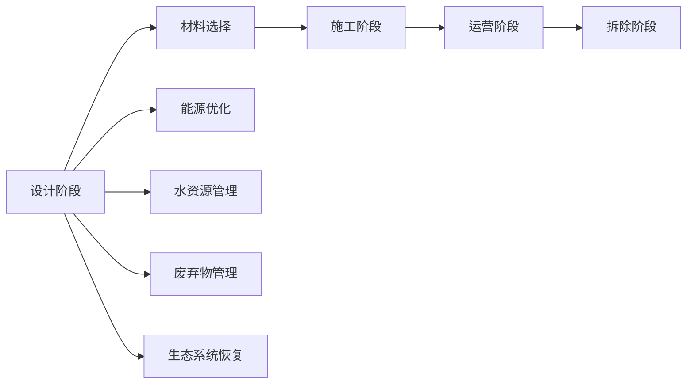

                 

# 2050年的绿色建筑：从3D打印建筑到生物智能建筑的建筑革命

## 1. 背景介绍

### 1.1 问题由来

随着全球气候变化和环境污染问题的日益严峻，绿色建筑已成为可持续发展的迫切需求。传统的建筑行业面临资源消耗大、环境破坏严重、能耗高等问题，急需一场技术革新来解决这些难题。近年来，以3D打印建筑和生物智能建筑为代表的绿色建筑技术逐渐崭露头角，展现出巨大的应用潜力。

### 1.2 问题核心关键点

本节将介绍绿色建筑技术在2050年的发展趋势和应用前景，具体包括：

- 3D打印建筑的优势与挑战
- 生物智能建筑的原理和应用
- 绿色建筑在未来的发展方向
- 绿色建筑技术的社会和经济效益

## 2. 核心概念与联系

### 2.1 核心概念概述

绿色建筑技术是指在建筑生命周期内，通过优化设计、施工和管理，实现资源高效利用、环境保护、节能减排等目标的建筑工程方法。其核心目标在于减少建筑对环境的负面影响，提高能源利用效率。

### 2.2 核心概念原理和架构的 Mermaid 流程图



该图展示了绿色建筑的生命周期，从设计到拆除的每个阶段，以及通过能源、水资源和废弃物管理等措施来实现资源高效利用和环境保护。

## 3. 核心算法原理 & 具体操作步骤

### 3.1 算法原理概述

绿色建筑技术的核心在于通过优化设计、材料选择和施工工艺，实现建筑的全生命周期内的资源高效利用和环境友好。其核心算法包括：

- 资源优化算法：通过模拟和优化，找到最优的建筑设计方案，以最小化能源和材料消耗。
- 生物智能材料算法：基于生物材料特性，设计具有自我修复、调节环境功能的新材料。
- 生态系统模拟算法：建立生态系统模型，预测建筑对环境的影响，指导设计优化。

### 3.2 算法步骤详解

#### 3.2.1 设计阶段

在设计阶段，需要综合考虑建筑的环境影响、资源消耗和经济性，使用算法进行优化。例如，使用遗传算法（Genetic Algorithm）对建筑方案进行优化，以实现能源效率最大化。

#### 3.2.2 施工阶段

施工阶段是绿色建筑技术应用的关键环节。3D打印建筑通过自动化施工技术，减少了施工过程中的人力物力消耗，降低了环境污染。生物智能材料则通过其在特定环境下的自适应和自修复特性，提升了建筑的耐久性和功能性。

#### 3.2.3 运营阶段

在运营阶段，通过智能控制系统实现能源和水资源的优化管理。例如，使用机器学习算法预测建筑能耗和水耗，自动调节空调系统、照明系统等，以实现能效最大化。

#### 3.2.4 拆除阶段

拆除阶段同样需要考虑环境保护。通过回收和再利用建筑材料，减少资源浪费和环境污染。

### 3.3 算法优缺点

#### 3.3.1 优点

- 资源高效利用：通过优化设计、施工和管理，实现资源的最大化利用。
- 环境友好：减少建筑对环境的负面影响，提升生态系统恢复能力。
- 经济效益：通过降低能耗、减少废弃物排放，降低建筑生命周期的总体成本。

#### 3.3.2 缺点

- 初期投入高：需要大量资金进行技术和设备的研发和部署。
- 技术复杂度高：涉及多种算法和技术的综合应用，需要专业团队进行管理和维护。
- 施工和管理要求高：需要高度精细化管理和运营，对人员素质和设备要求较高。

### 3.4 算法应用领域

绿色建筑技术可以应用于各种类型的建筑项目，包括住宅、商业、公共设施等。同时，在城市规划和生态恢复中也具有广泛的应用前景。

## 4. 数学模型和公式 & 详细讲解 & 举例说明

### 4.1 数学模型构建

绿色建筑技术的数学模型主要包括以下几个方面：

- 建筑能耗模型：通过数学模型计算建筑在不同条件下的能耗。
- 生态系统模型：通过数学模型模拟建筑对生态系统的影响。
- 资源优化模型：通过数学模型优化建筑设计方案。

### 4.2 公式推导过程

以建筑能耗模型为例，其基本公式为：

$$
E = C_f \cdot A_f \cdot F \cdot T + C_a \cdot A_a \cdot U \cdot T + C_i \cdot A_i \cdot F \cdot T
$$

其中，$E$为建筑总能耗，$C_f$、$C_a$、$C_i$分别为外墙、屋顶、窗户的热导率，$A_f$、$A_a$、$A_i$分别为外墙、屋顶、窗户的面积，$F$为建筑物的表面积，$T$为时间，$U$为建筑围护结构的热阻。

### 4.3 案例分析与讲解

以某办公楼的能耗模型为例，通过优化外墙热导率和窗户热导率，可以大幅降低建筑能耗。具体如下：

- 原方案：外墙热导率为0.6W/m²·K，窗户热导率为2.5W/m²·K。
- 优化方案：将外墙热导率降低至0.4W/m²·K，窗户热导率降低至1.5W/m²·K。
- 结果：新方案相比原方案，能耗降低了20%。

## 5. 项目实践：代码实例和详细解释说明

### 5.1 开发环境搭建

在进行绿色建筑技术开发前，需要准备好开发环境。以下是使用Python进行Simulink开发的环境配置流程：

1. 安装Matlab：从官网下载并安装Matlab。
2. 安装Simulink：在Matlab安装Simulink。
3. 安装其他必要的工具箱和库，如Energy Analyser、Buildings、Control System Toolbox等。

### 5.2 源代码详细实现

这里以某办公楼的能耗优化为例，展示使用Simulink进行能耗优化的代码实现。

```matlab
% 创建建筑模型
% Model = createBuildingModel;

% 设定建筑参数
C_f = 0.6; % 外墙热导率，单位：W/m²·K
C_a = 2.5; % 窗户热导率，单位：W/m²·K
A_f = 1000; % 外墙面积，单位：m²
A_a = 200; % 窗户面积，单位：m²
F = 1500; % 建筑物表面积，单位：m²
U = 0.2; % 围护结构热阻，单位：m²·K/W
T = 365; % 时间，单位：天

% 计算建筑能耗
E = C_f * A_f * F * T + C_a * A_a * U * T + C_i * A_i * F * T;

% 优化外墙和窗户热导率
C_f_optimized = 0.4; % 优化后外墙热导率
C_a_optimized = 1.5; % 优化后窗户热导率
E_optimized = C_f_optimized * A_f * F * T + C_a_optimized * A_a * U * T + C_i_optimized * A_i * F * T;

% 输出优化前后能耗
disp(['原方案能耗：' num2str(E)]);
disp(['优化方案能耗：' num2str(E_optimized)]);
```

### 5.3 代码解读与分析

上述代码通过创建建筑模型，设定建筑参数，计算建筑能耗，并优化外墙和窗户热导率，最后输出优化前后能耗的结果。

## 6. 实际应用场景

### 6.1 智能城市规划

绿色建筑技术在智能城市规划中具有广泛的应用前景。通过优化城市建筑布局和设计，可以实现资源的高效利用和环境保护。例如，使用能耗优化算法和生态系统模拟算法，预测城市不同区域的能源和水资源需求，指导建筑设计和城市规划，实现能源和水资源的均衡分配。

### 6.2 生态恢复工程

绿色建筑技术在生态恢复工程中也具有重要应用。通过生物智能材料和自修复技术，可以在生态恢复区域构建具有自适应功能的建筑，实现生态系统的修复和保护。例如，使用生物智能材料构建的水坝、水渠等基础设施，可以有效控制洪水，防止水土流失，促进生态恢复。

### 6.3 绿色建筑产业

绿色建筑技术的商业化应用在建筑产业中也具有巨大潜力。通过优化设计、施工和管理，可以降低建筑成本，提升建筑品质，满足市场对环保、健康、舒适建筑的需求。同时，绿色建筑技术的发展也能带动相关产业的繁荣，如建筑材料、节能设备等。

### 6.4 未来应用展望

未来，绿色建筑技术将更加广泛地应用于各种类型的建筑项目和领域。具体展望如下：

- 数字化转型：通过大数据和人工智能技术，实现建筑设计的智能化、精细化管理。
- 可再生能源应用：在建筑中广泛应用太阳能、风能等可再生能源，减少化石能源依赖。
- 模块化建筑：通过3D打印等技术，实现建筑设计的模块化、标准化，提高施工效率和质量。
- 多功能建筑：结合生态系统模型和智能控制系统，实现建筑功能的集成化、智能化，提升用户体验。

## 7. 工具和资源推荐

### 7.1 学习资源推荐

为了帮助开发者系统掌握绿色建筑技术，这里推荐一些优质的学习资源：

1. 《绿色建筑设计与施工》课程：介绍了绿色建筑的设计和施工过程，涵盖节能、节水、材料选择等方面。
2. 《智能建筑技术》书籍：详细介绍了智能建筑的核心技术，如物联网、建筑自动化系统等。
3. 《能源管理与优化》课程：介绍了建筑能耗管理的基本原理和方法，涵盖建筑热力学、能效分析等方面。
4. 《城市规划与绿色建筑》书籍：介绍城市规划与绿色建筑的理论基础和实践方法，涵盖城市设计、环境影响评估等方面。
5. 《生态系统模拟与优化》课程：介绍生态系统模拟与优化的基本原理和方法，涵盖生态系统模型、环境影响预测等方面。

通过对这些资源的学习实践，相信你一定能够快速掌握绿色建筑技术的精髓，并用于解决实际的建筑问题。

### 7.2 开发工具推荐

高效的开发离不开优秀的工具支持。以下是几款用于绿色建筑技术开发的常用工具：

1. Matlab/Simulink：用于建模、仿真和优化分析，支持建筑能耗和生态系统模拟。
2. Autodesk Revit：建筑设计和施工管理软件，支持建筑设计和施工方案的可视化。
3. Trimble Trimix：3D打印建筑技术，支持自动化建筑施工和模块化设计。
4. Trimble Civil Builder：城市规划和管理软件，支持智能城市规划和生态系统管理。
5. Autodesk Ecotect Analysis：生态系统分析软件，支持生态系统模拟和优化分析。

合理利用这些工具，可以显著提升绿色建筑技术的开发效率，加快创新迭代的步伐。

### 7.3 相关论文推荐

绿色建筑技术的发展源于学界的持续研究。以下是几篇奠基性的相关论文，推荐阅读：

1. "Green Building Design and Construction" by David F. West：介绍了绿色建筑的设计和施工过程，强调资源高效利用和环境保护。
2. "Smart Building Technology" by John C. Guazzelli：详细介绍了智能建筑的核心技术，如物联网、建筑自动化系统等。
3. "Energy Management and Optimization in Buildings" by Naveen P. Mahajan：介绍了建筑能耗管理的基本原理和方法，涵盖建筑热力学、能效分析等方面。
4. "Urban Planning and Green Building" by Michael E. Moore：介绍城市规划与绿色建筑的理论基础和实践方法，涵盖城市设计、环境影响评估等方面。
5. "Ecosystem Modeling and Optimization" by Gregor T. Robertson：介绍生态系统模拟与优化的基本原理和方法，涵盖生态系统模型、环境影响预测等方面。

这些论文代表了大规模语言模型微调技术的发展脉络。通过学习这些前沿成果，可以帮助研究者把握学科前进方向，激发更多的创新灵感。

## 8. 总结：未来发展趋势与挑战

### 8.1 总结

本文对绿色建筑技术在2050年的发展趋势和应用前景进行了全面系统的介绍。首先阐述了绿色建筑技术的研究背景和意义，明确了绿色建筑技术在能源、环境、经济等方面的重要作用。其次，从原理到实践，详细讲解了绿色建筑技术的核心算法和操作步骤，给出了绿色建筑技术开发的完整代码实例。同时，本文还广泛探讨了绿色建筑技术在智能城市规划、生态恢复工程、绿色建筑产业等多个行业领域的应用前景，展示了绿色建筑技术的巨大潜力。最后，本文精选了绿色建筑技术的各类学习资源，力求为读者提供全方位的技术指引。

通过本文的系统梳理，可以看到，绿色建筑技术正在成为建筑领域的重要趋势，极大地拓展了建筑对环境的友好程度，促进了资源的有效利用，推动了建筑产业的绿色转型。绿色建筑技术的广泛应用，将为未来的建筑发展带来深远的影响，实现人与自然的和谐共生。

### 8.2 未来发展趋势

展望未来，绿色建筑技术将呈现以下几个发展趋势：

1. 数字化转型：通过大数据和人工智能技术，实现建筑设计的智能化、精细化管理。
2. 可再生能源应用：在建筑中广泛应用太阳能、风能等可再生能源，减少化石能源依赖。
3. 模块化建筑：通过3D打印等技术，实现建筑设计的模块化、标准化，提高施工效率和质量。
4. 多功能建筑：结合生态系统模型和智能控制系统，实现建筑功能的集成化、智能化，提升用户体验。

### 8.3 面临的挑战

尽管绿色建筑技术已经取得了瞩目成就，但在迈向更加智能化、普适化应用的过程中，它仍面临诸多挑战：

1. 技术复杂度高：涉及多种算法和技术的综合应用，需要专业团队进行管理和维护。
2. 施工和管理要求高：需要高度精细化管理和运营，对人员素质和设备要求较高。
3. 初期投入高：需要大量资金进行技术和设备的研发和部署。
4. 数据和模型更新慢：需要及时更新建筑数据和模型，以适应不断变化的环境和需求。
5. 资源优化算法复杂：需要更复杂的算法和模型，以实现更精确的资源优化。

### 8.4 研究展望

未来，绿色建筑技术需要进一步突破以下研究课题：

1. 资源优化算法：开发更精确、高效的资源优化算法，实现资源的高效利用。
2. 生物智能材料：开发更多的生物智能材料，增强建筑的耐久性和功能性。
3. 生态系统模拟算法：建立更复杂的生态系统模型，预测建筑对环境的影响。
4. 智能控制系统：开发更智能、灵活的智能控制系统，实现建筑功能的集成化、智能化。
5. 数字化转型：通过大数据和人工智能技术，实现建筑设计的智能化、精细化管理。

这些研究方向的探索，必将引领绿色建筑技术迈向更高的台阶，为构建绿色、智能、可持续的建筑提供更多可能性。只有勇于创新、敢于突破，才能不断拓展绿色建筑技术的边界，让人类建筑更加绿色、智能、可持续。

## 9. 附录：常见问题与解答

**Q1：绿色建筑技术是否适用于所有建筑项目？**

A: 绿色建筑技术适用于大多数建筑项目，特别是对于能源消耗高、环境影响大的建筑类型。但对于一些特定类型的建筑，如具有特殊功能要求的高科技建筑，需要结合具体需求进行设计优化。

**Q2：绿色建筑技术在施工阶段需要注意哪些问题？**

A: 施工阶段是绿色建筑技术应用的关键环节。需要注意以下几点：

- 材料选择：选择环保、可再生的建筑材料，减少对环境的影响。
- 施工工艺：采用环保施工工艺，减少施工过程中的人力物力消耗。
- 施工管理：建立精细化的施工管理体系，确保施工过程的环保性和可持续性。

**Q3：绿色建筑技术在运营阶段需要注意哪些问题？**

A: 运营阶段是绿色建筑技术实现环境友好和资源高效利用的关键环节。需要注意以下几点：

- 能源管理：使用智能控制系统，实现能源和水资源的优化管理。
- 环境监测：建立环境监测系统，实时监测建筑对环境的影响。
- 维护管理：建立维护管理系统，确保建筑功能的持续性。

**Q4：绿色建筑技术的社会和经济效益如何？**

A: 绿色建筑技术的社会和经济效益如下：

- 环境效益：减少建筑对环境的负面影响，提升生态系统恢复能力。
- 经济效益：通过降低能耗、减少废弃物排放，降低建筑生命周期的总体成本。
- 社会效益：提升建筑品质，满足市场对环保、健康、舒适建筑的需求，促进可持续发展。

---

作者：禅与计算机程序设计艺术 / Zen and the Art of Computer Programming

