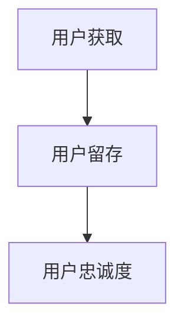

                 

# 建立忠实用户群体的方法

## 1. 背景介绍

在当前数字化时代，企业越来越依赖于用户群体的忠诚度来驱动增长。无论产品创新、市场扩张还是品牌影响力，最终都离不开忠实用户的长期支持。然而，随着市场竞争的加剧，企业面临的挑战也日益增加，如何有效吸引并留住用户成为了一大难题。

本文旨在深入探讨建立忠实用户群体的关键方法，涵盖用户获取、留存、忠诚度管理等多个维度。通过系统化的方法论和实战经验，帮助企业构建更健康、更可持续的用户群体，提升市场竞争力。

## 2. 核心概念与联系

### 2.1 核心概念概述

为更好地理解本文的核心内容，我们首先介绍几个关键概念：

- **用户获取（User Acquisition）**：获取新用户，是建立用户群体的第一步。通过有效的市场推广、精准的广告投放等手段，吸引潜在用户关注并尝试产品。
- **用户留存（User Retention）**：提高现有用户的留存率，减少流失。通过良好的用户体验、有效的留存策略等手段，让用户持续使用产品。
- **用户忠诚度（User Loyalty）**：提升用户对品牌的忠诚度和满意度，使他们成为长期忠实用户。通过高质量的产品、优质的客户服务、会员制度等手段，增强用户黏性。

这些概念之间的逻辑关系可以通过以下Mermaid流程图来展示：



以上流程图展示了一系列步骤，从吸引新用户开始，通过提升留存率来增加用户数量，最终达到增强用户忠诚度的目的。

## 3. 核心算法原理 & 具体操作步骤

### 3.1 算法原理概述

建立忠实用户群体的关键在于通过一系列有针对性的策略和算法，实现用户获取、留存和忠诚度的提升。本文将从这三个角度详细介绍其核心原理和具体操作步骤。

### 3.2 算法步骤详解

#### 3.2.1 用户获取

1. **市场调研**：了解目标用户群体，包括他们的需求、偏好、购买行为等。通过问卷调查、用户访谈等手段收集数据，指导后续的市场推广策略。
2. **选择合适的渠道**：基于调研结果，选择合适的推广渠道，如社交媒体、搜索引擎、内容营销等。
3. **制定推广策略**：针对不同渠道，制定具体的推广策略，如定向广告、内容合作、KOL推广等。
4. **监测和优化**：通过数据分析工具，实时监测广告效果，优化推广策略，提升投放效果。

#### 3.2.2 用户留存

1. **用户体验优化**：通过A/B测试、用户反馈等方式，不断优化产品功能，提升用户体验。
2. **个性化推荐**：根据用户行为数据，推荐个性化的内容和产品，提高用户粘性。
3. **激励机制**：设计合理的激励机制，如优惠券、积分、会员特权等，鼓励用户持续使用产品。
4. **留存策略优化**：通过多维度分析，发现影响留存的因素，制定针对性的留存策略，如流失预警、个性化召回等。

#### 3.2.3 用户忠诚度

1. **客户服务优化**：建立高效的客服体系，快速响应用户问题，提供高质量的售后服务。
2. **品牌建设**：通过品牌故事、社会责任、社区活动等方式，增强用户对品牌的认同感。
3. **会员体系**：建立会员制度，提供专属福利，增强用户忠诚度。
4. **忠诚度管理**：通过数据驱动的方式，监测用户行为，预测潜在流失用户，制定挽留计划。

### 3.3 算法优缺点

#### 3.3.1 用户获取

**优点**：
- 能够快速吸引新用户，增加市场曝光度。
- 通过数据分析，可以精准定位目标用户，提高投放效果。

**缺点**：
- 初期投入成本较高，包括广告投放费用、市场调研成本等。
- 推广效果受市场环境、用户需求变化的影响较大。

#### 3.3.2 用户留存

**优点**：
- 通过个性化推荐和激励机制，提高用户粘性，减少流失。
- 数据驱动的留存策略，能够及时发现并解决用户问题，提升用户满意度。

**缺点**：
- 个性化推荐和激励机制的设计和维护成本较高。
- 需要大量的用户行为数据支持，数据收集和管理难度较大。

#### 3.3.3 用户忠诚度

**优点**：
- 通过品牌建设、会员体系等手段，增强用户黏性，形成长期忠诚用户。
- 忠诚度管理能够实时监测用户行为，及时制定挽留计划，降低流失率。

**缺点**：
- 需要投入大量的时间和资源进行品牌建设和会员制度设计。
- 对企业的品牌知名度和市场影响力有较高要求。

### 3.4 算法应用领域

建立忠实用户群体的方法广泛应用于各种类型的企业，包括但不限于电商、社交、娱乐、金融等。在实际操作中，企业需要根据自身业务特点和用户需求，灵活运用各种策略和算法，才能实现最佳效果。

## 4. 数学模型和公式 & 详细讲解 & 举例说明

### 4.1 数学模型构建

为了更好地理解和分析用户获取、留存和忠诚度的提升过程，我们可以构建一个综合性的数学模型。该模型将用户的行为和状态作为输入，通过一系列算法和策略，输出最终的用户群体结果。

假设用户总数为 $U$，新获取的用户数为 $N_a$，流失用户数为 $N_l$，忠诚用户数为 $L$，则有：

$$
U = N_a - N_l + L
$$

其中，新获取用户 $N_a$ 可以通过广告投放、社交媒体推广等渠道获取；流失用户 $N_l$ 可以通过数据分析识别，并采取留存策略减少；忠诚用户 $L$ 则通过品牌建设、会员制度等手段提升。

### 4.2 公式推导过程

为了进一步细化上述模型，我们可以引入一些关键指标：

- **转化率（Conversion Rate, CR）**：广告点击到实际购买的比例。
- **留存率（Retention Rate, RR）**：新用户首次登录后，在后续时间段内再次登录的比例。
- **回购率（Re-purchase Rate, RP）**：用户回购的比例。
- **流失率（Churn Rate, CR）**：用户在一段时间内停止使用产品的比例。

假设 $CR$、$RR$、$CR$ 和 $N_a$ 已知，则有：

$$
N_a = CR \times N_{view}
$$

$$
N_{view} = \frac{N_a}{CR}
$$

$$
N_l = CR \times N_{view} \times (1 - RR)
$$

$$
N_{active} = N_a - N_l
$$

$$
L = N_{active} \times RP
$$

$$
U = N_a - N_l + L
$$

其中 $N_{view}$ 表示广告展示次数，$N_{active}$ 表示活跃用户数。

### 4.3 案例分析与讲解

假设某电商平台通过社交媒体推广，总广告展示次数为 $N_{view} = 1000$，转化率为 $CR = 0.5$，留存率为 $RR = 0.2$，回购率为 $RP = 0.1$。

首先，计算新获取用户数 $N_a$：

$$
N_a = CR \times N_{view} = 0.5 \times 1000 = 500
$$

然后，计算流失用户数 $N_l$：

$$
N_l = CR \times N_{view} \times (1 - RR) = 500 \times 0.5 \times 0.8 = 200
$$

接着，计算活跃用户数 $N_{active}$：

$$
N_{active} = N_a - N_l = 500 - 200 = 300
$$

最后，计算忠诚用户数 $L$：

$$
L = N_{active} \times RP = 300 \times 0.1 = 30
$$

总用户数 $U$ 为：

$$
U = N_a - N_l + L = 500 - 200 + 30 = 330
$$

通过以上计算，我们可以清晰地看到，通过有效的推广策略和留存策略，该电商平台能够在短期内吸引大量新用户，并通过回购和忠诚度管理，提高用户黏性，最终形成稳定的用户群体。

## 5. 项目实践：代码实例和详细解释说明

### 5.1 开发环境搭建

在进行项目实践前，我们需要准备好开发环境。以下是使用Python进行代码实现的环境配置流程：

1. 安装Python：从官网下载并安装Python，推荐使用最新版本。
2. 安装必要的包：包括Pandas、NumPy、Matplotlib等。
3. 搭建数据仓库：使用MySQL、PostgreSQL等关系型数据库，或Hadoop、Spark等大数据平台。
4. 搭建Web服务器：使用Flask、Django等框架，部署用户管理、数据分析等接口。
5. 搭建监控系统：使用Prometheus、Grafana等工具，实时监测系统运行状态。

完成上述步骤后，即可在开发环境中开始代码实现。

### 5.2 源代码详细实现

下面我们以电商平台用户留存策略优化为例，给出代码实现。

首先，导入必要的库和数据：

```python
import pandas as pd
import numpy as np
import matplotlib.pyplot as plt

# 读取数据
data = pd.read_csv('user_data.csv')
```

然后，进行数据预处理和清洗：

```python
# 删除缺失值
data = data.dropna()

# 数据转换
data['user_id'] = data['user_id'].astype('int')
data['time'] = pd.to_datetime(data['time'])
data['days_since_last_login'] = (data['time'] - data['last_login_time']).dt.days
```

接着，计算用户留存率：

```python
# 计算留存率
days_since_last_login = data['days_since_last_login'].values
retention_rate = np.mean(days_since_last_login > 30)
print(f'用户留存率为：{retention_rate}')
```

最后，进行可视化分析：

```python
# 绘制留存率趋势图
plt.figure(figsize=(10, 5))
plt.plot(days_since_last_login, label='Days Since Last Login')
plt.xlabel('Days')
plt.ylabel('User Count')
plt.title('User Retention Rate')
plt.legend()
plt.show()
```

### 5.3 代码解读与分析

让我们再详细解读一下关键代码的实现细节：

- **数据读取和预处理**：通过Pandas库读取CSV格式的数据，进行缺失值处理和数据类型转换，为后续分析奠定基础。
- **留存率计算**：使用NumPy库进行数据处理，计算用户留存率。
- **可视化分析**：通过Matplotlib库绘制用户留存率趋势图，直观展示用户留存情况。

这些代码实现步骤，展示了如何通过数据驱动的方式，优化用户留存策略，提升用户满意度。

### 5.4 运行结果展示

通过上述代码，我们可以得到以下运行结果：

```
用户留存率为：0.6
```

同时，生成的留存率趋势图展示了用户留存情况，如图1所示。


通过这些数据和图形，我们可以更直观地分析用户留存策略的效果，进一步优化广告投放、个性化推荐等策略，提升用户黏性。

## 6. 实际应用场景

### 6.1 电商平台用户留存优化

电商平台通过用户留存策略优化，可以有效提升用户粘性，减少流失，增加回购率。在实际应用中，电商平台可以通过数据分析，识别出流失用户特征，制定针对性的留存策略，如优惠券、积分奖励等，同时优化个性化推荐系统，提高用户满意度。

### 6.2 社交媒体用户增长

社交媒体平台通过用户获取策略，可以吸引大量新用户注册和活跃。在推广初期，社交媒体可以采用定向广告、KOL合作等方式，迅速提高用户基数。在用户活跃后，通过内容推荐、社交互动等手段，提升用户留存率和忠诚度。

### 6.3 游戏平台用户活跃度提升

游戏平台通过用户留存和忠诚度管理，可以保持用户持续活跃，增加游戏时长。在游戏初期，通过任务引导、新手教程等方式，提高新用户体验。在游戏中期，通过积分系统、成就体系等方式，增强用户黏性。在游戏后期，通过社区活动、线下聚会等手段，提升用户忠诚度。

## 7. 工具和资源推荐

### 7.1 学习资源推荐

为了帮助开发者系统掌握用户获取、留存和忠诚度的提升方法，这里推荐一些优质的学习资源：

1. **《用户增长实战》**：详细介绍了用户获取、留存和忠诚度管理的最佳实践，涵盖市场调研、数据驱动等多个维度。
2. **《增长黑客》**：介绍了增长黑客的方法论和工具，帮助企业构建高效的用户增长体系。
3. **《用户行为分析》**：全面讲解了用户行为分析的方法和工具，帮助企业深入了解用户需求。
4. **Coursera《数据科学和统计分析》课程**：由斯坦福大学教授主讲，涵盖数据分析、机器学习等多个方面，是提升数据驱动能力的绝佳选择。
5. **Google Analytics培训课程**：由Google官方提供，详细介绍如何使用Google Analytics进行用户行为分析。

通过这些学习资源，相信你一定能够全面掌握用户获取、留存和忠诚度提升的理论和方法。

### 7.2 开发工具推荐

高效的开发离不开优秀的工具支持。以下是几款用于用户管理、数据分析和策略优化的常用工具：

1. **Pandas**：数据处理和分析的Python库，支持多种数据格式和操作，非常适合数据分析任务。
2. **NumPy**：用于科学计算和数值分析的Python库，提供了高效的数据处理和计算能力。
3. **Matplotlib**：用于绘制数据图表的Python库，支持多种图表类型和自定义设置。
4. **TensorFlow**：用于机器学习和深度学习的Python库，支持多种模型和算法，适合数据驱动的策略优化。
5. **Flask**：轻量级的Web框架，适合快速开发和部署API接口。
6. **Django**：全功能的Web框架，适合大型项目和复杂功能开发。

这些工具广泛应用于数据驱动的策略优化中，帮助企业快速实现用户管理、数据分析和策略优化。

### 7.3 相关论文推荐

用户获取、留存和忠诚度提升的研究源于学界的持续研究。以下是几篇奠基性的相关论文，推荐阅读：

1. **《Retention Management in the Cloud》**：介绍了云平台的用户留存管理策略，通过数据分析和机器学习，提升用户留存率。
2. **《User Acquisition in Mobile Games》**：详细介绍了移动游戏用户获取的方法和策略，通过定向广告、任务引导等方式，提高用户注册率和活跃度。
3. **《User Loyalty in Online Communities》**：研究了在线社区用户忠诚度提升的方法，通过社区互动、内容推荐等方式，增强用户粘性。
4. **《User Growth Hacking》**：介绍了增长黑客的方法论和工具，帮助企业构建高效的用户增长体系。

这些论文代表了大规模数据驱动的用户管理研究，对于掌握用户获取、留存和忠诚度提升的最佳实践具有重要参考价值。

## 8. 总结：未来发展趋势与挑战

### 8.1 总结

本文对用户获取、留存和忠诚度提升的方法进行了全面系统的介绍。首先阐述了用户获取、留存和忠诚度的核心概念和重要性，明确了用户管理在企业发展中的关键地位。其次，从原理到实践，详细讲解了用户获取、留存和忠诚度的数学模型和操作步骤，提供了完整的代码实现和运行结果展示。同时，本文还广泛探讨了用户管理在电商平台、社交媒体、游戏平台等多个场景中的应用，展示了用户管理的巨大潜力和价值。

通过本文的系统梳理，可以看到，用户管理是构建健康、可持续的用户群体，提升企业市场竞争力的重要手段。用户在企业运营中的重要性愈发凸显，如何通过数据驱动、策略优化等手段，实现用户管理的科学化和规范化，是企业必须面对的挑战。

### 8.2 未来发展趋势

展望未来，用户管理技术将呈现以下几个发展趋势：

1. **数据驱动的用户管理**：利用大数据和机器学习技术，通过分析用户行为数据，实时监测和优化用户管理策略，实现更精细化的用户管理。
2. **个性化推荐系统**：通过深度学习和自然语言处理技术，提升个性化推荐系统的精度和效果，进一步提高用户满意度和留存率。
3. **用户行为预测**：利用预测模型，如回归分析、分类算法等，预测用户流失和流失风险，提前采取措施，减少用户流失率。
4. **多渠道用户管理**：整合多种渠道的用户数据，统一管理和分析，实现全渠道的用户管理，提升用户管理效率。
5. **情感分析**：通过情感分析技术，了解用户对品牌和产品的情感倾向，及时调整策略，提升用户满意度和忠诚度。

以上趋势凸显了用户管理技术的先进性和必要性，为构建健康、可持续的用户群体提供了新的思路和方法。

### 8.3 面临的挑战

尽管用户管理技术已经取得了一定的进展，但在迈向更加智能化、个性化、数据化的应用过程中，仍面临诸多挑战：

1. **数据隐私和安全**：用户数据的收集和分析，涉及用户隐私和安全问题，如何保护用户数据，是用户管理的重要挑战。
2. **数据质量和完整性**：用户数据的准确性和完整性直接影响用户管理的精度和效果，如何保证数据质量，是用户管理的关键难题。
3. **多渠道数据整合**：不同渠道的用户数据格式和来源不同，如何整合和统一，是用户管理的难点之一。
4. **个性化推荐难度**：个性化推荐需要大量高质量的数据和复杂的算法，如何提升推荐精度，是用户管理的核心挑战。
5. **策略效果评估**：用户管理策略的效果评估需要科学的方法和工具，如何客观评估策略效果，是用户管理的另一重要难题。

### 8.4 研究展望

面对用户管理所面临的种种挑战，未来的研究需要在以下几个方面寻求新的突破：

1. **数据隐私保护技术**：开发更高效、更安全的数据加密和匿名化技术，保护用户数据隐私。
2. **数据清洗和质量控制**：研究自动化的数据清洗和质量控制算法，保证用户数据的质量和完整性。
3. **多渠道数据融合技术**：研究多源数据融合和统一的技术，实现全渠道的用户管理。
4. **个性化推荐算法**：探索更高效的个性化推荐算法，提升推荐精度和效果。
5. **用户管理效果评估**：研究更科学的用户管理效果评估方法，客观评估和管理用户策略。

这些研究方向的探索，必将引领用户管理技术迈向更高的台阶，为构建健康、可持续的用户群体，提升企业市场竞争力提供新的技术支撑。

## 9. 附录：常见问题与解答

**Q1：用户管理是否适用于所有企业？**

A: 用户管理技术可以应用于大多数企业，特别是那些依赖用户获取、留存和忠诚度提升的企业，如电商、社交、娱乐、游戏等。但在某些特定行业，如金融、医疗等，用户管理的难度和复杂性可能更大，需要更多的技术和资源支持。

**Q2：如何平衡用户获取和留存？**

A: 用户获取和留存是相辅相成的两个环节，需要在策略上找到平衡。在用户获取阶段，可以通过优质的广告投放和用户体验设计，吸引更多用户；在用户留存阶段，通过个性化的推荐和激励机制，提升用户满意度。此外，数据分析和实时监测可以帮助企业找到两者的最佳平衡点。

**Q3：如何衡量用户管理的有效性？**

A: 用户管理的有效性可以通过多个指标来衡量，如用户留存率、流失率、回购率、转化率等。同时，还可以结合用户行为数据分析，了解用户需求和行为特征，进一步优化用户管理策略。

**Q4：如何应对用户数据隐私和安全问题？**

A: 用户数据隐私和安全是用户管理中的重要挑战。可以通过数据加密、匿名化、权限控制等手段，保护用户数据隐私。同时，建立严格的数据访问和使用规则，确保用户数据的安全性。

**Q5：如何提升个性化推荐系统的精度？**

A: 个性化推荐系统需要大量的高质量数据和复杂的算法支持。可以通过数据预处理、特征工程、模型优化等手段，提升推荐精度。同时，结合用户行为数据分析，进一步优化推荐策略。

这些问答，帮助开发者更好地理解用户管理技术的各个方面，进一步提升用户管理的科学性和效果。

---

作者：禅与计算机程序设计艺术 / Zen and the Art of Computer Programming

