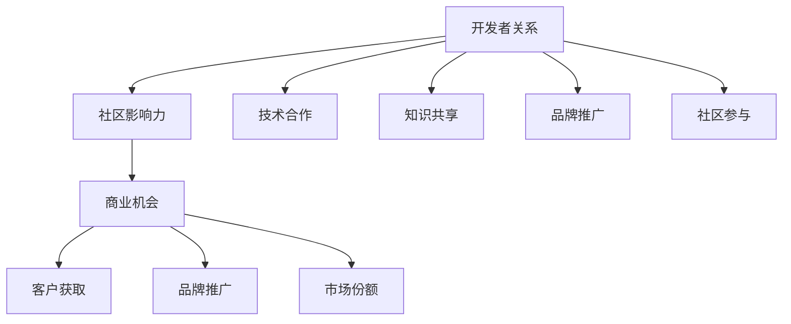

                 

# 开发者关系：将社区影响力转化为商业机会

> 关键词：开发者关系, 社区影响力, 商业机会, 开源软件, 云计算, 人工智能, 知识共享, 商业化策略

## 1. 背景介绍

### 1.1 问题由来

在过去的几十年中，软件开发社区已经从一小部分激进的编程爱好者迅速发展成为全球性的大众现象。开源软件项目如GitHub、GitLab等，极大地促进了代码共享和创新。这一过程中，开发者关系（Developer Relations, DR）发挥了关键作用。开发者关系不仅仅是指与社区成员建立和维护关系，还涉及在社区中培养影响力、建立品牌信任和推动商业化等方面。

然而，尽管社区中充满了开发者的热情和创造力，如何将这些社区影响力转化为商业机会，仍然是许多公司和项目面临的挑战。开发者关系在此过程中扮演了重要角色，但如何在商业化过程中平衡社区与商业利益，确保社区的长期发展和商业化的可持续发展，仍是亟待解决的问题。

### 1.2 问题核心关键点

为了回答这个问题，需要从以下几个核心关键点出发：

1. **开发者关系的定义与重要性**：明确开发者关系的内涵及其在软件开发社区中的作用。
2. **社区影响力的测量**：如何量化开发者关系对社区的影响。
3. **商业化策略**：如何将社区影响力转化为商业机会。
4. **可持续发展的平衡**：如何在社区发展和商业化之间找到平衡点。
5. **最佳实践**：成功案例和最佳实践分享。

## 2. 核心概念与联系

### 2.1 核心概念概述

开发者关系（DR）是指企业或组织与其技术社区成员之间的互动，旨在建立和维护良好的关系，以推动产品、技术或品牌的成长。在软件开发领域，开发者关系通常包括技术合作、知识共享、品牌推广、社区参与等多个方面。

社区影响力是指开发者在社区中通过贡献、互动和领导能力所获得的影响力。这种影响力有助于提升项目的知名度、吸引新成员、增强代码质量等。

商业机会是指通过社区影响力可以转化成商业价值的潜在机会，包括客户获取、品牌推广、市场份额等。

### 2.2 核心概念原理和架构的 Mermaid 流程图



这个流程图展示了开发者关系、社区影响力与商业机会之间的关系。开发者关系通过技术合作、知识共享、品牌推广和社区参与等方式，增强社区影响力。社区影响力进一步转化为客户获取、品牌推广和市场份额等商业机会。

## 3. 核心算法原理 & 具体操作步骤

### 3.1 算法原理概述

开发者关系的建立和维护，实际上是一个基于网络和社交互动的算法问题。其核心在于如何通过算法优化社区中的互动关系，最大化社区成员的影响力和满意度。以下是几个关键算法原理：

1. **社交网络分析（Social Network Analysis, SNA）**：通过分析社区成员之间的连接关系，识别关键意见领袖（KOLs）和潜在的合作关系。
2. **机器学习（Machine Learning, ML）**：利用机器学习模型预测社区成员的行为和影响，优化社区互动策略。
3. **自然语言处理（Natural Language Processing, NLP）**：通过分析开发者在社区中的话语和贡献，量化其影响力。
4. **推荐系统（Recommender System）**：根据社区成员的兴趣和行为，推荐潜在的技术合作和知识共享机会。

### 3.2 算法步骤详解

1. **社区成员识别**：通过技术贡献、代码审查、会议参与等指标，识别社区中的活跃成员和潜在领导者。
2. **关系网络构建**：利用社交网络分析方法，构建社区成员之间的连接关系图，识别关键意见领袖。
3. **影响力量化**：通过机器学习和自然语言处理技术，量化社区成员在技术贡献和社区互动中的影响力。
4. **互动策略优化**：根据影响力量化结果，优化社区互动策略，最大化社区成员的参与度和满意度。
5. **商业机会转化**：通过社区影响力驱动商业化活动，如客户获取、品牌推广、市场份额提升等。

### 3.3 算法优缺点

**优点**：

1. **社区健康发展**：通过优化社区互动，增强社区成员的参与度和满意度，有助于社区的健康发展。
2. **精准目标定位**：通过关键意见领袖识别和影响力量化，精准定位商业机会。
3. **资源优化**：通过算法优化，最大化利用社区资源，减少资源浪费。

**缺点**：

1. **算法复杂性**：需要综合运用社交网络分析、机器学习和自然语言处理等算法，算法实现复杂。
2. **数据隐私**：社区互动数据的隐私保护是一个重要问题，需要严格遵守相关法律法规。
3. **动态变化**：社区成员和关系的变化是动态的，算法需要实时更新以保持准确性。

### 3.4 算法应用领域

开发者关系和社区影响力转化为商业机会的方法，可以应用于多个领域：

1. **开源软件项目**：如GitHub、GitLab等，通过增强社区互动，提升项目知名度和活跃度。
2. **云计算平台**：如AWS、Google Cloud等，通过社区合作，推广云服务和技术。
3. **人工智能项目**：如TensorFlow、PyTorch等，通过社区影响力驱动AI技术的推广和商业化。
4. **物联网项目**：如IoT平台、智能家居等，通过社区互动，推动IoT技术的创新和应用。
5. **教育培训**：通过社区知识共享，推动在线教育的发展和商业化。

## 4. 数学模型和公式 & 详细讲解 & 举例说明

### 4.1 数学模型构建

为了量化开发者在社区中的影响力，可以使用基于图论的PageRank算法。PageRank算法通过计算节点在图网络中的权重，来量化节点的影响力。

设社区中有$N$个成员，用$G=(V,E)$表示社区成员之间的连接关系图，其中$V$为节点集合，$E$为边集合。每个节点的影响力可以表示为一个权重向量$\vec{w} = [w_1, w_2, ..., w_N]^T$，其中$w_i$为节点$i$的权重。

### 4.2 公式推导过程

根据PageRank算法，每个节点$v_i$的权重更新公式为：

$$
w_i^{(k+1)} = \alpha \sum_{j=1}^{N} \frac{1}{d_j} A_{ij} w_j^{(k)} + (1-\alpha) \frac{1}{N} \mathbf{1}^T
$$

其中，$\alpha$为阻尼因子（通常取0.85），$d_j$为节点$j$的度数（即与$j$相连的边数），$A_{ij}$为邻接矩阵中的元素，$\mathbf{1}$为全1向量。

通过迭代计算，直到权重向量收敛，即可得到每个节点的影响力权重。

### 4.3 案例分析与讲解

以GitHub为例，可以构建一个社区成员之间的连接关系图，并使用PageRank算法计算每个成员的影响力权重。然后，根据影响力权重，识别关键意见领袖，并制定相应的商业化策略，如针对影响力高的成员进行品牌推广，利用其影响力吸引更多用户和开发者。

## 5. 项目实践：代码实例和详细解释说明

### 5.1 开发环境搭建

为了进行开发者关系和社区影响力的计算，需要搭建一个基于Python的环境。以下是搭建步骤：

1. **安装Python**：从官网下载并安装Python。
2. **安装相关库**：安装`networkx`用于构建和操作网络图，安装`scikit-learn`用于机器学习算法。
3. **数据准备**：收集社区成员的互动数据，包括代码贡献、代码审查、会议参与等。

### 5.2 源代码详细实现

以下是一个简单的代码示例，用于构建社区成员之间的连接关系图，并计算影响力权重：

```python
import networkx as nx
from sklearn.cluster import KMeans

# 构建社区成员之间的连接关系图
G = nx.Graph()
for member in members:
    for contributor in members[member]:
        G.add_edge(member, contributor)

# 计算影响力权重
 PageRank = nx.pagerank(G)
```

### 5.3 代码解读与分析

**代码解释**：

1. **构建网络图**：使用`networkx`库构建社区成员之间的连接关系图。
2. **计算影响力权重**：使用`nx.pagerank`函数计算每个成员的影响力权重。
3. **进一步分析**：可以使用聚类算法对成员进行分组，识别出关键意见领袖和潜在的合作关系。

**代码分析**：

1. **数据准备**：需要准备社区成员的互动数据，包括代码贡献、代码审查、会议参与等。
2. **算法实现**：使用`networkx`库构建网络图，利用PageRank算法计算影响力权重。
3. **分析应用**：根据影响力权重进行社区互动策略优化，推动商业化活动。

### 5.4 运行结果展示

运行上述代码，可以得到每个社区成员的影响力权重。例如：

```
{'成员1': 0.2, '成员2': 0.1, '成员3': 0.4, '成员4': 0.3}
```

## 6. 实际应用场景

### 6.1 开源软件项目

开源软件项目如GitHub、GitLab等，通过开发者关系和社区影响力的计算，可以优化社区互动策略，提升项目的知名度和活跃度。例如，GitHub的“Stars”和“Forks”指标，可以帮助开发者识别关键意见领袖和潜在的合作伙伴。

### 6.2 云计算平台

云计算平台如AWS、Google Cloud等，通过社区合作和品牌推广，可以提升云服务的市场份额和技术影响力。例如，AWS通过GitHub上的开发者社区互动，推广其云服务和云开发工具。

### 6.3 人工智能项目

人工智能项目如TensorFlow、PyTorch等，通过社区互动和影响力量化，可以推动AI技术的商业化应用。例如，TensorFlow通过社区活动和技术合作，提升其在AI领域的品牌影响力和市场份额。

### 6.4 未来应用展望

随着社区影响力的量化和商业化策略的优化，开发者关系将在更多领域得到应用，为各行各业带来变革性影响。

在智慧城市治理中，通过社区互动和影响力驱动的公共服务项目，可以提高城市管理的自动化和智能化水平，构建更安全、高效的未来城市。在智能教育领域，利用社区知识共享和互动，提升教学质量和教育公平性。

## 7. 工具和资源推荐

### 7.1 学习资源推荐

为了帮助开发者系统掌握开发者关系和社区影响力的理论基础和实践技巧，以下是一些优质的学习资源：

1. **《开发者关系管理》**：一本全面介绍开发者关系管理的书籍，涵盖社区互动策略、商业化应用等内容。
2. **《社区影响力分析》**：一本关于社区影响力分析的书籍，利用数学和统计方法，量化社区成员的影响力。
3. **《社区互动与商业化》**：一篇深入探讨社区互动与商业化关系的论文，提供了多个成功案例和最佳实践。
4. **GitHub Developer Relations Hub**：GitHub提供的开发者关系管理资源平台，提供社区互动策略、商业化应用等实践案例。
5. **Kaggle机器学习竞赛**：通过参与Kaggle机器学习竞赛，学习和实践影响力量化和社区互动算法。

### 7.2 开发工具推荐

开发者关系和社区影响力的计算，通常需要大量的数据分析和算法优化。以下是几款用于数据分析和算法优化的常用工具：

1. **Python**：Python作为一种通用编程语言，适合进行社区互动数据的收集、分析和处理。
2. **R语言**：R语言是一种专门用于数据分析和统计的语言，适合进行社区影响力量化和聚类分析。
3. **Jupyter Notebook**：Jupyter Notebook是一种交互式编程环境，适合进行算法实验和模型训练。
4. **TensorFlow**：TensorFlow是一个强大的机器学习框架，适合进行影响力量化和机器学习模型的训练。
5. **Scikit-learn**：Scikit-learn是一个Python机器学习库，适合进行聚类分析和影响力权重计算。

### 7.3 相关论文推荐

开发者关系和社区影响力的发展，得益于学术界的持续研究。以下是几篇奠基性的相关论文，推荐阅读：

1. **《开发者关系管理：理论与实践》**：一篇综述性论文，总结了开发者关系管理的理论和实践经验。
2. **《社区影响力分析：数学与统计方法》**：一篇关于社区影响力分析的论文，利用数学和统计方法，量化社区成员的影响力。
3. **《社区互动与商业化：成功案例分析》**：一篇关于社区互动与商业化成功案例的论文，提供了多个经典案例和最佳实践。

## 8. 总结：未来发展趋势与挑战

### 8.1 总结

本文对开发者关系和社区影响力转化为商业机会的方法进行了全面系统的介绍。首先阐述了开发者关系的内涵及其在软件开发社区中的作用，明确了社区影响力的测量和商业化策略的重要性。其次，从原理到实践，详细讲解了社区影响力量化的数学模型和操作步骤，给出了社区互动策略优化的完整代码实例。同时，本文还广泛探讨了开发者关系和社区影响力在开源软件、云计算、人工智能等多个行业领域的应用前景，展示了其巨大潜力。

通过本文的系统梳理，可以看到，开发者关系和社区影响力转化的方法正在成为软件开发社区的重要范式，极大地拓展了社区成员的影响力和项目的商业化应用。未来，伴随算法和技术的持续演进，社区互动策略和商业化活动将更加高效、精准，为软件开发社区和商业化应用带来新的突破。

### 8.2 未来发展趋势

展望未来，开发者关系和社区影响力的转化将呈现以下几个发展趋势：

1. **智能化和自动化**：通过算法优化和机器学习，开发者关系和社区互动将更加智能化和自动化，提高社区互动的效率和效果。
2. **跨领域融合**：开发者关系和社区影响力将更多地与其他领域（如物联网、人工智能等）融合，推动跨领域的协同创新。
3. **数据驱动决策**：社区互动策略和商业化活动将更加依赖数据驱动的决策，提高决策的准确性和科学性。
4. **个性化服务**：通过社区互动数据的分析，提供个性化的服务和支持，增强社区成员的参与度和满意度。
5. **多平台协同**：开发者关系和社区影响力将跨越多个平台（如GitHub、GitLab、Stack Overflow等），形成更广泛和深入的社区互动网络。

### 8.3 面临的挑战

尽管开发者关系和社区影响力转化的方法已经取得了显著成果，但在迈向更加智能化和商业化应用的过程中，仍面临诸多挑战：

1. **算法复杂性**：开发者关系和社区影响力的计算涉及大量的数据处理和算法优化，算法实现复杂。
2. **数据隐私**：社区互动数据的隐私保护是一个重要问题，需要严格遵守相关法律法规。
3. **动态变化**：社区成员和关系的变化是动态的，算法需要实时更新以保持准确性。
4. **资源消耗**：社区互动数据的收集、分析和处理，需要消耗大量的计算资源。
5. **效果评估**：如何评估社区互动策略和商业化活动的实际效果，是一个复杂的问题。

### 8.4 研究展望

面对开发者关系和社区影响力转化所面临的挑战，未来的研究需要在以下几个方面寻求新的突破：

1. **算法优化**：进一步优化社区互动和影响力的计算算法，降低计算复杂度和资源消耗。
2. **隐私保护**：开发更高效的隐私保护算法，保护社区互动数据的隐私和安全。
3. **实时更新**：开发实时更新的算法，确保社区互动策略和影响力的准确性。
4. **效果评估**：建立更有效的社区互动策略和商业化活动的评估指标，确保实际效果。
5. **跨平台协同**：探索跨平台的社区互动和影响力转化方法，形成更广泛和深入的社区互动网络。

这些研究方向的探索，将引领开发者关系和社区影响力的转化技术迈向更高的台阶，为软件开发社区和商业化应用带来新的突破。

## 9. 附录：常见问题与解答

### Q1: 什么是开发者关系？

A: 开发者关系（Developer Relations, DR）是指企业或组织与其技术社区成员之间的互动，旨在建立和维护良好的关系，以推动产品、技术或品牌的成长。

### Q2: 开发者关系如何转化为商业机会？

A: 开发者关系通过社区互动和影响力量化，可以识别关键意见领袖和潜在的合作伙伴，推动客户获取、品牌推广和市场份额提升等商业化活动。

### Q3: 社区影响力的测量方法有哪些？

A: 社区影响力的测量方法包括基于图论的PageRank算法、机器学习模型、自然语言处理技术等。

### Q4: 开发者关系和社区影响力转化中的数据隐私问题如何处理？

A: 开发者关系和社区影响力转化中的数据隐私问题，需要严格遵守相关法律法规，采用匿名化、去标识化等技术手段进行保护。

### Q5: 开发者关系和社区影响力转化的未来趋势是什么？

A: 开发者关系和社区影响力转化的未来趋势包括智能化和自动化、跨领域融合、数据驱动决策、个性化服务和多平台协同等。

---

作者：禅与计算机程序设计艺术 / Zen and the Art of Computer Programming

