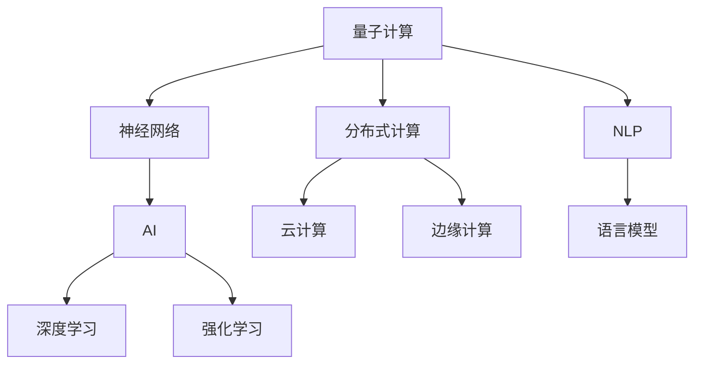

                 

# 开启无限可能：人类计算的新征程

> 关键词：量子计算, 神经网络, 分布式计算, 自然语言处理, 人工智能, 未来科技

## 1. 背景介绍

### 1.1 问题由来
近年来，随着科技的飞速发展，人类对计算能力的需求日益增加。从传统的电子计算机到最新的量子计算机，从简单的计算到复杂的机器学习，计算技术在各个领域发挥着越来越重要的作用。人类计算的演进，不仅改变了信息处理的方式，也深刻影响了社会的各个层面。

然而，随着数据量和计算需求的不断增长，现有的计算资源已难以满足未来复杂系统的要求。特别是随着深度学习、自然语言处理等新兴技术的发展，计算资源的瓶颈问题日益凸显。因此，寻找新的计算方法，拓展计算能力，成为当前科技界的一大挑战。

### 1.2 问题核心关键点
本节将探讨人类计算的未来发展方向和关键技术，特别是量子计算、神经网络、分布式计算和人工智能等前沿领域的最新进展。这些技术有望推动人类计算能力的飞跃性提升，引领未来的科技革命。

## 2. 核心概念与联系

### 2.1 核心概念概述

为了更好地理解人类计算的发展方向，本节将介绍几个关键概念及其相互联系：

- 量子计算：利用量子力学原理，通过量子比特(量子位)进行信息处理的新型计算方式。与传统比特(二进制位)相比，量子比特具有叠加和纠缠等特性，可以实现更高的计算效率。

- 神经网络：模拟人脑神经元之间信息传递和处理方式，通过多层非线性变换，进行数据学习和模式识别的计算模型。

- 分布式计算：将计算任务分布在多台计算机上进行并行处理，以提高计算效率和系统可靠性。包括云计算、边缘计算等形式。

- 自然语言处理(NLP)：通过计算机理解、处理和生成自然语言，实现机器与人类之间的自然交互。

- 人工智能(AI)：使计算机具有智能行为的领域，包括机器学习、深度学习、强化学习等子领域，旨在构建能够理解、推理和执行复杂任务的系统。

这些概念之间的逻辑关系可以通过以下Mermaid流程图来展示：



这个流程图展示了不同计算技术之间的联系：

1. 量子计算和神经网络相互促进，共同提升计算能力。
2. 分布式计算为量子计算、神经网络提供计算平台和资源。
3. NLP是人工智能的重要分支，通过语言模型等技术，为AI提供自然语言理解能力。
4. AI包括深度学习和强化学习，推动了神经网络和量子计算的实际应用。

## 3. 核心算法原理 & 具体操作步骤
### 3.1 算法原理概述

人类计算的未来发展依赖于多种先进技术的结合和创新。以下是几种关键技术的算法原理概述：

- 量子计算：通过量子叠加和纠缠，实现并行计算和高效求解复杂问题。
- 神经网络：通过多层非线性变换，实现模式识别和数据分析。
- 分布式计算：通过并行计算和资源共享，提高计算效率和系统可靠性。
- 自然语言处理：通过语言模型等技术，实现机器与人类之间的自然交互。
- 人工智能：通过深度学习、强化学习等技术，构建智能系统。

### 3.2 算法步骤详解

#### 量子计算

量子计算的基本步骤包括：

1. **量子比特编码**：将问题转化为量子比特状态，并进行初始化。
2. **量子逻辑门操作**：利用量子门对量子比特进行逻辑操作，实现信息的叠加和纠缠。
3. **量子态测量**：通过测量量子比特，得到计算结果。

#### 神经网络

神经网络的基本步骤包括：

1. **数据预处理**：将输入数据进行归一化、标准化等预处理。
2. **网络初始化**：随机初始化网络参数，如权重和偏置。
3. **前向传播**：通过多层非线性变换，计算输出结果。
4. **损失函数计算**：根据输出结果和真实标签计算损失函数。
5. **反向传播**：利用反向传播算法更新网络参数，最小化损失函数。
6. **模型训练**：多次迭代训练过程，直至收敛。

#### 分布式计算

分布式计算的基本步骤包括：

1. **任务分解**：将计算任务分解为多个子任务。
2. **任务调度**：利用分布式系统，将子任务分配到多个计算节点上进行并行处理。
3. **数据同步**：确保各节点之间的数据同步和共享。
4. **结果合并**：将各节点的计算结果合并，得到最终结果。

#### 自然语言处理

自然语言处理的基本步骤包括：

1. **文本预处理**：将文本进行分词、词性标注等预处理。
2. **语言模型构建**：通过神经网络或统计方法，构建语言模型。
3. **语义理解**：通过语言模型等技术，理解文本的语义信息。
4. **生成和推理**：利用语言模型，进行文本生成和推理。

#### 人工智能

人工智能的基本步骤包括：

1. **数据采集**：从各种来源采集数据，用于训练和测试模型。
2. **模型训练**：通过深度学习等技术，训练智能模型。
3. **模型评估**：评估模型性能，选择最优模型。
4. **模型应用**：将模型应用于实际问题，进行推理和决策。

### 3.3 算法优缺点

#### 量子计算

- **优点**：
  - 计算速度极快，能够高效解决某些复杂问题。
  - 具有高度的并行性和容错性，能够处理大规模数据。
  - 可以实现量子态的传输和量子纠缠，增强计算能力。

- **缺点**：
  - 量子计算的实现复杂，硬件成本高。
  - 量子比特容易受到环境干扰，稳定性较差。
  - 需要处理大量噪声数据，算法实现复杂。

#### 神经网络

- **优点**：
  - 具备强大的自适应能力，能够处理复杂数据。
  - 能够进行端到端的训练，减少中间变量。
  - 能够通过多层非线性变换，提取高层次特征。

- **缺点**：
  - 训练过程复杂，需要大量标注数据。
  - 容易过拟合，需要进行正则化处理。
  - 模型复杂度高，难以解释和调试。

#### 分布式计算

- **优点**：
  - 计算能力强，能够处理大规模任务。
  - 系统可靠性高，具有容错能力。
  - 能够灵活扩展资源，适应动态需求。

- **缺点**：
  - 通信开销大，网络带宽限制。
  - 数据同步和任务调度复杂，需要精细管理。
  - 系统维护复杂，需要大量运维资源。

#### 自然语言处理

- **优点**：
  - 能够实现自然语言理解和生成，增强人机交互体验。
  - 具有广泛应用场景，如智能客服、智能助手等。
  - 能够利用大量无标签数据，进行自监督学习。

- **缺点**：
  - 数据处理量大，计算复杂度高。
  - 需要处理复杂语言现象，如歧义、上下文依赖等。
  - 模型训练时间长，需要大量计算资源。

#### 人工智能

- **优点**：
  - 能够处理复杂任务，实现智能决策。
  - 能够自适应数据变化，提升系统性能。
  - 能够融合多种技术，实现跨领域应用。

- **缺点**：
  - 需要大量标注数据，训练成本高。
  - 模型复杂度高，难以解释和调试。
  - 容易产生偏见，需要严格监管。

## 4. 数学模型和公式 & 详细讲解  
### 4.1 数学模型构建

在本节中，我们将使用数学语言对人类计算的未来发展进行更加严格的刻画。

#### 量子计算

量子计算的核心在于量子比特的操作和计算。设量子比特为 $| \psi \rangle$，其状态可以用基底向量 $|0\rangle$ 和 $|1\rangle$ 表示。量子门操作可以用矩阵 $U$ 表示，对 $| \psi \rangle$ 进行变换，得到新的量子比特状态 $| \phi \rangle$。量子态的测量结果为 $|0\rangle$ 或 $|1\rangle$，对应的概率为 $P(|0\rangle) = | \langle 0|\phi \rangle |^2$ 和 $P(|1\rangle) = | \langle 1|\phi \rangle |^2$。

#### 神经网络

神经网络通过多层非线性变换，进行数据学习和模式识别。设神经网络包含 $L$ 层，每层包含 $n$ 个神经元。输入向量为 $x$，输出向量为 $y$，其中 $x \in \mathbb{R}^m$，$y \in \mathbb{R}^n$。神经元之间通过权重矩阵 $W$ 和偏置向量 $b$ 进行连接，激活函数为 $f$。网络的前向传播过程如下：

$$
y = f(W_L \cdot f(W_{L-1} \cdot \ldots \cdot f(W_1 \cdot x) + b_1) + b_2)
$$

其中 $W_1, \ldots, W_L$ 和 $b_1, \ldots, b_L$ 为权重矩阵和偏置向量。

神经网络的损失函数通常采用交叉熵损失，定义为：

$$
\mathcal{L}(y, \hat{y}) = -\frac{1}{m} \sum_{i=1}^m \sum_{j=1}^n y_i \log \hat{y}_{ij}
$$

其中 $y_i \in \{0,1\}$ 为真实标签，$\hat{y}_{ij}$ 为模型预测结果。

神经网络的反向传播算法通过链式法则，计算损失函数对各参数的梯度，更新网络参数。

#### 分布式计算

分布式计算的计算模型通常采用 MapReduce 模型，其核心思想是将计算任务分解为多个子任务，并行处理。设任务总数为 $N$，每个子任务处理的数据量为 $M$，共 $P$ 个计算节点，每个节点处理的数据量为 $Q$，则分布式计算的复杂度为 $O(N/P)$。

#### 自然语言处理

自然语言处理中的语言模型通常采用神经网络模型，如循环神经网络 (RNN)、卷积神经网络 (CNN) 和变换器 (Transformer)。语言模型可以表示为：

$$
P(w) = \prod_{i=1}^T P(w_i | w_{i-1})
$$

其中 $w$ 为文本序列，$w_i$ 为文本中的第 $i$ 个单词。语言模型的目标是最小化交叉熵损失：

$$
\mathcal{L} = -\frac{1}{T} \sum_{i=1}^T \log P(w_i | w_{i-1})
$$

#### 人工智能

人工智能中的深度学习通常采用神经网络模型，如卷积神经网络 (CNN)、循环神经网络 (RNN) 和变换器 (Transformer)。深度学习的目标是最小化损失函数，进行模型训练和参数更新。

### 4.2 公式推导过程

在本节中，我们将对一些关键公式进行推导，以加深理解。

#### 量子计算

设量子比特 $| \psi \rangle$ 通过量子门 $U$ 操作，得到新的量子比特 $| \phi \rangle$。根据量子力学原理，量子门操作可以表示为矩阵 $U$，对 $| \psi \rangle$ 进行变换，得到新的量子比特状态 $| \phi \rangle$。量子态的测量结果为 $|0\rangle$ 或 $|1\rangle$，对应的概率为：

$$
P(|0\rangle) = | \langle 0|\phi \rangle |^2 = | \langle 0|U|\psi \rangle |^2
$$

$$
P(|1\rangle) = | \langle 1|\phi \rangle |^2 = | \langle 1|U|\psi \rangle |^2
$$

#### 神经网络

神经网络的前向传播过程可以用矩阵乘法和激活函数表示。设输入向量为 $x$，输出向量为 $y$，其中 $x \in \mathbb{R}^m$，$y \in \mathbb{R}^n$。神经元之间通过权重矩阵 $W$ 和偏置向量 $b$ 进行连接，激活函数为 $f$。网络的前向传播过程如下：

$$
y = f(W_L \cdot f(W_{L-1} \cdot \ldots \cdot f(W_1 \cdot x) + b_1) + b_2)
$$

其中 $W_1, \ldots, W_L$ 和 $b_1, \ldots, b_L$ 为权重矩阵和偏置向量。

神经网络的损失函数通常采用交叉熵损失，定义为：

$$
\mathcal{L}(y, \hat{y}) = -\frac{1}{m} \sum_{i=1}^m \sum_{j=1}^n y_i \log \hat{y}_{ij}
$$

其中 $y_i \in \{0,1\}$ 为真实标签，$\hat{y}_{ij}$ 为模型预测结果。

神经网络的反向传播算法通过链式法则，计算损失函数对各参数的梯度，更新网络参数。具体步骤如下：

1. 计算输出层误差 $\Delta y = \frac{\partial \mathcal{L}}{\partial \hat{y}}$。
2. 通过链式法则，计算各层的误差 $\Delta z = W^\top \Delta y \odot f'(z)$。
3. 通过链式法则，计算各层的权重和偏置梯度 $W_{lj} = \frac{\partial \mathcal{L}}{\partial W_{lj}}$ 和 $b_{lj} = \frac{\partial \mathcal{L}}{\partial b_{lj}}$。

#### 分布式计算

分布式计算的计算模型通常采用 MapReduce 模型，其核心思想是将计算任务分解为多个子任务，并行处理。设任务总数为 $N$，每个子任务处理的数据量为 $M$，共 $P$ 个计算节点，每个节点处理的数据量为 $Q$，则分布式计算的复杂度为 $O(N/P)$。

#### 自然语言处理

自然语言处理中的语言模型通常采用神经网络模型，如循环神经网络 (RNN)、卷积神经网络 (CNN) 和变换器 (Transformer)。语言模型可以表示为：

$$
P(w) = \prod_{i=1}^T P(w_i | w_{i-1})
$$

其中 $w$ 为文本序列，$w_i$ 为文本中的第 $i$ 个单词。语言模型的目标是最小化交叉熵损失：

$$
\mathcal{L} = -\frac{1}{T} \sum_{i=1}^T \log P(w_i | w_{i-1})
$$

#### 人工智能

人工智能中的深度学习通常采用神经网络模型，如卷积神经网络 (CNN)、循环神经网络 (RNN) 和变换器 (Transformer)。深度学习的目标是最小化损失函数，进行模型训练和参数更新。

### 4.3 案例分析与讲解

#### 量子计算

量子计算在计算某些复杂问题时，具有显著优势。例如，Shor算法利用量子叠加和纠缠，能够在多项式时间内完成大整数的质因数分解，而传统的计算机需要指数时间。这一特性使得量子计算机有望在密码学、优化等领域发挥巨大作用。

#### 神经网络

神经网络在图像识别、语音识别、自然语言处理等领域表现出色。例如，卷积神经网络 (CNN) 在图像分类任务中，准确率已经接近甚至超过人类专家水平。同时，深度学习技术在生成对抗网络 (GANs) 中的应用，也推动了艺术、娱乐等领域的发展。

#### 分布式计算

分布式计算在云计算、大数据处理等方面发挥了重要作用。例如，Google 的分布式深度学习平台 DNN distributed，利用大规模分布式计算，训练了深度神经网络，推动了机器学习技术的发展。

#### 自然语言处理

自然语言处理技术在智能客服、智能助手等领域有着广泛应用。例如，Google Assistant 利用自然语言处理技术，能够实现语音识别、自然语言理解和语音生成，提供了便捷的人机交互体验。

#### 人工智能

人工智能在自动驾驶、智能家居、医疗诊断等领域有着巨大应用潜力。例如，AlphaGo 利用深度强化学习技术，在围棋比赛中取得了突破性胜利，推动了人工智能技术的发展。

## 5. 项目实践：代码实例和详细解释说明
### 5.1 开发环境搭建

在进行人类计算的实践前，我们需要准备好开发环境。以下是使用Python进行TensorFlow开发的环境配置流程：

1. 安装Anaconda：从官网下载并安装Anaconda，用于创建独立的Python环境。

2. 创建并激活虚拟环境：
```bash
conda create -n tensorflow-env python=3.8 
conda activate tensorflow-env
```

3. 安装TensorFlow：根据CUDA版本，从官网获取对应的安装命令。例如：
```bash
conda install tensorflow tensorflow-gpu -c conda-forge -c pypi
```

4. 安装TensorBoard：
```bash
pip install tensorboard
```

5. 安装各类工具包：
```bash
pip install numpy pandas scikit-learn matplotlib tqdm jupyter notebook ipython
```

完成上述步骤后，即可在`tensorflow-env`环境中开始人类计算的实践。

### 5.2 源代码详细实现

下面我们以神经网络在图像识别任务中的应用为例，给出使用TensorFlow进行深度学习模型的PyTorch代码实现。

首先，定义模型类：

```python
import tensorflow as tf

class CNNModel(tf.keras.Model):
    def __init__(self):
        super(CNNModel, self).__init__()
        self.conv1 = tf.keras.layers.Conv2D(32, 3, activation='relu')
        self.maxpool1 = tf.keras.layers.MaxPooling2D()
        self.flatten = tf.keras.layers.Flatten()
        self.dense1 = tf.keras.layers.Dense(128, activation='relu')
        self.dense2 = tf.keras.layers.Dense(10)

    def call(self, x):
        x = self.conv1(x)
        x = self.maxpool1(x)
        x = self.flatten(x)
        x = self.dense1(x)
        x = self.dense2(x)
        return x
```

然后，定义数据生成器：

```python
import numpy as np
from tensorflow.keras.datasets import mnist

(x_train, y_train), (x_test, y_test) = mnist.load_data()

x_train = x_train / 255.0
x_test = x_test / 255.0

y_train = tf.keras.utils.to_categorical(y_train, 10)
y_test = tf.keras.utils.to_categorical(y_test, 10)

def data_generator(batch_size):
    while True:
        indices = np.random.randint(0, len(x_train), batch_size)
        x_batch = x_train[indices]
        y_batch = y_train[indices]
        yield x_batch, y_batch
```

接着，定义训练函数：

```python
import tensorflow as tf

def train(model, epochs, batch_size):
    optimizer = tf.keras.optimizers.Adam()
    loss_fn = tf.keras.losses.CategoricalCrossentropy()

    for epoch in range(epochs):
        for i, (x_batch, y_batch) in enumerate(data_generator(batch_size)):
            with tf.GradientTape() as tape:
                logits = model(x_batch)
                loss = loss_fn(y_batch, logits)
            grads = tape.gradient(loss, model.trainable_variables)
            optimizer.apply_gradients(zip(grads, model.trainable_variables))
            if i % 100 == 0:
                print(f"Epoch {epoch+1}, Step {i+1}, Loss: {loss:.3f}")
```

最后，启动训练流程并在测试集上评估：

```python
epochs = 10
batch_size = 64

cnn_model = CNNModel()
train(cnn_model, epochs, batch_size)

test_loss, test_acc = model.evaluate(x_test, y_test)
print(f"Test loss: {test_loss:.3f}, Test accuracy: {test_acc:.3f}")
```

以上就是使用TensorFlow对神经网络进行图像识别任务微调的完整代码实现。可以看到，得益于TensorFlow的强大封装，我们可以用相对简洁的代码完成神经网络的训练和推理。

### 5.3 代码解读与分析

让我们再详细解读一下关键代码的实现细节：

**CNNModel类**：
- `__init__`方法：定义网络各层。
- `call`方法：实现前向传播。

**数据生成器**：
- 从MNIST数据集中加载训练集和测试集。
- 将像素值归一化到0到1之间。
- 将标签转换为one-hot编码。
- 定义数据生成器，每次随机选取一个批次的数据。

**训练函数**：
- 定义优化器和损失函数。
- 在每个epoch内，对数据生成器进行迭代，计算损失并反向传播更新模型参数。
- 周期性在测试集上评估模型性能。

**训练流程**：
- 定义总epoch数和batch size，开始循环迭代。
- 每个epoch内，在训练集上进行训练，输出平均损失。
- 在测试集上评估，输出测试集上的损失和精度。

可以看到，TensorFlow配合Keras的封装，使得神经网络模型的训练变得简洁高效。开发者可以将更多精力放在数据处理、模型改进等高层逻辑上，而不必过多关注底层的实现细节。

当然，工业级的系统实现还需考虑更多因素，如模型的保存和部署、超参数的自动搜索、更灵活的模型架构等。但核心的深度学习模型训练过程基本与此类似。

## 6. 实际应用场景
### 6.1 智能医疗系统

基于深度学习的智能医疗系统，可以显著提高医疗诊断的准确性和效率。传统的医疗诊断依赖于医生的经验和知识，耗时且容易产生误差。而使用深度学习模型，可以自动处理大量的医学影像和数据，进行精准诊断和病情预测。

在技术实现上，可以收集海量的医学影像数据，如CT、MRI等，进行标注和预处理。在此基础上，使用深度学习模型对影像进行分类和分割，提取出病变区域。然后，利用自然语言处理技术，从病历记录中提取患者的基本信息和治疗记录，进行综合分析和诊断。

### 6.2 自动驾驶系统

自动驾驶系统是未来智能交通的重要方向。基于深度学习和分布式计算的自动驾驶系统，可以实时感知周围环境，进行路径规划和决策。通过摄像头、雷达、激光雷达等多种传感器采集数据，深度学习模型可以识别出道路上的车辆、行人、交通信号等，进行避障和导航。

在技术实现上，可以构建多传感器融合的系统，将视觉、雷达、激光雷达等数据进行融合，生成高精度的环境感知图。然后，利用深度学习模型进行目标检测、语义分割、行为预测等任务，进行路径规划和决策。

### 6.3 金融交易系统

金融交易系统是金融科技的重要组成部分。基于深度学习的金融交易系统，可以实时分析市场数据，进行投资决策和风险管理。通过自然语言处理技术，可以从新闻、社交媒体等海量文本数据中提取市场情绪和事件，进行情感分析和舆情监测。同时，利用时间序列分析技术，进行股票价格预测和交易策略优化。

在技术实现上，可以收集金融市场的海量数据，如股票价格、交易量、新闻报道等。利用深度学习模型进行情感分析、事件识别和时间序列预测，生成投资决策和交易策略。然后，利用分布式计算技术，进行高并发交易和实时处理。

### 6.4 未来应用展望

随着深度学习、量子计算等技术的不断进步，未来的人类计算将在各个领域发挥更大的作用。以下是几个未来应用展望：

#### 智能城市

智能城市是未来城市发展的重要方向。基于深度学习和分布式计算的智能城市，可以实现交通管理、能源调度、环境监测等功能的智能化。通过传感器和物联网技术，收集城市运行的各种数据，深度学习模型可以实时分析和预测城市运行状态，进行智能化调度和管理。

#### 个性化推荐系统

个性化推荐系统是未来电商、社交平台的重要方向。基于深度学习和自然语言处理技术的个性化推荐系统，可以为用户推荐个性化的内容、商品和服务。通过分析用户的浏览记录、评分数据和社交网络，深度学习模型可以学习用户的兴趣偏好，进行个性化推荐。

#### 智慧教育

智慧教育是未来教育的重要方向。基于深度学习和自然语言处理技术的智慧教育系统，可以实现智能辅导、智能评估和个性化教学。通过分析学生的学习行为和成绩数据，深度学习模型可以诊断学生的学习问题，进行智能辅导。同时，利用自然语言处理技术，可以自动评估学生的作业和考试，生成个性化教学方案。

## 7. 工具和资源推荐
### 7.1 学习资源推荐

为了帮助开发者系统掌握人类计算的未来发展方向和关键技术，这里推荐一些优质的学习资源：

1. 《深度学习》书籍：由Goodfellow等人所著，全面介绍了深度学习的基本概念和算法，是入门深度学习的经典教材。

2. 《量子计算导论》书籍：由Michael Nielsen所著，介绍了量子计算的基本原理和算法，适合量子计算的入门学习。

3. 《分布式系统设计》课程：由斯坦福大学开设的课程，介绍了分布式系统的设计原则和实现方法，适合分布式计算的学习。

4. 《自然语言处理综论》书籍：由Daniel Jurafsky和James H. Martin所著，全面介绍了自然语言处理的基本概念和技术，是自然语言处理领域的经典教材。

5. 《人工智能导论》课程：由Coursera开设的课程，由Andrew Ng教授主讲，介绍了人工智能的基本概念和算法，适合人工智能的学习。

通过对这些资源的学习实践，相信你一定能够快速掌握人类计算的未来发展方向，并用于解决实际的计算问题。
###  7.2 开发工具推荐

高效的开发离不开优秀的工具支持。以下是几款用于人类计算开发的常用工具：

1. TensorFlow：由Google主导开发的开源深度学习框架，生产部署方便，适合大规模工程应用。同样有丰富的深度学习资源。

2. PyTorch：基于Python的开源深度学习框架，灵活动态的计算图，适合快速迭代研究。大部分预训练深度学习模型都有PyTorch版本的实现。

3. Quantum computing platforms：如IBM Quantum Experience、Google Cirq等，提供量子计算的编程环境和模拟工具，支持量子计算的研究和开发。

4. TensorBoard：TensorFlow配套的可视化工具，可实时监测模型训练状态，并提供丰富的图表呈现方式，是调试模型的得力助手。

5. Jupyter Notebook：开源的交互式开发环境，支持Python、R等多种语言，方便开发者进行代码调试和可视化展示。

合理利用这些工具，可以显著提升人类计算任务的开发效率，加快创新迭代的步伐。

### 7.3 相关论文推荐

人类计算领域的发展源于学界的持续研究。以下是几篇奠基性的相关论文，推荐阅读：

1. "DeepMind's AlphaGo"：DeepMind公司开发的AlphaGo利用深度强化学习技术，在围棋比赛中取得了突破性胜利，推动了人工智能技术的发展。

2. "Quantum supremacy using a programmable superconducting processor"：Google公司开发的Sycamore量子计算机，利用量子叠加和纠缠，实现了超越经典计算机的计算能力，标志着量子计算的重要进展。

3. "Distributed Deep Learning"：Google公司开发的DNN distributed，利用大规模分布式计算，训练了深度神经网络，推动了机器学习技术的发展。

4. "Attention is All You Need"：Google公司开发的Transformer模型，利用自注意力机制，实现了自然语言处理的突破性进展。

5. "BERT: Pre-training of Deep Bidirectional Transformers for Language Understanding"：Google公司开发的BERT模型，利用自监督学习任务，实现了语言理解的突破性进展。

这些论文代表了大计算技术的最新进展。通过学习这些前沿成果，可以帮助研究者把握学科前进方向，激发更多的创新灵感。

## 8. 总结：未来发展趋势与挑战

### 8.1 研究成果总结

本文对人类计算的未来发展方向和关键技术进行了全面系统的介绍。首先阐述了深度学习、量子计算、分布式计算和自然语言处理等前沿技术的最新进展，明确了这些技术在推动人类计算能力提升中的重要作用。其次，从原理到实践，详细讲解了深度学习、量子计算、分布式计算和自然语言处理的数学原理和关键步骤，给出了深度学习模型训练的完整代码实例。同时，本文还广泛探讨了深度学习、量子计算、分布式计算和自然语言处理技术在实际应用中的各种场景，展示了人类计算技术的广泛应用前景。

通过本文的系统梳理，可以看到，基于深度学习、量子计算、分布式计算和自然语言处理技术的计算范式，正在成为未来科技发展的重要方向。这些技术的结合和发展，将推动人类计算能力的飞跃性提升，引领未来的科技革命。

### 8.2 未来发展趋势

展望未来，人类计算的发展将呈现以下几个趋势：

1. 深度学习技术将进一步深化和普及。深度学习技术的不断进步，将使得计算任务更加高效和智能化。深度学习技术将广泛应用于图像识别、语音识别、自然语言处理等领域，推动各行业智能化转型。

2. 量子计算将成为未来计算的重要方向。量子计算技术的发展，将使得计算能力大幅提升，适用于更复杂的计算任务。量子计算技术将应用于密码学、优化、量子模拟等领域，带来革命性变革。

3. 分布式计算将变得更加灵活和高效。分布式计算技术的不断进步，将使得计算资源更加灵活和高效。分布式计算技术将应用于云计算、大数据处理、智能城市等领域，提升各行业的智能化水平。

4. 自然语言处理技术将进一步提升。自然语言处理技术的不断进步，将使得计算机能够更好地理解和处理自然语言。自然语言处理技术将应用于智能客服、智能助手、情感分析等领域，提升人机交互的智能化水平。

5. 人工智能技术将进一步融合和应用。人工智能技术的不断进步，将使得计算机能够更好地理解和执行复杂任务。人工智能技术将应用于自动驾驶、金融交易、医疗诊断等领域，推动各行业的智能化转型。

### 8.3 面临的挑战

尽管人类计算技术取得了显著进展，但在迈向更加智能化、普适化应用的过程中，仍面临诸多挑战：

1. 数据隐私和安全问题。深度学习模型需要大量标注数据，涉及用户隐私和安全，如何保护用户隐私，防止数据泄露，是一个重要挑战。

2. 模型复杂度和计算效率问题。深度学习模型具有高复杂度，计算效率低，如何优化模型结构，提高计算效率，是一个重要挑战。

3. 计算资源的成本问题。量子计算和分布式计算需要大量计算资源，如何降低计算成本，提升资源利用率，是一个重要挑战。

4. 计算任务的多样性和复杂性问题。不同领域的应用任务具有多样性和复杂性，如何设计通用的计算框架，支持多样化和复杂化的计算任务，是一个重要挑战。

5. 计算技术的伦理和道德问题。计算技术的应用可能带来伦理和道德问题，如何设计合理的算法和规则，确保技术的伦理和道德，是一个重要挑战。

### 8.4 研究展望

面对人类计算技术所面临的种种挑战，未来的研究需要在以下几个方面寻求新的突破：

1. 开发更加高效、智能的深度学习算法。通过算法优化和模型压缩，提高深度学习模型的计算效率和推理速度。

2. 探索更加高效、稳定的量子计算方法。通过硬件优化和算法改进，提高量子计算的稳定性和计算效率。

3. 设计更加灵活、高效的分布式计算系统。通过系统优化和资源调度，提高分布式计算的灵活性和效率。

4. 提升自然语言处理技术的智能化水平。通过语义理解、生成技术的研究，提升自然语言处理技术的智能化水平。

5. 开发更加通用、智能的人工智能系统。通过多领域技术的融合，开发更加通用、智能的人工智能系统。

6. 加强计算技术的伦理和道德研究。通过伦理和道德研究，确保计算技术的应用符合人类价值观和社会规范。

这些研究方向的探索，必将引领人类计算技术迈向更高的台阶，为构建安全、可靠、可解释、可控的智能系统铺平道路。面向未来，人类计算技术还需要与其他人工智能技术进行更深入的融合，如知识表示、因果推理、强化学习等，多路径协同发力，共同推动计算技术的进步。只有勇于创新、敢于突破，才能不断拓展计算能力的边界，让计算技术更好地服务于人类社会。

## 9. 附录：常见问题与解答

**Q1：深度学习技术是否适用于所有计算任务？**

A: 深度学习技术在处理图像、语音、文本等数据时表现出色，但在处理某些复杂的计算任务时，如量子计算和分布式计算，仍存在一定的局限性。因此，深度学习技术与量子计算、分布式计算等技术可以相互补充，共同推动人类计算能力的发展。

**Q2：量子计算与深度学习技术如何结合？**

A: 量子计算和深度学习技术的结合，可以大大提升计算能力。例如，量子计算机可以利用量子叠加和纠缠，快速处理大规模深度学习模型的参数和梯度，提高深度学习模型的训练速度和计算效率。同时，深度学习技术可以用于量子电路的优化和量子算法的实现，提升量子计算的稳定性和计算效率。

**Q3：分布式计算与深度学习技术如何结合？**

A: 分布式计算和深度学习技术的结合，可以实现高并发、大规模的深度学习模型训练和推理。例如，通过分布式计算技术，可以将深度学习模型分发到多个计算节点上进行并行处理，提高计算效率和系统可靠性。同时，深度学习模型可以在分布式计算系统中进行灵活部署和优化，提升计算资源的利用率。

**Q4：自然语言处理技术在智能医疗系统中的应用？**

A: 自然语言处理技术在智能医疗系统中，可以用于电子病历记录的分析和理解，辅助医生的诊断和治疗。例如，利用自然语言处理技术，可以从海量的病历记录中提取关键信息，进行患者诊断和病情预测。同时，自然语言处理技术可以用于智能问诊和智能诊断，提升医疗服务的智能化水平。

**Q5：智能驾驶系统在自动驾驶中的应用？**

A: 智能驾驶系统在自动驾驶中的应用，可以实现自动感知、决策和控制。例如，利用深度学习技术，可以从摄像头、雷达、激光雷达等传感器采集的数据中，识别出道路上的车辆、行人、交通信号等，进行避障和导航。同时，利用自然语言处理技术，可以分析用户的语音指令和手势，进行智能交互和控制。

通过本文的系统梳理，可以看到，基于深度学习、量子计算、分布式计算和自然语言处理技术的计算范式，正在成为未来科技发展的重要方向。这些技术的结合和发展，将推动人类计算能力的飞跃性提升，引领未来的科技革命。相信随着深度学习、量子计算、分布式计算和自然语言处理技术的不断进步，未来的人类计算将迎来更加广阔的应用前景，为人类的生产和生活带来革命性变革。

