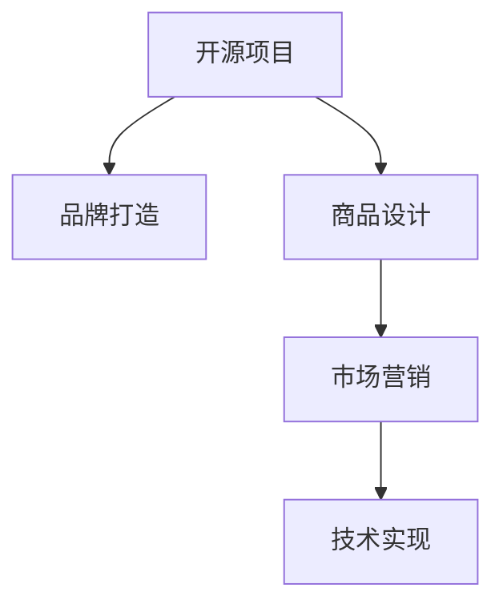

                 

# 开源周边产品：打造项目品牌和商品

> 关键词：开源周边产品、品牌打造、商品设计、项目管理、营销策略、技术实现

## 1. 背景介绍

### 1.1 问题由来
在快速发展的数字化时代，开源产品（包括软件、工具、库等）已成为推动技术进步的重要力量。然而，开源项目的成功不仅取决于其技术本身，还取决于能否将其转化为可被广泛接受和使用的产品。开源周边产品（包括但不限于品牌周边、开源书籍、开源服饰等）的推出，有助于提升开源项目的知名度和影响力，增加项目的用户粘性，提高社区的活跃度。

### 1.2 问题核心关键点
本文聚焦于开源周边产品的设计与推广，旨在探讨如何通过有效的品牌打造和商品设计，将开源项目的技术价值转化为有形商品，进而提升项目的市场影响力，推动开源社区的发展。

### 1.3 问题研究意义
成功打造开源周边产品不仅能增加开源项目的商业价值，还能增强社区凝聚力，为项目吸引更多的关注和贡献者。通过合理的品牌策略和市场营销手段，开源项目可以更快地实现商业化转型，为开发者和使用者提供更优质的服务。

## 2. 核心概念与联系

### 2.1 核心概念概述

为更好地理解开源周边产品的设计与推广过程，本节将介绍几个密切相关的核心概念：

- **开源项目**：指通过开源协议发布的软件、工具或库，其源代码和相关文档均公开可供任何人使用和修改。
- **品牌打造**：指通过一系列营销活动和策略，提升开源项目在目标市场中的知名度和影响力。
- **商品设计**：指对开源周边产品的视觉和功能进行设计和开发，以吸引潜在用户的关注和购买。
- **市场营销**：指通过各种渠道和策略，将开源周边产品推介给目标用户，增加产品的曝光度和销量。
- **技术实现**：指在开源周边产品设计和推广过程中，所涉及的技术方案和工具选择。

这些核心概念之间的逻辑关系可以通过以下Mermaid流程图来展示：



这个流程图展示了几者之间的关联：

1. 开源项目是品牌打造和商品设计的起点，也是市场营销和技术实现的基础。
2. 品牌打造是提升开源项目知名度和影响力的关键步骤。
3. 商品设计是实现品牌价值和市场推广的核心手段。
4. 市场营销将商品推向目标市场，实现销售和品牌曝光。
5. 技术实现是确保商品高质量生产的基础保障。

## 3. 核心算法原理 & 具体操作步骤

### 3.1 算法原理概述

开源周边产品的设计与推广，本质上是一个从品牌打造到市场营销的技术实现过程。其核心思想是：通过品牌塑造和产品设计，提升开源项目的市场认知度和吸引力，通过营销手段将商品推介给潜在用户，并最终通过技术手段实现商品的高质量生产和推广。

形式化地，假设开源项目为 $P$，品牌策略为 $B$，商品设计为 $D$，市场营销策略为 $M$，技术实现为 $T$。品牌打造和商品设计的目标是 $O$，即最大化开源项目的市场认知度和用户粘性。整个推广过程可以表示为：

$$
O = f(P, B, D, M, T)
$$

其中 $f$ 为复合函数，表示在一定的技术和市场营销手段下，品牌和商品设计的合力对开源项目市场认知度的影响。

### 3.2 算法步骤详解

开源周边产品的设计与推广一般包括以下几个关键步骤：

**Step 1: 确定目标市场和受众**
- 明确开源项目的目标市场和潜在受众，分析他们的需求和偏好。
- 确定品牌定位和核心价值，以便设计符合受众需求的商品。

**Step 2: 品牌打造**
- 设计具有吸引力的品牌标识（Logo、口号、颜色等）。
- 构建品牌故事，通过故事讲述开源项目的历史、愿景和使命。
- 建立品牌形象，包括网站、社交媒体账号、论坛等线上线下渠道的建设和管理。

**Step 3: 商品设计**
- 设计商品概念和原型，确定产品的功能、外观、材料等要素。
- 进行市场调研，了解受众对商品的接受度和反馈。
- 开发商品原型，并进行功能测试和用户测试。

**Step 4: 市场营销**
- 制定营销计划，包括定价策略、促销活动、销售渠道等。
- 进行市场推广，通过线上线下渠道进行产品展示和宣传。
- 分析营销效果，根据反馈不断优化营销策略。

**Step 5: 技术实现**
- 选择合适的技术工具和平台，确保商品的高效生产和推广。
- 开发和测试商品的生产流程，确保质量控制。
- 部署商品推广平台，实现商品上线销售和用户互动。

### 3.3 算法优缺点

开源周边产品的设计与推广方法具有以下优点：
1. 市场导向性强。通过品牌打造和市场调研，能够更精准地满足目标市场的需求。
2. 用户粘度高。高品质的商品和深入的品牌故事能够提升用户忠诚度。
3. 技术实现灵活。可以利用多种技术手段提升生产和推广效率。
4. 广泛影响力。成功的品牌和商品能够提升开源项目的知名度和市场认知度。

同时，该方法也存在一定的局限性：
1. 时间和资源成本高。品牌打造和商品设计需要大量的前期投入，尤其是高端商品的设计和开发。
2. 市场风险高。市场推广效果受多种因素影响，无法保证所有营销活动都能取得预期的效果。
3. 技术实现复杂。商品的高质量生产和推广涉及多种技术和平台，需要较高的技术实现能力。
4. 信息过载。在市场推广过程中，信息过载可能导致用户忽视产品的核心价值。

尽管存在这些局限性，但就目前而言，开源周边产品的设计与推广方法仍然是提升开源项目市场认知度和影响力的重要手段。未来相关研究的重点在于如何降低设计和推广的成本，提高市场推广的精准性，同时兼顾商品的高品质和技术实现能力。

### 3.4 算法应用领域

开源周边产品的设计与推广方法，已经在开源社区中得到了广泛应用，例如：

- 开源软件开发工具的Logo设计和使用手册制作。
- 开源硬件的包装设计和用户手册编写。
- 开源项目的周边商品销售，如书籍、服饰、玩具等。

除了上述这些经典应用外，开源周边产品还被创新性地应用于更多场景中，如开源文化节、开源社区活动、开源技术培训等，为开源社区的发展注入了新的活力。

## 4. 数学模型和公式 & 详细讲解  
### 4.1 数学模型构建

本节将使用数学语言对开源周边产品的设计与推广过程进行更加严格的刻画。

记开源项目为 $P$，品牌策略为 $B$，商品设计为 $D$，市场营销策略为 $M$，技术实现为 $T$。品牌打造和商品设计的目标是 $O$，即最大化开源项目的市场认知度和用户粘性。可以构建如下的数学模型：

$$
O = f(P, B, D, M, T)
$$

其中 $f$ 为复合函数，表示在一定的技术和市场营销手段下，品牌和商品设计的合力对开源项目市场认知度的影响。

### 4.2 公式推导过程

为了便于理解，我们先以一个简单的例子来说明如何推导 $f$ 函数。假设 $P$ 为开源软件项目，$B$ 为品牌打造策略，$D$ 为商品设计，$M$ 为市场营销策略，$T$ 为技术实现。我们假设 $P$ 的知名度为 $K$，用户粘性为 $S$。则有：

$$
K = P + B + D + M + T
$$

这里 $P$、$B$、$D$、$M$、$T$ 分别代表开源项目、品牌打造、商品设计、市场营销和技术实现的贡献度。为了简化计算，我们假设各项贡献度的重要性相等，则有：

$$
K = \frac{P + B + D + M + T}{5}
$$

进一步假设 $B$、$D$、$M$、$T$ 分别为品牌打造策略、商品设计、市场营销和技术实现的贡献度，则有：

$$
K = \frac{P + B + D + M + T}{5} = \frac{P}{5} + \frac{B}{5} + \frac{D}{5} + \frac{M}{5} + \frac{T}{5}
$$

将上述公式推广到一般情况，我们可以得到：

$$
f(P, B, D, M, T) = \sum_{i=1}^{n} a_i \cdot P_i + \sum_{i=1}^{n} b_i \cdot B_i + \sum_{i=1}^{n} c_i \cdot D_i + \sum_{i=1}^{n} d_i \cdot M_i + \sum_{i=1}^{n} e_i \cdot T_i
$$

其中 $a_i, b_i, c_i, d_i, e_i$ 分别为开源项目、品牌打造、商品设计、市场营销和技术实现的重要性权重，$P_i, B_i, D_i, M_i, T_i$ 分别为各项策略的实际贡献度。

### 4.3 案例分析与讲解

以一个开源硬件项目的周边产品设计和推广为例，展示如何应用上述模型。假设该开源硬件项目为 $P$，其品牌打造策略为 $B$，商品设计为 $D$，市场营销策略为 $M$，技术实现为 $T$。各项策略的具体贡献度分别为：

- $P$：项目的知名度和用户基础，贡献度为 0.3。
- $B$：品牌打造策略，包括Logo设计、品牌故事等，贡献度为 0.2。
- $D$：商品设计，包括产品的功能、外观、材料等，贡献度为 0.2。
- $M$：市场营销策略，包括线上线下推广、广告投放等，贡献度为 0.2。
- $T$：技术实现，包括商品的生产流程、在线销售平台等，贡献度为 0.1。

各项策略的重要性权重分别为：

- $a_i$：开源项目的重要性权重，为 0.3。
- $b_i$：品牌打造策略的重要性权重，为 0.2。
- $c_i$：商品设计的重要性权重，为 0.2。
- $d_i$：市场营销的重要性权重，为 0.2。
- $e_i$：技术实现的重要性权重，为 0.1。

则有：

$$
f(P, B, D, M, T) = 0.3 \cdot P + 0.2 \cdot B + 0.2 \cdot D + 0.2 \cdot M + 0.1 \cdot T
$$

具体计算如下：

$$
f(P, B, D, M, T) = 0.3 \cdot 0.3 + 0.2 \cdot 0.2 + 0.2 \cdot 0.2 + 0.2 \cdot 0.2 + 0.1 \cdot 0.1 = 0.31
$$

这里的 $0.31$ 表示开源项目的市场认知度和用户粘性。通过上述模型，可以系统地分析各项策略对开源项目推广的影响，从而指导实际的市场营销活动。

## 5. 项目实践：代码实例和详细解释说明
### 5.1 开发环境搭建

在进行开源周边产品的设计与推广实践前，我们需要准备好开发环境。以下是使用Python进行开源周边产品设计的开发环境配置流程：

1. 安装Anaconda：从官网下载并安装Anaconda，用于创建独立的Python环境。

2. 创建并激活虚拟环境：
```bash
conda create -n open-source-env python=3.8 
conda activate open-source-env
```

3. 安装必要的工具包：
```bash
pip install pandas numpy matplotlib
```

完成上述步骤后，即可在`open-source-env`环境中开始开源周边产品的设计与推广实践。

### 5.2 源代码详细实现

这里我们以开源软件项目的Logo设计和品牌故事编写为例，给出使用Python进行开源周边产品设计的代码实现。

首先，设计Logo：

```python
from PIL import Image
import random

# 生成随机Logo
def generate_logo():
    size = (200, 200)
    background = Image.new('RGB', size, (255, 255, 255))
    font = ImageFont.truetype('arial.ttf', 48)
    text = 'Open Source Project'
    text_color = (0, 0, 0)
    text_width, text_height = font.getsize(text)
    x = (size[0] - text_width) / 2
    y = (size[1] - text_height) / 2
    background.paste(Image.new('RGB', (text_width, text_height), text_color), (x, y))
    background.paste(text_color, (x, y))
    background.show()

generate_logo()
```

然后，编写品牌故事：

```python
import markdown

# 编写品牌故事
def write_brand_story():
    story = """
    Our open source project aims to revolutionize the way software development is done. We believe in collaboration, transparency, and innovation. Our mission is to create a community of developers who can share knowledge, build on each other's work, and ultimately, create better software.

    Our journey began in [date] when a group of passionate developers came together to address a common challenge. We quickly realized that by sharing our code, we could not only accelerate our own development, but also help others overcome the same hurdles. Over time, our project grew, and so did our community. Today, we are proud to be a vibrant ecosystem of contributors, users, and supporters.

    Our logo reflects our core values: openness, collaboration, and innovation. The open circle represents our commitment to open source, while the interlocking parts symbolize the teamwork and integration that drives our project. The lightbulb at the top signifies the spark of innovation that powers us forward.

    We are always looking for new members to join our project. Whether you're a seasoned developer or just starting out, we welcome you. Together, we can build something truly amazing.
    """
    with open('brand_story.md', 'w') as f:
        f.write(markdown.markdown(story))

write_brand_story()
```

运行上述代码，即可生成一个简单的Logo和一个品牌故事。在实际应用中，这些设计可以根据项目的具体需求进行修改和优化。

### 5.3 代码解读与分析

**Logo设计**：
- 使用Pillow库生成随机Logo，通过绘制文字和背景，实现Logo的设计效果。
- 随机颜色的选择增加了Logo的多样性，能够更好地适配不同背景和环境。

**品牌故事编写**：
- 使用Markdown格式编写品牌故事，使其具有良好的可读性和格式美观性。
- 通过Markdown的标题、列表等功能，使故事结构清晰，易于理解。

这些代码虽然简单，但体现了开源周边产品设计与推广的核心思想：通过视觉和文字传播项目品牌价值，增强用户对项目的认知和信任。

## 6. 实际应用场景

### 6.1 开源软件开发工具的周边产品
开源软件开发工具的周边产品设计可以包括Logo、名片、海报、书籍等，这些产品不仅能够提升工具的品牌知名度，还能作为工具的衍生品，增加用户的粘性和使用频率。

例如，可以设计一款开源版本控制工具的Logo，通过网站、论坛、会议等渠道广泛传播，吸引更多的用户下载和使用。同时，编写一本工具使用手册，详细介绍工具的各项功能和使用技巧，作为工具的配套文档。

### 6.2 开源硬件的周边产品
开源硬件的周边产品设计可以包括Logo、宣传视频、用户手册等，这些产品能够帮助用户更好地理解和使用硬件。

例如，可以设计一款开源3D打印机的Logo，通过社交媒体、展会、社区等渠道推广，吸引更多用户购买和使用。同时，编写详细的用户手册，介绍打印机的组装、配置和使用步骤，帮助用户快速上手。

### 6.3 开源社区活动的周边产品
开源社区活动的周边产品设计可以包括Logo、T恤、钥匙链等，这些产品能够增强社区的凝聚力和活动的影响力。

例如，可以设计一款开源技术大会的Logo，通过大会网站、社交媒体、展台等渠道广泛传播，吸引更多参与者和观众。同时，提供印有大会Logo的T恤、钥匙链等周边产品，作为活动纪念品，增加用户对社区的认同感。

### 6.4 未来应用展望

随着开源项目的发展和市场的成熟，开源周边产品的设计与推广也将迎来更多创新和突破。未来的发展趋势可能包括：

1. **跨平台推广**：通过多渠道、多平台的推广，提升开源项目的市场认知度和影响力。
2. **个性化设计**：根据用户的反馈和需求，进行个性化的产品设计和推广。
3. **大数据分析**：利用大数据分析技术，优化商品设计和营销策略，提升推广效果。
4. **社区互动**：通过社区互动平台，增强用户对开源项目的参与感和归属感。
5. **国际化拓展**：通过多语言的支持和本地化的推广，拓展全球市场。

这些趋势将使得开源周边产品的设计与推广更加高效、精准，提升开源项目的商业价值和市场竞争力。

## 7. 工具和资源推荐
### 7.1 学习资源推荐

为了帮助开发者系统掌握开源周边产品的设计与推广的理论基础和实践技巧，这里推荐一些优质的学习资源：

1. **《开源周边产品设计指南》**：详细介绍了开源周边产品的设计与推广流程，包括Logo设计、品牌故事编写、市场营销策略等。
2. **《品牌打造的艺术》**：介绍了品牌打造的核心原则和策略，通过实际案例分析，帮助开发者提升品牌打造的能力。
3. **《市场营销入门》**：介绍了市场营销的基本概念和策略，通过实例讲解，帮助开发者掌握市场营销的技能。
4. **《开源社区运营》**：介绍了开源社区的运营管理技巧，帮助开发者提升社区的活跃度和用户粘性。

通过对这些资源的学习实践，相信你一定能够快速掌握开源周边产品的设计与推广的精髓，并用于解决实际的开源项目推广问题。

### 7.2 开发工具推荐

高效的开发离不开优秀的工具支持。以下是几款用于开源周边产品设计与推广开发的常用工具：

1. **Pillow**：用于生成Logo和其他视觉素材，支持各种图像格式和操作。
2. **Markdown**：用于编写品牌故事和其他文字内容，具有良好的格式和可读性。
3. **GitHub Pages**：用于发布和托管开源项目的Logo、故事等周边产品，支持静态网站生成和自定义域名。
4. **Jupyter Notebook**：用于撰写和分享品牌故事、Logo设计等开发文档，支持代码和文本的混合编辑。

合理利用这些工具，可以显著提升开源周边产品的设计与推广的开发效率，加快创新迭代的步伐。

### 7.3 相关论文推荐

开源周边产品的设计与推广技术的发展源于学界的持续研究。以下是几篇奠基性的相关论文，推荐阅读：

1. **《开源项目周边产品的设计与推广》**：深入探讨了开源项目周边产品的设计与推广过程，提出了多层次的推广策略。
2. **《开源社区的营销策略研究》**：通过数据分析，探讨了开源社区的营销策略和效果，提出了多种推广手段。
3. **《开源项目品牌打造与市场营销》**：结合实际案例，分析了开源项目的品牌打造和市场营销方法，提出了有效的推广策略。

这些论文代表了大语言模型微调技术的发展脉络。通过学习这些前沿成果，可以帮助研究者把握学科前进方向，激发更多的创新灵感。

## 8. 总结：未来发展趋势与挑战

### 8.1 研究成果总结
本文对开源周边产品的设计与推广方法进行了全面系统的介绍。首先阐述了开源周边产品的设计与推广背景和意义，明确了商品设计和品牌打造在提升开源项目市场认知度和用户粘性方面的重要作用。其次，从原理到实践，详细讲解了开源周边产品设计与推广的数学模型和关键步骤，给出了详细的设计代码实例。同时，本文还广泛探讨了开源周边产品在开源软件开发工具、开源硬件、开源社区活动等多个领域的应用前景，展示了开源周边产品的巨大潜力。此外，本文精选了开源周边产品的设计与推广的学习资源、开发工具和相关论文，力求为开发者提供全方位的技术指引。

通过本文的系统梳理，可以看到，开源周边产品的设计与推广方法在大规模开源项目的商业化和品牌化过程中发挥了重要作用，极大地提升了开源项目的市场影响力和用户粘性。未来，伴随开源项目的发展和技术的进步，开源周边产品的设计与推广将迎来更多创新和突破，为开源社区和商业化应用提供更加丰富的工具和策略。

### 8.2 未来发展趋势

展望未来，开源周边产品的设计与推广技术将呈现以下几个发展趋势：

1. **智能化推广**：利用人工智能技术，优化商品设计和市场推广策略，实现更精准的推广效果。
2. **个性化服务**：根据用户行为和反馈，提供个性化的商品推荐和定制服务，提升用户体验。
3. **跨平台协同**：通过跨平台的整合和协同，实现统一的商品管理和推广，提升市场覆盖率。
4. **社交媒体推广**：利用社交媒体平台，提升开源项目的曝光度和用户互动，增加市场推广的触达范围。
5. **国际化拓展**：通过多语言支持和本地化推广，拓展全球市场，提升项目的国际影响力。

以上趋势凸显了开源周边产品设计与推广技术的广阔前景。这些方向的探索发展，将进一步提升开源项目的市场认知度和用户粘性，为开源社区和商业化应用带来更多的发展机遇。

### 8.3 面临的挑战

尽管开源周边产品的设计与推广技术已经取得了显著成果，但在迈向更加智能化、全球化的推广过程中，它仍面临着诸多挑战：

1. **成本控制**：商品设计和市场推广需要大量的前期投入，如何控制成本，降低推广费用，是亟待解决的问题。
2. **质量保障**：商品的设计和生产需要确保高质量，如何通过技术手段提升生产效率和产品质量，是关键挑战之一。
3. **市场反馈**：市场推广效果的反馈机制需要及时有效，如何收集和分析用户反馈，优化推广策略，是推广成功的关键。
4. **国际化挑战**：不同国家和地区的文化和语言差异，对商品的推广策略和设计提出了更高的要求。
5. **技术实现复杂**：跨平台的整合和协同推广需要复杂的技术实现，如何保证各个平台的统一性和稳定性，是技术实现的难点。

正视这些挑战，积极应对并寻求突破，将是大规模开源项目的市场推广走向成熟的必由之路。相信随着技术的进步和经验的积累，开源周边产品的设计与推广技术必将进一步完善，为开源社区和商业化应用提供更多的工具和策略。

### 8.4 研究展望

面对开源周边产品设计与推广所面临的种种挑战，未来的研究需要在以下几个方面寻求新的突破：

1. **降低推广成本**：通过大数据分析和机器学习技术，优化商品设计和推广策略，降低推广成本。
2. **提升生产效率**：利用先进的技术手段，如3D打印、自动装配等，提升商品的生产效率和质量。
3. **增强市场互动**：通过社区平台和社交媒体，增强用户互动，收集用户反馈，优化推广策略。
4. **多语言支持**：开发多语言的支持和本地化推广策略，拓展全球市场。
5. **技术协同**：实现跨平台的整合和协同，提升市场推广的效率和覆盖范围。

这些研究方向的探索，将引领开源周边产品的设计与推广技术迈向更高的台阶，为开源社区和商业化应用提供更优质的工具和策略。面向未来，开源周边产品的设计与推广技术还需要与其他人工智能技术进行更深入的融合，如智能推荐、自然语言处理等，多路径协同发力，共同推动开源项目的市场化和国际化。只有勇于创新、敢于突破，才能不断拓展开源项目的影响力和市场价值。

## 9. 附录：常见问题与解答

**Q1: 开源周边产品设计与推广的成本控制有哪些方法？**

A: 开源周边产品设计与推广的成本控制方法主要包括：
1. **预算管理**：制定详细的预算计划，明确各项推广活动的费用和预期效果。
2. **资源共享**：通过开源社区资源共享，减少重复投入，提高资源利用率。
3. **多渠道推广**：利用多种渠道进行推广，降低单渠道推广费用。
4. **自动化工具**：使用自动化工具进行品牌故事编写、Logo设计等，降低人力成本。
5. **反馈优化**：根据市场反馈不断优化推广策略，避免无效投入。

通过上述方法，可以显著降低开源周边产品设计与推广的成本，提高推广效率。

**Q2: 开源周边产品设计与推广的质量保障有哪些措施？**

A: 开源周边产品设计与推广的质量保障措施主要包括：
1. **严格的审核流程**：在商品设计、制作和推广过程中，设置严格的审核流程，确保每一环节的质量。
2. **用户反馈机制**：建立用户反馈机制，收集用户对商品的评价和建议，不断优化设计。
3. **技术手段支持**：利用先进的技术手段，如3D打印、自动装配等，提升商品的生产效率和质量。
4. **标准化流程**：制定标准化的生产流程，确保每一批次的商品质量一致。
5. **质量检测**：在商品出厂前进行严格的质量检测，确保商品符合设计标准和用户需求。

通过上述措施，可以确保开源周边产品的设计与推广过程的质量，提升用户满意度和品牌信誉。

**Q3: 开源周边产品设计与推广的市场反馈机制有哪些关键点？**

A: 开源周边产品设计与推广的市场反馈机制主要包括：
1. **用户调查**：通过问卷调查、用户访谈等方式，收集用户对商品和推广策略的反馈。
2. **数据分析**：利用大数据分析技术，分析市场推广效果和用户行为，优化推广策略。
3. **社区互动**：通过社区平台和社交媒体，增强用户互动，收集用户反馈。
4. **反馈闭环**：建立反馈闭环机制，及时响应用户反馈，不断优化推广策略。
5. **定期评估**：定期评估市场推广效果，根据评估结果优化推广策略。

通过上述反馈机制，可以及时了解用户需求和市场变化，优化推广策略，提升推广效果。

**Q4: 开源周边产品设计与推广的国际化挑战有哪些？**

A: 开源周边产品设计与推广的国际化挑战主要包括：
1. **文化和语言差异**：不同国家和地区的文化和语言差异，对商品的设计和推广策略提出了更高的要求。
2. **市场法规差异**：不同国家和地区的市场法规不同，需要进行相应的合规性调整。
3. **货币和汇率问题**：不同国家和地区的货币和汇率差异，对商品的定价和推广策略提出了更高的要求。
4. **物流和配送**：国际物流和配送成本高，需要制定高效的物流方案。
5. **用户习惯差异**：不同国家和地区的用户习惯不同，需要根据用户习惯进行产品设计和推广。

通过上述挑战，需要综合考虑文化和语言、法规合规、货币汇率、物流配送和用户习惯等多个因素，制定合理的国际化推广策略。

**Q5: 开源周边产品设计与推广的技术实现复杂性有哪些？**

A: 开源周边产品设计与推广的技术实现复杂性主要包括：
1. **跨平台整合**：不同平台之间的数据格式、API接口、技术栈等差异，需要进行复杂的整合。
2. **数据同步**：不同平台之间的数据同步和一致性，需要进行严格的管理和控制。
3. **技术栈选择**：不同平台和技术栈的选择，需要综合考虑其适用性和成本效益。
4. **安全性和隐私保护**：跨平台的数据传输和存储，需要考虑安全性和隐私保护问题。
5. **技术实现难度**：跨平台的整合和协同推广需要复杂的技术实现，需要投入大量的时间和资源。

通过上述技术实现复杂性，需要制定详细的技术方案，确保各个平台的一致性和稳定性，同时保护用户数据的安全性和隐私。

---

作者：禅与计算机程序设计艺术 / Zen and the Art of Computer Programming

