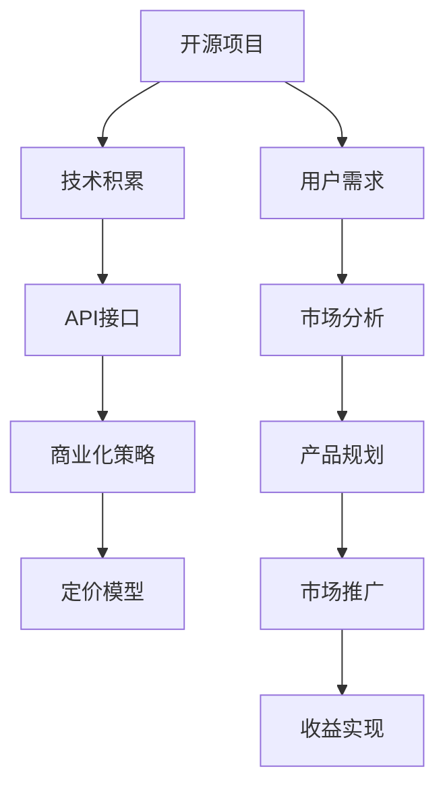

                 

# 开源项目的API商业化：策略和定价模型

> 关键词：开源项目,API商业化,策略,定价模型,开源社区,商业化转型,API市场,商业模式,订阅定价,按需定价,动态定价

## 1. 背景介绍

在软件开发领域，开源项目以其开放、协作的精神，迅速成为技术创新和共享的重要平台。然而，对于许多优秀的开源项目而言，如何从开源模式成功转型到商业化模式，实现持续的商业模式创新和盈利，是一个需要深入探讨的问题。本文聚焦于开源项目的API商业化，通过分析已有成功案例，探讨API商业化的策略和定价模型，以期为开源项目的商业化转型提供理论指导和实践参考。

## 2. 核心概念与联系

### 2.1 核心概念概述

开源项目商业化是指将开源项目中的核心技术和产品，通过商业手段进行运营，以实现盈利和持续发展的过程。开源项目的API商业化，则是指通过向外部用户提供API接口服务，将开源项目的技术成果转化为商业价值的一种方式。API商业化策略的核心在于如何选择合适的商业路径，以及如何制定合理的定价模型，以确保项目在商业化过程中的可持续发展。

### 2.2 核心概念原理和架构的 Mermaid 流程图

该流程图展示了开源项目API商业化的基本路径：开源项目积累了丰富的技术积累（B），通过API接口（C）向市场提供服务，制定商业化策略（D），并结合市场分析（G）和用户需求（F）进行产品规划（H）和市场推广（I），最终实现收益（J）。

## 3. 核心算法原理 & 具体操作步骤

### 3.1 算法原理概述

开源项目的API商业化，本质上是一个从技术创新到商业创新的过程。其核心在于如何将开源项目的技术优势转化为商业价值，同时确保项目的可持续发展。算法原理主要包括以下几个方面：

- **市场需求分析**：通过市场调研，了解用户对API接口的需求和痛点，确定市场潜力。
- **API价值评估**：评估API接口对用户的实际价值，包括技术能力、服务效率、易用性等方面。
- **商业化策略制定**：根据市场需求和API价值，制定合理的商业化策略，包括定价策略、市场定位、渠道选择等。
- **定价模型构建**：设计有效的定价模型，平衡用户需求和项目收益，实现商业化目标。

### 3.2 算法步骤详解

#### 3.2.1 市场需求分析

市场需求分析是API商业化的第一步，主要通过以下几个步骤进行：

1. **用户调研**：通过问卷调查、用户访谈等方式，了解用户对API接口的需求和痛点。
2. **市场分析**：分析目标市场的规模、增长趋势、竞争态势等，确定市场潜力。
3. **机会识别**：识别市场中的机会点，如市场缺口、痛点等，确定API接口的定位和差异化优势。

#### 3.2.2 API价值评估

API价值评估主要通过以下几个步骤进行：

1. **技术能力评估**：评估API接口的技术能力，包括稳定性、可靠性、性能等。
2. **服务效率评估**：评估API接口对用户的服务效率提升效果，如减少开发时间、降低运营成本等。
3. **易用性评估**：评估API接口的易用性，包括文档完备性、API接口易用性、使用效率等。

#### 3.2.3 商业化策略制定

商业化策略制定主要包括以下几个方面：

1. **定价策略**：选择合适的定价策略，包括按需付费、订阅定价、免费增值等。
2. **市场定位**：确定API接口的市场定位，如中低端市场、中高端市场等。
3. **渠道选择**：选择合适的销售和推广渠道，如直接销售、第三方渠道、合作伙伴等。

#### 3.2.4 定价模型构建

定价模型构建主要通过以下几个步骤进行：

1. **成本分析**：分析API接口的开发和运营成本，包括技术成本、人力成本、营销成本等。
2. **价值分析**：分析API接口对用户的实际价值，包括技术能力、服务效率、易用性等。
3. **定价策略选择**：根据成本和价值分析结果，选择合适的定价策略，如订阅定价、按需定价、动态定价等。

### 3.3 算法优缺点

开源项目API商业化的策略和定价模型具有以下优点：

- **灵活性高**：根据市场需求和API价值，灵活调整商业化策略和定价模型。
- **成本可控**：通过定价模型控制成本，确保商业化过程中的可持续发展。
- **用户友好**：通过合理的定价策略和商业化路径，提高用户的满意度和忠诚度。

然而，开源项目API商业化也存在以下缺点：

- **市场风险高**：市场需求变化快，市场风险较高，需要持续的市场调研和调整。
- **竞争激烈**：市场竞争激烈，需要持续的技术创新和优化。
- **定价复杂**：定价模型需要考虑多个因素，设计复杂。

### 3.4 算法应用领域

开源项目API商业化主要应用于以下几个领域：

- **SaaS服务**：如云存储、云数据库等，通过API接口提供服务，实现持续盈利。
- **API市场**：如DataRobot、Alteryx等，通过API接口提供数据科学工具，实现市场盈利。
- **第三方集成**：如Salesforce、HubSpot等，通过API接口提供第三方集成服务，实现市场拓展。

## 4. 数学模型和公式 & 详细讲解 & 举例说明

### 4.1 数学模型构建

开源项目API商业化的数学模型主要包括以下几个部分：

- **市场需求模型**：$D(t) = \alpha + \beta t$，其中 $\alpha$ 为初始市场需求，$\beta$ 为市场增长率。
- **API价值模型**：$V(i) = f(C_i, E_i, U_i)$，其中 $C_i$ 为API接口的技术能力，$E_i$ 为服务效率，$U_i$ 为易用性，$f$ 为评估函数。
- **定价模型**：$P = g(V, C, D)$，其中 $V$ 为API接口的价值，$C$ 为成本，$D$ 为市场需求，$g$ 为定价函数。

### 4.2 公式推导过程

以订阅定价模型为例，其推导过程如下：

1. **需求分析**：假设市场需求为 $D(t) = \alpha + \beta t$，其中 $\alpha$ 为初始市场需求，$\beta$ 为市场增长率。
2. **价值评估**：假设API接口的价值为 $V(i) = C_i \times E_i \times U_i$，其中 $C_i$ 为API接口的技术能力，$E_i$ 为服务效率，$U_i$ 为易用性。
3. **成本分析**：假设API接口的开发和运营成本为 $C = \gamma V$，其中 $\gamma$ 为成本系数。
4. **定价模型**：假设订阅价格为 $P$，则定价模型为 $P = \delta V / D$，其中 $\delta$ 为定价系数。

### 4.3 案例分析与讲解

以DataRobot为例，分析其API商业化策略和定价模型：

- **市场需求分析**：DataRobot通过市场调研，发现数据科学工具的需求快速增长，市场潜力巨大。
- **API价值评估**：DataRobot评估其API接口的技术能力、服务效率和易用性，认为其API接口对用户具有高价值。
- **商业化策略制定**：DataRobot选择了订阅定价策略，将其API接口按月收费，并设立了不同层级的订阅服务，满足不同用户的需求。
- **定价模型构建**：DataRobot通过市场调研和成本分析，制定了合理的定价模型，确保API接口的盈利性。

## 5. 项目实践：代码实例和详细解释说明

### 5.1 开发环境搭建

开源项目API商业化的开发环境搭建主要包括以下几个步骤：

1. **环境安装**：安装Python、Django、Flask等开发环境，确保代码的可移植性和可扩展性。
2. **API接口设计**：设计API接口的接口规范、接口参数、接口返回值等，确保API接口的易用性和稳定性。
3. **安全保障**：实施API接口的安全保障措施，包括认证、授权、限流等。

### 5.2 源代码详细实现

以DataRobot为例，展示其API接口的详细实现过程：

1. **API接口设计**：定义API接口的接口规范，包括接口名称、接口参数、接口返回值等。
2. **API接口实现**：实现API接口的具体功能，确保API接口的功能完备和高效。
3. **安全保障**：实施API接口的安全保障措施，包括认证、授权、限流等。

### 5.3 代码解读与分析

代码解读与分析主要包括以下几个方面：

1. **接口设计**：API接口的设计需考虑接口名称的规范性、参数的完备性和返回值的可读性。
2. **接口实现**：API接口的实现需考虑代码的可读性、可维护性和可扩展性。
3. **安全保障**：API接口的安全保障措施需考虑认证方式、授权机制和限流策略。

### 5.4 运行结果展示

运行结果展示主要通过以下几个方面进行：

1. **接口测试**：对API接口进行单元测试和集成测试，确保API接口的功能完备和稳定性。
2. **性能测试**：对API接口进行负载测试和压力测试，确保API接口的高效性和稳定性。
3. **安全测试**：对API接口进行安全测试，确保API接口的安全性和可靠性。

## 6. 实际应用场景

### 6.1 云存储服务

云存储服务是开源项目API商业化的一个重要应用场景。例如，Dropbox通过其API接口，向开发者提供云存储服务，实现商业化盈利。Dropbox的API接口简单易用，开发者可以轻松集成其云存储服务到应用中，实现数据存储、同步和共享等功能。

### 6.2 数据科学工具

数据科学工具是开源项目API商业化的另一个重要应用场景。例如，DataRobot通过其API接口，向用户提供数据科学工具，实现商业化盈利。DataRobot的API接口支持多种数据科学算法，帮助用户快速构建、训练和部署数据科学模型，实现数据驱动的业务决策。

### 6.3 第三方集成

第三方集成是开源项目API商业化的第三个重要应用场景。例如，Salesforce通过其API接口，向开发者提供第三方集成服务，实现商业化盈利。Salesforce的API接口支持多种第三方应用集成，帮助用户快速构建、部署和扩展其应用功能，实现业务自动化和效率提升。

## 7. 工具和资源推荐

### 7.1 学习资源推荐

1. **《API商业化：从开源到商业》**：该书详细介绍了开源项目商业化的策略和实践，包括API接口设计、API接口实现、API接口安全等方面。
2. **《OpenAPI设计指南》**：该书详细介绍了API接口设计的规范和最佳实践，帮助开发者设计高质量的API接口。
3. **《数据科学API商业化实战》**：该书详细介绍了数据科学工具的API接口设计和实现，帮助开发者实现数据科学工具的商业化盈利。
4. **《第三方应用集成API设计》**：该书详细介绍了第三方应用的API接口设计和实现，帮助开发者实现第三方应用的商业化盈利。

### 7.2 开发工具推荐

1. **Python**：Python是目前最流行的开源开发语言，具有简单易学、灵活高效的特点，适合API接口的开发和实现。
2. **Django**：Django是目前最流行的Python Web框架之一，支持API接口的快速开发和部署。
3. **Flask**：Flask是另一个流行的Python Web框架，支持API接口的灵活开发和部署。
4. **Postman**：Postman是一款流行的API接口测试工具，支持API接口的快速测试和调试。
5. **Swagger**：Swagger是一款流行的API接口设计工具，支持API接口的设计和文档生成。

### 7.3 相关论文推荐

1. **《开源项目的API商业化策略》**：该论文详细介绍了开源项目API商业化的策略和实践，包括市场需求分析、API价值评估、商业化策略制定等方面。
2. **《开源项目的API定价模型》**：该论文详细介绍了开源项目API定价模型的构建和优化，包括成本分析、价值评估、定价策略选择等方面。
3. **《数据科学API商业化的实践》**：该论文详细介绍了数据科学工具的API接口设计和实现，包括API接口设计、API接口实现、API接口安全等方面。
4. **《第三方应用集成的API设计》**：该论文详细介绍了第三方应用的API接口设计和实现，包括API接口设计、API接口实现、API接口安全等方面。

## 8. 总结：未来发展趋势与挑战

### 8.1 研究成果总结

开源项目API商业化是一个从技术创新到商业创新的过程，涉及市场需求分析、API价值评估、商业化策略制定和定价模型构建等多个方面。通过合理的商业化策略和定价模型，开源项目可以实现商业化盈利，确保可持续发展。

### 8.2 未来发展趋势

开源项目API商业化的未来发展趋势主要包括以下几个方面：

1. **API市场化**：开源项目通过API接口提供服务，进入API市场，实现持续盈利。
2. **API集成化**：开源项目通过API接口提供第三方集成服务，实现市场拓展和业务扩展。
3. **API数据化**：开源项目通过API接口提供数据科学工具，实现数据驱动的业务决策。
4. **API安全化**：开源项目通过API接口的安全保障措施，确保API接口的安全性和可靠性。

### 8.3 面临的挑战

开源项目API商业化面临的挑战主要包括以下几个方面：

1. **市场需求变化快**：市场需求变化快，需要持续的市场调研和调整。
2. **API接口复杂度高**：API接口设计复杂，需要考虑接口规范、接口参数、接口返回值等多个方面。
3. **API接口安全保障**：API接口的安全保障措施需考虑认证方式、授权机制和限流策略。
4. **API接口性能优化**：API接口的性能需考虑代码的可读性、可维护性和可扩展性。

### 8.4 研究展望

开源项目API商业化的未来研究展望主要包括以下几个方面：

1. **API接口设计自动化**：通过工具和平台，实现API接口设计的自动化，提高API接口的设计效率。
2. **API接口管理平台**：开发API接口管理平台，实现API接口的集中管理和监控。
3. **API接口市场化工具**：开发API接口市场化工具，帮助开发者快速构建和部署API接口。
4. **API接口安全保障机制**：研究API接口的安全保障机制，确保API接口的安全性和可靠性。

## 9. 附录：常见问题与解答

**Q1: 开源项目如何选择合适的API定价策略？**

A: 开源项目应根据市场需求、API接口的价值和成本，选择合适的API定价策略。常见策略包括订阅定价、按需定价、动态定价等。

**Q2: 开源项目如何设计高质量的API接口？**

A: 开源项目应遵循API接口设计规范，确保API接口的易用性、稳定性和安全性。

**Q3: 开源项目如何确保API接口的安全性？**

A: 开源项目应实施API接口的安全保障措施，包括认证、授权、限流等。

**Q4: 开源项目如何进行API接口的市场推广？**

A: 开源项目应选择合适的销售和推广渠道，如直接销售、第三方渠道、合作伙伴等。

**Q5: 开源项目如何应对市场需求变化？**

A: 开源项目应持续进行市场调研和用户调研，及时调整商业化策略和定价模型。

---

作者：禅与计算机程序设计艺术 / Zen and the Art of Computer Programming

