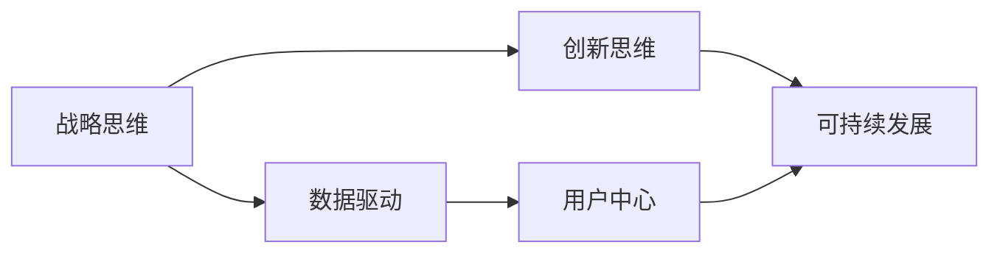

                 

# 思维体系：决定管理者的起跑线

## 1. 背景介绍

### 1.1 问题由来

随着经济全球化和信息技术的迅猛发展，管理者的角色和功能也发生了深刻变化。在传统工业经济时代，管理者更多依赖于经验、直觉和直觉的决策方式来管理企业。而在数字化经济时代，管理者的角色不仅涉及企业内部资源的管理和优化，更需要对企业外部环境的变化做出快速、有效的反应。

在这样的背景下，管理者的决策能力和思维模式需要不断更新和升级。许多企业通过引入各种先进的管理工具和方法，帮助管理者更好地理解和利用数据，做出更科学的决策。但这些工具和方法的应用往往需要管理者具备一定的学习能力和实践经验，这无疑给许多管理者带来了新的挑战。

### 1.2 问题核心关键点

为应对这些挑战，管理者需要建立一套系统的思维体系，以帮助自己更好地理解复杂多变的环境，制定合理的战略决策。这个思维体系不仅需要包括传统的管理理论和方法，还应该涵盖现代技术和工具的应用。

基于此，本文将介绍一个系统的管理思维体系，帮助管理者在不断变化的环境中保持竞争力。这套思维体系由以下几个核心部分组成：

1. **战略思维**：涵盖企业的长期战略规划和短期目标设定。
2. **数据驱动**：利用数据和分析工具，制定数据驱动的决策。
3. **创新思维**：鼓励创新，推动企业在产品、市场和技术上的突破。
4. **用户中心**：以用户需求为导向，优化产品和服务。
5. **可持续发展**：关注企业的社会责任和环境保护。

### 1.3 问题研究意义

建立一套系统、有效的管理思维体系，对于提升管理者的决策能力、增强企业的竞争力具有重要意义。通过掌握这些核心思想和方法，管理者可以更好地适应数字化经济时代的挑战，实现企业的可持续发展。

## 2. 核心概念与联系

### 2.1 核心概念概述

为更好地理解这套管理思维体系，本节将介绍几个关键概念：

1. **战略思维**：指管理者在制定企业长期和短期目标时，需要考虑环境的复杂性和不确定性，制定具有前瞻性和可行性的战略计划。

2. **数据驱动**：指管理者在决策过程中，利用数据和分析工具，进行科学、客观的决策。这包括数据的收集、处理、分析和应用。

3. **创新思维**：指管理者需要不断寻找新的机会和挑战，推动企业的创新和突破。这包括创新管理方法、产品和技术等。

4. **用户中心**：指管理者需要以用户需求为导向，优化产品和服务，提升用户体验，实现企业的价值最大化。

5. **可持续发展**：指管理者需要关注企业的社会责任和环境保护，推动企业向可持续发展的方向前进。

这些核心概念之间相互联系，共同构成了管理者的思维体系。通过掌握这些核心思想，管理者可以更好地应对各种复杂环境，制定合理的战略决策，实现企业的长期发展。

### 2.2 核心概念原理和架构的 Mermaid 流程图



这个流程图展示了这些核心概念之间的联系：

1. **战略思维**是基础，决定了企业的发展方向和目标。
2. **数据驱动**提供了决策的科学依据，帮助管理者更好地理解环境变化。
3. **创新思维**是驱动企业发展的动力，帮助管理者不断寻找新的机会和突破。
4. **用户中心**是企业价值实现的核心，帮助管理者优化产品和服务，提升用户体验。
5. **可持续发展**是企业长期发展的保障，帮助管理者关注社会责任和环境保护。

这些概念相互促进，共同构建了一个系统的管理思维体系。

## 3. 核心算法原理 & 具体操作步骤

### 3.1 算法原理概述

管理者在应用这套思维体系时，需要掌握以下核心算法和操作步骤：

1. **数据收集和预处理**：收集和整理与企业相关的数据，进行初步处理和清洗。
2. **数据分析和可视化**：利用数据分析工具和方法，对收集到的数据进行分析，并通过可视化工具展示分析结果。
3. **模型建立和训练**：根据数据分析结果，选择合适的模型进行训练和优化。
4. **战略制定和调整**：根据模型预测结果，制定企业战略，并在实施过程中进行不断调整。
5. **创新实践和评估**：根据企业战略和市场需求，推动创新实践，并进行效果评估和反馈。

### 3.2 算法步骤详解

1. **数据收集和预处理**
   - 收集与企业相关的数据，包括市场数据、财务数据、用户反馈数据等。
   - 进行数据清洗和处理，去除噪声和异常值，确保数据质量。

2. **数据分析和可视化**
   - 利用数据分析工具（如Python、R等）进行数据挖掘和分析。
   - 使用可视化工具（如Tableau、Power BI等）将分析结果展示出来，便于管理者理解和决策。

3. **模型建立和训练**
   - 选择合适的模型，如回归模型、分类模型、聚类模型等，进行模型建立。
   - 使用训练数据对模型进行训练，并进行交叉验证和调参，确保模型效果。

4. **战略制定和调整**
   - 根据模型预测结果，制定企业长期和短期战略目标。
   - 在战略实施过程中，根据环境变化和数据反馈，进行不断调整和优化。

5. **创新实践和评估**
   - 根据企业战略和市场需求，推动创新实践，如新产品开发、新技术应用等。
   - 对创新实践的效果进行评估和反馈，不断优化创新过程。

### 3.3 算法优缺点

这套管理思维体系具有以下优点：

1. **科学性和客观性**：基于数据和模型分析，提供了科学的决策依据，减少了主观性和直觉性。
2. **灵活性和适应性**：能够根据环境变化和数据反馈，进行不断调整和优化，适应复杂多变的环境。
3. **创新性和突破性**：鼓励创新思维，推动企业在产品、市场和技术上的突破。
4. **用户中心性和价值最大化**：以用户需求为导向，优化产品和服务，实现企业的价值最大化。
5. **可持续发展性**：关注企业的社会责任和环境保护，推动企业向可持续发展的方向前进。

同时，这套体系也存在以下缺点：

1. **数据依赖性强**：对数据的依赖性较强，需要保证数据的质量和完整性。
2. **模型复杂度高**：模型建立和训练需要较高的技术和资源投入，尤其是数据量和计算资源。
3. **战略调整难度大**：战略调整需要时间和资源，可能影响企业短期内的稳定性和发展速度。
4. **创新风险高**：创新实践存在一定的不确定性，可能带来高风险和高投入。

### 3.4 算法应用领域

这套管理思维体系适用于各种类型的企业，尤其是那些希望在数字化经济时代保持竞争力的企业。具体应用领域包括：

1. **金融行业**：利用数据分析和模型建立，进行风险管理和投资决策。
2. **制造业**：利用数据驱动和用户中心，优化生产流程和提升产品质量。
3. **零售业**：利用数据分析和用户中心，优化库存管理和提升用户体验。
4. **医疗行业**：利用数据分析和模型建立，进行疾病预测和患者管理。
5. **科技行业**：利用创新思维和可持续发展，推动产品创新和技术突破。

## 4. 数学模型和公式 & 详细讲解 & 举例说明

### 4.1 数学模型构建

为更好地理解这套思维体系的应用，本节将介绍几个关键数学模型：

1. **线性回归模型**：用于预测连续型变量，如销售额预测。公式如下：
   $$
   y = \beta_0 + \beta_1 x_1 + \beta_2 x_2 + \cdots + \beta_n x_n + \epsilon
   $$
   其中，$y$ 为预测变量，$x_i$ 为自变量，$\beta_i$ 为回归系数，$\epsilon$ 为误差项。

2. **逻辑回归模型**：用于分类预测，如客户流失预测。公式如下：
   $$
   P(y=1|x) = \frac{1}{1+e^{-(\beta_0 + \beta_1 x_1 + \beta_2 x_2 + \cdots + \beta_n x_n)}}
   $$
   其中，$y$ 为二分类变量，$x_i$ 为自变量，$\beta_i$ 为回归系数。

3. **聚类分析模型**：用于将数据划分为不同的类别，如市场细分。公式如下：
   $$
   k-means: \min \sum_{i=1}^n \sum_{j=1}^k d(x_i, \mu_j)^2
   $$
   其中，$x_i$ 为数据点，$\mu_j$ 为聚类中心，$d(\cdot)$ 为距离函数。

### 4.2 公式推导过程

以逻辑回归模型为例，推导其公式的推导过程：

1. **目标函数**：
   $$
   L(\theta) = -\frac{1}{N} \sum_{i=1}^N [y_i \log P(y_i|x_i) + (1-y_i) \log(1-P(y_i|x_i))]
   $$
   其中，$N$ 为样本数量，$y_i$ 为样本标签，$P(y_i|x_i)$ 为预测概率。

2. **对数似然函数**：
   $$
   \log P(y|x) = y \log P(y=1|x) + (1-y) \log P(y=0|x)
   $$

3. **最大化似然函数**：
   $$
   \max_{\theta} \log P(Y|X)
   $$
   其中，$\theta$ 为模型参数。

4. **梯度下降**：
   $$
   \theta \leftarrow \theta - \eta \nabla_{\theta} L(\theta)
   $$
   其中，$\eta$ 为学习率，$\nabla_{\theta} L(\theta)$ 为损失函数梯度。

### 4.3 案例分析与讲解

假设某零售企业希望预测下个季度的销售额，根据历史销售数据和市场因素，建立线性回归模型：

1. **数据收集**：收集历史销售额、季节性因素、促销活动等因素数据。

2. **数据预处理**：对数据进行清洗和处理，去除噪声和异常值。

3. **模型建立**：选择线性回归模型，建立模型并进行训练。

4. **模型评估**：使用测试数据进行模型评估，计算误差和精度。

5. **预测和调整**：根据模型预测结果，制定销售策略，并在实施过程中进行不断调整。

## 5. 项目实践：代码实例和详细解释说明

### 5.1 开发环境搭建

在进行管理思维体系的应用实践时，需要搭建相应的开发环境。以下是使用Python进行数据分析和模型开发的环境配置流程：

1. 安装Anaconda：从官网下载并安装Anaconda，用于创建独立的Python环境。

2. 创建并激活虚拟环境：
```bash
conda create -n data-env python=3.8 
conda activate data-env
```

3. 安装必要的库：
```bash
conda install pandas numpy matplotlib seaborn scikit-learn scikit-optimize
pip install jupyter notebook
```

4. 安装可视化工具：
```bash
pip install matplotlib seaborn pandas-profiling plotly
```

完成上述步骤后，即可在`data-env`环境中开始管理思维体系的应用实践。

### 5.2 源代码详细实现

下面以销售额预测为例，给出使用Python进行线性回归模型开发的代码实现：

```python
import pandas as pd
import numpy as np
from sklearn.linear_model import LinearRegression
from sklearn.model_selection import train_test_split
from sklearn.metrics import mean_squared_error

# 读取数据
df = pd.read_csv('sales_data.csv')

# 数据预处理
df.dropna(inplace=True)
X = df[['season', 'temperature', 'promotion']]
y = df['sales']

# 划分训练集和测试集
X_train, X_test, y_train, y_test = train_test_split(X, y, test_size=0.2, random_state=42)

# 模型建立
model = LinearRegression()
model.fit(X_train, y_train)

# 模型评估
y_pred = model.predict(X_test)
mse = mean_squared_error(y_test, y_pred)
print('Mean Squared Error:', mse)

# 预测和调整
new_data = pd.DataFrame({'season': ['summer', 'winter'], 'temperature': [25, 15], 'promotion': [1, 0]})
new_data['predicted_sales'] = model.predict(new_data)
print(new_data)
```

这段代码实现了从数据收集、预处理、模型建立、评估到预测和调整的全过程。通过这段代码，你可以快速上手进行简单的数据驱动决策。

### 5.3 代码解读与分析

让我们再详细解读一下关键代码的实现细节：

**数据收集**：
- `pd.read_csv('sales_data.csv')`：读取历史销售数据，存储为Pandas DataFrame对象。

**数据预处理**：
- `df.dropna(inplace=True)`：去除缺失值，确保数据完整性。
- `X = df[['season', 'temperature', 'promotion']]`：选择相关特征，存储为NumPy数组。
- `y = df['sales']`：选择目标变量，存储为NumPy数组。

**模型建立**：
- `LinearRegression()`：创建线性回归模型对象。
- `model.fit(X_train, y_train)`：使用训练数据拟合模型。

**模型评估**：
- `y_pred = model.predict(X_test)`：使用测试数据进行预测。
- `mean_squared_error(y_test, y_pred)`：计算预测值和真实值之间的均方误差。

**预测和调整**：
- `new_data`：创建新数据集，用于测试预测效果。
- `new_data['predicted_sales'] = model.predict(new_data)`：进行预测并添加预测值到新数据集。
- `print(new_data)`：打印预测结果。

通过这段代码，你可以快速实现简单的数据驱动决策。在实际应用中，需要根据具体需求选择不同的模型和算法，并进行相应的调参和优化。

## 6. 实际应用场景

### 6.1 智能制造

在智能制造领域，管理者可以利用数据驱动和用户中心思维，优化生产流程和提升产品质量。例如，利用历史生产数据和设备状态，建立预测模型，预测设备故障和生产瓶颈，提前进行维护和调整，避免生产中断和质量问题。

### 6.2 金融风控

在金融行业，管理者可以利用数据分析和逻辑回归模型，进行风险管理和信用评估。例如，利用用户的历史交易数据和行为数据，建立信用评分模型，预测用户的信用风险，制定风险控制策略。

### 6.3 市场营销

在市场营销领域，管理者可以利用聚类分析和创新思维，细分市场和优化产品。例如，利用用户行为数据和反馈数据，进行市场细分和用户画像，推出符合用户需求的产品和服务。

### 6.4 未来应用展望

随着数字化经济的进一步发展，管理思维体系的应用场景将更加广泛和深入。未来，这套体系将在更多领域得到应用，为管理者提供更加科学、高效、创新的决策支持。

1. **智能城市**：管理者可以利用数据分析和用户中心思维，优化城市管理和服务，提升市民的生活质量。例如，利用交通数据和用户反馈，优化交通流量和路线规划，减少拥堵和事故。
2. **智慧农业**：管理者可以利用数据驱动和创新思维，优化农业生产和供应链管理。例如，利用传感器数据和市场预测，优化种植和收获计划，提高农业效率和产量。
3. **医疗健康**：管理者可以利用数据分析和逻辑回归模型，优化医疗服务和健康管理。例如，利用患者数据和医疗记录，建立疾病预测模型，提高诊断准确性和治疗效果。
4. **环境保护**：管理者可以利用可持续发展思维，推动环保技术和管理方法的创新。例如，利用环境数据和用户反馈，优化资源利用和污染控制，促进可持续发展。

## 7. 工具和资源推荐

### 7.1 学习资源推荐

为了帮助管理者掌握这套管理思维体系，以下是一些推荐的学习资源：

1. **《数据驱动的决策：管理者的科学与实践》**：这本书系统介绍了数据驱动决策的核心思想和方法，适合管理者学习。
2. **《创新者的突破：如何实现企业和个人创新》**：这本书详细介绍了创新思维的实现方法和案例，帮助管理者在复杂环境中不断突破。
3. **《用户中心设计：如何设计用户满意的产品》**：这本书介绍了用户中心设计的方法和原则，帮助管理者优化产品和提升用户体验。
4. **《可持续发展：企业的社会责任与环境保护》**：这本书介绍了可持续发展思维的核心思想和方法，帮助管理者在企业发展中兼顾经济效益和社会责任。

通过这些学习资源，管理者可以更好地掌握这套思维体系的核心思想和方法，应用于实际管理中。

### 7.2 开发工具推荐

为更好地实现数据驱动和用户中心思维，以下是一些推荐的工具：

1. **Python**：Python是数据分析和机器学习领域的主流编程语言，提供了丰富的数据处理和分析工具。
2. **Jupyter Notebook**：Jupyter Notebook是一款交互式的开发环境，适合进行数据探索和模型开发。
3. **Tableau**：Tableau是一款数据可视化工具，可以帮助管理者直观展示数据分析结果，便于决策。
4. **Power BI**：Power BI是微软推出的商业智能工具，提供强大的数据可视化和分析功能。
5. **Scikit-learn**：Scikit-learn是Python的一个机器学习库，提供了丰富的算法和工具，支持模型建立和评估。
6. **TensorFlow**：TensorFlow是Google开源的机器学习框架，支持深度学习和分布式计算。

这些工具可以帮助管理者更好地实现数据驱动和用户中心思维，提升决策效率和效果。

### 7.3 相关论文推荐

管理思维体系的发展得益于众多学者的不断研究和探索。以下是一些推荐的相关论文：

1. **《数据驱动决策：管理者的科学与实践》**：这篇文章系统介绍了数据驱动决策的核心思想和方法，为管理者提供了系统的理论基础。
2. **《创新者的突破：如何实现企业和个人创新》**：这篇文章详细介绍了创新思维的实现方法和案例，帮助管理者在复杂环境中不断突破。
3. **《用户中心设计：如何设计用户满意的产品》**：这篇文章介绍了用户中心设计的方法和原则，帮助管理者优化产品和提升用户体验。
4. **《可持续发展：企业的社会责任与环境保护》**：这篇文章介绍了可持续发展思维的核心思想和方法，帮助管理者在企业发展中兼顾经济效益和社会责任。

这些论文代表了管理思维体系的发展脉络，为管理者提供了系统的理论支持和实践指导。

## 8. 总结：未来发展趋势与挑战

### 8.1 总结

本文对管理思维体系进行了全面系统的介绍，帮助管理者掌握在数字化经济时代下所需的决策能力和思维方式。这套思维体系由战略思维、数据驱动、创新思维、用户中心和可持续发展五个核心部分组成，能够帮助管理者更好地适应复杂多变的环境，制定合理的战略决策，实现企业的长期发展。

通过这套思维体系的应用，管理者可以实现从传统经验决策向数据驱动决策的转变，提升决策的科学性和客观性。同时，通过创新思维和用户中心思维，管理者可以不断突破企业和市场的瓶颈，优化产品和服务，提升用户体验。最后，通过可持续发展思维，管理者可以兼顾经济效益和社会责任，推动企业向可持续发展的方向前进。

### 8.2 未来发展趋势

展望未来，管理思维体系的应用将更加广泛和深入。在数字化经济的推动下，管理者需要不断更新和升级自己的思维模式，以适应快速变化的环境和市场。

1. **数据驱动的全面化**：未来的管理决策将更加依赖于数据和分析工具，数据驱动的理念将贯穿管理的各个环节。
2. **创新思维的普及化**：创新思维将成为企业管理的重要组成部分，帮助企业不断突破瓶颈，实现快速发展和突破。
3. **用户中心的深化化**：用户中心思维将更加深入人心，管理者将更加注重用户需求和用户体验，提升产品和服务质量。
4. **可持续发展的普及化**：可持续发展将成为企业管理的重要目标，管理者将更加关注环境保护和社会责任，推动企业向可持续发展的方向前进。
5. **跨界融合的深化化**：未来的管理思维体系将更加注重跨界融合，将数据驱动、创新思维、用户中心和可持续发展等思想进行深度融合，推动企业全面创新。

### 8.3 面临的挑战

尽管管理思维体系的应用前景广阔，但在实践中仍面临诸多挑战：

1. **数据质量和完整性**：数据的收集和处理需要较高的技术水平和资源投入，数据的完整性和质量往往难以保证。
2. **模型复杂性和调参难度**：模型的建立和调参需要较高的技术和资源投入，模型的复杂性和调参难度较大。
3. **战略调整的难度**：战略调整需要时间和资源，可能影响企业短期内的稳定性和发展速度。
4. **创新风险高**：创新实践存在一定的不确定性，可能带来高风险和高投入。
5. **用户需求的动态变化**：用户需求和市场环境不断变化，需要管理者持续关注和调整。

### 8.4 研究展望

面对这些挑战，未来的研究需要在以下几个方面寻求新的突破：

1. **数据治理**：建立数据治理机制，确保数据的完整性和质量，提升数据驱动决策的可靠性。
2. **模型优化**：开发更加简单高效、易于调参的模型，降低模型复杂性和调参难度。
3. **战略管理**：开发更加灵活和适应性强的战略管理方法，帮助管理者快速应对环境变化。
4. **用户需求分析**：引入大数据和人工智能技术，进行用户需求和市场环境的动态分析，提升用户中心决策的准确性。
5. **创新管理**：开发更加系统化和规范化的创新管理方法，降低创新风险，提升创新效率。

通过这些研究方向的研究和实践，未来管理思维体系将更加科学、高效、创新，帮助管理者更好地适应复杂多变的环境，实现企业的可持续发展。

## 9. 附录：常见问题与解答

**Q1：管理思维体系是否适用于所有行业？**

A: 管理思维体系适用于各种类型的企业，尤其是那些希望在数字化经济时代保持竞争力的企业。不同行业的管理者可以根据行业特点，灵活应用这套体系，提升决策能力和管理效率。

**Q2：如何构建数据驱动的决策体系？**

A: 构建数据驱动的决策体系需要以下步骤：
1. 收集与企业相关的数据，包括市场数据、财务数据、用户反馈数据等。
2. 进行数据清洗和处理，去除噪声和异常值，确保数据质量。
3. 利用数据分析工具（如Python、R等）进行数据挖掘和分析。
4. 使用可视化工具（如Tableau、Power BI等）将分析结果展示出来，便于管理者理解和决策。
5. 根据分析结果，制定数据驱动的决策，并进行不断调整和优化。

**Q3：如何培养创新思维？**

A: 培养创新思维需要以下步骤：
1. 鼓励管理者不断学习和探索新知识、新技术和新方法。
2. 建立创新激励机制，鼓励员工提出创新建议和创意。
3. 提供创新培训和资源支持，帮助管理者提升创新能力。
4. 引入创新管理工具和方法，如敏捷管理、设计思维等，提升创新效率和效果。

**Q4：如何实现用户中心决策？**

A: 实现用户中心决策需要以下步骤：
1. 进行用户需求和市场环境的动态分析，了解用户需求和期望。
2. 利用用户反馈数据和行为数据，进行用户画像和细分市场。
3. 优化产品和服务，提升用户体验，满足用户需求。
4. 进行用户满意度调查和反馈，不断调整和优化产品和服务。

**Q5：如何推动可持续发展？**

A: 推动可持续发展需要以下步骤：
1. 建立可持续发展战略，明确企业的社会责任和环境保护目标。
2. 引入环保技术和节能减排方法，降低资源消耗和环境污染。
3. 进行环境监测和评估，持续改进和优化环保措施。
4. 推动企业社会责任，关注员工福利和社会公益事业。

通过这些步骤，管理者可以更好地实现数据驱动、创新思维、用户中心和可持续发展，推动企业向更加科学、高效、创新的方向前进。

---

作者：禅与计算机程序设计艺术 / Zen and the Art of Computer Programming

