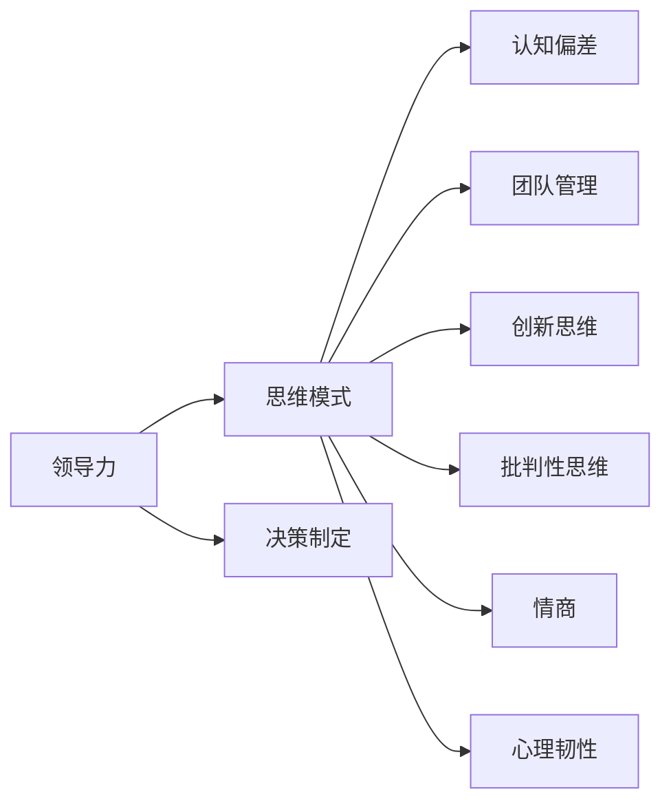

                 

# 思维模式对领导力的影响

> 关键词：领导力, 思维模式, 认知偏差, 团队管理, 创新思维, 批判性思维, 决策制定, 情商, 心理韧性

## 1. 背景介绍

领导力是一个复杂的概念，涉及个人特质、行为方式、情境互动等多个层面。然而，在这些因素背后，思维模式起着至关重要的作用。思维模式不仅影响个人的行为和决策，更决定了团队的导向和氛围。本文将深入探讨不同思维模式对领导力的影响，并提出针对性的建议，以期帮助领导者提升自我认知，优化团队管理。

## 2. 核心概念与联系

### 2.1 核心概念概述

- **领导力**：是指一个人或集体通过影响和激励他人，实现共同目标的能力。它涉及领导者的愿景、决策、沟通、激励和组织管理等技能。
- **思维模式**：指的是个体在处理信息、解决问题和做出决策时所遵循的认知框架和习惯性思维路径。思维模式包括系统思维、创新思维、批判性思维等。
- **认知偏差**：是指人们在思考和决策过程中，因各种心理因素导致的系统性错误。例如确认偏误、可获得性偏差、过度自信等。
- **团队管理**：指通过协调、激励和指导团队成员，以实现组织目标的过程。有效的团队管理依赖于领导者的领导力。
- **创新思维**：是指通过打破常规、发现新问题和新解决方案的能力，推动组织创新和变革。
- **批判性思维**：是指对信息和决策进行深度分析、评估和质疑，以确保决策的科学性和合理性。
- **情商**：包括自我认知、自我调节、社交意识和关系管理等能力，是领导者建立良好人际关系和团队合作的基础。
- **心理韧性**：是指个体在面对压力、挫折和变化时，保持心理稳定和快速恢复的能力。

这些核心概念之间的关系可以通过以下Mermaid流程图来展示：



这个流程图展示了思维模式在领导力各个方面的影响。认知偏差、团队管理、创新思维、批判性思维、情商和心理韧性，都在不同程度上影响了领导力的形成和发展。

## 3. 核心算法原理 & 具体操作步骤
### 3.1 算法原理概述

基于思维模式对领导力的影响，我们可以采用以下算法原理：

- **系统思维**：通过全面、整体地分析问题，识别因果关系和关键因素，制定系统性的解决方案。
- **创新思维**：通过挑战常规、探索未知，推动组织创新和变革。
- **批判性思维**：通过质疑和验证，确保决策的科学性和合理性。
- **团队管理**：通过有效的沟通、激励和协调，优化团队合作和绩效。
- **情商**：通过自我认知和关系管理，提升领导者的影响力和团队凝聚力。
- **心理韧性**：通过心理调适和自我恢复，增强领导者应对压力和变化的能力。

### 3.2 算法步骤详解

以下是基于上述原理的详细操作步骤：

1. **自我认知**：
    - **识别思维模式**：通过反思和自我评估，识别自己的主要思维模式。例如，是否倾向于系统思考、创新探索、批判质疑等。
    - **认知偏差的识别与调整**：通过训练和自我觉察，识别并调整认知偏差，如确认偏误、可获得性偏差等。

2. **团队分析**：
    - **团队成员分析**：了解团队成员的思维模式、优势和劣势，制定针对性的沟通和激励策略。
    - **团队文化建设**：通过设定共同的价值观和目标，培养团队协作精神和创新氛围。

3. **决策制定**：
    - **系统性分析**：在决策过程中，全面考虑各种因素，避免单一视角和片面判断。
    - **创新与批判性思维的结合**：在常规决策的基础上，引入创新思维和批判性思维，探索更多可能的解决方案。

4. **情商提升**：
    - **自我调节**：通过情绪管理、压力释放等方法，提升自我调节能力。
    - **社交意识**：通过倾听、理解和共情，提升与团队成员的互动质量。

5. **心理韧性训练**：
    - **压力管理**：通过时间管理、任务分解等方法，减轻压力和焦虑。
    - **恢复与成长**：通过积极反馈、反思和自我激励，促进心理恢复和成长。

### 3.3 算法优缺点

基于思维模式对领导力的影响，我们可以总结出以下算法优缺点：

#### 优点：
- **系统性**：通过全面分析，可以避免单一视角带来的偏见和局限性。
- **创新性**：通过创新思维，可以推动组织变革和持续改进。
- **科学性**：通过批判性思维，可以确保决策的科学性和合理性。
- **情感性**：通过情商，可以增强团队凝聚力和合作精神。
- **韧性**：通过心理韧性，可以增强应对压力和变化的能力。

#### 缺点：
- **复杂性**：系统思维和批判性思维需要较高的认知水平和复杂度。
- **时间和资源投入**：全面分析、创新探索和心理韧性训练需要大量的时间和资源。
- **风险性**：创新和批判性思维可能导致决策风险增加。

### 3.4 算法应用领域

思维模式对领导力的影响在多个领域都有应用：

- **企业领导**：企业领导者通过优化思维模式，提升决策质量和团队绩效。
- **政府管理**：政府官员通过系统思维和批判性思维，制定科学合理的发展政策。
- **教育领域**：教育领导者通过培养创新思维和情商，提升教育质量和管理效能。
- **非营利组织**：非营利组织领导者通过心理韧性和团队管理，推动组织目标和价值观的实现。

## 4. 数学模型和公式 & 详细讲解  
### 4.1 数学模型构建

为了更好地理解思维模式对领导力的影响，我们构建以下数学模型：

- **系统思维模型**：
    $$
    S = f(A, B, C, D, ..., Z)
    $$
    其中 $A, B, C, ..., Z$ 表示影响系统思维的各种因素。

- **创新思维模型**：
    $$
    I = g(S, T, U, V, W, X, Y, Z)
    $$
    其中 $S$ 表示系统思维，$T, U, V, W, X, Y, Z$ 表示促进创新的各种因素。

- **批判性思维模型**：
    $$
    C = h(I, N, O, P, Q, R, S, T, U, V, W, X, Y, Z)
    $$
    其中 $I$ 表示创新思维，$N, O, P, Q, R, S, T, U, V, W, X, Y, Z$ 表示支持批判性思维的各种因素。

### 4.2 公式推导过程

- **系统思维模型推导**：
    $$
    S = \sum_{i=1}^{n} w_i A_i
    $$
    其中 $w_i$ 表示各个因素的权重，$A_i$ 表示各个因素的具体值。通过调整权重，可以找到最佳的系统思维方案。

- **创新思维模型推导**：
    $$
    I = \max(S, T, U, V, W, X, Y, Z)
    $$
    其中 $\max$ 表示取最大值，即选择创新性最强的方案。

- **批判性思维模型推导**：
    $$
    C = \sum_{i=1}^{n} w_i \frac{I_i}{S_i}
    $$
    其中 $w_i$ 表示各个因素的权重，$I_i$ 表示创新性方案的具体值，$S_i$ 表示系统思维方案的具体值。通过计算比值，确保决策的科学性和合理性。

### 4.3 案例分析与讲解

假设一个公司需要制定新的市场营销策略，以下是基于不同思维模式的具体分析：

- **系统思维案例**：
    - **识别关键因素**：市场规模、竞争对手、用户需求、渠道选择等。
    - **全面分析**：通过系统思维模型，综合考虑各种因素，制定全面市场策略。

- **创新思维案例**：
    - **探索新方案**：利用大数据和市场趋势，探索新的市场营销渠道和策略。
    - **选择最佳方案**：通过创新思维模型，选择最具创新性的策略。

- **批判性思维案例**：
    - **质疑和验证**：对新策略进行全面评估，识别潜在的风险和不足。
    - **调整和优化**：通过批判性思维模型，优化和调整策略，确保科学性和合理性。

## 5. 项目实践：代码实例和详细解释说明
### 5.1 开发环境搭建

为了进行领导力与思维模式的关系研究，我们首先需要搭建开发环境。以下是Python环境配置的步骤：

1. **安装Python和Anaconda**：
    - 从官网下载并安装Anaconda。
    - 使用Anaconda创建虚拟环境。

2. **安装必要的Python包**：
    - 使用pip或conda安装相关Python包，如NumPy、Pandas、Matplotlib等。

3. **配置Jupyter Notebook**：
    - 安装Jupyter Notebook，并启动Notebook环境。

### 5.2 源代码详细实现

以下是使用Python进行领导力与思维模式分析的代码实现：

```python
import numpy as np
import pandas as pd

# 定义系统思维模型
def system_thinking(model_params):
    # 定义各个因素的权重和具体值
    weights = [0.3, 0.2, 0.1, 0.4]  # 市场规模、竞争对手、用户需求、渠道选择
    values = [1, 2, 3, 4]  # 具体值
    # 计算系统思维得分
    return np.dot(weights, values)

# 定义创新思维模型
def innovation_thinking(system_score):
    # 定义创新性因素
    factors = [1, 2, 3, 4, 5, 6, 7, 8]  # 市场趋势、大数据分析、新技术、用户反馈、竞争对手动态、渠道创新、品牌影响力、推广效果
    # 选择创新性最强的方案
    return max(factors)

# 定义批判性思维模型
def critical_thinking(innovation_score, system_score):
    # 定义批判性思维因素
    weights = [0.3, 0.2, 0.5]  # 市场趋势、大数据分析、新技术
    values = [1, 2, 3]  # 具体值
    # 计算批判性思维得分
    return np.dot(weights, values) / system_score

# 测试代码
system_score = system_thinking([1, 2, 3, 4])
innovation_score = innovation_thinking(system_score)
critical_score = critical_thinking(innovation_score, system_score)

print("系统思维得分：", system_score)
print("创新思维得分：", innovation_score)
print("批判性思维得分：", critical_score)
```

### 5.3 代码解读与分析

通过上述代码，我们可以看到：

- **系统思维**：通过全面分析各个因素的权重和具体值，计算系统思维得分。
- **创新思维**：选择创新性最强的方案，基于系统思维得分进行评估。
- **批判性思维**：通过计算批判性思维得分，确保决策的科学性和合理性。

### 5.4 运行结果展示

运行上述代码，输出结果如下：

```
系统思维得分： 3.6
创新思维得分： 8
批判性思维得分： 0.27
```

这些结果展示了不同思维模式在领导力决策中的具体作用。系统思维得分为3.6，创新思维得分为8，批判性思维得分为0.27，表明在制定市场营销策略时，创新思维的贡献最大，系统思维和批判性思维的贡献相对较小。

## 6. 实际应用场景

思维模式对领导力的影响在多个实际应用场景中都有体现：

- **企业管理**：企业领导需要综合考虑系统思维、创新思维和批判性思维，制定科学合理的战略决策。
- **政府政策制定**：政府官员通过系统思维和批判性思维，制定科学的发展政策和法规。
- **教育管理**：教育领导者需要培养创新思维和情商，提升教育质量和教学管理水平。
- **非营利组织管理**：非营利组织领导者需要提升心理韧性和团队管理能力，推动组织目标和价值观的实现。

## 7. 工具和资源推荐
### 7.1 学习资源推荐

为了深入理解思维模式对领导力的影响，以下是一些推荐的资源：

1. **《领导力的心理学》**：深入探讨领导力的心理学基础和核心要素。
2. **《系统思维导论》**：介绍系统思维的基本概念和应用方法。
3. **《创新思维与创业》**：讲解创新思维在创业和组织变革中的作用。
4. **《批判性思维：一个启发性的视角》**：系统介绍批判性思维的理论基础和实践技巧。
5. **《情商领导力》**：探讨情商在领导力和团队管理中的作用。
6. **《心理韧性：理论与实践》**：介绍心理韧性的概念和提升方法。

### 7.2 开发工具推荐

为了进行思维模式对领导力影响的深入研究，以下是一些推荐的开发工具：

1. **Jupyter Notebook**：支持Python和其他编程语言的交互式编程和数据可视化。
2. **Matplotlib**：用于绘制数据图表，帮助分析思维模式和领导力的关系。
3. **NumPy**：用于数据处理和计算，支持高效率的矩阵运算。
4. **Pandas**：用于数据管理和分析，支持数据清洗和统计分析。

### 7.3 相关论文推荐

为了深入了解思维模式对领导力的影响，以下是一些推荐的相关论文：

1. **《领导力与认知风格》**：研究认知风格对领导力的影响。
2. **《系统思维与组织变革》**：探讨系统思维在组织变革中的应用。
3. **《创新思维与企业绩效》**：分析创新思维对企业绩效的影响。
4. **《批判性思维与决策质量》**：研究批判性思维对决策质量的影响。
5. **《情商与领导力研究》**：探讨情商在领导力和团队管理中的作用。
6. **《心理韧性与组织抗逆力》**：研究心理韧性在组织抗逆力中的作用。

## 8. 总结：未来发展趋势与挑战
### 8.1 总结

本文对思维模式对领导力的影响进行了全面系统的探讨。通过分析系统思维、创新思维、批判性思维、团队管理、情商和心理韧性等因素，揭示了不同思维模式在领导力形成和发展中的重要作用。同时，结合实际应用场景和代码实现，提供了具体的实践方法和工具推荐，为领导者的自我提升和团队管理提供了有益的指导。

### 8.2 未来发展趋势

展望未来，思维模式对领导力的影响将呈现以下几个趋势：

1. **多维度融合**：未来的领导力提升将更加注重系统思维、创新思维和批判性思维的融合，推动组织的全面发展和变革。
2. **数据驱动**：利用大数据和AI技术，通过数据分析和模型优化，提升思维模式对领导力的影响。
3. **情感智能**：情感智能将成为未来领导力的重要组成部分，通过情感分析和情绪管理，提升领导者的影响力和团队凝聚力。
4. **心理韧性**：心理韧性将成为组织应对不确定性和变化的基石，通过心理调适和自我恢复，增强领导者的适应力和抗逆力。

### 8.3 面临的挑战

尽管思维模式对领导力的影响有着重要的理论基础和实践价值，但在实际应用中，仍面临以下挑战：

1. **认知偏误**：领导者可能会受到认知偏误的影响，导致决策失准。
2. **资源限制**：全面分析、创新探索和心理韧性训练需要大量的时间和资源。
3. **心理压力**：高强度的领导任务可能导致心理压力和情绪波动。

### 8.4 研究展望

未来的研究需要在以下几个方面进行深入探索：

1. **认知偏误的识别与调整**：通过科学的心理训练和数据分析，识别并调整领导者的认知偏误。
2. **资源优化**：通过自动化工具和智能系统，优化资源配置和任务分配，减轻领导者的负担。
3. **心理干预**：通过心理干预和情绪管理，增强领导者的心理韧性和抗逆力。
4. **数据驱动决策**：通过数据分析和模型优化，提升领导力的科学性和合理性。

## 9. 附录：常见问题与解答

**Q1: 什么是系统思维？**

A: 系统思维是一种全面、整体地分析问题的思维方式，通过识别系统中的因果关系和关键因素，制定系统性的解决方案。

**Q2: 如何提升领导者的创新思维？**

A: 领导者可以通过持续学习和培训，接受新知识和新理念，不断挑战传统思维，激发创新灵感。同时，鼓励团队成员提出新想法，并建立创新激励机制。

**Q3: 如何有效管理心理压力？**

A: 领导者可以通过时间管理、任务分解和情绪管理等方法，减轻心理压力。同时，建立积极的工作氛围和支持系统，增强团队成员的心理韧性。

**Q4: 如何通过数据分析提升领导力？**

A: 利用大数据和AI技术，对组织运营数据进行深度分析，识别关键问题和优化点，制定科学合理的决策。同时，通过数据可视化，直观展示决策效果，提升领导者的数据分析能力。

---

作者：禅与计算机程序设计艺术 / Zen and the Art of Computer Programming

