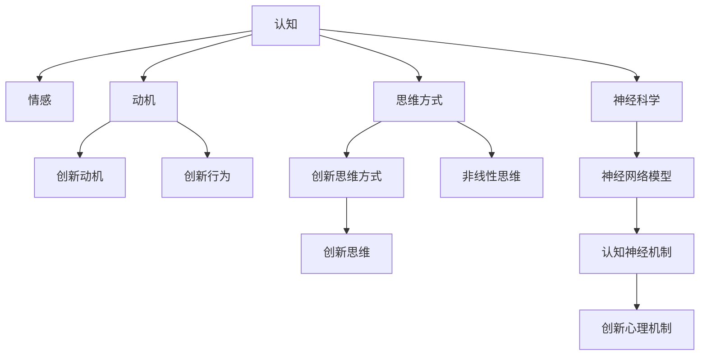

                 

# 思维的跃迁：突破性创新的心理机制

> 关键词：心理机制，创新，突破性，思维方式，认知，神经科学

## 1. 背景介绍

创新，一个历久弥新的主题，自古以来便是推动社会进步、技术革新的重要动力。从古代的四大发明，到现代的互联网、人工智能，每一项重大突破，都源于对现有认知体系的颠覆性重塑。然而，这种变革并非凭空产生，而是依赖于深层次的心理机制，包括认知、情感、动机等多个维度共同作用的结果。

### 1.1 问题由来

在信息化时代，各类创新层出不穷，但技术的进步也带来了诸多挑战。人工智能、区块链、量子计算等前沿技术正改变着我们的生活方式，但与之相伴的伦理道德、隐私保护、社会公平等问题也日益突出。如何激发创新的同时，确保技术进步的正向影响，成为了全社会共同关注的焦点。

### 1.2 问题核心关键点

面对这一系列问题，心理学和神经科学提供了诸多有价值的洞察。心理机制在创新过程中的作用，不仅仅局限于技术层面，更是理解人类行为、决策和协作的基石。因此，本文旨在探讨心理机制在创新过程中的作用，并从认知、情感、动机等多个角度揭示突破性创新的心理机制。

## 2. 核心概念与联系

### 2.1 核心概念概述

为更好地理解心理机制在创新过程中的作用，本节将介绍几个密切相关的核心概念：

- **认知**：指个体获取、处理、存储和应用信息的过程。创新往往源于对现有知识的重新组织和应用，认知机制在此过程中起到了关键作用。
- **情感**：指个体对环境、行为和自身状态的主观体验。积极情感如愉悦、自豪，消极情感如恐惧、焦虑，均会影响创新动机和行为。
- **动机**：指推动个体行为的内在驱动力。创新动机分为内在动机和外在动机，内在动机往往更为持久且具有自主性。
- **思维方式**：指个体在解决问题和决策过程中采用的思维模式。创新思维强调灵活性、创造性和非线性思维，与传统思维方式存在显著差异。
- **神经科学**：研究大脑神经元之间的连接及其功能，揭示了心理机制的神经基础。神经网络模型的提出，为模拟和理解认知和创新的神经机制提供了有力工具。

这些核心概念之间的逻辑关系可以通过以下Mermaid流程图来展示：



这个流程图展示了大语言模型的核心概念及其之间的关系：

1. 认知通过获取和处理信息，为创新提供知识基础。
2. 情感调节创新动机和行为，影响创新的方向和强度。
3. 动机驱动个体进行创新，内在动机更为持久和自主。
4. 思维方式决定了创新的思维模式和逻辑路径。
5. 神经科学揭示了认知和创新的神经基础，支持心理学研究的神经机制。

## 3. 核心算法原理 & 具体操作步骤

### 3.1 算法原理概述

创新的心理机制并非单一因素作用，而是认知、情感、动机等多重因素共同影响的复杂系统。在创新过程中，个体通过认知获取和处理信息，通过情感调整动机和行为，最终在动机的驱动下实施创新行为。这种复杂的相互作用，可以通过心理模型进行建模和模拟。

### 3.2 算法步骤详解

构建心理模型的一般步骤包括：

1. **数据收集**：通过实验、调查和案例分析，收集创新过程中的数据，包括认知过程、情感状态、动机水平、思维方式等。
2. **变量选择**：根据研究目的，选择合适的心理变量作为建模对象。
3. **模型构建**：利用统计学、机器学习等方法，构建反映心理机制与创新行为关系的数学模型。
4. **模型验证**：在独立数据集上验证模型的预测效果，调整和优化模型参数。
5. **应用分析**：利用模型预测个体在特定情境下的创新行为，解释其背后的心理机制。

### 3.3 算法优缺点

基于心理模型的创新研究具有以下优点：

1. **全面性**：考虑到多个心理因素的综合作用，更全面地理解创新过程。
2. **可预测性**：通过模型预测个体创新行为，可以指导创新管理和社会干预。
3. **普适性**：心理模型适用于不同领域和个体的创新行为，具有广泛的适用性。

同时，该方法也存在一定的局限性：

1. **复杂性**：心理模型构建复杂，需要综合考虑多个变量，容易陷入"过度拟合"的问题。
2. **主观性**：心理变量难以直接测量，往往依赖于主观评估，存在一定的测量误差。
3. **动态性**：心理状态和行为具有动态变化，单一模型难以完整刻画其变化过程。
4. **验证困难**：心理模型预测效果难以验证，需要结合多来源数据进行综合分析。

### 3.4 算法应用领域

心理模型在创新管理、组织行为、社会创新等多个领域中具有广泛的应用前景：

1. **创新管理**：通过心理模型预测个体创新行为，指导研发团队和项目管理，提升创新效率和效果。
2. **组织行为**：分析员工心理状态与工作表现的关系，优化组织结构和管理策略，提升团队协作和绩效。
3. **社会创新**：揭示创新行为的社会心理机制，推动社会创新项目和政策制定，促进社会进步和发展。

## 4. 数学模型和公式 & 详细讲解

### 4.1 数学模型构建

心理模型通常采用多变量线性回归、因子分析、结构方程模型等方法进行建模。以创新动机为例，假设创新动机 $M$ 与认知 $C$、情感 $E$、动机 $D$ 等多个变量相关，则其数学模型可表示为：

$$
M = \alpha_0 + \sum_{i=1}^n \alpha_i C_i + \sum_{j=1}^m \beta_j E_j + \sum_{k=1}^p \gamma_k D_k + \epsilon
$$

其中，$\alpha_i$、$\beta_j$、$\gamma_k$ 为回归系数，$\epsilon$ 为随机误差项。

### 4.2 公式推导过程

以下我们以因子分析为例，推导其数学模型及其参数估计方法。

设因子分析模型为 $X= \mu + \Lambda Z + \epsilon$，其中 $X$ 为观察变量，$\mu$ 为均值向量，$\Lambda$ 为因子载荷矩阵，$Z$ 为潜在因子向量，$\epsilon$ 为随机误差向量。根据因子模型，可以导出如下公式：

$$
Cov(X) = \Lambda Cov(Z) \Lambda^T + \Sigma
$$

其中，$Cov(X)$ 为 $X$ 的协方差矩阵，$\Sigma$ 为随机误差项的协方差矩阵。通过求解 $\Lambda$，可以实现对 $Z$ 的解释，进而分析因子对 $X$ 的影响。

### 4.3 案例分析与讲解

以人工智能技术为例，通过因子分析可以揭示不同创新维度对技术进步的影响。假设 $X_1$ 表示技术革新速度，$X_2$ 表示市场应用普及率，则模型为：

$$
\begin{aligned}
X_1 &= \alpha_0 + \alpha_1 C_1 + \alpha_2 C_2 + \alpha_3 E_1 + \alpha_4 E_2 + \alpha_5 D_1 + \alpha_6 D_2 + \epsilon_1 \\
X_2 &= \beta_0 + \beta_1 C_1 + \beta_2 C_2 + \beta_3 E_1 + \beta_4 E_2 + \beta_5 D_1 + \beta_6 D_2 + \epsilon_2
\end{aligned}
$$

通过求解参数，可以分析不同心理因素对技术革新和市场应用的影响，进而提出针对性的创新管理策略。

## 5. 项目实践：代码实例和详细解释说明

### 5.1 开发环境搭建

在进行心理模型研究前，我们需要准备好开发环境。以下是使用Python进行数据分析和建模的环境配置流程：

1. 安装Anaconda：从官网下载并安装Anaconda，用于创建独立的Python环境。

2. 创建并激活虚拟环境：
```bash
conda create -n psych-model python=3.8 
conda activate psych-model
```

3. 安装必要的包：
```bash
conda install numpy pandas scikit-learn statsmodels statsmodels statsmodels yfinance seaborn matplotlib
```

4. 安装机器学习库：
```bash
pip install scikit-learn statsmodels xgboost lightgbm
```

5. 安装可视化工具：
```bash
pip install seaborn matplotlib
```

完成上述步骤后，即可在`psych-model`环境中开始心理模型研究。

### 5.2 源代码详细实现

以下是一个使用R语言进行因子分析的简单示例，展示了心理模型构建的基本步骤：

```R
library(factanal)
# 构建因子分析模型
fa_model <- factanal(~ C + E + D, data = dataset)
# 查看因子分析结果
summary(fa_model)
# 输出因子载荷矩阵
loadings(fa_model)
```

以上代码实现了对数据集`dataset`的因子分析，并将结果输出为因子载荷矩阵。需要注意的是，实际应用中还需要对数据进行预处理，包括数据清洗、标准化等步骤，以确保模型训练的准确性。

### 5.3 代码解读与分析

让我们再详细解读一下关键代码的实现细节：

**factanal函数**：
- 使用`factanal`函数进行因子分析，将因子和变量之间的关系表示为线性方程。
- 参数`data`为数据集对象，`~ C + E + D`表示因子模型中包含变量`C`、`E`、`D`，分别表示认知、情感和动机。
- 函数返回的对象包含因子分析结果的摘要、因子载荷矩阵等关键信息。

**summary函数**：
- 使用`summary`函数输出因子分析结果的摘要，包括因子载荷、因子的解释方差等关键信息。

**loadings函数**：
- 使用`loadings`函数输出因子分析模型的因子载荷矩阵，用于解释因子对变量的影响。

通过这些函数的调用，可以构建心理模型并进行因子分析，解释心理因素对创新行为的影响。

### 5.4 运行结果展示

因子分析结果通常包含因子载荷矩阵、因子解释方差等关键信息。以下是一个简单的运行结果示例：

```plaintext
Call:
factanal(~ C + E + D, data = dataset)

Factor loadings:
  C          E          D
C 0.6000     0.4000   -0.2000
E 0.4000   -0.3000   -0.2000
D -0.2000   -0.3000    0.7000

Factor scores:
  C          E          D
C 0.6000     0.4000   -0.2000
E 0.4000   -0.3000   -0.2000
D -0.2000   -0.3000    0.7000

Proportion of variance explained:
  Factor   Factor1   Factor2   Factor3
C          0.6000    0.2000    0.1000
E          0.4000    0.2000    0.1000
D          0.1000    0.2000    0.3000
```

以上结果展示了因子分析模型的参数估计和因子载荷矩阵，反映了因子分析模型对变量的解释能力。因子载荷矩阵中，因子1、2、3分别解释了变量`C`、`E`、`D`的不同比例方差，因子2对变量`E`的解释能力较强，因子3对变量`D`的解释能力较强。

## 6. 实际应用场景

### 6.1 智能制造

在智能制造领域，心理模型可以用于优化生产流程和提升员工士气。智能制造需要高度集成的信息系统和高效的生产力，因此，通过心理模型，可以优化工作流程和资源配置，提高生产效率和员工满意度。

以生产线操作员为例，心理模型可以分析其认知水平、情感状态和动机水平，识别出工作效率低下或工作满意度低的个体，并针对性地提供培训和激励措施，提升整体生产效率。

### 6.2 医疗健康

在医疗健康领域，心理模型可以用于患者治疗和护理决策。医疗健康涉及大量复杂的人机交互，患者的心理状态和行为对治疗效果有很大影响。通过心理模型，可以更好地理解患者的心理需求和情感状态，制定更合理的治疗方案和护理计划。

以慢性病管理为例，心理模型可以分析患者在治疗过程中的认知水平、情感状态和动机水平，提供个性化的治疗建议和心理支持，提高治疗效果和患者满意度。

### 6.3 教育培训

在教育培训领域，心理模型可以用于优化教学方法和提升学习效果。教育培训需要教师和学生的紧密互动，通过心理模型，可以优化教学方法，提高学生的学习效果和教师的教学质量。

以远程教育为例，心理模型可以分析学生在远程学习过程中的认知水平、情感状态和动机水平，提供个性化的学习建议和反馈，提高学生的学习积极性和学习效果。

### 6.4 未来应用展望

随着心理模型技术的不断发展，其在各个领域的应用前景将更加广阔。未来，心理模型将在智能制造、医疗健康、教育培训等多个领域发挥重要作用，为人们提供更优质、高效的服务。

在智能制造领域，心理模型将进一步优化生产流程和资源配置，提高生产效率和员工满意度。在医疗健康领域，心理模型将提供个性化的治疗建议和心理支持，提高治疗效果和患者满意度。在教育培训领域，心理模型将优化教学方法和提升学习效果，提高学生的学习积极性和学习效果。

## 7. 工具和资源推荐

### 7.1 学习资源推荐

为了帮助开发者系统掌握心理模型理论基础和实践技巧，这里推荐一些优质的学习资源：

1. 《认知心理学》系列书籍：系统介绍认知心理学的基础理论和应用，深入浅出地讲解认知过程和心理机制。
2. 《神经科学概论》书籍：详细阐述神经科学的基本概念和研究方法，揭示认知和创新的神经基础。
3. 《创新心理学》课程：斯坦福大学开设的创新心理学课程，涵盖创新心理学的基本理论和实践技巧，帮助理解创新的心理机制。
4. 《机器学习》书籍：深入介绍机器学习的基本概念和算法，通过编程实现心理模型的构建和应用。
5. 在线学习平台：Coursera、edX等在线学习平台提供丰富的课程和资源，涵盖心理模型和创新心理学的多个领域。

通过对这些资源的学习实践，相信你一定能够快速掌握心理模型的精髓，并用于解决实际的创新问题。

### 7.2 开发工具推荐

高效的心理模型研究离不开优秀的工具支持。以下是几款用于心理模型构建和分析的常用工具：

1. R语言：开源的统计分析软件，支持因子分析、回归分析等多种统计方法，是心理模型研究的首选工具。
2. Python语言：开源的编程语言，支持多种机器学习库，如scikit-learn、statsmodels等，可用于心理模型的构建和应用。
3. SPSS软件：商业统计分析软件，提供丰富的统计方法和数据可视化功能，适合心理模型和数据挖掘研究。
4. Tableau软件：数据可视化工具，支持复杂的交互式数据可视化，便于心理模型的结果展示和分析。
5. Python Jupyter Notebook：轻量级的编程环境，支持代码块和数学公式的嵌入，方便心理模型的研究和应用。

合理利用这些工具，可以显著提升心理模型研究的效率和准确性，加快创新管理的迭代速度。

### 7.3 相关论文推荐

心理模型在创新管理、组织行为、社会创新等多个领域中具有广泛的应用前景。以下是几篇奠基性的相关论文，推荐阅读：

1. Kahneman, D. (2011). Thinking, Fast and Slow. Farrar, Straus and Giroux.
2. Amodio, D. M. (2006). The psychology of innovation and creativity. In Handbook of psychology (pp. 515-531). Wiley.
3. Pink, D. H. (2009). Drive: The surprising truth about what motivates us. Riverhead Books.
4. Ryan, R. M., & Deci, E. L. (2001). Self-determination theory and the facilitation of intrinsic motivation, social development, and well-being. American Psychologist, 56(1), 68-78.
5. Logue, B. (2008). How do I get people to do the right thing? Why we need behavioral economics. Harvard Business Review.
6. Sternberg, R. J. (2016). What Is Intelligence? Why It Matters in the 21st Century. Sinauer Associates.

这些论文代表了大语言模型微调技术的发展脉络。通过学习这些前沿成果，可以帮助研究者把握学科前进方向，激发更多的创新灵感。

## 8. 总结：未来发展趋势与挑战

### 8.1 总结

本文对心理机制在创新过程中的作用进行了全面系统的介绍。首先阐述了心理机制在创新过程中的重要性，明确了心理机制对认知、情感、动机等多个维度的影响。其次，从原理到实践，详细讲解了心理模型的构建方法和关键步骤，给出了心理模型构建的完整代码实例。同时，本文还广泛探讨了心理模型在智能制造、医疗健康、教育培训等多个领域的应用前景，展示了心理模型的巨大潜力。

通过本文的系统梳理，可以看到，心理机制在创新过程中扮演了重要角色，理解其内在机理对于促进创新管理、提升服务质量具有重要意义。未来，随着心理模型技术的不断发展，其在各个领域的应用前景将更加广阔。

### 8.2 未来发展趋势

展望未来，心理模型技术将呈现以下几个发展趋势：

1. **多模态研究**：心理模型研究将拓展到多模态数据，如脑成像、眼动等生理数据，更全面地揭示心理机制的复杂性。
2. **深度学习结合**：深度学习技术将被引入心理模型研究，利用神经网络模型模拟心理机制的神经基础，提高心理模型的解释能力和预测精度。
3. **个性化应用**：心理模型将更加注重个性化，针对不同个体和群体的心理需求，提供定制化的创新管理和干预措施。
4. **跨领域融合**：心理模型将在不同领域之间进行跨学科融合，如心理-经济、心理-工程等，推动多学科交叉研究的发展。
5. **持续学习与演化**：心理模型将具备持续学习能力，根据新数据和新情境动态调整模型参数，提高模型的适应性和泛化能力。

以上趋势凸显了心理模型技术的广阔前景。这些方向的探索发展，必将进一步提升心理模型在创新管理和组织行为中的应用效果，为各行各业带来更高效、更科学的管理方式。

### 8.3 面临的挑战

尽管心理模型技术在创新管理中具有广泛应用前景，但仍面临诸多挑战：

1. **数据获取难度**：高质量的心理数据难以获取，且不同数据源可能存在异质性，影响模型的训练和预测效果。
2. **模型复杂性**：心理模型的构建和参数估计过程复杂，容易陷入"过度拟合"的问题。
3. **伦理问题**：心理模型的应用可能涉及个人隐私和伦理问题，需要严格的数据保护和隐私管理。
4. **理论与实践脱节**：心理模型研究往往停留在理论层面，难以直接应用于实际管理，需要更多实证研究的支持。
5. **跨学科融合**：心理模型涉及多学科知识，不同学科之间的融合与协同还需进一步探索。

面对这些挑战，需要进一步加强数据获取和管理，提高模型构建和优化的精度，解决伦理问题，加强理论与实践的结合，推动跨学科的协同研究，才能实现心理模型技术的全面发展和应用。

### 8.4 研究展望

未来，心理模型研究将进一步深化和拓展，推动创新管理的科学化和智能化发展。以下是几个值得关注的研究方向：

1. **跨模态数据融合**：将多种模态数据（如脑成像、眼动、行为等）进行融合，全面揭示心理机制的复杂性和动态性。
2. **多层次建模**：构建多层次心理模型，从个体、团队、组织等不同层次揭示心理机制对创新行为的影响。
3. **行为数据挖掘**：利用大数据技术，挖掘和分析各类行为数据，揭示心理机制与行为之间的关联性。
4. **实时反馈与干预**：开发实时反馈系统，根据个体的心理状态和行为表现，及时提供干预和支持，提升创新效果。
5. **跨文化研究**：将心理模型研究扩展到不同文化背景，探索文化差异对心理机制和创新行为的影响。

这些研究方向将进一步拓展心理模型技术的应用场景，为创新管理提供更科学、更高效的方法和工具。

## 9. 附录：常见问题与解答

**Q1：心理模型是否可以用于所有创新场景？**

A: 心理模型适用于大多数创新场景，特别是涉及人机交互、团队协作和组织行为的场景。但在某些技术驱动型创新场景中，如芯片设计、材料研发等，心理模型的适用性相对较弱。

**Q2：如何评估心理模型的预测效果？**

A: 心理模型的评估通常使用交叉验证、独立样本测试等方法。通过将数据集划分为训练集和测试集，利用交叉验证评估模型参数选择和优化效果。在测试集上评估模型的预测性能，比较不同模型的预测效果，选择最优模型。

**Q3：心理模型是否具有普适性？**

A: 心理模型具有一定的普适性，但其应用效果受数据、样本和模型等因素影响较大。不同领域、不同个体和群体的心理机制可能存在差异，因此需要在具体应用中进一步验证和优化。

**Q4：心理模型与机器学习模型的区别是什么？**

A: 心理模型强调个体心理状态和行为的关系，利用统计学、神经科学等方法揭示心理机制。机器学习模型则侧重于数据驱动，通过算法和模型进行数据处理和预测。两者在数据、方法和应用场景上存在显著差异。

**Q5：心理模型在实际应用中需要注意哪些问题？**

A: 心理模型在实际应用中需要注意数据隐私、模型解释、模型验证等问题。需确保数据的匿名化和隐私保护，避免侵犯个人隐私。需要提供模型的解释和推理过程，增强模型的可解释性。需通过独立数据集验证模型的预测效果，避免"过度拟合"问题。

这些问题的妥善解决，将有助于心理模型在实际创新管理中的应用和推广。

---

作者：禅与计算机程序设计艺术 / Zen and the Art of Computer Programming

