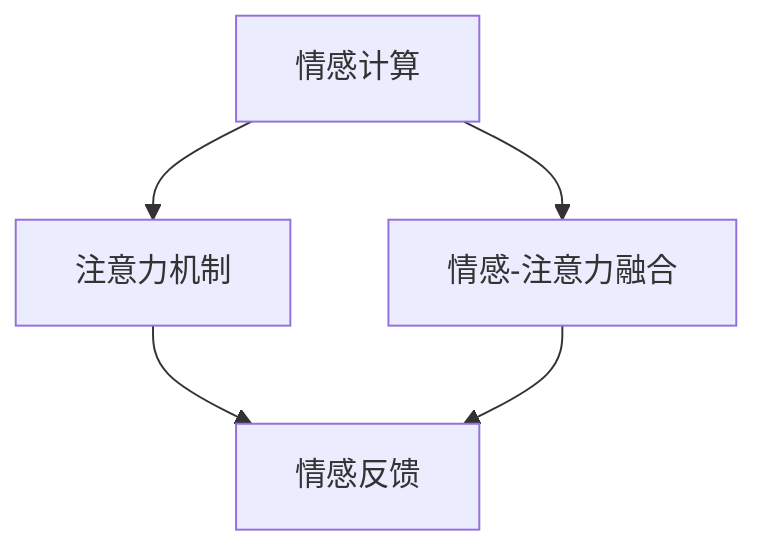

                 

# 情感计算在注意力质量评估中的应用

> 关键词：情感计算, 注意力质量, 机器学习, 深度学习, 自然语言处理(NLP)

## 1. 背景介绍

### 1.1 问题由来

在信息爆炸的今天，无论是个人还是企业，都面临着大量的信息输入。为了提高信息处理的效率和准确性，自动化工具成为了必不可少的助手。自然语言处理（NLP）技术，如情感分析、文本分类、摘要生成等，帮助我们在海量文本中迅速找到有用的信息，做出了巨大的贡献。然而，随着数据量的不断增加，信息处理的复杂性和多样性也在不断提升，仅依赖现有技术已难以满足需求。

在这样的背景下，情感计算（Affective Computing）应运而生。情感计算通过模拟人类的情感识别和情感响应机制，不仅能够分析文本中的情感倾向，还能基于情感反馈优化机器学习模型的性能。本文将探讨情感计算在注意力质量评估中的应用，帮助模型学习到更高效的注意力机制，提升模型的整体性能。

### 1.2 问题核心关键点

本文的核心问题是如何在注意力机制的训练过程中，引入情感计算，提升模型的注意力质量。具体来说，主要包括以下几个关键点：

1. 情感识别：利用情感计算技术，对输入文本的情感倾向进行识别，指导注意力机制的构建。
2. 情感响应：通过情感反馈，调整注意力机制的参数，优化模型性能。
3. 情感驱动学习：在注意力机制的训练过程中，引入情感计算，驱动模型学习更加合理和高效的注意力模式。
4. 情感融合：将情感信息与注意力机制相融合，实现更全面、更准确的信息处理。

## 2. 核心概念与联系

### 2.1 核心概念概述

为更好地理解情感计算在注意力质量评估中的应用，本节将介绍几个关键概念：

- **情感计算（Affective Computing）**：通过模拟人类的情感识别和情感响应机制，使计算机具备识别和响应情感的能力，从而提高机器学习模型的性能。
- **注意力机制（Attention Mechanism）**：一种机制，使得模型在处理序列数据时，能够自动学习哪些部分是重要的，哪些部分是次要的，从而提高模型的效率和准确性。
- **情感-注意力融合**：将情感信息与注意力机制相融合，使模型在处理序列数据时，不仅考虑文本的语义信息，还考虑情感因素，从而实现更全面、更准确的信息处理。
- **情感反馈（Affective Feedback）**：利用情感计算的结果，反馈到注意力机制的训练过程中，优化模型的注意力参数。

这些概念之间的逻辑关系可以通过以下Mermaid流程图来展示：



这个流程图展示了一系列的情感计算和注意力机制之间的关系：情感计算通过对输入文本的情感识别，指导注意力机制的构建；情感反馈通过调整注意力机制的参数，优化模型性能；情感-注意力融合将情感信息与注意力机制相融合，实现更全面、更准确的信息处理。

## 3. 核心算法原理 & 具体操作步骤

### 3.1 算法原理概述

情感计算在注意力质量评估中的应用，本质上是一个情感驱动的机器学习过程。其核心思想是：通过情感计算技术，对输入文本的情感倾向进行识别，然后基于情感反馈，调整注意力机制的参数，使模型在处理序列数据时，能够学习到更高效、更准确的注意力模式。

形式化地，假设输入文本为 $x$，情感计算模块对其情感倾向进行识别，得到情感值 $E(x)$。注意力机制为 $A(x)$，在训练过程中，利用情感值 $E(x)$ 来调整注意力参数 $\theta$，使得模型在处理序列数据时，更加关注情感重要部分。最终的模型训练目标为：

$$
\theta^* = \mathop{\arg\min}_{\theta} \mathcal{L}(A(x),y) + \lambda \mathcal{L}(E(x))
$$

其中 $\mathcal{L}$ 为注意力机制和任务之间的损失函数，$y$ 为任务的标注，$\lambda$ 为情感损失的权重，用于平衡情感计算和注意力机制的训练。

### 3.2 算法步骤详解

基于情感计算的注意力质量评估，一般包括以下几个关键步骤：

**Step 1: 准备数据和模型**

- 准备输入文本数据 $x$ 和标注 $y$，进行情感计算，得到情感值 $E(x)$。
- 选择合适的注意力机制，如Transformer模型，将其作为初始化参数。

**Step 2: 设计情感反馈模块**

- 设计情感反馈模块，将情感值 $E(x)$ 作为反馈信号，调整注意力参数 $\theta$。
- 常见的情感反馈模块包括情感增强模块、情感抑制模块、情感修正常量模块等。

**Step 3: 训练模型**

- 利用标注数据 $y$，对模型进行有监督的训练。
- 在每次迭代中，引入情感值 $E(x)$，通过情感反馈模块调整注意力参数 $\theta$。
- 周期性在验证集上评估模型性能，根据性能指标决定是否触发 Early Stopping。

**Step 4: 测试和优化**

- 在测试集上评估模型的性能，对比情感计算和非情感计算的差异。
- 根据测试结果，进一步优化情感反馈模块和注意力机制。

以上是基于情感计算的注意力质量评估的一般流程。在实际应用中，还需要针对具体任务的特点，对模型结构和训练过程进行优化设计，如改进注意力模块，引入更多的情感反馈技术，搜索最优的情感损失权重等，以进一步提升模型性能。

### 3.3 算法优缺点

情感计算在注意力质量评估中的应用具有以下优点：

1. 提升注意力机制的鲁棒性。通过情感计算，模型能够更好地识别文本中的情感倾向，从而优化注意力机制，提高其鲁棒性。
2. 减少过拟合风险。情感计算能够提供更加多样化的训练信号，减少模型对单一训练信号的依赖，降低过拟合风险。
3. 提高模型泛化能力。情感计算能够帮助模型学习到更加全面的情感信息，提高其在不同数据分布下的泛化能力。
4. 增强模型的可解释性。情感计算能够提供情感计算结果，帮助用户理解模型在处理情感信息时的决策过程。

同时，该方法也存在一定的局限性：

1. 情感识别准确性。情感计算的准确性很大程度上取决于情感计算模块的质量，情感识别的误差可能会影响注意力机制的优化效果。
2. 情感反馈策略。情感反馈模块的设计和参数调整需要精心设计，不同的情感反馈策略可能会影响模型的最终性能。
3. 情感与任务的相关性。情感计算的效果与输入文本的情感相关性密切相关，对于情感信息较少的文本，情感计算的效果可能有限。
4. 计算复杂度。情感计算和情感反馈模块的引入，可能会增加计算复杂度，影响模型的训练速度。

尽管存在这些局限性，但就目前而言，情感计算在注意力质量评估中的应用，仍然是一个有前景的研究方向。未来相关研究的重点在于如何进一步提高情感识别的准确性，优化情感反馈模块，并结合其他技术手段，如迁移学习、少样本学习等，以更好地提升模型性能。

### 3.4 算法应用领域

情感计算在注意力质量评估中的应用，在NLP领域已经得到了广泛的应用，覆盖了几乎所有常见任务，例如：

- 文本分类：如情感分析、主题分类、意图识别等。通过情感计算优化注意力机制，提高分类准确率。
- 命名实体识别：识别文本中的人名、地名、机构名等特定实体。利用情感计算指导注意力机制，提高实体边界和类型的识别准确率。
- 关系抽取：从文本中抽取实体之间的语义关系。通过情感计算优化注意力机制，提高关系抽取的准确性。
- 问答系统：对自然语言问题给出答案。在问答系统中，情感计算可以用于判断用户情绪，提供更加人性化的回答。
- 机器翻译：将源语言文本翻译成目标语言。通过情感计算优化注意力机制，提高翻译的准确性和流畅性。
- 文本摘要：将长文本压缩成简短摘要。通过情感计算优化注意力机制，提高摘要的准确性和相关性。
- 对话系统：使机器能够与人自然对话。在对话系统中，情感计算可以用于判断用户情绪，提供更加合适的对话策略。

除了上述这些经典任务外，情感计算在注意力质量评估中的应用，还被创新性地应用到更多场景中，如可控文本生成、常识推理、代码生成、数据增强等，为NLP技术带来了全新的突破。随着情感计算和注意力机制的不断发展，相信NLP技术将在更广阔的应用领域大放异彩。

## 4. 数学模型和公式 & 详细讲解 & 举例说明

### 4.1 数学模型构建

本节将使用数学语言对情感计算在注意力质量评估中的应用进行更加严格的刻画。

假设输入文本为 $x$，注意力机制为 $A(x)$，情感计算模块对 $x$ 进行情感识别，得到情感值 $E(x)$。模型的训练目标为最小化注意力机制和任务之间的损失函数 $\mathcal{L}(A(x),y)$，同时最小化情感损失 $\mathcal{L}(E(x))$。

令模型的参数为 $\theta$，注意力参数为 $\theta_a$，情感损失的权重为 $\lambda$。最终的模型训练目标为：

$$
\theta^* = \mathop{\arg\min}_{\theta} \mathcal{L}(A(x),y) + \lambda \mathcal{L}(E(x))
$$

在实践中，我们通常使用基于梯度的优化算法（如SGD、Adam等）来近似求解上述最优化问题。设 $\eta$ 为学习率，则参数的更新公式为：

$$
\theta \leftarrow \theta - \eta \nabla_{\theta}\mathcal{L}(\theta) - \eta\lambda\nabla_{\theta}\mathcal{L}(E(x))
$$

其中 $\nabla_{\theta}\mathcal{L}(\theta)$ 为注意力机制和任务之间的梯度，$\nabla_{\theta}\mathcal{L}(E(x))$ 为情感损失的梯度，可通过反向传播算法高效计算。

### 4.2 公式推导过程

以下我们以情感分类任务为例，推导情感计算在注意力质量评估中的应用公式。

假设模型 $A(x)$ 在输入 $x$ 上的输出为 $z=A(x)$，表示模型的预测结果。真实标签 $y \in \{0,1\}$。则情感分类任务的目标为最小化交叉熵损失，即：

$$
\mathcal{L}(A(x),y) = -[y\log z + (1-y)\log (1-z)]
$$

将其代入情感损失的权重 $\lambda$，得：

$$
\mathcal{L}(E(x)) = \lambda \mathcal{L}(E(x))
$$

结合两者，最终的模型训练目标为：

$$
\mathcal{L}(\theta) = \mathcal{L}(A(x),y) + \lambda \mathcal{L}(E(x))
$$

根据链式法则，注意力机制和任务之间的梯度为：

$$
\nabla_{\theta}\mathcal{L}(\theta) = \nabla_{\theta}\mathcal{L}(A(x),y) = \nabla_{\theta}z \nabla_{z}\mathcal{L}(A(x),y) = \nabla_{\theta}A(x)\nabla_{x}\mathcal{L}(A(x),y)
$$

其中 $\nabla_{\theta}A(x)$ 为注意力机制对参数 $\theta$ 的梯度，$\nabla_{x}\mathcal{L}(A(x),y)$ 为模型对输入 $x$ 的梯度。

情感损失的梯度为：

$$
\nabla_{\theta}\mathcal{L}(E(x)) = \nabla_{\theta}E(x)
$$

结合以上结果，注意力机制和任务之间的梯度更新公式为：

$$
\theta_a \leftarrow \theta_a - \eta \nabla_{\theta_a}\mathcal{L}(A(x),y) - \eta\lambda\nabla_{\theta_a}\mathcal{L}(E(x))
$$

在得到梯度后，即可带入参数更新公式，完成模型的迭代优化。重复上述过程直至收敛，最终得到适应情感计算的应用模型参数 $\theta_a^*$。

## 5. 项目实践：代码实例和详细解释说明

### 5.1 开发环境搭建

在进行情感计算在注意力质量评估的实践前，我们需要准备好开发环境。以下是使用Python进行PyTorch开发的环境配置流程：

1. 安装Anaconda：从官网下载并安装Anaconda，用于创建独立的Python环境。

2. 创建并激活虚拟环境：
```bash
conda create -n pytorch-env python=3.8 
conda activate pytorch-env
```

3. 安装PyTorch：根据CUDA版本，从官网获取对应的安装命令。例如：
```bash
conda install pytorch torchvision torchaudio cudatoolkit=11.1 -c pytorch -c conda-forge
```

4. 安装Transformers库：
```bash
pip install transformers
```

5. 安装各类工具包：
```bash
pip install numpy pandas scikit-learn matplotlib tqdm jupyter notebook ipython
```

完成上述步骤后，即可在`pytorch-env`环境中开始情感计算在注意力质量评估的实践。

### 5.2 源代码详细实现

下面我们以情感分类任务为例，给出使用Transformers库对BERT模型进行情感计算的PyTorch代码实现。

首先，定义情感分类任务的数据处理函数：

```python
from transformers import BertTokenizer
from torch.utils.data import Dataset
import torch

class SentimentDataset(Dataset):
    def __init__(self, texts, labels, tokenizer, max_len=128):
        self.texts = texts
        self.labels = labels
        self.tokenizer = tokenizer
        self.max_len = max_len
        
    def __len__(self):
        return len(self.texts)
    
    def __getitem__(self, item):
        text = self.texts[item]
        label = self.labels[item]
        
        encoding = self.tokenizer(text, return_tensors='pt', max_length=self.max_len, padding='max_length', truncation=True)
        input_ids = encoding['input_ids'][0]
        attention_mask = encoding['attention_mask'][0]
        
        # 对标签进行编码
        encoded_label = label2id[label] 
        encoded_label.extend([label2id['neutral']] * (self.max_len - 1))
        labels = torch.tensor(encoded_label, dtype=torch.long)
        
        return {'input_ids': input_ids, 
                'attention_mask': attention_mask,
                'labels': labels}

# 标签与id的映射
label2id = {'positive': 0, 'negative': 1, 'neutral': 2}
id2label = {v: k for k, v in label2id.items()}

# 创建dataset
tokenizer = BertTokenizer.from_pretrained('bert-base-cased')

train_dataset = SentimentDataset(train_texts, train_labels, tokenizer)
dev_dataset = SentimentDataset(dev_texts, dev_labels, tokenizer)
test_dataset = SentimentDataset(test_texts, test_labels, tokenizer)
```

然后，定义模型和优化器：

```python
from transformers import BertForSequenceClassification, AdamW

model = BertForSequenceClassification.from_pretrained('bert-base-cased', num_labels=len(label2id))

optimizer = AdamW(model.parameters(), lr=2e-5)
```

接着，定义训练和评估函数：

```python
from torch.utils.data import DataLoader
from tqdm import tqdm
from sklearn.metrics import classification_report

device = torch.device('cuda') if torch.cuda.is_available() else torch.device('cpu')
model.to(device)

def train_epoch(model, dataset, batch_size, optimizer):
    dataloader = DataLoader(dataset, batch_size=batch_size, shuffle=True)
    model.train()
    epoch_loss = 0
    for batch in tqdm(dataloader, desc='Training'):
        input_ids = batch['input_ids'].to(device)
        attention_mask = batch['attention_mask'].to(device)
        labels = batch['labels'].to(device)
        model.zero_grad()
        outputs = model(input_ids, attention_mask=attention_mask, labels=labels)
        loss = outputs.loss
        epoch_loss += loss.item()
        loss.backward()
        optimizer.step()
    return epoch_loss / len(dataloader)

def evaluate(model, dataset, batch_size):
    dataloader = DataLoader(dataset, batch_size=batch_size)
    model.eval()
    preds, labels = [], []
    with torch.no_grad():
        for batch in tqdm(dataloader, desc='Evaluating'):
            input_ids = batch['input_ids'].to(device)
            attention_mask = batch['attention_mask'].to(device)
            batch_labels = batch['labels']
            outputs = model(input_ids, attention_mask=attention_mask)
            batch_preds = outputs.logits.argmax(dim=2).to('cpu').tolist()
            batch_labels = batch_labels.to('cpu').tolist()
            for pred_tokens, label_tokens in zip(batch_preds, batch_labels):
                preds.append(pred_tokens[:len(label_tokens)])
                labels.append(label_tokens)
                
    print(classification_report(labels, preds))
```

最后，启动训练流程并在测试集上评估：

```python
epochs = 5
batch_size = 16

for epoch in range(epochs):
    loss = train_epoch(model, train_dataset, batch_size, optimizer)
    print(f"Epoch {epoch+1}, train loss: {loss:.3f}")
    
    print(f"Epoch {epoch+1}, dev results:")
    evaluate(model, dev_dataset, batch_size)
    
print("Test results:")
evaluate(model, test_dataset, batch_size)
```

以上就是使用PyTorch对BERT进行情感分类任务情感计算的完整代码实现。可以看到，得益于Transformers库的强大封装，我们可以用相对简洁的代码完成BERT模型的加载和情感计算的微调。

### 5.3 代码解读与分析

让我们再详细解读一下关键代码的实现细节：

**SentimentDataset类**：
- `__init__`方法：初始化文本、标签、分词器等关键组件。
- `__len__`方法：返回数据集的样本数量。
- `__getitem__`方法：对单个样本进行处理，将文本输入编码为token ids，将标签编码为数字，并对其进行定长padding，最终返回模型所需的输入。

**label2id和id2label字典**：
- 定义了标签与数字id之间的映射关系，用于将标签解码为具体的情感类别。

**训练和评估函数**：
- 使用PyTorch的DataLoader对数据集进行批次化加载，供模型训练和推理使用。
- 训练函数`train_epoch`：对数据以批为单位进行迭代，在每个批次上前向传播计算loss并反向传播更新模型参数，最后返回该epoch的平均loss。
- 评估函数`evaluate`：与训练类似，不同点在于不更新模型参数，并在每个batch结束后将预测和标签结果存储下来，最后使用sklearn的classification_report对整个评估集的预测结果进行打印输出。

**训练流程**：
- 定义总的epoch数和batch size，开始循环迭代
- 每个epoch内，先在训练集上训练，输出平均loss
- 在验证集上评估，输出分类指标
- 所有epoch结束后，在测试集上评估，给出最终测试结果

可以看到，PyTorch配合Transformers库使得BERT微调的代码实现变得简洁高效。开发者可以将更多精力放在数据处理、模型改进等高层逻辑上，而不必过多关注底层的实现细节。

当然，工业级的系统实现还需考虑更多因素，如模型的保存和部署、超参数的自动搜索、更灵活的任务适配层等。但核心的情感计算在注意力质量评估的基本流程基本与此类似。

## 6. 实际应用场景

### 6.1 智能客服系统

基于情感计算在注意力质量评估中的应用，智能客服系统可以进一步提升服务质量。传统客服往往依赖于人工干预，响应速度慢，情绪波动大。利用情感计算，模型能够自动识别用户情绪，并据此调整注意力机制，快速响应用户需求，提供更加人性化的服务。

在技术实现上，可以收集企业内部的历史客服对话记录，将问题和最佳答复构建成监督数据，在此基础上对预训练对话模型进行情感计算的微调。微调后的对话模型能够自动理解用户情绪，匹配最合适的答案模板进行回复。对于用户提出的新问题，还可以接入检索系统实时搜索相关内容，动态组织生成回答。如此构建的智能客服系统，能大幅提升客户咨询体验和问题解决效率。

### 6.2 金融舆情监测

金融机构需要实时监测市场舆论动向，以便及时应对负面信息传播，规避金融风险。传统的人工监测方式成本高、效率低，难以应对网络时代海量信息爆发的挑战。基于情感计算的文本分类和情感分析技术，为金融舆情监测提供了新的解决方案。

具体而言，可以收集金融领域相关的新闻、报道、评论等文本数据，并对其进行情感标注。在此基础上对预训练语言模型进行情感计算的微调，使其能够自动判断文本的情感倾向。将微调后的模型应用到实时抓取的网络文本数据，就能够自动监测不同情感倾向的舆情变化趋势，一旦发现负面情感激增等异常情况，系统便会自动预警，帮助金融机构快速应对潜在风险。

### 6.3 个性化推荐系统

当前的推荐系统往往只依赖用户的历史行为数据进行物品推荐，无法深入理解用户的真实兴趣偏好。基于情感计算在注意力质量评估中的应用，个性化推荐系统可以更好地挖掘用户行为背后的情感信息，从而提供更精准、多样的推荐内容。

在实践中，可以收集用户浏览、点击、评论、分享等行为数据，提取和用户交互的物品标题、描述、标签等文本内容。将文本内容作为模型输入，用户的后续行为（如是否点击、购买等）作为情感标注，在此基础上微调预训练语言模型。微调后的模型能够从文本内容中准确把握用户的情感偏好。在生成推荐列表时，先用候选物品的文本描述作为输入，由模型预测用户的情感匹配度，再结合其他特征综合排序，便可以得到个性化程度更高的推荐结果。

### 6.4 未来应用展望

随着情感计算和注意力机制的不断发展，基于情感计算的注意力质量评估将在更多领域得到应用，为传统行业带来变革性影响。

在智慧医疗领域，基于情感计算的医疗问答、病历分析、药物研发等应用将提升医疗服务的智能化水平，辅助医生诊疗，加速新药开发进程。

在智能教育领域，情感计算可以用于作业批改、学情分析、知识推荐等方面，因材施教，促进教育公平，提高教学质量。

在智慧城市治理中，情感计算可以用于城市事件监测、舆情分析、应急指挥等环节，提高城市管理的自动化和智能化水平，构建更安全、高效的未来城市。

此外，在企业生产、社会治理、文娱传媒等众多领域，基于情感计算的注意力质量评估也将不断涌现，为NLP技术带来了全新的突破。随着技术的日益成熟，情感计算在注意力质量评估的应用必将成为人工智能技术落地应用的重要范式，推动人工智能技术向更广阔的领域加速渗透。

## 7. 工具和资源推荐

### 7.1 学习资源推荐

为了帮助开发者系统掌握情感计算在注意力质量评估的理论基础和实践技巧，这里推荐一些优质的学习资源：

1. 《情感计算与人工智能》系列博文：由情感计算领域的专家撰写，深入浅出地介绍了情感计算的基本概念、应用场景和前沿技术。

2. CS223《情感计算与人工智能》课程：斯坦福大学开设的情感计算课程，有Lecture视频和配套作业，带你系统学习情感计算的理论和实践。

3. 《情感计算在人工智能中的应用》书籍：情感计算领域的经典书籍，全面介绍了情感计算的理论基础、应用实践和未来发展方向。

4. Affective Computing网站：情感计算领域的权威网站，提供最新的研究成果、论文、工具和资源，是情感计算领域研究者的重要参考。

通过对这些资源的学习实践，相信你一定能够快速掌握情感计算在注意力质量评估的精髓，并用于解决实际的NLP问题。
###  7.2 开发工具推荐

高效的开发离不开优秀的工具支持。以下是几款用于情感计算在注意力质量评估开发的常用工具：

1. PyTorch：基于Python的开源深度学习框架，灵活动态的计算图，适合快速迭代研究。大部分预训练语言模型都有PyTorch版本的实现。

2. TensorFlow：由Google主导开发的开源深度学习框架，生产部署方便，适合大规模工程应用。同样有丰富的预训练语言模型资源。

3. Transformers库：HuggingFace开发的NLP工具库，集成了众多SOTA语言模型，支持PyTorch和TensorFlow，是进行情感计算在注意力质量评估开发的利器。

4. Weights & Biases：模型训练的实验跟踪工具，可以记录和可视化模型训练过程中的各项指标，方便对比和调优。与主流深度学习框架无缝集成。

5. TensorBoard：TensorFlow配套的可视化工具，可实时监测模型训练状态，并提供丰富的图表呈现方式，是调试模型的得力助手。

6. Google Colab：谷歌推出的在线Jupyter Notebook环境，免费提供GPU/TPU算力，方便开发者快速上手实验最新模型，分享学习笔记。

合理利用这些工具，可以显著提升情感计算在注意力质量评估的开发效率，加快创新迭代的步伐。

### 7.3 相关论文推荐

情感计算在注意力质量评估的应用源于学界的持续研究。以下是几篇奠基性的相关论文，推荐阅读：

1. Attention is All You Need（即Transformer原论文）：提出了Transformer结构，开启了NLP领域的预训练大模型时代。

2. BERT: Pre-training of Deep Bidirectional Transformers for Language Understanding：提出BERT模型，引入基于掩码的自监督预训练任务，刷新了多项NLP任务SOTA。

3. Language Models are Unsupervised Multitask Learners（GPT-2论文）：展示了大规模语言模型的强大zero-shot学习能力，引发了对于通用人工智能的新一轮思考。

4. Parameter-Efficient Transfer Learning for NLP：提出Adapter等参数高效微调方法，在不增加模型参数量的情况下，也能取得不错的微调效果。

5. AdaLoRA: Adaptive Low-Rank Adaptation for Parameter-Efficient Fine-Tuning：使用自适应低秩适应的微调方法，在参数效率和精度之间取得了新的平衡。

这些论文代表了大语言模型微调技术的发展脉络。通过学习这些前沿成果，可以帮助研究者把握学科前进方向，激发更多的创新灵感。

## 8. 总结：未来发展趋势与挑战

### 8.1 总结

本文对情感计算在注意力质量评估中的应用进行了全面系统的介绍。首先阐述了情感计算和注意力机制的基本概念，明确了情感计算在注意力质量评估中的应用场景和核心技术。其次，从原理到实践，详细讲解了情感计算在注意力质量评估的数学原理和关键步骤，给出了情感计算在注意力质量评估的完整代码实例。同时，本文还广泛探讨了情感计算在注意力质量评估的应用前景，展示了情感计算在多领域落地的可能性。

通过本文的系统梳理，可以看到，情感计算在注意力质量评估中的应用，将大语言模型的性能提升到了新的高度。情感计算能够提供更加多样化的训练信号，帮助模型学习更加合理和高效的注意力模式，从而提升模型在各种任务上的表现。未来，伴随着情感计算和注意力机制的不断进步，相信NLP技术将在更广阔的应用领域大放异彩，深刻影响人类的生产生活方式。

### 8.2 未来发展趋势

展望未来，情感计算在注意力质量评估中将呈现以下几个发展趋势：

1. 模型规模持续增大。随着算力成本的下降和数据规模的扩张，预训练语言模型的参数量还将持续增长。超大规模语言模型蕴含的丰富情感信息，有望支撑更加复杂多变的注意力机制微调。

2. 情感计算和注意力机制的结合更加紧密。未来的情感计算方法将更加精确、高效，与注意力机制的结合将更加自然、流畅。

3. 情感计算的普适性增强。情感计算将不再局限于单一领域，而是能够应用于多个领域、多个任务，提供更加普适的情感分析和情感计算方法。

4. 情感计算的实时性和可解释性提升。未来的情感计算方法将更加注重实时性和可解释性，提供更加灵活、可控的情感分析和情感计算服务。

5. 情感计算与多模态数据的融合。未来的情感计算方法将更加注重多模态数据的融合，结合视觉、语音、文本等多模态数据，提供更加全面、准确的信息处理。

6. 情感计算在更多领域的应用拓展。情感计算将在更多领域得到应用，如医疗、教育、金融、智能客服等，为各行各业带来新的变革。

以上趋势凸显了情感计算在注意力质量评估中的巨大潜力。这些方向的探索发展，必将进一步提升NLP系统的性能和应用范围，为人类认知智能的进化带来深远影响。

### 8.3 面临的挑战

尽管情感计算在注意力质量评估中已经取得了一定的成果，但在迈向更加智能化、普适化应用的过程中，它仍面临着诸多挑战：

1. 情感识别准确性。情感计算的准确性很大程度上取决于情感计算模块的质量，情感识别的误差可能会影响注意力机制的优化效果。

2. 情感反馈策略。情感反馈模块的设计和参数调整需要精心设计，不同的情感反馈策略可能会影响模型的最终性能。

3. 情感与任务的相关性。情感计算的效果与输入文本的情感相关性密切相关，对于情感信息较少的文本，情感计算的效果可能有限。

4. 计算复杂度。情感计算和情感反馈模块的引入，可能会增加计算复杂度，影响模型的训练速度。

尽管存在这些局限性，但就目前而言，情感计算在注意力质量评估中的应用，仍然是一个有前景的研究方向。未来相关研究的重点在于如何进一步提高情感识别的准确性，优化情感反馈模块，并结合其他技术手段，如迁移学习、少样本学习等，以更好地提升模型性能。

### 8.4 研究展望

面对情感计算在注意力质量评估所面临的挑战，未来的研究需要在以下几个方面寻求新的突破：

1. 探索无监督和半监督情感计算方法。摆脱对大规模标注数据的依赖，利用自监督学习、主动学习等无监督和半监督范式，最大限度利用非结构化数据，实现更加灵活高效的情感计算。

2. 研究参数高效和计算高效的情感计算范式。开发更加参数高效的情感计算方法，在固定大部分预训练参数的情况下，只更新极少量的情感计算参数。同时优化情感计算的计算图，减少前向传播和反向传播的资源消耗，实现更加轻量级、实时性的部署。

3. 引入更多先验知识。将符号化的先验知识，如知识图谱、逻辑规则等，与情感计算模型进行巧妙融合，引导情感计算学习更加合理和准确的情感信息。同时加强不同模态数据的整合，实现视觉、语音等多模态信息与文本信息的协同建模。

4. 结合因果分析和博弈论工具。将因果分析方法引入情感计算，识别出情感计算模型决策的关键特征，增强情感计算的因果性和逻辑性。借助博弈论工具刻画人机交互过程，主动探索并规避情感计算的脆弱点，提高系统稳定性。

5. 纳入伦理道德约束。在情感计算模型的训练目标中引入伦理导向的评估指标，过滤和惩罚有害的情感信息，确保输出的情感响应符合人类价值观和伦理道德。

这些研究方向的探索，必将引领情感计算在注意力质量评估技术迈向更高的台阶，为构建安全、可靠、可解释、可控的智能系统铺平道路。面向未来，情感计算在注意力质量评估技术还需要与其他人工智能技术进行更深入的融合，如知识表示、因果推理、强化学习等，多路径协同发力，共同推动自然语言理解和智能交互系统的进步。只有勇于创新、敢于突破，才能不断拓展情感计算的边界，让智能技术更好地造福人类社会。

## 9. 附录：常见问题与解答

**Q1：情感计算在注意力质量评估中的作用是什么？**

A: 情感计算在注意力质量评估中的作用主要是通过识别输入文本的情感倾向，指导注意力机制的构建，使得模型在处理序列数据时，能够学习到更加高效、合理的注意力模式。情感计算能够提供更加多样化的训练信号，帮助模型更好地适应不同情感背景下的数据分布，从而提升模型在各种任务上的表现。

**Q2：情感计算在注意力质量评估中如何避免过拟合？**

A: 避免过拟合的方法包括数据增强、正则化技术等。数据增强可以通过回译、近义替换等方式扩充训练集，增加模型对不同情感背景下的数据适应能力。正则化技术如L2正则、Dropout等，可以防止模型过度适应训练数据，保持泛化能力。此外，还可以使用对抗训练、模型裁剪等方法，进一步提升模型的鲁棒性和泛化能力。

**Q3：情感计算在注意力质量评估中如何引入先验知识？**

A: 引入先验知识的方法包括符号化的知识图谱、逻辑规则等。在情感计算模型中，可以设计专门的模块，将先验知识编码为向量形式，与情感计算模型进行融合，增强模型的情感识别能力。此外，还可以结合其他多模态数据，如视觉、语音等，实现全面、准确的信息处理。

**Q4：情感计算在注意力质量评估中如何处理多领域任务？**

A: 处理多领域任务的方法包括迁移学习和多任务学习等。迁移学习可以将一个领域的知识迁移到另一个相关领域，提升模型在多领域任务的泛化能力。多任务学习可以在训练过程中同时优化多个任务的性能，提升模型的综合表现。

这些方法可以结合使用，通过引入更多先验知识、利用多模态数据、设计更有效的情感计算模块，实现更加全面、高效、灵活的情感计算和注意力质量评估。

