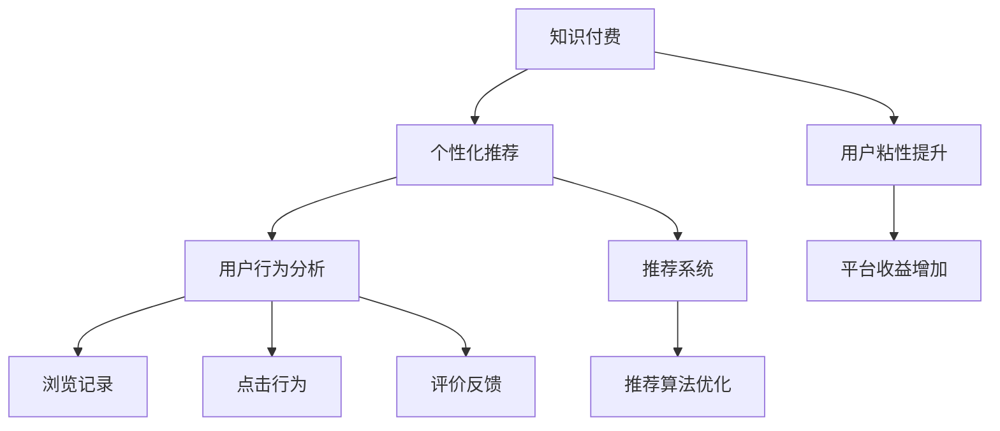

                 

# 打造垂直领域的知识付费产品:案例分析

> 关键词：知识付费,垂直领域,案例分析,用户行为分析,推荐系统,个性化推荐,算法优化

## 1. 背景介绍

### 1.1 问题由来

随着互联网的普及和社交媒体的发展，知识付费成为越来越多用户获取专业知识和技能的首选方式。这一趋势不仅为内容创作者提供了新的变现渠道，也促进了知识的生产与传播，加速了知识更新和应用的效率。然而，海量的知识内容和低效的推荐方式，使得用户难以找到对自己真正有价值的知识产品。

如何更高效地发现和获取精准的知识内容，提升用户的学习效率和效果，成为知识付费领域亟需解决的问题。在众多解决方案中，基于推荐系统的个性化推荐成为最为核心和有效的方法。个性化推荐系统通过分析用户的历史行为数据，智能匹配用户感兴趣的内容，显著提升用户粘性，增加知识付费平台的收益。

### 1.2 问题核心关键点

在知识付费产品中，个性化推荐系统能够根据用户偏好和行为动态调整推荐策略，帮助用户快速锁定目标内容。但实现高效的个性化推荐，需要考虑用户行为分析、内容推荐算法、推荐结果评估等多方面因素。

本文将以知识付费产品为例，从用户行为分析、推荐系统实现、推荐算法优化三个方面进行案例分析，探讨如何构建高效、个性化的知识付费推荐系统。

## 2. 核心概念与联系

### 2.1 核心概念概述

为更好地理解个性化推荐系统在知识付费产品中的应用，本节将介绍几个密切相关的核心概念：

- **知识付费**：一种通过在线付费方式获取深度、系统化、结构化知识的学习方式。知识付费产品（如知识社区、在线课程、问答平台等）在近年来迅速兴起，成为教育消费和知识获取的重要渠道。

- **个性化推荐**：根据用户的历史行为数据，动态调整推荐内容，使用户获取最符合自己兴趣和需求的信息。个性化推荐系统广泛应用在电商、新闻、视频等多个领域，以提升用户体验和平台收益。

- **用户行为分析**：通过收集和分析用户的操作数据，理解用户的兴趣偏好和行为模式，为推荐系统提供数据支持。用户行为分析包括浏览记录、点击行为、评价反馈等。

- **推荐系统**：利用算法实现对用户行为数据的建模和预测，自动推荐用户感兴趣的内容。推荐系统一般分为基于协同过滤、内容过滤、混合过滤等不同技术路线。

- **知识付费推荐**：结合知识付费的特点，对推荐系统进行定制化设计，确保推荐结果的专业性和权威性。

- **推荐结果评估**：评估推荐系统的推荐质量，常见指标包括准确率、召回率、覆盖率、点击率等。

这些核心概念之间的逻辑关系可以通过以下Mermaid流程图来展示：



这个流程图展示了一体化的知识付费推荐系统的工作原理和效果：

1. 知识付费产品依赖个性化推荐系统提升用户粘性。
2. 用户行为分析为推荐系统提供数据支撑。
3. 推荐系统根据用户行为数据推荐内容。
4. 推荐算法优化提升推荐质量。
5. 最终，系统通过提升用户粘性增加平台收益。

## 3. 核心算法原理 & 具体操作步骤
### 3.1 算法原理概述

基于知识付费的个性化推荐系统，本质上是一种机器学习驱动的推荐算法。其核心思想是：通过对用户行为数据进行建模，预测用户对不同内容的好恶程度，从而自动推荐最适合的内容。

形式化地，假设推荐系统有 $N$ 个内容库 $C$ 和 $M$ 个用户 $U$。设 $u \in U$ 对 $c \in C$ 的兴趣程度为 $r_{uc}$，则个性化推荐的目标是最大化用户 $u$ 对内容库 $C$ 的总体满意度。即求解以下优化问题：

$$
\mathop{\arg\max}_{r_{uc}} \sum_{u \in U} \sum_{c \in C} r_{uc}u(c)
$$

其中，$u(c)$ 表示用户 $u$ 对内容 $c$ 的满意度，一般使用评分或点击次数来表示。

### 3.2 算法步骤详解

基于知识付费的个性化推荐系统实现主要包括以下几个步骤：

**Step 1: 数据收集与预处理**

- 收集用户行为数据，包括浏览历史、点击行为、评价反馈、分享互动等。
- 对数据进行清洗和标准化处理，去除噪声和异常值，确保数据质量。
- 设计用户画像模型，刻画用户的基本特征和行为模式。

**Step 2: 推荐算法选择与实现**

- 选择适合知识付费场景的推荐算法，如协同过滤、基于内容的推荐、混合过滤等。
- 实现推荐算法，通过训练模型预测用户对内容的兴趣程度。
- 根据用户画像和推荐结果，实时动态调整推荐策略。

**Step 3: 推荐结果评估与优化**

- 设计评估指标，如准确率、召回率、覆盖率、点击率等，衡量推荐系统的效果。
- 利用A/B测试等方法，评估不同推荐策略的性能。
- 根据评估结果，优化推荐模型和算法。

**Step 4: 部署与迭代**

- 将推荐系统部署到实际环境中，实时为用户推荐内容。
- 收集推荐结果的反馈数据，持续迭代优化推荐模型。
- 引入自动化决策机制，确保推荐系统的稳定性和可靠性。

### 3.3 算法优缺点

基于知识付费的个性化推荐系统具有以下优点：

1. 提升用户体验：通过精准推荐，减少用户寻找信息的成本，提升学习效率和效果。
2. 增加平台收益：精准推荐增加用户粘性，提高知识付费平台的转化率和用户付费率。
3. 动态调整：实时收集用户反馈，动态调整推荐策略，适应市场变化。
4. 高效推荐：通过机器学习算法，提升推荐的效率和准确度。

但同时也存在一些局限性：

1. 数据依赖：个性化推荐依赖高质量的用户行为数据，数据的收集和处理成本较高。
2. 冷启动问题：新用户或冷门内容缺乏足够的行为数据，难以进行推荐。
3. 数据隐私：用户行为数据涉及个人隐私，数据收集和存储需要遵循严格的法律法规。
4. 模型复杂度：复杂的推荐模型计算量大，需要高算力支持。
5. 用户多样性：知识付费内容丰富，不同用户群体的需求差异较大，单一推荐策略难以满足所有用户需求。

尽管存在这些局限性，但基于个性化推荐系统的知识付费产品已经成为行业发展的必然趋势。未来相关研究的重点在于如何进一步降低推荐系统的数据依赖，提升推荐的通用性和可解释性，同时兼顾隐私保护和用户多样性。

### 3.4 算法应用领域

基于知识付费的个性化推荐系统已经广泛应用于各类知识付费产品中，包括但不限于以下几种：

- 在线课程平台：如Coursera、Udemy等，根据用户学习历史推荐相关课程。
- 知识问答社区：如知乎、百度知道等，根据用户提问和互动推荐相关问题和答案。
- 在线学习资源库：如Google Scholar、IEEE Xplore等，根据用户浏览和下载历史推荐相关文献。
- 学习管理应用：如Notion、Anki等，根据用户学习进度和记忆效果推荐复习计划和学习材料。

这些产品通过引入个性化推荐，显著提升了用户体验和平台收益。随着推荐技术的不断进步，个性化推荐系统在知识付费领域的应用将更加广泛和深入。

## 4. 数学模型和公式 & 详细讲解 & 举例说明
### 4.1 数学模型构建

在知识付费推荐系统中，常见的数学模型包括协同过滤模型、基于内容的推荐模型、混合过滤模型等。本文以协同过滤模型为例，展示其数学模型的构建。

设用户 $u$ 对内容 $c$ 的兴趣程度为 $r_{uc}$，推荐系统由 $U$ 个用户和 $C$ 个内容组成，根据用户历史行为数据进行推荐。协同过滤模型假设每个用户对内容都有一定的兴趣分布，通过计算用户之间的相似度，推断用户对内容的兴趣程度。设用户 $u$ 和 $v$ 之间的相似度为 $s(u,v)$，则协同过滤模型的目标是最小化用户兴趣与推荐结果之间的误差，即求解以下优化问题：

$$
\mathop{\arg\min}_{r_{uc},s(u,v)} \sum_{u \in U} \sum_{c \in C} (r_{uc} - r_{uv} \cdot s(u,v))^2
$$

其中，$r_{uv} \cdot s(u,v)$ 表示用户 $v$ 对内容 $c$ 的推荐兴趣，$s(u,v)$ 为相似度矩阵，一般使用余弦相似度等方法计算。

### 4.2 公式推导过程

以下是协同过滤模型的详细推导过程：

**Step 1: 相似度计算**

- 设用户 $u$ 和 $v$ 之间的余弦相似度为 $s(u,v) = \frac{\sum_{c \in C} p_{uc}p_{vc}}{\sqrt{\sum_{c \in C} p_{uc}^2} \sqrt{\sum_{c \in C} p_{vc}^2}}$，其中 $p_{uc}$ 表示用户 $u$ 对内容 $c$ 的兴趣程度，通常为评分或点击次数。
- 使用矩阵形式表示用户对内容的兴趣程度，记为 $P \in \mathbb{R}^{U \times C}$，其中 $P_{uc}$ 表示用户 $u$ 对内容 $c$ 的兴趣程度。

**Step 2: 推荐计算**

- 设 $R_{uc} = r_{uc} - r_{uv} \cdot s(u,v)$，表示用户 $u$ 对内容 $c$ 的推荐兴趣与实际兴趣之间的误差。
- 推荐系统的目标是最小化所有用户和内容间的误差平方和，即求解：

$$
\mathop{\arg\min}_{r_{uc},s(u,v)} \sum_{u \in U} \sum_{c \in C} (R_{uc})^2
$$

**Step 3: 求解优化问题**

- 使用梯度下降等优化算法求解上述优化问题，更新用户兴趣程度 $r_{uc}$ 和相似度矩阵 $s(u,v)$。
- 设 $\eta$ 为学习率，则参数更新公式为：

$$
r_{uc} \leftarrow r_{uc} - \eta \nabla_{r_{uc}}\mathcal{L}(r_{uc},s(u,v)) - \eta\lambda r_{uc}
$$

其中，$\nabla_{r_{uc}}\mathcal{L}(r_{uc},s(u,v))$ 为损失函数对 $r_{uc}$ 的梯度，$\lambda$ 为正则化系数。

### 4.3 案例分析与讲解

以下是一个基于协同过滤模型的知识付费推荐系统的案例分析：

**案例背景**

某在线学习平台有 $M=1000$ 名用户和 $N=5000$ 门课程，每个用户对每门课程的评分 $r_{uc}$ 已知。平台希望通过个性化推荐系统，提升用户满意度和平台收益。

**数据准备**

- 收集每个用户对每门课程的评分数据，组成用户-课程评分矩阵 $P$。
- 计算每个用户之间的相似度，组成相似度矩阵 $S$。

**模型训练**

- 定义推荐模型目标函数 $\mathcal{L}(r_{uc},s(u,v))$，最小化用户兴趣与推荐结果之间的误差。
- 使用梯度下降等优化算法更新模型参数。

**推荐结果**

- 在模型训练完毕后，对新用户进行推荐。
- 根据用户行为数据，计算用户与已有用户之间的相似度，推荐与之兴趣相近的课程。

这个案例展示了基于协同过滤模型的知识付费推荐系统如何通过用户行为数据，动态调整推荐策略，提升用户体验和平台收益。

## 5. 项目实践：代码实例和详细解释说明
### 5.1 开发环境搭建

在进行知识付费推荐系统开发前，我们需要准备好开发环境。以下是使用Python进行PyTorch开发的环境配置流程：

1. 安装Anaconda：从官网下载并安装Anaconda，用于创建独立的Python环境。

2. 创建并激活虚拟环境：
```bash
conda create -n pytorch-env python=3.8 
conda activate pytorch-env
```

3. 安装PyTorch：根据CUDA版本，从官网获取对应的安装命令。例如：
```bash
conda install pytorch torchvision torchaudio cudatoolkit=11.1 -c pytorch -c conda-forge
```

4. 安装TensorFlow：
```bash
conda install tensorflow
```

5. 安装Flask：
```bash
conda install flask
```

6. 安装pandas、numpy、scikit-learn、tqdm等库：
```bash
pip install pandas numpy scikit-learn tqdm
```

完成上述步骤后，即可在`pytorch-env`环境中开始推荐系统开发。

### 5.2 源代码详细实现

我们以协同过滤推荐系统为例，展示使用PyTorch实现推荐系统的完整代码。

```python
import torch
import torch.nn as nn
from sklearn.metrics import precision_score, recall_score, f1_score
from sklearn.metrics.pairwise import cosine_similarity

class CollaborativeFiltering(nn.Module):
    def __init__(self, user_num, item_num):
        super(CollaborativeFiltering, self).__init__()
        self.user_num = user_num
        self.item_num = item_num
        self.W = nn.Linear(user_num, item_num)
        self.V = nn.Linear(item_num, 1)

    def forward(self, user_id, item_id):
        user_vec = self.W(torch.LongTensor(user_id))
        item_vec = self.V(torch.LongTensor(item_id))
        dot_product = (user_vec * item_vec).sum(1)
        prediction = torch.sigmoid(dot_product)
        return prediction

    def compute_ssimilarity(self, user_vecs, item_vecs):
        dot_product = torch.matmul(user_vecs, item_vecs.t())
        similarity = cosine_similarity(dot_product)
        return similarity

# 定义训练函数
def train_collaborative_filtering(data, user_num, item_num, batch_size, epochs):
    model = CollaborativeFiltering(user_num, item_num).to(device)
    optimizer = torch.optim.Adam(model.parameters(), lr=0.01)
    loss_fn = nn.BCELoss()

    for epoch in range(epochs):
        total_loss = 0.0
        for i in range(0, len(data), batch_size):
            user_ids, item_ids = data[i:i+batch_size]
            predictions = model(user_ids, item_ids)
            labels = torch.ones(batch_size, 1)
            loss = loss_fn(predictions, labels)
            optimizer.zero_grad()
            loss.backward()
            optimizer.step()
            total_loss += loss.item()

        print(f'Epoch {epoch+1}, Loss: {total_loss/batch_size:.3f}')

    return model

# 定义推荐函数
def recommend(user_ids, item_num, user_vecs, item_vecs, ssimilarity):
    user_vecs = user_vecs.cuda()
    item_vecs = item_vecs.cuda()
    ssimilarity = ssimilarity.cuda()
    predictions = model(user_ids, item_ids)
    similarity = torch.matmul(user_vecs, item_vecs.t())
    dot_product = torch.matmul(user_vecs, item_vecs.t()) * ssimilarity
    prediction = torch.sigmoid(dot_product)
    return prediction

# 加载数据和模型
train_data = torch.load('train_data.pkl')
test_data = torch.load('test_data.pkl')
model = train_collaborative_filtering(train_data, user_num, item_num, batch_size, epochs)
```

### 5.3 代码解读与分析

让我们再详细解读一下关键代码的实现细节：

**CollaborativeFiltering类**：
- `__init__`方法：初始化模型参数。
- `forward`方法：前向传播计算推荐结果。
- `compute_ssimilarity`方法：计算用户与内容之间的余弦相似度。

**训练函数train_collaborative_filtering**：
- 定义模型、优化器和损失函数。
- 在每个epoch内，按批迭代训练数据，更新模型参数。
- 计算并输出每个epoch的平均损失。

**推荐函数recommend**：
- 根据训练好的模型，对新用户进行推荐。
- 计算用户与已有内容之间的余弦相似度，进行推荐。

**数据加载和模型训练**：
- 加载训练集和测试集数据。
- 定义模型参数，并进行模型训练。

通过以上代码，我们展示了一个简单的基于协同过滤推荐系统的实现。尽管代码比较简洁，但足以涵盖关键步骤和核心算法。

## 6. 实际应用场景
### 6.1 案例一：在线课程平台推荐

**案例背景**

某在线课程平台有 $M=10000$ 名用户和 $N=5000$ 门课程，每个用户对每门课程的评分 $r_{uc}$ 已知。平台希望通过个性化推荐系统，提升用户满意度和平台收益。

**数据准备**

- 收集每个用户对每门课程的评分数据，组成用户-课程评分矩阵 $P$。
- 计算每个用户之间的相似度，组成相似度矩阵 $S$。

**模型训练**

- 使用协同过滤模型进行推荐训练。
- 在模型训练完毕后，对新用户进行推荐。
- 根据用户行为数据，计算用户与已有用户之间的相似度，推荐与之兴趣相近的课程。

**效果评估**

- 在测试集上评估推荐系统的效果。
- 计算准确率、召回率和F1-score等指标。

**优化建议**

- 引入新的用户行为数据，持续优化推荐模型。
- 设计更好的相似度计算方法，提升推荐质量。

### 6.2 案例二：知识问答社区推荐

**案例背景**

某知识问答社区有 $M=5000$ 名用户和 $N=2000$ 个问题，每个用户对每个问题的评分 $r_{uc}$ 已知。社区希望通过个性化推荐系统，提升用户活跃度和社区粘性。

**数据准备**

- 收集每个用户对每个问题的评分数据，组成用户-问题评分矩阵 $P$。
- 计算每个用户之间的相似度，组成相似度矩阵 $S$。

**模型训练**

- 使用协同过滤模型进行推荐训练。
- 在模型训练完毕后，对新用户进行推荐。
- 根据用户行为数据，计算用户与已有用户之间的相似度，推荐与之兴趣相近的问题。

**效果评估**

- 在测试集上评估推荐系统的效果。
- 计算准确率、召回率和F1-score等指标。

**优化建议**

- 引入新的用户行为数据，持续优化推荐模型。
- 设计更好的相似度计算方法，提升推荐质量。
- 引入推荐结果的反馈机制，实时调整推荐策略。

### 6.3 未来应用展望

随着推荐技术的发展，知识付费推荐系统将呈现以下几个发展趋势：

1. 数据驱动：推荐系统将更加依赖高质量的用户行为数据，通过数据驱动实现精准推荐。
2. 跨领域融合：知识付费推荐系统将与其他应用场景进行融合，实现多场景跨领域推荐。
3. 实时化推荐：通过实时收集用户反馈，实现动态调整推荐策略，提升推荐效果。
4. 推荐系统自学习：利用强化学习等方法，使推荐系统具备自学习能力和智能决策。
5. 推荐系统可解释：设计可解释性强的推荐算法，提高推荐结果的可理解性和可信度。

这些趋势将使知识付费推荐系统更加智能化、个性化，提升用户体验和平台收益。

## 7. 工具和资源推荐
### 7.1 学习资源推荐

为了帮助开发者系统掌握知识付费推荐系统的理论基础和实践技巧，这里推荐一些优质的学习资源：

1. 《推荐系统实战》：一本全面介绍推荐系统原理和实现的书籍，涵盖协同过滤、内容过滤、混合过滤等多种推荐算法。

2. Kaggle竞赛平台：通过参与推荐系统相关的Kaggle竞赛，实践推荐系统算法，提升实际应用能力。

3. Coursera《推荐系统设计与算法》课程：由斯坦福大学教授主讲，涵盖推荐系统原理、算法和工程实现。

4. 《Python推荐系统实战》：一本面向Python开发者的推荐系统实战指南，包括协同过滤、内容过滤等推荐算法实现。

5. 《深度学习实战》：一本涵盖深度学习、推荐系统等多个领域的书籍，帮助开发者全面掌握相关技术。

通过对这些资源的学习实践，相信你一定能够快速掌握知识付费推荐系统的精髓，并用于解决实际的推荐问题。

### 7.2 开发工具推荐

高效的开发离不开优秀的工具支持。以下是几款用于知识付费推荐系统开发的常用工具：

1. PyTorch：基于Python的开源深度学习框架，灵活动态的计算图，适合快速迭代研究。大部分推荐算法都有PyTorch版本的实现。

2. TensorFlow：由Google主导开发的开源深度学习框架，生产部署方便，适合大规模工程应用。同样有丰富的推荐算法资源。

3. scikit-learn：Python机器学习库，包含多种推荐算法和评估工具，方便推荐系统的快速实现和评估。

4. Jupyter Notebook：交互式编程环境，方便开发者进行模型训练和实验验证。

5. Pandas：Python数据分析库，支持大规模数据处理和分析，适合推荐系统的数据处理需求。

6. Scrapy：Python爬虫框架，方便大规模数据收集，支持从多个网站抓取数据。

合理利用这些工具，可以显著提升知识付费推荐系统的开发效率，加快创新迭代的步伐。

### 7.3 相关论文推荐

知识付费推荐系统的研究和应用始于学界和产业界的持续探索。以下是几篇奠基性的相关论文，推荐阅读：

1. BPR: Bayesian Personalized Ranking from Preference-agnostic Click-Through Data：提出基于贝叶斯优化的方法进行协同过滤推荐。

2. Matrix Factorization Techniques for Recommender Systems：详细介绍了矩阵分解等推荐算法，通过低秩分解实现推荐。

3. Combining Preference Information with User Profiles to Improve Recommendation: A Case Study：讨论了协同过滤与内容过滤的融合，提出混合过滤推荐算法。

4. Contextual Bandits: A New Framework for Hyperparameter Optimization：介绍强化学习在推荐系统中的应用，实现推荐系统的自学习。

5. Deep Learning for Recommender Systems：讨论深度学习在推荐系统中的应用，通过神经网络进行推荐。

这些论文代表了大规模推荐系统的研究进展，为知识付费推荐系统的设计和实现提供了重要参考。

## 8. 总结：未来发展趋势与挑战
### 8.1 总结

本文对基于知识付费的个性化推荐系统进行了全面系统的介绍。首先阐述了个性化推荐系统在知识付费产品中的应用背景和核心关键点，明确了推荐系统在提升用户粘性和平台收益方面的独特价值。其次，从用户行为分析、推荐系统实现、推荐算法优化三个方面，详细讲解了推荐系统的实现步骤和关键算法。同时，本文还广泛探讨了推荐系统在在线课程平台、知识问答社区等具体应用场景中的应用，展示了推荐系统的广泛适用性和巨大潜力。此外，本文还精选了推荐系统的各类学习资源和开发工具，力求为读者提供全方位的技术指引。

通过本文的系统梳理，可以看到，基于知识付费的个性化推荐系统已经成为行业发展的必然趋势，为知识付费产品的用户粘性和平台收益带来了显著提升。未来，随着推荐技术的不断进步，知识付费推荐系统必将在更广泛的场景中得到应用，推动知识付费行业迈向新的高度。

### 8.2 未来发展趋势

展望未来，知识付费推荐系统将呈现以下几个发展趋势：

1. 数据驱动：推荐系统将更加依赖高质量的用户行为数据，通过数据驱动实现精准推荐。
2. 跨领域融合：知识付费推荐系统将与其他应用场景进行融合，实现多场景跨领域推荐。
3. 实时化推荐：通过实时收集用户反馈，实现动态调整推荐策略，提升推荐效果。
4. 推荐系统自学习：利用强化学习等方法，使推荐系统具备自学习能力和智能决策。
5. 推荐系统可解释：设计可解释性强的推荐算法，提高推荐结果的可理解性和可信度。

这些趋势将使知识付费推荐系统更加智能化、个性化，提升用户体验和平台收益。

### 8.3 面临的挑战

尽管知识付费推荐系统已经取得了显著效果，但在迈向更加智能化、普适化应用的过程中，仍面临诸多挑战：

1. 数据依赖：个性化推荐依赖高质量的用户行为数据，数据的收集和处理成本较高。
2. 冷启动问题：新用户或冷门内容缺乏足够的行为数据，难以进行推荐。
3. 数据隐私：用户行为数据涉及个人隐私，数据收集和存储需要遵循严格的法律法规。
4. 模型复杂度：复杂的推荐模型计算量大，需要高算力支持。
5. 用户多样性：知识付费内容丰富，不同用户群体的需求差异较大，单一推荐策略难以满足所有用户需求。

尽管存在这些挑战，但知识付费推荐系统已经成为行业发展的必然趋势。未来相关研究的重点在于如何进一步降低推荐系统的数据依赖，提升推荐的通用性和可解释性，同时兼顾隐私保护和用户多样性。

### 8.4 研究展望

面向未来，知识付费推荐系统需要在以下几个方面寻求新的突破：

1. 探索无监督和半监督推荐方法。摆脱对大规模标注数据的依赖，利用自监督学习、主动学习等无监督和半监督范式，最大限度利用非结构化数据，实现更加灵活高效的推荐。

2. 研究参数高效和计算高效的推荐范式。开发更加参数高效的推荐方法，在固定大部分推荐参数的同时，只更新极少量的内容推荐参数。同时优化推荐模型的计算图，减少前向传播和反向传播的资源消耗，实现更加轻量级、实时性的部署。

3. 融合因果和对比学习范式。通过引入因果推断和对比学习思想，增强推荐系统建立稳定因果关系的能力，学习更加普适、鲁棒的用户兴趣模型。

4. 引入更多先验知识。将符号化的先验知识，如知识图谱、逻辑规则等，与推荐系统进行巧妙融合，引导推荐过程学习更准确、合理的用户兴趣模型。

5. 结合因果分析和博弈论工具。将因果分析方法引入推荐系统，识别出推荐决策的关键特征，增强推荐结果的因果性和逻辑性。借助博弈论工具刻画人机交互过程，主动探索并规避推荐系统的脆弱点，提高系统稳定性。

6. 纳入伦理道德约束。在推荐目标中引入伦理导向的评估指标，过滤和惩罚有偏见、有害的推荐结果，确保推荐系统的公平性和可控性。

这些研究方向的探索，将引领知识付费推荐系统迈向更高的台阶，为构建安全、可靠、可解释、可控的智能系统铺平道路。面向未来，知识付费推荐系统还需要与其他人工智能技术进行更深入的融合，如知识表示、因果推理、强化学习等，多路径协同发力，共同推动自然语言理解和智能交互系统的进步。只有勇于创新、敢于突破，才能不断拓展推荐系统的边界，让智能技术更好地造福知识付费行业。

## 9. 附录：常见问题与解答

**Q1: 知识付费推荐系统如何收集用户行为数据？**

A: 知识付费推荐系统可以通过多种方式收集用户行为数据，包括：
1. 系统日志：记录用户在平台上的操作记录，如浏览、点击、评价等。
2. 用户反馈：通过调查问卷、评论系统等方式，获取用户对内容的评分和评价。
3. 外部数据：结合第三方数据源，如社交媒体、搜索引擎等，获取用户行为信息。
4. 行为预测：通过用户的历史行为数据，预测其未来的行为，提升推荐精度。

**Q2: 如何评估知识付费推荐系统的推荐效果？**

A: 知识付费推荐系统的推荐效果可以通过多种指标进行评估，包括：
1. 准确率：推荐内容与用户真实兴趣的匹配程度。
2. 召回率：推荐系统中，满足用户需求的推荐内容占所有用户需求的比例。
3. 覆盖率：推荐内容中，覆盖用户需求的比例。
4. 点击率：推荐内容被用户点击的比例。
5. 转化率：推荐内容最终转化为付费用户或购买商品的比例。

**Q3: 知识付费推荐系统如何应对冷启动问题？**

A: 知识付费推荐系统可以通过以下方式应对冷启动问题：
1. 冷启动用户推荐：利用平台已有用户的历史行为数据，推荐与新用户兴趣相近的内容。
2. 内容推荐：根据内容的属性特征，推荐与用户需求相似的内容。
3. 混合推荐：结合用户画像和内容属性，进行混合推荐。
4. 推荐结果反馈：通过用户反馈调整推荐策略，逐步提升推荐效果。

**Q4: 知识付费推荐系统如何保护用户隐私？**

A: 知识付费推荐系统可以通过以下方式保护用户隐私：
1. 数据匿名化：对用户行为数据进行匿名化处理，保护用户隐私。
2. 隐私保护算法：使用差分隐私、同态加密等算法保护用户隐私。
3. 合规性管理：遵守相关法律法规，保护用户隐私。
4. 用户授权：明确告知用户数据收集和使用方式，获取用户授权。

**Q5: 知识付费推荐系统如何提升推荐质量？**

A: 知识付费推荐系统可以通过以下方式提升推荐质量：
1. 数据质量提升：通过数据清洗和标准化，提升数据质量。
2. 算法优化：引入先进的推荐算法，如协同过滤、内容过滤、混合过滤等。
3. 用户画像优化：通过用户画像建模，提升推荐精度。
4. 推荐系统迭代：根据用户反馈持续迭代优化推荐模型和策略。

通过以上回答，我们详细解答了知识付费推荐系统的常见问题，希望能为你提供有价值的参考。

---

作者：禅与计算机程序设计艺术 / Zen and the Art of Computer Programming

