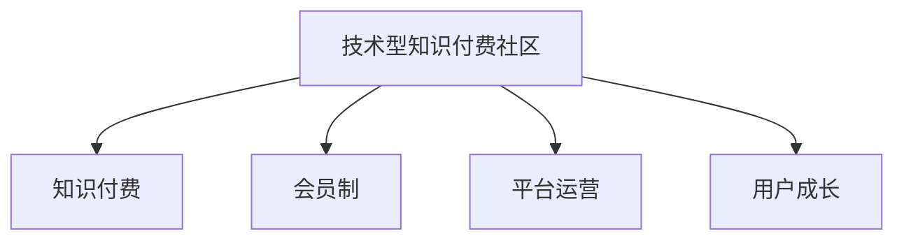

                 

## 1. 背景介绍

随着知识经济的兴起，越来越多的企业认识到技术知识和创新能力对企业发展的重要性。知识付费作为一种新的业务模式，正日益受到市场和用户的热烈欢迎。技术型知识付费社区，以提供高质量、深度、实用的技术内容为核心，汇聚了大量技术爱好者和专家，成为技术分享与交流的重要平台。本文将从背景介绍出发，深入探讨如何打造一个有规模、有影响力、有持续发展潜力的技术型知识付费社区。

## 2. 核心概念与联系

### 2.1 核心概念概述

为了更好地理解如何打造技术型知识付费社区，我们首先介绍几个核心概念：

- **技术型知识付费社区**：以提供深度技术知识、前沿技术资讯和实用技术应用为核心内容，采用付费模式为会员提供高价值内容的学习平台。
- **知识付费**：通过付费获取高质量、专业、有价值的技术知识，满足用户对技术深度理解和应用需求的学习模式。
- **会员制**：通过订阅费、会员费等形式，提供给用户个性化的技术学习体验和服务。
- **平台运营**：通过技术手段和管理策略，保障平台内容的生产、发布、推广和维护。
- **用户成长**：提供系统化的学习路径和认证体系，帮助用户建立技术知识体系，持续提升技术能力。

这些概念之间的联系可以通过以下Mermaid流程图来展示：



## 3. 核心算法原理 & 具体操作步骤

### 3.1 算法原理概述

打造技术型知识付费社区的核心在于如何高效运营并不断扩大用户规模，提升平台影响力。这涉及到内容策略、用户增长策略、运营策略等多个方面的技术手段和管理策略。

以用户增长为例，传统方法可能侧重于单一渠道的广告投放，但这种方法往往成本高、效果有限。基于数据驱动的用户增长策略，可以更精准地定位用户，并通过各种手段提升转化率和留存率。例如，通过用户行为分析，找出活跃用户和潜在用户的特征，设计针对性的营销策略，如个性化推荐、优惠券、社区互动等。

### 3.2 算法步骤详解

以下是打造技术型知识付费社区的详细操作步骤：

**Step 1: 数据驱动的用户分析**
- 收集用户行为数据，包括登录时间、浏览行为、购买记录等。
- 通过机器学习模型，对用户进行行为聚类和特征提取。
- 根据聚类结果，设计针对性的营销策略。

**Step 2: 个性化推荐系统构建**
- 收集用户兴趣数据，如浏览记录、购买记录等。
- 使用协同过滤、基于内容的推荐算法等，为用户推荐相关内容。
- 定期更新推荐模型，提高推荐效果。

**Step 3: 社区互动和反馈机制**
- 建立社区互动模块，如评论、点赞、讨论等，增强用户粘性。
- 通过社区反馈数据，不断优化平台内容，提升用户体验。
- 引入KOL（意见领袖），提升平台影响力。

**Step 4: 用户成长体系设计**
- 设计技术认证体系，如技术认证考试、项目实战等。
- 建立用户学习路径，帮助用户系统化学习技术知识。
- 提供个性化学习推荐，提升学习效率。

**Step 5: 平台运营和维护**
- 定期更新平台内容和功能，提升用户体验。
- 通过监控和数据分析，及时发现问题并进行优化。
- 保障平台安全性，防止数据泄露和系统攻击。

### 3.3 算法优缺点

基于数据驱动的用户增长策略具有以下优点：
1. 精准定位用户，提升营销效果。
2. 用户粘性增强，提高留存率。
3. 个性化推荐，提升用户体验。
4. 社区互动丰富，增强用户参与度。
5. 用户成长体系完善，提升用户技术水平。

同时，这种策略也存在一些局限性：
1. 数据隐私问题。在收集和分析用户数据时，需严格遵守数据隐私法规。
2. 个性化推荐效果依赖于数据质量。需保证数据准确性和全面性。
3. 社区互动质量参差不齐。需严格管理社区内容，防止恶意行为。
4. 用户成长体系复杂。需不断优化认证和推荐算法。
5. 平台运营成本高。需投入大量资源进行内容生产、功能开发和系统维护。

### 3.4 算法应用领域

基于数据驱动的用户增长策略不仅适用于技术型知识付费社区，也广泛应用于电商、社交媒体、在线教育等多个领域。通过精准的用户分析、个性化推荐、社区互动和用户成长体系的设计，可以有效提升平台的用户规模和活跃度，推动业务的持续增长。

## 4. 数学模型和公式 & 详细讲解 & 举例说明

### 4.1 数学模型构建

在打造技术型知识付费社区的过程中，涉及到多种数学模型和公式，如协同过滤算法、内容推荐算法、社区行为分析模型等。以下以协同过滤算法为例，介绍其数学模型构建。

协同过滤算法是一种基于用户行为数据的推荐算法。假设用户集合为 $U=\{u_1,u_2,...,u_n\}$，物品集合为 $I=\{i_1,i_2,...,i_m\}$，用户 $u_i$ 对物品 $i_j$ 的评分矩阵为 $R_{ij}$。协同过滤的目标是根据用户的行为数据，预测用户 $u_i$ 对物品 $i_j$ 的评分。

假设协同过滤模型为 $f(\cdot)$，用户 $u_i$ 对物品 $i_j$ 的预测评分记为 $R'_{ij}=f(u_i,i_j|U,I)$。协同过滤的目标是最小化预测评分与实际评分之间的误差，即：

$$
\min_{R'} \sum_{i=1}^{n} \sum_{j=1}^{m} (R'_{ij} - R_{ij})^2
$$

### 4.2 公式推导过程

协同过滤算法主要有基于用户的协同过滤和基于物品的协同过滤两种。

- **基于用户的协同过滤**：假设用户 $u_i$ 对物品 $i_j$ 的预测评分 $R'_{ij}$ 为 $u_i$ 对物品 $i_j$ 的实际评分 $R_{ij}$ 的加权平均值。对于用户 $u_i$，其预测评分为：

$$
R'_{ij} = \frac{\sum_{k=1}^{n} \alpha_k R_{kj} + \beta_i \overline{R}_j}{\sum_{k=1}^{n} \alpha_k + \beta_i}
$$

其中，$\alpha_k$ 为用户的权重系数，$\beta_i$ 为用户 $u_i$ 的权重系数，$\overline{R}_j$ 为物品 $i_j$ 的平均评分。

- **基于物品的协同过滤**：假设物品 $i_j$ 对用户 $u_i$ 的预测评分 $R'_{ij}$ 为 $i_j$ 对所有用户评分的加权平均值。对于物品 $i_j$，其预测评分为：

$$
R'_{ij} = \frac{\sum_{k=1}^{m} \alpha_k R_{ik} + \beta_j \overline{R}_i}{\sum_{k=1}^{m} \alpha_k + \beta_j}
$$

其中，$\alpha_k$ 为物品的权重系数，$\beta_j$ 为物品 $i_j$ 的权重系数，$\overline{R}_i$ 为用户 $u_i$ 的平均评分。

### 4.3 案例分析与讲解

以下通过一个具体的案例，展示协同过滤算法在技术型知识付费社区中的应用。

假设某知识付费社区有10000名用户和1000个技术博客。每个用户对每个技术博客都有一个评分，评分范围为0-5分。基于协同过滤算法，为用户推荐最受欢迎的技术博客。

首先，通过用户行为数据，计算每个用户的评分平均值和物品的评分平均值，以及每个用户对每个物品的评分。然后，使用基于用户的协同过滤算法，计算用户 $u_i$ 对物品 $i_j$ 的预测评分 $R'_{ij}$。最后，将预测评分排序，为用户推荐评分最高的前10个技术博客。

## 5. 项目实践：代码实例和详细解释说明

### 5.1 开发环境搭建

要实现协同过滤算法，首先需要搭建开发环境。以下是使用Python和Scikit-learn库搭建开发环境的详细流程：

1. 安装Anaconda：从官网下载并安装Anaconda，用于创建独立的Python环境。
2. 创建并激活虚拟环境：
```bash
conda create -n myenv python=3.8 
conda activate myenv
```

3. 安装Scikit-learn：
```bash
pip install scikit-learn
```

4. 安装Pandas：
```bash
pip install pandas
```

5. 安装NumPy：
```bash
pip install numpy
```

完成上述步骤后，即可在`myenv`环境中开始协同过滤算法的实现。

### 5.2 源代码详细实现

以下是一个使用协同过滤算法为用户推荐技术博客的Python代码实现：

```python
import pandas as pd
from sklearn.metrics.pairwise import cosine_similarity
from sklearn.feature_extraction.text import CountVectorizer

# 加载用户评分数据
data = pd.read_csv('user_ratings.csv', index_col='user_id')

# 计算每个用户的评分平均值和物品的评分平均值
user_avg = data.mean()
item_avg = data.mean().T

# 计算每个用户对每个物品的评分
user_item_score = data.values

# 计算用户之间的相似度矩阵
similarity_matrix = cosine_similarity(user_item_score)

# 为用户推荐最受欢迎的技术博客
def recommend_books(user_id):
    user_item_score_user = user_item_score[user_id]
    user_avg = user_avg.values[user_id]
    item_avg = item_avg.values
    similarity_user = similarity_matrix[user_id]
    
    # 计算预测评分
    pred_scores = user_item_score_user @ similarity_matrix.T * item_avg
    pred_scores = pred_scores / (similarity_user + user_avg)[:, None]
    
    # 将预测评分排序，返回前10个推荐博客
    top_books = pd.DataFrame(pred_scores.argsort()[::-1].tolist()).rename(columns={0: 'rank'})
    top_books['book_id'] = pred_scores.columns
    top_books = top_books.sort_values(by='rank', ascending=False).head(10)
    return top_books

# 测试推荐函数
print(recommend_books('user1'))
```

### 5.3 代码解读与分析

让我们再详细解读一下关键代码的实现细节：

**数据加载和预处理**：
- 使用Pandas库加载用户评分数据，并将用户ID作为索引。
- 计算每个用户的评分平均值和物品的评分平均值，以及每个用户对每个物品的评分。

**相似度计算**：
- 使用cosine_similarity函数计算用户之间的相似度矩阵。

**推荐函数实现**：
- 使用用户评分平均值和物品评分平均值，计算预测评分。
- 将预测评分排序，返回前10个推荐博客。

**测试函数调用**：
- 调用推荐函数，输出用户ID为'user1'的推荐博客。

## 6. 实际应用场景

### 6.1 知识付费内容推荐

技术型知识付费社区的核心在于为用户提供高质量、有价值的知识内容。协同过滤算法通过分析用户行为数据，为用户推荐最相关的技术博客、课程、技术书籍等，提升用户体验和平台粘性。

**应用场景**：某技术社区有数百万用户，每个用户订阅了多个技术博客和课程。通过协同过滤算法，社区能够根据用户的浏览和购买记录，为用户推荐最新的技术文章和课程，帮助用户更快地掌握新知识。

**技术实现**：
- 收集用户行为数据，包括浏览、点赞、评论、购买等行为。
- 使用协同过滤算法，为用户推荐相关内容。
- 定期更新推荐模型，提升推荐效果。

### 6.2 用户个性化学习路径

知识付费社区为用户提供个性化的学习路径，帮助用户系统化学习技术知识，提升学习效率。

**应用场景**：某技术社区的用户希望从入门到精通某一技术栈，社区能够根据用户的兴趣和能力，为其设计个性化的学习路径，推荐相应的课程、书籍和技术文章。

**技术实现**：
- 收集用户兴趣数据，如浏览记录、购买记录等。
- 使用协同过滤算法，为用户推荐相关课程和书籍。
- 结合用户行为数据，动态调整推荐路径，提升学习效果。

### 6.3 社区互动和反馈机制

社区互动和反馈机制是知识付费社区的重要组成部分，通过用户间的互动和反馈，提升平台粘性和用户满意度。

**应用场景**：某技术社区的用户在阅读某篇文章后，可以发表评论、点赞、分享等，社区能够收集这些互动数据，用于优化内容和提升用户体验。

**技术实现**：
- 收集用户互动数据，如评论、点赞、分享等。
- 分析互动数据，识别热门话题和趋势。
- 根据互动数据，优化内容推荐和社区互动机制。

## 7. 工具和资源推荐

### 7.1 学习资源推荐

为了帮助开发者系统掌握协同过滤算法在知识付费社区中的应用，这里推荐一些优质的学习资源：

1. **《机器学习实战》**：详细介绍了协同过滤算法的基本原理和实现方法，适合初学者入门。
2. **《Python推荐系统》**：介绍了使用Python实现推荐系统的详细流程，包括协同过滤算法的应用。
3. **Coursera《推荐系统》课程**：由斯坦福大学开设的推荐系统课程，详细讲解了协同过滤算法等推荐技术。
4. **Kaggle推荐系统竞赛**：通过实际数据集，训练协同过滤模型，提升推荐效果。
5. **TensorFlow推荐系统教程**：使用TensorFlow实现推荐系统，适合有深度学习基础的开发者。

### 7.2 开发工具推荐

高效的开发离不开优秀的工具支持。以下是几款用于知识付费社区开发的常用工具：

1. **Jupyter Notebook**：免费的交互式Python开发环境，支持代码运行和数据可视化。
2. **Pandas**：强大的数据处理和分析工具，适合处理用户行为数据。
3. **Scikit-learn**：简单易用的机器学习库，包含协同过滤算法的实现。
4. **TensorFlow**：开源的深度学习框架，适合复杂的推荐系统开发。
5. **Kaggle**：数据科学竞赛平台，提供丰富的数据集和竞赛机会。

合理利用这些工具，可以显著提升协同过滤算法在知识付费社区中的开发效率，加快创新迭代的步伐。

### 7.3 相关论文推荐

协同过滤算法的发展源于学界的持续研究。以下是几篇奠基性的相关论文，推荐阅读：

1. **"Collaborative Filtering for Recommendation"**：提出了协同过滤算法的基本原理和应用场景。
2. **"Factorization Machines for Learning Latent Factor Representations"**：介绍了因子分解机算法，适用于协同过滤算法的优化。
3. **"Netflix Prize"**：介绍了Netflix推荐系统竞赛中的协同过滤算法应用。
4. **"Deep Interest Network"**：提出了深度兴趣网络算法，进一步提升了协同过滤算法的精度和效果。
5. **"Project Light"**：介绍了推荐系统竞赛中协同过滤算法的优化方法。

这些论文代表了点协同过滤算法的研究进展。通过学习这些前沿成果，可以帮助研究者把握学科前进方向，激发更多的创新灵感。

## 8. 总结：未来发展趋势与挑战

### 8.1 总结

本文对协同过滤算法在知识付费社区中的应用进行了全面系统的介绍。首先阐述了协同过滤算法的基本原理和应用场景，明确了协同过滤在打造知识付费社区中的重要价值。其次，从算法原理到项目实践，详细讲解了协同过滤算法的数学模型和代码实现，展示了其在推荐系统中的广泛应用。同时，本文还探讨了协同过滤算法在知识付费社区中的实际应用场景，展示了其在推荐、个性化学习路径和社区互动等方面的潜力。

通过本文的系统梳理，可以看到，协同过滤算法在打造知识付费社区的过程中，发挥了重要作用。它能够根据用户行为数据，为用户推荐最相关的知识内容，提升用户体验和平台粘性。协同过滤算法结合社区互动和个性化学习路径，为用户提供了系统化的学习路径，帮助用户快速掌握新知识。未来，伴随协同过滤算法的不断演进，知识付费社区必将迎来更广泛的业务场景和更高的应用价值。

### 8.2 未来发展趋势

展望未来，协同过滤算法在知识付费社区中的应用将呈现以下几个发展趋势：

1. **深度学习与协同过滤的融合**：结合深度学习技术，提升协同过滤算法的精度和效果，更好地理解用户行为和物品特征。
2. **多模态数据的融合**：结合文本、图像、语音等多模态数据，提升协同过滤算法的推荐效果。
3. **在线学习与协同过滤的结合**：结合在线学习技术，提升协同过滤算法的动态更新能力，更好地适应数据分布的变化。
4. **个性化推荐与社区互动的协同**：结合社区互动数据，提升推荐模型的个性化能力，增强用户粘性。
5. **实时推荐与离线学习的结合**：结合实时推荐和离线学习技术，提升推荐系统的实时性和精准性。

以上趋势凸显了协同过滤算法在知识付费社区中的广阔前景。这些方向的探索发展，必将进一步提升协同过滤算法的推荐效果，推动知识付费社区业务的持续增长。

### 8.3 面临的挑战

尽管协同过滤算法在知识付费社区中取得了显著成果，但在迈向更加智能化、普适化应用的过程中，它仍面临着诸多挑战：

1. **数据隐私问题**：在收集和分析用户数据时，需严格遵守数据隐私法规。
2. **推荐效果依赖于数据质量**：需保证数据准确性和全面性，提升推荐模型效果。
3. **社区互动质量参差不齐**：需严格管理社区内容，防止恶意行为。
4. **个性化推荐复杂性**：需不断优化推荐算法，提升推荐效果。
5. **平台运营成本高**：需投入大量资源进行内容生产、功能开发和系统维护。

正视协同过滤算法面临的这些挑战，积极应对并寻求突破，将有助于协同过滤算法在知识付费社区中发挥更大作用。

### 8.4 研究展望

面对协同过滤算法所面临的挑战，未来的研究需要在以下几个方面寻求新的突破：

1. **数据隐私保护**：结合隐私保护技术，如差分隐私、联邦学习等，提升数据隐私保护能力。
2. **推荐算法优化**：开发更加高效的推荐算法，提升推荐效果。
3. **多模态数据融合**：结合多模态数据，提升推荐系统的效果和多样性。
4. **在线学习与离线学习的结合**：结合在线学习与离线学习技术，提升推荐系统的动态更新能力。
5. **实时推荐系统**：结合实时推荐技术，提升推荐系统的实时性和精准性。

这些研究方向的探索，必将引领协同过滤算法在知识付费社区中迈向更高的台阶，为知识付费社区业务的持续增长提供技术保障。总之，协同过滤算法需要在数据隐私、推荐效果、社区互动和平台运营等多个方面进行全面优化，才能更好地满足知识付费社区的需求。

## 9. 附录：常见问题与解答

**Q1: 协同过滤算法的推荐效果受哪些因素影响？**

A: 协同过滤算法的推荐效果受以下几个因素影响：
1. 数据质量：数据是否准确、全面，决定了推荐模型的效果。
2. 相似度计算：相似度计算的准确性，决定了推荐模型的精度。
3. 用户行为数据：用户行为数据的丰富性和多样性，决定了推荐模型的个性化能力。

**Q2: 如何优化协同过滤算法？**

A: 协同过滤算法的优化可以从以下几个方面入手：
1. 数据预处理：对原始数据进行清洗、归一化、缺失值处理等，提升数据质量。
2. 相似度计算：选择不同的相似度计算方法，提升相似度计算的准确性。
3. 模型优化：使用更高效的算法和优化方法，提升推荐模型的精度和效果。
4. 多模态融合：结合多模态数据，提升推荐模型的多样性和效果。

**Q3: 如何平衡推荐效果和运营成本？**

A: 在平衡推荐效果和运营成本时，可以采取以下措施：
1. 优化数据采集：通过数据清洗、数据抽样等手段，提升数据质量和效率。
2. 模型优化：选择高效的算法和优化方法，提升推荐模型的效果，减少计算成本。
3. 多级推荐：采用多级推荐策略，提升推荐模型的层次性和多样性，减少对计算资源的需求。

**Q4: 如何提升推荐系统的实时性？**

A: 提升推荐系统的实时性可以从以下几个方面入手：
1. 缓存机制：采用缓存机制，减少重复计算，提升推荐系统的响应速度。
2. 异步计算：采用异步计算技术，将推荐任务分配到多个计算节点，提升计算效率。
3. 实时学习：采用在线学习技术，实时更新推荐模型，提升推荐系统的动态更新能力。

**Q5: 如何保护用户隐私？**

A: 在保护用户隐私时，可以采取以下措施：
1. 数据脱敏：对用户数据进行脱敏处理，保护用户隐私。
2. 差分隐私：采用差分隐私技术，限制模型对用户数据的泄露。
3. 联邦学习：采用联邦学习技术，将模型训练分布在多个本地节点，保护用户隐私。

这些措施可以帮助协同过滤算法在知识付费社区中更好地发挥作用，同时保障用户隐私和数据安全。

---

作者：禅与计算机程序设计艺术 / Zen and the Art of Computer Programming

