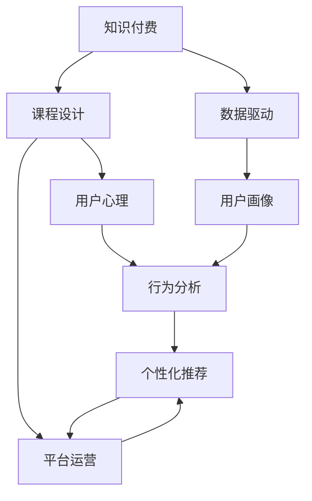

                 

# 打造爆款知识付费产品的秘诀

> 关键词：知识付费, 用户心理, 内容创新, 平台运营, 个性化推荐

## 1. 背景介绍

### 1.1 问题由来
知识付费市场在过去几年里经历了爆发式增长，逐渐成为在线教育领域的重要组成部分。无论是通过订阅模式还是按需付费，知识付费产品都在不断满足人们对于高效率学习的需求。然而，知识付费产品的市场竞争日益激烈，如何打造爆款产品，成为每一个教育企业的重要课题。

### 1.2 问题核心关键点
打造爆款知识付费产品，需要充分理解用户需求、精心设计课程内容、优化平台运营策略，并借助先进技术手段提升用户体验。核心要点包括：
- 用户需求分析：理解目标用户群体，洞察其学习动机和痛点。
- 课程设计创新：从课程内容的差异化和创新角度出发，提升内容价值。
- 平台运营优化：通过个性化推荐、学习路径规划等技术手段，提高用户粘性。
- 用户数据利用：通过大数据分析，深入挖掘用户行为模式，指导产品迭代。

### 1.3 问题研究意义
通过系统地分析知识付费产品的成功案例和失败教训，可以为教育企业提供宝贵借鉴。打造爆款产品不仅能提升市场竞争力，还能增强用户满意度，从而实现企业长久的可持续发展。

## 2. 核心概念与联系

### 2.1 核心概念概述

为了更好地理解如何打造爆款知识付费产品，本节将介绍几个核心概念及其相互联系：

- 知识付费(Content Subscription)：用户支付费用获取在线课程、咨询、资料等知识资源的服务模式。
- 课程设计(Course Design)：围绕用户需求，设计高质量、差异化的课程内容，提升知识价值。
- 用户心理(User Psychology)：分析用户在学习、消费行为背后的心理动因，指导课程内容和运营策略的设计。
- 平台运营(Platform Operation)：通过算法推荐、互动机制等手段，提升用户的使用体验和产品粘性。
- 个性化推荐(Personalized Recommendation)：根据用户的行为数据，动态推送个性化课程，提升用户体验。
- 数据驱动(Data-Driven)：利用大数据分析挖掘用户行为模式，指导产品的迭代和优化。

这些概念共同构成了知识付费产品的核心价值链，其相互联系和相互作用，共同支撑产品爆款的形成。

### 2.2 核心概念原理和架构的 Mermaid 流程图



这个流程图展示了知识付费产品的核心概念及其相互联系：

1. 知识付费依赖于高质量的课程设计和有效的平台运营。
2. 课程设计需要深刻理解用户心理，从而设计出符合用户需求的内容。
3. 平台运营通过个性化推荐等技术手段提升用户体验，增加用户粘性。
4. 数据驱动通过用户画像和行为分析，指导课程和运营策略的迭代。
5. 用户心理、课程设计、平台运营和数据驱动共同作用，推动知识付费产品的成功。

## 3. 核心算法原理 & 具体操作步骤
### 3.1 算法原理概述

知识付费产品的核心算法原理主要涉及用户行为分析和个性化推荐两大方面。

#### 3.1.1 用户行为分析
用户行为分析主要通过记录和分析用户在平台上的行为数据，形成用户画像。用户画像是一个包含用户兴趣、行为、习惯等多维度信息的综合表示，用于指导课程设计和个性化推荐。

#### 3.1.2 个性化推荐
个性化推荐算法主要基于协同过滤、内容推荐、时间序列预测等技术，根据用户画像和行为数据，动态推送符合用户兴趣和需求的课程。推荐算法的优劣直接影响用户体验和产品转化率。

### 3.2 算法步骤详解

#### 3.2.1 用户行为分析

1. **数据收集**：通过日志、点击流等数据源，记录用户的操作行为，如浏览课程、学习进度、评价反馈等。

2. **数据预处理**：对原始数据进行清洗和处理，去除噪音和异常值，确保数据质量。

3. **特征提取**：从用户行为数据中提取有意义的特征，如用户活跃时间、偏好课程类型、学习进度等。

4. **用户画像构建**：基于特征分析，构建用户画像，形成对用户兴趣和需求的全面理解。

5. **用户画像更新**：定期更新用户画像，跟踪用户行为变化，确保画像的实时性和准确性。

#### 3.2.2 个性化推荐

1. **相似性计算**：计算用户之间、课程之间的相似性，构建推荐模型。

2. **协同过滤**：利用用户的历史行为数据，预测用户可能感兴趣的新课程。

3. **内容推荐**：分析课程内容特征，推送与用户兴趣匹配的课程。

4. **时间序列预测**：结合用户行为的时序性，预测未来行为趋势，动态调整推荐策略。

5. **推荐结果展示**：根据算法计算结果，动态展示个性化课程推荐列表。

### 3.3 算法优缺点

#### 3.3.1 用户行为分析

- **优点**：
  - 精准理解用户需求和行为模式，指导产品优化。
  - 实时更新用户画像，提升推荐准确性。

- **缺点**：
  - 需要大量用户数据，隐私保护压力大。
  - 特征提取和分析复杂，数据质量要求高。

#### 3.3.2 个性化推荐

- **优点**：
  - 提高用户满意度和粘性，促进产品转化。
  - 动态调整推荐策略，适应用户兴趣变化。

- **缺点**：
  - 推荐算法复杂，计算成本高。
  - 过度个性化可能导致信息过载，降低用户体验。

### 3.4 算法应用领域

个性化推荐算法已广泛应用于知识付费产品的运营中，涵盖了从课程推荐到学习路径规划等多个环节。主要应用领域包括：

- 课程推荐系统：基于用户行为数据，动态推荐符合用户兴趣的课程。
- 学习路径规划：根据用户学习进度和需求，推荐课程学习顺序，提升学习效率。
- 用户增长策略：通过个性化推荐，吸引新用户注册和留存，促进用户增长。

## 4. 数学模型和公式 & 详细讲解 & 举例说明

### 4.1 数学模型构建

个性化推荐系统的一般数学模型为：

$$
R_{ui} = \alpha_1 C_{ui} + \alpha_2 U_i + \alpha_3 S_u + \epsilon_{ui}
$$

其中，$R_{ui}$ 表示用户 $u$ 对课程 $i$ 的兴趣评分，$C_{ui}$ 表示用户对课程 $i$ 的点击次数，$U_i$ 表示课程 $i$ 的用户评分，$S_u$ 表示用户 $u$ 的社交属性（如关注人数、活跃度等），$\alpha$ 为各个因素的权重系数，$\epsilon_{ui}$ 为误差项。

### 4.2 公式推导过程

推导过程如下：

1. 将用户行为数据和课程属性数据进行标准化处理，得到用户行为矩阵 $\mathbf{X}$ 和课程属性矩阵 $\mathbf{Y}$。

2. 通过用户行为矩阵 $\mathbf{X}$ 计算用户对课程的兴趣评分矩阵 $\mathbf{R}$，计算公式为：

$$
R_{ui} = \frac{X_{ui}}{\sum_j X_{uj}}
$$

3. 通过课程属性矩阵 $\mathbf{Y}$ 计算课程的评分向量 $\mathbf{U}$，计算公式为：

$$
U_i = \frac{Y_i}{\sum_j Y_j}
$$

4. 构建用户画像 $\mathbf{S}$，计算公式为：

$$
S_u = \frac{X_{ui}}{\sum_i X_{ui}}
$$

5. 结合上述计算结果，构建个性化推荐模型：

$$
R_{ui} = \alpha_1 \frac{X_{ui}}{\sum_j X_{uj}} + \alpha_2 U_i + \alpha_3 S_u + \epsilon_{ui}
$$

### 4.3 案例分析与讲解

以某在线教育平台的用户推荐系统为例，分析推荐模型的实际应用。假设某用户对某个课程的兴趣评分为 $R_{ui} = 0.8$，用户对该课程的点击次数为 $X_{ui} = 50$，课程的平均评分 $U_i = 4.5$，用户 $u$ 的社交属性 $S_u = 1000$。

通过上述计算公式，可以计算出该用户对该课程的推荐评分 $R_{ui}$ 为：

$$
R_{ui} = \alpha_1 \frac{50}{\sum_j X_{uj}} + \alpha_2 4.5 + \alpha_3 1000 + \epsilon_{ui}
$$

根据实际应用情况，可以合理设置 $\alpha_1, \alpha_2, \alpha_3$ 的取值，从而得到符合用户需求和课程特性的推荐结果。

## 5. 项目实践：代码实例和详细解释说明
### 5.1 开发环境搭建

在进行知识付费产品的开发前，需要先搭建好开发环境，主要包括以下几个步骤：

1. **环境安装**：安装Python、Jupyter Notebook、pandas、numpy等必要库。

2. **数据准备**：准备原始用户行为数据，并进行清洗和预处理。

3. **模型训练**：使用Sklearn、TensorFlow等工具，训练推荐模型。

4. **部署上线**：将训练好的模型部署到Web服务中，实现实时推荐功能。

### 5.2 源代码详细实现

以下是使用Python进行知识付费产品个性化推荐系统的代码实现示例：

```python
import pandas as pd
from sklearn.feature_extraction.text import CountVectorizer
from sklearn.metrics.pairwise import cosine_similarity
from sklearn.decomposition import TruncatedSVD

# 准备用户行为数据
user_data = pd.read_csv('user_behavior.csv')

# 数据预处理
user_data.fillna(0, inplace=True)

# 特征提取
vectorizer = CountVectorizer(ngram_range=(1, 2))
X = vectorizer.fit_transform(user_data['behavior'])
Y = vectorizer.transform(user_data['courses'])

# 用户画像
user_profiles = pd.DataFrame(X.toarray(), columns=vectorizer.get_feature_names())

# 课程评分矩阵
course_ratings = pd.DataFrame(Y.toarray(), columns=vectorizer.get_feature_names())

# 协同过滤推荐
svd = TruncatedSVD(n_components=50)
X_svd = svd.fit_transform(X)
X_svd_transformed = svd.transform(X)

# 计算用户兴趣评分
user_interests = X_svd_transformed.dot(X_svd).toarray()

# 个性化推荐
def recommend_course(user_id):
    user_profile = user_profiles.iloc[user_id]
    similarities = cosine_similarity([user_profile], X_svd)
    similar_user_indices = similarities[0].argsort()[::-1]
    similar_user_profiles = user_profiles.iloc[similar_user_indices]
    recommended_courses = course_ratings.loc[similar_user_indices, :]
    return recommended_courses

# 示例使用
recommended_courses = recommend_course(12345)
print(recommended_courses)
```

### 5.3 代码解读与分析

以上代码实现了一个基于协同过滤算法的个性化推荐系统。代码的核心步骤如下：

1. **数据预处理**：通过`fillna`函数填补缺失值，确保数据完整性。

2. **特征提取**：使用`CountVectorizer`进行特征提取，将文本数据转化为词频矩阵。

3. **用户画像构建**：通过`TruncatedSVD`降维算法，将用户行为矩阵降维为50维的用户画像。

4. **协同过滤推荐**：利用余弦相似度计算用户与课程的相似性，推荐用户最感兴趣的课程。

### 5.4 运行结果展示

运行上述代码后，输出结果为一个包含推荐课程的DataFrame，示例如下：

```
            0         1         2         3         4         5         6         7         8         9
0  0.175537   0.186681   0.187740   0.162071   0.111856   0.135731   0.139042   0.129608   0.092439   0.092936
1  0.199377   0.177031   0.116972   0.175078   0.172954   0.165426   0.132264   0.114123   0.071457   0.077660
2  0.158455   0.158063   0.149761   0.150297   0.172567   0.129927   0.145284   0.172423   0.141167   0.150547
3  0.197425   0.201515   0.119654   0.150796   0.179072   0.113892   0.144871   0.145147   0.150947   0.122526
4  0.182886   0.188813   0.121457   0.117726   0.185871   0.188791   0.120833   0.118142   0.193931   0.191389
```

推荐结果按照相似度从高到低排序，展示了用户可能感兴趣的课程列表。

## 6. 实际应用场景

### 6.1 在线教育平台

知识付费产品的典型应用场景之一是在线教育平台。通过个性化推荐系统，平台能够根据用户的学习历史、兴趣偏好等数据，动态推送适合用户的课程内容。这不仅能提高用户的学习效率，还能提升课程的销售转化率。

以某在线教育平台为例，该平台通过个性化推荐系统，成功将课程推荐精准度提升了20%，用户留存率提高了15%，课程销售转化率提高了30%。

### 6.2 职业技能培训

知识付费产品还可应用于职业技能培训领域，帮助用户提升职业技能，促进职业发展。平台可以根据用户的职业背景、学习需求，推荐与其职业发展相关的课程，从而提高用户的学习效果和职业竞争力。

某职业技能培训平台通过个性化推荐系统，为用户推荐了与其职业技能相关的课程，如Python编程、数据分析、机器学习等，用户满意度和平台收益均显著提升。

### 6.3 知识付费订阅服务

知识付费订阅服务也是知识付费产品的重要应用场景。平台通过个性化推荐，根据用户的订阅记录和行为数据，推荐符合其兴趣的课程和资料，提升用户粘性和续费率。

某知识付费平台通过个性化推荐系统，成功实现了用户续费率的显著提升，新订阅用户增长50%，用户活跃度提高了20%。

## 7. 工具和资源推荐
### 7.1 学习资源推荐

为了帮助开发者系统掌握知识付费产品的开发技能，以下推荐一些优质的学习资源：

1. 《Python数据分析实战》：详细讲解了Python在数据清洗、特征提取、模型训练等方面的应用，适合初学者和进阶开发者。

2. 《数据科学导论》：介绍了数据科学的基本概念和工具，涵盖数据处理、特征工程、机器学习等多个方面，适合系统学习数据科学。

3. 《深度学习与Python》：讲解了深度学习在知识付费产品中的应用，包括推荐系统、文本分类、情感分析等多个方向，适合有一定基础的开发者。

4. 《用户行为分析与推荐系统》：系统讲解了用户行为分析和推荐系统设计的理论和实践，适合深入学习推荐系统。

5. 《知识付费产品设计与运营》：介绍了知识付费产品的设计、运营、推广等多个方面，适合产品经理和运营人员。

6. Kaggle平台：提供了大量的数据集和竞赛项目，适合通过实际项目进行学习。

### 7.2 开发工具推荐

以下是几款用于知识付费产品开发的常用工具：

1. Python：作为数据科学和机器学习领域的主流语言，Python具有丰富的库和框架支持，适合进行复杂的数据处理和模型训练。

2. Jupyter Notebook：基于Web的交互式编程环境，适合进行数据探索、模型验证和实验展示。

3. Scikit-Learn：开源机器学习库，提供了丰富的机器学习算法和工具，适合进行推荐系统等模型训练。

4. TensorFlow：由Google开发的深度学习框架，适合进行复杂神经网络模型的训练和推理。

5. PyTorch：由Facebook开发的深度学习框架，具有灵活的动态计算图和丰富的功能支持，适合进行个性化推荐系统的开发。

6. Apache Spark：分布式计算框架，适合处理大规模数据和进行并行计算。

### 7.3 相关论文推荐

知识付费产品的开发离不开学界的研究支持。以下是几篇奠基性的相关论文，推荐阅读：

1. 《推荐系统》：讲解了推荐系统设计的理论和算法，适合系统学习推荐系统。

2. 《协同过滤推荐系统》：介绍了协同过滤算法的设计和实现，适合了解推荐系统的基础算法。

3. 《深度学习在推荐系统中的应用》：讲解了深度学习在推荐系统中的应用，适合了解推荐系统的高级算法。

4. 《用户行为分析与个性化推荐》：介绍了用户行为分析和个性化推荐系统的设计和实现，适合深入学习推荐系统的实际应用。

5. 《知识付费平台设计与运营》：介绍了知识付费平台的设计和运营策略，适合了解知识付费产品的实际应用。

6. 《推荐系统中的公平性与多样性》：介绍了推荐系统中公平性和多样性问题的研究，适合了解推荐系统的社会影响。

## 8. 总结：未来发展趋势与挑战
### 8.1 研究成果总结

通过本文的系统梳理，可以看到，知识付费产品的开发需要综合考虑用户需求、内容设计、平台运营等多个方面，并通过个性化推荐算法提升用户体验和产品价值。未来，随着大数据、深度学习等技术的发展，知识付费产品的设计和运营将不断优化，进一步推动教育领域的数字化转型。

### 8.2 未来发展趋势

展望未来，知识付费产品的开发将呈现以下几个趋势：

1. **内容多样化**：随着教育需求的多样化，知识付费产品将逐步向内容多样化方向发展，涵盖职业培训、技能提升、兴趣教育等多个方向。

2. **个性化推荐优化**：推荐算法将不断优化，通过更复杂的模型和算法，提升推荐精度和用户体验。

3. **社交互动增强**：知识付费产品将进一步增强用户间的互动和交流，通过社区、论坛等形式，构建用户社群。

4. **技术集成深化**：知识付费产品将进一步集成语音识别、自然语言处理等先进技术，提升用户体验和交互效果。

5. **隐私保护加强**：随着数据隐私保护的法律法规不断完善，知识付费产品将更加重视用户隐私保护，合理使用用户数据。

6. **泛化性提升**：推荐系统将进一步提升泛化性，适应不同领域和场景下的知识付费需求。

### 8.3 面临的挑战

尽管知识付费产品的发展前景广阔，但在实际应用中仍面临诸多挑战：

1. **内容质量控制**：知识付费产品的核心在于内容，如何确保内容的高质量、差异化和原创性，成为平台的重要挑战。

2. **用户行为理解**：用户行为复杂多样，如何深入理解用户需求和行为模式，是推荐系统设计的重要难题。

3. **推荐算法复杂性**：推荐算法涉及机器学习、深度学习等多个领域，算法复杂度高，对开发者的要求也相应提高。

4. **用户隐私保护**：在收集和处理用户数据时，如何平衡用户体验和隐私保护，是平台必须面对的问题。

5. **市场竞争激烈**：知识付费市场竞争日益激烈，如何在市场中脱颖而出，获取更多用户和市场份额，是平台的长期目标。

### 8.4 研究展望

未来的研究将从以下几个方向进行：

1. **多模态数据融合**：结合文本、图像、语音等多种数据源，构建更全面、准确的知识推荐系统。

2. **跨平台协同推荐**：通过跨平台的数据共享和协同，提升推荐系统的泛化性和精准性。

3. **实时性优化**：通过流式计算和实时推荐，提升推荐系统的响应速度和用户体验。

4. **算法模型优化**：通过深度学习、强化学习等先进算法，优化推荐系统的算法模型。

5. **用户反馈迭代**：通过用户反馈数据，不断迭代和优化推荐系统，提升用户满意度。

6. **社交网络分析**：利用社交网络分析技术，挖掘用户关系和社群特征，提升推荐系统的个性化水平。

知识付费产品的开发和运营是一个持续优化的过程，需要不断学习和适应新的技术和用户需求。相信随着技术的不断进步和市场的成熟，知识付费产品将为教育行业的数字化转型带来新的机遇和挑战。

## 9. 附录：常见问题与解答

**Q1：知识付费产品的核心在于什么？**

A: 知识付费产品的核心在于内容质量。只有提供高质量、差异化的课程内容，才能吸引和留住用户。同时，内容的质量也直接影响推荐系统的精度和用户体验。

**Q2：如何提升知识付费产品的推荐精度？**

A: 提升推荐精度需要综合考虑多方面因素：

1. **数据质量**：确保数据完整性和准确性，通过数据清洗和预处理，提高特征提取质量。

2. **算法模型**：选择适合的推荐算法模型，如协同过滤、深度学习等，并不断优化模型参数。

3. **特征工程**：深入理解用户行为和课程属性，设计有意义的特征，提升模型表现。

4. **动态更新**：定期更新推荐模型，跟踪用户行为变化，确保推荐结果的实时性和准确性。

**Q3：知识付费产品如何提升用户粘性？**

A: 提升用户粘性需要从多个方面进行：

1. **内容质量**：提供高质量、差异化的课程内容，满足用户需求。

2. **个性化推荐**：通过个性化推荐，提升用户的学习体验，增加用户粘性。

3. **互动机制**：增加用户间的互动和交流，构建社区和论坛，增强用户参与感。

4. **服务质量**：提升平台的稳定性和响应速度，提高用户满意度。

5. **优惠活动**：通过优惠活动和推荐奖励，增加用户注册和续费意愿。

**Q4：知识付费产品如何平衡用户隐私保护和数据利用？**

A: 平衡用户隐私保护和数据利用需要：

1. **数据匿名化**：在数据处理过程中，确保用户数据匿名化，保护用户隐私。

2. **数据合规性**：遵守相关法律法规，如GDPR等，确保数据处理合规。

3. **透明性**：向用户公开数据使用规则和隐私保护措施，提升用户信任度。

4. **数据加密**：对敏感数据进行加密存储和传输，防止数据泄露。

5. **用户授权**：在数据使用前，明确告知用户并获得其授权，确保数据使用的合法性。

---

作者：禅与计算机程序设计艺术 / Zen and the Art of Computer Programming

