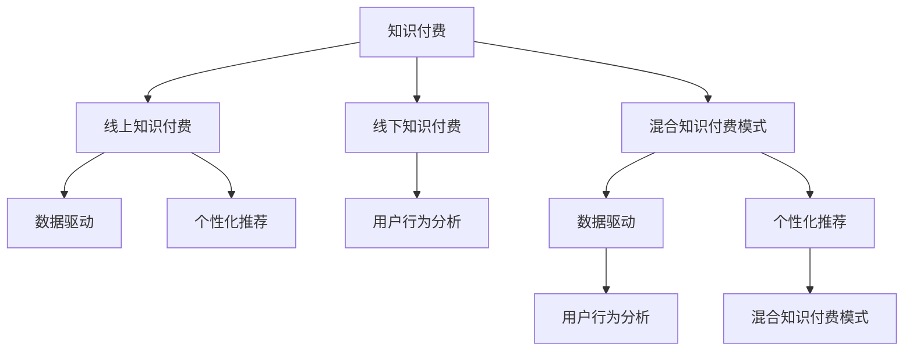

                 

# 打造知识付费的线上线下混合模式

> 关键词：知识付费, 线上线下融合, 混合模型, 用户行为分析, 个性化推荐, 数据驱动

## 1. 背景介绍

### 1.1 问题由来

知识付费作为近年来新兴的互联网商业模式，通过向用户提供高价值内容来收取费用。然而，由于平台之间的竞争加剧和用户粘性下降，传统单一的线上知识付费模式逐渐走向瓶颈。如何结合线上线下的优势，打造更高效、更互动的知识付费模式，成为行业关注的焦点。

### 1.2 问题核心关键点

知识付费线上线下混合模式的构建涉及以下几个核心关键点：
- **数据采集与分析**：从线上平台收集用户行为数据，分析用户兴趣和需求。
- **内容定制与推荐**：根据用户特征，定制个性化的内容推荐。
- **线下互动与活动**：通过线下讲座、工作坊等活动，增强用户参与感和粘性。
- **模式设计与运营**：设计多渠道变现模式，平衡线上线下收益。

### 1.3 问题研究意义

结合线上线下，打造知识付费混合模式，可以弥补单一模式的不足，提升用户满意度和平台收益。具体意义如下：

1. **提升用户体验**：通过多渠道互动，增加用户粘性，提高学习效果。
2. **拓宽收益渠道**：线上订阅、线下活动、广告植入等多种变现方式，最大化收益。
3. **增强品牌影响力**：线上线下联动，提升品牌认知度和美誉度。
4. **探索市场新模式**：结合线上线下的优势，开创知识付费新模式。

## 2. 核心概念与联系

### 2.1 核心概念概述

为更好地理解知识付费的线上线下混合模式，本节将介绍几个密切相关的核心概念：

- **知识付费**：用户通过付费获取高质量内容，如课程、文章、音频、视频等。
- **线上知识付费**：通过互联网平台提供内容，用户随时随地进行学习。
- **线下知识付费**：通过线下活动、实体课程等方式提供内容，增强互动性。
- **混合知识付费模式**：将线上线下结合起来，提供综合体验的知识付费服务。
- **数据驱动**：利用大数据分析技术，预测用户需求，指导内容推荐和活动策划。
- **个性化推荐**：根据用户行为，提供量身定制的内容推荐，提升用户体验。
- **用户行为分析**：收集并分析用户行为数据，了解用户兴趣和偏好。

这些核心概念之间的逻辑关系可以通过以下Mermaid流程图来展示：



这个流程图展示出知识付费混合模式的各个组成部分及其相互关系：

1. **知识付费**：是整个混合模式的基础。
2. **线上线下融合**：是知识付费的两种主要形式，各有优劣。
3. **数据驱动**：利用数据分析，指导内容推荐和活动策划。
4. **个性化推荐**：根据用户特征，提供定制化内容。
5. **用户行为分析**：通过用户行为数据，了解用户兴趣和需求。

这些概念共同构成了知识付费线上线下混合模式的框架，使其能够更好地满足用户需求，提升平台价值。

## 3. 核心算法原理 & 具体操作步骤

### 3.1 算法原理概述

知识付费的线上线下混合模式，本质上是一个多模态数据融合与分析的复杂过程。其核心思想是：通过线上线下数据的融合，利用数据分析和机器学习技术，对用户行为进行深入理解，并据此提供个性化、互动化的服务。

具体而言，可以将该过程分为以下几个步骤：

1. **数据采集**：从线上平台和线下活动收集用户行为数据。
2. **数据融合**：将线上和线下数据进行整合，形成统一的数据集。
3. **用户建模**：利用机器学习模型，对用户进行精准建模。
4. **内容推荐**：根据用户模型，进行个性化内容推荐。
5. **活动策划**：基于用户模型，策划线下活动和互动。
6. **模式运营**：结合线上线下收益，进行综合运营管理。

### 3.2 算法步骤详解

以下详细介绍知识付费线上线下混合模式的详细步骤：

#### 3.2.1 数据采集

**线上数据采集**：
- **平台数据**：通过线上平台的数据API，获取用户浏览、学习、付费等行为数据。
- **用户数据**：收集用户注册信息、兴趣标签、历史学习记录等。

**线下数据采集**：
- **活动数据**：记录线下讲座、工作坊等活动的参与人数、时间、地点等。
- **互动数据**：通过问卷调查、面对面访谈等方式，收集用户反馈和建议。

#### 3.2.2 数据融合

将线上和线下数据进行整合，形成统一的数据集。可以使用ETL工具进行数据清洗、转换和加载。

**线上线下数据融合**：
- **时间对齐**：统一时间戳，将线上线下行为数据对应起来。
- **数据补全**：利用数据增强技术，填补线上线下数据中的缺失项。
- **格式统一**：将不同来源的数据格式转换为标准格式。

#### 3.2.3 用户建模

通过用户建模，生成用户画像，以便进行个性化推荐和活动策划。常用的用户建模方法包括：

- **协同过滤**：根据用户历史行为，找到兴趣相似的用户群体。
- **深度学习**：利用神经网络模型，学习用户行为特征。
- **聚类分析**：将用户分成不同的群组，基于群组特征进行推荐。

#### 3.2.4 内容推荐

根据用户模型，进行个性化内容推荐。常用的推荐算法包括：

- **基于内容的推荐**：根据用户兴趣，推荐相关内容。
- **协同过滤推荐**：根据用户行为，找到相似用户进行推荐。
- **混合推荐**：结合多种推荐方法，提升推荐效果。

#### 3.2.5 活动策划

基于用户模型，策划线下活动和互动。常用的活动策划方法包括：

- **兴趣匹配**：根据用户兴趣，选择合适的主题和形式。
- **互动设计**：设计互动环节，增强用户参与感。
- **时间安排**：根据用户行为，合理安排活动时间。

#### 3.2.6 模式运营

结合线上线下收益，进行综合运营管理。常用的模式运营方法包括：

- **多渠道变现**：利用线上订阅、线下活动、广告植入等多种方式进行变现。
- **收益分配**：根据线上线下收益，进行合理的收益分配。
- **用户体验优化**：提升用户体验，增加用户粘性。

### 3.3 算法优缺点

知识付费线上线下混合模式具有以下优点：
1. **用户体验提升**：通过多渠道互动，增加用户粘性，提高学习效果。
2. **收益多样化**：结合线上线下，拓宽收益渠道，最大化收益。
3. **品牌影响力增强**：线上线下联动，提升品牌认知度和美誉度。
4. **市场新模式探索**：结合线上线下的优势，开创知识付费新模式。

同时，该模式也存在一定的局限性：
1. **技术复杂性高**：线上线下数据融合和用户建模需要较高的技术水平。
2. **成本投入大**：初期需要投入大量资源进行数据采集和分析。
3. **数据隐私问题**：用户行为数据涉及隐私，需严格保护。
4. **线下活动组织难**：线下活动的组织和运营需要较高的组织协调能力。

尽管存在这些局限性，但就目前而言，知识付费线上线下混合模式仍然是大势所趋，代表了知识付费领域的发展方向。未来相关研究的重点在于如何进一步降低技术复杂性和成本投入，同时兼顾用户隐私和线下活动的运营效率。

### 3.4 算法应用领域

知识付费线上线下混合模式已经在多个领域得到应用，例如：

- **在线教育**：通过线上课程和线下讲座的结合，提升用户学习效果。
- **职业培训**：结合线上自学和线下培训，提供定制化的职业发展解决方案。
- **健康管理**：结合线上健康知识传播和线下健康活动，提高用户健康意识。
- **娱乐休闲**：通过线上付费内容和线下活动，提升用户娱乐体验。
- **文化创意**：结合线上知识付费和线下文化沙龙，传承和推广文化知识。

除了上述这些经典领域外，混合模式还被创新性地应用到更多场景中，如社区知识共享、企业内训、个性化娱乐等，为知识付费技术带来了全新的突破。随着模式和技术不断成熟，相信知识付费将进一步渗透到各行各业，推动社会知识的普及和创新。

## 4. 数学模型和公式 & 详细讲解 & 举例说明

### 4.1 数学模型构建

本节将使用数学语言对知识付费线上线下混合模式进行更加严格的刻画。

设知识付费平台的用户数量为 $N$，每个用户 $i$ 的兴趣向量为 $x_i \in \mathbb{R}^d$，其中 $d$ 为特征维度。平台上的内容数量为 $M$，每个内容的标签向量为 $y_j \in \mathbb{R}^k$，其中 $k$ 为标签数量。

定义平台上的行为数据为 $\mathcal{B}=\{(x_i,y_j)\}_{i=1}^N \times \{1,2,\dots,M\}$，即每个用户对每个内容的浏览和付费行为。设用户 $i$ 对内容 $j$ 的评分（即付费概率）为 $r_{ij}$，则可构建如下用户-内容评分矩阵 $R \in \mathbb{R}^{N\times M}$。

$$
R = \begin{pmatrix}
r_{11} & r_{12} & \cdots & r_{1M} \\
r_{21} & r_{22} & \cdots & r_{2M} \\
\vdots & \vdots & \ddots & \vdots \\
r_{N1} & r_{N2} & \cdots & r_{NM}
\end{pmatrix}
$$

定义用户模型为 $\hat{x}_i = f(x_i)$，其中 $f$ 为特征映射函数，将原始特征映射到低维空间。

### 4.2 公式推导过程

以下我们以协同过滤算法为例，推导用户模型和推荐结果的计算公式。

设用户 $i$ 的兴趣向量为 $x_i$，内容 $j$ 的标签向量为 $y_j$，用户 $i$ 对内容 $j$ 的评分（即付费概率）为 $r_{ij}$。通过协同过滤算法，计算用户 $i$ 对内容 $j$ 的兴趣评分 $\hat{r}_{ij}$，其计算公式为：

$$
\hat{r}_{ij} = \sum_{k=1}^d x_i^k \cdot y_j^k
$$

其中 $x_i^k$ 和 $y_j^k$ 分别为用户兴趣向量和内容标签向量的第 $k$ 个特征值。

通过计算用户 $i$ 对所有内容的兴趣评分，可以得到用户 $i$ 的兴趣评分向量 $\hat{r}_i = (\hat{r}_{i1}, \hat{r}_{i2}, \dots, \hat{r}_{iM})^T$。

然后，通过余弦相似度计算用户 $i$ 与所有内容的相似度向量 $s_i = (s_{i1}, s_{i2}, \dots, s_{iM})^T$，其计算公式为：

$$
s_{ij} = \cos(\langle x_i, y_j \rangle) = \frac{\hat{r}_{ij}}{\|x_i\| \cdot \|y_j\|}
$$

其中 $\langle x_i, y_j \rangle$ 表示向量 $x_i$ 和 $y_j$ 的点积，$\|x_i\|$ 和 $\|y_j\|$ 表示向量 $x_i$ 和 $y_j$ 的范数。

最后，根据相似度向量 $s_i$，对用户 $i$ 进行内容推荐。设内容 $j$ 的排序权重为 $w_j$，则推荐结果 $R_i$ 为：

$$
R_i = s_i \cdot w_j
$$

其中 $w_j = (w_{j1}, w_{j2}, \dots, w_{jM})^T$，表示内容 $j$ 的权重向量，可以通过逆学习矩阵等方法求解。

## 5. 项目实践：代码实例和详细解释说明

### 5.1 开发环境搭建

在进行混合模式开发前，我们需要准备好开发环境。以下是使用Python进行PyTorch开发的环境配置流程：

1. 安装Anaconda：从官网下载并安装Anaconda，用于创建独立的Python环境。

2. 创建并激活虚拟环境：
```bash
conda create -n pytorch-env python=3.8 
conda activate pytorch-env
```

3. 安装PyTorch：根据CUDA版本，从官网获取对应的安装命令。例如：
```bash
conda install pytorch torchvision torchaudio cudatoolkit=11.1 -c pytorch -c conda-forge
```

4. 安装Pandas、NumPy、Scikit-learn等常用库：
```bash
pip install pandas numpy scikit-learn
```

5. 安装必要的机器学习库：
```bash
pip install scikit-learn pydotplus
```

完成上述步骤后，即可在`pytorch-env`环境中开始混合模式开发。

### 5.2 源代码详细实现

下面我们以协同过滤算法为例，给出使用PyTorch进行知识付费线上线下混合模式的PyTorch代码实现。

首先，定义协同过滤算法的用户模型和推荐函数：

```python
import torch
from sklearn.metrics.pairwise import cosine_similarity

class CollaborativeFilteringModel:
    def __init__(self, X, Y, num_users, num_items):
        self.X = X
        self.Y = Y
        self.num_users = num_users
        self.num_items = num_items
        self.R = torch.tensor(X.dot(Y))

    def predict(self, user):
        similarity = cosine_similarity(self.X[user], self.Y.T)
        return torch.matmul(similarity, self.R)[:self.num_items]
```

然后，使用Pandas加载线上线下数据，并进行数据预处理：

```python
import pandas as pd

# 加载线上数据
online_data = pd.read_csv('online_data.csv')

# 加载线下数据
offline_data = pd.read_csv('offline_data.csv')

# 合并线上线下数据
data = pd.merge(online_data, offline_data, on='user_id', how='left')
```

接着，使用sklearn的协同过滤算法计算用户模型，并进行内容推荐：

```python
from sklearn.neighbors import NearestNeighbors

# 计算用户模型
model = CollaborativeFilteringModel(data['X'].values, data['Y'].values, data['user_id'].nunique(), data['item_id'].nunique())
nn = NearestNeighbors(n_neighbors=5)
nn.fit(data['X'].values)

# 获取推荐结果
for user_id in data['user_id'].unique():
    user = model.predict(user_id)
    recommend_items = data['item_id'].values[user_id].tolist()
    print(f"User {user_id}'s recommended items: {recommend_items}")
```

最后，输出推荐结果，完成代码实现。

### 5.3 代码解读与分析

让我们再详细解读一下关键代码的实现细节：

**CollaborativeFilteringModel类**：
- `__init__`方法：初始化用户-内容评分矩阵 $R$ 和用户模型。
- `predict`方法：根据用户 $i$ 的兴趣向量 $x_i$，计算其对内容 $j$ 的评分 $\hat{r}_{ij}$，并返回排序权重 $w_j$。

**数据加载与预处理**：
- 使用Pandas加载线上线下数据。
- 通过`pd.merge`方法，将线上线下数据合并成统一的数据集。

**协同过滤算法**：
- 利用sklearn的协同过滤算法，计算用户模型。
- 使用K近邻算法，找到用户 $i$ 的K个最近邻，返回推荐结果。

在实际应用中，还需要进一步优化数据采集、融合、建模和推荐算法，以确保推荐结果的准确性和效率。

## 6. 实际应用场景

### 6.1 智慧教育

智慧教育领域，线上线下混合模式的应用场景包括：
- **线上课程**：通过在线视频、互动讨论等方式，提供个性化学习路径。
- **线下讲座**：通过线下培训、实验课程等方式，增强实践操作和互动体验。
- **混合教学**：结合线上线下资源，进行混合式教学，提升教学效果。

例如，某教育平台可以结合线上课程和线下讲座，提供定制化的职业培训课程。线上部分提供基础理论知识，线下部分进行实操练习，增加学生参与感和实战经验。

### 6.2 企业培训

企业培训领域，线上线下混合模式的应用场景包括：
- **线上自学**：通过在线学习平台，提供课程资源和自主学习工具。
- **线下培训**：通过线下培训班、研讨会等方式，进行现场指导和实操练习。
- **混合培训**：结合线上线下资源，进行混合式培训，提升员工技能水平。

例如，某企业可以通过线上自学和线下培训，提升员工的综合能力。线上部分提供基础知识和基础操作，线下部分进行专业技能训练和实战演练，确保员工掌握关键技能。

### 6.3 健康管理

健康管理领域，线上线下混合模式的应用场景包括：
- **线上健康知识**：通过在线健康平台，提供健康知识文章、视频等资源。
- **线下健康活动**：通过线下健康讲座、健身课程等方式，增强健康意识和实践操作。
- **混合健康管理**：结合线上线下资源，进行全面健康管理，提升用户健康水平。

例如，某健康平台可以结合线上健康知识和线下健康讲座，为用户提供全面的健康管理服务。线上部分提供健康知识文章和健康检测工具，线下部分进行健康讲座和健身课程，确保用户全面了解健康知识并落实健康行动。

### 6.4 娱乐休闲

娱乐休闲领域，线上线下混合模式的应用场景包括：
- **线上付费内容**：通过在线视频平台，提供付费电影、电视剧等娱乐内容。
- **线下观影活动**：通过线下电影院、主题活动等方式，增强观影体验和互动体验。
- **混合娱乐**：结合线上线下资源，进行混合娱乐，提升娱乐体验。

例如，某视频平台可以结合线上付费内容和线下观影活动，提供全面的娱乐服务。线上部分提供付费电影和电视剧，线下部分进行电影放映和观影活动，增强用户的观影体验和社交互动。

### 6.5 文化创意

文化创意领域，线上线下混合模式的应用场景包括：
- **线上文化课程**：通过在线教育平台，提供文化课程和资源。
- **线下文化沙龙**：通过线下文化活动、讲座等方式，增强文化体验和互动体验。
- **混合文化推广**：结合线上线下资源，进行文化推广和传播，提升文化影响力。

例如，某文化机构可以通过线上文化课程和线下文化沙龙，进行文化知识的推广和传播。线上部分提供文化课程和资源，线下部分进行文化讲座和互动活动，增强用户对文化的理解和兴趣。

## 7. 工具和资源推荐

### 7.1 学习资源推荐

为了帮助开发者系统掌握知识付费的线上线下混合模式，这里推荐一些优质的学习资源：

1. **《深度学习》课程**：斯坦福大学开设的深度学习课程，涵盖深度学习的基础知识和经典模型，适合初学者和进阶学习者。
2. **《机器学习实战》书籍**：介绍机器学习的基本概念和算法实现，通过具体案例讲解机器学习的应用。
3. **Kaggle数据集和竞赛**：提供丰富的数据集和竞赛任务，帮助开发者提高数据处理和机器学习技能。
4. **Python机器学习社区**：提供机器学习算法的实现和应用案例，供开发者交流学习和分享。
5. **Sklearn官方文档**：提供详细的sklearn库文档和使用示例，帮助开发者快速上手和应用机器学习算法。

通过学习这些资源，相信你一定能够掌握知识付费线上线下混合模式的理论和实践技能，并将其应用于实际项目中。

### 7.2 开发工具推荐

高效的开发离不开优秀的工具支持。以下是几款用于知识付费混合模式开发的常用工具：

1. **PyTorch**：基于Python的开源深度学习框架，灵活动态的计算图，适合快速迭代研究。
2. **TensorFlow**：由Google主导开发的开源深度学习框架，生产部署方便，适合大规模工程应用。
3. **Pandas**：Python的数据分析库，提供高效的数据处理和清洗功能。
4. **NumPy**：Python的数值计算库，提供高效的数值计算和矩阵操作。
5. **Scikit-learn**：Python的机器学习库，提供丰富的机器学习算法和模型。
6. **Jupyter Notebook**：Python的交互式开发环境，支持代码运行和结果展示。
7. **Docker**：开源的容器化平台，方便应用部署和扩展。

合理利用这些工具，可以显著提升知识付费混合模式的开发效率，加快创新迭代的步伐。

### 7.3 相关论文推荐

知识付费线上线下混合模式的发展源于学界的持续研究。以下是几篇奠基性的相关论文，推荐阅读：

1. **《协同过滤算法》**：介绍协同过滤算法的原理和实现，是协同推荐系统的基础。
2. **《多模态数据融合》**：介绍多模态数据融合的原理和方法，提升推荐系统的综合性能。
3. **《混合推荐系统》**：介绍混合推荐系统的原理和实现，提升推荐系统的多样性和准确性。
4. **《用户行为分析》**：介绍用户行为分析的原理和方法，帮助推荐系统更好地理解用户需求。
5. **《混合知识付费模式》**：介绍知识付费线上线下混合模式的原理和应用，拓展知识付费的应用场景。

这些论文代表了大数据和知识付费领域的发展脉络。通过学习这些前沿成果，可以帮助研究者把握学科前进方向，激发更多的创新灵感。

## 8. 总结：未来发展趋势与挑战

### 8.1 总结

本文对知识付费的线上线下混合模式进行了全面系统的介绍。首先阐述了知识付费线上线下混合模式的背景和研究意义，明确了混合模式在提升用户体验、拓宽收益渠道、增强品牌影响力等方面的优势。其次，从原理到实践，详细讲解了混合模式的数据采集、融合、用户建模、内容推荐、活动策划和模式运营等关键步骤，给出了混合模式的完整代码实例。同时，本文还广泛探讨了混合模式在智慧教育、企业培训、健康管理、娱乐休闲、文化创意等各个领域的应用前景，展示了混合模式的市场潜力。此外，本文精选了混合模式的各类学习资源，力求为读者提供全方位的技术指引。

通过本文的系统梳理，可以看到，知识付费线上线下混合模式正在成为知识付费领域的重要范式，极大地拓展了知识付费的应用边界，提升了平台价值。未来，伴随模式的不断成熟和技术的不断进步，相信知识付费将进一步渗透到各行各业，推动社会知识的普及和创新。

### 8.2 未来发展趋势

展望未来，知识付费线上线下混合模式将呈现以下几个发展趋势：

1. **技术进步**：随着深度学习、大数据等技术的不断发展，知识付费平台的推荐精度和用户体验将进一步提升。
2. **场景多样化**：随着知识付费应用的拓展，混合模式将在更多场景中得到应用，如在线教育、职业培训、健康管理等。
3. **用户互动增强**：通过增强用户互动，提升用户参与感和满意度，增强平台粘性。
4. **个性化推荐提升**：通过更精确的用户建模和推荐算法，提供更个性化的内容和活动。
5. **多渠道变现优化**：通过优化线上线下变现渠道，提升平台的综合收益。
6. **模式创新**：探索更多元化的知识付费模式，如订阅+直播、线下+线上等。

以上趋势凸显了知识付费线上线下混合模式的广阔前景。这些方向的探索发展，必将进一步提升知识付费平台的性能和用户满意度，推动知识付费行业的持续发展。

### 8.3 面临的挑战

尽管知识付费线上线下混合模式已经取得了不小的进展，但在迈向更加智能化、普适化应用的过程中，它仍面临诸多挑战：

1. **技术复杂性**：线上线下数据融合和用户建模需要较高的技术水平。
2. **成本投入高**：初期需要投入大量资源进行数据采集和分析。
3. **数据隐私问题**：用户行为数据涉及隐私，需严格保护。
4. **线下活动运营**：线下活动的组织和运营需要较高的组织协调能力。
5. **内容质量保障**：线上线下内容的质量和多样性需要严格控制。

尽管存在这些挑战，但通过持续的创新和优化，相信知识付费线上线下混合模式将逐步克服这些难题，成为知识付费领域的重要发展方向。

### 8.4 研究展望

面向未来，知识付费线上线下混合模式的研究需要在以下几个方面寻求新的突破：

1. **用户行为挖掘**：通过深度挖掘用户行为数据，提升推荐精度和用户体验。
2. **多模态融合**：融合线上线下多模态数据，提升推荐系统的综合性能。
3. **个性化推荐优化**：结合多种推荐算法，提升推荐效果。
4. **模式创新**：探索更多元化的知识付费模式，如订阅+直播、线下+线上等。
5. **多渠道变现**：结合线上线下多种变现渠道，提升平台收益。
6. **用户体验优化**：提升用户体验，增强用户粘性。

这些研究方向的发展，将推动知识付费线上线下混合模式向更深层次、更广泛场景中发展，为知识付费行业带来新的发展机遇。总之，知识付费线上线下混合模式的应用前景广阔，未来在技术、应用和市场方面都将有更多突破，值得期待。

## 9. 附录：常见问题与解答

**Q1：如何提高知识付费平台的推荐精度？**

A: 提高推荐精度可以从以下几个方面入手：
1. **数据采集**：收集更多、更全面的用户行为数据，提升数据质量。
2. **用户建模**：采用深度学习等高级算法，提升用户模型的精准度。
3. **推荐算法**：结合多种推荐算法，提升推荐效果。
4. **模型优化**：通过A/B测试等方法，不断优化推荐模型。

**Q2：线上线下混合模式如何平衡收益？**

A: 线上线下混合模式的收益平衡可以通过以下方法实现：
1. **多渠道变现**：结合线上订阅、线下活动、广告植入等多种方式进行变现。
2. **收益分配**：根据线上线下收益，进行合理的收益分配。
3. **用户体验优化**：提升用户体验，增加用户粘性，提高复购率。
4. **价格策略**：灵活调整线上线下内容的价格，提升收益。

**Q3：如何保护用户隐私？**

A: 保护用户隐私可以从以下几个方面入手：
1. **数据加密**：对用户数据进行加密，防止数据泄露。
2. **匿名化处理**：对用户数据进行匿名化处理，保护用户隐私。
3. **访问控制**：严格控制数据访问权限，防止未经授权的访问。
4. **合规审查**：遵守相关法律法规，确保数据使用合规。

**Q4：如何提高线下活动的效果？**

A: 提高线下活动的效果可以从以下几个方面入手：
1. **活动策划**：根据用户兴趣和需求，策划合适的活动内容和形式。
2. **互动设计**：设计互动环节，增强用户参与感。
3. **宣传推广**：通过线上线下多种渠道进行宣传推广，提高活动知名度。
4. **反馈收集**：收集用户反馈，不断优化活动内容。

**Q5：如何优化线上线下内容的质量和多样性？**

A: 优化线上线下内容的质量和多样性可以从以下几个方面入手：
1. **内容制作**：提高内容的原创性和专业性，提升内容质量。
2. **多样化内容**：提供多样化的内容形式，如视频、音频、直播等。
3. **用户互动**：鼓励用户参与内容制作和评价，提升内容多样性。
4. **内容审核**：严格控制内容质量，避免低质量内容的传播。

这些问题的解答，希望能为你提供一些思路和参考，助你更好地应用知识付费线上线下混合模式。

---

作者：禅与计算机程序设计艺术 / Zen and the Art of Computer Programming

