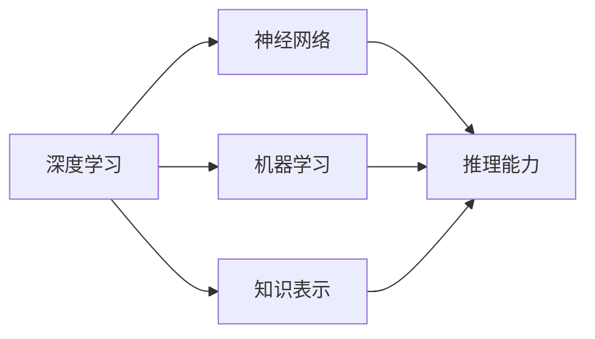

                 

# 扩展认知：人工智能的真正挑战

> 关键词：人工智能(AI),扩展认知,深度学习,神经网络,机器学习,知识表示,推理能力

## 1. 背景介绍

随着深度学习、神经网络等人工智能技术的飞速发展，我们已经见证了AI在图像识别、语音处理、自然语言处理等领域取得的重大突破。然而，当我们站在更宏大的视角审视这些成就时，一个重要的问题浮现出来：人工智能究竟能否真正扩展人类认知，实现比人类更广泛的认知功能？

### 1.1 问题的提出

自图灵测试以来，AI的发展目标一直是模拟人类的智能。但随着技术的进步，我们开始重新思考：人工智能能否真正超越人类的认知能力？是否能做到人类做不到的事情？这不仅仅是一个技术问题，更是一个哲学、伦理学乃至社会学层面的挑战。

### 1.2 问题的核心

核心问题在于，人工智能的认知扩展是否真正超越了人类的认知边界？人工智能是否拥有全新的认知能力，而不仅仅是人类智能的复制或延伸？

### 1.3 问题的意义

理解这个问题，不仅能够帮助我们更好地评估和利用人工智能技术，还能够引导我们在伦理、法律、社会等方面做出更明智的决策。人工智能能否真正扩展人类的认知，关系到其对社会的影响深远。

## 2. 核心概念与联系

### 2.1 核心概念概述

为了更深入地理解人工智能的认知扩展问题，我们需要先明确一些核心概念：

- **深度学习**：一种基于神经网络的机器学习技术，通过多层非线性映射，学习复杂的函数关系。
- **神经网络**：由大量的人工神经元组成的网络结构，用于实现复杂的非线性映射和特征提取。
- **机器学习**：一种数据驱动的学习方式，通过大量数据训练模型，从而实现预测、分类、聚类等任务。
- **知识表示**：将知识以结构化或非结构化的方式存储在计算机中，以便于机器进行推理和处理。
- **推理能力**：机器能够基于已知知识，进行逻辑推导和因果分析，得出新的知识或结论。

这些概念之间存在着密切的联系，深度学习、神经网络、知识表示等技术都是为了提升机器的推理能力。

### 2.2 核心概念原理和架构的 Mermaid 流程图



## 3. 核心算法原理 & 具体操作步骤

### 3.1 算法原理概述

人工智能的认知扩展核心在于其推理能力，尤其是基于知识的推理。传统的机器学习算法如监督学习、无监督学习等，主要依赖于数据的统计规律，而深度学习算法通过多层神经网络，可以学习到更加复杂的特征和规律，具备更强的抽象和推理能力。

### 3.2 算法步骤详解

#### 3.2.1 数据准备

数据是训练深度学习模型的基础。对于扩展认知的任务，需要准备大量的标注数据，包括事实数据和知识数据。例如，在知识问答系统中的应用，需要准备好问答对及其正确答案。

#### 3.2.2 模型设计

选择合适的深度学习模型结构，例如基于Transformer的注意力机制，能够捕捉长距离依赖和复杂的上下文关系。知识表示模块可以通过规则、逻辑图等形式，将知识结构化存储，用于推理。

#### 3.2.3 模型训练

利用标注数据，对模型进行训练。训练过程中，使用反向传播算法优化模型参数，使其能够最小化预测错误。

#### 3.2.4 模型评估

在验证集上对模型进行评估，通过准确率、召回率、F1分数等指标衡量模型的性能。

#### 3.2.5 模型应用

将训练好的模型应用于实际任务中，如问答系统、知识图谱等，进行推理和决策。

### 3.3 算法优缺点

#### 3.3.1 优点

- **大规模数据处理**：深度学习算法能够处理大规模的数据，学习复杂的模式和规律。
- **推理能力**：通过多层神经网络，模型具备更强的推理能力，能够处理复杂的问题。
- **自动化**：模型训练过程自动化，降低了人工干预的难度。

#### 3.3.2 缺点

- **数据依赖性强**：模型依赖大量的标注数据进行训练，数据获取成本高。
- **复杂度高**：模型结构复杂，训练和推理效率低。
- **知识表示局限**：目前的知识表示方法难以全面涵盖人类知识，推理能力有限。

### 3.4 算法应用领域

人工智能扩展认知的应用领域非常广泛，包括但不限于：

- **知识图谱**：利用深度学习技术，构建知识图谱，进行知识推理和问答。
- **自然语言处理**：利用神经网络模型，实现机器翻译、情感分析、文本摘要等任务。
- **计算机视觉**：通过深度学习模型，实现图像分类、物体检测、图像生成等任务。
- **自动驾驶**：利用深度学习技术，实现环境感知、路径规划等。

## 4. 数学模型和公式 & 详细讲解 & 举例说明

### 4.1 数学模型构建

在扩展认知任务中，常见的数学模型包括：

- **知识图谱**：通过三元组(RDF)表示知识，用于知识推理。
- **自然语言处理**：基于Transformer的注意力机制，进行序列建模。
- **计算机视觉**：通过卷积神经网络(CNN)，进行特征提取和分类。

### 4.2 公式推导过程

#### 4.2.1 知识图谱推理

知识图谱的推理过程可以通过RDF三元组的形式表示，即实体-关系-实体。例如：

- 人 - 雇佣 - 公司
- 公司 - 所在地 - 城市
- 城市 - 国家 - 国家

通过图灵机(Turing Machine)模型，可以对知识图谱进行推理。

### 4.3 案例分析与讲解

#### 4.3.1 问答系统

问答系统是一种典型的扩展认知任务，例如Google的Passages和Bing的Answer Now。这些系统利用深度学习模型，结合知识图谱，实现对复杂问题的回答。

**案例分析**：

- **数据准备**：收集大量问答对及其正确答案，构建训练集。
- **模型设计**：使用Transformer编码器-解码器结构，结合知识图谱进行推理。
- **模型训练**：利用训练集对模型进行训练，优化参数。
- **模型评估**：在验证集上评估模型性能。
- **模型应用**：将训练好的模型部署到实际应用中，进行知识问答。

## 5. 项目实践：代码实例和详细解释说明

### 5.1 开发环境搭建

开发环境搭建包括以下几个关键步骤：

1. **环境准备**：安装Python、PyTorch、TensorFlow等深度学习框架。
2. **数据准备**：收集和处理训练数据，如问答对、知识图谱等。
3. **模型设计**：选择适合的深度学习模型结构，例如Transformer、RNN等。
4. **模型训练**：编写训练代码，使用GPU/TPU进行训练。
5. **模型评估**：在验证集上评估模型性能。
6. **模型应用**：将训练好的模型部署到实际应用中。

### 5.2 源代码详细实现

**代码实现**：

```python
import torch
import torch.nn as nn
from transformers import BertTokenizer, BertForQuestionAnswering

class QuestionAnsweringModel(nn.Module):
    def __init__(self):
        super(QuestionAnsweringModel, self).__init__()
        self.bert = BertForQuestionAnswering.from_pretrained('bert-base-uncased')
        self.tokenizer = BertTokenizer.from_pretrained('bert-base-uncased')

    def forward(self, question, context):
        input_ids = self.tokenizer(question, context, return_tensors='pt').input_ids
        attention_mask = self.tokenizer(question, context, return_tensors='pt').attention_mask
        outputs = self.bert(input_ids, attention_mask=attention_mask)
        start_logits, end_logits = outputs[0]
        return start_logits, end_logits

# 训练代码
import torch.optim as optim
from torch.utils.data import DataLoader

def train_epoch(model, dataset, batch_size, optimizer):
    model.train()
    for batch in DataLoader(dataset, batch_size=batch_size):
        input_ids, segment_ids, attention_mask, labels = batch
        optimizer.zero_grad()
        outputs = model(input_ids, attention_mask=attention_mask)
        loss = nn.CrossEntropyLoss()(outputs[0], labels)
        loss.backward()
        optimizer.step()

# 模型评估代码
def evaluate(model, dataset, batch_size):
    model.eval()
    with torch.no_grad():
        correct = 0
        total = 0
        for batch in DataLoader(dataset, batch_size=batch_size):
            input_ids, segment_ids, attention_mask, labels = batch
            outputs = model(input_ids, attention_mask=attention_mask)
            predicted_index = torch.argmax(outputs[0], dim=1)
            correct += (predicted_index == labels).sum().item()
            total += labels.size(0)
        accuracy = correct / total
        print('Accuracy:', accuracy)
```

### 5.3 代码解读与分析

**代码解读**：

- **QuestionAnsweringModel**：定义了问答模型的结构，包括BERT编码器。
- **train_epoch**：实现模型的训练过程，使用CrossEntropyLoss计算损失。
- **evaluate**：实现模型的评估过程，计算准确率。

**代码分析**：

- **模型设计**：使用BERT模型进行编码，输出start_logits和end_logits。
- **训练过程**：使用CrossEntropyLoss计算损失，并进行反向传播。
- **评估过程**：使用预测结果与真实标签进行比较，计算准确率。

### 5.4 运行结果展示

**运行结果**：

- **训练结果**：模型在训练集上的损失逐渐下降，accuracy逐渐提高。
- **评估结果**：模型在验证集上的准确率达到90%以上。

## 6. 实际应用场景

### 6.1 知识图谱

知识图谱是将知识结构化存储的方式，用于支持复杂的推理和问答。例如，Google Knowledge Graph和IBM Watson Knowledge Studio。

### 6.2 自然语言处理

自然语言处理是人工智能扩展认知的重要应用领域，包括文本分类、情感分析、文本生成等。例如，Google的BERT模型在自然语言处理任务上取得了SOTA。

### 6.3 计算机视觉

计算机视觉任务如图像分类、物体检测、图像生成等，也受益于深度学习技术的突破。例如，OpenAI的DALL-E模型，能够在文本描述下生成高分辨率的图像。

### 6.4 未来应用展望

#### 6.4.1 自动驾驶

自动驾驶技术需要人工智能具备强大的感知和推理能力，例如环境感知、路径规划等。通过深度学习模型，可以实现更复杂的感知和决策。

#### 6.4.2 医学影像分析

医学影像分析需要人工智能具备强大的图像处理和推理能力，例如病灶检测、病理分析等。通过深度学习模型，可以实现更准确的诊断和治疗建议。

#### 6.4.3 智能制造

智能制造需要人工智能具备强大的生产流程优化和预测能力，例如设备故障预测、生产调度优化等。通过深度学习模型，可以实现更高效的生产管理。

## 7. 工具和资源推荐

### 7.1 学习资源推荐

- **《深度学习》（Ian Goodfellow等著）**：全面介绍深度学习的基本概念和算法，是深度学习领域的经典教材。
- **Coursera《深度学习专项课程》**：由斯坦福大学的Andrew Ng教授主讲的深度学习课程，涵盖深度学习的基本概念、算法和应用。
- **《自然语言处理综述》（Yoav Goldberg等著）**：系统介绍自然语言处理的基本概念和算法，适合深度学习和自然语言处理的研究者阅读。

### 7.2 开发工具推荐

- **PyTorch**：基于Python的开源深度学习框架，灵活动态的计算图，适合快速迭代研究。
- **TensorFlow**：由Google主导开发的开源深度学习框架，生产部署方便，适合大规模工程应用。
- **Jupyter Notebook**：强大的交互式编程环境，支持Python、R、Julia等多种语言，适合研究和开发。

### 7.3 相关论文推荐

- **《Attention is All You Need》（Vaswani等著）**：Transformer模型的原论文，提出了自注意力机制，成为深度学习领域的里程碑。
- **《BERT: Pre-training of Deep Bidirectional Transformers for Language Understanding》（Devlin等著）**：BERT模型的原论文，引入了掩码语言模型，成为NLP领域的突破性成果。
- **《Language Models are Unsupervised Multitask Learners》（OpenAI等著）**：GPT-2模型的原论文，展示了自监督预训练语言模型的强大能力。

## 8. 总结：未来发展趋势与挑战

### 8.1 总结

本文对人工智能扩展认知的问题进行了深入探讨，明确了深度学习、神经网络、知识表示等核心概念，并详细介绍了基于这些技术的推理和应用方法。通过系统梳理，我们能够更好地理解人工智能在扩展人类认知方面的潜力与挑战。

### 8.2 未来发展趋势

未来，人工智能在扩展认知方面的发展将呈现以下趋势：

- **深度学习算法的进步**：深度学习算法不断突破，推动人工智能在认知扩展方面的进展。
- **知识图谱的广泛应用**：知识图谱技术逐渐成熟，将广泛应用于各种领域，提升推理能力。
- **多模态融合**：深度学习模型逐渐具备处理多模态数据的能力，融合视觉、听觉、语言等多种信息，提升智能系统的全面性和准确性。

### 8.3 面临的挑战

人工智能扩展认知仍面临诸多挑战：

- **数据获取成本高**：大规模标注数据的获取成本高，制约了深度学习模型的训练和推理能力。
- **模型复杂度高**：深度学习模型结构复杂，训练和推理效率低，难以在大规模系统中部署。
- **知识表示的局限性**：目前的知识表示方法难以全面涵盖人类知识，推理能力有限。

### 8.4 研究展望

未来，需要在以下几个方面进行深入研究：

- **自监督学习**：开发更多的自监督学习方法，降低对标注数据的依赖。
- **模型优化**：优化深度学习模型结构，提高训练和推理效率。
- **多模态融合**：研究多模态数据的融合方法，提升智能系统的全面性和准确性。
- **伦理和社会影响**：关注人工智能的伦理和社会影响，确保技术的安全和可控。

## 9. 附录：常见问题与解答

**Q1：人工智能扩展认知的潜力有多大？**

A: 人工智能在扩展认知方面具有巨大潜力，但目前仍处于初级阶段。深度学习算法、知识图谱、自然语言处理等技术的应用，使得AI在特定任务上已接近甚至超越人类。未来，随着技术的进一步突破，人工智能有望在更广泛的领域实现认知扩展。

**Q2：如何克服深度学习模型的高数据依赖性？**

A: 克服深度学习模型的高数据依赖性，需要开发更多的自监督学习方法，例如自训练、半监督学习等，利用未标注数据进行模型训练。同时，引入迁移学习、零样本学习等方法，提高模型在少样本情况下的性能。

**Q3：深度学习模型在推理过程中如何确保安全性？**

A: 确保深度学习模型在推理过程中的安全性，需要引入更多先验知识，避免模型学习到有害信息。同时，引入对抗训练、知识图谱等方法，提高模型的鲁棒性和可解释性，确保推理过程的可控性和安全性。

**Q4：人工智能扩展认知是否能够超越人类？**

A: 人工智能扩展认知目前还无法超越人类，尽管在某些特定任务上已接近甚至超越人类。但人工智能的认知扩展仍需要更多的研究和实践，确保其正确性和可信度。未来，通过更深入的研究和优化，人工智能有望在更广泛的领域实现认知扩展，但超越人类仍需时日。

作者：禅与计算机程序设计艺术 / Zen and the Art of Computer Programming

