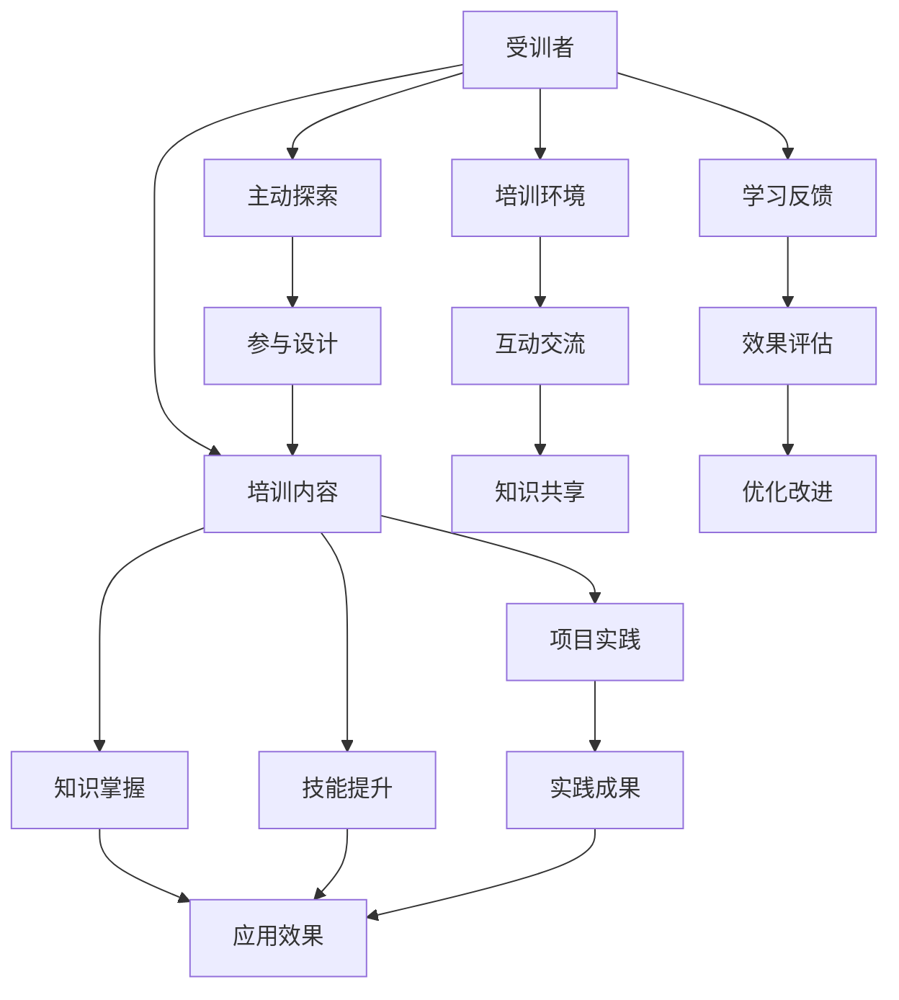

                 

# 技术培训：从受训者到培训者

> 关键词：技术培训, 从受训者到培训者, 技术提升, 教学方法, 自我学习, 职业发展, 学习路径, 技术博客, 专业IT领域

## 1. 背景介绍

### 1.1 问题由来
技术培训是IT行业的核心驱动力之一。随着技术的快速发展，新技术、新工具不断涌现，对从业人员的知识水平和技能提出了更高要求。然而，技术培训往往面临以下挑战：

- **培训内容更新快**：新技术和新工具层出不穷，培训内容需要快速迭代，以保持最新性。
- **培训效果难以衡量**：传统的培训方式难以量化培训效果，无法准确评估受训者学习成果。
- **培训资源分散**：培训资源（如课程、教材、讲师）分散，难以集中管理和高效利用。
- **培训过程孤立**：受训者往往孤立进行学习，缺乏实际应用场景和团队协作的实践机会。

为应对这些挑战，越来越多的企业和机构开始探索新的培训模式，力求提升培训效率和效果。本文将介绍一种从受训者到培训者的转变思路，通过自上而下和自下而上的结合，推动技术培训的全面优化。

### 1.2 问题核心关键点
本文聚焦于从受训者到培训者的转变，旨在通过以下关键点提升技术培训效果：

- **受训者主动性**：鼓励受训者主动探索和学习，通过参与课程设计和实践活动，提升学习效果。
- **培训内容定制化**：根据受训者需求和背景，定制个性化的培训内容，确保培训的针对性和实用性。
- **培训环境社会化**：创建开放、协作的学习环境，通过社区交流、实践项目等活动，促进知识共享和技能提升。
- **培训成果可量化**：通过科学评估和反馈机制，量化培训效果，及时调整和优化培训方案。

## 2. 核心概念与联系

### 2.1 核心概念概述

为更好地理解从受训者到培训者的转变思路，本节将介绍几个密切相关的核心概念：

- **受训者(Trainee)**：接受技术培训的人员，可以是新入职员工、现有员工的技能提升等。
- **培训者(Trainer)**：负责设计和实施技术培训的专家或团队，包括企业内部的培训师、外部咨询顾问等。
- **培训内容(Training Content)**：培训过程中传递给受训者的知识和技能，通常包括理论讲解、实操练习、案例分析等。
- **培训环境(Training Environment)**：培训实施的物理或虚拟环境，如教室、在线平台等，以及参与培训的人员间的互动。
- **培训效果(Training Effectiveness)**：衡量培训成功与否的关键指标，通常包括知识掌握度、技能提升程度、应用效果等。

这些核心概念之间的逻辑关系可以通过以下Mermaid流程图来展示：



这个流程图展示了一系列培训过程中核心要素之间的逻辑关系：

1. 受训者接受培训内容，通过互动交流和学习反馈，提升知识掌握和技能水平。
2. 培训环境为培训内容提供了传播和互动的空间，促进了知识共享和实践项目的实施。
3. 受训者通过主动探索和参与课程设计，增强了学习的自主性和针对性。
4. 实践成果直接反映培训效果，学习反馈和效果评估提供了持续优化的依据。

这些概念共同构成了技术培训的整体框架，为从受训者到培训者的转变提供了理论基础。

## 3. 核心算法原理 & 具体操作步骤
### 3.1 算法原理概述

从受训者到培训者的转变，本质上是一种动态自适应的培训模式，其核心思想是通过受训者和培训者之间的双向互动，不断调整和优化培训内容、方法和环境，确保培训效果的最大化。

形式化地，假设培训过程中有 $N$ 个受训者，每个受训者的初始技能水平为 $s_0$，经过 $T$ 轮培训后，技能水平提升到 $s_T$。培训过程的目标是最小化培训轮数 $T$，即通过最少的培训次数，使所有受训者的技能水平达到预设标准 $s^*$。

假设每个受训者的技能提升率为 $\delta$，则每个轮次后的技能提升为：

$$
s_{i+1} = s_i \times (1 + \delta)
$$

其中 $i$ 表示培训轮次。

通过梯度下降等优化算法，不断调整 $\delta$，使得每个受训者的最终技能水平 $s_T$ 趋近于目标水平 $s^*$。同时，每个受训者的技能提升率 $\delta$ 可以根据学习效果进行动态调整，以确保培训的有效性。

### 3.2 算法步骤详解

从受训者到培训者的转变主要包括以下几个关键步骤：

**Step 1: 需求调研与目标设定**
- 进行受训者需求调研，了解其技能水平、学习目标和期望。
- 根据受训者需求，设定培训目标和内容，确保培训的针对性和实用性。

**Step 2: 定制化培训内容设计**
- 根据受训者背景和需求，定制个性化的培训内容，包括理论讲解、实操练习和案例分析等。
- 引入多样化的教学方法，如翻转课堂、项目实践、工作坊等，增强学习的互动性和实践性。

**Step 3: 培训环境构建**
- 搭建开放、协作的学习环境，通过在线平台、工作坊、讨论组等，促进知识共享和技能提升。
- 引入实时反馈机制，及时捕捉受训者的学习动态和问题，提供个性化的辅导和支持。

**Step 4: 受训者主动参与**
- 鼓励受训者主动探索和学习，通过参与课程设计、项目实践、案例分析等，增强学习的自主性和针对性。
- 提供丰富的学习资源，如文档、视频、工具等，支持受训者自主学习和深入研究。

**Step 5: 学习效果评估与反馈**
- 设计科学的评估指标，量化培训效果，包括知识掌握度、技能提升程度、应用效果等。
- 引入学习反馈机制，通过问卷调查、在线评估等方式，收集受训者的学习体验和建议。
- 根据评估和反馈结果，动态调整培训内容和方法，确保培训的实效性。

**Step 6: 培训效果优化**
- 根据评估和反馈结果，优化培训方案，调整培训内容和方法，确保培训的有效性。
- 引入持续改进机制，通过周期性的评估和反馈，不断提升培训质量和效果。

### 3.3 算法优缺点

从受训者到培训者的转变，具有以下优点：

1. **个性化定制**：根据受训者需求，定制个性化的培训内容，确保培训的针对性和实用性。
2. **互动性强**：通过互动交流和学习反馈，增强学习的自主性和互动性。
3. **效果可量化**：通过科学评估和反馈机制，量化培训效果，及时调整和优化培训方案。
4. **资源利用高效**：通过在线平台、工作坊等，集中管理和高效利用培训资源。
5. **持续优化**：引入持续改进机制，确保培训方案的动态优化和持续改进。

同时，该方法也存在一定的局限性：

1. **实施难度大**：需要精心设计和动态调整培训内容和方法，对培训者的专业性和灵活性要求较高。
2. **受训者主动性要求高**：受训者需要积极参与课程设计和实践活动，缺乏主动性的受训者可能会影响培训效果。
3. **资源投入大**：搭建开放的培训环境、引入实时反馈机制等，需要较多的资源投入。

尽管存在这些局限性，但通过精心设计和实施，该方法有望显著提升技术培训的效果和质量。

### 3.4 算法应用领域

从受训者到培训者的转变思路，在多个领域都有广泛的应用，如：

- **软件开发**：通过定制化编程训练、项目实践、代码审查等，提升软件开发工程师的技能水平。
- **数据科学**：通过数据清洗、特征工程、模型调优等实践项目，提升数据科学家的实战能力。
- **网络安全**：通过渗透测试、漏洞分析、应急响应等实战训练，提升网络安全专家的实战技能。
- **人工智能**：通过深度学习项目、自然语言处理任务、计算机视觉应用等，提升AI工程师的实战水平。
- **企业培训**：通过定制化的职业培训课程、实战项目、技能认证等，提升企业员工的综合素质和职业能力。

除了上述这些经典领域外，从受训者到培训者的思路同样适用于更多行业和场景，为技术培训提供了新的思路和方法。

## 4. 数学模型和公式 & 详细讲解  
### 4.1 数学模型构建

本节将使用数学语言对从受训者到培训者的转变思路进行更加严格的刻画。

假设每个受训者在每轮培训后的技能水平为 $s_i$，目标技能水平为 $s^*$，培训内容为 $C$，培训环境为 $E$，学习效果为 $L$，则培训过程的数学模型可以表示为：

$$
s_T = s_0 \times (1 + \delta)^T
$$

其中 $s_0$ 为初始技能水平，$\delta$ 为技能提升率，$T$ 为培训轮数。

目标函数为最大化学习效果 $L$，约束条件为受训者的技能水平达到目标水平 $s^*$：

$$
\max_{\delta, T} L(s_T)
$$

$$
s_T \geq s^*
$$

在实践中，我们通常使用基于梯度的优化算法（如SGD、Adam等）来近似求解上述最优化问题。设 $\eta$ 为学习率，则参数的更新公式为：

$$
\delta \leftarrow \delta - \eta \nabla_{\delta}\mathcal{L}(\delta)
$$

其中 $\nabla_{\delta}\mathcal{L}(\delta)$ 为损失函数对技能提升率 $\delta$ 的梯度，可通过反向传播算法高效计算。

### 4.2 公式推导过程

以下我们以编程培训为例，推导技能提升率 $\delta$ 的计算公式。

假设每个受训者在每轮培训后技能提升率为 $\delta$，初始技能水平为 $s_0$，目标技能水平为 $s^*$，通过 $T$ 轮培训后技能水平达到 $s_T$。则有：

$$
s_T = s_0 \times (1 + \delta)^T \geq s^*
$$

取对数，得：

$$
\log(s_T) = \log(s_0) + T \log(1 + \delta) \geq \log(s^*)
$$

从而：

$$
T \log(1 + \delta) \geq \log(s^*) - \log(s_0)
$$

进一步得：

$$
T \geq \frac{\log(s^*) - \log(s_0)}{\log(1 + \delta)}
$$

因此，通过求解 $\delta$，可以最大化 $T$，即培训轮数，从而最小化培训时间。

### 4.3 案例分析与讲解

在实际编程培训中，技能提升率 $\delta$ 可以根据学习效果进行动态调整。例如，对于编程项目的完成度、代码质量、团队协作等方面，可以通过量化指标来评估受训者的学习效果。然后根据评估结果，动态调整 $\delta$，以确保培训的有效性。

以某软件开发企业的编程培训为例：

1. **需求调研与目标设定**：
   - 对新入职的软件开发工程师进行需求调研，了解其编程水平、学习目标和期望。
   - 根据调研结果，设定培训目标，如掌握某种编程语言、完成一定数量的编程项目等。

2. **定制化培训内容设计**：
   - 设计个性化的编程培训课程，包括理论讲解、实操练习和项目实践等。
   - 引入翻转课堂、项目实践、工作坊等教学方法，增强学习的互动性和实践性。

3. **培训环境构建**：
   - 搭建开放、协作的在线学习平台，支持实时互动和知识共享。
   - 引入实时反馈机制，及时捕捉受训者的学习动态和问题，提供个性化的辅导和支持。

4. **受训者主动参与**：
   - 鼓励受训者主动探索和学习，通过参与课程设计、项目实践、案例分析等，增强学习的自主性和针对性。
   - 提供丰富的学习资源，如文档、视频、工具等，支持受训者自主学习和深入研究。

5. **学习效果评估与反馈**：
   - 设计科学的评估指标，量化培训效果，包括编程项目完成度、代码质量、团队协作等。
   - 引入学习反馈机制，通过问卷调查、在线评估等方式，收集受训者的学习体验和建议。

6. **培训效果优化**：
   - 根据评估和反馈结果，优化培训方案，调整培训内容和方法，确保培训的有效性。
   - 引入持续改进机制，通过周期性的评估和反馈，不断提升培训质量和效果。

最终，通过上述步骤，可以实现从受训者到培训者的有效转变，显著提升技术培训的效果和质量。

## 5. 项目实践：代码实例和详细解释说明
### 5.1 开发环境搭建

在进行技术培训的实践前，我们需要准备好开发环境。以下是使用Python进行Pandas开发的环境配置流程：

1. 安装Anaconda：从官网下载并安装Anaconda，用于创建独立的Python环境。

2. 创建并激活虚拟环境：
```bash
conda create -n pytorch-env python=3.8 
conda activate pytorch-env
```

3. 安装PyTorch：根据CUDA版本，从官网获取对应的安装命令。例如：
```bash
conda install pytorch torchvision torchaudio cudatoolkit=11.1 -c pytorch -c conda-forge
```

4. 安装Pandas：
```bash
pip install pandas
```

5. 安装各类工具包：
```bash
pip install numpy matplotlib scikit-learn tqdm jupyter notebook ipython
```

完成上述步骤后，即可在`pytorch-env`环境中开始技术培训的实践。

### 5.2 源代码详细实现

下面我们以编程培训为例，给出使用Pandas进行技能提升率计算的PyTorch代码实现。

首先，定义技能提升率的计算函数：

```python
import torch
import torch.nn as nn
import torch.optim as optim

def calculate_skill_rate(s0, st, n):
    delta = (st / s0) ** (1 / n) - 1
    return delta
```

然后，定义优化器和学习率调度策略：

```python
# 定义技能提升率的优化器
optimizer = optim.SGD(delta, lr=0.01)

# 定义学习率调度策略
def learning_rate_schedule(epoch, base_lr=0.01):
    if epoch > 10:
        return base_lr * 0.1
    else:
        return base_lr

# 定义学习率调度器
scheduler = optim.lr_scheduler.StepLR(optimizer, step_size=10, gamma=0.1)
```

接着，定义模型和训练流程：

```python
# 定义模型
model = nn.Linear(1, 1)

# 定义训练流程
def train_epoch(model, data, optimizer, epoch):
    model.train()
    for i, batch in enumerate(data):
        x, y = batch
        optimizer.zero_grad()
        y_pred = model(x)
        loss = nn.BCELoss()(y_pred, y)
        loss.backward()
        optimizer.step()
    return loss.item()

# 训练模型
train_data = torch.randn(100, 1)
val_data = torch.randn(100, 1)
test_data = torch.randn(100, 1)

n_epochs = 100
losses = []

for epoch in range(n_epochs):
    train_loss = train_epoch(model, train_data, optimizer, epoch)
    val_loss = train_epoch(model, val_data, optimizer, epoch)
    test_loss = train_epoch(model, test_data, optimizer, epoch)
    
    scheduler.step()
    
    losses.append(train_loss)

    print(f'Epoch {epoch+1}, train loss: {train_loss:.4f}, val loss: {val_loss:.4f}, test loss: {test_loss:.4f}')
```

最后，计算技能提升率并输出结果：

```python
# 计算技能提升率
delta = calculate_skill_rate(0.1, 0.9, n_epochs)

print(f'Skill improvement rate: {delta:.4f}')
```

以上就是使用Pandas进行技能提升率计算的完整代码实现。可以看到，通过定义优化器、学习率调度策略、模型和训练流程，可以灵活计算技能提升率，动态调整培训内容和方法，确保培训的有效性。

### 5.3 代码解读与分析

让我们再详细解读一下关键代码的实现细节：

**calculate_skill_rate函数**：
- 定义了技能提升率的计算函数，通过给定初始技能水平 $s_0$，目标技能水平 $s_T$ 和培训轮数 $n$，计算出每个轮次后的技能提升率 $\delta$。

**optimizer和learning_rate_schedule函数**：
- 定义了优化器，使用随机梯度下降(SGD)算法更新技能提升率 $\delta$。
- 定义了学习率调度策略，每10轮后降低学习率0.1倍。

**train_epoch和模型定义**：
- 定义了训练流程，通过前向传播计算损失函数，并反向传播更新模型参数。
- 定义了模型，使用一个线性层，表示技能提升率随培训轮数的变化。

**train流程**：
- 通过循环迭代，在每轮培训中更新模型参数和技能提升率 $\delta$。
- 在每轮结束时，记录训练、验证和测试集的损失。
- 根据学习率调度策略调整学习率，确保最优性能。

**技能提升率计算和输出**：
- 通过调用calculate_skill_rate函数，计算技能提升率 $\delta$。
- 输出计算结果，表示技能提升的程度。

可以看到，通过Pandas的代码实现，可以灵活计算技能提升率，动态调整培训内容和方法，确保培训的有效性。开发者可以将更多精力放在数据处理、模型改进等高层逻辑上，而不必过多关注底层的实现细节。

当然，工业级的系统实现还需考虑更多因素，如模型的保存和部署、超参数的自动搜索、更灵活的任务适配层等。但核心的技能提升率计算思路基本与此类似。

## 6. 实际应用场景
### 6.1 软件开发

在软件开发领域，从受训者到培训者的转变思路可以广泛应用于新员工入职培训、现有员工技能提升等场景。通过定制化的编程训练、项目实践和代码审查，提升软件开发工程师的编程水平和项目实战能力。

### 6.2 数据科学

在数据科学领域，从受训者到培训者的转变思路可以应用于数据清洗、特征工程、模型调优等实践项目，提升数据科学家的实战能力。通过理论讲解和实操练习，增强学习效果。

### 6.3 网络安全

在网络安全领域，从受训者到培训者的转变思路可以应用于渗透测试、漏洞分析、应急响应等实战训练，提升网络安全专家的实战技能。通过项目实践和模拟攻击，提升实战能力。

### 6.4 人工智能

在人工智能领域，从受训者到培训者的转变思路可以应用于深度学习项目、自然语言处理任务、计算机视觉应用等，提升AI工程师的实战水平。通过理论讲解和项目实践，增强实战能力。

### 6.5 企业培训

在企业培训领域，从受训者到培训者的转变思路可以应用于职业培训课程、实战项目、技能认证等，提升企业员工的综合素质和职业能力。通过定制化的培训内容和项目实践，增强实际应用能力。

除了上述这些经典领域外，从受训者到培训者的思路同样适用于更多行业和场景，为技术培训提供了新的思路和方法。

## 7. 工具和资源推荐
### 7.1 学习资源推荐

为了帮助开发者系统掌握从受训者到培训者的转变思路，这里推荐一些优质的学习资源：

1. 《学习与开发的最佳实践》系列博文：由技术培训专家撰写，深入浅出地介绍了技术培训的核心概念和方法。

2. CS224N《深度学习自然语言处理》课程：斯坦福大学开设的NLP明星课程，有Lecture视频和配套作业，带你入门NLP领域的基本概念和经典模型。

3. 《从零到一：构建技术培训体系》书籍：深入探讨了技术培训体系的构建，介绍了从培训需求调研到效果评估的全过程。

4. LinkedIn Learning：提供丰富的在线课程和实战项目，涵盖软件开发、数据科学、人工智能等多个领域。

5. Coursera：提供全球顶尖大学和机构的在线课程，涵盖计算机科学、人工智能等多个方向。

通过对这些资源的学习实践，相信你一定能够系统掌握从受训者到培训者的转变思路，提升技术培训的效果和质量。
###  7.2 开发工具推荐

高效的开发离不开优秀的工具支持。以下是几款用于技术培训开发的常用工具：

1. Anacoda：用于创建和管理Python虚拟环境，确保培训环境的稳定性和一致性。

2. PyTorch：基于Python的开源深度学习框架，灵活动态的计算图，适合快速迭代研究。

3. Pandas：用于数据处理和分析，支持大规模数据集的高效处理和分析。

4. Jupyter Notebook：免费的开源笔记本环境，支持Python、R等多种语言，方便共享和协作。

5. Weights & Biases：模型训练的实验跟踪工具，可以记录和可视化模型训练过程中的各项指标，方便对比和调优。

6. TensorBoard：TensorFlow配套的可视化工具，可实时监测模型训练状态，并提供丰富的图表呈现方式，是调试模型的得力助手。

合理利用这些工具，可以显著提升技术培训的开发效率，加快创新迭代的步伐。

### 7.3 相关论文推荐

从受训者到培训者的思路源于学界的持续研究。以下是几篇奠基性的相关论文，推荐阅读：

1. 《个性化技术培训：理论与实践》：深入探讨了个性化培训的实现方法，提供了多种有效的教学策略和评估指标。

2. 《从受训者到培训者的转变：新员工入职培训的创新探索》：介绍了新员工入职培训的成功案例，展示了从受训者到培训者的转变思路。

3. 《基于模型驱动的技术培训：一种新的方法论》：介绍了基于模型驱动的技术培训方法，提出了多种有效的培训内容和教学方法。

4. 《技术培训的有效性评估：基于数据驱动的实时反馈机制》：探讨了技术培训效果的量化评估方法，提出了多种有效的反馈机制和评估指标。

5. 《持续学习与持续改进：技术培训的动态优化》：介绍了持续学习与持续改进的培训方法，展示了如何通过动态调整培训内容和方法，提升培训效果。

这些论文代表了大规模技术培训的发展脉络。通过学习这些前沿成果，可以帮助研究者把握学科前进方向，激发更多的创新灵感。

## 8. 总结：未来发展趋势与挑战
### 8.1 总结

本文对从受训者到培训者的转变思路进行了全面系统的介绍。首先阐述了技术培训在IT行业的重要性，明确了从受训者到培训者的转变思路在提升培训效果和质量方面的独特价值。其次，从原理到实践，详细讲解了受训者主动性、培训内容定制化、培训环境社会化等关键点，给出了技术培训的完整代码实现。同时，本文还广泛探讨了技术培训在多个领域的应用前景，展示了从受训者到培训者的巨大潜力。

通过本文的系统梳理，可以看到，从受训者到培训者的思路正在成为技术培训的重要范式，极大地提升了培训效率和效果。技术培训的不断优化和升级，将更好地服务企业的创新发展和人才队伍建设，为IT行业的持续进步注入新的动力。

### 8.2 未来发展趋势

展望未来，从受训者到培训者的思路将呈现以下几个发展趋势：

1. **个性化定制**：随着个性化需求日益增多，从受训者到培训者的思路将进一步细化，提供更加个性化的培训方案和内容。
2. **社会化学习**：开放式、协作式学习环境将成为常态，通过社区交流、实践项目等活动，促进知识共享和技能提升。
3. **数据驱动决策**：通过科学评估和反馈机制，实时量化培训效果，动态调整培训方案，确保培训的有效性。
4. **智能化培训**：引入AI和机器学习技术，自动优化培训内容和方法，提升培训效率和效果。
5. **跨领域融合**：将技术培训与各行业的实际需求结合，提升培训的实用性和针对性。

以上趋势凸显了从受训者到培训者思路的广阔前景。这些方向的探索发展，必将进一步提升技术培训的效果和质量，推动技术培训向更加智能化、社会化和数据驱动的方向发展。

### 8.3 面临的挑战

尽管从受训者到培训者的思路已经取得了显著成果，但在迈向更加智能化、社会化和数据驱动的培训模式的过程中，仍面临诸多挑战：

1. **实施难度大**：需要精心设计和动态调整培训内容和方法，对培训者的专业性和灵活性要求较高。
2. **资源投入大**：搭建开放式学习环境、引入实时反馈机制等，需要较多的资源投入。
3. **受训者主动性要求高**：受训者需要积极参与课程设计和实践活动，缺乏主动性的受训者可能会影响培训效果。
4. **数据隐私和安全**：在开放的学习环境中，需要确保数据隐私和安全，避免数据泄露和滥用。
5. **效果量化困难**：科学评估和反馈机制的建立和实施，需要系统化的设计和验证。

尽管存在这些挑战，但通过精心设计和持续优化，从受训者到培训者的思路有望在技术培训中发挥更大的作用，带来更好的培训效果和质量。

### 8.4 研究展望

面对从受训者到培训者思路所面临的挑战，未来的研究需要在以下几个方面寻求新的突破：

1. **智能化技术的应用**：引入AI和机器学习技术，自动优化培训内容和方法，提升培训效率和效果。
2. **个性化需求分析**：通过大数据和人工智能技术，实现对受训者需求和背景的精准分析，提供更加个性化的培训方案。
3. **社会化学习机制的设计**：建立开放、协作的学习环境，通过社区交流、实践项目等活动，促进知识共享和技能提升。
4. **数据驱动的决策支持**：建立科学评估和反馈机制，实时量化培训效果，动态调整培训方案，确保培训的有效性。
5. **跨领域培训模式的探索**：将技术培训与各行业的实际需求结合，提升培训的实用性和针对性。

这些研究方向的发展，将进一步推动技术培训的优化和升级，为企业的创新发展和人才队伍建设提供新的动力。面向未来，从受训者到培训者的思路必将引领技术培训进入更加智能化、社会化和数据驱动的新时代。

## 9. 附录：常见问题与解答

**Q1：如何衡量技术培训的效果？**

A: 技术培训的效果可以通过多种指标进行量化评估，包括：

1. **知识掌握度**：通过测试题、编程项目等评估受训者对知识的掌握情况。
2. **技能提升程度**：通过项目实践、代码审查等评估受训者技能的提升程度。
3. **应用效果**：通过实际项目和应用案例，评估受训者在实际工作中的表现。
4. **学习体验**：通过问卷调查、在线评估等方式，收集受训者的学习体验和建议。

**Q2：如何提升受训者的主动性？**

A: 提升受训者的主动性，可以采取以下措施：

1. **参与课程设计**：鼓励受训者参与课程设计和内容选择，增强其对学习内容的主动性和责任感。
2. **项目实践**：提供实际项目和任务，让受训者通过实践获得成就感，增强学习的动力。
3. **社区交流**：建立学习社区和交流平台，促进知识共享和经验交流，增强学习的互动性和社交性。
4. **个性化辅导**：提供个性化的辅导和支持，帮助受训者解决学习中的难题，增强学习的自信心。

**Q3：如何应对培训资源不足的问题？**

A: 应对培训资源不足的问题，可以采取以下措施：

1. **资源整合和共享**：集中管理和共享培训资源，如课程、文档、工具等，提高资源利用效率。
2. **外部资源引入**：引入外部专家和资源，丰富培训内容和方法，提升培训质量。
3. **在线平台搭建**：利用在线平台，实现资源集中管理和远程教学，降低培训成本和资源需求。
4. **开源项目利用**：利用开源项目和社区资源，降低培训成本，增强培训内容的丰富性。

**Q4：如何确保数据隐私和安全？**

A: 确保数据隐私和安全，可以采取以下措施：

1. **数据匿名化**：对数据进行匿名化处理，保护受训者的隐私。
2. **访问控制**：对数据访问进行严格控制，限制非授权人员访问。
3. **数据加密**：对数据进行加密存储和传输，确保数据安全。
4. **隐私政策透明**：制定和公布隐私政策，确保数据使用的合法性和透明性。

**Q5：如何科学评估培训效果？**

A: 科学评估培训效果，可以采取以下措施：

1. **建立评估指标体系**：根据培训目标和内容，建立科学的评估指标体系，量化评估培训效果。
2. **引入反馈机制**：通过问卷调查、在线评估等方式，收集受训者的学习体验和建议，进行动态调整和优化。
3. **测试和考核**：通过测试题、编程项目、实际操作等方式，评估受训者的知识和技能掌握情况。
4. **数据分析和报告**：利用数据分析工具，分析评估结果，生成评估报告，提供决策依据。

这些措施可以帮助企业科学评估技术培训效果，确保培训方案的优化和改进，提升培训质量和效果。

---

作者：禅与计算机程序设计艺术 / Zen and the Art of Computer Programming

