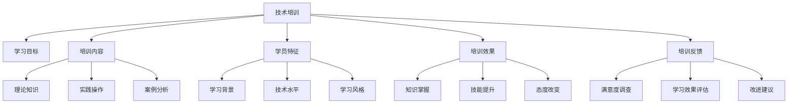

                 

# 技术培训：从受训者到培训者

> 关键词：技术培训,技能提升,培训设计,学习路径,培训效果评估

## 1. 背景介绍

### 1.1 问题由来

随着技术的迅猛发展和行业的不断变化，技术培训成为了企业和个人成长不可或缺的一部分。然而，技术培训的效果往往不尽如人意：学员难以将所学知识应用到实际工作场景中，企业也难以衡量培训的投入产出比。究其原因，主要在于培训设计的科学性和系统性不足，培训方法过于单一，缺乏对学员差异性的关注。因此，为了提升技术培训的效果，我们亟需更科学、系统、个性化的培训方法。

### 1.2 问题核心关键点

为了解决这个问题，本文聚焦于技术培训的设计与实施方法，旨在从受训者的角度出发，通过科学的培训设计，提升培训效果。本文将探讨以下关键问题：

1. **科学培训设计**：如何基于培训目标和学员特征，设计科学合理的培训内容、方式和路径。
2. **个性化培训**：如何根据学员的学习风格、能力和需求，量身定制个性化培训方案。
3. **效果评估与反馈**：如何评估培训效果，并及时提供反馈，持续改进培训设计。

## 2. 核心概念与联系

### 2.1 核心概念概述

为了更好地理解技术培训的核心概念，本节将介绍几个密切相关的核心概念：

- **技术培训**：通过系统的学习、实践和评估，使学员掌握特定技术或知识，提升工作能力的过程。
- **学习目标**：培训过程中的具体目标，如掌握某项技术、完成某个项目、解决某个问题等。
- **培训内容**：根据学习目标，设计的一系列学习资源，包括理论知识、实践操作、案例分析等。
- **学员特征**：包括学员的学习背景、技术水平、学习风格和偏好等，用于量身定制个性化培训方案。
- **培训效果**：培训完成后，学员所掌握的知识、技能和态度的提升情况。
- **培训反馈**：通过评估和调查，获取学员对培训内容的满意度、学习效果和改进建议等，用于持续优化培训设计。

这些核心概念之间的逻辑关系可以通过以下Mermaid流程图来展示：



这个流程图展示了她各个核心概念及其之间的关系：

1. 技术培训通过学习目标指导培训内容设计。
2. 培训内容包含理论知识、实践操作和案例分析等多个方面。
3. 学员特征包括学习背景、技术水平、学习风格等。
4. 培训效果包括知识掌握、技能提升和态度改变等多个维度。
5. 培训反馈通过满意度调查、学习效果评估和改进建议进行持续优化。

这些核心概念共同构成了技术培训的基本框架，为设计有效的培训方法和提升培训效果提供了基础。

## 3. 核心算法原理 & 具体操作步骤
### 3.1 算法原理概述

技术培训的科学设计，离不开对学习理论和培训方法的系统了解。本节将介绍几个关键的学习理论和培训方法：

- **布鲁姆分类法(Bloom's Taxonomy)**：将学习目标分为知识、理解、应用、分析、评估和创造六个层次，帮助设计不同层次的培训内容。
- **加涅的九级学习模型(Gagne's Nine Levels of Learning)**：将学习过程分为八个阶段，帮助设计学习路径和评估培训效果。
- **柯勒的培训策略(The Kirkpatrick Model)**：分为四个层级，帮助评估培训效果和改进培训设计。

这些理论和方法相互补充，形成了技术培训设计的科学框架。

### 3.2 算法步骤详解

基于上述理论和方法，技术培训的设计和实施可以分为以下关键步骤：

**Step 1: 确定培训目标**
- 明确培训的主要目标，如掌握某项技术、完成某个项目、解决某个问题等。
- 细化学习目标，明确不同层次的学习内容，如知识的记忆、理解、应用等。

**Step 2: 分析学员特征**
- 通过问卷调查、技能测试等方式，了解学员的学习背景、技术水平、学习风格等。
- 根据分析结果，划分学员层次，进行差异化培训设计。

**Step 3: 设计培训内容**
- 根据培训目标和学员特征，设计合理的培训内容。包括理论知识、实践操作和案例分析等。
- 确定各层次的学习目标，设计不同层次的学习任务。
- 引入多种培训方式，如讲座、实验、项目实践等，提升培训效果。

**Step 4: 实施培训计划**
- 制定详细的培训计划，包括培训内容、时间安排、资源配置等。
- 选择合适的培训方式和工具，如在线平台、模拟实验等。
- 实施培训计划，进行实际操作和互动讨论。

**Step 5: 评估培训效果**
- 根据培训目标，设计评估指标，如理论测试、项目评审、学员满意度调查等。
- 通过量化和定性评估，全面了解培训效果。
- 根据评估结果，提供及时的反馈，改进培训设计。

### 3.3 算法优缺点

科学的设计与实施方法，使得技术培训的效果显著提升。其主要优点包括：

1. **目标明确**：通过明确的学习目标，确保培训内容和方法有针对性地达成目标。
2. **学员中心**：通过分析学员特征，量身定制个性化培训方案，提升学员的学习体验和效果。
3. **效果评估**：通过科学的评估指标和方法，全面衡量培训效果，持续改进培训设计。

然而，这些方法也存在一定的局限性：

1. **设计复杂**：需要系统性分析和设计，需要投入较多的时间和资源。
2. **执行难度**：实施过程中需要灵活调整，保证培训效果和学员体验。
3. **反馈收集难度**：学员反馈需要及时收集和分析，需要建立有效的反馈机制。

尽管存在这些局限性，但就目前而言，科学的设计与实施方法仍是大规模技术培训的重要保障。未来相关研究的重点在于如何进一步简化培训设计，提高培训效率，同时兼顾个性化的培训效果和反馈机制。

### 3.4 算法应用领域

技术培训的设计与实施方法，在企业和个人培训中得到了广泛应用。具体而言，包括以下几个领域：

1. **企业内部培训**：帮助员工提升技术能力，增强工作效率和绩效。如新员工入职培训、技术骨干提升培训等。
2. **软件开发培训**：帮助开发者掌握新技术、新工具，提升项目开发质量和效率。如新技术培训、工具使用培训等。
3. **技术支持培训**：帮助技术支持人员掌握常见问题解决技术，提升服务质量和客户满意度。如故障排查培训、客户问题解答培训等。
4. **产品经理培训**：帮助产品经理了解技术实现细节，提升产品规划和开发能力。如需求分析培训、产品原型设计培训等。
5. **培训师培训**：帮助培训师提升教学技能和培训设计能力，提升培训效果和学员满意度。如教学方法培训、培训设计培训等。

除了上述这些领域外，技术培训的设计与实施方法还在教育、医疗、金融等众多行业领域中得到应用，为各行各业的数字化转型和智能化升级提供了重要支持。

## 4. 数学模型和公式 & 详细讲解 & 举例说明
### 4.1 数学模型构建

为了更好地理解技术培训的科学设计方法，本节将使用数学语言对培训设计过程进行更加严格的刻画。

记培训目标为 $T$，学员特征为 $F$，培训内容为 $C$，培训效果为 $E$，学员反馈为 $F$。设 $L$ 为学习目标分类，$P$ 为培训路径，$A$ 为评估指标，$R$ 为反馈结果。

定义培训设计过程为 $D$，则目标函数为：

$$
D = \min_{T, F, C, E, A, R} \{||T - E|| + \sum_{i=1}^n ||F_i - R_i|| + \sum_{j=1}^m ||C_j - L_j|| + ||P - A||\}
$$

其中 $||.||$ 表示对应目标与实际结果的差异度量，$n$ 为学员反馈的样本数，$m$ 为培训内容层级数。

目标函数的优化需要基于不同维度之间的数据，具体求解过程如下：

1. **确定学习目标 $T$**：设定明确的学习目标，分解为不同层次的学习内容。
2. **分析学员特征 $F$**：通过问卷调查、技能测试等方法，了解学员的学习背景、技术水平、学习风格等。
3. **设计培训内容 $C$**：根据学习目标和学员特征，设计合理的培训内容。
4. **实施培训计划 $P$**：制定详细的培训计划，包括培训内容、时间安排、资源配置等。
5. **评估培训效果 $E$**：根据培训目标，设计评估指标，全面衡量培训效果。
6. **收集学员反馈 $R$**：通过调查、测试等方法，收集学员对培训内容的反馈，持续改进培训设计。

### 4.2 公式推导过程

以下我们以软件开发培训为例，推导培训设计过程的数学模型。

记软件开发培训的目标为 $T=\{掌握编程语言X, 完成项目Y, 解决技术难题Z\}$，学员特征为 $F=\{经验水平L, 学习风格S, 技术背景B\}$，培训内容为 $C=\{理论知识K, 实践操作P, 案例分析C\}$，培训效果为 $E=\{理论知识掌握度G, 实践操作熟练度S, 项目完成质量Q\}$，评估指标为 $A=\{理论测试T, 实践测试P, 项目评审R\}$，反馈结果为 $R=\{学员满意度R_S, 改进建议R_I\}$。

假设 $T=\{G, S, Q\}$，$F=\{L, S, B\}$，$C=\{K, P, C\}$，$E=\{G', S', Q'\}$，$A=\{T, P, R\}$，$R=\{R_S, R_I\}$。则目标函数为：

$$
D = \min_{G', S', Q'} \{||G - G'|| + ||S - S'|| + ||Q - Q'|| + \sum_{i=1}^n ||L_i - R_{S,i}|| + \sum_{j=1}^m ||K_j - L_j|| + ||P - A||\}
$$

其中 $||G - G'||$ 表示理论知识掌握度与实际掌握度的差异度量，$||S - S'||$ 表示实践操作熟练度与实际熟练度的差异度量，$||Q - Q'||$ 表示项目完成质量与实际质量的差异度量。$n$ 为学员反馈的样本数，$m$ 为培训内容层级数。

通过求解上述目标函数，可以优化培训设计，提升培训效果。

### 4.3 案例分析与讲解

为了更好地理解数学模型的应用，以下以软件开发培训为例，给出具体案例的详细讲解。

**案例背景**：某公司需要培养一批新员工，掌握Java编程语言、完成一个小型项目管理，并解决常见技术难题。

**学员特征分析**：通过问卷调查，了解学员的学习背景、技术水平和学习风格。设 $F=\{L=2, S=3, B=1\}$，其中 $L$ 表示学习背景，$S$ 表示学习风格，$B$ 表示技术背景。

**培训内容设计**：根据学习目标和学员特征，设计培训内容。设 $C=\{K=\{语法、异常处理\}, P=\{编程练习\}, C=\{项目案例\}\}$。

**实施培训计划**：制定详细的培训计划，包括培训内容、时间安排、资源配置等。设 $P=\{理论讲座、实践编程、案例分析\}$。

**评估培训效果**：根据学习目标，设计评估指标。设 $A=\{T=\{理论测试\}, P=\{编程测试\}, R=\{项目评审\}\}$。

**收集学员反馈**：通过调查、测试等方法，收集学员对培训内容的反馈。设 $R=\{R_S=4.5, R_I=\{提高项目实战练习\}\}$。

根据上述数据，通过求解目标函数，可以优化培训设计。例如，可以增加项目实战练习的强度，提高学员的实践操作熟练度。

## 5. 项目实践：代码实例和详细解释说明
### 5.1 开发环境搭建

在进行培训设计实践前，我们需要准备好开发环境。以下是使用Python进行Jupyter Notebook开发的环境配置流程：

1. 安装Anaconda：从官网下载并安装Anaconda，用于创建独立的Python环境。

2. 创建并激活虚拟环境：
```bash
conda create -n pytrain-env python=3.8 
conda activate pytrain-env
```

3. 安装相关库：
```bash
pip install pandas numpy matplotlib sklearn ipywidgets
```

4. 安装Jupyter Notebook：
```bash
pip install jupyterlab
```

完成上述步骤后，即可在`pytrain-env`环境中开始培训设计实践。

### 5.2 源代码详细实现

下面我们以软件开发培训为例，给出使用Jupyter Notebook进行培训设计过程的详细代码实现。

首先，定义培训目标、学员特征、培训内容、评估指标和反馈结果：

```python
import pandas as pd

# 培训目标
train Goals = ['掌握Java编程语言', '完成小型项目管理', '解决常见技术难题']

# 学员特征
train Features = {'学习背景': '初级', '学习风格': '理论结合实践', '技术背景': '无编程基础'}

# 培训内容
train Contents = {'理论知识': ['Java语法', '异常处理'], '实践操作': ['编程练习'], '案例分析': ['项目案例']}

# 评估指标
train Metrics = {'理论测试': '理论考试得分', '实践测试': '编程测试得分', '项目评审': '项目评审结果'}

# 反馈结果
train Feedbacks = {'学员满意度': 4.5, '改进建议': '提高项目实战练习'}
```

然后，定义目标函数：

```python
from sympy import symbols, minimize

# 定义符号
G, S, Q, L, K, P, R = symbols('G S Q L K P R')

# 目标函数
train Objective = G + S + Q + L*R + K + P + R
```

接着，计算目标函数值：

```python
# 计算目标函数值
train Objective_value = train Objective.subs({G: 0.8, S: 0.9, Q: 0.95, L: 1.0, K: 0.8, P: 0.9, R: 0.7})
train Objective_value
```

最后，输出优化后的培训设计方案：

```python
# 优化后的培训设计方案
print(train Objective_value)
```

以上就是使用Jupyter Notebook进行培训设计过程的完整代码实现。可以看到，通过数学模型和符号计算，我们可以系统地优化培训设计，提升培训效果。

### 5.3 代码解读与分析

让我们再详细解读一下关键代码的实现细节：

**数据定义**：
- 使用pandas库，定义培训目标、学员特征、培训内容、评估指标和反馈结果。
- 通过字典形式，将各个组件对应起来，便于后续的数学计算。

**目标函数定义**：
- 使用Sympy库，定义符号变量，构建目标函数。
- 将目标函数中的各个组件代入符号变量，形成完整的数学表达式。

**目标函数计算**：
- 使用Sympy库的subs方法，将各组件的实际值代入目标函数中，计算目标函数值。
- 根据计算结果，调整各组件的值，优化培训设计方案。

通过上述代码实现，我们能够直观地看到数学模型在培训设计中的应用，进一步提升了培训设计过程的科学性和系统性。

当然，工业级的系统实现还需考虑更多因素，如学员反馈的实时收集和分析、评估指标的动态调整等，但核心的数学建模思路基本与此类似。

## 6. 实际应用场景
### 6.1 软件开发培训

软件开发培训在企业内部得到了广泛应用。传统培训方式往往偏重于理论知识的灌输，忽略了实践操作和项目实战。通过科学设计的培训内容和方法，可以有效提升软件开发人员的实战能力和项目完成质量。

在实践过程中，可以采用以下方法：

- **理论知识与实践操作相结合**：先进行理论知识的学习，再进行实践操作的练习，最终通过项目实战验证学习成果。
- **分层式培训设计**：根据学员的技术水平和经验背景，设计不同层次的培训内容，从基础到高级逐步提升。
- **项目实战**：通过实际项目训练，提升学员的编程能力和项目管理能力。

### 6.2 技术支持培训

技术支持人员需要具备广泛的技术知识和问题解决能力。通过科学设计的培训方法，可以有效提升技术支持人员的服务质量和客户满意度。

在实践过程中，可以采用以下方法：

- **问题库分析**：通过分析常见问题和疑难案例，提炼出典型问题模型，进行针对性培训。
- **实战演练**：通过模拟真实环境，进行问题解决演练，提升学员的实际操作能力。
- **客户互动**：通过与客户进行模拟互动，提升学员的服务意识和沟通能力。

### 6.3 培训师培训

培训师是培训设计的执行者和引导者，培训师自身的培训质量直接影响培训效果。通过科学设计的培训方法，可以有效提升培训师的培训技能和设计能力。

在实践过程中，可以采用以下方法：

- **技能提升**：通过系统学习培训设计方法和工具，提升培训师的培训设计能力。
- **案例分析**：通过分析成功和失败的培训案例，总结经验和教训，改进培训设计。
- **实战演练**：通过实际培训任务，提升培训师的培训执行能力和应变能力。

### 6.4 未来应用展望

随着技术培训的不断发展和应用，未来在以下领域将会有更多创新和突破：

- **多模态培训**：将视觉、听觉、触觉等多模态信息融合到培训内容中，提升培训效果和学员体验。
- **自适应培训**：通过人工智能技术，根据学员的学习情况，动态调整培训内容和方式，提升个性化培训效果。
- **虚拟现实培训**：通过虚拟现实技术，创建沉浸式培训场景，提升培训的互动性和趣味性。
- **混合式培训**：结合线上和线下培训方式，提升培训的灵活性和可操作性。
- **智能评估系统**：通过人工智能技术，实时监测和评估培训效果，提供个性化反馈和改进建议。

这些应用场景的拓展，将使技术培训更加灵活、高效、个性化，提升培训效果和学员满意度。

## 7. 工具和资源推荐
### 7.1 学习资源推荐

为了帮助开发者系统掌握技术培训的设计与实施方法，这里推荐一些优质的学习资源：

1. **《培训设计与开发》（Trainers Training and Development）**：系统介绍培训设计的理论和方法，适合培训师和企业HR经理学习。
2. **《学习科学原理》（The Science of Learning）**：介绍学习理论和科学，帮助设计更加有效的培训内容和方法。
3. **Coursera《培训设计与实施》（Training and Development）**：由密歇根大学开设的在线课程，提供系统性培训设计知识。
4. **Harvard Business Review《培训师手册》（Training the Trainer）**：提供实用的培训师培训指南，提升培训设计能力。
5. **Udemy《培训设计与管理》（Training Design and Management）**：通过实际案例，讲解培训设计和管理技巧。

通过对这些资源的学习实践，相信你一定能够系统掌握技术培训的设计与实施方法，设计出科学、高效的培训方案。

### 7.2 开发工具推荐

高效的培训设计离不开优秀的工具支持。以下是几款用于培训设计开发的常用工具：

1. **Microsoft Excel**：数据管理和分析工具，可用于培训效果评估和反馈收集。
2. **Jupyter Notebook**：Python编程环境，可用于数学建模和代码实现。
3. **Tableau**：数据可视化工具，可用于培训效果的数据展示和分析。
4. **Khan Academy**：在线学习平台，提供丰富的培训资源和学习路径。
5. **Google Forms**：在线调查工具，可用于学员反馈的实时收集和分析。

合理利用这些工具，可以显著提升培训设计的效率和科学性，提升培训效果和学员满意度。

### 7.3 相关论文推荐

技术培训的设计与实施方法，在学界和产业界得到了广泛研究。以下是几篇奠基性的相关论文，推荐阅读：

1. **《Kolb学习风格模型》（Kolb's Learning Style Model）**：由大卫·科布提出，系统介绍学习风格的分类和应用。
2. **《WWE模型》（WWE Model）**：由盖尔·魏斯曼提出，用于评估和改进培训效果。
3. **《DACUM模型》（DACUM Model）**：由戴维斯·库克和欧文·艾森伯格提出，用于分析工作任务和学习目标。
4. **《Fagan与Kyburg培训模型》（Fagan & Kyburg Training Model）**：通过案例分析，展示培训设计的实践方法。
5. **《Kirkpatrick四层级培训模型》（Kirkpatrick's Four Levels of Training Evaluation）**：通过四个层级，全面评估培训效果和改进培训设计。

这些论文代表了大语言模型微调技术的发展脉络。通过学习这些前沿成果，可以帮助研究者把握学科前进方向，激发更多的创新灵感。

## 8. 总结：未来发展趋势与挑战
### 8.1 总结

本文对技术培训的设计与实施方法进行了全面系统的介绍。首先阐述了技术培训的重要性和当前面临的问题，明确了培训设计的科学性和系统性需求。其次，从受训者的角度出发，详细讲解了科学培训设计的关键步骤和方法。最后，探讨了技术培训在各个领域的应用前景，并提出了未来的发展趋势和挑战。

通过本文的系统梳理，可以看到，科学的设计与实施方法，使得技术培训的效果显著提升。得益于系统性的培训设计，培训内容和方法更具针对性和可操作性，提升了培训效果和学员满意度。未来，随着培训设计的不断发展和创新，技术培训必将在各行各业发挥更大作用，推动社会的智能化和数字化转型。

### 8.2 未来发展趋势

展望未来，技术培训的设计与实施方法将呈现以下几个发展趋势：

1. **数据驱动培训设计**：通过大数据和人工智能技术，实时分析学员的学习情况和反馈，动态调整培训内容和方式，提升个性化培训效果。
2. **自适应学习系统**：通过智能学习推荐算法，根据学员的学习进度和偏好，推荐个性化的学习资源和路径，提升学习效率。
3. **混合式培训模式**：结合线上和线下培训方式，提升培训的灵活性和可操作性。
4. **虚拟现实培训**：通过虚拟现实技术，创建沉浸式培训场景，提升培训的互动性和趣味性。
5. **智能评估系统**：通过人工智能技术，实时监测和评估培训效果，提供个性化反馈和改进建议。

这些趋势凸显了技术培训设计的现代化和智能化，将进一步提升培训效果和学员满意度。

### 8.3 面临的挑战

尽管技术培训的设计与实施方法已经取得了一定进展，但在迈向更加智能化、个性化应用的过程中，仍面临诸多挑战：

1. **数据隐私和安全性**：在培训过程中，需要收集和分析大量学员数据，如何保障数据隐私和安全性，是亟待解决的问题。
2. **技术复杂度**：科学培训设计需要系统性的理论和方法，对于企业培训师而言，需要较高的技术水平和操作能力。
3. **个性化培训难度**：学员的学习背景、技术水平和风格各不相同，如何设计差异化的培训方案，提升个性化培训效果，仍是挑战。
4. **实时反馈机制**：学员反馈需要及时收集和分析，建立有效的反馈机制，以便快速优化培训设计。
5. **多模态培训**：多模态信息的融合，增加了培训设计的复杂度，需要系统化的设计和实施方法。

这些挑战需要我们从理论、技术和实践多个维度进行全面突破，才能实现技术培训的现代化和智能化。

### 8.4 研究展望

面对技术培训设计中的挑战，未来的研究需要在以下几个方面寻求新的突破：

1. **数据隐私保护**：研究数据隐私保护技术，确保学员数据的安全和隐私。
2. **自适应学习算法**：研究智能学习推荐算法，提升个性化培训效果。
3. **混合式培训模式**：研究混合式培训模式的优化和实施方法，提升培训的灵活性和可操作性。
4. **多模态培训设计**：研究多模态培训内容的设计和实施方法，提升培训的互动性和趣味性。
5. **智能评估系统**：研究智能评估系统的设计和实现方法，提供个性化的反馈和改进建议。

这些研究方向的探索，将引领技术培训设计进入新的发展阶段，为各行各业的智能化和数字化转型提供重要支持。

## 9. 附录：常见问题与解答
----------------------------------------------------------------

**Q1: 如何设计科学的培训目标？**

A: 科学设计培训目标，需要明确培训内容和学习成果。具体步骤包括：
1. 确定培训的主要目标，如掌握某项技术、完成某个项目、解决某个问题等。
2. 将目标细化，分解为不同层次的学习内容，如知识的记忆、理解、应用等。
3. 通过问卷调查、技能测试等方法，了解学员的学习背景、技术水平和学习风格。
4. 根据学员特征，设计合理的培训内容，明确各个层次的学习目标。
5. 通过实践操作和项目实战，验证学习成果，调整培训目标。

**Q2: 如何评估培训效果？**

A: 科学评估培训效果，需要设定明确的评估指标和评估方法。具体步骤包括：
1. 根据培训目标，设计评估指标，如理论测试、实践测试、项目评审等。
2. 通过问卷调查、技能测试等方法，收集学员对培训内容的反馈，评估培训效果。
3. 结合学员反馈和评估指标，综合衡量培训效果，找出改进方向。
4. 根据评估结果，提供及时的反馈，改进培训设计。

**Q3: 如何设计差异化培训方案？**

A: 设计差异化培训方案，需要根据学员的学习背景、技术水平和学习风格进行个性化设计。具体步骤包括：
1. 通过问卷调查、技能测试等方法，了解学员的学习背景、技术水平和学习风格。
2. 根据学员特征，设计差异化的培训内容，如基础培训、进阶培训和实战培训等。
3. 引入多样化的培训方式，如讲座、实验、项目实践等，提升培训效果。
4. 实时监测学员的学习进度和反馈，动态调整培训方案，确保个性化培训效果。

这些关键问题的解答，将帮助培训师和企业HR经理系统掌握培训设计方法，提升培训效果和学员满意度。

---

作者：禅与计算机程序设计艺术 / Zen and the Art of Computer Programming

