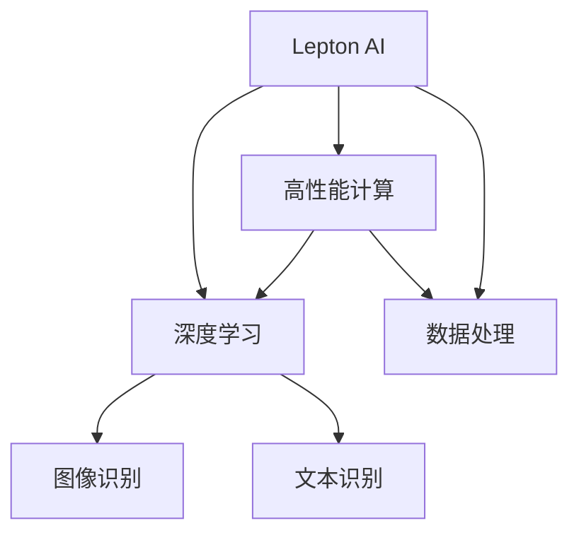

                 

# 技术壁垒与市场教育：Lepton AI的推广挑战

> 关键词：技术壁垒,市场教育,Lepton AI,推广挑战,人工智能应用,深度学习,前沿技术

## 1. 背景介绍

### 1.1 问题由来
在人工智能（AI）领域，Lepton AI 作为一种前沿技术，正受到越来越多的关注。Lepton AI 是一款基于深度学习的智能推理系统，旨在通过高效计算和数据处理，实现高精度的图像和文本识别。尽管其具备诸多技术优势，但在实际推广过程中仍面临不少挑战，特别是来自技术壁垒和市场教育两方面的压力。

### 1.2 问题核心关键点
Lepton AI 的推广问题主要集中在以下两点：

- **技术壁垒**：Lepton AI 采用复杂的数据处理和深度学习算法，需要具备一定的技术背景才能理解和应用。此外，其高性能计算需求对硬件要求较高，增加了推广的难度。
- **市场教育**：尽管 Lepton AI 具备显著的行业应用前景，但市场的认知度和接受度仍待提升。用户和合作伙伴对Lepton AI 的价值和优势认识不足，需要更多的市场教育和推广活动。

## 2. 核心概念与联系

### 2.1 核心概念概述

为更好地理解Lepton AI 的推广挑战，本节将介绍几个关键概念：

- **Lepton AI**：一款基于深度学习的智能推理系统，具备高精度图像和文本识别能力，广泛应用于智能安防、医疗影像、自动驾驶等多个领域。
- **深度学习**：一种通过多层神经网络进行特征学习和模式识别的机器学习技术。Lepton AI 的核心算法之一。
- **高性能计算**：指能够处理大规模、高复杂度计算任务的计算机系统。Lepton AI 需要高性能计算能力来支撑其深度学习模型。
- **数据处理**：指通过算法和技术手段，从原始数据中提取有用信息的过程。Lepton AI 依赖高效的数据处理技术来提高识别准确率。

### 2.2 核心概念原理和架构的 Mermaid 流程图(Mermaid 流程节点中不要有括号、逗号等特殊字符)



这个流程图展示了Lepton AI 与深度学习、高性能计算、数据处理之间的逻辑关系：

1. Lepton AI 采用深度学习技术进行图像和文本识别。
2. 高性能计算能力为深度学习提供支持，加速模型训练和推理。
3. 数据处理技术则用于优化数据预处理和特征提取。

## 3. 核心算法原理 & 具体操作步骤

### 3.1 算法原理概述

Lepton AI 的算法原理主要基于深度学习和计算机视觉技术。其核心算法包括卷积神经网络（CNN）、循环神经网络（RNN）和Transformer模型等。这些算法通过多层次、多维度的特征提取和模式识别，实现高精度的图像和文本识别。

### 3.2 算法步骤详解

Lepton AI 的推广步骤如下：

1. **市场调研**：对潜在用户需求和市场环境进行详细调研，确定推广策略和目标用户群体。
2. **技术演示**：通过案例分析和实验演示，展示Lepton AI 的算法原理和实际应用效果。
3. **合作伙伴选择**：筛选具有行业应用背景的合作伙伴，开展联合营销和推广活动。
4. **产品部署**：在合作伙伴的实际应用场景中，部署Lepton AI 系统，收集反馈和优化建议。
5. **市场教育**：通过技术研讨会、案例分享会等形式，提升市场对Lepton AI 的认知度。

### 3.3 算法优缺点

Lepton AI 的优势在于其高效的图像和文本识别能力，以及强大的数据处理和深度学习技术。但同时，也存在以下缺点：

- **技术门槛高**：需要具备深厚的AI技术背景才能深入理解和应用。
- **硬件要求高**：高性能计算需求对硬件配置要求较高。
- **成本较高**：硬件和算力的投入增加推广和部署成本。

### 3.4 算法应用领域

Lepton AI 广泛应用于以下几个领域：

- **智能安防**：通过高精度图像识别，提升安防系统的监控和报警能力。
- **医疗影像**：利用文本识别和图像分析技术，辅助医生进行疾病诊断。
- **自动驾驶**：通过图像和文本识别，实现对道路环境的高效感知和决策。

## 4. 数学模型和公式 & 详细讲解 & 举例说明

### 4.1 数学模型构建

Lepton AI 的核心算法包括卷积神经网络（CNN）、循环神经网络（RNN）和Transformer模型。这里以CNN为例，介绍其数学模型构建。

CNN 的数学模型可以表示为：

$$
\mathcal{L}(\theta) = -\frac{1}{N}\sum_{i=1}^N \log \sigma(z_i)
$$

其中，$\mathcal{L}(\theta)$ 为损失函数，$\theta$ 为模型参数，$z_i$ 为输入数据经过网络处理的输出结果，$\sigma$ 为激活函数。

### 4.2 公式推导过程

CNN 的推导过程如下：

1. 输入数据 $x$ 经过卷积层和池化层处理，得到特征图 $f(x)$。
2. $f(x)$ 通过若干全连接层和激活函数处理，得到最终输出 $y$。
3. 通过交叉熵损失函数 $\mathcal{L}(y, y^*)$ 计算预测结果与真实标签之间的差异。

### 4.3 案例分析与讲解

以医疗影像识别为例，使用CNN模型进行训练和推理。输入为医学影像数据 $x$，输出为疾病分类 $y$。在训练阶段，使用交叉熵损失函数 $\mathcal{L}(y, y^*)$ 计算模型预测与实际标签之间的误差，并反向传播更新模型参数。在推理阶段，将新的医学影像数据输入模型，得到疾病分类结果。

## 5. 项目实践：代码实例和详细解释说明

### 5.1 开发环境搭建

为了进行Lepton AI 的开发和测试，需要搭建以下开发环境：

1. **Python 环境**：安装Anaconda或Miniconda，创建虚拟环境。
2. **深度学习框架**：安装TensorFlow或PyTorch，并进行版本兼容性检查。
3. **高性能计算环境**：使用NVIDIA GPU或TPU进行模型训练和推理。
4. **数据处理工具**：安装OpenCV、Pillow等数据处理库，进行数据预处理和增强。

### 5.2 源代码详细实现

以下是一个简单的Lepton AI 代码示例，用于医疗影像分类：

```python
import tensorflow as tf
from tensorflow.keras import layers, models

# 定义CNN模型
model = models.Sequential([
    layers.Conv2D(32, (3, 3), activation='relu', input_shape=(256, 256, 3)),
    layers.MaxPooling2D((2, 2)),
    layers.Conv2D(64, (3, 3), activation='relu'),
    layers.MaxPooling2D((2, 2)),
    layers.Conv2D(128, (3, 3), activation='relu'),
    layers.MaxPooling2D((2, 2)),
    layers.Flatten(),
    layers.Dense(10, activation='softmax')
])

# 编译模型
model.compile(optimizer='adam', loss='categorical_crossentropy', metrics=['accuracy'])

# 训练模型
model.fit(train_images, train_labels, epochs=10, batch_size=32)

# 测试模型
test_loss, test_acc = model.evaluate(test_images, test_labels)
print('Test accuracy:', test_acc)
```

### 5.3 代码解读与分析

**CNN模型定义**：使用Sequential模型定义一个简单的CNN结构，包括卷积层、池化层和全连接层。

**模型编译**：指定优化器、损失函数和评价指标。

**模型训练**：使用训练数据集进行模型训练，调整超参数（如学习率、批次大小等），进行多轮训练。

**模型测试**：使用测试数据集评估模型性能。

## 6. 实际应用场景

### 6.1 智能安防

Lepton AI 在智能安防领域可以用于监控视频图像识别，实时监测和报警。通过高精度图像识别技术，Lepton AI 能够快速检测到可疑人员或行为，并进行智能分析，提升安防系统的响应速度和准确性。

### 6.2 医疗影像

在医疗影像领域，Lepton AI 可以辅助医生进行疾病诊断。通过图像识别技术，Lepton AI 能够快速准确地提取病变区域，并结合文本识别技术，提供辅助诊断建议。

### 6.3 自动驾驶

自动驾驶领域中，Lepton AI 可以用于实时环境感知和决策。通过高精度图像识别技术，Lepton AI 能够快速获取道路环境信息，辅助驾驶系统进行智能决策。

## 7. 工具和资源推荐

### 7.1 学习资源推荐

为帮助开发者系统掌握Lepton AI 的技术细节和应用方法，推荐以下学习资源：

1. **TensorFlow官方文档**：详细介绍TensorFlow的使用方法，包括深度学习模型的构建和训练。
2. **PyTorch官方文档**：详细说明PyTorch的深度学习框架和应用场景。
3. **Lepton AI 官方文档**：详细介绍Lepton AI 的技术细节和使用方法。
4. **深度学习课程**：推荐参加深度学习相关的在线课程，如Coursera上的深度学习专项课程。
5. **Lepton AI 社区**：加入Lepton AI 官方社区，获取最新的技术动态和应用案例。

### 7.2 开发工具推荐

以下工具可以用于Lepton AI 的开发和测试：

1. **PyTorch**：基于Python的深度学习框架，提供灵活的模型构建和训练功能。
2. **TensorFlow**：由Google开发的深度学习框架，支持分布式计算和高性能计算。
3. **Jupyter Notebook**：用于数据处理和模型开发的交互式编程环境。
4. **NVIDIA CUDA Toolkit**：提供GPU加速计算能力，支持Lepton AI 的高性能计算需求。
5. **TensorBoard**：用于模型训练和推理的可视化工具。

### 7.3 相关论文推荐

Lepton AI 技术的发展源于学界的持续研究。以下是几篇关键论文，推荐阅读：

1. **《Deep Residual Learning for Image Recognition》**：介绍深度残差网络（ResNet）在图像分类任务中的应用。
2. **《Attention Is All You Need》**：提出Transformer模型，应用于自然语言处理领域。
3. **《ImageNet Classification with Deep Convolutional Neural Networks》**：介绍CNN在图像分类任务中的应用。

## 8. 总结：未来发展趋势与挑战

### 8.1 研究成果总结

Lepton AI 作为前沿技术，已经在多个领域展现出显著的性能优势。其在医疗影像、智能安防、自动驾驶等领域的应用，显著提升了系统的识别准确性和响应速度，具有广阔的市场前景。

### 8.2 未来发展趋势

未来，Lepton AI 的发展趋势包括：

1. **技术提升**：进一步优化深度学习算法，提升图像和文本识别精度。
2. **硬件发展**：探索更高效、更节能的计算方式，降低硬件成本。
3. **应用拓展**：拓展Lepton AI 在更多领域的应用，如金融、交通等。
4. **市场教育**：加强市场教育和推广，提升用户认知度。

### 8.3 面临的挑战

尽管Lepton AI 在技术上取得一定进展，但在推广过程中仍面临以下挑战：

1. **技术门槛高**：需要具备深厚的AI技术背景，增加了推广难度。
2. **硬件要求高**：高性能计算需求对硬件配置要求较高。
3. **成本较高**：硬件和算力的投入增加推广和部署成本。

### 8.4 研究展望

未来的研究需要从以下几个方面进行探索：

1. **算法优化**：优化深度学习算法，提升模型性能。
2. **硬件优化**：开发更高效、更节能的硬件解决方案，降低成本。
3. **市场教育**：加强市场教育和推广，提升用户认知度。
4. **应用拓展**：拓展Lepton AI 在更多领域的应用，提升市场影响力。

## 9. 附录：常见问题与解答

**Q1：Lepton AI 的技术壁垒主要体现在哪些方面？**

A: Lepton AI 的技术壁垒主要体现在以下几个方面：

- **深度学习算法复杂**：需要深厚的AI技术背景才能深入理解和应用。
- **高性能计算需求**：需要具备高性能的硬件设备，如GPU或TPU。
- **数据处理技术**：需要高效的数据处理技术，如数据增强、数据预处理等。

**Q2：Lepton AI 如何提高市场认知度？**

A: 提高市场认知度可以通过以下几种方式：

- **技术演示**：通过案例分析和实验演示，展示Lepton AI 的算法原理和实际应用效果。
- **市场教育**：通过技术研讨会、案例分享会等形式，提升市场对Lepton AI 的认知度。
- **合作伙伴选择**：筛选具有行业应用背景的合作伙伴，开展联合营销和推广活动。

**Q3：Lepton AI 在实际应用中需要注意哪些问题？**

A: 在实际应用中，Lepton AI 需要注意以下问题：

- **数据质量**：确保输入数据的质量和多样性，避免因数据偏差导致模型过拟合或欠拟合。
- **模型调参**：优化模型参数，提高模型性能。
- **系统集成**：将Lepton AI 系统集成到现有系统中，确保与现有系统兼容。

---

作者：禅与计算机程序设计艺术 / Zen and the Art of Computer Programming

