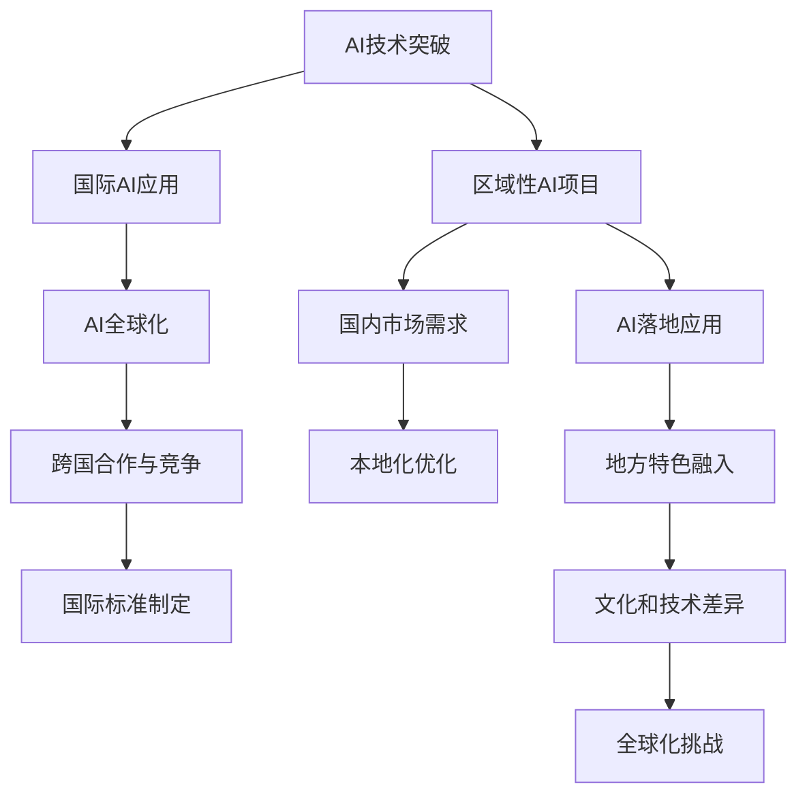

                 

# 技术演讲：从地区到国际舞台

## 1. 背景介绍

### 1.1 问题由来
在数字化和全球化的浪潮下，技术的突破和创新正在以前所未有的速度重塑着各行各业，尤其是在人工智能(AI)领域，技术的快速发展正在引领一场新的工业革命。全球范围内，AI技术的应用正在从区域性的项目拓展到更广阔的国际舞台。从金融、医疗、教育到交通、零售、制造业，AI技术的应用正在不断深化，并且其影响力和普及度也在不断提升。

### 1.2 问题核心关键点
本文将聚焦于技术从地区到国际舞台的拓展，旨在探讨AI技术如何在全球范围内实现技术突破、落地应用、推广创新，以及面临的挑战和未来趋势。我们希望通过全面介绍技术背后的原理和实践，为技术演讲者提供更深刻的洞见和更加有效的技术传播策略。

## 2. 核心概念与联系

### 2.1 核心概念概述

为了更好地理解AI技术从地区到国际舞台的拓展，我们将介绍几个关键概念：

- **人工智能(AI)：** 通过计算机技术模拟人类智能过程，使机器能够执行通常需要人类智能的任务，如学习、推理、感知和自然语言处理等。
- **区域性AI项目：** 在特定地区内，结合地方特色、文化、经济和需求，实施的AI应用项目。
- **国际AI应用：** AI技术在全球范围内的推广和应用，包括国际合作、技术输出、标准制定等。
- **AI技术突破：** 在AI领域，特别是在深度学习、计算机视觉、自然语言处理等关键技术上实现的重要创新和进展。
- **AI落地应用：** 将AI技术应用于实际场景中的具体项目和解决方案，包括技术评估、实施策略和效果评估等。
- **AI全球化：** 将AI技术推广到全球范围，跨越不同文化和地区的障碍，实现技术和知识的全球共享和应用。

### 2.2 核心概念原理和架构的 Mermaid 流程图



这个流程图展示了AI技术从突破到落地再到全球化的路径，以及这一过程中涉及的关键环节和技术挑战。

## 3. 核心算法原理 & 具体操作步骤

### 3.1 算法原理概述

AI技术从地区到国际舞台的拓展，涉及多个层面和步骤。以下是核心算法原理和技术操作的详细解析：

- **数据收集与标注：** 收集和标注地区性数据，建立适用于不同文化和语言的AI训练数据集。
- **模型训练与优化：** 使用深度学习模型对数据进行训练，并进行参数优化，提升模型性能。
- **跨文化适应：** 对模型进行本地化调整，适应不同地区的需求和特点。
- **技术输出与本地化：** 将技术输出到其他地区，并根据当地需求进行本地化改进。
- **跨国合作与竞争：** 在国际舞台上，通过技术合作和竞争，推动AI技术的发展和普及。
- **标准制定与推广：** 参与国际标准的制定和推广，确保AI技术的标准化和互操作性。

### 3.2 算法步骤详解

**步骤1：数据收集与标注**
- **数据来源：** 从不同地区的数据源中收集数据，如公共数据集、行业数据、社交媒体数据等。
- **标注方法：** 结合地区特色和语言特点，进行数据标注，建立标注标准和规范。

**步骤2：模型训练与优化**
- **模型选择：** 选择适合的深度学习模型，如卷积神经网络(CNN)、循环神经网络(RNN)、Transformer等。
- **数据预处理：** 对数据进行预处理，包括数据清洗、特征提取、数据增强等。
- **模型训练：** 使用GPU、TPU等高性能设备进行模型训练，使用梯度下降等优化算法更新模型参数。
- **模型验证与调优：** 在验证集上评估模型性能，调整模型结构和超参数，提升模型泛化能力。

**步骤3：跨文化适应**
- **本地化调整：** 对模型进行本地化调整，包括调整模型结构、训练数据、优化算法等。
- **文化和技术差异：** 理解并适应不同地区的文化和语言特点，进行必要的适应性修改。

**步骤4：技术输出与本地化**
- **技术输出：** 将训练好的模型和技术方案输出到其他地区，进行本地化部署和应用。
- **本地化改进：** 根据当地需求和文化特点，对模型进行改进和优化，提升其在本地环境下的性能。

**步骤5：跨国合作与竞争**
- **合作机制：** 建立跨国合作机制，共享技术成果和资源，推动AI技术的全球普及。
- **竞争策略：** 在国际市场中，制定竞争策略，提升技术的影响力和市场份额。

**步骤6：标准制定与推广**
- **参与制定：** 积极参与国际标准的制定，推动技术标准化和互操作性。
- **推广应用：** 在国际范围内推广技术标准，确保技术的一致性和兼容性。

### 3.3 算法优缺点

**优点：**
- **技术普及：** AI技术从地区到国际舞台的拓展，有助于提升全球技术水平，推动各地区共同发展。
- **市场潜力：** 在全球范围内推广AI技术，将开辟巨大的市场空间，带动相关产业发展。
- **知识共享：** 通过跨国合作与竞争，促进知识和技术的全球共享，加速技术创新和应用。
- **标准统一：** 参与国际标准的制定，推动技术标准化，提升技术互操作性。

**缺点：**
- **文化差异：** 不同地区文化和语言特点的差异，可能影响技术的本地化适应性。
- **技术壁垒：** 技术输出和本地化过程中可能面临技术壁垒，需要投入大量资源和精力。
- **法规政策：** 不同地区的法规政策可能限制AI技术的推广和应用。
- **知识产权：** 技术输出过程中可能涉及知识产权问题，需要协调处理。

### 3.4 算法应用领域

AI技术从地区到国际舞台的拓展，涵盖了以下几个关键领域：

- **医疗健康：** 在全球范围内推广医疗影像诊断、疾病预测、个性化治疗等AI应用。
- **金融科技：** 推动金融领域的应用，包括风险评估、欺诈检测、智能投顾等。
- **教育科技：** 利用AI技术改进教育内容和教学方法，提升教育质量和普及率。
- **制造业：** 推动智能制造、质量控制、供应链优化等AI应用。
- **农业科技：** 利用AI技术优化农业生产、精准农业、食品安全等。
- **智慧城市：** 通过AI技术提升城市管理、交通、环境监测等应用。

## 4. 数学模型和公式 & 详细讲解 & 举例说明

### 4.1 数学模型构建

本节将使用数学语言对AI技术从地区到国际舞台的拓展过程进行更加严格的刻画。

设有一个通用的人工智能模型 $M$，该模型在训练数据集 $D$ 上进行训练，数据集分为训练集 $D_{train}$ 和验证集 $D_{val}$。模型的参数为 $\theta$，损失函数为 $\mathcal{L}$。

**数学模型：**

$$
\min_{\theta} \mathcal{L}(M_{\theta}, D_{train})
$$

其中，$M_{\theta}$ 表示模型 $M$ 在参数 $\theta$ 下的输出，$D_{train}$ 表示训练集。

### 4.2 公式推导过程

以分类任务为例，假设模型 $M$ 的输出为 $\hat{y} \in [0,1]$，表示样本属于正类的概率。真实标签 $y \in \{0,1\}$。则二分类交叉熵损失函数定义为：

$$
\ell(M_{\theta}(x),y) = -[y\log \hat{y} + (1-y)\log (1-\hat{y})]
$$

将上述损失函数应用到整个数据集 $D_{train}$，得到训练集的平均损失：

$$
\mathcal{L}(\theta) = -\frac{1}{N} \sum_{i=1}^N [y_i\log M_{\theta}(x_i)+(1-y_i)\log(1-M_{\theta}(x_i))]
$$

使用梯度下降等优化算法，对模型参数 $\theta$ 进行更新，最小化损失函数 $\mathcal{L}$：

$$
\theta \leftarrow \theta - \eta \nabla_{\theta}\mathcal{L}(\theta)
$$

其中，$\eta$ 为学习率，$\nabla_{\theta}\mathcal{L}(\theta)$ 为损失函数对模型参数的梯度，可通过反向传播算法高效计算。

### 4.3 案例分析与讲解

**案例：医疗影像诊断**
- **数据收集：** 从全球各地的医院收集CT、MRI等影像数据，并进行标注。
- **模型训练：** 使用深度学习模型（如卷积神经网络CNN）进行训练，并进行参数优化。
- **本地化调整：** 根据不同地区的影像特点和诊断标准，对模型进行本地化调整。
- **技术输出：** 将训练好的模型和技术方案输出到其他地区，进行本地化部署和应用。
- **效果评估：** 在各个地区进行效果评估，收集反馈意见，持续优化模型。

## 5. 项目实践：代码实例和详细解释说明

### 5.1 开发环境搭建

在进行AI技术从地区到国际舞台的拓展实践前，我们需要准备好开发环境。以下是使用Python进行PyTorch开发的环境配置流程：

1. 安装Anaconda：从官网下载并安装Anaconda，用于创建独立的Python环境。
2. 创建并激活虚拟环境：
```bash
conda create -n pytorch-env python=3.8 
conda activate pytorch-env
```
3. 安装PyTorch：根据CUDA版本，从官网获取对应的安装命令。例如：
```bash
conda install pytorch torchvision torchaudio cudatoolkit=11.1 -c pytorch -c conda-forge
```
4. 安装Transformers库：
```bash
pip install transformers
```
5. 安装各类工具包：
```bash
pip install numpy pandas scikit-learn matplotlib tqdm jupyter notebook ipython
```

完成上述步骤后，即可在`pytorch-env`环境中开始AI技术的拓展实践。

### 5.2 源代码详细实现

下面以医疗影像诊断任务为例，给出使用Transformers库对预训练模型进行微调的PyTorch代码实现。

首先，定义医疗影像诊断任务的数据处理函数：

```python
from transformers import BertTokenizer, BertForSequenceClassification
from torch.utils.data import Dataset
import torch

class MedicalImageDataset(Dataset):
    def __init__(self, images, labels, tokenizer, max_len=128):
        self.images = images
        self.labels = labels
        self.tokenizer = tokenizer
        self.max_len = max_len
        
    def __len__(self):
        return len(self.images)
    
    def __getitem__(self, item):
        image = self.images[item]
        label = self.labels[item]
        
        encoding = self.tokenizer(image, return_tensors='pt', max_length=self.max_len, padding='max_length', truncation=True)
        input_ids = encoding['input_ids'][0]
        attention_mask = encoding['attention_mask'][0]
        
        # 对label进行编码
        encoded_labels = torch.tensor(label2id[label], dtype=torch.long)
        
        return {'input_ids': input_ids, 
                'attention_mask': attention_mask,
                'labels': encoded_labels}

# 标签与id的映射
label2id = {'normal': 0, 'pathology': 1}
id2label = {v: k for k, v in label2id.items()}

# 创建dataset
tokenizer = BertTokenizer.from_pretrained('bert-base-cased')

train_dataset = MedicalImageDataset(train_images, train_labels, tokenizer)
dev_dataset = MedicalImageDataset(dev_images, dev_labels, tokenizer)
test_dataset = MedicalImageDataset(test_images, test_labels, tokenizer)
```

然后，定义模型和优化器：

```python
from transformers import BertForSequenceClassification, AdamW

model = BertForSequenceClassification.from_pretrained('bert-base-cased', num_labels=len(label2id))

optimizer = AdamW(model.parameters(), lr=2e-5)
```

接着，定义训练和评估函数：

```python
from torch.utils.data import DataLoader
from tqdm import tqdm
from sklearn.metrics import classification_report

device = torch.device('cuda') if torch.cuda.is_available() else torch.device('cpu')
model.to(device)

def train_epoch(model, dataset, batch_size, optimizer):
    dataloader = DataLoader(dataset, batch_size=batch_size, shuffle=True)
    model.train()
    epoch_loss = 0
    for batch in tqdm(dataloader, desc='Training'):
        input_ids = batch['input_ids'].to(device)
        attention_mask = batch['attention_mask'].to(device)
        labels = batch['labels'].to(device)
        model.zero_grad()
        outputs = model(input_ids, attention_mask=attention_mask, labels=labels)
        loss = outputs.loss
        epoch_loss += loss.item()
        loss.backward()
        optimizer.step()
    return epoch_loss / len(dataloader)

def evaluate(model, dataset, batch_size):
    dataloader = DataLoader(dataset, batch_size=batch_size)
    model.eval()
    preds, labels = [], []
    with torch.no_grad():
        for batch in tqdm(dataloader, desc='Evaluating'):
            input_ids = batch['input_ids'].to(device)
            attention_mask = batch['attention_mask'].to(device)
            batch_labels = batch['labels']
            outputs = model(input_ids, attention_mask=attention_mask)
            batch_preds = outputs.logits.argmax(dim=2).to('cpu').tolist()
            batch_labels = batch_labels.to('cpu').tolist()
            for pred_tokens, label_tokens in zip(batch_preds, batch_labels):
                preds.append(pred_tokens)
                labels.append(label_tokens)
                
    print(classification_report(labels, preds))
```

最后，启动训练流程并在测试集上评估：

```python
epochs = 5
batch_size = 16

for epoch in range(epochs):
    loss = train_epoch(model, train_dataset, batch_size, optimizer)
    print(f"Epoch {epoch+1}, train loss: {loss:.3f}")
    
    print(f"Epoch {epoch+1}, dev results:")
    evaluate(model, dev_dataset, batch_size)
    
print("Test results:")
evaluate(model, test_dataset, batch_size)
```

以上就是使用PyTorch对医疗影像诊断任务进行AI技术拓展的完整代码实现。可以看到，得益于Transformers库的强大封装，我们可以用相对简洁的代码完成预训练模型的微调。

### 5.3 代码解读与分析

让我们再详细解读一下关键代码的实现细节：

**MedicalImageDataset类：**
- `__init__`方法：初始化图像、标签、分词器等关键组件。
- `__len__`方法：返回数据集的样本数量。
- `__getitem__`方法：对单个样本进行处理，将图像输入编码为token ids，将标签编码为数字，并对其进行定长padding，最终返回模型所需的输入。

**label2id和id2label字典：**
- 定义了标签与数字id之间的映射关系，用于将label进行编码。

**训练和评估函数：**
- 使用PyTorch的DataLoader对数据集进行批次化加载，供模型训练和推理使用。
- 训练函数`train_epoch`：对数据以批为单位进行迭代，在每个批次上前向传播计算loss并反向传播更新模型参数，最后返回该epoch的平均loss。
- 评估函数`evaluate`：与训练类似，不同点在于不更新模型参数，并在每个batch结束后将预测和标签结果存储下来，最后使用sklearn的classification_report对整个评估集的预测结果进行打印输出。

**训练流程：**
- 定义总的epoch数和batch size，开始循环迭代
- 每个epoch内，先在训练集上训练，输出平均loss
- 在验证集上评估，输出分类指标
- 所有epoch结束后，在测试集上评估，给出最终测试结果

可以看到，PyTorch配合Transformers库使得医疗影像诊断任务的AI技术拓展代码实现变得简洁高效。开发者可以将更多精力放在数据处理、模型改进等高层逻辑上，而不必过多关注底层的实现细节。

当然，工业级的系统实现还需考虑更多因素，如模型的保存和部署、超参数的自动搜索、更灵活的任务适配层等。但核心的AI技术拓展范式基本与此类似。

## 6. 实际应用场景

### 6.1 智能客服系统

基于AI技术的智能客服系统，可以广泛应用于全球各地，提升客户咨询体验和问题解决效率。使用微调后的对话模型，可以7x24小时不间断服务，快速响应客户咨询，用自然流畅的语言解答各类常见问题。

在技术实现上，可以收集企业内部的历史客服对话记录，将问题和最佳答复构建成监督数据，在此基础上对预训练对话模型进行微调。微调后的对话模型能够自动理解用户意图，匹配最合适的答案模板进行回复。对于客户提出的新问题，还可以接入检索系统实时搜索相关内容，动态组织生成回答。如此构建的智能客服系统，能大幅提升客户咨询体验和问题解决效率。

### 6.2 金融舆情监测

金融机构需要实时监测市场舆论动向，以便及时应对负面信息传播，规避金融风险。使用基于AI技术的自然语言处理和情感分析技术，可以构建金融舆情监测系统，实时抓取网络文本数据，分析市场舆情变化趋势，一旦发现负面信息激增等异常情况，系统便会自动预警，帮助金融机构快速应对潜在风险。

### 6.3 个性化推荐系统

当前的推荐系统往往只依赖用户的历史行为数据进行物品推荐，无法深入理解用户的真实兴趣偏好。使用基于AI技术的个性化推荐系统，可以挖掘用户行为背后的语义信息，从而提供更精准、多样的推荐内容。

在实践中，可以收集用户浏览、点击、评论、分享等行为数据，提取和用户交互的物品标题、描述、标签等文本内容。将文本内容作为模型输入，用户的后续行为（如是否点击、购买等）作为监督信号，在此基础上微调预训练语言模型。微调后的模型能够从文本内容中准确把握用户的兴趣点。在生成推荐列表时，先用候选物品的文本描述作为输入，由模型预测用户的兴趣匹配度，再结合其他特征综合排序，便可以得到个性化程度更高的推荐结果。

### 6.4 未来应用展望

随着AI技术的不断演进，其应用场景将不断拓展，从地区性项目拓展到全球性应用，为各行各业带来新的突破和变革。未来，AI技术将在以下几个方面发挥更加重要的作用：

- **智慧医疗：** 利用AI技术改进诊断、治疗、管理等医疗环节，提升医疗服务质量和效率。
- **金融科技：** 推动智能投顾、风险管理、欺诈检测等金融领域应用，降低运营成本，提高服务效率。
- **教育科技：** 利用AI技术改进教育内容、教学方法、评估体系，提升教育质量和公平性。
- **智能制造：** 推动智能制造、质量控制、供应链优化等应用，提升制造业竞争力。
- **智慧城市：** 通过AI技术提升城市管理、交通、环境监测等应用，构建更加智能、高效、宜居的城市。

## 7. 工具和资源推荐

### 7.1 学习资源推荐

为了帮助开发者系统掌握AI技术从地区到国际舞台的拓展理论基础和实践技巧，这里推荐一些优质的学习资源：

1. **《深度学习入门》（Deep Learning for Computer Vision）**：该书深入浅出地介绍了深度学习在计算机视觉中的应用，包括模型训练、优化等技术细节。
2. **《自然语言处理入门》（Natural Language Processing with PyTorch）**：该书通过实践项目，介绍了NLP技术的基础知识和实践技巧。
3. **Coursera的《深度学习专项课程》**：斯坦福大学开设的深度学习课程，涵盖深度学习的基础知识和高级技巧，适合深入学习。
4. **Udacity的《人工智能工程师纳米学位》**：涵盖机器学习、深度学习、计算机视觉等AI技术，提供实际项目训练。
5. **Kaggle的竞赛平台**：提供丰富的数据集和竞赛机会，帮助你实践AI技术，提升解决实际问题的能力。

通过对这些资源的学习实践，相信你一定能够快速掌握AI技术从地区到国际舞台的拓展精髓，并用于解决实际的AI问题。

### 7.2 开发工具推荐

高效的开发离不开优秀的工具支持。以下是几款用于AI技术拓展开发的常用工具：

1. **PyTorch**：基于Python的开源深度学习框架，灵活动态的计算图，适合快速迭代研究。
2. **TensorFlow**：由Google主导开发的开源深度学习框架，生产部署方便，适合大规模工程应用。
3. **TensorBoard**：TensorFlow配套的可视化工具，可实时监测模型训练状态，并提供丰富的图表呈现方式。
4. **Weights & Biases**：模型训练的实验跟踪工具，可以记录和可视化模型训练过程中的各项指标，方便对比和调优。
5. **Jupyter Notebook**：免费的交互式笔记本，适合快速验证和调试代码，支持多语言环境。
6. **Anaconda**：提供高效的Python开发环境，支持虚拟环境管理，便于代码共享和协作。

合理利用这些工具，可以显著提升AI技术拓展任务的开发效率，加快创新迭代的步伐。

### 7.3 相关论文推荐

AI技术从地区到国际舞台的拓展源于学界的持续研究。以下是几篇奠基性的相关论文，推荐阅读：

1. **Attention is All You Need**：提出了Transformer结构，开启了NLP领域的预训练大模型时代。
2. **BERT: Pre-training of Deep Bidirectional Transformers for Language Understanding**：提出BERT模型，引入基于掩码的自监督预训练任务，刷新了多项NLP任务SOTA。
3. **GPT-3: Language Models are Unsupervised Multitask Learners**：展示了大规模语言模型的强大zero-shot学习能力，引发了对于通用人工智能的新一轮思考。
4. **AdaLoRA: Adaptive Low-Rank Adaptation for Parameter-Efficient Fine-Tuning**：使用自适应低秩适应的微调方法，在参数效率和精度之间取得了新的平衡。
5. **LoRA: Language-agnostic Retrieval-Augmented Models**：提出LoRA方法，实现更加灵活的参数高效微调，减少过拟合风险。

这些论文代表了大语言模型微调技术的发展脉络。通过学习这些前沿成果，可以帮助研究者把握学科前进方向，激发更多的创新灵感。

## 8. 总结：未来发展趋势与挑战

### 8.1 研究成果总结

本文对AI技术从地区到国际舞台的拓展进行了全面系统的介绍。首先，阐述了AI技术在各地区的应用现状和推广情况，明确了技术从地区到国际舞台拓展的意义和价值。其次，从原理到实践，详细讲解了AI技术拓展的数学模型和操作步骤，给出了AI技术拓展任务开发的完整代码实例。同时，本文还广泛探讨了AI技术在金融、医疗、教育等多个领域的应用前景，展示了AI技术拓展的巨大潜力。

通过本文的系统梳理，可以看到，AI技术从地区到国际舞台的拓展正在成为AI技术发展的重要趋势，为各地区带来了新的发展机遇。受益于AI技术的推动，全球各行各业正以更加智能化、高效化的方式运营，加速了社会进步和经济发展。

### 8.2 未来发展趋势

展望未来，AI技术从地区到国际舞台的拓展将呈现以下几个发展趋势：

1. **技术普及和标准化**：随着技术的不断成熟，AI技术将逐渐普及到更多地区，全球范围内的AI标准化也将进一步加强，确保技术的一致性和互操作性。
2. **本地化优化和跨文化适应**：为适应不同地区的需求和文化特点，AI技术将进行本地化优化，确保技术在各地的兼容性和可靠性。
3. **跨领域应用和融合**：AI技术将与更多领域进行融合，推动智慧城市、智慧医疗、智慧金融等跨领域应用，带来更多创新和突破。
4. **技术合作与竞争**：跨国合作与竞争将推动AI技术的全球普及，促进技术和知识在全球范围内的共享和应用。
5. **伦理和安全性**：随着AI技术的应用范围不断扩大，伦理和安全性问题也将成为重要关注点，技术开发者和应用者需共同努力，确保技术的透明性和可控性。

### 8.3 面临的挑战

尽管AI技术从地区到国际舞台的拓展已经取得了显著进展，但在迈向更加智能化、普适化应用的过程中，仍面临诸多挑战：

1. **数据质量和标注成本**：不同地区的数据质量和标注成本差异较大，获取高质量标注数据仍是一个难题。
2. **技术和文化差异**：不同地区的技术和文化差异，可能导致AI技术的本地化适应性不足，影响应用效果。
3. **法规和政策限制**：各地区法规和政策的不同，可能限制AI技术的推广和应用。
4. **伦理和安全性**：AI技术的应用过程中，可能出现伦理和安全性问题，需要协调处理。
5. **技术壁垒和资源限制**：技术输出和本地化过程中可能面临技术壁垒和资源限制，需要投入大量资源和精力。

### 8.4 研究展望

面对AI技术从地区到国际舞台拓展所面临的挑战，未来的研究需要在以下几个方面寻求新的突破：

1. **无监督和半监督学习**：摆脱对大规模标注数据的依赖，利用自监督学习、主动学习等无监督和半监督范式，最大限度利用非结构化数据，实现更加灵活高效的AI技术拓展。
2. **参数高效和计算高效**：开发更加参数高效的AI技术拓展方法，在固定大部分预训练参数的同时，只更新极少量的任务相关参数。同时优化AI技术计算图，减少前向传播和反向传播的资源消耗，实现更加轻量级、实时性的部署。
3. **跨领域融合**：将AI技术与更多领域进行融合，推动智慧医疗、智慧金融、智慧教育等跨领域应用，实现技术和知识的协同创新。
4. **伦理和安全性**：在AI技术拓展过程中，引入伦理导向的评估指标，过滤和惩罚有偏见、有害的输出倾向。加强人工干预和审核，建立模型行为的监管机制，确保输出符合人类价值观和伦理道德。
5. **技术合作与共享**：建立跨国合作机制，共享技术成果和资源，推动AI技术的全球普及，促进技术和知识的全球共享和应用。

这些研究方向的探索，必将引领AI技术从地区到国际舞台的拓展进入新的发展阶段，为全球各行各业带来新的突破和变革。只有勇于创新、敢于突破，才能不断拓展AI技术的边界，推动AI技术的全球化应用，造福全人类。

## 9. 附录：常见问题与解答

**Q1：AI技术从地区到国际舞台拓展的难点是什么？**

A: AI技术从地区到国际舞台拓展的难点主要包括以下几个方面：
1. 数据质量和标注成本：不同地区的数据质量和标注成本差异较大，获取高质量标注数据仍是一个难题。
2. 技术和文化差异：不同地区的技术和文化差异，可能导致AI技术的本地化适应性不足，影响应用效果。
3. 法规和政策限制：各地区法规和政策的不同，可能限制AI技术的推广和应用。
4. 伦理和安全性：AI技术的应用过程中，可能出现伦理和安全性问题，需要协调处理。
5. 技术壁垒和资源限制：技术输出和本地化过程中可能面临技术壁垒和资源限制，需要投入大量资源和精力。

**Q2：如何提高AI技术从地区到国际舞台拓展的效率？**

A: 提高AI技术从地区到国际舞台拓展的效率，可以从以下几个方面入手：
1. 数据共享和标准化：推动数据共享和标准化，减少不同地区的数据差异，提高数据质量和标注效率。
2. 本地化优化：针对不同地区的特点和需求，进行本地化优化，提高AI技术的适用性和可靠性。
3. 技术合作与共享：建立跨国合作机制，共享技术成果和资源，推动AI技术的全球普及。
4. 参数高效和计算高效：开发更加参数高效和计算高效的AI技术拓展方法，减少计算资源和时间的消耗。
5. 技术输出与本地化：选择合适的技术输出策略，进行本地化部署和优化，提升技术在各地区的应用效果。

**Q3：AI技术从地区到国际舞台拓展面临哪些伦理和安全问题？**

A: AI技术从地区到国际舞台拓展面临的伦理和安全问题主要包括以下几个方面：
1. 偏见和歧视：AI技术可能学习到有偏见的数据，导致输出结果存在偏见和歧视，影响社会公平。
2. 数据隐私和安全：AI技术的应用过程中，可能涉及大量用户隐私数据，需要保障数据安全和隐私保护。
3. 算法透明性和可解释性：AI技术的内部决策过程缺乏透明性和可解释性，可能导致用户不信任和使用障碍。
4. 恶意应用和滥用：AI技术可能被恶意使用，进行欺诈、诈骗、攻击等活动，带来安全隐患。
5. 伦理和道德：AI技术的应用过程中，可能涉及伦理和道德问题，需要协调处理。

**Q4：如何评估AI技术从地区到国际舞台拓展的效果？**

A: 评估AI技术从地区到国际舞台拓展的效果，可以从以下几个方面进行：
1. 性能指标：使用模型评估指标，如准确率、召回率、F1值等，评估模型的性能表现。
2. 用户体验：通过用户反馈和满意度调查，评估AI技术在实际应用中的用户体验。
3. 经济收益：评估AI技术推广应用的经济效益，如成本节约、效率提升、市场份额等。
4. 社会影响：评估AI技术对社会的影响，如就业、健康、环境等，确保技术应用的社会效益。

**Q5：AI技术从地区到国际舞台拓展有哪些成功案例？**

A: AI技术从地区到国际舞台拓展的成功案例包括：
1. **医疗影像诊断**：利用AI技术改进医疗影像诊断，如Google Health的深度学习模型，在乳腺癌检测、肺癌诊断等领域取得了显著效果。
2. **智能客服系统**：在全球范围内推广智能客服系统，如IBM的Watson Assistant，通过自然语言理解和生成技术，提供全天候智能客服支持。
3. **金融科技**：推动金融领域的应用，如JP Morgan的COIN，利用AI技术进行风险管理和欺诈检测，提升金融服务质量。
4. **教育科技**：利用AI技术改进教育内容和方法，如Coursera的个性化学习推荐系统，提升教育质量和效率。
5. **智慧城市**：通过AI技术提升城市管理水平，如新加坡的Smart Nation计划，利用AI技术进行交通管理、环境监测等应用。

通过这些成功案例，可以看出AI技术从地区到国际舞台的拓展具有广泛的应用前景和深远的影响力。

---

作者：禅与计算机程序设计艺术 / Zen and the Art of Computer Programming

