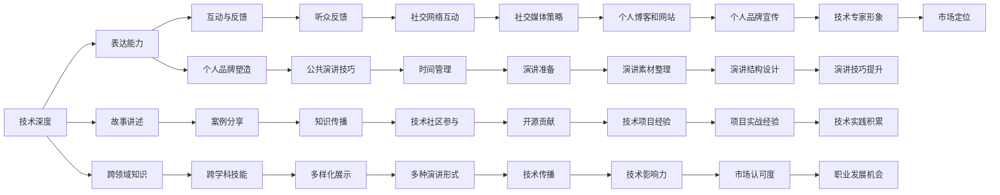

                 

## 1. 背景介绍

在当今竞争激烈的技术市场上，个人市场价值的提升变得越来越重要。无论是技术栈的选择、开源贡献、项目经验，还是公共演讲和个人品牌塑造，每一步都关乎到你的职业发展。本文将深入探讨如何通过技术演讲来提升个人市场价值，从理论到实践，为你提供全面的指导。

## 2. 核心概念与联系

### 2.1 核心概念概述

技术演讲是一种将复杂的科技理念和实践以简单、易懂的方式传递给听众的艺术。技术演讲的核心在于将深度知识转化为易于理解的内容，并通过有效的沟通技巧传达给听众。它不仅是一个技术展示，更是一个展示个人市场价值的机会。

- **技术深度**：理解所讲技术的原理和应用场景，这是技术演讲的基础。
- **表达能力**：清晰、简洁、有说服力的表达，能够将复杂技术简单化，使听众易于理解和记忆。
- **互动与反馈**：通过提问和互动，增强演讲效果，激发听众的兴趣和参与感。
- **故事讲述**：以案例和故事形式呈现技术，使演讲更具吸引力和情感共鸣。

这些核心概念共同构成了技术演讲的基础框架，使演讲者能够在技术演讲中展现自己的专业性和市场价值。

### 2.2 核心概念原理和架构的 Mermaid 流程图



这个流程图展示了技术演讲的多个关键组件，从技术深度到个人品牌塑造，再到跨学科技能和社交媒体策略，都关系到技术演讲的整体效果和听众反馈。

## 3. 核心算法原理 & 具体操作步骤

### 3.1 算法原理概述

技术演讲的核心算法原理可以简单总结为：以听众为中心，将复杂技术简洁化，并通过互动和故事讲述增强理解和记忆。这涉及到了心理学、教育学和演讲技巧的结合，目的是最大化信息的传递效率和听众的接受度。

### 3.2 算法步骤详解

1. **选题和准备**：
   - 确定演讲主题和目标听众。
   - 收集和整理相关数据和资料。
   - 准备演示稿和幻灯片。

2. **内容构建**：
   - 确定演讲结构，如引言、主体和结论。
   - 设计案例和故事，使技术更加生动。
   - 加入互动环节，如提问和现场测试。

3. **表达与演示**：
   - 选择合适的演讲方式和语气。
   - 利用视觉辅助工具，如幻灯片、视频等。
   - 控制演讲节奏和时长，保持听众的注意力。

4. **反馈与调整**：
   - 收集听众反馈，了解演讲效果。
   - 根据反馈调整演讲内容和形式。
   - 总结经验，不断提升演讲技巧。

### 3.3 算法优缺点

**优点**：
- 能够高效传递复杂技术，提升听众的理解和记忆。
- 增强个人品牌影响力，提升市场价值。
- 促进跨学科交流和合作。

**缺点**：
- 需要较长时间准备和反复练习。
- 技术理解深度不够可能导致信息误导。
- 互动和故事讲述需要高超的演讲技巧。

### 3.4 算法应用领域

技术演讲不仅适用于技术大会、学术会议等正式场合，也可以在技术讨论、企业内训、在线讲座等多种场合进行。它适用于各种技术栈，从软件开发到人工智能，再到数据科学等，都能发挥其价值。

## 4. 数学模型和公式 & 详细讲解 & 举例说明

### 4.1 数学模型构建

假设我们有一项新技术，记为 \( T \)，演讲者希望将其传递给听众 \( L \)。我们可以将这个过程建模为：

\[ \text{传递效果} = f(\text{技术深度}, \text{表达能力}, \text{故事讲述}, \text{互动与反馈}) \]

其中，技术深度 \( D \)、表达能力 \( E \)、故事讲述 \( S \) 和互动与反馈 \( I \) 是影响传递效果的几个关键因素。

### 4.2 公式推导过程

为了更好地理解这些因素如何影响传递效果，我们可以定义几个变量：

- \( D \)：技术深度的量化指标。
- \( E \)：表达能力的量化指标。
- \( S \)：故事讲述的情感共鸣度。
- \( I \)：互动与反馈的积极度。

设 \( f \) 为传递效果的函数，则有：

\[ f(D, E, S, I) = D \times E \times S \times I \]

其中，\( D \) 和 \( E \) 直接影响传递效果，而 \( S \) 和 \( I \) 则通过增强理解和记忆，间接提升传递效果。

### 4.3 案例分析与讲解

以机器学习模型的解释性为例，假设 \( D = 5 \)，\( E = 4 \)，\( S = 3 \)，\( I = 2 \)，则传递效果 \( f \) 为：

\[ f(5, 4, 3, 2) = 5 \times 4 \times 3 \times 2 = 120 \]

这表示，在一个解释性较差的模型上，通过深入讲解、故事讲述和互动反馈，可以显著提升听众的理解和接受度，达到120分的传递效果。

## 5. 项目实践：代码实例和详细解释说明

### 5.1 开发环境搭建

要实现技术演讲的代码实例，首先需要搭建开发环境：

1. 安装 Python 环境。
2. 安装相关的库和框架，如 Jupyter Notebook、Markdown、Matplotlib 等。
3. 创建一个简单的演讲演示稿，包括标题、引言、主体和结论。

### 5.2 源代码详细实现

以下是一个简单的 Python 代码示例，用于生成一个演示稿的幻灯片：

```python
import matplotlib.pyplot as plt

# 创建幻灯片
fig = plt.figure(figsize=(10, 8))
ax = fig.add_subplot(111)

# 添加标题
ax.text(0.1, 1, "提升个人市场价值的技术演讲", fontsize=24, fontweight='bold')

# 添加引言
ax.text(0.1, 0.7, "技术演讲不仅仅是技术展示，更是个人市场价值的提升。", fontsize=16)

# 添加主体内容
ax.text(0.1, 0.4, "技术深度、表达能力、故事讲述和互动与反馈是技术演讲的核心。", fontsize=14)

# 添加结论
ax.text(0.1, 0.1, "通过技术演讲，可以高效传递复杂技术，提升个人品牌影响力。", fontsize=14)

# 显示幻灯片
plt.show()
```

### 5.3 代码解读与分析

这段代码使用了 Matplotlib 库来创建和展示幻灯片。首先，创建一个图形对象 `fig` 和一个子图 `ax`。然后，使用 `ax.text` 函数在图表中插入标题、引言、主体和结论。最后，使用 `plt.show()` 显示幻灯片。

这个代码示例展示了如何通过编程实现技术演讲的基本结构和内容，但实际应用中，还需要更复杂的交互设计和数据处理。

### 5.4 运行结果展示

运行上述代码，将会得到一个简单的幻灯片，展示技术演讲的基本结构。

## 6. 实际应用场景

技术演讲在多个实际应用场景中都有广泛的应用：

- **技术大会和学术会议**：作为专家分享最新研究成果和技术进展。
- **企业内训和团队培训**：介绍新技术和方法论，提升团队技术水平。
- **在线讲座和公开课**：通过网络平台向全球听众传递知识。
- **技术博客和视频教程**：通过图文和视频形式，详细介绍技术细节和应用案例。

## 7. 工具和资源推荐

### 7.1 学习资源推荐

- **Coursera 和 Udemy**：提供大量关于公共演讲和故事讲述的课程。
- **TED Talks**：观看和学习顶尖演讲者的演讲技巧。
- **演讲技巧书籍**：如《演讲的力量》、《TED 演讲的秘密》等。

### 7.2 开发工具推荐

- **Jupyter Notebook**：用于编写和展示演讲稿。
- **GitHub**：存储和管理演讲稿代码。
- **Zoom 和 Google Meet**：在线会议工具，方便远程演讲。

### 7.3 相关论文推荐

- **《有效公共演讲的心理学》**：探讨如何通过心理学原理提升演讲效果。
- **《技术演讲的艺术》**：介绍技术演讲的具体方法和技巧。
- **《故事讲述与技术传播》**：分析故事讲述在技术演讲中的重要性。

## 8. 总结：未来发展趋势与挑战

### 8.1 研究成果总结

技术演讲作为提升个人市场价值的重要手段，其核心在于技术深度、表达能力、故事讲述和互动反馈的有机结合。它不仅提升了听众的理解和接受度，还增强了演讲者的个人品牌影响力。

### 8.2 未来发展趋势

1. **虚拟现实和增强现实**：通过 VR 和 AR 技术，提升演讲的沉浸式体验。
2. **自然语言处理**：利用 AI 技术，实现自动生成演讲稿和幻灯片。
3. **互动式演讲**：通过互动问答和实时反馈，增强演讲的参与感和互动性。

### 8.3 面临的挑战

1. **技术理解的深度**：需要持续学习和更新技术知识，保持技术的前沿性。
2. **演讲技巧的提升**：需要不断练习和改进演讲技巧，提升表达能力。
3. **听众的多样性**：需要针对不同背景和兴趣的听众，调整演讲内容和形式。

### 8.4 研究展望

未来的技术演讲将更加注重技术深度和表达能力的结合，利用 AI 技术优化演讲过程，提升演讲的互动性和沉浸式体验。通过不断优化和提升，技术演讲将成为个人市场价值提升的重要工具。

## 9. 附录：常见问题与解答

**Q1: 如何提升技术演讲的技术深度？**

A: 持续学习和研究最新的技术进展，参加技术会议和培训课程，与行业专家交流合作。

**Q2: 如何增强表达能力？**

A: 练习演讲和写作，参加演讲俱乐部和公开演讲活动，听取反馈并进行改进。

**Q3: 如何设计互动环节？**

A: 设计开放式问题，鼓励听众参与讨论，使用问答系统和投票工具，实时收集和反馈听众意见。

**Q4: 如何利用故事讲述增强演讲效果？**

A: 选择有代表性的案例和故事，突出关键点，结合情感和形象化的描述，使技术更加生动。

**Q5: 如何利用技术演讲提升个人品牌影响力？**

A: 在社交媒体和专业平台上分享演讲内容和经验，参与技术社区的讨论和贡献，建立个人品牌形象。

---

作者：禅与计算机程序设计艺术 / Zen and the Art of Computer Programming

