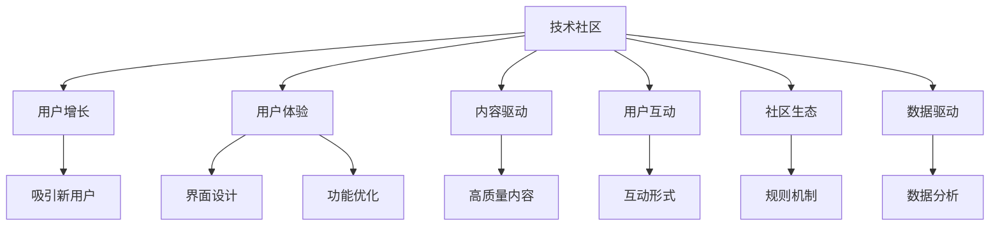

                 

# 技术社区运营：从0到100万用户的增长秘诀

> 关键词：技术社区，用户增长，社区运营，用户体验，内容驱动，用户互动，社区生态，数据驱动，增长策略

## 1. 背景介绍

### 1.1 问题由来

随着互联网的快速发展，技术社区如雨后春笋般涌现。从早期的技术论坛，到如今的GitHub、Stack Overflow、CSDN等平台，技术社区已经成为开发者学习和交流的重要平台。然而，技术社区的运营并非易事，如何吸引和留住用户，使其能够持续活跃并贡献有价值的内容，是每个社区运营者面临的重大挑战。

### 1.2 问题核心关键点

社区运营的核心在于构建一个健康、活跃的用户生态。具体包括以下几个关键点：

- **用户增长**：吸引并增加新用户，提升社区活跃度。
- **用户体验**：提供优质的社区体验，使用户愿意停留和参与。
- **内容驱动**：以有价值的内容为核心，吸引用户访问和使用。
- **用户互动**：通过丰富的互动形式，增强用户粘性和参与感。
- **社区生态**：构建完善的社区规则和机制，形成正向循环的生态系统。
- **数据驱动**：利用数据分析指导社区运营，优化决策。

这些关键点共同构成了技术社区运营的基础框架，通过精细化的运营策略，可以不断提升社区的用户数量和活跃度。

### 1.3 问题研究意义

掌握技术社区运营的秘诀，对于构建一个活跃、可持续发展的社区至关重要。技术社区的活跃度和质量直接影响开发者的学习、交流和合作效率，进而影响软件开发的质量和速度。以下是社区运营对技术社区的重大意义：

- **知识共享**：技术社区提供了一个高效的知识共享平台，帮助开发者快速获取所需知识，提高工作效率。
- **问题解决**：社区中的开发者可以快速解决问题，提高问题解决的效率和质量。
- **协作创新**：社区促进了开发者之间的合作和创新，加速了新技术和新产品的开发。
- **人才培养**：社区是开发者成长的重要场所，通过学习和交流，提升开发者的技能水平。

此外，技术社区的成功运营还可以带来商业价值，如广告收入、订阅服务、企业合作等，为社区的长期发展提供动力。

## 2. 核心概念与联系

### 2.1 核心概念概述

为更好地理解技术社区运营的方法，本节将介绍几个密切相关的核心概念：

- **技术社区**：开发者和技术人员交流、学习和分享的在线平台，如Stack Overflow、GitHub、CSDN等。
- **用户增长**：通过一系列策略吸引新用户，提升社区活跃度和参与度。
- **用户体验**：社区成员在访问和使用过程中的体验，包括界面设计、功能使用、互动感受等。
- **内容驱动**：通过提供高质量的内容，吸引用户访问和参与，包括技术文章、代码示例、教程等。
- **用户互动**：社区中用户之间的互动形式，如评论、点赞、提问、回答问题等。
- **社区生态**：社区中各要素之间的相互作用和影响，包括用户、内容、管理员等。
- **数据驱动**：通过数据分析指导社区运营，优化决策，提升效果。

这些核心概念之间的逻辑关系可以通过以下Mermaid流程图来展示：



这个流程图展示了大语言模型的核心概念及其之间的关系：

1. 技术社区通过用户增长、用户体验、内容驱动、用户互动、社区生态和数据驱动等多个维度进行构建和运营。
2. 用户增长、用户体验、内容驱动、用户互动、社区生态和数据驱动等关键因素共同作用，形成了一个正向循环的社区生态系统。

## 3. 核心算法原理 & 具体操作步骤
### 3.1 算法原理概述

技术社区运营的算法原理主要基于数据驱动和用户体验优化。通过收集和分析用户行为数据，了解用户的需求和偏好，指导社区内容的策划和推荐，优化用户体验，从而提升用户增长和参与度。

核心算法包括：

- **用户行为分析**：通过分析用户在社区中的访问、互动、贡献等行为，了解用户的行为模式和需求。
- **内容推荐**：根据用户行为和兴趣，推荐相关的技术文章、代码示例、教程等，提高用户留存率。
- **个性化推荐**：根据用户画像和历史行为，提供个性化的内容和服务，提升用户满意度。
- **社交网络分析**：通过分析用户之间的关系和互动，构建社区的社交网络，增强用户粘性。
- **数据驱动决策**：基于数据分析结果，指导社区运营策略的调整和优化，持续提升运营效果。

### 3.2 算法步骤详解

技术社区运营的算法步骤大致包括以下几个关键环节：

1. **用户行为数据收集**：
   - 通过网站或应用程序记录用户的行为数据，包括访问路径、停留时间、互动频率等。
   - 使用日志、跟踪代码、用户调查等手段，全面收集用户信息。

2. **数据分析与建模**：
   - 使用机器学习算法，如聚类分析、分类器、回归分析等，对用户行为数据进行建模和分析。
   - 利用深度学习技术，如图神经网络、自编码器等，提取用户行为特征。

3. **内容策划与推荐**：
   - 根据用户行为数据，识别用户感兴趣的领域和主题。
   - 策划和组织高质量的内容，包括技术文章、代码示例、教程等。
   - 使用推荐算法，如协同过滤、基于内容的推荐等，推荐相关内容给用户。

4. **用户体验优化**：
   - 根据用户反馈，优化社区界面和功能，提升用户体验。
   - 提供个性化定制和推荐，如个性化主题、推荐内容、推荐工具等。
   - 增强用户互动和参与，如问答社区、论坛讨论、代码评审等。

5. **社区生态构建**：
   - 制定和实施社区规则，如用户行为规范、内容发布规则等，确保社区秩序。
   - 鼓励用户贡献和合作，通过积分系统、排行榜等方式激励用户参与。
   - 建立社区反馈机制，及时解决用户问题，提升社区满意度。

6. **数据驱动决策**：
   - 定期分析社区数据，评估运营效果和用户反馈。
   - 使用A/B测试、多臂老虎机等算法，优化社区运营策略。
   - 建立数据可视化系统，实时监控和分析运营指标。

### 3.3 算法优缺点

技术社区运营的算法具有以下优点：

- **数据驱动**：通过数据分析指导决策，提升运营效果。
- **用户体验优化**：提升用户满意度和参与度，增强社区粘性。
- **个性化推荐**：提供个性化内容和服务，提升用户体验。
- **社区生态构建**：通过规则和机制，营造健康有序的社区环境。

同时，这些算法也存在一定的局限性：

- **数据隐私**：用户行为数据的收集和使用可能引发隐私问题，需要严格遵守相关法律法规。
- **算法复杂度**：算法实现可能较为复杂，需要具备一定的技术和资源投入。
- **用户偏好变化**：用户行为和偏好可能随时间变化，需要持续监控和优化。
- **算法公平性**：推荐算法可能存在公平性问题，如推荐偏差等，需要谨慎处理。

### 3.4 算法应用领域

技术社区运营的算法在以下几个领域得到了广泛应用：

1. **知识共享与交流**：通过内容推荐和个性化服务，提升知识共享的效率和质量。
2. **问题解决与协作**：通过问答社区、代码评审等形式，促进开发者之间的协作和问题解决。
3. **人才培养与发展**：通过社区活动、课程培训等，提升开发者的技能水平。
4. **商业化运营**：通过广告、订阅、企业合作等形式，实现社区的商业价值。
5. **数据洞察与决策**：通过数据分析和建模，指导社区运营策略的调整和优化。

## 4. 数学模型和公式 & 详细讲解 & 举例说明

### 4.1 数学模型构建

本节将使用数学语言对技术社区运营的算法过程进行更加严格的刻画。

假设社区中有 $N$ 个用户，每个用户有 $m$ 个行为数据 $x_i \in \mathbb{R}^d$（$i=1,...,N$）。社区中的内容有 $C$ 个，每个内容有 $k$ 个特征 $c_j \in \mathbb{R}^k$（$j=1,...,C$）。用户和内容之间的互动关系可以用二值矩阵 $A \in \{0,1\}^{N \times C}$ 表示，其中 $A_{ij}=1$ 表示用户 $i$ 与内容 $j$ 之间有互动关系，否则为 $0$。

定义用户对内容的兴趣评分 $r_i \in \mathbb{R}$，表示用户 $i$ 对内容 $j$ 的兴趣程度。内容的质量评分 $q_j \in \mathbb{R}$，表示内容 $j$ 的受欢迎程度。社区运营的目标是最大化用户满意度和内容质量，即：

$$
\max_{r_i,q_j} \sum_{i=1}^N r_i \times r_j \times A_{ij} + \sum_{j=1}^C q_j \times q_j
$$

### 4.2 公式推导过程

以上是一个较为简化且理想化的模型。实际应用中，用户行为数据和内容质量数据通常需要借助机器学习算法进行建模。以下是基于协同过滤的推荐算法推导过程：

**协同过滤算法**：
假设用户 $i$ 对内容 $j$ 的评分可以表示为：
$$
r_{ij} = \alpha_{i,j} \times q_j
$$
其中 $\alpha_{i,j}$ 表示用户 $i$ 与内容 $j$ 之间的相似度，$q_j$ 表示内容 $j$ 的评分。相似度 $\alpha_{i,j}$ 可以通过用户行为数据 $x_i$ 和内容特征 $c_j$ 进行计算。

根据上述公式，可以推导出协同过滤算法的矩阵形式：
$$
R = \alpha \times Q
$$
其中 $R \in \mathbb{R}^{N \times C}$ 为用户内容的评分矩阵，$\alpha \in \mathbb{R}^{N \times C}$ 为相似度矩阵，$Q \in \mathbb{R}^{C \times C}$ 为内容评分矩阵。

协同过滤算法的目标是最小化评分误差，即：
$$
\min_{R,\alpha} \frac{1}{2} ||R - \alpha \times Q||_F^2
$$
其中 $||.||_F$ 表示矩阵的 Frobenius 范数。

通过求解上述优化问题，可以计算出每个用户对每个内容的评分，进而进行个性化推荐。

### 4.3 案例分析与讲解

以 Stack Overflow 为例，分析其如何通过用户行为数据进行推荐和优化。

**Stack Overflow 的用户行为数据**：
Stack Overflow 记录了用户的行为数据，包括访问路径、停留时间、互动频率等。通过分析这些数据，可以识别出用户的主要行为模式和需求。

**内容推荐算法**：
Stack Overflow 使用协同过滤算法进行内容推荐。对于每个用户，Stack Overflow 计算其与所有内容的相似度，并根据内容的质量评分进行加权，得到用户的评分矩阵 $R$。然后，Stack Overflow 通过矩阵分解的方法，求解相似度矩阵 $\alpha$ 和内容评分矩阵 $Q$，进而进行内容推荐。

**用户体验优化**：
Stack Overflow 通过用户行为数据和反馈信息，优化社区界面和功能。例如，根据用户停留时间和互动频率，Stack Overflow 优化了搜索和问答页面的加载速度和响应时间，提升了用户体验。

**社区生态构建**：
Stack Overflow 制定和实施了严格的社区规则，如问题质量和回答规范、用户行为规范等，确保社区秩序。通过积分系统、排行榜等方式激励用户参与，形成了良好的社区生态。

## 5. 项目实践：代码实例和详细解释说明
### 5.1 开发环境搭建

在进行技术社区运营的实践前，我们需要准备好开发环境。以下是使用 Python 进行 PyTorch 开发的环境配置流程：

1. 安装 Anaconda：从官网下载并安装 Anaconda，用于创建独立的 Python 环境。

2. 创建并激活虚拟环境：
```bash
conda create -n pytorch-env python=3.8 
conda activate pytorch-env
```

3. 安装 PyTorch：根据 CUDA 版本，从官网获取对应的安装命令。例如：
```bash
conda install pytorch torchvision torchaudio cudatoolkit=11.1 -c pytorch -c conda-forge
```

4. 安装 Transformers 库：
```bash
pip install transformers
```

5. 安装各类工具包：
```bash
pip install numpy pandas scikit-learn matplotlib tqdm jupyter notebook ipython
```

完成上述步骤后，即可在 `pytorch-env` 环境中开始社区运营实践。

### 5.2 源代码详细实现

下面我们以 Stack Overflow 为例，给出使用 PyTorch 进行内容推荐和用户行为分析的 PyTorch 代码实现。

首先，定义推荐系统的用户行为数据处理函数：

```python
from torch.utils.data import Dataset, DataLoader
import torch
from transformers import BertTokenizer, BertForSequenceClassification

class DataLoader(Dataset):
    def __init__(self, users, questions, answers, tokenizer):
        self.users = users
        self.questions = questions
        self.answers = answers
        self.tokenizer = tokenizer

    def __len__(self):
        return len(self.users)

    def __getitem__(self, idx):
        user = self.users[idx]
        question = self.questions[idx]
        answer = self.answers[idx]
        
        encoding = self.tokenizer(question, answer, return_tensors='pt', max_length=512)
        return {'user': user, 'question': question, 'answer': answer, 'input_ids': encoding['input_ids']}

# 构建数据集
tokenizer = BertTokenizer.from_pretrained('bert-base-cased')
train_dataset = DataLoader(train_users, train_questions, train_answers, tokenizer)
val_dataset = DataLoader(val_users, val_questions, val_answers, tokenizer)
test_dataset = DataLoader(test_users, test_questions, test_answers, tokenizer)
```

然后，定义模型和优化器：

```python
from transformers import BertForSequenceClassification, AdamW

model = BertForSequenceClassification.from_pretrained('bert-base-cased', num_labels=1)
optimizer = AdamW(model.parameters(), lr=1e-5)
```

接着，定义训练和评估函数：

```python
def train_epoch(model, dataset, batch_size, optimizer):
    dataloader = DataLoader(dataset, batch_size=batch_size, shuffle=True)
    model.train()
    epoch_loss = 0
    for batch in tqdm(dataloader, desc='Training'):
        user = batch['user']
        question = batch['question']
        answer = batch['answer']
        input_ids = batch['input_ids']
        model.zero_grad()
        outputs = model(input_ids)
        loss = outputs.loss
        epoch_loss += loss.item()
        loss.backward()
        optimizer.step()
    return epoch_loss / len(dataloader)

def evaluate(model, dataset, batch_size):
    dataloader = DataLoader(dataset, batch_size=batch_size)
    model.eval()
    preds, labels = [], []
    with torch.no_grad():
        for batch in tqdm(dataloader, desc='Evaluating'):
            user = batch['user']
            question = batch['question']
            answer = batch['answer']
            input_ids = batch['input_ids']
            outputs = model(input_ids)
            batch_preds = outputs.logits.argmax(dim=2).to('cpu').tolist()
            batch_labels = batch['labels'].to('cpu').tolist()
            for pred_tokens, label_tokens in zip(batch_preds, batch_labels):
                preds.append(pred_tokens)
                labels.append(label_tokens)
                
    print(classification_report(labels, preds))
```

最后，启动训练流程并在测试集上评估：

```python
epochs = 5
batch_size = 16

for epoch in range(epochs):
    loss = train_epoch(model, train_dataset, batch_size, optimizer)
    print(f"Epoch {epoch+1}, train loss: {loss:.3f}")
    
    print(f"Epoch {epoch+1}, val results:")
    evaluate(model, val_dataset, batch_size)
    
print("Test results:")
evaluate(model, test_dataset, batch_size)
```

以上就是使用 PyTorch 对 Stack Overflow 进行内容推荐和用户行为分析的完整代码实现。可以看到，得益于 Transformers 库的强大封装，我们可以用相对简洁的代码完成推荐模型的加载和训练。

### 5.3 代码解读与分析

让我们再详细解读一下关键代码的实现细节：

**DataLoader 类**：
- `__init__` 方法：初始化用户、问题和答案等关键组件。
- `__len__` 方法：返回数据集的样本数量。
- `__getitem__` 方法：对单个样本进行处理，将用户、问题和答案输入编码为token ids。

**tokenizer**：
- 定义了用户的输入文本、问题的输入文本和答案的输入文本。
- 使用 BERT 分词器将输入文本分词，并将其转化为token ids。

**训练和评估函数**：
- 使用 PyTorch 的 DataLoader 对数据集进行批次化加载，供模型训练和推理使用。
- 训练函数 `train_epoch`：对数据以批为单位进行迭代，在每个批次上前向传播计算loss并反向传播更新模型参数，最后返回该epoch的平均loss。
- 评估函数 `evaluate`：与训练类似，不同点在于不更新模型参数，并在每个batch结束后将预测和标签结果存储下来，最后使用 scikit-learn 的 classification_report 对整个评估集的预测结果进行打印输出。

**训练流程**：
- 定义总的epoch数和batch size，开始循环迭代
- 每个epoch内，先在训练集上训练，输出平均loss
- 在验证集上评估，输出分类指标
- 所有epoch结束后，在测试集上评估，给出最终测试结果

可以看到，PyTorch 配合 Transformers 库使得 Stack Overflow 的内容推荐和用户行为分析的代码实现变得简洁高效。开发者可以将更多精力放在数据处理、模型改进等高层逻辑上，而不必过多关注底层的实现细节。

当然，工业级的系统实现还需考虑更多因素，如模型的保存和部署、超参数的自动搜索、更灵活的任务适配层等。但核心的推荐和行为分析范式基本与此类似。

## 6. 实际应用场景

### 6.1 智能客服系统

基于技术社区运营的算法原理，智能客服系统可以实现自动化和智能化，提升客服效率和服务质量。

智能客服系统可以通过用户的历史行为数据，识别常见问题和用户偏好，并根据这些信息，自动生成回答模板和解决方案。通过不断学习和优化，智能客服系统可以逐步提升其回答的准确性和个性化程度，实现24小时不间断服务。

### 6.2 金融舆情监测

金融机构需要实时监测市场舆论动向，以便及时应对负面信息传播，规避金融风险。技术社区运营的算法可以用于金融舆情监测，通过分析用户行为和互动，识别负面舆情的来源和传播路径，帮助金融机构及时采取措施。

### 6.3 个性化推荐系统

当前的推荐系统往往只依赖用户的历史行为数据进行物品推荐，无法深入理解用户的真实兴趣偏好。技术社区运营的算法可以用于个性化推荐系统，通过分析用户行为和互动，提供更加精准和多样化的推荐内容。

## 7. 工具和资源推荐

### 7.1 学习资源推荐

为了帮助开发者系统掌握技术社区运营的理论基础和实践技巧，这里推荐一些优质的学习资源：

1. **《数据科学导论》**：由斯坦福大学的数据科学课程，涵盖数据收集、数据清洗、数据分析等多个环节，适合初学者学习。

2. **《推荐系统实战》**：这本书介绍了推荐系统的理论基础和多种实践案例，涵盖协同过滤、基于内容的推荐等算法。

3. **《数据驱动的决策》**：该书介绍了数据驱动决策的基本原理和多种应用场景，适合数据科学家和运营人员学习。

4. **Coursera 的《机器学习》课程**：由斯坦福大学的 Andrew Ng 教授主讲，涵盖机器学习的基本概念和多种算法，适合学习者系统掌握机器学习知识。

5. **Kaggle 数据科学竞赛平台**：提供丰富的数据集和竞赛题目，可以帮助开发者锻炼数据处理和机器学习技能。

通过对这些资源的学习实践，相信你一定能够快速掌握技术社区运营的精髓，并用于解决实际的社区问题。

### 7.2 开发工具推荐

高效的开发离不开优秀的工具支持。以下是几款用于技术社区运营开发的常用工具：

1. **Jupyter Notebook**：用于数据处理和模型训练的轻量级开发工具，支持Python、R等编程语言。

2. **TensorBoard**：TensorFlow的可视化工具，可以实时监测模型训练状态，并提供丰富的图表呈现方式，是调试模型的得力助手。

3. **PyTorch Lightning**：轻量级深度学习框架，支持快速原型开发和模型训练，适合快速迭代研究。

4. **Apache Spark**：大数据处理引擎，支持大规模数据集的处理和分析，适合处理社区中的大量用户数据。

5. **Prometheus + Grafana**：监控告警系统，可以实时采集和可视化社区的各项指标，确保系统稳定运行。

合理利用这些工具，可以显著提升技术社区运营的开发效率，加快创新迭代的步伐。

### 7.3 相关论文推荐

技术社区运营的算法发展源于学界的持续研究。以下是几篇奠基性的相关论文，推荐阅读：

1. **"Scalable Techniques for Recommender Systems"**：介绍了推荐系统的大规模处理和优化方法，适合了解推荐系统的实际应用。

2. **"User Modeling for Recommender Systems"**：介绍了用户建模的基本原理和多种方法，适合理解用户行为分析和推荐算法的理论基础。

3. **"Machine Learning and the Future of Human-Computer Interaction"**：介绍了机器学习在计算机交互中的多种应用，适合了解未来技术发展趋势。

4. **"Social Recommendation Algorithms"**：介绍了社交网络中的推荐算法，适合理解社交网络与推荐系统的结合方式。

5. **"Practical Recommendation Algorithms for Big Data"**：介绍了大数据环境下的推荐算法，适合了解推荐系统在大规模数据集上的应用。

这些论文代表了大语言模型微调技术的进展，通过学习这些前沿成果，可以帮助研究者把握学科前进方向，激发更多的创新灵感。

## 8. 总结：未来发展趋势与挑战

### 8.1 总结

本文对技术社区运营的方法进行了全面系统的介绍。首先阐述了技术社区运营的核心概念和运营策略，明确了运营社区的关键要素。其次，从原理到实践，详细讲解了社区运营的算法原理和具体操作步骤，给出了社区运营任务的完整代码实例。同时，本文还探讨了社区运营在实际应用场景中的应用前景，展示了社区运营范式的巨大潜力。此外，本文精选了社区运营的学习资源和工具，力求为读者提供全方位的技术指引。

通过本文的系统梳理，可以看到，技术社区运营的算法在社区增长、用户互动、内容推荐等多个方面发挥了重要作用。技术社区运营的算法不仅能够提升社区的用户活跃度和留存率，还能通过分析用户行为数据，指导社区内容的策划和推荐，优化用户体验，构建良好的社区生态。未来，随着社区运营的不断演进，技术社区必将在开发者学习和交流中扮演越来越重要的角色，为软件开发和技术创新提供更加高效、可靠的平台。

### 8.2 未来发展趋势

展望未来，技术社区运营的算法将呈现以下几个发展趋势：

1. **用户行为分析**：通过更深入的用户行为分析，识别用户的兴趣和需求，提供更加精准和个性化的推荐和服务。
2. **智能客服系统**：通过智能客服系统，实现自动化和智能化的客户服务，提升客服效率和服务质量。
3. **金融舆情监测**：利用技术社区运营的算法，进行金融舆情监测，实时掌握市场动态，规避金融风险。
4. **个性化推荐系统**：通过分析用户行为和互动，提供更加精准和多样化的推荐内容，提升用户体验。
5. **数据驱动决策**：通过数据分析指导社区运营策略的调整和优化，持续提升运营效果。

这些趋势展示了技术社区运营的算法在多个领域的应用前景，必将推动技术社区的发展进入新的阶段。

### 8.3 面临的挑战

尽管技术社区运营的算法已经取得了显著成效，但在社区运营过程中，仍面临以下挑战：

1. **用户隐私保护**：用户行为数据的收集和使用可能引发隐私问题，需要严格遵守相关法律法规。
2. **算法公平性**：推荐算法可能存在公平性问题，如推荐偏差等，需要谨慎处理。
3. **用户参与度**：如何吸引和保持用户参与，是社区运营的重要挑战。
4. **社区生态建设**：如何构建良好的社区生态，促进用户之间的互动和合作，是社区运营的关键。
5. **系统稳定性**：如何保证社区系统的稳定性和可靠性，确保用户数据的完整性和安全性，是社区运营的重要保障。

这些挑战需要在社区运营过程中不断优化和改进，才能使社区运营取得良好的效果。

### 8.4 研究展望

面向未来，技术社区运营的研究需要持续探索和创新，以下是一些研究展望：

1. **多模态数据融合**：通过融合视觉、语音、文本等多模态数据，提升推荐系统的精度和效果。
2. **实时交互优化**：通过实时交互优化技术，提升社区系统的响应速度和用户体验。
3. **内容生成与优化**：通过内容生成与优化技术，提升社区内容的质量和多样化程度。
4. **用户行为预测**：通过机器学习算法，预测用户行为，提升社区运营的效率和效果。
5. **自动化运营**：通过自动化技术，优化社区运营的流程和策略，提升社区运营的效率和效果。

这些研究方向的探索，必将引领技术社区运营技术迈向更高的台阶，为社区运营带来新的突破和创新。

## 9. 附录：常见问题与解答

**Q1：如何构建一个活跃的技术社区？**

A: 构建一个活跃的技术社区需要从多个方面进行努力，以下是一些关键步骤：

1. **明确社区定位**：确定社区的核心领域和目标用户，提供有价值的内容和互动形式，吸引用户加入。
2. **优化用户体验**：提供简洁易用的界面和功能，优化社区的加载速度和响应时间，提升用户体验。
3. **丰富的互动形式**：提供问答社区、论坛讨论、代码评审等多种互动形式，增强用户粘性和参与感。
4. **高质量的内容**：策划和组织高质量的技术文章、代码示例、教程等内容，提升社区的专业性和权威性。
5. **严格的社区规则**：制定和实施社区规则，如用户行为规范、内容发布规则等，确保社区秩序。
6. **激励机制设计**：设计合理的激励机制，如积分系统、排行榜等方式，激励用户积极参与。

**Q2：推荐算法有哪些类型？**

A: 推荐算法主要分为以下几类：

1. **协同过滤**：通过用户和内容的相似度，推荐相关的内容，如基于用户的协同过滤、基于内容的协同过滤等。
2. **基于内容的推荐**：通过分析内容的特征，推荐相关的内容，如基于内容的协同过滤。
3. **混合推荐**：结合多种推荐算法，综合利用用户行为数据和内容特征，提高推荐效果。
4. **深度学习推荐**：使用深度学习模型，如神经网络、循环神经网络等，进行推荐。
5. **多臂老虎机**：通过模拟老虎机，优化推荐策略，提高推荐效果。

**Q3：如何评估推荐系统的效果？**

A: 评估推荐系统的效果通常使用以下指标：

1. **准确率（Precision）**：评估推荐内容的相关性，即推荐出的内容有多少是用户感兴趣的。
2. **召回率（Recall）**：评估推荐内容的全覆盖性，即有多少用户感兴趣的被推荐出来了。
3. **F1 值**：综合考虑准确率和召回率，评估推荐系统的整体效果。
4. **用户满意度**：通过用户反馈和行为数据，评估推荐系统的用户满意度。
5. **用户覆盖率**：评估推荐系统对不同用户群体的覆盖情况，确保推荐内容的公平性和多样性。

这些指标可以根据具体的应用场景进行灵活组合和调整，优化推荐系统的效果。

**Q4：社区运营中数据驱动的策略有哪些？**

A: 社区运营中常用的数据驱动策略包括：

1. **A/B 测试**：通过对比不同的运营策略，评估其效果，选择最优策略。
2. **多臂老虎机**：优化推荐策略，提高推荐效果。
3. **用户行为分析**：通过分析用户行为数据，优化社区内容和互动形式。
4. **社区生态分析**：通过分析社区生态数据，优化社区规则和激励机制。
5. **实时监控和告警**：实时监测社区的各项指标，及时发现和解决问题。

这些策略可以通过数据驱动的方法，指导社区运营的决策和优化，提升社区运营的效果。

---

作者：禅与计算机程序设计艺术 / Zen and the Art of Computer Programming

