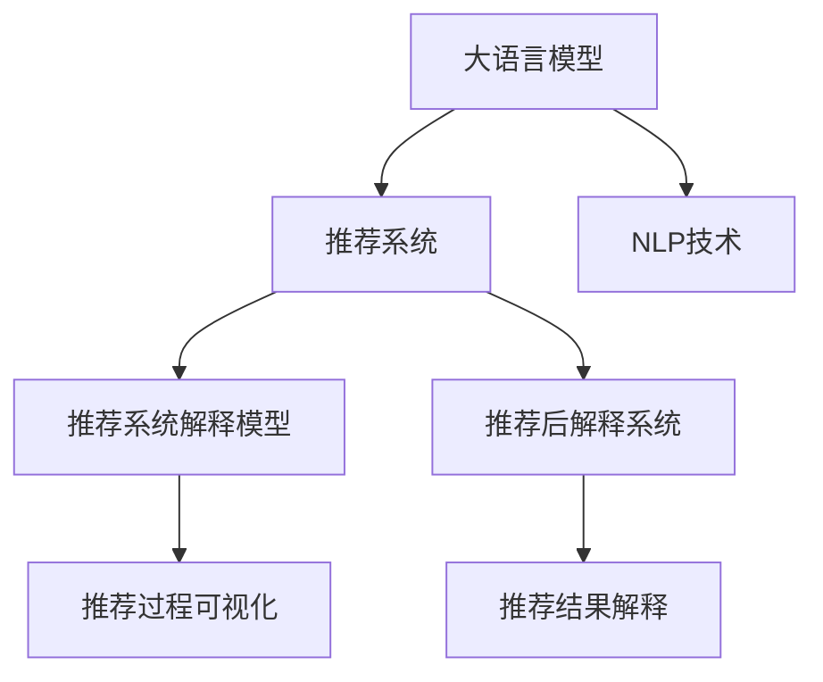

                 

# 探讨大模型在电商平台商品推荐解释性中的应用

> 关键词：大语言模型,解释性,商品推荐,电商平台,自然语言处理,NLP,深度学习,推荐系统

## 1. 背景介绍

### 1.1 问题由来

近年来，电商平台已经成为消费者在线购物的重要渠道，如何更好地满足用户的个性化需求，提升购物体验，成为各大电商平台竞相探索的重点。其中，基于大模型的推荐系统，因其强大的数据处理能力和适应性，被广泛应用在商品推荐中。然而，现有的推荐系统大多偏向于黑盒模型，缺乏对推荐过程的解释性和可解释性，难以有效说服用户，甚至可能在用户产生怀疑时反而降低推荐系统的信任度。

为解决这一问题，各大电商平台的研发团队开始探索在大模型基础上构建具有解释性的推荐系统。通过构建更加透明的推荐逻辑，不仅能提升用户体验，更能增强平台的信任度。本文将围绕电商平台商品推荐中的大模型应用，重点探讨如何通过解释性来提升推荐的可信度和有效性。

### 1.2 问题核心关键点

电商平台的商品推荐系统，旨在通过用户的购物行为数据，预测用户可能感兴趣的商品，并推荐给用户。核心在于将用户的原始行为数据，如浏览、点击、购买记录，转化为用户对商品的类型、品牌、价格等方面的偏好。现有推荐系统通常基于统计学习或机器学习模型，如协同过滤、矩阵分解、深度学习等，通过用户历史行为预测用户未来行为，从而生成推荐列表。这些模型往往偏向于追求精度最大化，而忽略了推荐结果的解释性。

构建具有解释性的推荐系统，关键在于将推荐过程透明化，让用户能够理解推荐逻辑，信任推荐结果。解释性推荐系统不仅需要展现推荐理由，还要展示推荐过程中的关键数据和推断过程。这可以通过两种方式实现：

1. **推荐系统解释模型(Explainable Recommendation Model, ERMs)**：直接在推荐模型中嵌入解释性组件，将推荐过程和结果以可理解的方式呈现给用户。
2. **推荐后解释系统(Post-hoc Explanation System, PES)**：在推荐模型输出结果后，利用自然语言处理(NLP)等技术，对推荐结果进行解释说明。

本文将重点探讨如何通过大语言模型，结合推荐后解释系统，构建具有解释性的电商平台商品推荐系统。

## 2. 核心概念与联系

### 2.1 核心概念概述

为更好地理解构建具有解释性的电商平台商品推荐系统，本节将介绍几个密切相关的核心概念：

- **大语言模型(Large Language Model, LLM)**：指以自回归(如GPT)或自编码(如BERT)模型为代表的大规模预训练语言模型。通过在海量无标签文本数据上进行预训练，学习通用的语言表示，具备强大的语言理解和生成能力。

- **推荐系统(Recommendation System, RS)**：指通过分析用户行为数据，推荐用户可能感兴趣的商品或内容。推荐系统可以分为基于协同过滤、矩阵分解和深度学习的推荐模型，以及基于规则的推荐系统等。

- **推荐系统解释模型(Explainable Recommendation Model, ERMs)**：指在推荐模型中嵌入解释性组件，将推荐过程和结果以可理解的方式呈现给用户。

- **推荐后解释系统(Post-hoc Explanation System, PES)**：指在推荐模型输出结果后，利用NLP等技术，对推荐结果进行解释说明。

- **自然语言处理(Natural Language Processing, NLP)**：指利用计算机技术，使计算机能够理解和处理人类语言的技术。NLP技术在构建推荐系统解释性中扮演重要角色。

这些核心概念之间的逻辑关系可以通过以下Mermaid流程图来展示：



这个流程图展示了大语言模型在推荐系统中的应用及其解释性构建：

1. 大语言模型通过预训练获得基础能力。
2. 推荐系统基于大模型进行推荐。
3. 推荐系统解释模型和大语言模型结合，可视化推荐过程。
4. 推荐后解释系统对推荐结果进行自然语言解释。
5. 自然语言处理技术辅助构建推荐系统解释性。

## 3. 核心算法原理 & 具体操作步骤
### 3.1 算法原理概述

基于大语言模型的电商平台推荐系统，本质上是一个基于深度学习的推荐模型，通过大模型的预训练能力和推荐模型的任务适配能力，实现高效、个性化的商品推荐。其核心思想是：将大语言模型视作一个强大的"特征提取器"，通过推荐模型的任务适配层，输出推荐结果，并结合推荐后解释系统，对推荐过程和结果进行解释说明，最终实现具有解释性的推荐系统。

形式化地，假设大语言模型为 $M_{\theta}$，推荐系统为 $R$。在大规模标注数据 $D=\{(x_i,y_i)\}_{i=1}^N$ 上进行微调，得到推荐模型 $R_{\theta}$。对于新商品 $x$，使用推荐模型 $R_{\theta}$ 进行预测，得到推荐结果 $y=\hat{y}$。然后，利用大语言模型对推荐结果进行解释说明，输出自然语言描述。

### 3.2 算法步骤详解

基于大语言模型的电商平台推荐系统一般包括以下几个关键步骤：

**Step 1: 准备数据集**
- 收集电商平台用户的历史行为数据，如浏览、点击、购买记录等。
- 对原始行为数据进行预处理，去除异常数据，划分训练集、验证集和测试集。
- 从电商平台商品库中选取目标商品，生成标注数据集 $D=\{(x_i,y_i)\}_{i=1}^N$，其中 $x_i$ 为商品描述，$y_i$ 为推荐标签。

**Step 2: 添加任务适配层**
- 在大语言模型 $M_{\theta}$ 的基础上，添加一个任务适配层，输出推荐结果 $y=\hat{y}$。
- 对于推荐系统，通常使用深度学习模型，如DNN、RNN、Transformer等，以及可能的池化、编码器-解码器结构等。
- 任务适配层应保证能充分捕捉用户行为特征和商品属性，同时对模型的推理速度和资源消耗进行控制。

**Step 3: 设计推荐后解释系统**
- 利用大语言模型生成推荐结果的解释说明，采用自然语言处理技术生成文本描述。
- 具体而言，可以采用基于模板的生成、基于上下文的生成、基于逻辑推理的生成等策略。
- 生成的解释文本应简洁明了，便于用户理解。

**Step 4: 训练推荐系统**
- 在训练集上训练推荐系统 $R_{\theta}$，选择合适的优化算法如AdamW、SGD等，设置学习率、批大小、迭代轮数等。
- 在验证集上定期评估推荐系统的性能，避免过拟合。
- 训练过程中，不断更新任务适配层的参数，直至模型收敛。

**Step 5: 生成推荐结果**
- 对目标商品 $x$，使用训练好的推荐系统 $R_{\theta}$ 进行预测，得到推荐结果 $y=\hat{y}$。
- 利用大语言模型生成推荐结果的解释说明，输出自然语言描述。
- 将推荐结果和解释文本一起呈现给用户。

### 3.3 算法优缺点

基于大语言模型的电商平台推荐系统，具有以下优点：

1. **高效性**：大语言模型具备强大的特征提取能力，可以快速处理和融合用户行为数据和商品属性信息，生成推荐结果。
2. **个性化**：大模型具备较强的泛化能力，可以根据用户的历史行为数据，生成个性化的推荐结果。
3. **解释性**：通过推荐后解释系统，将推荐结果以自然语言的形式呈现给用户，增加推荐的可信度和透明度。
4. **鲁棒性**：大语言模型可以通过微调应对数据分布的变化，保持推荐系统的稳定性。

然而，该方法也存在一定的局限性：

1. **数据需求高**：构建推荐系统解释性需要收集大量的用户行为数据，以及详细的商品属性信息，这可能增加数据收集和处理的成本。
2. **复杂度较高**：推荐后解释系统需要利用NLP技术生成自然语言描述，过程复杂，可能影响推荐速度和系统性能。
3. **可解释性度量**：推荐系统解释性的衡量标准较难定义，不同用户对解释的接受度可能不同，难以量化和统一。

尽管存在这些局限性，但就目前而言，基于大语言模型的推荐系统解释性构建，仍然是大模型应用的重要方向。未来相关研究的重点在于如何进一步降低数据需求，提高推荐系统的解释性，同时兼顾性能和可解释性等因素。

### 3.4 算法应用领域

基于大语言模型的推荐系统解释性构建，已经在电商平台商品推荐中得到了初步应用，覆盖了以下几个主要领域：

- **商品分类推荐**：根据用户的历史购买和浏览记录，推荐相关分类下的商品。
- **个性化推荐**：根据用户行为数据和商品属性，生成个性化推荐列表。
- **排行榜推荐**：基于用户点击率、评分等行为数据，生成商品排行榜。
- **新商品推荐**：利用用户行为数据和商品属性，推荐新上架的商品。

除了上述这些常见任务外，推荐系统解释性还扩展到了更多场景中，如场景推荐、趋势推荐等，为电商平台的推荐系统带来了全新的突破。随着大语言模型的不断演进和推荐技术的发展，相信推荐系统解释性将在更多领域得到广泛应用，为用户提供更加透明、可信的购物体验。

## 4. 数学模型和公式 & 详细讲解  
### 4.1 数学模型构建

本节将使用数学语言对基于大语言模型的电商平台推荐系统进行更加严格的刻画。

假设电商平台用户的历史行为数据为 $X=\{x_1, x_2, ..., x_n\}$，其中 $x_i$ 为第 $i$ 个用户的历史行为数据。假设目标商品为 $x$，商品属性为 $F=\{f_1, f_2, ..., f_m\}$，其中 $f_j$ 为第 $j$ 个商品属性。

定义推荐系统为 $R_{\theta}:\mathcal{X}\times\mathcal{F}\rightarrow\{0,1\}$，其中 $\theta$ 为模型参数。

大语言模型为 $M_{\theta}:\mathcal{X}\rightarrow\mathcal{Y}$，其中 $\mathcal{Y}$ 为输出空间。对于目标商品 $x$，使用大语言模型 $M_{\theta}$ 生成推荐结果的解释说明 $y=\hat{y}$。

推荐系统输出 $y=\hat{y}$ 的损失函数为：

$$
\mathcal{L}(\theta) = -\frac{1}{N}\sum_{i=1}^N \log y_i
$$

其中 $y_i$ 为目标商品的推荐标签，$N$ 为标注数据集的大小。

### 4.2 公式推导过程

以下我们以基于Transformer的推荐系统为例，推导推荐结果的损失函数及其梯度的计算公式。

假设推荐系统模型为 $R_{\theta}=[\text{BERT}+\text{DNN}]$，其中 $\text{BERT}$ 为大语言模型，$\text{DNN}$ 为推荐系统的任务适配层。

对于目标商品 $x$，使用推荐系统 $R_{\theta}$ 进行预测，得到推荐结果 $\hat{y}$。定义推荐结果的损失函数为：

$$
\mathcal{L}(\theta) = -\sum_{i=1}^N \log y_i
$$

其中 $y_i$ 为目标商品的推荐标签，$N$ 为标注数据集的大小。

根据链式法则，损失函数对模型参数 $\theta$ 的梯度为：

$$
\frac{\partial \mathcal{L}(\theta)}{\partial \theta} = -\sum_{i=1}^N \frac{1}{y_i} \frac{\partial R_{\theta}(x_i)}{\partial \theta}
$$

其中 $\frac{\partial R_{\theta}(x_i)}{\partial \theta}$ 为推荐系统 $R_{\theta}$ 对参数 $\theta$ 的梯度，可通过反向传播算法高效计算。

在得到损失函数的梯度后，即可带入优化算法，完成推荐系统的迭代优化。重复上述过程直至收敛，最终得到适应电商平台商品推荐任务的最优模型参数 $\theta^*$。

## 5. 项目实践：代码实例和详细解释说明
### 5.1 开发环境搭建

在进行推荐系统开发前，我们需要准备好开发环境。以下是使用Python进行PyTorch开发的环境配置流程：

1. 安装Anaconda：从官网下载并安装Anaconda，用于创建独立的Python环境。

2. 创建并激活虚拟环境：
```bash
conda create -n recommendation-env python=3.8 
conda activate recommendation-env
```

3. 安装PyTorch：根据CUDA版本，从官网获取对应的安装命令。例如：
```bash
conda install pytorch torchvision torchaudio cudatoolkit=11.1 -c pytorch -c conda-forge
```

4. 安装Transformers库：
```bash
pip install transformers
```

5. 安装各类工具包：
```bash
pip install numpy pandas scikit-learn matplotlib tqdm jupyter notebook ipython
```

完成上述步骤后，即可在`recommendation-env`环境中开始推荐系统实践。

### 5.2 源代码详细实现

下面我们以电商平台商品分类推荐任务为例，给出使用Transformers库对BERT模型进行推荐系统开发的PyTorch代码实现。

首先，定义推荐任务的数据处理函数：

```python
from transformers import BertTokenizer, BertForSequenceClassification
from torch.utils.data import Dataset
import torch

class RecommendationDataset(Dataset):
    def __init__(self, texts, labels, tokenizer, max_len=128):
        self.texts = texts
        self.labels = labels
        self.tokenizer = tokenizer
        self.max_len = max_len
        
    def __len__(self):
        return len(self.texts)
    
    def __getitem__(self, item):
        text = self.texts[item]
        label = self.labels[item]
        
        encoding = self.tokenizer(text, return_tensors='pt', max_length=self.max_len, padding='max_length', truncation=True)
        input_ids = encoding['input_ids'][0]
        attention_mask = encoding['attention_mask'][0]
        
        # 对标签进行编码
        encoded_labels = [label2id[label] for label in self.labels] 
        encoded_labels.extend([label2id['O']] * (self.max_len - len(encoded_labels)))
        labels = torch.tensor(encoded_labels, dtype=torch.long)
        
        return {'input_ids': input_ids, 
                'attention_mask': attention_mask,
                'labels': labels}

# 标签与id的映射
label2id = {'O': 0, 'B-CAT': 1, 'I-CAT': 2, 'B-PRD': 3, 'I-PRD': 4}
id2label = {v: k for k, v in label2id.items()}

# 创建dataset
tokenizer = BertTokenizer.from_pretrained('bert-base-cased')

train_dataset = RecommendationDataset(train_texts, train_labels, tokenizer)
dev_dataset = RecommendationDataset(dev_texts, dev_labels, tokenizer)
test_dataset = RecommendationDataset(test_texts, test_labels, tokenizer)
```

然后，定义模型和优化器：

```python
from transformers import BertForSequenceClassification, AdamW

model = BertForSequenceClassification.from_pretrained('bert-base-cased', num_labels=len(label2id))

optimizer = AdamW(model.parameters(), lr=2e-5)
```

接着，定义训练和评估函数：

```python
from torch.utils.data import DataLoader
from tqdm import tqdm
from sklearn.metrics import classification_report

device = torch.device('cuda') if torch.cuda.is_available() else torch.device('cpu')
model.to(device)

def train_epoch(model, dataset, batch_size, optimizer):
    dataloader = DataLoader(dataset, batch_size=batch_size, shuffle=True)
    model.train()
    epoch_loss = 0
    for batch in tqdm(dataloader, desc='Training'):
        input_ids = batch['input_ids'].to(device)
        attention_mask = batch['attention_mask'].to(device)
        labels = batch['labels'].to(device)
        model.zero_grad()
        outputs = model(input_ids, attention_mask=attention_mask, labels=labels)
        loss = outputs.loss
        epoch_loss += loss.item()
        loss.backward()
        optimizer.step()
    return epoch_loss / len(dataloader)

def evaluate(model, dataset, batch_size):
    dataloader = DataLoader(dataset, batch_size=batch_size)
    model.eval()
    preds, labels = [], []
    with torch.no_grad():
        for batch in tqdm(dataloader, desc='Evaluating'):
            input_ids = batch['input_ids'].to(device)
            attention_mask = batch['attention_mask'].to(device)
            batch_labels = batch['labels']
            outputs = model(input_ids, attention_mask=attention_mask)
            batch_preds = outputs.logits.argmax(dim=2).to('cpu').tolist()
            batch_labels = batch_labels.to('cpu').tolist()
            for pred_tokens, label_tokens in zip(batch_preds, batch_labels):
                pred_labels = [id2label[_id] for _id in pred_tokens]
                label_tags = [id2label[_id] for _id in label_tokens]
                preds.append(pred_labels[:len(label_tags)])
                labels.append(label_tags)
                
    print(classification_report(labels, preds))
```

最后，启动训练流程并在测试集上评估：

```python
epochs = 5
batch_size = 16

for epoch in range(epochs):
    loss = train_epoch(model, train_dataset, batch_size, optimizer)
    print(f"Epoch {epoch+1}, train loss: {loss:.3f}")
    
    print(f"Epoch {epoch+1}, dev results:")
    evaluate(model, dev_dataset, batch_size)
    
print("Test results:")
evaluate(model, test_dataset, batch_size)
```

以上就是使用PyTorch对BERT进行商品分类推荐任务开发的完整代码实现。可以看到，得益于Transformers库的强大封装，我们可以用相对简洁的代码完成BERT模型的加载和推荐系统的微调。

### 5.3 代码解读与分析

让我们再详细解读一下关键代码的实现细节：

**RecommendationDataset类**：
- `__init__`方法：初始化文本、标签、分词器等关键组件。
- `__len__`方法：返回数据集的样本数量。
- `__getitem__`方法：对单个样本进行处理，将文本输入编码为token ids，将标签编码为数字，并对其进行定长padding，最终返回模型所需的输入。

**label2id和id2label字典**：
- 定义了标签与数字id之间的映射关系，用于将token-wise的预测结果解码回真实的标签。

**训练和评估函数**：
- 使用PyTorch的DataLoader对数据集进行批次化加载，供模型训练和推理使用。
- 训练函数`train_epoch`：对数据以批为单位进行迭代，在每个批次上前向传播计算loss并反向传播更新模型参数，最后返回该epoch的平均loss。
- 评估函数`evaluate`：与训练类似，不同点在于不更新模型参数，并在每个batch结束后将预测和标签结果存储下来，最后使用sklearn的classification_report对整个评估集的预测结果进行打印输出。

**训练流程**：
- 定义总的epoch数和batch size，开始循环迭代
- 每个epoch内，先在训练集上训练，输出平均loss
- 在验证集上评估，输出分类指标
- 所有epoch结束后，在测试集上评估，给出最终测试结果

可以看到，PyTorch配合Transformers库使得BERT微调的代码实现变得简洁高效。开发者可以将更多精力放在数据处理、模型改进等高层逻辑上，而不必过多关注底层的实现细节。

当然，工业级的系统实现还需考虑更多因素，如模型的保存和部署、超参数的自动搜索、更灵活的任务适配层等。但核心的推荐系统微调范式基本与此类似。

## 6. 实际应用场景
### 6.1 智能客服系统

基于大语言模型的推荐系统，可以广泛应用于智能客服系统的构建。传统客服往往需要配备大量人力，高峰期响应缓慢，且一致性和专业性难以保证。而使用推荐系统推荐热门商品或相关服务，可以显著提升用户满意度，减少客服压力。

在技术实现上，可以收集客户咨询的关键词、问题、历史购买记录等数据，利用推荐系统推荐热门商品或相关服务。推荐的商品或服务应在用户满意度调查中反复迭代，不断优化。

### 6.2 个性化推荐系统

当前的推荐系统往往只依赖用户的历史行为数据进行物品推荐，无法深入理解用户的真实兴趣偏好。基于大语言模型的推荐系统，可以通过用户的浏览记录、搜索行为、评分等数据，生成个性化推荐。推荐系统可以结合用户的行为数据和兴趣标签，生成定制化的推荐列表，提升推荐效果。

在技术实现上，可以利用大语言模型生成用户兴趣描述，结合用户行为数据，进行个性化推荐。推荐系统可以对用户的兴趣描述进行分词、编码，再与商品属性进行匹配，生成推荐列表。

### 6.3 未来应用展望

随着大语言模型和推荐系统的发展，基于大语言模型的推荐系统将在更多领域得到应用，为传统行业带来变革性影响。

在智慧医疗领域，基于推荐系统的个性化治疗方案推荐，将提升医疗服务的智能化水平，辅助医生诊疗，加速新药开发进程。

在智能教育领域，推荐系统可应用于作业批改、学情分析、知识推荐等方面，因材施教，促进教育公平，提高教学质量。

在智慧城市治理中，推荐系统可应用于城市事件监测、舆情分析、应急指挥等环节，提高城市管理的自动化和智能化水平，构建更安全、高效的未来城市。

此外，在企业生产、社会治理、文娱传媒等众多领域，基于大语言模型的推荐系统也将不断涌现，为经济社会发展注入新的动力。相信随着技术的日益成熟，推荐系统解释性将成为推荐系统的重要方向，推动推荐系统走向更加透明、可信的未来。

## 7. 工具和资源推荐
### 7.1 学习资源推荐

为了帮助开发者系统掌握基于大语言模型的推荐系统解释性，这里推荐一些优质的学习资源：

1. 《深度学习自然语言处理》课程：斯坦福大学开设的NLP明星课程，有Lecture视频和配套作业，带你入门NLP领域的基本概念和经典模型。

2. 《Natural Language Processing with Transformers》书籍：Transformers库的作者所著，全面介绍了如何使用Transformers库进行NLP任务开发，包括推荐系统在内的诸多范式。

3. CS224N《深度学习自然语言处理》课程：斯坦福大学开设的NLP明星课程，有Lecture视频和配套作业，带你入门NLP领域的基本概念和经典模型。

4. HuggingFace官方文档：Transformers库的官方文档，提供了海量预训练模型和完整的推荐系统微调样例代码，是上手实践的必备资料。

5. 《推荐系统基础》书籍：介绍了推荐系统的基本原理、模型算法、评估指标等，是入门推荐系统领域的必读之作。

通过对这些资源的学习实践，相信你一定能够快速掌握基于大语言模型的推荐系统解释性的精髓，并用于解决实际的NLP问题。
###  7.2 开发工具推荐

高效的开发离不开优秀的工具支持。以下是几款用于基于大语言模型的推荐系统开发的常用工具：

1. PyTorch：基于Python的开源深度学习框架，灵活动态的计算图，适合快速迭代研究。大部分预训练语言模型都有PyTorch版本的实现。

2. TensorFlow：由Google主导开发的开源深度学习框架，生产部署方便，适合大规模工程应用。同样有丰富的预训练语言模型资源。

3. Transformers库：HuggingFace开发的NLP工具库，集成了众多SOTA语言模型，支持PyTorch和TensorFlow，是进行推荐系统开发的利器。

4. Weights & Biases：模型训练的实验跟踪工具，可以记录和可视化模型训练过程中的各项指标，方便对比和调优。与主流深度学习框架无缝集成。

5. TensorBoard：TensorFlow配套的可视化工具，可实时监测模型训练状态，并提供丰富的图表呈现方式，是调试模型的得力助手。

6. Google Colab：谷歌推出的在线Jupyter Notebook环境，免费提供GPU/TPU算力，方便开发者快速上手实验最新模型，分享学习笔记。

合理利用这些工具，可以显著提升基于大语言模型的推荐系统开发效率，加快创新迭代的步伐。

### 7.3 相关论文推荐

大语言模型和推荐系统的发展源于学界的持续研究。以下是几篇奠基性的相关论文，推荐阅读：

1. Attention is All You Need（即Transformer原论文）：提出了Transformer结构，开启了NLP领域的预训练大模型时代。

2. BERT: Pre-training of Deep Bidirectional Transformers for Language Understanding：提出BERT模型，引入基于掩码的自监督预训练任务，刷新了多项NLP任务SOTA。

3. Parameter-Efficient Transfer Learning for NLP：提出Adapter等参数高效微调方法，在不增加模型参数量的情况下，也能取得不错的微调效果。

4. Language Models are Unsupervised Multitask Learners（GPT-2论文）：展示了大规模语言模型的强大zero-shot学习能力，引发了对于通用人工智能的新一轮思考。

5. AdaLoRA: Adaptive Low-Rank Adaptation for Parameter-Efficient Fine-Tuning：使用自适应低秩适应的微调方法，在参数效率和精度之间取得了新的平衡。

这些论文代表了大语言模型和推荐系统的发展脉络。通过学习这些前沿成果，可以帮助研究者把握学科前进方向，激发更多的创新灵感。

## 8. 总结：未来发展趋势与挑战

### 8.1 总结

本文对基于大语言模型的电商平台商品推荐系统的解释性构建进行了全面系统的介绍。首先阐述了基于大模型的推荐系统在实际应用中面临的解释性问题，明确了构建具有解释性的推荐系统的重要性。其次，从原理到实践，详细讲解了推荐系统解释性的构建方法，给出了推荐系统开发的完整代码实例。同时，本文还探讨了推荐系统解释性在多个实际场景中的应用，展示了其巨大的潜力。

通过本文的系统梳理，可以看到，基于大语言模型的推荐系统解释性构建，是大模型应用的重要方向。尽管存在数据需求高、复杂度较高等挑战，但通过优化推荐系统设计，合理利用大语言模型的解释能力，可以有效提升推荐的可信度和透明度，从而构建更加智能化、个性化的推荐系统。

### 8.2 未来发展趋势

展望未来，基于大语言模型的推荐系统解释性构建，将呈现以下几个发展趋势：

1. **推荐系统自动化**：推荐系统解释性将成为推荐系统的默认功能，自动生成解释文本，供用户参考。

2. **跨模态推荐**：将视觉、语音等多模态数据与文本数据结合，构建更加全面、精准的推荐系统。

3. **多任务协同**：结合搜索、评分、评论等多任务数据，优化推荐算法，提升推荐效果。

4. **用户意图识别**：通过用户输入的自然语言，精准识别用户的意图，生成个性化的推荐列表。

5. **上下文推荐**：考虑用户的历史行为和当前上下文，生成动态变化的推荐列表。

6. **模型可视化**：利用可视化工具展示模型内部结构，使用户更加直观地理解推荐过程。

以上趋势凸显了基于大语言模型的推荐系统解释性构建的广阔前景。这些方向的探索发展，必将进一步提升推荐系统的性能和应用范围，为人类生产生活带来新的变革。

### 8.3 面临的挑战

尽管基于大语言模型的推荐系统解释性构建取得了初步成效，但在迈向更加智能化、普适化应用的过程中，它仍面临着诸多挑战：

1. **数据收集难度大**：收集高质量、大规模的用户行为数据和商品属性数据，是构建推荐系统解释性的基础。但这些数据的获取和处理往往需要耗费大量时间和资源。

2. **模型复杂度高**：推荐系统解释性需要利用大语言模型进行文本生成，过程复杂，可能影响推荐速度和系统性能。

3. **模型鲁棒性差**：推荐系统解释性往往依赖于数据质量和模型优化，对于新数据和模型更新不够敏感，可能出现推荐结果的波动。

4. **用户接受度低**：用户对于推荐系统解释性的接受度不一，复杂度高的解释可能反而导致用户困惑，降低推荐效果。

5. **隐私保护难**：推荐系统解释性需要收集和处理用户数据，可能存在隐私保护和数据安全问题。

尽管存在这些挑战，但通过技术创新和合理设计，可以在提升推荐系统解释性的同时，兼顾数据收集、模型性能和用户接受度等因素，从而构建更加可靠、可信赖的推荐系统。

### 8.4 研究展望

面向未来，大语言模型和推荐系统解释性构建的研究需要在以下几个方面寻求新的突破：

1. **低资源推荐系统**：在数据和计算资源受限的情况下，开发低成本、高效的推荐系统解释性构建方法。

2. **跨领域推荐系统**：在跨领域推荐任务中，探索如何更好地整合不同领域的知识，提升推荐效果。

3. **多任务协同推荐**：在多任务推荐中，探索如何同时优化搜索、评分、评论等多个任务，提升推荐效果和用户满意度。

4. **用户意图识别**：研究如何通过用户输入的自然语言，精准识别用户的意图，生成个性化的推荐列表。

5. **上下文推荐**：研究如何考虑用户的历史行为和当前上下文，生成动态变化的推荐列表。

6. **模型可视化**：研究如何利用可视化工具展示模型内部结构，使用户更加直观地理解推荐过程。

通过这些研究方向的探索，相信大语言模型和推荐系统解释性将进一步提升推荐系统的可信度和透明度，构建更加智能化、个性化的推荐系统。面向未来，大语言模型和推荐系统解释性构建的研究仍需各界共同努力，不断突破技术瓶颈，推动推荐系统向更加透明、可信的方向迈进。

## 9. 附录：常见问题与解答

**Q1：大语言模型推荐系统解释性是否适用于所有推荐任务？**

A: 大语言模型推荐系统解释性在大多数推荐任务上都能取得不错的效果，特别是对于数据量较小的任务。但对于一些特定领域的任务，如医学、法律等，仅仅依靠通用语料预训练的模型可能难以很好地适应。此时需要在特定领域语料上进一步预训练，再进行微调，才能获得理想效果。此外，对于一些需要时效性、个性化很强的任务，如对话、推荐等，微调方法也需要针对性的改进优化。

**Q2：推荐系统解释性如何衡量？**

A: 推荐系统解释性的衡量标准较难定义，不同用户对解释的接受度可能不同，难以量化和统一。常用的评价指标包括用户满意度、推荐准确率、推荐效率等。可以通过问卷调查、A/B测试等手段进行衡量，收集用户反馈，不断优化推荐系统解释性。

**Q3：推荐系统解释性在实际应用中应注意哪些问题？**

A: 推荐系统解释性在实际应用中应注意以下问题：
1. 数据隐私：推荐系统解释性需要收集和处理用户数据，可能存在隐私保护和数据安全问题。应严格遵循相关法律法规，确保用户数据的安全和隐私。
2. 用户接受度：用户对于推荐系统解释性的接受度不一，复杂度高的解释可能反而导致用户困惑，降低推荐效果。应选择适合用户接受度的解释方式。
3. 模型鲁棒性：推荐系统解释性往往依赖于数据质量和模型优化，对于新数据和模型更新不够敏感，可能出现推荐结果的波动。应不断优化模型和算法，提升鲁棒性。
4. 推荐效率：推荐系统解释性需要利用大语言模型进行文本生成，过程复杂，可能影响推荐速度和系统性能。应优化推荐算法，提升推荐效率。

通过这些注意点，可以在提升推荐系统解释性的同时，兼顾数据隐私、用户接受度和模型性能等因素，从而构建更加可靠、可信赖的推荐系统。

**Q4：推荐系统解释性在电商平台上如何应用？**

A: 推荐系统解释性在电商平台上可以应用于以下几个场景：
1. 商品分类推荐：根据用户的历史购买和浏览记录，推荐相关分类下的商品。
2. 个性化推荐：根据用户行为数据和商品属性，生成个性化推荐列表。
3. 排行榜推荐：基于用户点击率、评分等行为数据，生成商品排行榜。
4. 新商品推荐：利用用户行为数据和商品属性，推荐新上架的商品。

推荐系统解释性可以将推荐过程和结果以自然语言的形式呈现给用户，增加推荐的可信度和透明度，提升用户满意度。

**Q5：推荐系统解释性在实际应用中如何优化？**

A: 推荐系统解释性的优化可以从以下几个方面入手：
1. 数据质量：提高数据收集和处理的精度，确保数据质量和一致性。
2. 模型优化：通过优化算法和模型结构，提升推荐系统的效率和准确性。
3. 用户反馈：通过用户反馈不断调整和优化推荐系统，提升用户满意度。
4. 模型可视化：利用可视化工具展示模型内部结构，使用户更加直观地理解推荐过程。

这些优化措施可以提升推荐系统的解释性，增加用户信任度，从而构建更加智能化、个性化的推荐系统。

**Q6：推荐系统解释性对电商平台有什么好处？**

A: 推荐系统解释性对电商平台有以下好处：
1. 提升用户体验：通过解释推荐过程和结果，增加用户信任度，提升用户体验。
2. 增加用户黏性：用户对推荐系统的满意度增加，更有可能长期使用平台，增加用户黏性。
3. 增加销售转化率：推荐系统解释性可以增加用户对推荐的信任度，提高点击率和购买率，增加销售转化率。
4. 优化推荐效果：通过用户反馈不断调整和优化推荐系统，提升推荐效果。

通过这些好处，推荐系统解释性可以为电商平台带来更好的用户满意度、更高的销售转化率和更稳定的用户黏性。

---

作者：禅与计算机程序设计艺术 / Zen and the Art of Computer Programming

