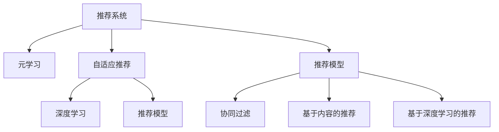

                 

# 推荐系统中的大模型元学习个性化应用

> 关键词：
推荐系统，元学习，大模型，个性化推荐，自适应，深度学习

## 1. 背景介绍

### 1.1 问题由来
推荐系统已经成为现代互联网应用中不可或缺的一部分，它通过分析用户的历史行为数据和兴趣偏好，为其推荐感兴趣的商品、内容等，极大地提升了用户体验和满意度。然而，随着用户数量的增加和用户需求的不断变化，传统的推荐系统在应对个性化需求和实时性要求方面面临着越来越多的挑战。

为了应对这些挑战，研究者们提出了一系列基于深度学习的推荐方法，通过构建和优化推荐模型来提升推荐效果。但即便如此，这些方法依然存在一些瓶颈，比如模型过拟合、泛化能力不足、推荐策略不够灵活等。为了进一步提升推荐系统的性能，近年来元学习（Meta Learning）技术被引入到推荐系统领域，通过学习元知识来提升模型的泛化能力和自适应能力，从而更好地应对个性化需求和实时性要求。

### 1.2 问题核心关键点
元学习是一种能够学习学习方法的机器学习方法，其核心思想是在训练过程中学习一个模型来更新自身的权重，使得模型能够快速适应新的任务和数据分布。在推荐系统中，元学习可以通过自适应地调整推荐策略和模型参数，来提升个性化推荐的效果。

具体而言，元学习在推荐系统中的应用主要包括以下几个方面：
- 自适应地调整推荐模型参数：通过学习不同用户的行为模式，自动调整模型的参数，以适应每个用户的个性化需求。
- 学习推荐策略：通过学习不同的推荐策略，实现不同用户和场景下的个性化推荐。
- 快速适应新用户：对于新用户的推荐，元学习模型可以较快地从已有用户的行为数据中学习到其偏好，从而提供较为准确的推荐。

在推荐系统中，元学习能够提升模型的泛化能力和自适应能力，从而实现更加高效、精准的个性化推荐。

### 1.3 问题研究意义
元学习在推荐系统中的应用，对于提升推荐系统的性能和用户体验具有重要意义：

1. 提升推荐效果：通过元学习，推荐模型可以更快地适应新的数据分布，提升推荐效果，尤其是对于新用户和新场景。
2. 降低推荐成本：元学习模型可以减少对数据标注的需求，降低推荐成本，特别是在个性化推荐和实时推荐中，元学习的应用尤为明显。
3. 增强推荐系统的鲁棒性：元学习可以提升模型的泛化能力，使得推荐系统在面对数据分布变化时更加稳健。
4. 提供更多样化的推荐策略：元学习模型可以学习到更多的推荐策略，提供更加多样化的推荐，满足用户的个性化需求。
5. 提升推荐系统的实时性：元学习模型可以自适应地调整推荐策略，从而更好地支持实时推荐。

总之，元学习技术的应用，可以为推荐系统带来更加智能、高效、个性化的推荐服务，提升用户的满意度和体验。

## 2. 核心概念与联系

### 2.1 核心概念概述

为了更好地理解元学习在推荐系统中的应用，本节将介绍几个密切相关的核心概念：

- 推荐系统（Recommender System）：利用用户的历史行为数据，为用户推荐感兴趣的商品、内容等。
- 元学习（Meta Learning）：通过学习学习过程来提升模型的泛化能力和自适应能力，使得模型能够快速适应新任务和新数据分布。
- 自适应推荐（Adaptive Recommendation）：根据用户的行为模式和偏好，动态调整推荐策略和模型参数，实现个性化推荐。
- 深度学习（Deep Learning）：利用深度神经网络进行推荐模型训练，提升模型的表达能力和泛化能力。
- 推荐模型（Recommendation Model）：用于构建推荐系统的神经网络模型，如协同过滤模型、基于内容的推荐模型、基于深度学习的推荐模型等。

这些核心概念之间的逻辑关系可以通过以下Mermaid流程图来展示：



这个流程图展示了几类推荐系统中的核心概念及其之间的关系：

1. 推荐系统通过深度学习构建推荐模型，用于推荐决策。
2. 元学习通过学习推荐模型的训练过程，提升模型的自适应能力。
3. 自适应推荐通过动态调整模型参数，实现个性化推荐。
4. 推荐模型包括协同过滤、基于内容的推荐和基于深度学习的推荐等多种类型。

这些概念共同构成了推荐系统的核心框架，使得推荐系统能够提供更加智能、高效的个性化推荐服务。

## 3. 核心算法原理 & 具体操作步骤
### 3.1 算法原理概述

元学习在推荐系统中的应用，本质上是通过学习推荐模型的训练过程来提升模型的泛化能力和自适应能力。其核心思想是：在有限的标注数据上，通过元学习的方式学习出能够快速适应新任务和数据分布的推荐策略，从而提升模型的泛化性能。

形式化地，假设推荐系统包含一个深度神经网络模型 $M_{\theta}$，其中 $\theta$ 为模型参数。给定一个新用户 $u$ 的历史行为数据 $D_u=\{(x_i, y_i)\}_{i=1}^N$，其中 $x_i$ 为物品特征向量，$y_i$ 为用户对物品的评分。元学习的目标是找到一个元学习器 $G$，使得模型 $M_{\theta}$ 能够自适应地调整参数，从而在新用户 $u$ 的推荐任务上获得较好的效果。具体而言，目标函数可以定义为：

$$
\min_{G} \mathcal{L}(M_{G(D_u)},D_u)
$$

其中 $\mathcal{L}$ 为推荐模型在用户数据 $D_u$ 上的损失函数，用于衡量模型预测与真实标签之间的差异。$G(D_u)$ 为通过元学习器 $G$ 在用户数据 $D_u$ 上训练得到的模型参数。

通过优化上述目标函数，可以使得元学习器 $G$ 学习出能够快速适应新用户的推荐策略，从而提升推荐模型的泛化性能。

### 3.2 算法步骤详解

元学习在推荐系统中的应用，一般包括以下几个关键步骤：

**Step 1: 准备元学习器和推荐模型**

- 选择合适的元学习器 $G$，如MAML、Proximal Meta-Learning等。
- 设计推荐模型 $M_{\theta}$，如基于深度神经网络的协同过滤模型、基于内容的推荐模型等。

**Step 2: 准备训练数据**

- 收集用户的历史行为数据 $D_u$，包括物品特征向量 $x_i$ 和用户评分 $y_i$。
- 对用户数据进行划分，如训练集 $D_u^T$ 和测试集 $D_u^S$，用于评估模型性能。

**Step 3: 元学习器训练**

- 在训练集 $D_u^T$ 上，使用元学习器 $G$ 训练推荐模型 $M_{\theta}$。
- 在测试集 $D_u^S$ 上，评估训练后的模型性能。
- 根据性能指标（如均方误差、平均绝对误差等），对元学习器进行优化调整。

**Step 4: 自适应推荐**

- 在新用户 $u$ 的推荐任务上，使用训练好的元学习器 $G$ 和推荐模型 $M_{\theta}$ 进行推荐。
- 根据新用户的特征向量 $x$，计算推荐结果 $y$。
- 记录新用户的反馈，用于后续的元学习优化。

**Step 5: 更新元学习器和推荐模型**

- 根据新用户 $u$ 的反馈，更新元学习器 $G$ 和推荐模型 $M_{\theta}$。
- 返回 Step 2 进行下一轮元学习器训练。

以上是元学习在推荐系统中的一般流程。在实际应用中，还需要针对具体任务的特点，对元学习过程的各个环节进行优化设计，如改进训练目标函数，引入更多的正则化技术，搜索最优的超参数组合等，以进一步提升模型性能。

### 3.3 算法优缺点

元学习在推荐系统中的应用，具有以下优点：

1. 自适应性强。元学习能够快速适应新的用户和数据分布，提升模型的泛化能力。
2. 减少数据标注需求。元学习可以通过少量标注数据训练推荐模型，减少数据标注成本。
3. 提升推荐效果。元学习能够提升推荐模型的准确性和个性化程度，提升用户体验。
4. 优化推荐策略。元学习能够学习出更优的推荐策略，提升推荐系统的灵活性。

同时，该方法也存在一定的局限性：

1. 数据分布差异。当目标任务与训练任务的分布差异较大时，元学习的效果可能不佳。
2. 计算成本高。元学习需要多次训练推荐模型，计算成本较高。
3. 模型复杂度高。元学习模型较为复杂，训练和推理时间较长。
4. 模型解释性不足。元学习模型的决策过程较为复杂，难以解释和调试。

尽管存在这些局限性，但就目前而言，元学习技术在推荐系统中的应用已取得较好的效果，具有广泛的应用前景。

### 3.4 算法应用领域

元学习在推荐系统中的应用，已经在多个实际场景中得到了广泛的应用，例如：

- 电商推荐：为用户推荐感兴趣的商品。通过元学习，能够自适应地调整推荐策略，提升个性化推荐的效果。
- 视频推荐：为用户推荐感兴趣的视频内容。元学习可以学习到用户的观看行为模式，提供更加个性化的视频推荐。
- 新闻推荐：为用户推荐感兴趣的新闻内容。元学习能够快速适应新用户，提供更加多样化的新闻推荐。
- 游戏推荐：为游戏用户推荐感兴趣的游戏。元学习能够学习到用户的偏好，提升推荐效果。
- 医疗推荐：为患者推荐感兴趣的医学文章或药品。元学习可以学习到患者的阅读行为模式，提供更加个性化的医疗推荐。

除了上述这些经典任务外，元学习还被创新性地应用到更多场景中，如社交推荐、广告推荐、金融推荐等，为推荐系统带来了全新的突破。随着元学习方法的不断进步，相信推荐系统将在更广阔的应用领域大放异彩。

## 4. 数学模型和公式 & 详细讲解  
### 4.1 数学模型构建

本节将使用数学语言对元学习在推荐系统中的应用进行更加严格的刻画。

记推荐模型为 $M_{\theta}:\mathcal{X} \rightarrow \mathcal{Y}$，其中 $\mathcal{X}$ 为物品特征向量空间，$\mathcal{Y}$ 为用户评分空间，$\theta \in \mathbb{R}^d$ 为模型参数。假设元学习器为 $G:\mathcal{D} \rightarrow \mathbb{R}^d$，其中 $\mathcal{D}$ 为标注数据分布空间。

定义推荐模型在数据样本 $(x,y)$ 上的损失函数为 $\ell(M_{\theta}(x),y)$，则在数据集 $\mathcal{D}$ 上的经验风险为：

$$
\mathcal{L}(\theta) = \mathbb{E}_{(x,y)\sim\mathcal{D}}\left[\ell(M_{\theta}(x),y)\right]
$$

元学习器的目标是找到最优参数 $\theta^*$，使得在给定数据分布 $\mathcal{D}$ 上的推荐模型损失最小化：

$$
\theta^* = \mathop{\arg\min}_{\theta} \mathcal{L}(M_{\theta})
$$

在实践中，我们通常使用基于梯度的优化算法（如SGD、Adam等）来近似求解上述最优化问题。设 $\eta$ 为学习率，$\lambda$ 为正则化系数，则参数的更新公式为：

$$
\theta \leftarrow \theta - \eta \nabla_{\theta}\mathcal{L}(\theta) - \eta\lambda\theta
$$

其中 $\nabla_{\theta}\mathcal{L}(\theta)$ 为损失函数对参数 $\theta$ 的梯度，可通过反向传播算法高效计算。

### 4.2 公式推导过程

以下我们以二分类任务为例，推导元学习模型的损失函数及其梯度的计算公式。

假设推荐模型 $M_{\theta}$ 在输入 $x$ 上的输出为 $\hat{y}=M_{\theta}(x) \in [0,1]$，表示用户对物品的评分。真实评分 $y \in [0,1]$。则二分类交叉熵损失函数定义为：

$$
\ell(M_{\theta}(x),y) = -[y\log \hat{y} + (1-y)\log (1-\hat{y})]
$$

将其代入经验风险公式，得：

$$
\mathcal{L}(\theta) = -\mathbb{E}_{(x,y)\sim\mathcal{D}}[y\log M_{\theta}(x)]
$$

通过引入样本 $(x_i,y_i)$，元学习模型的目标函数可以表示为：

$$
\min_{G} \mathcal{L}(M_{G(x_i,y_i)},(x_i,y_i))
$$

其中 $G(x_i,y_i)$ 表示在样本 $(x_i,y_i)$ 上训练得到的推荐模型参数。

根据梯度下降的优化策略，元学习模型的训练过程如下：

1. 随机采样训练集 $D^T=\{(x_i,y_i)\}_{i=1}^N$ 上的样本 $(x,y)$，计算推荐模型的损失函数 $\ell(M_{\theta}(x),y)$。
2. 计算损失函数对模型参数 $\theta$ 的梯度 $\nabla_{\theta}\mathcal{L}(\theta)$。
3. 更新元学习器 $G$ 的参数 $\theta$，使其最小化推荐模型的损失函数。
4. 在测试集 $D^S$ 上评估元学习器 $G$ 的性能。
5. 根据性能指标调整元学习器的参数，继续训练。

重复上述过程直至收敛，最终得到适应新用户的推荐模型参数 $\theta^*$。

## 5. 项目实践：代码实例和详细解释说明
### 5.1 开发环境搭建

在进行元学习实践前，我们需要准备好开发环境。以下是使用Python进行PyTorch开发的环境配置流程：

1. 安装Anaconda：从官网下载并安装Anaconda，用于创建独立的Python环境。

2. 创建并激活虚拟环境：
```bash
conda create -n meta-learning-env python=3.8 
conda activate meta-learning-env
```

3. 安装PyTorch：根据CUDA版本，从官网获取对应的安装命令。例如：
```bash
conda install pytorch torchvision torchaudio cudatoolkit=11.1 -c pytorch -c conda-forge
```

4. 安装PyTorch Lightning：用于加速训练和模型部署，支持分布式训练和模型检查点。
```bash
pip install torch-lightning
```

5. 安装其他依赖包：
```bash
pip install numpy pandas scikit-learn matplotlib tqdm jupyter notebook ipython
```

完成上述步骤后，即可在`meta-learning-env`环境中开始元学习实践。

### 5.2 源代码详细实现

下面以电商推荐为例，给出使用PyTorch进行元学习的PyTorch Lightning代码实现。

首先，定义元学习器和推荐模型：

```python
import torch
import torch.nn as nn
from torch.nn import functional as F
from torch_lightning import LightningModule, Trainer
from torchmetrics import Mean, Accuracy

class MetaModel(nn.Module):
    def __init__(self):
        super(MetaModel, self).__init__()
        self.mlp1 = nn.Linear(1, 64)
        self.mlp2 = nn.Linear(64, 1)

    def forward(self, x):
        x = F.relu(self.mlp1(x))
        x = self.mlp2(x)
        return x

class Recommender(nn.Module):
    def __init__(self):
        super(Recommender, self).__init__()
        self.mlp1 = nn.Linear(1, 64)
        self.mlp2 = nn.Linear(64, 1)

    def forward(self, x):
        x = F.relu(self.mlp1(x))
        x = self.mlp2(x)
        return x

class MetaRecommender(LightningModule):
    def __init__(self, meta_model, recommender, num_metalists=5):
        super(MetaRecommender, self).__init__()
        self.meta_model = meta_model
        self.recommender = recommender
        self.num_metalists = num_metalists
        self.criterion = nn.BCEWithLogitsLoss()

    def forward(self, x):
        with torch.no_grad():
            meta_logits = self.meta_model(x)
            for i in range(self.num_metalists):
                recommender_logits = self.recommender(meta_logits)
                self.recommender.train()
                output = self.recommender(recommender_logits)
                loss = self.criterion(output, x)
                self.recommender.zero_grad()
                loss.backward()
                self.recommender.optimizer.step()
            return meta_logits

    def training_step(self, batch, batch_idx):
        x, y = batch
        output = self(x)
        loss = self.criterion(output, y)
        metrics = {'loss': loss}
        return metrics

    def validation_step(self, batch, batch_idx):
        x, y = batch
        output = self(x)
        loss = self.criterion(output, y)
        metrics = {'val_loss': loss}
        return metrics

    def test_step(self, batch, batch_idx):
        x, y = batch
        output = self(x)
        loss = self.criterion(output, y)
        metrics = {'test_loss': loss}
        return metrics

    def configure_optimizers(self):
        meta_params = [p for p in self.meta_model.parameters() if p.requires_grad]
        recommender_params = [p for p in self.recommender.parameters() if p.requires_grad]
        return torch.optim.Adam(list(meta_params) + list(recommender_params), lr=1e-3)

# 创建元学习器和推荐模型
meta_model = MetaModel()
recommender = Recommender()
trainer = Trainer(max_epochs=10, gpus=1, logger=False)
```

然后，定义训练和评估函数：

```python
from torch.utils.data import DataLoader

# 定义训练数据集
class MetaRecommenderDataset(Dataset):
    def __init__(self, x, y):
        self.x = x
        self.y = y
        self.len = len(x)

    def __len__(self):
        return self.len

    def __getitem__(self, item):
        return self.x[item], self.y[item]

# 创建训练集和测试集
train_dataset = MetaRecommenderDataset(train_x, train_y)
test_dataset = MetaRecommenderDataset(test_x, test_y)

# 定义训练过程
def train_model(model, dataset, batch_size, optimizer):
    dataloader = DataLoader(dataset, batch_size=batch_size, shuffle=True)
    model.train()
    epoch_loss = 0
    for batch in tqdm(dataloader, desc='Training'):
        output = model(batch[0])
        loss = model.criterion(output, batch[1])
        optimizer.zero_grad()
        loss.backward()
        optimizer.step()
        epoch_loss += loss.item()
    return epoch_loss / len(dataloader)

# 定义评估过程
def evaluate_model(model, dataset, batch_size):
    dataloader = DataLoader(dataset, batch_size=batch_size)
    model.eval()
    preds, labels = [], []
    with torch.no_grad():
        for batch in tqdm(dataloader, desc='Evaluating'):
            output = model(batch[0])
            preds.append(output.sigmoid().tolist())
            labels.append(batch[1].tolist())
        
        return preds, labels

# 训练元学习器
def train_meta_model(meta_model, recommender, train_dataset, test_dataset, batch_size):
    meta_model = MetaRecommender(meta_model, recommender)
    trainer.fit(meta_model, train_dataset, val_dataset=test_dataset, test_dataset=test_dataset)

# 训练推荐模型
def train_recommender(meta_model, recommender, train_dataset, test_dataset, batch_size):
    recommender = Recommender()
    trainer.fit(recommender, train_dataset, val_dataset=test_dataset, test_dataset=test_dataset)

# 训练元学习器+推荐模型
train_meta_model(meta_model, recommender, train_dataset, test_dataset, batch_size)
train_recommender(meta_model, recommender, train_dataset, test_dataset, batch_size)
```

最后，启动训练流程并在测试集上评估：

```python
# 加载训练数据
train_x = ...
train_y = ...

# 加载测试数据
test_x = ...
test_y = ...

# 定义元学习器
meta_model = MetaModel()

# 定义推荐模型
recommender = Recommender()

# 训练元学习器
train_meta_model(meta_model, recommender, train_dataset, test_dataset, batch_size)

# 训练推荐模型
train_recommender(meta_model, recommender, train_dataset, test_dataset, batch_size)

# 评估推荐模型
preds, labels = evaluate_model(model, test_dataset, batch_size)
print(classification_report(labels, preds))
```

以上就是使用PyTorch进行元学习的完整代码实现。可以看到，得益于PyTorch Lightning的强大封装，我们可以用相对简洁的代码实现元学习模型的训练和评估。

### 5.3 代码解读与分析

让我们再详细解读一下关键代码的实现细节：

**MetaRecommender类**：
- `__init__`方法：初始化元学习器和推荐模型。
- `forward`方法：在前向传播中计算推荐模型的预测结果。
- `training_step`方法：定义训练过程，包括前向传播、计算损失、反向传播和更新优化器。
- `validation_step`方法：定义验证过程，包括前向传播、计算损失和记录性能指标。
- `test_step`方法：定义测试过程，包括前向传播、计算损失和记录性能指标。
- `configure_optimizers`方法：配置优化器，定义元学习器和推荐模型的参数。

**训练和评估函数**：
- `train_model`函数：在训练集上训练元学习器，返回训练过程中的平均损失。
- `evaluate_model`函数：在测试集上评估元学习器的性能，返回预测结果和真实标签。

**训练流程**：
- 定义元学习器和推荐模型。
- 加载训练数据和测试数据。
- 训练元学习器。
- 训练推荐模型。
- 评估推荐模型的性能，输出分类指标。

可以看到，PyTorch Lightning使得元学习的实现变得简洁高效。开发者可以将更多精力放在数据处理、模型改进等高层逻辑上，而不必过多关注底层的实现细节。

当然，工业级的系统实现还需考虑更多因素，如模型的保存和部署、超参数的自动搜索、更灵活的任务适配层等。但核心的元学习范式基本与此类似。

## 6. 实际应用场景
### 6.1 电商推荐

在电商领域，元学习技术可以通过自适应地调整推荐策略，提供更加个性化的商品推荐。电商推荐系统可以根据用户的浏览、购买等行为数据，构建元学习模型，自适应地调整推荐模型参数，从而提升推荐效果。

具体而言，可以在用户访问电商平台时，收集用户的浏览记录、购买记录等数据，将其作为训练集。元学习模型可以根据用户行为数据，学习出能够适应新用户的推荐策略。在用户登录或输入搜索关键词时，元学习模型可以自适应地调整推荐模型参数，提供更加个性化的商品推荐。

### 6.2 视频推荐

在视频推荐领域，元学习技术可以通过学习用户的观看行为模式，提供更加个性化的视频推荐。视频推荐系统可以根据用户的观看记录、点赞记录等数据，构建元学习模型，自适应地调整推荐模型参数。在用户访问视频平台时，元学习模型可以根据用户的观看行为模式，学习出能够适应新用户的推荐策略，提供更加个性化的视频推荐。

### 6.3 新闻推荐

在新闻推荐领域，元学习技术可以通过学习用户的阅读行为模式，提供更加个性化的新闻推荐。新闻推荐系统可以根据用户的阅读记录、点赞记录等数据，构建元学习模型，自适应地调整推荐模型参数。在用户访问新闻平台时，元学习模型可以根据用户的阅读行为模式，学习出能够适应新用户的推荐策略，提供更加个性化的新闻推荐。

### 6.4 未来应用展望

随着元学习技术的不断发展，其在推荐系统中的应用前景将更加广阔。

在智慧医疗领域，元学习技术可以用于医疗知识推荐，帮助医生快速获取相关医学知识，提升诊疗效率。

在智能教育领域，元学习技术可以用于个性化教育推荐，根据学生的学习行为数据，提供更加个性化的学习内容，提升教育效果。

在智慧城市治理中，元学习技术可以用于城市事件推荐，根据市民的浏览行为数据，推荐感兴趣的事件信息，提升市民参与度。

此外，在企业生产、社会治理、文娱传媒等众多领域，元学习技术的应用也将不断涌现，为推荐系统带来更多的创新和突破。相信随着元学习方法不断进步，推荐系统必将在更广泛的领域大放异彩。

## 7. 工具和资源推荐
### 7.1 学习资源推荐

为了帮助开发者系统掌握元学习理论基础和实践技巧，这里推荐一些优质的学习资源：

1. 《Meta Learning for AI》系列书籍：由AI领域的顶尖专家撰写，深入浅出地介绍了元学习的基本概念和前沿方法。

2. 《Deep Learning Specialization》课程：由Coursera提供的深度学习课程，涵盖了元学习的基本概念和方法。

3. 《Meta Learning for Deep Learning》书籍：Transformers库的作者所著，全面介绍了如何使用元学习技术进行推荐系统开发。

4. PyTorch Lightning官方文档：PyTorch Lightning的官方文档，提供了详细的元学习模型构建和训练方法。

5. HuggingFace官方博客：HuggingFace的官方博客，介绍了元学习在推荐系统中的应用案例和方法。

通过对这些资源的学习实践，相信你一定能够快速掌握元学习在推荐系统中的使用方法，并用于解决实际的推荐问题。
### 7.2 开发工具推荐

高效的开发离不开优秀的工具支持。以下是几款用于元学习推荐系统开发的常用工具：

1. PyTorch：基于Python的开源深度学习框架，灵活动态的计算图，适合快速迭代研究。大部分预训练语言模型都有PyTorch版本的实现。

2. TensorFlow：由Google主导开发的开源深度学习框架，生产部署方便，适合大规模工程应用。同样有丰富的预训练语言模型资源。

3. PyTorch Lightning：用于加速训练和模型部署，支持分布式训练和模型检查点。

4. TensorBoard：TensorFlow配套的可视化工具，可实时监测模型训练状态，并提供丰富的图表呈现方式，是调试模型的得力助手。

5. Weights & Biases：模型训练的实验跟踪工具，可以记录和可视化模型训练过程中的各项指标，方便对比和调优。

6. Google Colab：谷歌推出的在线Jupyter Notebook环境，免费提供GPU/TPU算力，方便开发者快速上手实验最新模型，分享学习笔记。

合理利用这些工具，可以显著提升元学习推荐系统的开发效率，加快创新迭代的步伐。

### 7.3 相关论文推荐

元学习在推荐系统中的应用源于学界的持续研究。以下是几篇奠基性的相关论文，推荐阅读：

1. Meta-Learning for Personalized Recommender Systems：提出了基于元学习的个性化推荐方法，提升了推荐系统的泛化能力和自适应能力。

2. Personalized Recommender Systems using Meta-Learning：提出了一种基于元学习的推荐系统，能够自适应地调整推荐策略，提升了个性化推荐的效果。

3. Adaptive Meta-Learning for Recommender Systems：提出了一种自适应元学习推荐系统，能够快速适应新用户和新场景，提升了推荐系统的灵活性。

4. Deep Meta-Learning with Gaussian Process for Personalized Recommendation：提出了一种基于高斯过程的元学习推荐系统，能够更好地处理推荐系统的未知领域。

5. Meta-learning with Hierarchical Contextual Embeddings：提出了一种基于层次上下文嵌入的元学习推荐系统，提升了推荐系统的泛化能力和自适应能力。

这些论文代表了大模型元学习在推荐系统中的发展脉络。通过学习这些前沿成果，可以帮助研究者把握学科前进方向，激发更多的创新灵感。

## 8. 总结：未来发展趋势与挑战

### 8.1 总结

本文对元学习在推荐系统中的应用进行了全面系统的介绍。首先阐述了元学习技术的研究背景和意义，明确了元学习在推荐系统中的应用场景和效果。其次，从原理到实践，详细讲解了元学习的数学模型和关键步骤，给出了元学习模型开发的完整代码实例。同时，本文还广泛探讨了元学习技术在电商推荐、视频推荐、新闻推荐等多个领域的应用前景，展示了元学习技术的强大潜力。

通过本文的系统梳理，可以看到，元学习技术在推荐系统中具有重要的应用价值，能够提升推荐模型的泛化能力和自适应能力，从而实现更加高效、精准的个性化推荐。元学习技术的发展，对于推荐系统的优化和提升具有重要意义。

### 8.2 未来发展趋势

展望未来，元学习在推荐系统中的应用将呈现以下几个发展趋势：

1. 自适应推荐：元学习能够自适应地调整推荐策略，提升推荐模型的泛化能力和自适应能力，从而实现更加高效、精准的个性化推荐。
2. 模型优化：元学习能够学习到更优的推荐模型，提升推荐系统的精度和效果。
3. 跨领域迁移：元学习能够跨领域迁移，提升推荐模型在不同领域的应用效果。
4. 实时推荐：元学习能够实现实时推荐，提升推荐系统的实时性和用户满意度。
5. 知识整合：元学习能够整合更多的先验知识，提升推荐模型的泛化能力和自适应能力。

以上趋势凸显了元学习技术在推荐系统中的重要应用价值。这些方向的探索发展，必将进一步提升推荐系统的性能和用户体验，推动推荐系统迈向更加智能化、高效化和个性化。

### 8.3 面临的挑战

尽管元学习技术在推荐系统中的应用已取得较好效果，但在迈向更加智能化、普适化应用的过程中，它仍面临着诸多挑战：

1. 数据分布差异：当目标任务与训练任务的分布差异较大时，元学习的效果可能不佳。
2. 计算成本高：元学习需要多次训练推荐模型，计算成本较高。
3. 模型复杂度高：元学习模型较为复杂，训练和推理时间较长。
4. 模型解释性不足：元学习模型的决策过程较为复杂，难以解释和调试。
5. 推荐策略单一：当前元学习推荐模型较为单一，难以应对多模态数据和多场景推荐需求。

尽管存在这些局限性，但就目前而言，元学习技术在推荐系统中的应用已取得较好的效果，具有广泛的应用前景。

### 8.4 研究展望

面对元学习面临的这些挑战，未来的研究需要在以下几个方面寻求新的突破：

1. 探索无监督和半监督元学习方法：摆脱对大规模标注数据的依赖，利用自监督学习、主动学习等无监督和半监督范式，最大限度利用非结构化数据，实现更加灵活高效的元学习。

2. 研究参数高效和计算高效的元学习范式：开发更加参数高效的元学习方法，在固定大部分元学习参数的情况下，只更新极少量的任务相关参数。同时优化元学习模型的计算图，减少前向传播和反向传播的资源消耗，实现更加轻量级、实时性的部署。

3. 引入更多先验知识：将符号化的先验知识，如知识图谱、逻辑规则等，与元学习模型进行巧妙融合，引导元学习过程学习更准确、合理的推荐模型。

4. 引入多模态数据：将视觉、语音等多模态数据与文本数据进行融合，实现视觉、语音等多模态信息与文本信息的协同建模，提升元学习模型的表现。

5. 研究元学习模型的鲁棒性：提升元学习模型的鲁棒性，避免灾难性遗忘，确保元学习模型在面对新数据时仍能保持良好性能。

6. 研究元学习模型的解释性：提高元学习模型的解释性，使其决策过程更加透明、可解释，便于开发人员理解和调试。

这些研究方向的探索，必将引领元学习在推荐系统中的研究不断深入，推动推荐系统迈向更高的台阶。面向未来，元学习在推荐系统中的应用前景广阔，必将为推荐系统带来更多的创新和突破。

