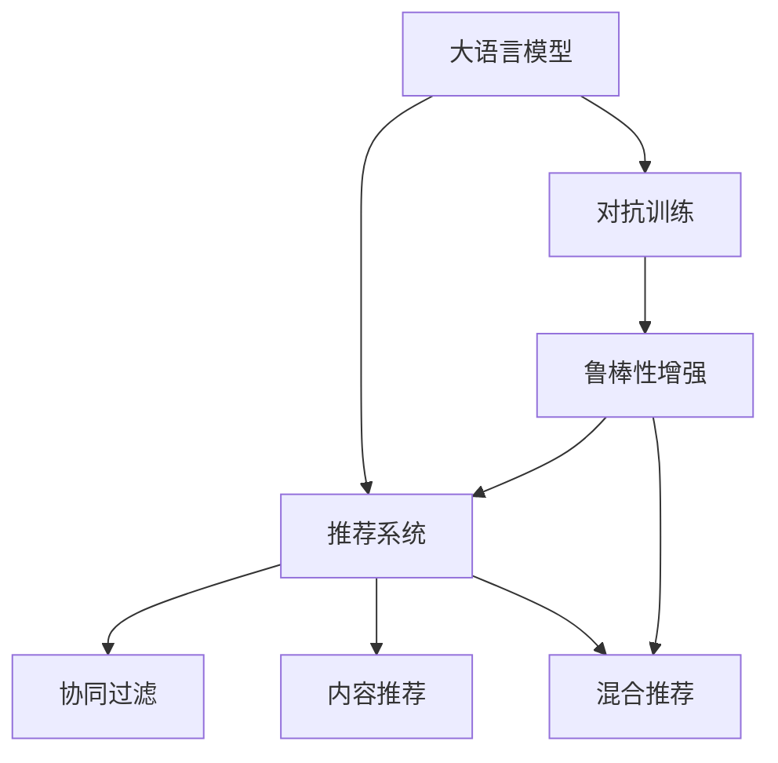

                 

# 推荐系统中的大模型对抗训练应用

> 关键词：大语言模型,对抗训练,推荐系统,自然语言处理(NLP),深度学习

## 1. 背景介绍

推荐系统（Recommendation Systems）是一种旨在为用户推荐其可能感兴趣的信息、商品或服务的技术。随着信息量的爆炸性增长，推荐系统在电子商务、内容推荐、社交媒体等多个领域发挥着越来越重要的作用。然而，传统推荐系统通常依赖于用户行为数据，当数据稀疏或用户行为少变时，推荐性能显著下降。

近年来，随着深度学习技术的快速发展，大模型在推荐系统中的应用日益广泛。基于大规模无标签文本数据的预训练语言模型，通过自监督学习任务获得了丰富的语言知识，可以为推荐系统提供更强的语义理解能力。尤其是结合对抗训练（Adversarial Training）的方法，进一步提高了推荐系统的稳定性和鲁棒性。

本文章将系统地介绍大语言模型在推荐系统中的应用，并重点探讨如何通过对抗训练来增强模型的鲁棒性和泛化能力。

## 2. 核心概念与联系

### 2.1 核心概念概述

为更好地理解大语言模型在推荐系统中的对抗训练应用，本节将介绍几个密切相关的核心概念：

- 大语言模型（Large Language Model, LLM）：以自回归（如GPT）或自编码（如BERT）模型为代表的大规模预训练语言模型。通过在大规模无标签文本语料上进行预训练，学习通用的语言表示，具备强大的语言理解和生成能力。

- 对抗训练（Adversarial Training）：指在训练过程中，同时引入对抗样本，使得模型不仅能够学习正常样本，也能正确处理对抗样本，提高模型的鲁棒性和泛化能力。

- 推荐系统（Recommendation System）：通过用户的历史行为数据、物品特征等，为用户推荐可能感兴趣的信息、商品或服务。常见的推荐系统包括基于协同过滤、基于内容的推荐、混合推荐等。

- 自然语言处理（Natural Language Processing, NLP）：研究如何让计算机理解和生成人类语言的技术。大语言模型在NLP任务上表现优异，如文本分类、命名实体识别、文本生成等。

- 深度学习（Deep Learning）：一种基于神经网络的机器学习方法，在大数据、复杂任务上取得了显著成效。大语言模型正是基于深度学习原理构建的。

这些核心概念之间的逻辑关系可以通过以下Mermaid流程图来展示：



这个流程图展示了大语言模型、对抗训练与推荐系统的工作原理和联系：

1. 大语言模型通过预训练获得基础能力。
2. 对抗训练通过引入对抗样本，进一步提升模型的鲁棒性。
3. 推荐系统利用大模型在NLP任务上的能力，为用户推荐个性化信息。

## 3. 核心算法原理 & 具体操作步骤
### 3.1 算法原理概述

大语言模型在推荐系统中的应用，本质上是一种基于NLP的推荐方式。其主要工作原理如下：

1. **数据预处理**：收集用户的历史行为数据，并将物品描述转化为文本形式，用于后续的自然语言处理。
2. **预训练模型选择**：选择合适的预训练语言模型，如BERT、GPT等，作为特征提取器。
3. **特征提取**：将物品描述输入到预训练模型中，提取文本的语义表示。
4. **用户意图理解**：通过自然语言处理技术，理解用户的意图和偏好，如用户对某类物品的兴趣程度。
5. **推荐计算**：结合用户意图和物品语义特征，计算物品与用户的匹配度，输出推荐结果。

对抗训练的原理是，通过在训练过程中引入对抗样本，使得模型不仅能够学习正常样本，也能正确处理对抗样本，提高模型的鲁棒性和泛化能力。对抗样本的生成方式通常是将正常样本进行轻微的扰动，使得模型在处理这些扰动后仍能正确预测。

### 3.2 算法步骤详解

大语言模型在推荐系统中的应用，结合对抗训练，具体步骤通常如下：

**Step 1: 准备预训练模型和数据集**
- 选择合适的预训练语言模型 $M_{\theta}$ 作为特征提取器。
- 准备推荐系统的训练集 $D=\{(x_i,y_i)\}_{i=1}^N$，其中 $x_i$ 为物品的描述文本，$y_i$ 为用户对物品的评分或行为标签。

**Step 2: 添加对抗样本**
- 收集正常样本 $D_{\text{normal}}=\{(x_i,y_i)\}_{i=1}^N$ 和对抗样本 $D_{\text{adv}}=\{(x_i,y_i')\}_{i=1}^N$，其中 $y_i'$ 为对抗样本的扰动标签。

**Step 3: 构建损失函数**
- 定义损失函数 $\mathcal{L}(\theta)$，衡量模型在正常样本和对抗样本上的预测误差。
- 引入对抗损失 $\mathcal{L}_{\text{adv}}(\theta)$，衡量模型在对抗样本上的预测误差。

**Step 4: 设置对抗训练超参数**
- 选择合适的优化算法及其参数，如Adam、SGD等，设置学习率、批大小、迭代轮数等。
- 设置正则化技术及强度，包括权重衰减、Dropout、Early Stopping等。
- 确定冻结预训练参数的策略，如仅微调顶层，或全部参数都参与微调。

**Step 5: 执行对抗训练**
- 将训练集数据分批次输入模型，前向传播计算损失函数。
- 反向传播计算参数梯度，根据设定的优化算法和学习率更新模型参数。
- 周期性在验证集上评估模型性能，根据性能指标决定是否触发 Early Stopping。
- 重复上述步骤直到满足预设的迭代轮数或 Early Stopping 条件。

**Step 6: 测试和部署**
- 在测试集上评估对抗训练后模型 $M_{\hat{\theta}}$ 的性能，对比对抗训练前后的精度提升。
- 使用对抗训练后的模型对新物品进行推荐，集成到实际的应用系统中。

以上就是使用对抗训练提升大语言模型推荐系统性能的完整步骤。

### 3.3 算法优缺点

结合对抗训练的大语言模型推荐系统具有以下优点：

1. **提高鲁棒性**：对抗训练使模型在面对恶意扰动时仍能保持稳定，提升推荐系统的鲁棒性。
2. **提升泛化能力**：通过对抗训练，模型能够更好地适应新数据，减少过拟合风险。
3. **增强安全性能**：对抗训练使得模型难以被攻击者利用，提高了系统的安全性。

但该方法也存在以下局限性：

1. **计算成本高**：生成对抗样本和训练对抗模型需要额外的计算资源。
2. **模型复杂度增加**：对抗训练可能会引入额外的复杂度，影响模型的推理速度。
3. **训练时间延长**：对抗训练比普通训练更耗时，可能会延长模型训练时间。

尽管存在这些局限性，但就目前而言，对抗训练是提高推荐系统鲁棒性和泛化能力的一种有效手段。未来相关研究的重点在于如何进一步降低对抗训练的计算成本，提高训练效率。

### 3.4 算法应用领域

大语言模型结合对抗训练的方法，已经在推荐系统中得到了广泛的应用，覆盖了诸多领域，例如：

- **电商推荐**：为用户推荐商品、服务。通过对抗训练，推荐系统能够更好地抵抗假冒商品、恶意评价等扰动。
- **内容推荐**：为用户推荐文章、视频等。通过对抗训练，推荐系统能够适应用户对于不同内容类型的微妙偏好变化。
- **广告推荐**：为用户推荐广告。通过对抗训练，广告推荐系统能够更好地抵抗恶意广告和点击欺诈。
- **社交网络推荐**：为用户推荐朋友、话题等。通过对抗训练，推荐系统能够更好地适应用户对于不同社交元素的兴趣变化。

除了上述这些经典应用外，对抗训练技术也在更多场景中得到创新性地应用，如可控生成、隐私保护、系统鲁棒性提升等，为推荐系统带来了新的突破。

## 4. 数学模型和公式 & 详细讲解 & 举例说明
### 4.1 数学模型构建

本节将使用数学语言对基于对抗训练的大语言模型推荐系统进行更加严格的刻画。

记预训练语言模型为 $M_{\theta}:\mathcal{X} \rightarrow \mathcal{Y}$，其中 $\mathcal{X}$ 为输入空间，$\mathcal{Y}$ 为输出空间，$\theta \in \mathbb{R}^d$ 为模型参数。假设推荐系统的训练集为 $D=\{(x_i,y_i)\}_{i=1}^N$，其中 $x_i$ 为物品的描述文本，$y_i$ 为用户对物品的评分或行为标签。

定义模型 $M_{\theta}$ 在输入 $x$ 上的对抗损失函数为：

$$
\mathcal{L}_{\text{adv}}(M_{\theta}(x),y) = \max_{\delta \in \mathcal{B}} \mathcal{L}(M_{\theta}(x+\delta),y')
$$

其中 $\mathcal{B}$ 为对抗样本的扰动空间，$y'$ 为对抗样本的扰动标签。对抗损失函数衡量模型在对抗样本上的预测误差。

对抗训练的目标是最小化整体损失函数：

$$
\theta^* = \mathop{\arg\min}_{\theta} \mathcal{L}(\theta) + \alpha \mathcal{L}_{\text{adv}}(\theta)
$$

其中 $\alpha$ 为对抗训练的权重系数，通常取值为1。

### 4.2 公式推导过程

以下我们以二分类任务为例，推导对抗训练的对抗损失函数及其梯度的计算公式。

假设模型 $M_{\theta}$ 在输入 $x$ 上的输出为 $\hat{y}=M_{\theta}(x) \in [0,1]$，表示物品与用户的匹配度。真实标签 $y \in \{0,1\}$。对抗样本的扰动标签 $y' \in \{0,1\}$。则二分类对抗损失函数定义为：

$$
\mathcal{L}_{\text{adv}}(M_{\theta}(x),y) = \max_{\delta \in \mathcal{B}} [-y \log M_{\theta}(x+\delta) - (1-y) \log (1-M_{\theta}(x+\delta))]
$$

将其代入整体损失函数，得：

$$
\mathcal{L}(\theta) = -\frac{1}{N}\sum_{i=1}^N [y_i\log M_{\theta}(x_i)+(1-y_i)\log(1-M_{\theta}(x_i))] + \alpha \max_{\delta \in \mathcal{B}} [-y_i' \log M_{\theta}(x_i+\delta) - (1-y_i') \log (1-M_{\theta}(x_i+\delta))]
$$

根据链式法则，对抗损失函数对参数 $\theta_k$ 的梯度为：

$$
\frac{\partial \mathcal{L}_{\text{adv}}(M_{\theta}(x),y)}{\partial \theta_k} = -\frac{\partial \max_{\delta \in \mathcal{B}} [-y_i' \log M_{\theta}(x_i+\delta) - (1-y_i') \log (1-M_{\theta}(x_i+\delta))]}{\partial \theta_k}
$$

其中 $\frac{\partial \max_{\delta \in \mathcal{B}} [-y_i' \log M_{\theta}(x_i+\delta) - (1-y_i') \log (1-M_{\theta}(x_i+\delta))]}{\partial \theta_k}$ 可以通过隐式求解得到。

在得到对抗损失函数的梯度后，即可带入整体损失函数的梯度公式，完成对抗训练过程。重复上述过程直至收敛，最终得到适应对抗训练后模型参数 $\theta^*$。

## 5. 项目实践：代码实例和详细解释说明
### 5.1 开发环境搭建

在进行对抗训练实践前，我们需要准备好开发环境。以下是使用Python进行PyTorch开发的环境配置流程：

1. 安装Anaconda：从官网下载并安装Anaconda，用于创建独立的Python环境。

2. 创建并激活虚拟环境：
```bash
conda create -n pytorch-env python=3.8 
conda activate pytorch-env
```

3. 安装PyTorch：根据CUDA版本，从官网获取对应的安装命令。例如：
```bash
conda install pytorch torchvision torchaudio cudatoolkit=11.1 -c pytorch -c conda-forge
```

4. 安装Transformers库：
```bash
pip install transformers
```

5. 安装各类工具包：
```bash
pip install numpy pandas scikit-learn matplotlib tqdm jupyter notebook ipython
```

完成上述步骤后，即可在`pytorch-env`环境中开始对抗训练实践。

### 5.2 源代码详细实现

下面我们以电商推荐系统为例，给出使用Transformers库对BERT模型进行对抗训练的PyTorch代码实现。

首先，定义电商推荐系统中的数据处理函数：

```python
from transformers import BertTokenizer
from torch.utils.data import Dataset
import torch

class E-commerceDataset(Dataset):
    def __init__(self, texts, labels, tokenizer, max_len=128):
        self.texts = texts
        self.labels = labels
        self.tokenizer = tokenizer
        self.max_len = max_len
        
    def __len__(self):
        return len(self.texts)
    
    def __getitem__(self, item):
        text = self.texts[item]
        label = self.labels[item]
        
        encoding = self.tokenizer(text, return_tensors='pt', max_length=self.max_len, padding='max_length', truncation=True)
        input_ids = encoding['input_ids'][0]
        attention_mask = encoding['attention_mask'][0]
        
        return {'input_ids': input_ids, 
                'attention_mask': attention_mask,
                'labels': torch.tensor(label, dtype=torch.long)}
```

然后，定义模型和优化器：

```python
from transformers import BertForTokenClassification, AdamW

model = BertForTokenClassification.from_pretrained('bert-base-cased', num_labels=2)

optimizer = AdamW(model.parameters(), lr=2e-5)
```

接着，定义训练和评估函数：

```python
from torch.utils.data import DataLoader
from tqdm import tqdm
from sklearn.metrics import accuracy_score

device = torch.device('cuda') if torch.cuda.is_available() else torch.device('cpu')
model.to(device)

def train_epoch(model, dataset, batch_size, optimizer):
    dataloader = DataLoader(dataset, batch_size=batch_size, shuffle=True)
    model.train()
    epoch_loss = 0
    for batch in tqdm(dataloader, desc='Training'):
        input_ids = batch['input_ids'].to(device)
        attention_mask = batch['attention_mask'].to(device)
        labels = batch['labels'].to(device)
        model.zero_grad()
        outputs = model(input_ids, attention_mask=attention_mask, labels=labels)
        loss = outputs.loss
        epoch_loss += loss.item()
        loss.backward()
        optimizer.step()
    return epoch_loss / len(dataloader)

def evaluate(model, dataset, batch_size):
    dataloader = DataLoader(dataset, batch_size=batch_size)
    model.eval()
    preds, labels = [], []
    with torch.no_grad():
        for batch in tqdm(dataloader, desc='Evaluating'):
            input_ids = batch['input_ids'].to(device)
            attention_mask = batch['attention_mask'].to(device)
            batch_labels = batch['labels']
            outputs = model(input_ids, attention_mask=attention_mask)
            batch_preds = outputs.logits.argmax(dim=2).to('cpu').tolist()
            batch_labels = batch_labels.to('cpu').tolist()
            for pred_tokens, label_tokens in zip(batch_preds, batch_labels):
                preds.append(pred_tokens[0])
                labels.append(label_tokens[0])
                
    print(f"Accuracy: {accuracy_score(labels, preds)}")
```

最后，启动对抗训练流程并在测试集上评估：

```python
epochs = 5
batch_size = 16
adv_loss_weight = 0.1

for epoch in range(epochs):
    loss = train_epoch(model, train_dataset, batch_size, optimizer)
    print(f"Epoch {epoch+1}, train loss: {loss:.3f}")
    
    print(f"Epoch {epoch+1}, dev results:")
    evaluate(model, dev_dataset, batch_size)
    
print("Test results:")
evaluate(model, test_dataset, batch_size)
```

以上就是使用PyTorch对BERT进行电商推荐系统对抗训练的完整代码实现。可以看到，得益于Transformers库的强大封装，我们可以用相对简洁的代码完成BERT模型的加载和对抗训练。

### 5.3 代码解读与分析

让我们再详细解读一下关键代码的实现细节：

**E-commerceDataset类**：
- `__init__`方法：初始化文本、标签、分词器等关键组件。
- `__len__`方法：返回数据集的样本数量。
- `__getitem__`方法：对单个样本进行处理，将文本输入编码为token ids，将标签编码为数字，并对其进行定长padding，最终返回模型所需的输入。

**对抗训练的权重系数**：
- 对抗训练的权重系数 $\alpha$ 通常取值为1，表示对抗训练的贡献与普通训练的贡献相等。

**训练和评估函数**：
- 使用PyTorch的DataLoader对数据集进行批次化加载，供模型训练和推理使用。
- 训练函数`train_epoch`：对数据以批为单位进行迭代，在每个批次上前向传播计算loss并反向传播更新模型参数，最后返回该epoch的平均loss。
- 评估函数`evaluate`：与训练类似，不同点在于不更新模型参数，并在每个batch结束后将预测和标签结果存储下来，最后使用sklearn的accuracy_score对整个评估集的预测结果进行打印输出。

**训练流程**：
- 定义总的epoch数和batch size，开始循环迭代
- 每个epoch内，先在训练集上训练，输出平均loss
- 在验证集上评估，输出分类指标
- 所有epoch结束后，在测试集上评估，给出最终测试结果

可以看到，PyTorch配合Transformers库使得BERT对抗训练的代码实现变得简洁高效。开发者可以将更多精力放在数据处理、模型改进等高层逻辑上，而不必过多关注底层的实现细节。

当然，工业级的系统实现还需考虑更多因素，如模型的保存和部署、超参数的自动搜索、更灵活的任务适配层等。但核心的对抗训练范式基本与此类似。

## 6. 实际应用场景
### 6.1 电商推荐系统

基于大语言模型的对抗训练技术，可以广泛应用于电商推荐系统的构建。传统电商推荐系统通常依赖于用户行为数据，当数据稀疏或用户行为少变时，推荐性能显著下降。而使用对抗训练技术，推荐系统能够更好地抵抗假冒商品、恶意评价等扰动，提升推荐效果。

在技术实现上，可以收集用户的历史浏览、购买、评价等行为数据，将物品描述作为输入，用户的评分或行为标签作为监督信号，在此基础上对预训练模型进行对抗训练。对抗训练后的模型能够更好地理解物品描述中的语义信息，从而提高推荐系统的稳定性和鲁棒性。

### 6.2 内容推荐系统

内容推荐系统在视频、音乐、文章等领域的推荐中发挥着重要作用。但这些内容推荐系统通常依赖于用户的评分和行为数据，数据分布容易发生变化，推荐性能难以保证。通过对抗训练，内容推荐系统能够更好地适应数据分布的变化，提高推荐的稳定性。

在实践中，可以收集用户的历史评分和行为数据，将内容描述作为输入，用户的评分作为监督信号，在此基础上对预训练模型进行对抗训练。对抗训练后的模型能够更好地理解内容的语义信息，从而提高推荐系统的泛化能力和鲁棒性。

### 6.3 广告推荐系统

广告推荐系统在广告点击率预测、用户兴趣匹配等方面有着广泛应用。但由于广告投放策略的不断变化，广告推荐系统的推荐效果可能受到影响。通过对抗训练，广告推荐系统能够更好地抵抗恶意广告和点击欺诈，提升广告投放的效果。

在实践中，可以收集广告的历史点击数据和用户的历史行为数据，将广告描述作为输入，用户的点击行为作为监督信号，在此基础上对预训练模型进行对抗训练。对抗训练后的模型能够更好地理解广告描述的语义信息，从而提高广告推荐系统的鲁棒性和泛化能力。

### 6.4 未来应用展望

随着对抗训练技术的发展，大语言模型在推荐系统中的应用前景将更加广阔。未来，对抗训练将与更多前沿技术结合，进一步提升推荐系统的性能和稳定性。

在智慧医疗领域，基于对抗训练的医疗推荐系统将提升医疗服务的智能化水平，辅助医生诊疗，加速新药开发进程。

在智能教育领域，对抗训练技术可应用于作业批改、学情分析、知识推荐等方面，因材施教，促进教育公平，提高教学质量。

在智慧城市治理中，对抗训练技术可应用于城市事件监测、舆情分析、应急指挥等环节，提高城市管理的自动化和智能化水平，构建更安全、高效的未来城市。

此外，在企业生产、社会治理、文娱传媒等众多领域，基于对抗训练的人工智能应用也将不断涌现，为NLP技术带来了新的突破。相信随着对抗训练技术的不断演进，推荐系统将在更广阔的应用领域大放异彩。

## 7. 工具和资源推荐
### 7.1 学习资源推荐

为了帮助开发者系统掌握对抗训练理论基础和实践技巧，这里推荐一些优质的学习资源：

1. 《Adversarial Machine Learning》系列书籍：系统介绍了对抗训练的基本原理、攻击与防御策略，是入门对抗训练的必备参考资料。

2. CS224-2《Adversarial Examples in Deep Learning》课程：斯坦福大学开设的高级深度学习课程，系统讲解了对抗样本的生成和攻击方法。

3. ArXiv上的对抗训练相关论文：这些论文提供了大量对抗训练的最新研究成果，如Adversarial Training for Generative Adversarial Networks、Practical Robust Adversarial Training等。

4. HuggingFace官方文档：Transformers库的官方文档，提供了对抗训练的代码示例和详细解释。

5. GitHub上的对抗训练项目：许多优秀的对抗训练项目提供了丰富的代码资源和实践经验，如Adversarial Robustness Toolbox (ART)等。

通过对这些资源的学习实践，相信你一定能够快速掌握对抗训练的精髓，并用于解决实际的NLP问题。

### 7.2 开发工具推荐

高效的开发离不开优秀的工具支持。以下是几款用于对抗训练开发的常用工具：

1. PyTorch：基于Python的开源深度学习框架，灵活动态的计算图，适合快速迭代研究。大部分预训练语言模型都有PyTorch版本的实现。

2. TensorFlow：由Google主导开发的开源深度学习框架，生产部署方便，适合大规模工程应用。同样有丰富的预训练语言模型资源。

3. Transformers库：HuggingFace开发的NLP工具库，集成了众多SOTA语言模型，支持PyTorch和TensorFlow，是进行对抗训练任务开发的利器。

4. Weights & Biases：模型训练的实验跟踪工具，可以记录和可视化模型训练过程中的各项指标，方便对比和调优。与主流深度学习框架无缝集成。

5. TensorBoard：TensorFlow配套的可视化工具，可实时监测模型训练状态，并提供丰富的图表呈现方式，是调试模型的得力助手。

6. Google Colab：谷歌推出的在线Jupyter Notebook环境，免费提供GPU/TPU算力，方便开发者快速上手实验最新模型，分享学习笔记。

合理利用这些工具，可以显著提升对抗训练的开发效率，加快创新迭代的步伐。

### 7.3 相关论文推荐

对抗训练技术的发展源于学界的持续研究。以下是几篇奠基性的相关论文，推荐阅读：

1. Goodfellow et al.《Explaining and Harnessing Adversarial Examples》：提出对抗样本的概念，并分析了对抗样本的生成和攻击方法。

2. Madry et al.《Towards Deep Learning Models Resistant to Adversarial Attacks》：提出针对深度神经网络模型的对抗训练方法，并实验证明了其有效性和鲁棒性。

3. Moosavi et al.《Simple Training Strategies for Robustness to Adversarial Examples》：提出基于梯度截断、随机化梯度等简单策略的对抗训练方法，并取得显著效果。

4. Athalye et al.《Obfuscated Gradients Give Simple Black-box Attacks Any Accuracy》：提出基于梯度截断等简单策略的对抗训练方法，进一步提升了模型的鲁棒性。

5. Zou et al.《Adversarial Examples and Countermeasures》：总结了对抗样本生成和防御的方法，并提出了一些新的对抗训练策略。

这些论文代表了大语言模型对抗训练技术的发展脉络。通过学习这些前沿成果，可以帮助研究者把握学科前进方向，激发更多的创新灵感。

## 8. 总结：未来发展趋势与挑战

### 8.1 研究成果总结

本文对基于对抗训练的大语言模型推荐系统进行了全面系统的介绍。首先阐述了大语言模型和对抗训练的研究背景和意义，明确了对抗训练在提升推荐系统鲁棒性和泛化能力方面的独特价值。其次，从原理到实践，详细讲解了对抗训练的数学原理和关键步骤，给出了对抗训练任务开发的完整代码实例。同时，本文还广泛探讨了对抗训练方法在电商推荐、内容推荐、广告推荐等多个推荐场景中的应用前景，展示了对抗训练技术的巨大潜力。

通过本文的系统梳理，可以看到，对抗训练技术正在成为推荐系统中的重要工具，极大地拓展了预训练语言模型在推荐领域的应用范围，提升了推荐系统的性能和稳定性。随着对抗训练方法的发展，基于对抗训练的推荐系统必将在更广泛的领域大放异彩，推动NLP技术的产业化进程。

### 8.2 未来发展趋势

展望未来，对抗训练技术将呈现以下几个发展趋势：

1. **更加高效的对抗训练方法**：目前对抗训练的计算成本较高，未来需要研究更加高效的对抗训练方法，降低对抗样本生成和训练的计算资源消耗。

2. **更加灵活的对抗样本生成**：当前的对抗样本生成方法通常基于梯度攻击，未来需要探索更多形式的对抗样本生成方法，如对抗性数据增强、对抗性蒸馏等，以增强对抗训练的效果。

3. **更加广泛的应用领域**：对抗训练技术不仅应用于推荐系统，还将拓展到更多领域，如安全防御、智能决策、金融风控等，为更多行业带来创新应用。

4. **更加智能的对抗性攻击检测**：未来需要研究更加智能的对抗性攻击检测方法，如基于深度学习模型的对抗性攻击检测，以确保推荐系统的安全性。

5. **更加公平的对抗训练方法**：当前的对抗训练方法通常依赖于大量标注对抗样本，未来需要研究更加公平的对抗训练方法，如无监督对抗训练、半监督对抗训练等，以降低对抗样本收集成本。

这些趋势凸显了对抗训练技术在推荐系统中的广阔前景。这些方向的探索发展，必将进一步提升推荐系统的性能和安全性，为NLP技术带来新的突破。

### 8.3 面临的挑战

尽管对抗训练技术已经取得了显著成效，但在迈向更加智能化、普适化应用的过程中，它仍面临诸多挑战：

1. **计算资源消耗高**：对抗训练需要生成大量的对抗样本，计算资源消耗高。未来需要研究更加高效的对抗样本生成方法，降低计算资源消耗。

2. **模型复杂度增加**：对抗训练可能会引入额外的复杂度，影响模型的推理速度。未来需要研究更加高效的对抗训练方法，以提高模型推理速度。

3. **对抗样本泛化能力不足**：当前的对抗样本生成方法通常依赖于特定攻击目标，泛化能力不足。未来需要研究更加泛化的对抗样本生成方法，以提升模型的鲁棒性。

4. **对抗训练效果不稳定**：对抗训练的效果依赖于对抗样本的质量和数量，对抗样本的质量波动可能导致训练效果不稳定。未来需要研究更加鲁棒的对抗样本生成方法，以提高对抗训练的效果稳定性。

5. **对抗训练的伦理问题**：对抗训练可能会带来伦理问题，如对抗性攻击，需要研究更加安全的对抗训练方法，避免对抗性攻击的风险。

6. **对抗训练的可解释性不足**：当前的对抗训练方法缺乏可解释性，难以解释对抗样本和对抗训练的效果。未来需要研究更加可解释的对抗训练方法，以提高对抗训练的可解释性。

这些挑战凸显了对抗训练技术在推荐系统中的复杂性和复杂性。只有克服这些挑战，才能使对抗训练技术在更广泛的领域得到应用，推动NLP技术的产业化进程。

### 8.4 研究展望

面对对抗训练技术所面临的挑战，未来的研究需要在以下几个方面寻求新的突破：

1. **对抗训练算法优化**：研究更加高效的对抗训练算法，如基于生成对抗网络（GAN）的对抗训练算法、基于对抗性数据增强的对抗训练算法等。

2. **对抗样本生成优化**：研究更加智能和泛化的对抗样本生成方法，如基于对抗性蒸馏的对抗样本生成方法、基于对抗性数据增强的对抗样本生成方法等。

3. **对抗训练与强化学习的结合**：研究将对抗训练与强化学习结合的方法，以进一步提升模型的鲁棒性和泛化能力。

4. **对抗训练的可解释性研究**：研究对抗训练的可解释性，提高对抗训练过程的透明度和可解释性。

5. **对抗训练的伦理研究**：研究对抗训练的伦理问题，如对抗性攻击的检测和防范，以确保对抗训练的安全性和公平性。

这些研究方向的探索，必将引领对抗训练技术迈向更高的台阶，为构建安全、可靠、可解释、可控的智能系统铺平道路。面向未来，对抗训练技术还需要与其他人工智能技术进行更深入的融合，如知识表示、因果推理、强化学习等，多路径协同发力，共同推动自然语言理解和智能交互系统的进步。

## 9. 附录：常见问题与解答

**Q1：对抗训练是否适用于所有推荐系统任务？**

A: 对抗训练在大部分推荐系统任务上都能取得不错的效果，尤其是对于数据量较小、数据分布变化较大的任务。但对于一些特定领域的任务，如医学、法律等，仅仅依靠通用语料预训练的模型可能难以很好地适应。此时需要在特定领域语料上进一步预训练，再进行对抗训练，才能获得理想效果。

**Q2：对抗训练过程中如何选择对抗样本？**

A: 对抗训练中的对抗样本通常是通过梯度攻击方法生成的，具体步骤如下：

1. 对正常样本进行微小扰动，生成对抗样本。
2. 将对抗样本输入模型，计算模型对对抗样本的预测。
3. 根据梯度方向，反向生成对抗样本，使得模型在对抗样本上的预测发生波动。

常见的梯度攻击方法包括FGM（Fast Gradient Sign Method）、PGD（Projected Gradient Descent）等。

**Q3：对抗训练过程中如何设置对抗样本的生成参数？**

A: 对抗样本的生成参数包括扰动的大小、方向等，通常需要根据具体的任务和数据集进行调参。

1. 扰动大小：通常设置为模型输出的L2范数的某个倍数，如$\epsilon$。
2. 扰动方向：通常与梯度的方向相反，即$\delta = -\epsilon \nabla_{x} f(x)$。
3. 迭代次数：通常设置为10-20次，迭代次数越多，生成的对抗样本越接近于目标样本。

这些参数的选择需要在实验中不断优化，找到最佳的对抗样本生成策略。

**Q4：对抗训练是否影响模型的推理速度？**

A: 对抗训练可能会引入额外的计算复杂度，影响模型的推理速度。但通过一些优化方法，如梯度截断、梯度剪枝等，可以减小对抗训练对推理速度的影响。

**Q5：对抗训练是否需要大量的标注数据？**

A: 对抗训练通常需要生成大量的对抗样本，但不一定需要标注数据。对抗样本的生成可以通过梯度攻击方法实现，无需标注数据。

**Q6：对抗训练是否影响模型的泛化能力？**

A: 对抗训练的主要目的是提高模型的鲁棒性和泛化能力，通过对抗训练，模型能够更好地适应新数据，减少过拟合风险。但需要注意的是，对抗训练的参数设置和迭代次数可能会影响模型的泛化能力。

通过本文的系统梳理，可以看到，基于对抗训练的大语言模型推荐系统正在成为推荐系统中的重要工具，极大地拓展了预训练语言模型在推荐领域的应用范围，提升了推荐系统的性能和稳定性。随着对抗训练方法的发展，基于对抗训练的推荐系统必将在更广泛的领域大放异彩，推动NLP技术的产业化进程。未来，对抗训练技术还将与其他前沿技术结合，共同推动自然语言理解和智能交互系统的进步。相信通过不断创新和突破，对抗训练技术必将引领推荐系统迈向更高的台阶，为构建安全、可靠、可解释、可控的智能系统铺平道路。

